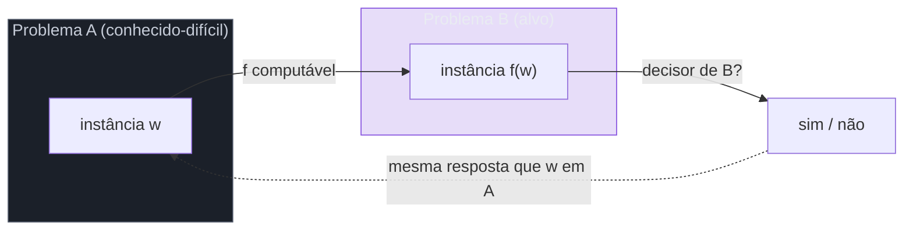
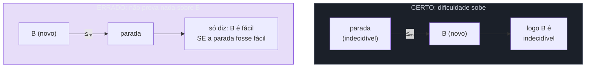
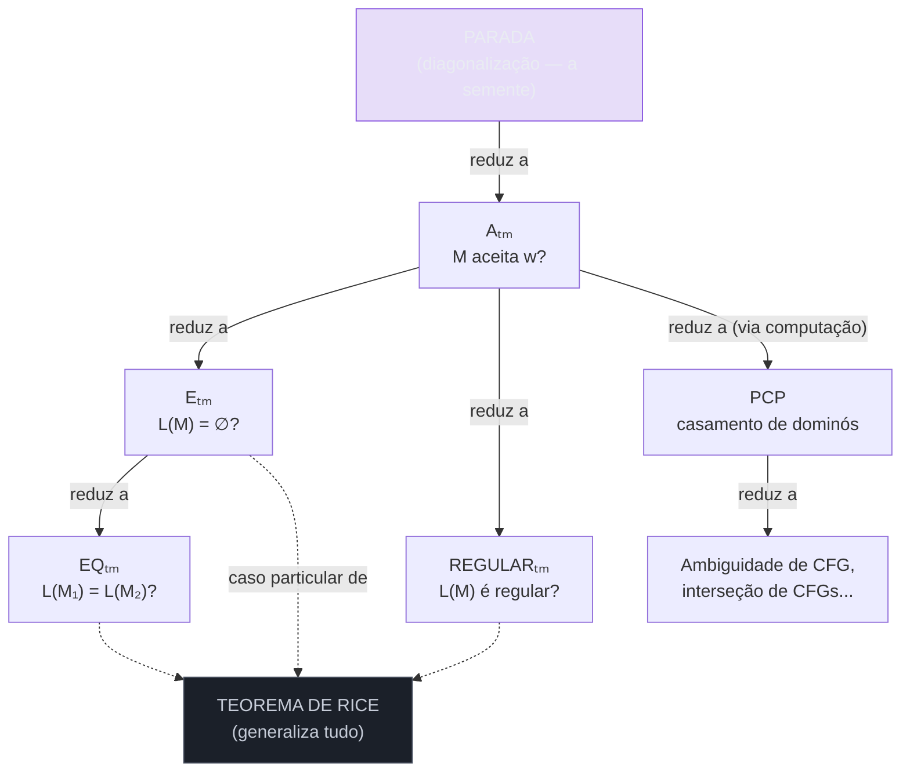

# Reduções e indecidibilidade em cascata

> [!abstract] TL;DR
> Provar que um problema novo é indecidível **do zero** (cavando uma diagonalização nova) é trabalhoso. Existe um atalho: a **redução**. Se eu consigo transformar o [[11 - O problema da parada]] — que **já sei** ser indecidível — num problema B, então B *tem* que ser indecidível também. Senão, eu resolveria a parada usando o decisor de B, e isso é impossível. A indecidibilidade **se propaga por redução**, como uma cascata, a partir de uma única semente: a parada. A mesma ferramenta, exigindo eficiência (polinomial), reaparece na complexidade como NP-completude.

## A ideia-mestra: não cave dois poços

Você já tem um poço cavado: o problema da parada é indecidível, provado com diagonalização (a [[11 - O problema da parada]] mostrou isso). Cavar um segundo poço para um problema novo B significaria montar outra diagonalização do começo. Cansativo, e na maioria das vezes desnecessário.

A jogada esperta é a **redução**: em vez de provar B difícil sozinho, eu mostro que B é *pelo menos tão difícil quanto* a parada. Como ligo os dois? Construo um tradutor: pego qualquer pergunta sobre parada e a reescrevo como uma pergunta sobre B, de modo que a resposta seja a mesma. Se B tivesse um decisor, eu encaixaria o tradutor na frente dele e teria, de graça, um decisor para a parada.

A analogia é direta: **se eu soubesse resolver B, eu saberia resolver a parada.** Mas ninguém sabe resolver a parada. Logo, ninguém sabe resolver B.

> [!tip] A frase que resume tudo
> "Reduzir A a B" = "mostrar que uma solução para B me daria uma solução para A". Você empacota A dentro de B. Se A é impossível, B carrega essa impossibilidade junto.

A semente é a parada. A cascata são todos os problemas que, um a um, herdam a indecidibilidade dela.

Por que isso é tão mais barato? Diagonalização é uma construção *autorreferente* delicada — você fabrica uma máquina que pergunta sobre si mesma e force uma contradição (foi o que [[11 - O problema da parada]] fez). Cada problema novo exigiria reinventar essa autorreferência num contexto diferente. A redução troca esse trabalho por **engenharia de tradução**: você não precisa entender *por que* a parada é difícil, só precisa de uma f que empurre a dificuldade dela para o seu problema. É a diferença entre provar um teorema do zero e *aplicar* um teorema que você já tem.

## A lógica: é uma contrapositiva disfarçada

Toda prova por redução é a mesma contrapositiva. Vamos soletrar, porque a ordem dos passos é onde quase todo mundo tropeça.

1. Suponha, por contradição, que B **é decidível**. Chame o decisor de `R`.
2. Mostre como usar `R` para construir um decisor para a parada (`H`).
3. Mas a parada é indecidível — `H` não pode existir.
4. Contradição. Logo, a suposição do passo 1 é falsa: **B é indecidível.**

Repare que o trabalho de verdade está no passo 2: *construir o decisor da parada a partir do decisor de B*. Esse é o coração de toda redução. Você não prova B difícil diretamente — você empresta a dificuldade já conhecida da parada e a transporta para B.

Uma forma de lembrar a estrutura: a redução é um **argumento condicional encadeado**. "B decidível" implica "parada decidível" (via a construção); mas "parada decidível" é falso; então, pela contrapositiva, "B decidível" é falso. Toda a engenhosidade vive na primeira seta — o resto é lógica proposicional pura. É por isso que, ao revisar uma prova de indecidibilidade, você só precisa auditar uma coisa: *a construção realmente transforma um decisor de B num decisor da parada?* Se sim, a prova está fechada.

> [!warning] O erro número 1: inverter a direção
> A direção da redução é contraintuitiva e derruba quase todo iniciante. Você reduz o problema **conhecido-difícil** (a parada) **AO** problema novo (B). Você **não** reduz B à parada.
>
> A notação ajuda a fixar: **`A ≤ B`** lê-se "A não é mais difícil que B" (A se resolve usando uma solução de B). Então:
> - Se **A é indecidível** e **`A ≤ B`**, conclua que **B é indecidível**. (a dificuldade sobe de A para B)
> - Se você fizer `B ≤ parada`, não provou **nada** sobre B — você só mostrou que B é fácil *se a parada fosse fácil*, e a parada não é.

Pense em `≤` como "delega para": `A ≤ B` significa que A consegue delegar seu trabalho para B. Para herdar dificuldade, você precisa que o problema **difícil** delegue para o **novo**. A parada delega para B ⟹ B é tão duro quanto a parada.

## A forma técnica: redução de mapeamento (many-one)

A versão informal ("se eu soubesse B, saberia a parada") é ótima para a intuição, mas existe uma definição precisa, a **redução de mapeamento** (também chamada *many-one* ou *mapping reducibility*).

> [!note] Definição
> A se reduz por mapeamento a B, escrito **`A ≤ₘ B`**, se existe uma função **computável** f (computável = alguma máquina de Turing que sempre para a calcula) tal que, para toda entrada w:
>
> **w ∈ A ⟺ f(w) ∈ B**
>
> Ou seja, f traduz instâncias de A em instâncias de B **preservando a resposta**: "sim" vira "sim", "não" vira "não".

O que essa definição compra:

- Se **`A ≤ₘ B`** e **B é decidível**, então **A é decidível** (rode f, depois o decisor de B).
- Contrapositiva (a que usamos): se **`A ≤ₘ B`** e **A é indecidível**, então **B é indecidível**.

O detalhe crucial é que f **sempre para**. Ela não decide A nem B — só *traduz*. Toda a dificuldade fica do lado de B; f é o carregador.

> [!note] Mapeamento vs. Turing — duas forças de redução
> A redução de mapeamento (`≤ₘ`) é a mais **restrita**: você chama o decisor de B **uma única vez**, no fim, e devolve a resposta dele sem alterá-la. Existe uma versão mais frouxa, a **redução de Turing** (`≤ᴛ`), onde A pode chamar B quantas vezes quiser, como um oráculo, e combinar as respostas livremente (inclusive negá-las).
>
> Por que insistir na versão restrita? Porque `≤ₘ` preserva também o **complemento**: se `A ≤ₘ B`, então o complemento de A se reduz ao complemento de B. Isso a torna a ferramenta certa para distinguir **reconhecível** de **co-reconhecível** (ver [[10 - Decidível, reconhecível e a máquina universal]]) — uma distinção que a redução de Turing apaga, porque ela pode negar a resposta do oráculo de graça. Para indecidibilidade pura, qualquer uma serve; para o mapa fino de reconhecibilidade, use `≤ₘ`.

**Exemplo mínimo de uma f.** Suponha A = parada e B = "M aceita w?". Dado um par ⟨M, w⟩ de A, construo f(⟨M, w⟩) = ⟨M', w⟩, onde M' é igual a M, mas todo estado em que M *para* vira um estado de *aceitação* em M'. Então M para em w ⟺ M' aceita w. A função f só edita a descrição da máquina — é claramente computável, e preserva a resposta. Pronto: `parada ≤ₘ Aₜₘ`.

### A mecânica visual de uma redução

Antes de mais reduções, fixe o esqueleto. Toda redução de mapeamento tem este formato.



Leitura do diagrama: a função `f` empurra a instância `w` de A para uma instância `f(w)` de B. Se houvesse um decisor de B, ele responderia sobre `f(w)`, e por construção essa é exatamente a resposta de `w` em A (a seta tracejada). Resultado: decidir B decidiria A. Se A é indecidível, o decisor de B não pode existir.

### A direção certa vs. a invertida



Leitura do diagrama: em cima, o caminho correto — a parada (difícil) reduz ao novo B, então B herda a dificuldade. Embaixo, a inversão clássica — reduzir B à parada não diz nada útil, porque a parada nunca é fácil, então a hipótese "se a parada fosse fácil" nunca se realiza. **Sempre coloque o problema já-difícil na cauda da seta `≤ₘ`.**

## O template de uma redução (a receita)

Antes dos exemplos, vale ter a receita na mão. Quase toda redução para provar B indecidível segue cinco passos mecânicos. Memorize-os e você consegue improvisar uma redução nova ao vivo.

1. **Escolha a semente.** Quase sempre Aₜₘ (mais maleável que a parada crua). Você vai assumir um decisor `R` de B e construir um decisor de Aₜₘ.
2. **Assuma `R`.** "Suponha que B é decidível, com decisor `R`."
3. **Construa a redução.** Dada uma instância ⟨M, w⟩ de Aₜₘ, fabrique (sem rodar nada!) uma instância de B — tipicamente uma **máquina nova** M' cuja propriedade-alvo *liga e desliga* conforme M aceita w.
4. **Conecte com o gadget.** Mostre que `R` aplicado à sua instância responde exatamente "M aceita w?". Isso te dá um decisor de Aₜₘ.
5. **Colha a contradição.** Aₜₘ é indecidível ⟹ `R` não existe ⟹ B é indecidível.

O passo 3 é onde mora a criatividade: o **gadget**. Você constrói uma máquina cujo comportamento codifica a pergunta sobre M. Veja, nos exemplos abaixo, como o mesmo gadget ("simule M em w internamente, e amarre a saída à propriedade que B mede") reaparece com pequenas variações.

## Exemplos clássicos trabalhados

Vamos pendurar problemas reais na cascata. Cada um herda a indecidibilidade do anterior, sempre seguindo a receita acima.

### 1. Aₜₘ — aceitação

**Aₜₘ = { ⟨M, w⟩ : M é uma TM e M aceita w }.** "Essa máquina aceita essa entrada?"

Aₜₘ é o problema mais próximo da parada — praticamente a parada com aceitação em vez de só parar. Já vimos a redução `parada ≤ₘ Aₜₘ` acima (transformando estados de parada em estados de aceitação). E na outra direção também vale `Aₜₘ ≤ₘ parada`: dado ⟨M, w⟩, construa M'' que simula M em w e só para se M aceitar (entrando em loop se M rejeitar). Então M aceita w ⟺ M'' para em w. As duas são equivalentes em dificuldade. **Aₜₘ é indecidível.** É a nova semente que costumamos usar nas reduções seguintes, porque é mais fácil de manipular que a parada crua.

> [!info] Aₜₘ é reconhecível, mas não co-reconhecível
> Aₜₘ é Turing-**reconhecível** (a máquina universal simula M em w e aceita se M aceitar — ver [[10 - Decidível, reconhecível e a máquina universal]]). Mas seu complemento não é. Esse desbalanço é a fonte concreta da indecidibilidade: um problema só é **decidível** quando ele *e* seu complemento são reconhecíveis.

### 2. Eₜₘ — vacuidade (a linguagem é vazia?)

**Eₜₘ = { ⟨M⟩ : M é uma TM e L(M) = ∅ }.** "Essa máquina rejeita absolutamente toda entrada?"

Provamos por redução de Aₜₘ. A direção: **`Aₜₘ ≤ₘ complemento de Eₜₘ`** (ou, equivalente em conclusão, mostramos que decidir Eₜₘ decidiria Aₜₘ).

**Construção de f.** Dado ⟨M, w⟩, eu fabrico uma nova máquina **M₁** com este comportamento, "grudado" em w:

> M₁ recebe uma entrada x qualquer:
> - se x ≠ w, M₁ rejeita imediatamente;
> - se x = w, M₁ simula M em w e aceita se M aceitar.

Repare o truque: M₁ ignora a própria entrada e sempre testa o **mesmo w fixo**. Então a linguagem de M₁ é:

- **{w}** se M aceita w (M₁ aceita exatamente a string w);
- **∅** se M não aceita w (M₁ não aceita nada).

Logo: **L(M₁) ≠ ∅ ⟺ M aceita w.** Se eu tivesse um decisor `R` para Eₜₘ, eu construiria M₁ a partir de ⟨M, w⟩, rodaria `R` em ⟨M₁⟩, e inverteria a resposta — isso decidiria Aₜₘ. Mas Aₜₘ é indecidível. **Eₜₘ é indecidível.**

A peça reutilizável aqui — "construir uma máquina que codifica uma pergunta sobre M dentro da própria *linguagem* dela" — é o motor de quase toda redução sobre comportamento. Guarde.

> [!warning] O detalhe que a maioria erra: f não roda nada
> Olhe de novo a construção de M₁. A função f **não simula** M em w. Ela apenas *escreve a descrição* de uma máquina nova (uma string ⟨M₁⟩) e a entrega. Editar texto sempre para — por isso f é computável, mesmo que M₁ depois rode para sempre. Se f tentasse "rodar M em w para ver o que dá", ela mesma poderia não parar, e aí não seria uma redução de mapeamento válida. **A regra de ouro: f manipula descrições de máquinas como dados, nunca as executa.**

### 2b. REGULARₜₘ — a linguagem de M é regular?

**REGULARₜₘ = { ⟨M⟩ : L(M) é uma linguagem regular }.** Uma pergunta de aparência inocente — "essa máquina, no fundo, só reconhece um padrão simples que um DFA também reconheceria?" (regularidade no sentido de [[04 - Linguagens regulares e expressões regulares]]).

**Construção de f.** Dado ⟨M, w⟩, construa M₂ que, numa entrada x:
> - se x tem a forma `0ⁿ1ⁿ` (uma linguagem famosamente **não-regular**), M₂ aceita de imediato;
> - caso contrário, M₂ simula M em w e aceita x se M aceitar w.

Resultado:
- se **M aceita w**, M₂ aceita *tudo* (Σ\*), que é regular;
- se **M não aceita w**, M₂ aceita apenas `{0ⁿ1ⁿ}`, que **não** é regular.

Logo **L(M₂) é regular ⟺ M aceita w**. Um decisor de REGULARₜₘ decidiria Aₜₘ. **REGULARₜₘ é indecidível.** O truque-chave: misturar uma linguagem não-regular fixa com o "interruptor" M-aceita-w, de modo que a resposta de M empurra L(M₂) para dentro ou para fora da classe regular. É a mesma família de truques de Eₜₘ, calibrada para outra propriedade.

### 3. EQₜₘ — equivalência (duas máquinas, mesma linguagem?)

**EQₜₘ = { ⟨M₁, M₂⟩ : L(M₁) = L(M₂) }.** "Essas duas máquinas reconhecem exatamente a mesma linguagem?"

Aqui a redução é elegante, porque **`Eₜₘ ≤ₘ EQₜₘ`** sai quase de graça. Vacuidade é só um caso particular de equivalência: perguntar "L(M) = ∅?" é perguntar "L(M) = L(M_vazia)?", onde M_vazia é uma máquina trivial que rejeita tudo.

**Construção de f.** Dado ⟨M⟩, produza ⟨M, M_vazia⟩, com M_vazia uma TM fixa que rejeita toda entrada (L(M_vazia) = ∅). Então:

**L(M) = ∅ ⟺ L(M) = L(M_vazia) ⟺ ⟨M, M_vazia⟩ ∈ EQₜₘ.**

A resposta de Eₜₘ vira a resposta de EQₜₘ. Como Eₜₘ é indecidível e `Eₜₘ ≤ₘ EQₜₘ`, **EQₜₘ é indecidível.** Note a cadeia: parada → Aₜₘ → Eₜₘ → EQₜₘ. Cada elo é uma f computável que carrega a dificuldade adiante.

> [!info] EQₜₘ é ainda "pior": nem reconhecível, nem co-reconhecível
> Aₜₘ e Eₜₘ são indecidíveis mas pelo menos um lado é reconhecível (Aₜₘ é reconhecível; o complemento de Eₜₘ é reconhecível). EQₜₘ é mais profundo: dá para mostrar que **tanto Aₜₘ quanto seu complemento se reduzem a EQₜₘ**. Como Aₜₘ não é co-reconhecível e seu complemento não é reconhecível, EQₜₘ falha nos *dois* testes — não é reconhecível nem co-reconhecível. Em termos da hierarquia de reconhecibilidade de [[10 - Decidível, reconhecível e a máquina universal]], EQₜₘ mora um andar acima de Aₜₘ e Eₜₘ. Lição: a redução não só prova "indecidível"; o *par* de reduções (problema e complemento) mede *quão* indecidível.

### 4. PCP — o quebra-cabeça de dominós

E agora o exemplo mais divertido: um problema que **não parece nem de longe** sobre máquinas, mas é indecidível do mesmo jeito.

O **Problema da Correspondência de Post** (PCP, de Emil Post, 1946) é um jogo de dominós. Você recebe uma coleção finita de peças, cada uma com uma string em cima e uma embaixo:

```
[ a   ] [ ab  ] [ bba ]
[ baa ] [ aa  ] [ bb  ]
```

A pergunta: existe uma sequência dessas peças (repetições permitidas) tal que, lendo todos os topos em ordem, eu obtenho **exatamente** a mesma string que lendo todos os fundos?

No exemplo, a sequência peça-3, peça-2, peça-3, peça-1 dá:
- topo: `bba · ab · bba · a` = `bbaabbbaa`
- fundo: `bb · aa · bb · baa` = `bbaabbbaa` ✓

Achou um casamento. Mas para outras coleções **não existe** sequência alguma — e descobrir se existe, no caso geral, é **indecidível**. Prova-se reduzindo Aₜₘ ao PCP: codifica-se toda a *computação* de uma TM como dominós, onde um casamento existe se e só se a máquina aceita. O cálculo passo-a-passo da máquina vira o encaixe dos topos com os fundos.

> [!example] Por que o PCP importa
> Ele rompe a ilusão de que "indecidível = problema sobre máquinas se analisando". Um quebra-cabeça de strings, sem nenhuma TM à vista, é tão indecidível quanto a parada. A indecidibilidade não mora nas máquinas — mora na *expressividade computacional* do problema. Por ser puramente combinatório, o PCP é a ponte favorita para provar indecidibilidade em **gramáticas** (ambiguidade de gramáticas livres de contexto, interseção vazia de duas CFGs — ver [[06 - Autômatos de pilha e gramáticas livres de contexto]]) sem mexer com máquinas diretamente.

## A cascata inteira

Agora dá pra ver o desenho de cima.



Leitura do diagrama: a parada está na raiz, vermelha — é a única coisa provada *do zero*, com diagonalização. Todo o resto pendura dela por reduções (setas sólidas = "reduz a", a dificuldade descendo pela árvore). E perceba o nó azul: praticamente toda pergunta interessante sobre o **comportamento** de uma máquina (sua linguagem é vazia? é regular? é igual à de outra?) acaba indecidível. Não é coincidência — o [[13 - O teorema de Rice]] **generaliza** isso de uma vez: *qualquer* propriedade não-trivial da linguagem de uma máquina é indecidível. Rice é a cascata inteira provada num teorema só.

Note também que a cascata tem **ramos laterais**: do PCP descem problemas sobre gramáticas (ambiguidade, interseção vazia de CFGs), que nem mencionam máquinas. Isso ilustra que a indecidibilidade não é um clube fechado de "problemas sobre TMs" — ela escorre para qualquer formalismo expressivo o bastante para *simular* computação. Gramáticas livres de contexto, sistemas de reescrita, até certos sistemas de tipos de linguagens reais: assim que algo é Turing-completo o suficiente, a parada acha um caminho para dentro.

> [!tip] Quando usar Rice e quando usar redução
> Para propriedades **da linguagem** de uma TM (semânticas, não-triviais), invoque Rice direto — é um martelo único. Para problemas que **não** são "propriedade de L(M)" (PCP, equivalência entre objetos, ambiguidade de gramática), você ainda precisa construir a redução à mão. Rice cobre a coluna de Eₜₘ/REGULARₜₘ; não cobre o PCP.

> [!danger] Um "quase-erro" que parece prova mas não é
> Suponha que alguém tente "provar" Eₜₘ indecidível assim: "dado ⟨M⟩, eu rodo M em todas as entradas; se nenhuma é aceita, L(M) = ∅". O furo está na construção da função: rodar M em todas as entradas **não para** (são infinitas entradas, e M pode entrar em loop em qualquer uma). Isso não é uma f computável — é uma busca infinita. A redução correta (a da máquina M₁ com w fixo) nunca executa M dentro de f; ela só *escreve* a descrição de M₁. Sempre desconfie de uma redução que precisa "simular até o fim" ou "testar todas as entradas" — essas são as marcas de uma f que não para.

## A mesma ferramenta na face de complexidade

Aqui está a economia conceitual mais importante do galho inteiro: **redução é o conceito mais reutilizado da teoria da computação**, e ele aparece em dois andares.

| Andar | O que a redução preserva | Restrição sobre f | Conceito-alvo |
|---|---|---|---|
| Computabilidade (aqui) | **decidibilidade** | f só precisa ser computável (pode ser lenta) | indecidibilidade |
| Complexidade (adiante) | **tratabilidade** | f precisa ser **eficiente** (tempo polinomial) | NP-completude |

No andar de baixo (computabilidade), tudo o que importa é que f *exista* e *pare* — ela pode levar um tempo astronômico, ninguém liga. O jogo é "decidível ou não".

No andar de cima (complexidade), o jogo muda para "rápido ou lento", então a tradução f **tem que ser barata** — senão ela esconderia o custo do problema. Imagine reduzir A a B com uma f que leva tempo exponencial: mesmo que B fosse resolvido em tempo linear, o pipeline `f depois decisor-de-B` seria exponencial por culpa de f. A conclusão sobre tratabilidade evaporaria. Por isso, na complexidade, f **precisa** rodar em tempo polinomial; só assim "B é fácil ⟹ A é fácil" sobrevive.

Reduções polinomiais (`≤ₚ`) são o que define **NP-completude**: um problema é NP-completo se ele está em NP **e** *todo* problema de NP se reduz a ele em tempo polinomial. A cadeia de Karp, que parte de SAT (via Cook-Levin), é a versão "complexidade" desta mesma cascata — SAT no lugar da parada como semente, `≤ₚ` no lugar de `≤ₘ` como aresta. Ver [[15 - NP-completude - Cook-Levin e a cadeia de Karp]] e a formalização de classes em [[14 - Complexidade computacional formal - classes de tempo, P e NP]].

> [!note] Mesma melodia, outro tom
> Indecidibilidade: "se eu decidisse B, decidiria a parada". NP-completude: "se eu resolvesse B *rápido*, resolveria SAT *rápido*". Mesma estrutura — empacotar um problema-âncora dentro do alvo — com a palavra "rápido" inserida. Quem domina a redução na computabilidade já tem 80% da intuição de NP-completude.

Há uma simetria estrutural que vale guardar como cola mental:

| | Computabilidade | Complexidade |
|---|---|---|
| Semente provada do zero | a parada (diagonalização) | SAT (teorema de Cook-Levin) |
| Aresta da cascata | `≤ₘ` (f computável) | `≤ₚ` (f polinomial) |
| Propriedade que herda | indecidibilidade | NP-dificuldade |
| Pergunta de fundo | "decidível ou não?" | "P ou não-P?" |
| Teorema-guarda-chuva | Rice | (nenhum equivalente — por isso provas de NP-dificuldade ainda são artesanais) |

A última linha é reveladora: na computabilidade, Rice te dá um atalho universal para uma família inteira de problemas. Na complexidade, **não existe** um "Rice da NP-dificuldade" — cada redução polinomial ainda é uma construção engenhosa, feita à mão. É por isso que catálogos como o de Garey & Johnson (centenas de problemas NP-completos, cada um com sua redução) são tão valiosos.

## Mapa rápido: qual semente usar

Quando você precisar provar um problema novo indecidível, escolher a semente certa economiza esforço. Um guia prático:

- **Pergunta sobre "essa máquina aceita / para nessa entrada"?** Reduza direto da **parada** ou de **Aₜₘ**. São quase a mesma coisa; Aₜₘ é o ponto de partida default.
- **Pergunta sobre uma propriedade da *linguagem* de M** (vazia, regular, finita, contém uma string específica, etc.)? Use o gadget "M com w fixo" para reduzir de **Aₜₘ** — ou, se a propriedade é não-trivial, invoque [[13 - O teorema de Rice]] e pule a construção inteira.
- **Pergunta comparando dois objetos** (duas máquinas equivalentes? duas gramáticas geram o mesmo?)? Reduza do caso "vazio" correspondente (**Eₜₘ** → **EQₜₘ**), que costuma ser um caso particular.
- **Pergunta combinatória sem máquinas à vista** (dominós, tiles, gramáticas)? **PCP** é a semente — codifique a computação como casamento de strings.

A regra meta: sempre reduza *do problema mais parecido com o seu que você já sabe ser indecidível*. Quanto mais perto a semente, mais simples o gadget.

## Resgate prático: por que isso aparece no seu dia

Soa abstrato, mas você esbarra na cascata toda semana, escondida em ferramentas:

- **"Esses dois trechos de código / essas duas queries são equivalentes?"** — é EQₜₘ. Indecidível no caso geral. Por isso compiladores e otimizadores de query não prometem detectar *toda* equivalência; eles aplicam regras conservadoras.
- **"Esse estado / esse ramo é inalcançável (código morto)?"** — pergunta sobre comportamento de programa, cai na cascata. Linters acusam *alguns* casos óbvios e silenciam no resto. Eles têm que: provar todos seria decidir a parada.
- **"Esse programa termina para toda entrada?"** — é literalmente a parada. Nenhum verificador total existe.
- **"Esse valor pode ser nulo aqui? esse cast é sempre seguro? esse índice nunca estoura?"** — perguntas sobre o conjunto de estados alcançáveis em runtime. Cada uma é uma propriedade do comportamento do programa, indecidível no geral. É por isso que type systems e verificadores de null-safety te obrigam a *anotar* intenção: eles não conseguem descobrir tudo sozinhos, então transferem parte da prova para você.

> [!tip] O reflexo de engenharia
> Como a resposta exata é indecidível, as ferramentas **aproximam por um dos lados**:
> - **Por cima (over-approximation):** "pode ter bug" — pega todos os casos reais mas dá falsos positivos (linters paranoicos, type checkers conservadores).
> - **Por baixo (under-approximation):** "tenho certeza que é seguro" — nunca erra ao afirmar, mas perde casos (testes, análises otimistas).
>
> Nenhuma acerta os dois lados ao mesmo tempo — porque isso seria decidir o indecidível. Quando uma ferramenta de análise estática te dá um aviso "não tenho como saber", ela não é preguiçosa: ela está esbarrando nesta cascata.

## O que levar deste capítulo

Se você sair daqui com uma única ideia, que seja esta: **redução é como o conhecimento sobre dificuldade se move**. Você não prova cada problema difícil isoladamente — você prova *um* (a parada), e depois "empurra" essa dificuldade para todos os outros por traduções computáveis. A cascata é o mapa dessa propagação.

E a recompensa de fechar este conceito é dupla. Primeiro, você ganha um teste rápido de sanidade para qualquer ferramenta de análise de programas: se ela promete decidir uma propriedade não-trivial do *comportamento* de código arbitrário, ou ela mente, ou ela aproxima por um lado. Segundo, você sai pronto para o salto de andar — quando [[15 - NP-completude - Cook-Levin e a cadeia de Karp]] aparecer, a redução já não será novidade; só a palavra "polinomial" vai ser nova.

## Em entrevista

Frases prontas, em registro natural:

- "To prove a new problem **B** is undecidable, I **reduce a known undecidable problem to B** — usually `Aₜₘ` or the halting problem. The direction matters: the hard problem reduces *to* B, not the other way around."
- "**`A ≤ₘ B`** means a computable function maps instances of A to instances of B preserving the answer. If A is undecidable and `A ≤ₘ B`, then B is undecidable — otherwise B's decider would decide A."
- "**Emptiness** (`Eₜₘ`) is undecidable: I build a machine whose language is `{w}` if M accepts w and `∅` otherwise, so deciding emptiness would decide acceptance."
- "**Equivalence** (`EQₜₘ`) is undecidable because emptiness reduces to it — emptiness is just equivalence to a machine that rejects everything."
- "The **Post Correspondence Problem** shows undecidability isn't about machines — it's a string-tiling puzzle, yet it's undecidable, proved by encoding a TM's computation as dominoes."
- "**Rice's theorem** generalizes the whole cascade: *any* non-trivial property of a TM's language is undecidable."
- "The same reduction idea powers **NP-completeness** — but there the reduction must run in polynomial time, so it preserves *tractability* instead of *decidability*."
- "The key gotcha: the reduction function **never runs** the machine — it only *constructs a description*, so it always halts and stays computable."
- "Mapping reduction is stricter than **Turing reduction**: it calls the decider once and can't negate the answer, which is exactly what lets it separate recognizable from co-recognizable."

| PT | EN |
|---|---|
| redução | reduction |
| redução de mapeamento (many-one) | mapping reduction (many-one) |
| reduzir A a B | to reduce A to B |
| preservar a resposta | to preserve the answer |
| função computável | computable function |
| indecidível | undecidable |
| problema da parada | halting problem |
| vacuidade (linguagem vazia) | emptiness |
| equivalência | equivalence |
| problema da correspondência de Post | Post Correspondence Problem (PCP) |
| casamento (de dominós) | match |
| propriedade não-trivial | non-trivial property |
| código morto / inalcançável | dead / unreachable code |
| aproximação por cima / por baixo | over- / under-approximation |
| análise conservadora | conservative analysis |
| redução de Turing (oráculo) | Turing reduction (oracle) |
| reconhecível / co-reconhecível | recognizable / co-recognizable |
| construção (gadget) | construction (gadget) |
| problema-âncora / semente | anchor problem / seed |

> [!info] Lastro
> - **Michael Sipser**, *Introduction to the Theory of Computation* — cap. 5, "Reducibility" (5.1 problemas indecidíveis via redução: Aₜₘ, Eₜₘ, EQₜₘ; 5.2 o PCP; 5.3 redução de mapeamento, `≤ₘ`).
> - **John Hopcroft, Rajeev Motwani & Jeffrey Ullman**, *Introduction to Automata Theory, Languages, and Computation* — cap. 8–9 (indecidibilidade e o problema de Post).
> - **Emil Post (1946)**, "A variant of a recursively unsolvable problem" — origem do Problema da Correspondência de Post.
> - **Michael Garey & David Johnson**, *Computers and Intractability: A Guide to the Theory of NP-Completeness* (1979) — o catálogo clássico de reduções polinomiais, referência para a face de complexidade da mesma ferramenta.
