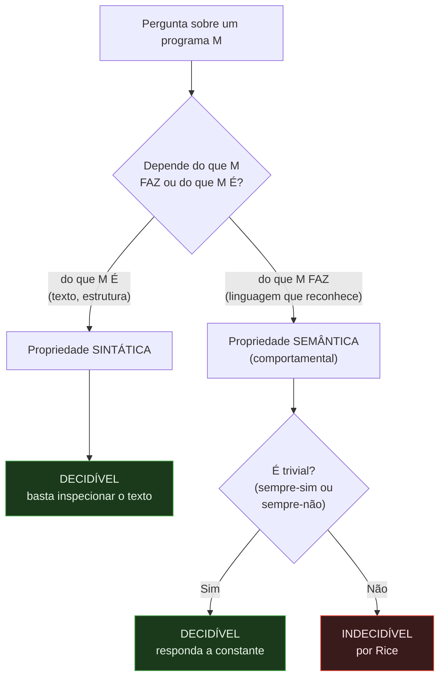
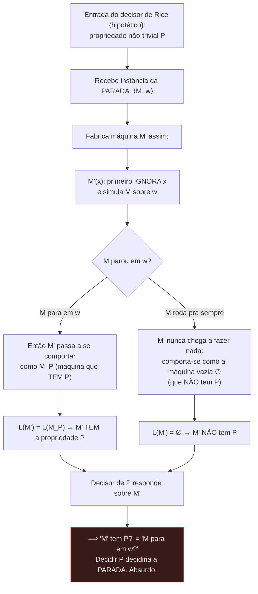
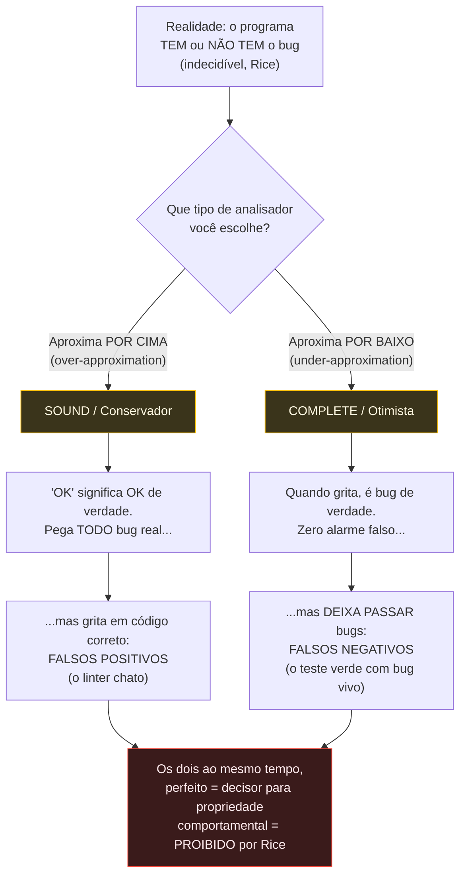
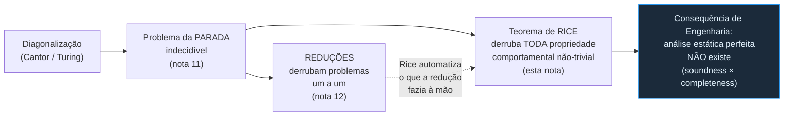

# O teorema de Rice

> [!abstract] TL;DR
> O [[11 - O problema da parada]] te disse que UMA pergunta sobre programas é indecidível. O teorema de Rice (1953) é a generalização brutal: **toda propriedade não-trivial do COMPORTAMENTO de um programa é indecidível**. "Esse código sempre retorna 0?", "reconhece a linguagem vazia?", "esses dois programas são equivalentes?", "nunca acessa null?" — tudo indecidível, de uma vez só, sem precisar fazer a redução caso a caso. A pegadinha que separa júnior de sênior: Rice fala do que o programa **faz** (semântica), não do que ele **é** (sintaxe). "Tem mais de 100 linhas?" é decidível — é só olhar o texto. O resgate prático: Rice é a razão matemática de por que **análise estática perfeita não existe**. Todo linter, type-checker, verificador e detector de bug é OU incompleto OU conservador. Nunca perfeito. Esse é o ouro desta nota.

## A intuição antes do enunciado

Imagine que você tem um detector mágico de propriedades de programas. Você aponta ele pra qualquer código e pergunta: "esse programa sempre termina retornando zero?". O detector cospe SIM ou NÃO, sempre, em tempo finito.

Rice diz: esse detector não existe. E não existe pra QUASE qualquer pergunta que você possa fazer sobre o que o programa **faz**.

Não é uma pergunta específica que é difícil. É uma família inteira de perguntas — todas as perguntas sobre comportamento que não sejam triviais — que são *simultaneamente* impossíveis de responder por algoritmo. Henry Gordon Rice provou isso em 1953, e a prova é tão genérica que dispensa atacar cada propriedade individualmente.

Pense assim. A [[11 - O problema da parada]] era uma única pedra indecidível. O [[12 - Reduções e indecidibilidade em cascata]] mostrou como, a partir dela, derrubar outras pedras uma a uma, por redução. O teorema de Rice é a avalanche: prova que TODA a encosta é instável, num golpe só.

### Uma analogia: o crítico que só lê a contracapa

Imagine um crítico literário que jurou nunca abrir o livro — só lê a contracapa, a ficha catalográfica, conta as páginas. Pergunte a ele "esse livro tem mais de 300 páginas?", "está escrito em português?", "tem ISBN?" e ele responde na lata, sempre certo. Essas são as perguntas **sintáticas**: sobre o objeto físico, o texto, a forma.

Agora pergunte "esse livro é uma boa história?", "o final faz sentido com o começo?", "essa trama é a mesma daquele outro romance, só com nomes trocados?". O crítico de contracapa não tem como responder — essas perguntas são sobre o **conteúdo**, sobre o que o livro *significa*, e pra isso ele teria que ler tudo (e quem sabe ainda ficar em dúvida). Essas são as perguntas **semânticas**.

Rice é o teorema que diz: pra programas, a versão automática do crítico — um algoritmo — está *eternamente* condenada a só conseguir responder as perguntas de contracapa. Qualquer pergunta sobre o que o programa "significa" (o que ele computa) está fora de alcance, contanto que a pergunta seja interessante o bastante pra distinguir um programa de outro.

## O enunciado

> [!quote] Teorema de Rice (1953)
> Seja P uma propriedade das **linguagens reconhecíveis** (equivalentemente: do comportamento das máquinas de Turing). Se P é **não-trivial**, então o problema de decidir se uma máquina M tem a propriedade P é **indecidível**.

Duas hipóteses fazem o teorema funcionar. Memorize-as como um par, porque cada palavra carrega peso:

1. **Propriedade do comportamento** (semântica): P fala da *linguagem* que M reconhece — o conjunto de entradas que M aceita — e não do texto, do tamanho, ou da estrutura de M. Se M₁ e M₂ reconhecem a mesma linguagem, P vale pra ambas ou pra nenhuma.
2. **Não-trivial**: existe pelo menos uma máquina que TEM a propriedade e pelo menos uma que NÃO tem. Ou seja, P não é nem sempre-verdadeira nem sempre-falsa.

Exemplos de propriedades comportamentais não-triviais (todas indecidíveis):

- "M reconhece a linguagem vazia ∅?" (o programa rejeita TODA entrada?)
- "M sempre retorna 0?"
- "M aceita a string `42`?"
- "M reconhece uma linguagem regular?"
- "M₁ e M₂ são equivalentes (reconhecem a mesma linguagem)?"
- "M nunca entra em loop infinito em nenhuma entrada?"
- "M nunca acessa memória inválida em nenhuma execução?"

Todas indecidíveis. Não porque alguém tentou e falhou — porque Rice provou que tentar é matematicamente fútil.

## A distinção CRUCIAL: comportamento × texto

Aqui mora o erro de quem leu Rice de leve. Rice **não** diz que tudo sobre programas é indecidível. Ele diz que tudo sobre o **comportamento** é. Há um universo inteiro de perguntas **sintáticas** — sobre o programa como objeto de texto — que são perfeitamente decidíveis.

A régua é simples: a propriedade depende do que o programa **faz** (rode-o mentalmente, observe a saída) ou do que o programa **é** (leia o código-fonte, conte, procure padrões)?

| Pergunta | Tipo | Decidível? | Por quê |
| --- | --- | --- | --- |
| "O programa tem mais de 100 linhas?" | Sintática | **Sim** | Conta as linhas do texto |
| "Usa a palavra-chave `goto`?" | Sintática | **Sim** | Busca uma substring |
| "Tem três loops `for` aninhados?" | Sintática | **Sim** | Faz parse da árvore sintática |
| "Compila sem erro de tipo?" | Sintática | **Sim** | Type systems decidíveis são feitos pra isso |
| "Sempre retorna 0?" | Comportamental | **Não** | Depende do que ele computa em toda entrada |
| "Reconhece a linguagem vazia?" | Comportamental | **Não** | Depende de quais entradas ele aceita |
| "É equivalente a este outro programa?" | Comportamental | **Não** | Depende do comportamento de ambos |
| "Sempre termina?" | Comportamental | **Não** | É a própria parada (caso particular) |

> [!warning] A armadilha do "mas dá pra ver no código"
> "Ora, `goto` eu vejo no texto, mas e 'esse programa tem código morto'? Também olho o texto!" — Cuidado. *Código inalcançável* é comportamental, não sintático. Um trecho é morto se NENHUMA execução jamais o atinge, e isso depende dos valores que as condições assumem em runtime — o que depende do comportamento. Você pode ver o trecho no texto, mas decidir se ele é alcançável exige saber se algum caminho de execução chega lá. Indecidível. A régua não é "consigo ver no editor?". É "depende do que o programa faz?".



> [!note] Leitura do diagrama
> Toda pergunta sobre um programa cai numa de três caixas. **Sintática** → decidível, sempre (é só ler o texto). **Semântica trivial** → decidível (a resposta é uma constante, então o "algoritmo" é `return SIM`). **Semântica não-trivial** → indecidível, por Rice. As duas saídas verdes são as fugas; tudo que não foge cai na caixa vermelha. Note que a esmagadora maioria das perguntas *interessantes* sobre código ("isso tá correto?", "isso pode crashar?") é semântica e não-trivial. Daí a tragédia.

## Por que cada hipótese importa (com contraexemplo)

Tirar qualquer uma das duas hipóteses quebra o teorema. Vamos ver por quê.

### Por que "não-trivial"?

Propriedades triviais são decidíveis — e isso é óbvio quando você olha de perto.

- **Sempre-verdadeira**: "M reconhece *alguma* linguagem reconhecível?" Toda máquina de Turing reconhece alguma linguagem reconhecível (por definição). A resposta é sempre SIM. O algoritmo decisor é `return true`. Roda em tempo zero, nunca erra. Decidível.
- **Sempre-falsa**: "M reconhece uma linguagem que não é reconhecível?" Impossível por definição. Resposta sempre NÃO. Decisor: `return false`. Decidível.

A trivialidade é a tábua de salvação: se a propriedade não distingue nenhuma máquina de nenhuma outra, você não precisa olhar a máquina — a resposta já está decidida. É exatamente porque a propriedade *não-trivial* obriga você a distinguir comportamentos que ela vira indecidível.

### Por que "comportamento" (semântica)?

Propriedades sintáticas escapam porque você não precisa simular o programa — basta lê-lo.

- "M tem mais de 50 estados?" Conta os estados na descrição de M. Decidível, e trivialmente.
- "A descrição de M contém uma transição específica?" Busca no texto. Decidível.

A diferença filosófica: a sintaxe é **finita e estática** — está toda lá, no texto, disponível pra inspeção. A semântica é **infinita e dinâmica** — para conhecê-la você teria, no pior caso, que rodar M sobre infinitas entradas, e a parada já te disse que nem rodar até o fim você consegue garantir.

> [!question] "Mas e otimizar o compilador? Ele 'entende' o que o programa faz!"
> Boa pergunta — e a resposta afia o conceito. O compilador NÃO decide propriedades semânticas exatas; ele usa aproximações **conservadoras** (sound). Quando o GCC elimina uma subexpressão comum ou faz constant folding, ele só faz a transformação quando consegue *provar* que ela preserva o comportamento — e nos casos em que não consegue provar, ele simplesmente não otimiza. Ele nunca arrisca. É exatamente por isso que existe código que *poderia* ser otimizado e não é: o compilador não conseguiu provar a equivalência (que, por Rice, é indecidível no geral), então jogou pelo seguro. O compilador convive com Rice escolhendo errar pro lado seguro — abdicando de otimizações que não consegue justificar.

## A prova (esboço): reduzir a parada à propriedade P

Não vamos provar o caso geral em todo rigor, mas o esqueleto é elegante e cai em entrevista. A estratégia é a mesma do [[12 - Reduções e indecidibilidade em cascata]]: **redução** a partir da parada (Aₜₘ, a linguagem da aceitação).

Suponha, por absurdo, que existe um decisor R para a propriedade P. Vamos usar R pra construir um decisor pra parada — o que é impossível. Logo R não existe.

Seja P não-trivial. Sem perda de generalidade, assuma que a máquina que reconhece ∅ (a "máquina vazia", que não aceita nada) **não** tem a propriedade P. (Se tiver, troque P por ¬P; uma das duas não vale pra ∅, e provar a indecidibilidade de uma prova a da outra.) Como P é não-trivial, existe alguma máquina M_P que **tem** a propriedade P.

Agora a peça-chave — a **máquina fabricada**. Dado um par ⟨M, w⟩ (a entrada da parada: M para em w?), construímos uma nova máquina M' que, ao receber uma entrada x, faz o seguinte:



> [!note] Leitura do diagrama
> A máquina fabricada M' tem um truque: ela ignora a própria entrada x e primeiro tenta simular M sobre w. Só DEPOIS que essa simulação parar é que M' começa a agir como M_P (a testemunha que tem P). Resultado: se M para em w, a simulação termina e M' herda o comportamento de M_P → tem P. Se M roda pra sempre, M' fica presa na simulação, nunca aceita nada, comporta-se como a máquina vazia ∅ → não tem P. Acoplamos o comportamento de M' à parada de M. Então perguntar "M' tem P?" é, secretamente, perguntar "M para em w?". Se P fosse decidível, a parada seria decidível. Contradição. Q.E.D.

A redução, escrita como função: existe um procedimento f que, dado ⟨M, w⟩, produz a descrição de M' — e f é computável (é só montar o texto da máquina M' que "simula M sobre w, depois roda M_P"). Essa f mapeia:

- ⟨M, w⟩ onde **M para em w** ⟼ M' com L(M') = L(M_P), que **tem** P.
- ⟨M, w⟩ onde **M não para em w** ⟼ M' com L(M') = ∅, que **não tem** P.

Logo ⟨M, w⟩ ∈ Aₜₘ se e somente se M' tem P. Se houvesse decisor pra P, compor com f daria decisor pra Aₜₘ — que não existe. Essa é a redução de mapeamento (many-one reduction) Aₜₘ ≤ₘ P por trás da prova. Limpinha.

> [!tip] O que Rice te poupa
> No [[12 - Reduções e indecidibilidade em cascata]] você faz UMA redução pra cada problema novo que quer provar indecidível. É artesanal. Rice é a fábrica: prova de uma vez que TODA propriedade comportamental não-trivial é indecidível. Em vez de "vou reduzir a parada a *esse* problema específico", você diz "essa propriedade é semântica e não-trivial, logo Rice → indecidível. Pronto." É um teorema-atalho.

> [!abstract] Nota histórica e um primo mais forte
> Henry Gordon Rice provou o teorema na sua tese e o publicou em 1953, em "Classes of recursively enumerable sets and their decision problems". Na linguagem original ele fala de *conjuntos recursivamente enumeráveis* (= linguagens reconhecíveis) e suas propriedades — a versão "programa/comportamento" é a tradução moderna pra nós. Há um irmão mais forte, o **teorema de Rice–Shapiro**, que caracteriza *quais* propriedades de linguagens reconhecíveis são sequer semidecidíveis (reconhecíveis) — útil quando você quer saber não só "é indecidível?" mas "dá ao menos pra reconhecer um dos lados?". Pra entrevista, Rice puro basta; Rice–Shapiro é cultura extra.

### Por que o "sem perda de generalidade" não é trapaça

Aquele passo "assuma que ∅ não tem P; se tiver, troque P por ¬P" costuma soar como mágica. Não é. A ideia: decidir P e decidir ¬P são o mesmo problema de dificuldade — se eu tenho um decisor pra P, basta inverter a resposta pra ter um decisor pra ¬P. Então, ao provar a indecidibilidade de uma, provo automaticamente a da outra. Como P é não-trivial, ∅ pertence a exatamente um dos dois lados (ou tem P, ou tem ¬P). Pego o lado em que ∅ *não* satisfaz a propriedade, faço a redução com esse lado, e a conclusão vale pros dois. É um truque de simetria, não um buraco no argumento.

### Casos de fronteira que confundem (e como classificá-los)

A parte mais traiçoeira de Rice é classificar uma propriedade certa. Treine com estes pares quase-idênticos cujo veredito muda:

- **"O código-fonte de M contém um loop infinito sintático tipo `while(true)`?"** → **decidível** (sintático: procura o padrão). Mas **"M entra em loop infinito em alguma execução?"** → **indecidível** (semântico: é a parada disfarçada). O mesmo `while(true)` pode estar dentro de um `if` que nunca dispara.
- **"M tem código depois de um `return` incondicional?"** → **decidível** (sintático: o trecho vem textualmente após o return). Mas **"M tem código que nenhuma execução alcança?"** → **indecidível** (semântico: alcançabilidade depende do comportamento).
- **"M chama a função `delete`?"** → **decidível** (busca textual). Mas **"M libera memória que ainda será usada (use-after-free)?"** → **indecidível** (depende da ordem de execução real).

> [!tip] A pergunta-régua de bolso
> Quando bater dúvida, pergunte: *"Pra responder isso, eu preciso saber o que o programa faz em runtime, ou basta ler o texto parado?"* Se precisa do runtime → semântico → suspeite de Rice. Se basta o texto → sintático → decidível. E o detalhe fino: "alcançável", "morto", "equivalente", "termina", "pode ser null", "tem efeito" são todas palavras-runtime, mesmo quando você "vê" o trecho no editor.

### A equivalência de programas: o caso que mais dói no dev

Das propriedades indecidíveis, uma merece destaque porque você lida com ela toda semana: **"esses dois programas computam a mesma coisa?"**. É a pergunta por trás de todo refactor ("será que mudei o comportamento?"), de toda migração ("a nova implementação é equivalente à antiga?"), de todo "será que esse cache/otimização preserva a semântica?".

Rice carimba: equivalência de comportamento entre programas é **indecidível**. Não existe — nem nunca existirá — uma ferramenta que recebe dois trechos arbitrários e responde com certeza "sim, fazem exatamente o mesmo". É por isso que refactor seguro depende de **testes** (que cobrem casos, não a totalidade), de revisão humana, e de você *restringir* a mudança a transformações que você consegue justificar localmente. A ausência de um "diff semântico" perfeito não é falta de ferramenta — é teorema.

## RESGATE PRÁTICO: por que análise estática perfeita não existe

Aqui está o ouro. Se você nunca for usar máquina de Turing no trabalho (e você não vai), ESTE é o motivo de Rice importar pra um dev sênior.

Reescreva as perguntas de Rice na linguagem do dia a dia:

- "Esse código sempre termina?" → indecidível (é a parada).
- "Tem código morto / branch inalcançável?" → comportamental, não-trivial → **indecidível**.
- "Esse valor pode ser `null` aqui?" → depende de todos os caminhos de execução → **indecidível** no geral.
- "Esses dois refactors são equivalentes?" → equivalência de comportamento → **indecidível** (Rice cita explicitamente).
- "Esse programa tem efeito colateral?" / "vaza memória?" / "tem race condition possível?" → comportamentais → **indecidível**.

Cada uma dessas é uma pergunta que um analisador estático *gostaria* de responder com SIM/NÃO exatos. Rice prova que ele **não pode** — não no caso geral, não pra qualquer programa.

Uma tabela de bolso, classificando perguntas que aparecem em PRs e issues reais:

| Pergunta do dia a dia | Sintática ou semântica? | Decidível? |
| --- | --- | --- |
| "Esse arquivo passa do limite de complexidade ciclomática?" | Sintática (conta caminhos no texto) | Sim |
| "Esse método tem mais de N parâmetros?" | Sintática | Sim |
| "Esse import é usado?" | Sintática (referência aparece no texto) | Sim (no geral) |
| "Esse `if` é sempre verdadeiro em runtime?" | Semântica | **Não** |
| "Essa variável é sempre inicializada antes do uso?" | Semântica | **Não** (no geral) |
| "Esse endpoint pode lançar exceção não tratada?" | Semântica | **Não** |
| "Esses dois caches retornam sempre o mesmo valor?" | Semântica (equivalência) | **Não** |
| "Esse loop sempre termina?" | Semântica (parada) | **Não** |

A coluna do meio é a régua. Se a pergunta interessante do seu PR cai em "semântica", saiba: a melhor ferramenta do mundo só vai te dar uma *aproximação* — e por isso ela vai errar, de propósito, pra algum lado.

> [!example] Por que "esse valor é null aqui?" é Rice em pessoa
> Considere este pseudocódigo:
> ```
> x = talvez_null()
> if condicao_maluca(entrada):
>     x = objeto_valido()
> x.metodo()   // x pode ser null aqui?
> ```
> Pra saber se `x.metodo()` pode estourar um null, o analisador precisa saber se `condicao_maluca(entrada)` **sempre** retorna verdadeiro. Mas `condicao_maluca` pode ser qualquer programa — pode até embutir uma simulação que só para sob certas entradas. Decidir se ela sempre retorna verdadeiro é uma propriedade comportamental não-trivial: **indecidível por Rice**. Então o detector de null faz o quê? Aproxima por cima: assume que a condição pode ser falsa, marca `x` como "possivelmente null" e te incomoda — mesmo nos casos em que você sabe que `condicao_maluca` sempre vale. É o `!!` do Kotlin, o `x!` do TypeScript, o `Objects.requireNonNull` que você espalha pra calar a ferramenta. Toda vez que você "garante" pra um analisador algo que ele não consegue provar, você está pagando o pedágio de Rice.

### O teorema-fundação da Engenharia: soundness × completeness

Os termos vêm da lógica, e vale fixá-los porque a indústria os usa o tempo todo (e às vezes trocados). Um sistema é **sound** ("correto") quando tudo que ele afirma é verdade — não inventa. É **complete** ("completo") quando afirma tudo que é verdade — não esquece nada. Aplicado a um analisador de "esse código está seguro?": sound = quando ele diz "seguro", é seguro mesmo; complete = se é seguro, ele consegue provar que é. Rice proíbe os dois juntos no caso geral.

Como nenhum analisador pode acertar sempre, todo analisador precisa errar de algum lado. Há exatamente duas direções de erro, e a teoria te força a escolher (ou a misturar) entre elas:

| Termo | O que faz | Tipo de erro | Apelido |
| --- | --- | --- | --- |
| **Sound** (correto/conservador) | Se diz "está OK", está mesmo OK. Nunca deixa passar um problema real. | Acusa demais → **falsos positivos** | "over-approximation" (aproxima POR CIMA) |
| **Complete** (completo/otimista) | Se acusa, há mesmo problema. Nunca dá alarme falso. | Deixa passar → **falsos negativos** | "under-approximation" (aproxima POR BAIXO) |

> [!important] O trade-off que Rice impõe
> Você NÃO pode ter os dois ao mesmo tempo no caso geral. Um analisador **sound e complete** simultaneamente seria um decisor perfeito pra uma propriedade comportamental — exatamente o que Rice proíbe. Então toda ferramenta real escolhe: ou peca por excesso de zelo (sound, cheia de falsos positivos) ou por leniência (complete, deixa bug passar). Geralmente as duas coisas, pra um conjunto inevitável de programas.



> [!note] Leitura do diagrama
> O bug ou existe ou não — mas saber qual é indecidível. Então o analisador aproxima. **Por cima** (sound): assume o pior, pega todo bug real, mas paga com falsos positivos — é o linter que reclama de código que você sabe estar certo. **Por baixo** (complete): só acusa o que tem certeza, zero alarme falso, mas deixa bugs passarem — é a suíte de testes toda verde com um bug vivo lá dentro. A caixa vermelha no fundo é o sonho impossível: sound E complete ao mesmo tempo seria o decisor perfeito que Rice proíbe.

### Aterrissando em ferramentas reais que você usa

- **Linters com falsos positivos**: o ESLint marcando código correto, o `// nolint` que você espalha — é a aproximação por cima em ação. A ferramenta prefere te incomodar a deixar passar.
- **Type-checker rejeitando programa correto**: Java/TypeScript/Rust às vezes recusam código que *você* sabe que roda. O type system é deliberadamente **sound mas incompleto**: rejeita alguns programas corretos de propósito, pra garantir que os aceitos sejam seguros. É um preço pago a Rice.
- **Cobertura 100% não prova ausência de bug**: testes exercitam caminhos *específicos* com entradas *específicas*. Verificar "esse programa está correto pra TODA entrada" é comportamental e indecidível. Cobertura mede o que você rodou, não o que está correto. (Dijkstra: "testes mostram a presença de bugs, nunca a ausência" — Rice é o porquê formal disso.) Falaremos de testes e seus limites em prosa aqui, sem nota dedicada ainda no vault.
- **Detectores de null/dataflow**: o "possible null pointer" do seu IDE é heurística conservadora. Erra pros dois lados — e por Rice, *tem* que errar.

### A saída honesta da indústria: abdicar da generalidade

Rice diz "no caso geral". A engenharia inteira de verificação é o ato de **fugir do caso geral** — restringir o problema até ele virar decidível ou tratável:

- **Type systems decidíveis**: linguagens com tipos garantem decidibilidade *à custa* de rejeitar alguns programas corretos. Trocam completude por garantia.
- **Anotações do programador**: contratos, `@NonNull`, refinement types, pré/pós-condições. Você *fornece* a informação que a máquina não consegue inferir, transformando indecidível em verificável.
- **Verificação de fragmentos restritos**: model checking com estado finito e limitado (bounded), análise de subconjuntos da linguagem onde a propriedade vira decidível.
- **Provas assistidas**: Coq, Agda, Lean. O humano conduz a prova; a máquina só *checa* a prova (checar é decidível, descobrir não é). Você paga com esforço humano o que a máquina não pode automatizar.

### Como cada ferramenta real escolhe seu lado

Reconhecer de que lado de Rice uma ferramenta caiu te ajuda a interpretar o que ela diz:

| Ferramenta | Que pergunta tenta responder | Lado de Rice escolhido |
| --- | --- | --- |
| Type-checker (Java, Rust, TS) | "Esse programa é type-safe?" | **Sound**: rejeita programas corretos de vez em quando (incompleto), nunca aceita um type-unsafe |
| Linter (ESLint, Clippy) | "Tem padrões suspeitos?" | Mistura, tendendo a **sound**: avisa demais; daí os `disable` que você espalha |
| Borrow checker do Rust | "Há uso-após-liberação / data race?" | **Sound**: recusa programas seguros que ele não consegue provar seguros (a luta com o borrow checker é Rice em ação) |
| Análise de fluxo abstrata (Infer, sthgs estáticos) | "Pode dar null / leak?" | **Sound por design**, com heurísticas pra cortar falsos positivos |
| Suíte de testes / cobertura | "Esse programa está correto?" | **Complete**: só "falha" quando há bug num caminho testado; deixa passar tudo que não foi exercitado (falsos negativos abundantes) |
| Model checker (TLA+, SPIN) | "Esse modelo viola a propriedade?" | **Sound dentro do modelo finito/bounded**: foge de Rice restringindo o espaço de estados |
| Fuzzer | "Existe entrada que crasha?" | **Complete**: acha bugs reais, nunca prova ausência |

Repare no padrão: ferramentas de *garantia* (type-checkers, verificadores) escolhem ser sound e te incomodam; ferramentas de *busca de bug* (testes, fuzzers) escolhem ser completas e te dão falsa sensação de segurança quando ficam verdes. Saber em qual balde a ferramenta está é saber o que confiar nela.

> [!success] O takeaway de engenharia que você leva pra vida
> Toda vez que você brigar com um type-checker que rejeita código correto, lutar com o borrow checker do Rust, anotar `@NonNull`, escrever um `// eslint-disable`, ou ver uma suíte verde com bug em produção — lembre que isso não é defeito da ferramenta. É **Rice**. A impossibilidade é teorema, não bug. A maturidade sênior é parar de querer a ferramenta perfeita e começar a perguntar "essa ferramenta erra pra que lado, e esse lado de erro é aceitável pro meu contexto?". Em segurança você quer sound (prefira falso positivo a deixar uma vulnerabilidade passar). Em DX você tolera mais completude (não espante o dev com ruído). Escolher o lado de Rice conscientemente é projeto, não acaso.

### O que Rice NÃO diz (limites do próprio teorema)

Pra usar Rice com honestidade intelectual, saiba o que ele não cobre:

- **Não diz que casos específicos são intratáveis.** "Esse programa *específico* sempre retorna 0?" pode ser perfeitamente decidível olhando esse programa. Rice fala da *propriedade geral aplicada a qualquer programa*, não de cada instância. Por isso ferramentas funcionam: elas resolvem as instâncias fáceis e jogam a toalha (conservadoramente) nas difíceis.
- **Não se aplica a propriedades sintáticas**, já vimos. Análise puramente estrutural (estilo, formatação, métricas de tamanho, AST matching) é decidível e os linters mandam bem nisso.
- **Não fala de complexidade**, só de decidibilidade. Há propriedades comportamentais decidíveis para *modelos restritos* — autômatos finitos têm equivalência decidível, por exemplo. Rice é sobre máquinas de Turing (poder computacional total). Restrinja o modelo e você foge de Rice — é exatamente a estratégia do model checking de estado finito.
- **Não proíbe verificação assistida.** Rice mata a *decisão automática*. Mas *checar* uma prova fornecida por um humano é decidível. Por isso Coq/Lean existem: o humano dá o pulo criativo, a máquina confere.

> [!info] A nuance que separa o sênior do alarmista
> "Indecidível no caso geral" NÃO significa "inútil na prática". Significa: nenhuma ferramenta resolve TODOS os casos. Mas ferramentas que resolvem os casos *que você tem* são extremamente úteis — e é por isso que linters, type-checkers e model checkers movem a indústria. O erro de júnior é achar que Rice torna análise estática impossível. A leitura sênior: Rice te diz exatamente ONDE estão os limites, pra você projetar ferramentas que aproximam de forma honesta e escolhem conscientemente de que lado errar. Veja também [[17 - A teoria da computação na vida do dev]].

## A parada como caso particular de Rice

Vale fechar o círculo. A [[11 - O problema da parada]] perguntava: "M para na entrada w?". Você pode enxergar isso como uma sombra projetada por Rice.

Considere a propriedade comportamental "M aceita pelo menos uma string" (ou seja, L(M) não é vazia). Ela é não-trivial (algumas máquinas aceitam algo, outras nada) e é semântica (fala da linguagem reconhecida). Por Rice → indecidível. E decidir a parada se reduz facilmente a decidir propriedades assim. A parada não é um acidente isolado: é um ponto específico dentro do continente inteiro de indecidibilidade que Rice mapeia.

Mas atenção a uma sutileza histórica e técnica: **a parada veio antes** (Turing, 1936) e é a *fonte* da redução; Rice (1953) é a generalização que usa a parada (ou a aceitação, Aₜₘ) como alavanca. Na ordem lógica, você prova a parada indecidível primeiro, depois usa-a pra provar Rice. Na ordem *conceitual*, Rice é o quadro grande e a parada é uma peça dele. As duas leituras convivem.



> [!note] Leitura do diagrama
> Esta é a espinha dorsal das três notas de indecidibilidade. Tudo nasce da diagonalização. Dela cai a parada. Da parada saem dois caminhos: as reduções artesanais (nota 12) e o teorema de Rice (esta nota), que *automatiza* o que a redução fazia caso a caso — a seta pontilhada marca essa relação. E Rice deságua na consequência que importa pro seu dia: a impossibilidade da análise estática perfeita e o trade-off soundness × completeness que toda ferramenta carrega.

## Em entrevista

Frases para soltar com naturalidade:

- "Rice's theorem says **any non-trivial semantic property** of a program's behavior is undecidable — it generalizes the halting problem."
- "The key distinction is **syntactic vs. semantic** properties. 'Does the source contain a `goto`?' is decidable; 'does the program ever return 0?' is not."
- "This is the formal reason **perfect static analysis is impossible**. Every analyzer is either **unsound** (false negatives) or **incomplete** (false positives) — you can't be both **sound and complete** for a non-trivial behavioral property."
- "Linters have false positives because they **over-approximate** to stay sound. Type checkers reject some correct programs on purpose — that's the price of decidability."
- "The proof is a **reduction from the halting problem**: you build a machine whose behavioral property depends on whether M halts on w."
- "The industry escapes Rice by **giving up generality** — decidable type systems, programmer annotations, bounded model checking, proof assistants like Coq."

| Português | English |
| --- | --- |
| Propriedade não-trivial | Non-trivial property |
| Propriedade do comportamento (semântica) | Behavioral (semantic) property |
| Propriedade sintática | Syntactic property |
| Indecidível | Undecidable |
| Redução (a partir da parada) | Reduction (from the halting problem) |
| Análise estática | Static analysis |
| Correto / conservador | Sound / conservative |
| Completo / otimista | Complete / optimistic |
| Falso positivo / falso negativo | False positive / false negative |
| Aproximação por cima / por baixo | Over-approximation / under-approximation |
| Compromisso (trade-off) | Trade-off |
| Type system decidível | Decidable type system |
| Prova assistida | Proof assistant |
| Verificação de modelos | Model checking |
| Equivalência de programas | Program equivalence |
| Código inalcançável / morto | Unreachable / dead code |

> [!info] Lastro
> - Sipser, M. _Introduction to the Theory of Computation_ — capítulo de decidibilidade/redutibilidade; trata o teorema de Rice como corolário das reduções a partir da parada.
> - Rice, H. G. (1953). "Classes of recursively enumerable sets and their decision problems". _Transactions of the American Mathematical Society_, 74, 358–366. O artigo original.
> - Hopcroft, J., Motwani, R. & Ullman, J. _Introduction to Automata Theory, Languages, and Computation_ — formulação e prova de Rice no contexto de indecidibilidade.
> - Nielson, F., Nielson, H. R. & Hankin, C. _Principles of Program Analysis_ (Springer) — soundness e a aproximação conservadora em análise estática como resposta de engenharia à indecidibilidade.
