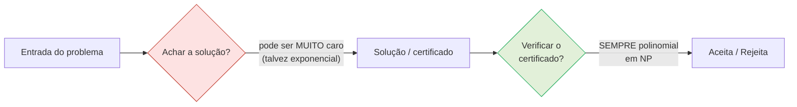
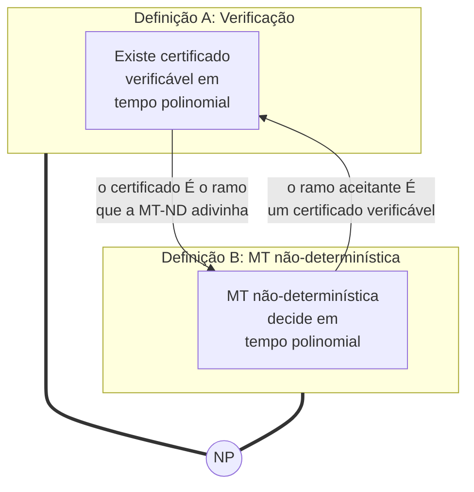
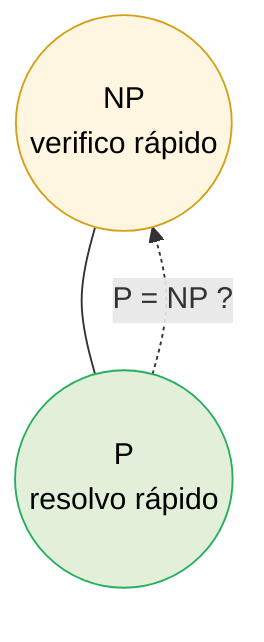
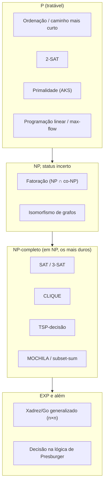

# Complexidade computacional formal: classes de tempo, P e NP

> [!abstract] TL;DR
> A computabilidade pergunta "isso tem solução?". A complexidade põe um **relógio** em cima: "isso tem solução BARATA?". Medimos o tempo como o número de passos de uma máquina de Turing, em função do tamanho `n` da entrada, no PIOR caso, em notação assintótica. Daí saem duas classes-mãe. **P** = problemas de decisão que uma MT determinística resolve em tempo polinomial (`O(nᵏ)` pra algum `k` fixo) — a formalização de "tratável". **NP** = problemas cujo certificado (uma solução proposta) você consegue VERIFICAR em tempo polinomial; equivalentemente, problemas que uma MT NÃO-determinística decide em tempo polinomial. A analogia que mata: resolver um sudoku é difícil; conferir um sudoku resolvido é trivial. `P ⊆ NP` é trivial (quem resolve rápido, verifica rápido ignorando o certificado). Se a inclusão é ESTRITA é o problema do milênio — fica pra [[16 - P vs NP e o mapa das classes]]. Os problemas mais duros de NP (NP-completos) e a prova de que SAT é um deles ficam pra [[15 - NP-completude - Cook-Levin e a cadeia de Karp]].

A nota [[10 - Decidível, reconhecível e a máquina universal]] fechou a pergunta "é computável?". Esta abre a pergunta seguinte, a que paga as contas de quem programa de verdade: **"é computável a um custo que cabe no orçamento?"**.

> [!warning] Fronteira com Algoritmos
> A **face prática** disto — "se o problema é NP-difícil, pare de buscar o ótimo e use aproximação/heurística/solver" — já está coberta a fundo em [[03-Dominios/Ciência/Algoritmos/13 - Intratabilidade]], que deferiu o tratamento FORMAL pra cá. Logo: lá você aprende a **agir** diante da intratabilidade; aqui você aprende o **rigor** que define o que "intratável" significa, via máquinas de Turing. Esta nota não repete o discurso do "reconheça e aproxime" — ela define os objetos.

---

## 1. Complexidade = computabilidade com um relógio

A nota 10 perguntava se existe uma máquina que sempre para e responde. A complexidade aceita que a máquina para e pergunta: **quantos passos** ela leva? E não em uma entrada específica — isso seria uma medida sem sentido, porque entradas maiores naturalmente custam mais. Medimos o tempo como uma **função do tamanho da entrada `n`**.

Três escolhas tornam essa medida útil e robusta:

1. **Pior caso.** Tomamos o máximo de passos sobre todas as entradas de tamanho `n`. Por quê o pior, e não a média? Porque pior caso dá uma **garantia**: "não importa a entrada, nunca passa disso". É o contrato que um engenheiro quer assinar.
2. **Assintótica (Big-O).** Não contamos passos exatos — contamos a **taxa de crescimento**. Constantes e termos de ordem baixa somem. `3n² + 50n + 200` vira `O(n²)`. Por que jogar fora detalhe? Porque a fronteira que importa (polinomial × exponencial) é grosseira o bastante pra não depender deles. O ferramental está em [[03-Dominios/Ciência/Algoritmos/02 - Análise de complexidade - Big-O]].
3. **Função de `n`.** O custo é uma função, não um número. `O(n)`, `O(n²)`, `O(2ⁿ)` são respostas diferentes para a mesma pergunta.

A divisória que estrutura toda a teoria é uma só: **polinomial × superpolinomial**. `n`, `n²`, `n¹⁰⁰` são todos polinomiais (`O(nᵏ)`). `2ⁿ`, `n!` não são. Por que essa linha, e não outra? Porque ela tem três virtudes raras:

- É **robusta**: não muda entre modelos razoáveis de máquina (vamos provar isso na próxima seção).
- **Fecha sob composição**: polinômio de polinômio é polinômio. Encadear sub-rotinas eficientes continua eficiente. Você pode construir algoritmos a partir de outros sem medo de a eficiência evaporar.
- **Separa o que escala do que não escala** na prática.

Sinta a diferença no corpo. Dobrar `n` num algoritmo `O(n²)` **quadruplica** o custo — chato, mas você compra mais máquina. Dobrar `n` num algoritmo `O(2ⁿ)` **eleva ao quadrado** o custo — e nenhuma máquina te salva. Uma cresce; a outra explode. Um exemplo numérico que assusta: `2ⁿ` para `n = 100` já passa do número de átomos no universo observável. Polinomial é o reino do possível; exponencial é o reino do "esquece".

---

## 2. Por que máquina de Turing, e não "operações"?

Quando você analisa um algoritmo no dia a dia, conta "operações" informalmente. Pra **definir classes** com precisão matemática, isso não basta — o que conta como "uma operação"? Multiplicar dois números é um passo ou depende do tamanho deles? A teoria escolhe um modelo onde "um passo" é cristalino: a **máquina de Turing** da nota [[08 - A máquina de Turing]]. Um passo = uma transição (lê símbolo, escreve, move a cabeça, troca de estado). O tempo de uma MT numa entrada é simplesmente **quantas transições** ela executa até parar.

Aqui surge a pergunta natural: "mas então a definição de P depende do modelo? Uma RAM, uma MT de uma fita, uma de várias fitas contam passos diferente!". A resposta é a peça mais profunda desta nota.

> [!tip] Tese de Church-Turing ESTENDIDA
> A nota [[09 - A tese de Church-Turing]] dizia: todo modelo razoável de computação computa **o mesmo conjunto** de funções. A versão ESTENDIDA acrescenta o relógio: todo modelo razoável simula qualquer outro com overhead apenas **polinomial**.
>
> Consequência: se um problema é polinomial num modelo razoável, é polinomial em TODOS. Uma MT de uma fita simula uma de `k` fitas com perda quadrática (`t` passos viram `O(t²)`); um modelo RAM simula MT e vice-versa com perda polinomial. Como polinômio de polinômio ainda é polinômio, a classe **P não se mexe** quando você troca de modelo.

É por isso que "polinomial" é a escolha certa pra definir "eficiente": é a granularidade **invariante ao modelo**. Se a teoria fixasse "`O(n²)`", a resposta dependeria de você usar uma ou duas fitas — uma definição frágil. "Polinomial" é robusto. Esse é o motivo de a fronteira ser onde é.

---

## 3. A classe P: a formalização de "tratável"

> **P** é o conjunto dos problemas de **decisão** (resposta sim/não) que uma **máquina de Turing determinística** resolve em **tempo polinomial** — isto é, em `O(nᵏ)` passos pra alguma constante `k` fixa, no pior caso.

"Determinística" significa a MT comum.

Em cada estado, lendo cada símbolo, há **uma** próxima jogada. Sem adivinhação. Roda, para, responde. Nada de mágica.

Esta é a captura matemática da ideia intuitiva de **"eficiente"** ou **"tratável"**. Quando alguém diz "esse problema tem solução eficiente", a tradução rigorosa é: "esse problema está em P".

Exemplos que vivem em P:

- **Ordenação** — `O(n log n)`, folgadamente polinomial.
- **Caminho mais curto** num grafo (Dijkstra/BFS) — polinomial.
- **Casamento de padrões** (regex, busca de substring) — polinomial.
- **Conexidade e ciclo de Euler.** "Esse grafo é conexo?" e "existe um passeio que usa cada aresta exatamente uma vez?" se resolvem em tempo linear: Euler provou que basta checar conexidade e contar quantos vértices têm grau ímpar (0 ou 2). Um critério local, barato. Guarde esse exemplo, porque ele tem um primo perverso em NP.
- **Fluxo máximo (max-flow).** "Quanto fluxo cabe desta fonte até este sumidouro?" — Ford–Fulkerson com escolha de caminhos (Edmonds–Karp) é polinomial, e dele caem casamento bipartido máximo, cortes mínimos e dezenas de problemas de alocação. Toda uma família de problemas "de aparência combinatória" que, no fim, é tratável.
- **Programação linear.** "Existe um ponto que satisfaz estas desigualdades lineares e maximiza esta função?" Por décadas só se conhecia o simplex (exponencial no pior caso, ótimo na prática). Em **1979**, **Khachiyan** mostrou com o método dos elipsoides que PL está em P — um marco, porque PL é o motor de metade da otimização industrial.
- **Primalidade**: "esse número é primo?". Esse demorou. Conjecturava-se polinomial por décadas; só em **2002** o algoritmo **AKS** (Agrawal–Kayal–Saxena) provou, de forma determinística e incondicional, que primalidade está em P. Bonito porque mostra que "estar em P" não é óbvio — às vezes é um teorema difícil.

> [!example] 2-SAT está em P, 3-SAT é NP-completo
> Aqui mora um dos contrastes mais didáticos da teoria toda. Pegue SAT na forma normal conjuntiva — uma conjunção de cláusulas, cada cláusula uma disjunção de literais.
>
> Se cada cláusula tem **no máximo 2** literais (**2-SAT**), o problema está em **P**: cada cláusula `(a ∨ b)` vira duas implicações (`¬a → b` e `¬b → a`); montamos um grafo de implicações e a fórmula é satisfatível se e somente se nenhuma variável `x` e seu negado `¬x` caem na MESMA componente fortemente conexa. Isso é tempo linear.
>
> Se cada cláusula pode ter **3** literais (**3-SAT**), o problema é **NP-completo** — está entre os mais duros de NP. Um único literal a mais por cláusula faz a dificuldade saltar do tratável ao (presumidamente) intratável. A fronteira P/NP não é um abismo geográfico distante; às vezes ela passa entre dois primos que parecem irmãos gêmeos.

Repare numa coisa importante sobre primalidade: ela parece "buscar um divisor", o que cheira a exponencial. Mas há um caminho esperto que decide a pergunta sem fatorar.

Isso é o recado de P: o que importa é se EXISTE algum algoritmo polinomial, por mais engenhoso que seja — não se a abordagem ingênua é rápida. Um problema pode parecer duro e ser, no fundo, tratável. (O inverso também: veremos em NP problemas que parecem fáceis e ninguém sabe resolver rápido.)

> [!example] A intuição do `k` fixo
> O que põe um problema em P não é ser RÁPIDO, é o expoente ser uma **constante que não cresce com a entrada**. `n¹⁰⁰` é polinomial (e horrível na prática), `2ⁿ` não é (e às vezes tolerável pra `n` pequeno). A teoria desenha a linha pela ROBUSTEZ matemática, não pela velocidade no relógio de parede. Na prática quase todo algoritmo natural em P tem `k ≤ 3` ou `4` — a folga teórica raramente morde.

### 3.1. "Polinomial = tratável" é uma convenção (e é preciso ser honesto sobre isso)

Vale dizer com todas as letras: identificar "polinomial" com "eficiente" é uma **convenção**, não uma lei da natureza. E ela tem furos que um sênior deve saber nomear.

Primeiro furo: `O(n¹⁰⁰)` é polinomial e completamente inútil. Pra `n = 2`, isso já é `2¹⁰⁰`. Nenhuma máquina roda. A definição de P engole esse monstro sem piscar, e mesmo assim o chamamos de "tratável".

Segundo furo: as **constantes ocultas**. Big-O joga fora o coeficiente. Um algoritmo `O(n)` com constante `10⁹` perde feio, na prática, pra um `O(n²)` com constante `1` em qualquer entrada que caiba na memória. A teoria não vê isso. (O ferramental que governa essas constantes e o que Big-O esconde está em [[03-Dominios/Ciência/Algoritmos/02 - Análise de complexidade - Big-O]].)

Então por que a convenção sobrevive? Porque, apesar dos furos, ela é **robusta e útil na prática**. Os polinômios de expoente absurdo quase nunca aparecem em problemas naturais — quando um problema entra em P, em geral entra com `k` pequeno. A classe é fechada sob composição e invariante ao modelo (seção 2), o que nenhuma definição "concreta" (tipo "`O(n²)`") consegue ser.

A regra é: **use "polinomial = tratável" como primeira aproximação, sempre verdadeira no atacado, e desconfie no varejo.** A linha existe pra separar "explode" de "escala", e nisso ela acerta quase sempre. Pra decidir se UM algoritmo específico serve, você desce pra Big-O com constantes e benchmark — não pra teoria da complexidade.

---

## 4. A classe NP: duas definições, o mesmo conjunto

NP é onde mora a riqueza. A sigla **não** significa "não-polinomial" — é **N**ondeterministic **P**olynomial. E ela tem duas definições que parecem vir de planetas diferentes mas descrevem **exatamente o mesmo conjunto** de problemas. Entender que são a mesma coisa é entender NP.

### 4.1. Definição por verificação: "achar é difícil, conferir é fácil"

> **NP** é o conjunto dos problemas de decisão cuja resposta "sim" admite um **certificado** (também chamado **testemunha**) que pode ser **VERIFICADO** por uma MT determinística em tempo polinomial.

A ideia: você talvez sufoque pra ENCONTRAR a solução, mas se um oráculo te entrega uma solução candidata, você CONFERE rapidinho se ela presta.

**Leitura do diagrama:** os dois losangos têm custos assimétricos. À esquerda (vermelho), ACHAR a solução pode custar caríssimo. À direita (verde), VERIFICAR um certificado entregue é sempre barato (polinomial). NP é definida por essa caixa verde: o que importa é que **conferir** seja fácil. Achar é problema de outro departamento.

A analogia canônica: **um sudoku**. Resolver um sudoku difícil pode te custar uma tarde. Mas se eu te entrego a grade preenchida, você confere em segundos se cada linha, coluna e bloco tem 1–9 sem repetir. Achar é duro; conferir é trivial. Isso é a alma de NP.

> [!question] Por que essa assimetria é tão fundamental?
> Pense em quantas tarefas da vida real têm essa cara. Montar uma escala de plantões que respeite mil restrições: difícil. Conferir uma escala pronta: fácil. Encontrar a senha: difícil. Testar uma senha: instantâneo. Provar um teorema: anos. Ler e checar a prova: uma tarde. NP é a classe dos problemas onde **reconhecer a resposta certa é barato, mas produzi-la talvez não**. A pergunta P vs NP é, no fundo: *criatividade é só busca rápida disfarçada?* Se `P = NP`, então tudo que é fácil de reconhecer seria fácil de criar — e isso reorganizaria a matemática, a criptografia e a economia.

#### Achar a agulha × reconhecer a agulha

A metáfora mais precisa pra NP é a da **agulha no palheiro**. O palheiro é o espaço de soluções candidatas — astronômico, exponencial. A agulha é a solução boa. NP diz: **se alguém aponta a agulha, você reconhece num instante que é mesmo uma agulha.** O drama é só em ACHAR.

O sudoku já apareceu, mas olhe-o por essa lente. O palheiro é o conjunto de todos os preenchimentos possíveis da grade — gigante. Resolver é vasculhar o palheiro. Conferir é pegar uma grade que te entregam e olhar se cada linha, coluna e bloco está em ordem: você não revisita o palheiro, só inspeciona a agulha. Quebra-cabeças de montar, palavras-cruzadas, labirintos enormes — todos têm essa assinatura: montar custa, verificar o montado é imediato.

O exemplo que merece foco especial é a **fatoração de inteiros**. Multiplicar `61 × 53 = 3233` é trivial — uma criança faz. Mas, dado `3233`, achar que ele é `61 × 53` exige procurar fatores, e pra números de centenas de dígitos isso derruba qualquer computador conhecido. Fácil pra frente, duríssimo pra trás. É essa assimetria que sustenta o **RSA**: a chave pública é o produto, e quebrá-la é fatorar.

E aqui vem a sutileza que separa os iniciados dos mestres: a versão decisão da fatoração está em **NP ∩ co-NP**. O "sim" tem certificado (os fatores — multiplique e confira); o "não" também tem (um certificado de primalidade, via AKS ou a forma de Pratt). Estar nos DOIS lados é um sinal forte de que a fatoração **provavelmente NÃO é NP-completa** — porque, se fosse, NP e co-NP colapsariam, o que quase ninguém acredita. E ela também não é, até onde se sabe, polinomial. Fatoração vive num **limbo**: dura, mas talvez não tão dura quanto os NP-completos. Esse limbo é exatamente o tipo de paisagem que [[16 - P vs NP e o mapa das classes]] desenha.

### 4.2. Definição por máquina não-determinística

> **NP** é o conjunto dos problemas de decisão que uma **máquina de Turing NÃO-determinística** decide em tempo polinomial.

A MT não-determinística, como o NFA de [[03 - Autômatos finitos - DFA e NFA]] e a variante não-determinística vista em [[08 - A máquina de Turing]], pode em cada passo seguir **vários ramos ao mesmo tempo**. Pense numa árvore de execução que se ramifica a cada escolha.

A convenção de aceitação é generosa: a máquina **aceita** se ALGUM ramo, qualquer um, chega a um estado aceitante. É uma máquina mágica que "adivinha" sempre a jogada certa, se ela existe.

Não é um modelo físico — você não constrói uma MT não-determinística. É uma **ferramenta de definição**, um jeito limpo de dizer "existe um caminho que dá certo". Aplicada a NP, ela faz duas fases:

1. **Adivinha** o certificado (escreve, não-deterministicamente, uma solução candidata — um ramo da árvore pra cada candidato possível).
2. **Verifica** deterministicamente, em tempo polinomial, se aquele candidato satisfaz a instância.

Se existe um certificado válido, algum ramo o adivinha e aceita. Se não existe, nenhum ramo aceita.

### 4.3. Por que são a MESMA classe

**Leitura do diagrama:** as duas definições se traduzem uma na outra. Vale fazer essa tradução devagar, passo a passo, porque é o coração técnico de NP.

**Ida (verificador → MT não-determinística).** Suponha `L` definido por um verificador: existe `V` e polinômio `p` tais que `x ∈ L` sse existe certificado `c` com `|c| ≤ p(|x|)` e `V(x, c)` aceita em tempo polinomial. Construo uma MT não-determinística `N` assim: na **primeira fase**, `N` escreve numa fita um string de `p(|x|)` símbolos, **não-deterministicamente** — em cada célula ela se ramifica em "0" ou "1", varrendo TODOS os certificados candidatos de tamanho permitido, um por ramo. Na **segunda fase**, `N` roda `V(x, c)` deterministicamente naquele ramo. Cada ramo gasta tempo polinomial (escrever `p(|x|)` símbolos + rodar `V`). Se existe um `c` válido, o ramo que adivinhou esse `c` aceita; logo `N` aceita. Se não existe, nenhum ramo aceita. `N` decide `L` em tempo polinomial. **A adivinhação não-determinística É a geração do certificado.**

**Volta (MT não-determinística → verificador).** Agora suponha `L` decidido por uma MT não-determinística `N` em tempo polinomial `q(|x|)`. Em cada passo, `N` tem no máximo um número fixo de escolhas (digamos, no máximo `r` transições por configuração). Então um ramo de execução é totalmente descrito pela **sequência de escolhas feitas em cada passo** — uma lista de no máximo `q(|x|)` números entre `1` e `r`. Essa lista é curta (polinomial) e é o meu **certificado** `c`. O verificador `V(x, c)` simplesmente **refaz** a execução de `N` seguindo as escolhas ditadas por `c`, deterministicamente, e aceita se essa execução chega a um estado aceitante. Simular `q(|x|)` passos custa tempo polinomial. Se `x ∈ L`, existe um ramo aceitante, e a sequência de escolhas dele é o `c` que `V` aprova. **O ramo que aceita É o certificado.**

As duas direções juntas dizem: adivinhar-e-conferir e ramificar-e-aceitar são a mesma ideia vista de dois ângulos. Por isso o nome carrega o "N" de não-determinismo, mas a intuição operacional é "verifico rápido". A equivalência é o que permite trabalhar com NP usando a definição que for mais conveniente em cada prova: a de verificador, mais intuitiva, ou a de MT-ND, mais maquinal (e mais cômoda em Cook–Levin, em [[15 - NP-completude - Cook-Levin e a cadeia de Karp]]).

---

## 5. P ⊆ NP (e a pergunta de um milhão de dólares)

**Leitura do diagrama:** P está DENTRO de NP — desenhamos P como uma região contida em NP. A inclusão `P ⊆ NP` é **trivial**: se eu resolvo um problema em tempo polinomial, então eu também o VERIFICO em tempo polinomial — basta **ignorar o certificado** e resolver o problema do zero; a resposta da minha solução é a verificação. Todo problema fácil de resolver é fácil de verificar.

A seta tracejada é o buraco: **a inclusão é estrita?** Existe algum problema em NP que NÃO está em P — algo fácil de conferir mas comprovadamente difícil de achar? Ou `P = NP`, e toda verificação rápida esconde uma solução rápida ainda não descoberta? Ninguém sabe. É o **problema P vs NP**, um dos sete Problemas do Milênio (US$ 1 milhão). A crença esmagadora é `P ≠ NP`, mas crença não é prova. O mapa completo das classes e as consequências de cada cenário ficam em [[16 - P vs NP e o mapa das classes]].

---

## 6. Certificado/testemunha: o conceito central, formalizado

O **certificado** é a engrenagem que faz NP funcionar. Formalizando:

> Um problema `L` está em NP se existe uma MT verificadora `V` e um polinômio `p` tais que, para toda entrada `x`:
> `x ∈ L` se e somente se EXISTE um certificado `c` com `|c| ≤ p(|x|)` tal que `V(x, c)` aceita em tempo polinomial em `|x|`.

Em português: a resposta é "sim" exatamente quando existe **alguma** testemunha de tamanho razoável (polinomial) que o verificador aprova rapidinho. Dois exemplos canônicos, formais:

- **SAT (satisfatibilidade booleana)** — o exemplo-mãe. Dada uma fórmula booleana, "existe uma atribuição de verdadeiro/falso às variáveis que torna a fórmula verdadeira?". O **certificado é a atribuição**. Verificar é só substituir os valores e avaliar a fórmula — linear no tamanho dela. Achar a atribuição certa, entre `2ⁿ` possíveis, é o duro.
- **Caixeiro-viajante, versão DECISÃO (TSP-decisão)** — "existe uma rota que visita todas as cidades com custo total ≤ `k`?". O **certificado é a rota** (a ordem das cidades). Verificar é somar as arestas e comparar com `k` — trivialmente polinomial. Enumerar todas as rotas é `O(n!)`.
- **CLIQUE** — "esse grafo tem um clique (subconjunto todo-conectado) de tamanho `≥ k`?". O certificado é o **conjunto de vértices**; verificar é checar que todo par está ligado — `O(k²)` arestas.
- **MOCHILA (subset-sum), versão decisão** — "existe subconjunto desses itens que soma exatamente `S`?". O certificado é o **subconjunto**; verificar é somar.
- **CICLO HAMILTONIANO** — "existe um ciclo que visita cada vértice exatamente uma vez?". O certificado é a **ordem dos vértices**; verificar é checar que cada par consecutivo tem aresta e que todos aparecem uma vez — linear.
- **COLORAÇÃO DE GRAFOS (`k`-coloração)** — "dá pra colorir os vértices com `k` cores sem que dois vizinhos compartilhem cor?". O certificado é a **atribuição de cores**; verificar é varrer as arestas. (Já 3-coloração é NP-completa — de novo o salto súbito de dureza com um parâmetro pequeno.)

Em todos: o certificado é curto (polinomial no tamanho da entrada) e a verificação é barata. O espaço de busca é que é astronômico. Esse é o padrão de NP.

> [!question] Euler em P, Hamilton em NP-completo — o mesmo grafo, dois destinos
> Volte ao ciclo de Euler da seção 3: "passe por cada ARESTA uma vez" está em P, resolvido por uma contagem local de graus. Agora compare com o ciclo de Hamilton acima: "passe por cada VÉRTICE uma vez". Trocou "aresta" por "vértice" e o problema pulou de P (Euler) pra NP-completo (Hamilton). Por quê? Porque a condição de Euler é **local** (some os graus, decida na hora), enquanto a de Hamilton é **global** — saber se um vértice cabe no ciclo depende de todos os outros, e não há critério local conhecido. Esse par é o exemplo histórico de que problemas visualmente gêmeos podem estar em lados opostos da fronteira. Quem internaliza esse contraste para de confiar na intuição "parece fácil" e passa a desconfiar de tudo que cheira a busca global.

> [!tip] As duas restrições do certificado, e por que ambas importam
> A definição exige DUAS coisas do certificado, e cada uma fecha um buraco:
> 1. **Curto** (`|c| ≤ p(|x|)`). Sem isso, eu poderia oferecer como "certificado" a tabela inteira de respostas pré-computadas — o que tornaria tudo trivial e a classe sem sentido. O certificado tem que ser pequeno.
> 2. **Verificável em tempo polinomial**. Sem isso, conferir o certificado seria tão caro quanto resolver o problema, e a assimetria sumiria.
>
> As duas juntas capturam exatamente: "uma pista curta e barata de checar que comprova o 'sim'". Tire qualquer uma e a classe desmorona.

---

## 7. co-NP: o certificado do "NÃO"

NP dá certificado pro **sim**. E o **não**?

> **co-NP** é o conjunto dos problemas cuja resposta "NÃO" admite um certificado verificável em tempo polinomial — equivalentemente, problemas cujo **complemento** está em NP.

Exemplo: SAT pergunta "essa fórmula é satisfatível?" (sim tem certificado: a atribuição). O complemento, **UNSAT** — "essa fórmula é INSATISFATÍVEL?" — é a estrela de co-NP: aqui o "sim" (a fórmula é insatisfatível) é que precisaria de certificado, e **não se conhece um certificado curto** pra insatisfatibilidade. Provar que NENHUMA das `2ⁿ` atribuições funciona parece exigir percorrer todas.

Repare na assimetria sutil. Dizer "sim, existe uma atribuição satisfatória" é uma afirmação **existencial** — basta exibir UMA —, e existenciais têm certificado natural: a própria coisa que existe.

Dizer "não existe nenhuma" é uma afirmação **universal**, sobre TODAS as atribuições, e universais não têm, em geral, certificado curto conhecido.

NP captura o existencial fácil; co-NP captura o universal. Provar que algo existe é fácil de testemunhar — aponte. Provar a AUSÊNCIA de algo, não — como aponto pra um vazio?

Isso levanta outra pergunta aberta: **NP = co-NP?** Se um problema e seu complemento estão ambos em NP, há simetria; mas ninguém sabe se NP é fechada sob complemento. Note que `P ⊆ NP ∩ co-NP` (quem resolve, resolve o complemento também). A relação completa entre P, NP e co-NP é aprofundada em [[16 - P vs NP e o mapa das classes]].

---

## 8. O zoológico ao redor: EXP, e uma prévia do espaço

P e NP não vivem sozinhas. Vale situá-las num mapa maior, mesmo que o desenho completo fique pra [[16 - P vs NP e o mapa das classes]].

### 8.1. EXP e a torre `P ⊆ NP ⊆ EXP`

**EXP** (ou EXPTIME) é o conjunto dos problemas que uma MT determinística resolve em tempo **exponencial** — `O(2^(nᵏ))` pra algum `k`. É uma classe enorme; quase tudo que é decidível e razoável cabe nela.

A relação que organiza o tempo é:

`P ⊆ NP ⊆ EXP`

A primeira inclusão já discutimos: resolver rápido implica verificar rápido.

A segunda é instrutiva: **todo problema em NP é resolvível em tempo exponencial** por força bruta. Como? Pela definição de verificador, há um certificado de tamanho `p(n)`; basta **enumerar todos** os `2^p(n)` certificados possíveis e rodar o verificador polinomial em cada um. Isso é exponencial, mas é finito e determinístico — logo NP ⊆ EXP.

Em outras palavras: a intratabilidade de NP não é "impossível", é só "caro o suficiente pra não servir". Você sempre PODE resolver um NP por busca exaustiva; só não vai viver pra ver terminar quando `n` cresce.

E há uma boa notícia formal escondida aí. Pelo **teorema da hierarquia de tempo**, sabe-se que `P ⊊ EXP` — **estritamente**. Ou seja, existem problemas comprovadamente exponenciais, fora de P, sem conjectura nenhuma. Curiosamente, embora saibamos `P ≠ EXP`, não sabemos onde exatamente NP se encaixa entre as duas. A ignorância está concentrada nos elos `P ⊆ NP` e `NP ⊆ EXP`: pelo menos UM tem que ser estrito (senão `P = EXP`, contradição), mas qual, ninguém sabe.

### 8.2. Prévia das classes de ESPAÇO

Até aqui medimos **tempo** (passos). Dá pra medir também **espaço** — quantas células de fita a MT usa. Isso abre uma segunda família de classes.

**L** (LOGSPACE) é o conjunto dos problemas resolvíveis usando apenas `O(log n)` de espaço de trabalho (além da entrada, que é só de leitura). Parece pouco — e é —, mas dá pra fazer coisas: testar conexidade em grafos não-direcionados, por exemplo, está em L. **PSPACE** é o conjunto dos problemas resolvíveis em espaço **polinomial**, sem limite de tempo. Espaço é reutilizável (a mesma célula serve mil vezes), então PSPACE é surpreendentemente poderosa — engole NP e co-NP inteiras.

A torre fica `L ⊆ P ⊆ NP ⊆ PSPACE ⊆ EXP`, e quase todas essas inclusões são mistérios abertos (a única separação estrita conhecida na torre é, de novo, `P ⊊ EXP`, mais `L ⊊ PSPACE`). O mapa detalhado, com PSPACE-completude e o lugar dos jogos e da lógica quantificada, é assunto de [[16 - P vs NP e o mapa das classes]].

### 8.3. Quadro: problemas clássicos por classe

**Leitura do quadro:** de baixo pra cima, a dureza cresce. Em **P**, o reino do tratável, moram ordenação, 2-SAT, primalidade, PL e max-flow. Acima, dentro de NP mas em **limbo**, a fatoração (em NP ∩ co-NP, provavelmente nem P nem NP-completa) e o isomorfismo de grafos (status notoriamente incerto). Mais acima, os **NP-completos** — SAT, CLIQUE, TSP, MOCHILA —, os mais duros de NP, todos inter-redutíveis. No topo, **EXP e além**: xadrez/Go em tabuleiro `n×n` e a aritmética de Presburger, problemas provadamente fora de P. Note o salto de 2-SAT (em P) pra 3-SAT/SAT (NP-completo): a fronteira passa entre eles. A construção formal da camada NP-completa é o tema de [[15 - NP-completude - Cook-Levin e a cadeia de Karp]].

---

## 9. Por que a versão de DECISÃO?

Você notou que sempre falei "versão decisão": "existe rota ≤ `k`?", não "qual a rota mais barata?". Não é capricho.

A teoria da computação trabalha com **linguagens** — conjuntos de strings — e uma linguagem é, por natureza, um problema **sim/não**: a string pertence ou não pertence.

Toda a maquinaria de [[01 - O que é computação]] (máquinas que aceitam/rejeitam) é construída sobre decisão. Pra falar de "máquina decide `L` em tempo polinomial", `L` precisa ser uma pergunta de pertinência.

"Mas eu quero o ÓTIMO, não um sim/não!" Sem problema: **otimização reduz a decisão**. Se você sabe responder "existe solução de custo ≤ `k`?" em tempo polinomial, descobre o ótimo fazendo **busca binária** sobre `k` — `O(log)` perguntas de decisão, cada uma polinomial, total polinomial. Decidir e otimizar têm a mesma dificuldade essencial. Por isso a teoria escolhe a forma mais limpa (decisão) sem perder generalidade.

Concretamente, no TSP: você quer a rota mais barata. Pergunte "existe rota ≤ 1000?", "≤ 500?", "≤ 750?"... estreitando o intervalo por bisseção. Em `O(log do custo máximo)` perguntas você crava o ótimo. Cada pergunta é a versão decisão. Se a decisão fosse polinomial, a otimização também seria. É por isso que, ao classificar a dureza de um problema, basta olhar para sua versão sim/não — ela carrega toda a complexidade.

> [!tip] Decisão, busca e a auto-redutibilidade
> Há uma terceira versão que vale separar: além de **decidir** ("existe?") e **otimizar** ("qual o melhor?"), existe **buscar** ("me dê UMA solução"). A busca binária acima mostra que decisão resolve otimização. Mas e produzir a solução em si?
>
> Pra os problemas NP-completos naturais, decidir também resolve buscar, via **auto-redutibilidade** (self-reducibility). Exemplo em SAT: se eu tenho uma caixa-preta que decide satisfatibilidade, recupero uma atribuição satisfatória assim — fixo `x₁ = verdadeiro`, pergunto à caixa se a fórmula reduzida ainda é satisfatível; se sim, mantenho; se não, fixo `x₁ = falso`. Repito variável a variável. São `n` chamadas de decisão pra construir a testemunha inteira. Ou seja, decidir, buscar e otimizar têm, nesses problemas, a **mesma** dificuldade polinomial. Isso justifica de vez por que a teoria pode se dar ao luxo de só estudar a forma sim/não: as outras vêm de brinde.

---

## 10. O que vem a seguir

Definimos P e NP. A próxima fronteira é: **dentro de NP, quais são os problemas MAIS DIFÍCEIS?** Existe um seleto grupo, os **NP-completos**, tais que se UM deles cair em P, TODO NP cai junto — eles concentram toda a dureza de NP. A prova de que SAT é NP-completo (o teorema de **Cook–Levin**) e a cascata de reduções que pega CLIQUE, MOCHILA, TSP e dezenas de outros (a cadeia de **Karp**) são o assunto de [[15 - NP-completude - Cook-Levin e a cadeia de Karp]]. É lá que "fácil de verificar, difícil de achar" ganha sua estrutura mais profunda.

E quando a teoria termina de provar que um problema é duro, a engenharia começa. O que você FAZ ao topar com um NP-difícil no trabalho — aproximar, relaxar, usar solvers SAT/ILP, restringir a entrada a casos tratáveis, ou só aceitar uma heurística boa-o-bastante — é o tema de [[03-Dominios/Ciência/Algoritmos/13 - Intratabilidade]]. Esta nota deu o **rigor** (o que "intratável" significa, via máquinas de Turing); aquela dá a **ação**. Os dois lados da mesma fronteira: aqui você prova que a montanha é alta; lá você decide por onde contorná-la.

---

## Em entrevista

Frases prontas pra quando o assunto encostar em complexidade:

- "P is the class of decision problems a **deterministic Turing machine** solves in **polynomial time**, `O(nᵏ)` for a fixed `k`. It's our formalization of *tractable*."
- "NP isn't 'non-polynomial' — it's **nondeterministic polynomial**. The intuition I use: a problem is in NP if, given a candidate solution, I can **verify** it in polynomial time. Solving a sudoku is hard; checking a solved one is trivial."
- "The two definitions of NP — polynomial **verifier** and polynomial **nondeterministic Turing machine** — are equivalent: the certificate is just the branch the machine guesses."
- "`P ⊆ NP` is trivial: if I can solve it fast, I can verify it fast by ignoring the certificate and re-solving. Whether the inclusion is **strict** is the open P vs NP question."
- "Why decision problems? Because the theory is about **languages** — yes/no membership. Optimization reduces to decision via binary search on the threshold, so we lose nothing."
- "SAT is the canonical NP example: the satisfying assignment is the certificate, checkable in linear time."
- "A nice tell that a problem may be neither in P nor NP-complete: it sits in **NP ∩ co-NP**. Integer factoring is the classic case — both the factors and a primality certificate are short — which is why few believe it's NP-complete."
- "One literal flips everything: **2-SAT is in P** (implication graph + strongly connected components), but **3-SAT is NP-complete**. The P/NP boundary can run between two near-identical problems."
- "Everything in NP is in EXP: just brute-force all `2^p(n)` certificates and run the polynomial verifier. So `P ⊆ NP ⊆ EXP`, and by the time hierarchy theorem `P ⊊ EXP` strictly — we just don't know which inclusion in between is strict."

| Português | English |
| --- | --- |
| Problema de decisão | Decision problem |
| Tempo polinomial | Polynomial time |
| Máquina de Turing (não-)determinística | (Non)deterministic Turing machine |
| Tratável / intratável | Tractable / intractable |
| Certificado / testemunha | Certificate / witness |
| Verificador (em tempo polinomial) | (Polynomial-time) verifier |
| Pior caso | Worst case |
| No máximo / no mínimo | At most / at least |
| Satisfatibilidade booliana (SAT) | Boolean satisfiability (SAT) |
| Tese de Church-Turing estendida | Extended Church-Turing thesis |
| Tamanho da entrada | Input size |
| Caixeiro-viajante (versão decisão) | Traveling salesman (decision version) |
| Tempo exponencial (EXP) | Exponential time (EXP) |
| Espaço logarítmico / polinomial (L / PSPACE) | Log / polynomial space (L / PSPACE) |
| Fatoração de inteiros | Integer factoring |
| Teorema da hierarquia de tempo | Time hierarchy theorem |

> [!info] Lastro
> - **Sipser, M.** — *Introduction to the Theory of Computation* (3ª ed.), Capítulo 7 ("Time Complexity"): seções 7.1 (medindo complexidade), 7.2 (a classe P), 7.3 (a classe NP, com as duas definições equivalentes via verificador e via MT não-determinística).
> - **Arora, S. & Barak, B.** — *Computational Complexity: A Modern Approach* (Cambridge, 2009), Capítulos 1–2: definições formais de P, NP, certificados e a tese de Church-Turing estendida.
> - **Cormen, Leiserson, Rivest, Stein (CLRS)** — *Introduction to Algorithms* (3ª/4ª ed.), Capítulo "NP-Completeness": problemas de decisão × otimização, classes P e NP, verificação por certificado.
> - **Sipser, M.** — *Introduction to the Theory of Computation*, Cap. 8 (espaço, PSPACE) e seção 9.1 (teorema da hierarquia de tempo, `P ⊊ EXP`); Cap. 8 também trata L e a separação `L ⊊ PSPACE`.
> - **Aaronson, S.** — "P =? NP" (survey, 2017): panorama acessível do limbo (fatoração, isomorfismo de grafos) e do significado intuitivo de `P ⊆ NP ⊆ EXP`.
