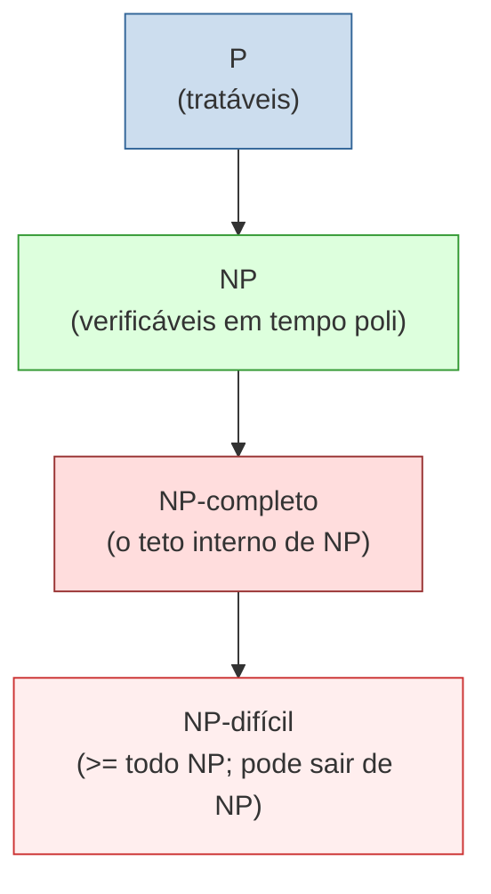
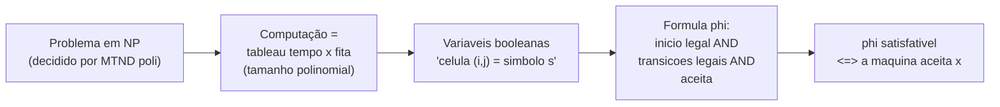
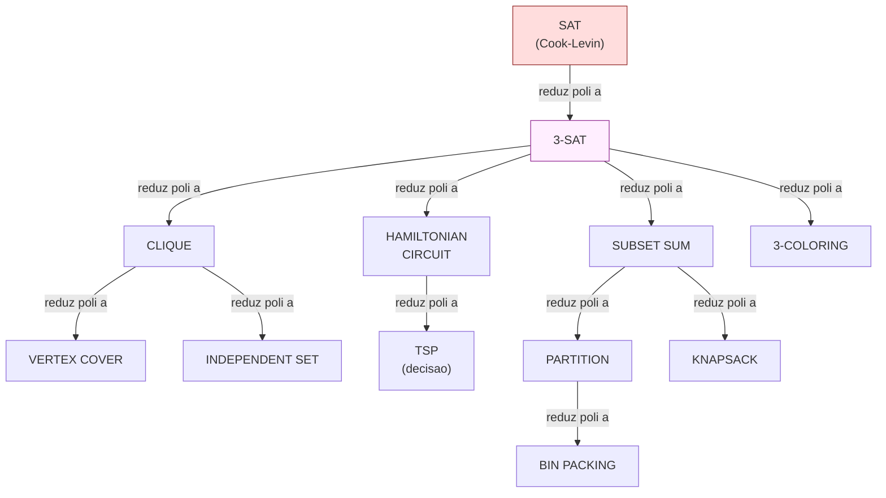
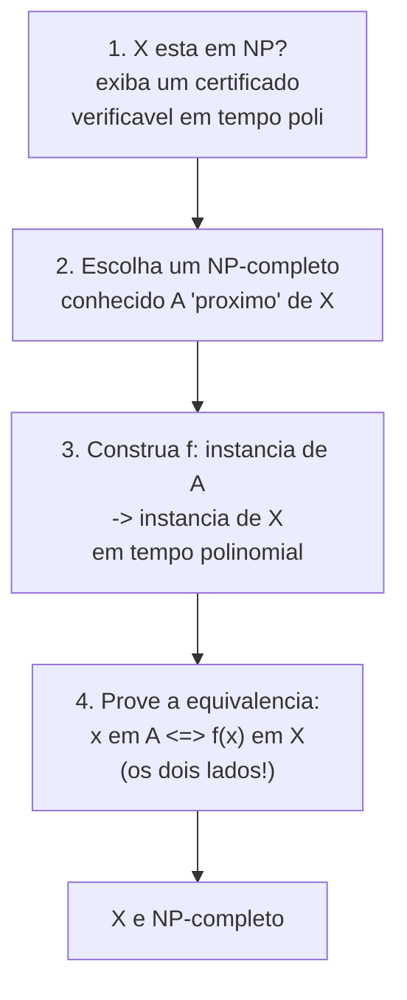

> [!abstract] TL;DR
> NP-completo é o clube dos problemas **mais difíceis de dentro de NP** — e a propriedade mágica é a solidariedade: resolva UM em tempo polinomial e você resolveu TODOS (P = NP). A ferramenta que costura esse clube é a **redução polinomial** (≤ₚ): "A não é mais difícil que B, a menos de um fator polinomial". O **teorema de Cook-Levin** (1971) deu o primeiro tijolo — provou que **SAT** é NP-completo codificando qualquer computação de uma MT não-determinística como uma fórmula booleana gigante. Daí **Karp** (1972) puxou uma corrente de **21 problemas** por reduções em cascata. Provar NP-completude é uma receita de 4 passos. A face prática (o que fazer DEPOIS de saber que é NP-difícil) mora em [[03-Dominios/Ciência/Algoritmos/13 - Intratabilidade]].

## A pergunta que esta nota responde

Você já sabe (da [[14 - Complexidade computacional formal - classes de tempo, P e NP]]) que existe NP: o clube dos problemas cuja solução é **fácil de verificar** mesmo quando parece difícil de achar. Mas NP é um saco grande. Dentro dele há problemas mansos (que estão também em P) e há monstros. Pergunta natural de senior: *será que dá pra apontar o dedo pros piores? Os que, se cedessem, derrubariam o resto junto?*

Sim. Esse é o coração desta nota. Vamos definir esse "pior caso interno" com precisão (NP-completo), conhecer a ferramenta que o constrói (redução polinomial), o teorema que fundou tudo (Cook-Levin) e a **técnica de prova** que você usa pra carimbar um problema novo como NP-completo. Essa técnica é o que separa quem "ouviu falar" de quem sabe.

> [!note] Onde está a fronteira
> Esta nota é a dona do **formal**: definição, redução, teorema, prova. O **prático** — "ok, é NP-difícil, e agora? aproximação, heurística, solver SAT/MILP, parar de buscar o ótimo" — está a fundo em [[03-Dominios/Ciência/Algoritmos/13 - Intratabilidade]]. Aqui o único resgate prático é **reconhecer** que o problema é NP-completo. O que fazer em seguida, é lá.

## Recap mínimo: P e NP

Rápido, só pra ter o vocabulário na mão (detalhe em [[14 - Complexidade computacional formal - classes de tempo, P e NP]]). **P** é o clube dos problemas decidíveis em tempo **polinomial** por uma máquina determinística — os "tratáveis". **NP** é o clube dos problemas **verificáveis** em tempo polinomial: se alguém te entrega um candidato a solução (um *certificado*), você confere em tempo polinomial se ele de fato resolve. Achar pode ser caro; conferir é barato. Todo P está em NP (verificar é fácil quando resolver já é fácil). A pergunta de um milhão de dólares — P = NP? — fica pra [[16 - P vs NP e o mapa das classes]].

## A ferramenta-mestra: redução polinomial (≤ₚ)

Você já viu redução na computabilidade, em [[12 - Reduções e indecidibilidade em cascata]]: transformar instâncias de um problema A em instâncias de um problema B, de modo que a resposta se preserve. Lá usamos isso pra **transportar indecidibilidade**: se A é indecidível e A se reduz a B, então B também é indecidível.

Aqui é a **mesma ferramenta com uma exigência mais forte**: a função de transformação f tem que rodar em tempo **polinomial**.

Formalmente, **A ≤ₚ B** significa: existe uma função f, computável em tempo polinomial, tal que para toda instância x:

> x ∈ A ⟺ f(x) ∈ B

Em português de gente: *"A não é mais difícil que B, a menos de um fator polinomial."* Você resolve A delegando pra B — converte sua pergunta de A numa pergunta de B (rápido), pergunta a B, e a resposta vale pra A.

A consequência que move tudo:

> [!tip] O que a redução transporta agora
> Na computabilidade, redução transportava **decidibilidade** (e a indecidibilidade pra trás). Aqui transporta **tratabilidade**:
> - Se **B tem algoritmo polinomial** e **A ≤ₚ B**, então **A também tem** algoritmo polinomial. (Você roda f — poli — e depois o algoritmo de B — poli. Poli ∘ poli = poli.)
> - Pela contrapositiva, transporta a **dificuldade pra trás**: se A é difícil (sem algoritmo polinomial) e A ≤ₚ B, então **B também é difícil**.

### Cuidado com a direção (de novo)

O mesmo erro da nota 12 reaparece aqui, então repita o mantra: **A ≤ₚ B reduz A *a* B**. Você usa B como "oráculo" pra resolver A. Logo:

- Pra provar que **B é difícil**, você reduz um problema **sabidamente difícil A** *a* B (A ≤ₚ B). Está dizendo: "B é pelo menos tão difícil quanto esse cara difícil que eu já conheço".
- A seta aponta **do conhecido pro novo**. Quer carimbar X como NP-completo? Pegue um NP-completo conhecido A e faça **A ≤ₚ X** (conhecido ≤ₚ novo). Inverter isso é o erro clássico de prova — provaria a coisa errada (que X é *fácil*, não que é difícil).

> [!danger] O erro de direção, com um exemplo concreto
> Suponha que você quer provar que seu problema novo X (digamos, "alocar engenheiros a plantões sem conflito") é NP-completo. Você conhece 3-COLORING como NP-completo. Há duas reduções possíveis, e **só uma serve**:
> - **CERTO:** `3-COLORING ≤ₚ X`. Você transforma toda instância de coloração numa instância da sua alocação. Isso prova "X é **pelo menos tão difícil quanto** colorir grafos" → X é NP-difícil. ✔
> - **ERRADO:** `X ≤ₚ 3-COLORING`. Isso prova "X **não é mais difícil que** colorir" — mas 3-COLORING já é resolvível (com esforço exponencial), então essa redução só diz que X *também* é resolvível. Não prova dureza nenhuma; no limite, sugere que X é fácil. ✗
>
> O reflexo certo: você **importa** dificuldade de um monstro conhecido *para* o seu problema. A dificuldade flui na direção da seta de redução. Reduza **a partir** do NP-completo, nunca **para** ele.

## NP-difícil × NP-completo (defina com precisão)

Com ≤ₚ na mão, definimos as duas classes que confundem todo mundo:

**NP-difícil (NP-hard)** — X é NP-difícil se **todo** problema de NP se reduz a X em tempo polinomial. Ou seja, X é **pelo menos tão difícil quanto qualquer coisa em NP**. Detalhe crucial: **X não precisa estar em NP**. Pode ser mais difícil ainda — pode até ser **indecidível** (o problema da parada é NP-difícil!). NP-difícil é uma cota inferior de dificuldade, não um endereço fixo.

**NP-completo (NP-complete)** — X é NP-completo se **(1) X é NP-difícil E (2) X ∈ NP**. São os problemas **mais difíceis de dentro de NP** — o teto interno de NP. Estão em NP (a solução é verificável rápido), mas concentram toda a dificuldade da classe.

> [!example] A propriedade mágica (a chave-mestra)
> Pense em NP-completo como uma **chave-mestra**: todos os problemas de NP estão "presos" atrás dele.
> - Se **um único** problema NP-completo tiver algoritmo polinomial, então **todo** problema de NP tem (porque todo NP ≤ₚ esse cara, e ≤ₚ transporta tratabilidade). Isso significaria **P = NP**.
> - Por isso, encontrar um algoritmo polinomial pra QUALQUER NP-completo — ou provar que não existe — resolveria a pergunta do milênio de uma vez.
>
> Resolva um, resolveu todos. Esse é o significado real de "completo": ele *captura a essência* da classe inteira.

> [!note] Leitura do diagrama
> Lendo de baixo: **NP-difícil** é a região mais larga — inclui coisas fora de NP (até indecidíveis). A **interseção** "NP-difícil ∩ NP" é exatamente **NP-completo** (a faixa vermelha clara). Dentro de NP mora **P**. Se P = NP, as três caixas de cima colapsariam numa só. Se P ≠ NP, P e NP-completo são **disjuntos** (nenhum NP-completo estaria em P).

## O teorema de Cook-Levin (o marco zero)

Tudo isso é lindo, mas tem um problema de galinha-e-ovo: pra provar que X é NP-completo por redução, você precisa de **outro NP-completo conhecido** pra reduzir a partir dele. E o primeiro? De onde veio o primeiro tijolo?

Veio daqui:

> [!quote] Teorema de Cook-Levin (1971)
> **SAT — o problema da satisfatibilidade booleana — é NP-completo.**
>
> Stephen Cook provou em 1971; Leonid Levin provou de forma **independente** (do outro lado da Cortina de Ferro), publicado em 1973. Foi o **primeiro** problema demonstrado NP-completo.

**SAT**: dada uma fórmula booleana φ (variáveis, ∧, ∨, ¬), existe uma atribuição de verdadeiro/falso às variáveis que torna φ verdadeira? Ex.: `(x₁ ∨ ¬x₂) ∧ (¬x₁ ∨ x₃)` é satisfatível? (Sim: x₁=V, x₃=V.)

### A ideia da prova (sem o detalhe técnico completo)

Que SAT ∈ NP é fácil: o certificado é a própria atribuição; verificar é só avaliar a fórmula (poli). O peso está em provar que SAT é **NP-difícil** — que **todo** problema de NP se reduz a SAT. Como provar algo sobre *todos* os problemas de NP de uma vez?

A sacada de Cook: todo problema de NP é, por definição, decidido por **alguma máquina de Turing não-determinística** que roda em tempo polinomial. Então basta mostrar como simular **qualquer** dessas máquinas com uma fórmula booleana.

A computação de uma MT roda por, digamos, `p(n)` passos. Imagine a história inteira da máquina desenhada como uma **tabela** (o *tableau*): linhas = passos no tempo, colunas = células da fita. Cada célula da tabela guarda um símbolo, ou o estado + posição da cabeça. Como o tempo é polinomial, a tabela tem tamanho polinomial.

Agora você cria **variáveis booleanas** que dizem "na célula (i,j) está o símbolo s". E escreve uma fórmula gigante φ que é a **conjunção de quatro famílias de cláusulas**, cada uma um pedaço da "legalidade" da tabela:

- **φ_célula** — cada célula da tabela contém **exatamente um** símbolo (nem zero, nem dois). Sem isso, a tabela seria ambígua.
- **φ_início** — a **primeira linha** codifica a configuração inicial: estado inicial, cabeça na posição 1, fita com a entrada x.
- **φ_aceita** — **alguma** célula da tabela contém o estado de aceitação (a máquina chega a aceitar).
- **φ_passo** — esta é o coração: cada **janela 2×3** (duas linhas consecutivas, três colunas) é **legal** segundo a função de transição. Isto é, o que está na linha seguinte tem que ser uma consequência válida do que estava na linha anterior, célula a célula. Como toda mudança local de uma MT acontece ao redor da cabeça, conferir todas as janelinhas garante que a linha de baixo *segue* da de cima.

A fórmula final é φ = φ_célula ∧ φ_início ∧ φ_aceita ∧ φ_passo. Ela é satisfatível **exatamente quando** existe um preenchimento da tabela que é uma computação legal e aceitante — ou seja, quando a máquina aceita x.

> [!note] Leitura do diagrama
> A redução de Cook **mecaniza** uma máquina dentro de uma fórmula. Resolver SAT pra φ equivale a perguntar "existe uma computação aceitante?". E φ se constrói em tempo **polinomial** a partir de x. Logo: qualquer problema de NP ≤ₚ SAT. SAT herda a dificuldade da classe inteira. Mágica de codificação, não de hardware.

#### Um nível mais fundo: as variáveis e por que as cláusulas bastam

Vale apertar o zoom, porque é aqui que a intuição "trava" pra muita gente. As variáveis booleanas não são abstratas — cada uma tem um significado concreto. A peça-chave é uma variável do tipo `x[i,t,s]`, que se lê: *"a célula i da fita, no tempo t, contém o símbolo s"*.

Como i percorre as células (polinomialmente muitas), t percorre os passos (polinomialmente muitos) e s percorre o alfabeto (tamanho fixo), o total de variáveis é **polinomial**. Uma atribuição de verdadeiro/falso a todas elas é, literalmente, **um preenchimento da tabela inteira**.

Agora, por que as quatro famílias de cláusulas bastam pra garantir que esse preenchimento seja uma computação *legal e aceitante*? Pense em cada família como uma regra de fiscalização:

- **Consistência (φ_célula):** sem ela, uma célula poderia "estar verdadeira pra dois símbolos ao mesmo tempo" — uma tabela esquizofrênica que não corresponde a nenhuma fita real. A cláusula obriga exatamente um símbolo por célula.
- **Início (φ_início):** trava a primeira linha na entrada x. Sem isso, a fórmula poderia "trapacear" começando de uma configuração conveniente que a máquina nunca veria com a entrada de verdade.
- **Transição (φ_passo):** o coração. A cada janela 2×3, ela diz "a linha de baixo é uma consequência legal da de cima segundo δ". Como uma MT só mexe **localmente** (ao redor da cabeça) a cada passo, checar todas as janelinhas locais é suficiente pra garantir que a história inteira obedece à função de transição — não precisa olhar a tabela como um todo.
- **Aceitação (φ_aceita):** exige que o estado de aceitação apareça em alguma célula. É a única cláusula que fala da "resposta".

A genialidade é essa: nenhuma cláusula sozinha sabe "computar". Mas a **conjunção** de todas só pode ser satisfeita por um preenchimento que seja, célula a célula, uma computação aceitante de verdade. A fórmula não simula a máquina — ela **descreve a forma** de toda execução aceitante, e SAT vai "achar uma" se ela existir.

> [!info] Por que isso é fundacional
> Cook-Levin não inventou um problema difícil — inventou o **primeiro ancorador**. Antes dele, "este problema parece difícil" era folclore. Depois dele, dá pra **provar** dificuldade por contágio: a partir de SAT, qualquer NP-completo novo é só um salto de redução. Todos os milhares de problemas NP-completos conhecidos hoje são, no fundo, descendentes desse único tijolo.

## A cadeia de Karp (1972)

Um ano depois de Cook, **Richard Karp** publicou *"Reducibility Among Combinatorial Problems"* e fez a coisa explodir. Ele percebeu: com SAT carimbado, provar que um problema novo X é NP-completo virou **mecânico**:

> [!tip] A receita pós-Cook
> Pra provar X NP-completo: **(a)** mostre que **X ∈ NP**; e **(b)** pegue um NP-completo **já conhecido** A e prove **A ≤ₚ X**.
>
> Pronto. X herda a NP-dificuldade de A (≤ₚ é transitiva: se todo NP ≤ₚ A e A ≤ₚ X, então todo NP ≤ₚ X).

Karp aplicou isso em cascata pra **21 problemas** combinatórios e de grafos — partindo de SAT, reduzindo a 3-SAT, e daí espalhando pra CLIQUE, VERTEX COVER, HAMILTONIAN CIRCUIT, SUBSET SUM, PARTITION, e por aí vai. De repente, **a NP-completude estava em todo lugar**: agendamento, empacotamento, roteamento, particionamento. O catálogo virou a régua de "isto é provavelmente intratável" da indústria inteira.

> [!note] Leitura do diagrama
> Cada seta é "**reduz polinomialmente a**" — a fonte é um NP-completo conhecido, o destino é o novo. A raiz de tudo é **SAT** (vermelho), o tijolo de Cook. 3-SAT (roxo) é o **entreposto** preferido de Karp: como ele tem estrutura rígida (cláusulas de exatamente 3 literais), é mais fácil de reduzir pra grafos do que o SAT geral.
>
> Repare nos **ramos**: de 3-SAT saem reduções de natureza diferente — pra problemas de **grafo** (CLIQUE, HAMILTONIAN, 3-COLORING) e pra problemas **numéricos** (SUBSET SUM). E a corrente continua: HAMILTONIAN → TSP (basta pôr peso nas arestas), SUBSET SUM → PARTITION → BIN PACKING, SUBSET SUM → KNAPSACK. A árvore não para nesses; milhares de problemas pendem dessa raiz hoje. Guarde a divisão **grafo × número** — ela reaparece já já, quando falarmos de NP-completude *forte* vs *fraca*.

### Por que a corrente se sustenta: ≤ₚ é transitiva

O que faz a cadeia funcionar é uma propriedade simples mas decisiva: a redução polinomial é **transitiva**. Se A ≤ₚ B e B ≤ₚ C, então A ≤ₚ C — basta compor as duas funções, e poli ∘ poli continua poli. É por isso que você **não** precisa reduzir a partir de SAT toda vez: pode reduzir a partir de *qualquer* NP-completo já provado, porque ele, lá no fundo, já tem todo NP reduzido a si. A dificuldade "flui" pela corrente sem se perder. Carimbou 3-SAT a partir de SAT? Agora 3-SAT é um ponto de partida tão legítimo quanto SAT — e em geral mais **conveniente**, porque sua estrutura rígida (exatamente 3 literais por cláusula) casa bem com construções de grafo.

## A receita de PROVAR NP-completude (o "como se faz")

Esta é a parte que vale ouro numa entrevista de senior. Os quatro passos:

> [!note] Leitura do diagrama
> A ordem importa. O passo 1 ancora X **dentro** de NP (sem isso, você prova no máximo NP-difícil). Os passos 2-4 ancoram a dificuldade. O passo 4 é o que mais gente esquece: você tem que provar a equivalência nas **duas direções** — "se x é SIM então f(x) é SIM" *e* "se f(x) é SIM então x é SIM". Provar só um lado é prova quebrada.

### Exemplo trabalhado: 3-SAT ≤ₚ CLIQUE

Vamos fazer a redução clássica passo a passo. (CLIQUE: dado um grafo G e um número k, existe um conjunto de k vértices todos ligados entre si?)

**Instância de 3-SAT.** Uma fórmula φ em forma normal conjuntiva, com `k` cláusulas, cada uma com 3 literais. Exemplo:

> φ = (x₁ ∨ x₂ ∨ ¬x₃) ∧ (¬x₁ ∨ x₂ ∨ x₃) ∧ (x₁ ∨ ¬x₂ ∨ x₃)

Aqui k = 3 cláusulas.

**A construção f (roda em tempo polinomial).**

1. **Vértices.** Pra cada literal de cada cláusula, crie um vértice. Com 3 cláusulas × 3 literais = 9 vértices. Agrupe-os em **k grupos** (um por cláusula) — pense em 3 "colunas" de 3 vértices.
2. **Arestas.** Ligue dois vértices `u` e `v` **se e somente se**: (a) estão em **cláusulas diferentes** E (b) **não são contraditórios** (não são `xᵢ` e `¬xᵢ`). Ou seja, nunca ligamos vértices da mesma cláusula, e nunca ligamos um literal à sua negação.
3. Saída: o grafo G assim construído, com **k = número de cláusulas**.

Contar: o número de vértices e arestas é polinomial no tamanho de φ, e cada aresta se decide em tempo constante. Logo f é polinomial. ✔

**A equivalência (passo 4 — os dois lados):**

- **(⟹) Se φ é satisfatível, G tem um k-clique.** Tome uma atribuição que satisfaz φ. Cada cláusula tem **pelo menos um** literal verdadeiro — escolha um vértice verdadeiro por cláusula. São k vértices, um por grupo (logo de cláusulas diferentes). Eles não podem ser contraditórios (não dá pra ter `xᵢ` verdadeiro num e `¬xᵢ` verdadeiro noutro com a *mesma* atribuição). Pelas regras de aresta, esses k vértices estão **todos ligados** → é um k-clique. ✔
- **(⟸) Se G tem um k-clique, φ é satisfatível.** Um k-clique tem k vértices mutuamente ligados. Como vértices da mesma cláusula nunca se ligam, os k vértices estão em **k cláusulas distintas** — um por cláusula. Como literais contraditórios nunca se ligam, dá pra atribuir verdadeiro a todos esses literais **sem conflito**. Essa atribuição faz pelo menos um literal verdadeiro em **cada** cláusula → φ é satisfatível. ✔

Os dois lados batem. Como 3-SAT é NP-completo (descende de SAT por Karp) e CLIQUE ∈ NP (o certificado é o conjunto de k vértices — confere as arestas em tempo poli), concluímos: **CLIQUE é NP-completo**. Esse é o gesto inteiro, em miniatura.

### O elo de cima: por que 3-SAT já é NP-completo (SAT ≤ₚ 3-SAT)

Mas espere — a redução acima partiu de **3-SAT**. De onde 3-SAT herdou a dificuldade? De SAT, por uma redução que também vale a pena ver, porque mostra a técnica de **"gadget"** (peça de construção que simula um pedaço do problema).

O desafio: SAT geral tem cláusulas de **qualquer tamanho**; 3-SAT exige **exatamente 3 literais** por cláusula. Precisamos reescrever cada cláusula longa como um *conjunto* de cláusulas de 3, **preservando a satisfatibilidade**, e usando variáveis auxiliares novas.

- Cláusula com **1 literal** `(a)` → `(a ∨ y₁ ∨ y₂) ∧ (a ∨ ¬y₁ ∨ y₂) ∧ (a ∨ y₁ ∨ ¬y₂) ∧ (a ∨ ¬y₁ ∨ ¬y₂)`. As variáveis novas `y` aparecem em todas as combinações, então só `a=V` salva o conjunto.
- Cláusula com **2 literais** `(a ∨ b)` → `(a ∨ b ∨ y) ∧ (a ∨ b ∨ ¬y)`. O `y` se cancela; sobra a exigência de `a ∨ b`.
- Cláusula **longa** `(ℓ₁ ∨ ℓ₂ ∨ … ∨ ℓₖ)` com k > 3 → "encadeia" com variáveis auxiliares: `(ℓ₁ ∨ ℓ₂ ∨ z₁) ∧ (¬z₁ ∨ ℓ₃ ∨ z₂) ∧ … ∧ (¬z_{k-3} ∨ ℓ_{k-1} ∨ ℓₖ)`. A cláusula original é satisfeita ⟺ existe uma atribuição dos `z` que satisfaz essa cadeia.

Cada gadget é local e produz O(k) cláusulas, então a transformação inteira é **polinomial**. E por construção a fórmula nova é satisfatível exatamente quando a original era. Logo SAT ≤ₚ 3-SAT, e como 3-SAT ∈ NP, **3-SAT é NP-completo**. É esse elo que torna a cadeia anterior (3-SAT ≤ₚ CLIQUE) legítima.

## A galeria: os clássicos e seus disfarces de produto

A cadeia de Karp parece um zoológico de problemas abstratos de grafo e lógica. Mas cada um deles é o **esqueleto** de um requisito que chega no seu backlog com outra roupa. Saber o esqueleto é o superpoder: você vê o monstro antes de prometer o impossível pro product owner. Quatro exemplos canônicos:

**VERTEX COVER** (cobertura de vértices). Clássico: dado um grafo e um número k, existe um conjunto de k vértices que "toca" toda aresta? Disfarce de produto: **onde instalar o mínimo de câmeras/sensores/monitores** pra cobrir todos os corredores de um prédio (cada corredor é uma aresta, cada cruzamento um vértice). Ou: o conjunto mínimo de servidores a monitorar pra que toda conexão da rede passe por pelo menos um deles. "Cobrir tudo com o mínimo de pontos" é vertex cover de fralda.

**SUBSET SUM / PARTITION**. Clássico: dado um conjunto de números, existe um subconjunto que soma exatamente T (subset sum), ou que divide o conjunto em duas metades de soma igual (partition)? Disfarce: **balancear carga** entre dois servidores/turnos de modo que os dois fiquem com trabalho equivalente; fechar uma fatura combinando lançamentos que somem um valor exato; distribuir tarefas de durações conhecidas em duas filas igualmente ocupadas. Todo "divida isto de forma justa" cheira a partition.

**GRAPH COLORING** (coloração de grafos). Clássico: dá pra colorir os vértices com k cores de modo que vértices vizinhos nunca tenham a mesma cor? Disfarce — e este é íntimo do dev: **alocação de registradores no compilador**. Variáveis que "vivem ao mesmo tempo" (interferem) não podem ocupar o mesmo registrador; os registradores são as cores. É exatamente k-coloring do grafo de interferência. Outro disfarce: **agendamento sem conflito** — provas/aulas que compartilham alunos não podem cair no mesmo horário (horário = cor); alocar frequências de rádio sem interferência entre antenas vizinhas.

**BIN PACKING**. Clássico: empacotar itens de tamanhos variados no **menor número de caixas** de capacidade fixa. Disfarce: alocar VMs/contêineres em servidores físicos minimizando o número de máquinas ligadas (a conta de cloud do fim do mês); cortar peças de uma chapa/bobina desperdiçando o mínimo (cutting stock); distribuir arquivos por discos de tamanho fixo. Sempre que "cabe X de capacidade e eu quero usar o mínimo de recipientes", é bin packing.

> [!tip] O reflexo que você quer treinar
> O valor sênior não é decorar os 21 problemas de Karp. É o **mapeamento reverso**: ouvir "câmeras pra cobrir os corredores" e pensar *vertex cover*; ouvir "empacotar VMs nos hosts" e pensar *bin packing*; ouvir "agendar sem conflito" e pensar *coloring*. Casado o requisito ao esqueleto NP-completo, você já sabe **antes de codar** que o ótimo exato em geral não vai escalar — e pivota a conversa pra heurística/aproximação. Esse reflexo é o ROI de saber teoria.

## NP-completude forte × fraca (por que "números pequenos" mudam o jogo)

Reabra a divisão **grafo × número** do diagrama de Karp, porque ela esconde uma distinção que separa o sênior do júnior: nem todo NP-completo é igualmente intratável.

Repare em SUBSET SUM e KNAPSACK. Os dois são NP-completos — e, no entanto, têm um algoritmo de **programação dinâmica** que resolve em tempo `O(n × T)`, onde n é a quantidade de itens e T é o valor-alvo (ou a capacidade da mochila). Isso parece polinomial. Como pode um NP-completo ter algoritmo "polinomial"?

A pegadinha está no que conta como "tamanho da entrada". O número T ocupa só `log T` **bits** na entrada. Então `O(n × T)` é `O(n × 2^(log T))` — **exponencial no número de bits**, ainda que linear no *valor* T. Esse tipo de algoritmo se chama **pseudo-polinomial**: polinomial no valor numérico, exponencial no tamanho da codificação.

Daí a distinção:

> [!info] Forte vs fraca, em uma frase
> - **NP-completude fraca:** o problema é NP-completo, mas vira tratável quando os *números* envolvidos são pequenos (existe algoritmo pseudo-polinomial). SUBSET SUM, PARTITION e KNAPSACK são assim. Números modestos? O DP voa.
> - **NP-completude forte:** o problema continua NP-completo **mesmo** quando todos os números da entrada são pequenos (limitados por um polinômio no tamanho). TSP e BIN PACKING são fortemente NP-completos — não há tábua de salvação pseudo-polinomial. Aqui o tamanho dos números não é o vilão; a *combinatória* é.

A consequência prática é direta: descobrir que seu problema é "só" **fracamente** NP-completo é uma **boa notícia**. Se as quantidades reais são pequenas (pesos em gramas, valores em centenas), o DP pseudo-polinomial resolve o problema *exatamente*, na prática, sem heurística nenhuma. "NP-completo" não é uma sentença de morte — é uma etiqueta que você precisa ler com cuidado. A face prática disso (o KNAPSACK por DP, quando o DP vale a pena, FPTAS) está destrinchada em [[03-Dominios/Ciência/Algoritmos/13 - Intratabilidade]].

## A assimetria do certificado: e a resposta NÃO?

Há uma assimetria silenciosa na definição de NP que vale a pena tirar do armário. NP é a classe dos problemas com **certificado curto pro SIM**: se a fórmula É satisfatível, te entrego a atribuição e você confere rápido. Se o grafo TEM um k-clique, te aponto os k vértices.

Mas e o **NÃO**? Como você me convence, rapidamente, de que uma fórmula **não** é satisfatível? O certificado óbvio seria "testei todas as 2^n atribuições e nenhuma funcionou" — e isso é exponencial, não é certificado curto nenhum.

Essa é a assimetria: NP garante testemunha pro SIM, mas **não promete** testemunha curta pro NÃO. O clube dos problemas que têm certificado curto pro **NÃO** tem nome próprio: **co-NP**. UNSAT (a fórmula é insatisfatível?) é o exemplo canônico de co-NP.

> [!question] Vale parar e pensar
> SAT está em NP. UNSAT está em co-NP. Será que UNSAT também está em NP — ou seja, NP = co-NP? Ninguém sabe. Acredita-se que **não**: se um NP-completo (como SAT) tivesse certificado curto também pro NÃO, NP e co-NP colapsariam, o que seria quase tão surpreendente quanto P = NP. Por que essa assimetria importa pro mapa das classes, e como ela se encaixa ao lado de P vs NP, está em [[16 - P vs NP e o mapa das classes]].

## Resgate prático: como FAREJAR um NP-completo no trabalho

Você raramente vai *provar* NP-completude na firma. Mas vai **reconhecer o cheiro** — e isso muda decisões de arquitetura. O olfato:

> [!warning] Sinais de que tem um NP-completo escondido
> - **Empacotar** coisas em caixas/bins de capacidade limitada (bin packing, knapsack).
> - **Agendar** tarefas em máquinas/turnos respeitando prazos e recursos (job scheduling).
> - **Rotear** passando por N pontos minimizando custo (TSP, roteamento de veículos).
> - **Particionar** um conjunto de forma "justa" ou balanceada (partition, set cover).
> - **Satisfazer restrições** booleanas/lógicas que se cruzam (configuração de produto, alocação).
>
> Se o requisito tem essa forma e pede o **ótimo exato** sobre entrada grande, presuma NP-completo até prova em contrário. Pare de procurar o algoritmo "esperto" mágico — ele provavelmente não existe.

> [!example] Um diagnóstico de meia-hora
> Chega um requisito: *"aloque N engenheiros a M plantões respeitando folgas, certificações e preferências, de forma que ninguém fique sobrecarregado."* Antes de prometer "o escalonamento ótimo", faça o teste do farejo. "Alocar respeitando restrições cruzadas" → isto é constraint-satisfaction. "Sem sobrecarregar ninguém" cheira a **partição balanceada**. Já dá pra apostar que o ótimo exato é NP-difícil. O diagnóstico muda a conversa com o produto: você para de prometer "o melhor" e passa a negociar "bom o suficiente, rápido". Esse pivô — feito **antes** de escrever código — é o valor real de saber teoria.

E aí, o que fazer? **Não é problema desta nota.** Reconhecer que é NP-completo é meio-formal e cabe aqui; o que vem depois — aproximar, usar heurística, chamar um solver SAT/MILP, relaxar pra "bom o suficiente" — está todo destrinchado em [[03-Dominios/Ciência/Algoritmos/13 - Intratabilidade]]. Vá pra lá com o diagnóstico já fechado.

> [!warning] Uma pegadinha honesta: NP-completo não é o fim do mundo
> "NP-completo" descreve o **pior caso** assintótico. Não quer dizer que *toda* instância sua seja intratável. SAT é o exemplo canônico: é o protótipo de NP-completo e, ainda assim, **solvers SAT industriais resolvem instâncias com milhões de variáveis** todo dia. Tamanho real moderado, estrutura especial, ou tolerância a "quase-ótimo" frequentemente salvam o dia. NP-completude diz "não espere um algoritmo poli *no pior caso geral*" — não diz "desista". (O que fazer com isso, de novo, é assunto de [[03-Dominios/Ciência/Algoritmos/13 - Intratabilidade]].)

## O que vem a seguir

A existência dos NP-completos é o que dá *peso* à pergunta P vs NP: não é uma curiosidade isolada, é um **único ponto de báscula** sobre o qual pende uma classe inteira de problemas práticos. Se um NP-completo cair, todos caem; se um deles for provado intratável, todos são. O significado disso pro mapa das classes — e por que tanta gente aposta P ≠ NP — está em [[16 - P vs NP e o mapa das classes]]. E pra fechar o galho com o "e daí na minha carreira?", veja [[17 - A teoria da computação na vida do dev]].

## Em entrevista

Frases que mostram domínio do tema (em inglês):

- "A problem is **NP-complete** if it's in NP *and* every NP problem reduces to it in polynomial time — it's the hardest stuff *inside* NP."
- "**NP-hard** is weaker on membership: it must be at least as hard as everything in NP, but it doesn't have to be in NP itself — it could even be undecidable, like the halting problem."
- "The whole machinery rests on **polynomial-time many-one reduction**: A ≤ₚ B means A is no harder than B, up to a polynomial factor. It transports tractability forward and hardness backward."
- "**Cook-Levin** gave us the first NP-complete problem — **SAT** — by encoding any poly-time nondeterministic Turing machine's computation as a boolean formula that's satisfiable iff the machine accepts."
- "After Cook-Levin, **Karp** showed 21 problems NP-complete by polynomial reductions from SAT — that's why we have a whole catalog today."
- "To prove a new problem X is NP-complete: show X ∈ NP, pick a known NP-complete A, build a poly-time reduction A ≤ₚ X, and prove the equivalence **both ways**."
- "Watch the direction: you reduce the *known-hard* problem **to** the new one. Reversing it proves the wrong thing."
- "In practice I don't prove it — I **recognize** it. Packing, scheduling, routing, partitioning, constraint-satisfaction? Probably NP-complete, so I stop hunting for an exact polynomial algorithm and reach for approximation or a solver."
- "I map the requirement to its skeleton: 'cameras covering corridors' is **vertex cover**, 'packing VMs onto hosts' is **bin packing**, 'conflict-free scheduling' or 'register allocation' is **graph coloring**. Same monster, different costume."
- "Watch out for **weak vs strong** NP-completeness. Subset sum and knapsack are *weakly* NP-complete — they have a pseudo-polynomial DP, polynomial in the *value* but exponential in the number of bits. So if the numbers are small, I can solve them exactly. TSP and bin packing are *strongly* NP-complete — small numbers don't save you."
- "NP gives a short certificate for **yes**, but says nothing about **no**. Proving a formula is *un*satisfiable cheaply is co-NP territory, and whether NP equals co-NP is open — probably not."

### Vocabulário PT→EN

| Português | English |
| --- | --- |
| NP-completo | NP-complete |
| NP-difícil | NP-hard |
| redução polinomial | polynomial-time reduction |
| redução muitos-para-um | many-one (Karp) reduction |
| satisfatibilidade booleana | boolean satisfiability (SAT) |
| forma normal conjuntiva | conjunctive normal form (CNF) |
| cláusula | clause |
| literal | literal |
| atribuição (de verdade) | (truth) assignment |
| satisfatível | satisfiable |
| certificado / testemunha | certificate / witness |
| transporta a dificuldade | carries hardness over |
| no máximo / a menos de um fator polinomial | up to a polynomial factor |
| clique (em grafo) | clique |
| cobertura de vértices | vertex cover |
| circuito hamiltoniano | hamiltonian circuit |
| soma de subconjunto | subset sum |
| coloração de grafos | graph coloring |
| empacotamento (caixas) | bin packing |
| alocação de registradores | register allocation |
| NP-completude forte / fraca | strong / weak NP-completeness |
| pseudo-polinomial | pseudo-polynomial |

> [!info] Lastro
> - **Michael Sipser**, *Introduction to the Theory of Computation* — cap. 7 (Time Complexity: P, NP, NP-completeness, Cook-Levin, reductions).
> - **Stephen A. Cook (1971)**, *"The Complexity of Theorem-Proving Procedures"*, STOC '71 — o teorema fundador (SAT NP-completo).
> - **Richard M. Karp (1972)**, *"Reducibility Among Combinatorial Problems"* — a cascata de 21 problemas via reduções polinomiais a partir de SAT.
> - **Michael R. Garey & David S. Johnson**, *Computers and Intractability: A Guide to the Theory of NP-Completeness* (1979) — o catálogo de referência e o guia de técnicas de prova.
