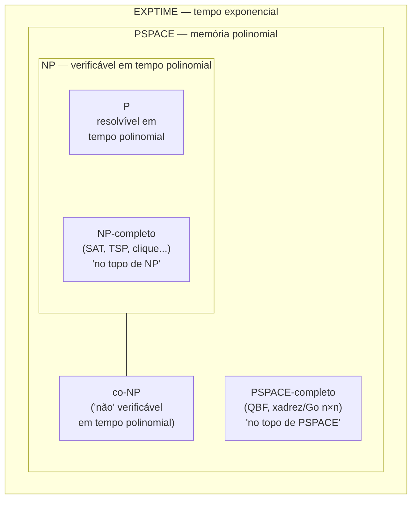
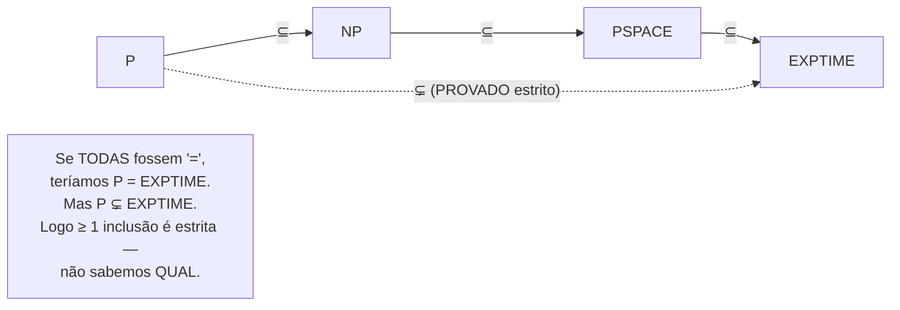
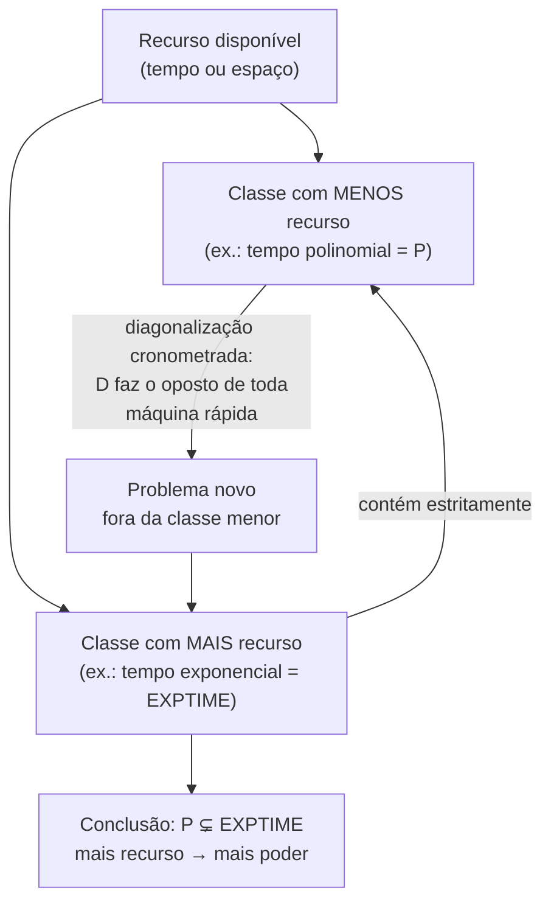
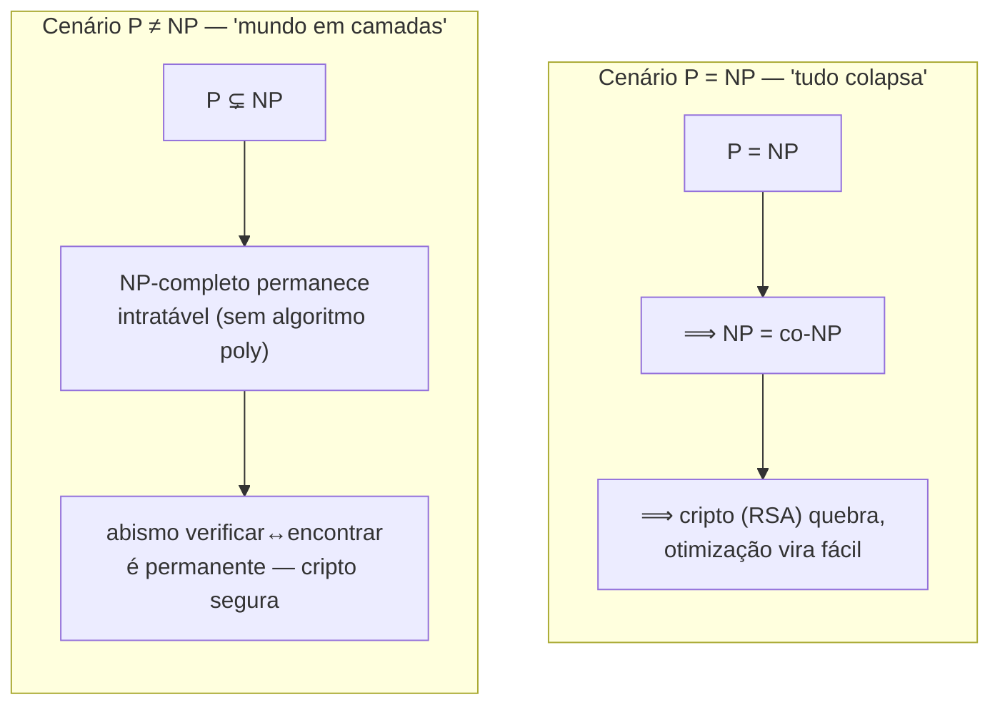

# P vs NP e o mapa das classes

> [!abstract] TL;DR
> **P = NP?** é a pergunta de US$ 1 milhão do Clay Institute, e em linguagem humana ela diz: *"se uma solução é fácil de **verificar**, ela é fácil de **encontrar**?"* Quase ninguém acredita que sim — décadas de busca não produziram um único algoritmo polinomial para um problema NP-completo, e há **resultados de barreira** que explicam por que nossas técnicas atuais não conseguem fechar a questão. Acima de P e NP existe um **mapa**: P ⊆ NP ⊆ PSPACE ⊆ EXPTIME, com co-NP ao lado e classes completas em cada andar. A única coisa que sabemos com **certeza** é que **P ⊊ EXPTIME** (estrito) — logo pelo menos uma inclusão da cadeia é estrita, só não sabemos qual.

## A pergunta do milênio

Em 2000, o **Clay Mathematics Institute** publicou os sete *Millennium Prize Problems*, cada um valendo **US$ 1 milhão**. Um deles é **P vs NP**. Até hoje, segue aberto.

A pergunta formal — relembrando o que [[14 - Complexidade computacional formal - classes de tempo, P e NP]] montou — é se as classes **P** (resolvível em tempo polinomial) e **NP** (verificável em tempo polinomial dado um certificado) são iguais. Mas a versão que gruda na cabeça é outra:

> [!question] A pergunta em uma frase
> Se eu consigo **verificar** uma solução rapidamente, eu consigo **encontrá-la** rapidamente?

Pense num Sudoku gigante. Conferir se um preenchimento está correto é trivial — você varre linhas, colunas e blocos. Isso é **verificar**, e é polinomial. Mas **achar** o preenchimento, partindo do tabuleiro vazio? Aí mora a dúvida. P = NP diria: *achar é tão fácil quanto conferir*. P ≠ NP diria: *existe um abismo entre conferir e achar, e ele nunca fecha*.

Repare como isso é universal. Demonstrar um teorema é difícil; **conferir** uma demonstração é fácil. Compor uma sinfonia é difícil; reconhecer que ela é bela é fácil. P = NP seria a afirmação de que essa assimetria — entre criar e reconhecer — é uma ilusão. É por isso que a pergunta é tão sedutora: ela toca o sentido de criatividade.

E note que a pergunta **não** é "esses problemas são impossíveis?". Todo problema NP é perfeitamente **solúvel** — basta força bruta: enumere todos os candidatos a certificado e teste cada um. O problema é que "todos os candidatos" cresce exponencialmente. Verificar um candidato é barato; o que dói é que existem `2` elevado a `n` deles. P = NP perguntaria se há sempre um atalho que evita varrer o exponencial. Guarde essa moldura: **a dificuldade de NP não é sobre decidibilidade (isso é a parte 1 do galho), é sobre o *custo* de encontrar dentro de um espaço de busca gigante.**

## O que estaria em jogo se P = NP

Suponha, por um instante, que alguém prove **P = NP** com um algoritmo prático — digamos, polinomial de grau baixo e com constantes razoáveis. O que muda? Quase tudo. Vamos por camadas, da mais óbvia à mais perturbadora.

- **A criptografia moderna ruiria.** Quebrar o **RSA** — fatorar um número enorme, ou inverter a chave — é um problema que vive em NP: dada a resposta, você confere rápido. Se P = NP, encontrar a resposta também é rápido. Assinaturas digitais, TLS, blockchains: tudo que repousa sobre "fácil de verificar, difícil de quebrar" desmorona. A criptografia de chave pública *inteira* assume, na raiz, que P ≠ NP.
- **A otimização perfeita ficaria barata.** Rotas ótimas, escalonamento ótimo, dobramento de proteínas, design de circuitos, layout de chips — uma legião de problemas NP-difíceis hoje atacados por heurística passaria a ter solução **exata** e eficiente. Não "boa o bastante": ótima.
- **O aprendizado de máquina mudaria de natureza.** Encontrar o menor modelo que ajusta os dados, achar a hipótese mais simples consistente com exemplos — versões formais disso são NP-difíceis. Com P = NP, "aprender" deixaria de ser otimização aproximada e viraria busca exata pelo melhor padrão.
- **A própria matemática viraria mecânica.** Esse é o ponto que arrepia. Se uma prova curta de um teorema existe, *verificá-la* é polinomial (basta checar cada passo lógico). Logo, com P = NP, **encontrá-la** também seria polinomial. Você daria à máquina o enunciado e um limite de tamanho, e ela cuspiria a prova — ou a certeza de que não há prova daquele tamanho.

Esse último item é o que **Scott Aaronson** transforma na imagem mais célebre sobre P vs NP. Parafraseando: *se P = NP, então o mundo seria um lugar profundamente diferente do que supomos*. Não haveria valor especial no salto criativo, porque qualquer um capaz de **reconhecer** uma boa sinfonia seria capaz de **compô-la**; qualquer um capaz de **apreciar** uma demonstração elegante seria capaz de **descobri-la**.

O gargalo entre o gosto e a criação — entre saber reconhecer o que é bom e ser capaz de produzi-lo — simplesmente evaporaria. A diferença entre Gauss e o resto de nós deixaria de ser estrutural e viraria, no máximo, uma questão de tempo de máquina.

É por isso que P vs NP não é "só" uma pergunta técnica. Ela é uma aposta sobre se a **criatividade** tem um custo irredutível. A maioria dos pesquisadores acha que sim — que o universo não é tão generoso, que descobrir é genuinamente mais caro que reconhecer. E é exatamente esse instinto que sustenta o consenso em P ≠ NP.

### Por que quase todo mundo acredita em P ≠ NP

Não é fé. É evidência acumulada:

- **Décadas de fracasso dirigido.** Desde os anos 1970 sabemos que milhares de problemas são **NP-completos** (ver [[15 - NP-completude - Cook-Levin e a cadeia de Karp]]). Um algoritmo polinomial para **qualquer um deles** resolveria **todos**. Gente brilhante caçou esse algoritmo por meio século. Nada.
- **A naturalidade da resistência.** Os problemas que resistem não são patológicos — são SAT, caixeiro-viajante, clique, mochila: coisas centrais, estudadas à exaustão. Se houvesse um truque polinomial, era de esperar que já tivesse aparecido em algum deles.
- **Os resultados de barreira.** Esse é o ponto senior. Não só *não conseguimos* provar P ≠ NP — nós **provamos que as técnicas conhecidas não bastam**. Saber *por que não sabemos* é, em si, um resultado profundo.

### As barreiras: por que sabemos que não sabemos

Três grandes barreiras mostram que famílias inteiras de técnicas estão condenadas a falhar sozinhas.

- **Relativização (Baker, Gill, Solovay, 1975).** Imagine dar às máquinas um *oráculo*: uma caixa-preta que responde alguma pergunta de graça. Baker–Gill–Solovay construíram um oráculo **A** sob o qual P = NP, e um oráculo **B** sob o qual P ≠ NP. Como uma técnica de prova que apenas trata a máquina como caixa-preta (a **diagonalização** pura) funcionaria igual nos dois mundos, ela não pode decidir a questão no mundo real. Qualquer prova de P vs NP terá que ser **não-relativizante** — terá que olhar *dentro* da computação, não tratá-la como oráculo.
- **Provas naturais (Razborov–Rudich).** Quase toda tentativa de provar limites inferiores para circuitos seguia uma receita: achar uma "propriedade dura", eficientemente computável e compartilhada por uma fração grande das funções. Razborov e Rudich mostraram que uma prova assim, contra classes fortes o bastante, **quebraria os geradores pseudoaleatórios** nos quais a própria criptografia se apoia. Ou seja: ou a cripto é frágil, ou esse tipo de prova "natural" não existe. Acreditando na cripto, a receita está barrada.
- **Algebrização (Aaronson–Wigderson).** Houve um momento de otimismo: técnicas baseadas em **aritmetização** (transformar fórmulas booleanas em polinômios sobre um corpo) *contornavam* a relativização — foi assim que se provou, por exemplo, que IP = PSPACE, um resultado que oráculos quebrariam. Parecia o caminho. Aaronson e Wigderson estragaram a festa: definiram uma noção mais fina, a **algebrização**, e mostraram que essas técnicas algébricas, sozinhas, *também* não conseguem separar P de NP. Para fechar a questão, vai ser preciso algo **não-algebrizante** — algo além de tudo que a comunidade tem na caixa de ferramentas hoje.

> [!note] A leitura senior
> As três barreiras juntas dizem: *as ferramentas que temos passam ao largo de P vs NP*. Não é que sejamos preguiçosos — é que o problema parece exigir uma ideia matemática que ainda não foi inventada. Saber disso evita que você, numa entrevista, fale de P vs NP como se fosse só "questão de esforço".

## As três possibilidades honestas

Vamos ser disciplinados. Há três desfechos logicamente possíveis:

1. **P = NP.** Improvável, segundo o consenso. Mas se acontecer, o mundo descrito acima vira realidade — e a criatividade, num sentido técnico, vira commodity. Há uma sutileza honesta aqui: mesmo um P = NP *não-construtivo* (uma prova de que o algoritmo existe, sem exibi-lo) ou com expoente absurdo (digamos, `n` elevado a 100) seria um terremoto **teórico** sem necessariamente derrubar a cripto na prática. O cenário catastrófico exige P = NP *com algoritmo prático*.
2. **P ≠ NP.** O **consenso esmagador**. O abismo entre verificar e encontrar é real e permanente. Quase toda a teoria de complexidade é construída assumindo isso (com a cautela de marcar quando depende da hipótese).
3. **Independente dos axiomas.** Especulativo, mas não absurdo. A questão poderia, em princípio, ser **indecidível dentro de ZFC** — nem demonstrável nem refutável a partir dos axiomas usuais da matemática, como Gödel mostrou que acontece com certas afirmações, e como Cohen provou para a **hipótese do contínuo**. Se P vs NP fosse independente, "não sabemos" deixaria de ser uma limitação temporária e viraria uma limitação *de princípio*. A maioria dos especialistas acha isso pouco provável — mas ninguém consegue descartar, e essa possibilidade é, por si, um lembrete de que nem toda pergunta bem-posta tem resposta dentro do sistema.

> [!tip] Honestidade intelectual
> A resposta correta para "P = NP?" é, ainda hoje, **"não sabemos"** — temperada com "e a aposta forte é em ≠". Quem afirma certeza está errado. A elegância está em saber exatamente *o contorno* da nossa ignorância.

### A terra de ninguém: NP-intermediário

Há uma pergunta que parece ingênua e tem uma resposta surpreendentemente rica: *se P ≠ NP, todo problema de NP é ou "fácil" (em P) ou "máximo" (NP-completo)? Existe um meio-termo?*

Existe — e há um teorema garantindo. O **Teorema de Ladner** (1975) prova que **se P ≠ NP, então existem problemas NP-intermediários**: dentro de NP, fora de P, mas *não* NP-completos. Uma faixa cinzenta legítima entre o trivial e o máximo.

E há candidatos naturais a morar lá. A **fatoração de inteiros** e o **isomorfismo de grafos** são os suspeitos clássicos: estão em NP, ninguém achou algoritmo polinomial, mas também ninguém os provou NP-completos — e há razões estruturais para crer que não são. (O isomorfismo de grafos, aliás, ganhou em 2015 um algoritmo *quase*-polinomial de Babai, empurrando-o ainda mais para perto de P.)

A lição para uma entrevista: "NP-difícil" e "não está em P" **não** são sinônimos de "NP-completo". O mapa, mesmo dentro de NP, tem mais andares do que a dicotomia sugere.

## O mapa das classes

P e NP são só dois bairros de uma cidade grande. Subindo na escada de recursos, encontramos:

- **PSPACE** — problemas resolvíveis com **memória polinomial**, mesmo que o **tempo** seja exponencial. A diferença entre tempo e espaço é o segredo aqui: uma célula de memória pode ser **reescrita** quantas vezes você quiser, mas cada passo de tempo é gasto uma vez e some. Com `n²` células de memória, você pode percorrer exponencialmente muitas configurações *uma depois da outra*, reaproveitando o mesmo espaço. Por isso PSPACE é uma classe **enorme** — ela engole NP e co-NP de uma vez (um certificado de NP cabe em espaço polinomial, e dá pra varrer todos os certificados reusando memória).
- **EXPTIME** — problemas resolvíveis em **tempo exponencial** (`2` elevado a um polinômio em `n`). É o teto da nossa cadeia básica, e onde vivem coisas como decidir o vencedor de jogos generalizados sob certas regras.

Um detalhe que revela a natureza estranha do **espaço**: em tempo, não-determinismo *parece* dar um salto enorme (P vs NP é justamente isso). Em espaço, **não dá** — o **Teorema de Savitch** prova que **PSPACE = NPSPACE**: uma máquina não-determinística com memória polinomial não resolve nada que uma determinística com memória polinomial (ao quadrado) não resolva. A razão é que, com espaço, dá para **reusar memória** explorando ramos de adivinhação um a um, coisa que com tempo seria proibitivamente caro. É por isso que QBF (que "adivinha" jogadas) cabe em PSPACE: o não-determinismo do jogo não custa espaço extra. Em espaço, adivinhar é barato; em tempo, é o abismo de P vs NP.

A cadeia de inclusões conhecida é:

> **P ⊆ NP ⊆ PSPACE ⊆ EXPTIME**

**Leitura do diagrama.** As caixas são aninhadas: tudo que está em P também está em NP, que está em PSPACE, que está em EXPTIME. **NP-completo** mora "no topo de NP" — são os problemas mais difíceis *dentro* de NP. **PSPACE-completo** mora no topo de PSPACE. **co-NP** fica **ao lado** de NP, dentro de PSPACE: é a classe dos problemas cujo *complemento* está em NP (onde o "não" é que tem certificado curto).

### co-NP e a pergunta NP =? co-NP

NP é a classe onde respostas **"sim"** têm certificado curto: *"este Sudoku tem solução — aqui está ela"*. **co-NP** é o espelho: respostas **"não"** têm certificado curto. *"Esta fórmula é insatisfatível"* é a cara de co-NP — provar que **nenhuma** atribuição funciona, em geral, não tem testemunha óbvia.

É **NP = co-NP**? Outra pergunta aberta. Acredita-se que **não** — não se espera que toda fórmula insatisfatível tenha uma prova curta de insatisfatibilidade (é, em parte, a razão de a complexidade de prova ser um campo de pesquisa inteiro). E há uma ligação elegante: como **P é fechada sob complemento** (basta trocar "aceita" por "rejeita" no fim do algoritmo, sem custo), se P = NP então NP = co-NP. A contrapositiva é a parte útil para o dia a dia: **se alguém provasse NP ≠ co-NP, teria de quebra provado P ≠ NP**. É por isso que separar NP de co-NP é considerado um ataque possível — porém igualmente difícil — à pergunta do milênio.

Note ainda que **NP ∩ co-NP** é um lugar interessante: problemas com certificado curto tanto para "sim" quanto para "não". A fatoração de inteiros mora ali (você pode certificar tanto a fatoração quanto a primalidade dos fatores), o que é uma das razões de ninguém acreditar que fatoração seja NP-completa — se fosse, NP-completos estariam em co-NP, e NP = co-NP desabaria.

### PSPACE-completo: o reino dos jogos

Se NP é o reino do "achar uma testemunha", PSPACE é o reino dos **jogos com adversário**. O problema canônico é **QBF** (*Quantified Boolean Formula* — fórmula booleana quantificada).

Em SAT você pergunta *"**existe** uma atribuição que satisfaz a fórmula?"* — um único quantificador ∃. Em QBF você empilha quantificadores alternados: *"**existe** x tal que **para todo** y **existe** z tal que... a fórmula vale?"*.

Essa estrutura ∃∀∃∀… é **literalmente a definição de um jogo de dois jogadores**. O ∃ sou eu escolhendo minha jogada (quero que exista *uma* jogada boa). O ∀ é o adversário respondendo (a fórmula tem de valer *para toda* resposta dele). A alternância é o ritmo do jogo: eu jogo, você responde, eu jogo, você responde.

E aqui está a razão de **jogo perfeito ser PSPACE, não NP**. Em NP, basta exibir **uma** testemunha e o verificador confere. Mas em um jogo eu não posso só dizer "minha primeira jogada é boa" — preciso garantir que ela é boa **contra todas** as respostas do adversário, e que minha resposta a cada resposta dele continua boa, e assim por diante até o fim.

Não há certificado curto. Para saber se tenho estratégia vencedora, tenho de explorar a árvore inteira de jogadas — só que *reaproveitando memória*, descendo um ramo, voltando e tentando o próximo. Isso é espaço polinomial (a profundidade da árvore) com tempo exponencial (os ramos). É exatamente o perfil de PSPACE. A **alternância de quantificadores** é o que sobe o problema de NP para PSPACE.

Essa correspondência "alternância = jogo" é o motivo de jogos de tabuleiro generalizados serem PSPACE-completos ou pior:

- **Reversi/Othello e Hex generalizados** (em tabuleiros n×n) são PSPACE-completos: jogos de duração polinomial onde decidir o vencedor equivale a avaliar uma QBF.
- **Xadrez e Go generalizados** podem subir a **EXPTIME-completos**, porque as regras de repetição permitem partidas de comprimento exponencial — a árvore de jogo fica funda demais para caber em PSPACE.
- O **planejamento** clássico em IA (achar uma sequência de ações que leva de um estado inicial a um objetivo, num mundo descrito de forma compacta) também é PSPACE-completo: o plano pode ter comprimento exponencial, mas você o verifica reusando memória.

Quando você ouvir "esse jogo é PSPACE-completo", traduza para: *"decidir quem vence com jogo perfeito é tão duro quanto avaliar qualquer QBF"*. É a razão profunda de não existir um oráculo barato de "quem ganha o Go" — e de por que jogos perfeitos vivem num andar acima de SAT no mapa.

### A hierarquia polinomial (PH): empilhando quantificadores

QBF mostra que *empilhar* ∃ e ∀ aumenta a dificuldade. A **hierarquia polinomial** (PH, de *polynomial hierarchy*) é a torre que formaliza esse empilhamento, andar por andar.

- O **primeiro andar** é o que você já conhece: **NP** (uma camada de ∃ — "existe testemunha") e **co-NP** (uma camada de ∀ — "para toda atribuição, vale").
- O **segundo andar** permite **uma alternância**: ∑₂ᵖ é "**existe** x tal que **para todo** y..." e ∏₂ᵖ é o espelho "**para todo** x **existe** y...". Um exemplo natural de ∑₂ᵖ: *"existe um circuito de tamanho k que computa esta função?"* — você adivinha o circuito (∃) e precisa que ele acerte para toda entrada (∀).
- O **andar k** permite **k alternâncias** de quantificadores. E assim por diante, ao infinito.

A intuição é direta: cada andar é como uma rodada a mais no jogo entre o "provador otimista" (∃) e o "cético" (∀). PH é o limite de QBF com um **número fixo** de alternâncias — enquanto QBF plena (alternâncias ilimitadas) é PSPACE-completa. Por isso **toda a torre PH vive dentro de PSPACE**.

A grande conjectura aqui: acredita-se que **PH não colapsa** — cada andar é estritamente maior que o anterior, a torre é genuinamente infinita. E há um dominó elegante que liga tudo de volta a P vs NP:

> [!important] O colapso da hierarquia
> Se **P = NP**, a torre **inteira desaba para P**. O argumento é por indução: se P = NP, então adicionar uma camada de ∃ não acrescenta poder (NP = P), e por simetria co-NP = P também; cada andar superior, construído sobre os de baixo, vai colapsando um a um até tudo virar P. Logo P = NP ⟹ PH = P. A contrapositiva é a munição prática: **se você provar que PH não colapsa, provou P ≠ NP de quebra.**

```mermaid
flowchart TB
    PSPACE_PH["PSPACE (contém toda a torre)"]
    dots["...andares superiores (k alternâncias)..."]
    sig2["&#931;&#8322;&#7510; (&#8707;&#8704;)  /  &#928;&#8322;&#7510; (&#8704;&#8707;)"]
    np["NP (&#8707;)  /  co-NP (&#8704;)"]
    p["P (1&#176; andar / base)"]
    PSPACE_PH --> dots --> sig2 --> np --> p
    nota["Se P = NP, a torre inteira<br/>colapsa para P."]
```

**Leitura do diagrama.** Cada andar adiciona uma alternância de quantificadores ∃/∀; quanto mais alto, mais rodadas no jogo provador-vs-cético. A torre toda cabe em PSPACE. O balão guarda o gancho: P = NP derruba todos os andares de uma vez.

### Aleatorização (BPP) e a pergunta P =? BPP

E se a máquina pudesse **jogar moedas**? **BPP** (*Bounded-error Probabilistic Polynomial time*) é a classe dos problemas resolvíveis em tempo polinomial com acesso a bits aleatórios, aceitando um **erro pequeno** (digamos, ≤ 1/3, que você reduz a quase zero repetindo e votando na maioria).

Por décadas, a aposta era que a aleatoriedade dava **poder de verdade** — que BPP fosse estritamente maior que P. A intuição era sedutora: certos problemas pareciam só ter solução eficiente *probabilística*.

O exemplo canônico é **teste de primalidade**. Decidir se um número é primo tinha, por anos, apenas algoritmos rápidos *aleatórios* — o **Miller-Rabin** (1976-80), que dá a resposta certa com altíssima probabilidade. Primalidade vivia confortavelmente em BPP, e ninguém sabia torná-la determinística-eficiente.

Então, em **2002**, Agrawal, Kayal e Saxena publicaram o **AKS** — o primeiro algoritmo *determinístico* e *polinomial* para primalidade. De repente, primalidade caiu de "BPP" para "P". A aleatoriedade tinha sido uma **conveniência**, não uma necessidade.

Esse episódio virou o cartaz da crença moderna: **acredita-se que BPP = P**. Ou seja, jogar moedas **não adiciona poder computacional** — toda solução aleatória eficiente pode, em princípio, ser **desrandomizada** (transformada em determinística sem perda significativa de eficiência). O suporte teórico vem da existência conjecturada de **geradores pseudoaleatórios** fortes o bastante: se eles existem (e há boas razões para crer que sim), a aleatoriedade verdadeira pode ser simulada por bits pseudoaleatórios baratos.

> [!note] A inversão do consenso
> Repare na ironia: em P vs NP a comunidade aposta na **separação** (P ≠ NP), mas em P vs BPP aposta na **igualdade** (P = BPP). Não é incoerência — são intuições sobre coisas diferentes. Aleatoriedade é "atalho de sorte" que parece dispensável; já o salto de verificar para encontrar parece um abismo real.

### Computação quântica (BQP): o que se sabe e o mito

**BQP** (*Bounded-error Quantum Polynomial time*) é o análogo quântico de BPP: o que um **computador quântico** resolve em tempo polinomial com erro pequeno. É a classe que captura o "poder real" da computação quântica.

O que se **sabe** com prova:

- **BPP ⊆ BQP** — um computador quântico faz tudo que um clássico-aleatório faz (ele simula moedas). Quântico é, no mínimo, tão forte quanto clássico.
- **BQP ⊆ PSPACE** — qualquer coisa quântica pode ser simulada classicamente com memória polinomial (somando amplitudes, ramo a ramo, reusando espaço). Quântico **não escapa** de PSPACE.

A vedete é o **algoritmo de Shor** (1994): fatora inteiros e calcula logaritmos discretos em tempo polinomial num computador quântico. Como RSA e Diffie-Hellman dependem da dureza desses problemas, Shor é a razão de a criptografia pós-quântica existir. Mas note: **fatoração não é tida como NP-completa** — ela vive em NP ∩ co-NP, um cantinho estruturado. Shor explora *estrutura algébrica* (periodicidade), não força bruta sobre um espaço de busca arbitrário.

> [!warning] O mito quântico
> "Computador quântico resolve NP-completo num piscar de olhos" — **falso**, ou pelo menos sem qualquer base teórica. Sabe-se que BPP ⊆ BQP ⊆ PSPACE, mas **não se sabe** que BQP contém NP, e o palpite forte é que **NP ⊄ BQP**: não se espera que máquinas quânticas resolvam NP-completos em tempo polinomial. O quântico brilha em problemas *estruturados* específicos (fatoração via Shor; busca não-estruturada com ganho só *quadrático* via Grover, longe do salto exponencial que NP-completude exigiria), não na força bruta sobre todo NP.

E "já existe"? Existem computadores quânticos **físicos**, sim — protótipos de algumas centenas a poucos milhares de qubits **ruidosos** (a era NISQ). Mas estão muito longe da escala e da correção de erros necessárias para rodar Shor sobre chaves RSA reais. BQP é, hoje, uma classe **teórica** cujo poder prático ainda não foi colhido — o mapa de complexidade não espera o hardware amadurecer.

## A única certeza: P ⊊ EXPTIME

Aqui está a sacada que vira a mesa numa entrevista. **Não sabemos** se P ⊊ NP, nem se NP ⊊ PSPACE, nem se PSPACE ⊊ EXPTIME. Mas sabemos, **com prova**, que:

> **P ⊊ EXPTIME** (inclusão **estrita**)

Existe um problema que precisa de tempo exponencial e **não tem** algoritmo polinomial — ponto final, sem hipóteses.

A consequência é deliciosa, e o argumento é puro encadeamento lógico. Olhe a cadeia inteira:

> P ⊆ NP ⊆ PSPACE ⊆ EXPTIME, **com P ⊊ EXPTIME**

Suponha, por absurdo, que **todas** as inclusões intermediárias fossem **igualdades**: P = NP, NP = PSPACE, PSPACE = EXPTIME.

A igualdade é **transitiva**. Então, juntando: P = NP = PSPACE = EXPTIME — em particular, **P = EXPTIME**.

Mas isso **contradiz frontalmente** o teorema P ⊊ EXPTIME, que é uma separação *estrita* provada sem hipótese alguma. Contradição.

Logo a suposição é falsa: **pelo menos uma** das inclusões da cadeia tem de ser estrita. **Só não sabemos qual.** Pode ser P ⊊ NP. Pode ser NP ⊊ PSPACE. Pode ser PSPACE ⊊ EXPTIME. Pode ser mais de uma. O único cenário **proibido** é serem *todas* igualdades simultaneamente.

É um exemplo lindo de quanto a teoria consegue afirmar sem resolver a pergunta de fundo: sabemos que **existe** um degrau real na escada, mesmo sem conseguir apontar **em qual andar** ele está.

**Leitura do diagrama.** As setas cheias são as inclusões conhecidas (todas ⊆). A seta tracejada é o teorema duro: P é estritamente menor que EXPTIME. O balão fecha o argumento — a separação estrita global força ao menos uma separação local, mesmo sem dizer onde.

## Os teoremas de hierarquia

De onde vem o P ⊊ EXPTIME? Dos **teoremas de hierarquia** (*Time Hierarchy* e *Space Hierarchy*). A frase-chave:

> [!important] A ideia em uma linha
> **Mais recurso permite resolver estritamente mais problemas.** Dar genuinamente mais tempo (ou mais memória) a uma máquina aumenta seu poder — não é desperdício.

A intuição é uma reencarnação da **diagonalização** de [[10 - Decidível, reconhecível e a máquina universal]]. Lá, construímos uma máquina que "fazia o oposto" de toda máquina da lista, escapando da decidibilidade. Aqui o truque é o mesmo, agora com um **cronômetro** na mão:

1. Imagine enfileiradas todas as máquinas que rodam em tempo "pequeno" — digamos, no máximo `f(n)` passos. Numere-as: M₁, M₂, M₃, ...
2. Construa uma máquina diabólica **D**, com um orçamento *maior* de tempo `g(n)`, que faz o seguinte sobre a entrada que codifica a máquina *i*: **simula** Mᵢ rodando sobre essa mesma entrada e, quando Mᵢ termina, **devolve o oposto** da resposta dela.
3. Agora a mágica da diagonal: **D** discorda de **cada** Mᵢ em pelo menos uma entrada — justamente na entrada que descreve Mᵢ. Nenhuma máquina-de-tempo-pequeno computa a mesma função que **D**.

Conclusão: o problema que **D** decide vive na classe de tempo `g(n)`, mas **não cabe** na classe de tempo `f(n)`. A classe maior contém, **estritamente**, algo que a menor não alcança.

> [!note] A letra miúda: o overhead da simulação
> Por que `g` precisa crescer "suficientemente mais rápido" que `f`, e não apenas um pouquinho mais? Porque o passo 2 esconde um custo. Para simular Mᵢ, **D** roda uma **máquina universal cronometrada** — e simular um passo de Mᵢ não custa um passo de **D**, custa um *fator extra* (tipicamente **logarítmico** no tempo simulado: você precisa manter contadores, decodificar a descrição de Mᵢ, gerenciar fitas). Se `g` não fosse generoso o bastante para absorver esse `log`, **D** não conseguiria terminar a simulação dentro do próprio orçamento, e a diagonal quebraria. É por isso que o enunciado preciso exige funções **construtíveis em tempo** e uma folga do tipo `f(n)·log f(n) = o(g(n))`. A versão de **espaço** (Space Hierarchy) é mais limpa: simular em espaço *não* cobra fator extra, então a separação vale com folga mínima. A moral, nos dois casos: **um pouco mais de recurso, genuinamente, compra problemas novos.**

Tempo polinomial (P) e tempo exponencial (EXPTIME) são níveis **muito** afastados nessa escada — a folga entre eles é gigantesca, muito além de qualquer `log`. Afastados o bastante para o teorema cravar, sem hipóteses, **P ⊊ EXPTIME**.

**Leitura do diagrama.** Partindo de "quanto recurso eu dou", dois ramos: pouco (P) e muito (EXPTIME). A diagonalização cronometrada fabrica um problema que escapa da classe menor mas cabe na maior — provando que a maior **contém estritamente** a menor. A conclusão concreta é P ⊊ EXPTIME.

> [!warning] Por que a diagonalização não fecha P vs NP
> Se a diagonalização crava P ⊊ EXPTIME, por que não crava P ⊊ NP? Porque a diagonalização **relativiza** — e a barreira de Baker–Gill–Solovay (lá em cima) mostra que técnicas relativizantes não distinguem P de NP. O cronômetro funciona quando os dois níveis são *muito* distantes (polinomial vs exponencial). Para a fronteira fina entre P e NP, ele não tem tração.

Vale fechar o laço entre as duas pontas da nota, porque essa conexão é o que diferencia uma resposta mediana de uma resposta senior. A **mesma técnica** (diagonalização da nota 10) faz duas coisas opostas dependendo da distância entre as classes:

- Entre P e EXPTIME, que estão *longe*, a diagonalização cronometrada **funciona** e prova a separação estrita. Conseguimos um teorema duro.
- Entre P e NP, que estão *colados*, a diagonalização **relativiza** e portanto não pode funcionar (Baker–Gill–Solovay). O mesmo martelo, no prego errado.

Daí a frustração elegante da área: temos uma técnica que claramente separa classes — só que ela é cega exatamente na fronteira que mais nos interessa. Resolver P vs NP exige inventar uma técnica que **olhe para dentro** da máquina de um jeito que a diagonalização (caixa-preta) não olha, e que ainda escape de provas naturais e de algebrização. Ninguém sabe que técnica é essa. É literalmente o estado da arte de "o que falta".

## Os dois cenários, lado a lado

**Leitura do diagrama.** À esquerda, P = NP funciona como dominó: NP colapsa com co-NP, a hierarquia perde andares, a criptografia cai. À direita, P ≠ NP preserva as camadas: NP-completos ficam para sempre fora de P, e o abismo entre conferir e achar vira lei da natureza computacional. O consenso aposta no quadro da direita.

## A face prática

Na prática você nunca aposta em P = NP: quando bate num problema NP-difícil, parte direto para aproximação, heurística ou casos especiais — é o que [[03-Dominios/Ciência/Algoritmos/13 - Intratabilidade]] desenvolve em detalhe. E por que isso tudo importa para um dev no banco de uma entrevista, e não só para teóricos, é o assunto de [[17 - A teoria da computação na vida do dev]].

## Curiosidades honestas: o mapa é vasto

P, NP, PSPACE e EXPTIME são o esqueleto — e já vimos PH, BPP e BQP pendurados nele. Mas o **zoológico de complexidade** real tem **centenas** de classes catalogadas. Uma que vale conhecer de nome, porque mostra uma dimensão nova:

- **#P** ("sharp-P") — não pergunta *"existe solução?"*, mas *"**quantas** soluções existem?"*. **Contar** é tipicamente mais duro que **decidir**. O exemplo clássico é o par determinante/permanente: o **determinante** de uma matriz é fácil (eliminação gaussiana), mas o **permanente** — a mesma fórmula sem os sinais de menos — é **#P-completo**. Contar caminhos num grafo, contar atribuições que satisfazem um SAT, contar emparelhamentos perfeitos: tudo mora aqui. E há um resultado de tirar o fôlego, o **Teorema de Toda**: PH inteira está contida em P^#P. Ou seja, o poder de **contar** subsume toda a torre de alternâncias de quantificadores — contar é, num sentido preciso, mais fundamental que alternar ∃ e ∀.

```mermaid
flowchart TB
    PSPACE3["PSPACE"]
    SHARP["P^#P (contagem) &#8835; PH inteira (Teorema de Toda)"]
    BQP3["BQP (quantico)"]
    PH3["PH (torre &#8707;/&#8704;)"]
    NP3["NP / co-NP"]
    BPP3["BPP &#8776; P (desrandomizacao)"]
    P3["P"]
    PSPACE3 --> SHARP
    PSPACE3 --> BQP3
    SHARP --> PH3
    PH3 --> NP3
    NP3 --> P3
    BQP3 --> BPP3
    BPP3 --> P3
    NP3 -. "NP &#8836; BQP? (conjectura)" .- BQP3
```

**Leitura do diagrama.** Tudo cabe em PSPACE. Subindo de P: BPP (que se acredita igual a P) e a torre PH, com NP/co-NP na base. BQP (quântico) fica num ramo lateral — contém BPP, está em PSPACE, mas **não** se sabe que engole NP (a linha tracejada é a conjectura de que NP ⊄ BQP). E P^#P, o poder de contar, fica alto o bastante para conter PH inteira.

## Em entrevista

- **"P = NP asks whether every problem whose solution is *easy to verify* is also *easy to find*."** Essa é a versão de uma frase que sinaliza maturidade.
- **"It's a Clay Millennium Prize problem — a million dollars, open since 2000. The consensus is P ≠ NP, but it's unproven."** Honestidade calibrada.
- **"What's striking is that we've proven *why current techniques can't settle it* — relativization, natural proofs, algebrization."** Isso impressiona: você sabe *por que não sabemos*.
- **"The one thing we know for sure is P ⊊ EXPTIME, by the time hierarchy theorem — so at least one inclusion in the chain is strict, we just don't know which."** A virada de mesa.
- **"And no, quantum computers aren't expected to crack NP-complete problems — BQP isn't known to contain NP."** Desfaz o mito sem arrogância.
- **"Counter-intuitively, the bet on randomness goes the other way: most believe BPP = P — randomization buys convenience, not power. Primality went from a randomized algorithm to a deterministic one with AKS."** Mostra que você entende as duas direções do consenso.
- **"If P = NP, the whole polynomial hierarchy collapses to P — which is one more reason almost nobody believes it."** Conecta P vs NP ao mapa maior.
- **"'NP-hard' isn't the same as 'NP-complete' — by Ladner's theorem, if P ≠ NP there are NP-intermediate problems too, like factoring or graph isomorphism."** Precisão de vocabulário que separa quem leu o assunto de quem decorou.

| Português | English |
| --- | --- |
| Pergunta do milênio | Millennium Prize problem |
| Fácil de verificar / encontrar | easy to verify / to find |
| Certificado / testemunha | certificate / witness |
| Classe de complexidade | complexity class |
| Inclusão estrita | strict (proper) inclusion |
| Teorema de hierarquia (tempo/espaço) | time/space hierarchy theorem |
| Resultado de barreira | barrier result |
| Relativização / oráculo | relativization / oracle |
| Provas naturais | natural proofs |
| Memória (espaço) polinomial | polynomial space (memory) |
| Fórmula booleana quantificada | quantified boolean formula (QBF) |
| Diagonalização | diagonalization |
| Independente dos axiomas | independent of the axioms |
| Hierarquia polinomial | polynomial hierarchy (PH) |
| A hierarquia colapsa | the hierarchy collapses |
| Aleatorização / desrandomização | randomization / derandomization |
| Computação quântica | quantum computing |
| Contagem (problemas de) | counting problems |
| NP-intermediário | NP-intermediate |
| Jogo com adversário / jogo perfeito | adversarial game / perfect play |
| Alternância de quantificadores | quantifier alternation |

> [!info] Lastro
> - **Sipser, _Introduction to the Theory of Computation_** — caps. 8–9 (Space Complexity, PSPACE, hierarquia, e o panorama de classes).
> - **Arora & Barak, _Computational Complexity: A Modern Approach_** — tratamento das classes acima de NP e dos resultados de barreira.
> - **Clay Mathematics Institute — _P vs NP Problem_ (Millennium Prize Problems, 2000).** Enunciado oficial e o prêmio de US$ 1 milhão.
> - **Baker, Gill & Solovay (1975), _Relativizations of the P =? NP Question_.** A barreira da relativização (oráculos A e B).
> - **Ladner (1975), _On the Structure of Polynomial Time Reducibility_.** O teorema dos problemas NP-intermediários.
> - **Agrawal, Kayal & Saxena (2004), _PRIMES is in P_.** O algoritmo AKS — primalidade determinística polinomial, ilustração de desrandomização.
> - **Aaronson, _Why Philosophers Should Care About Computational Complexity_ / _Reasons to believe_.** O peso filosófico de P vs NP (a fala da sinfonia e da prova matemática).
