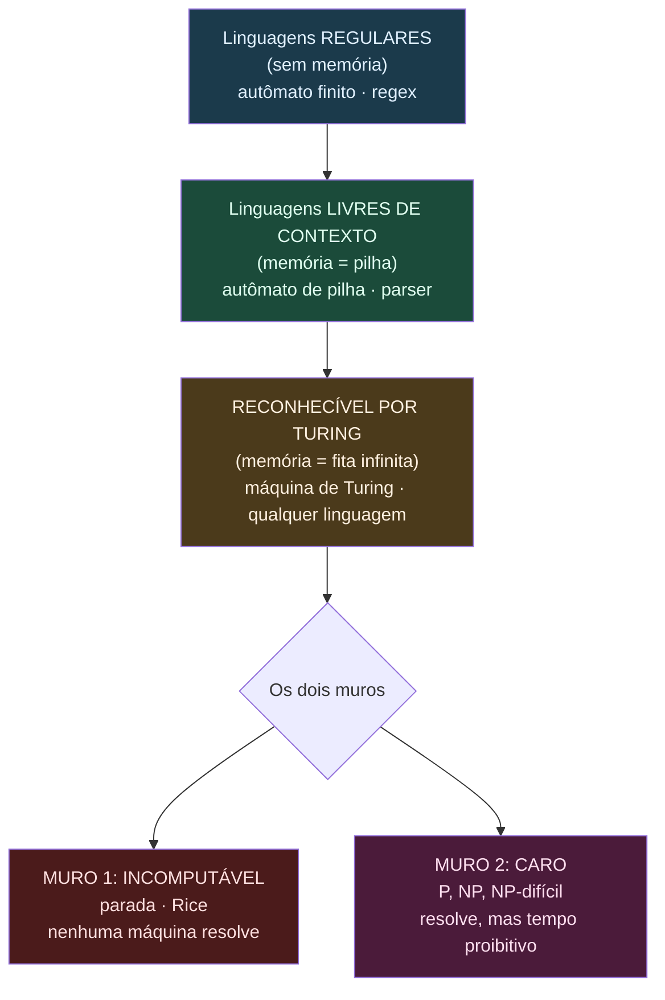
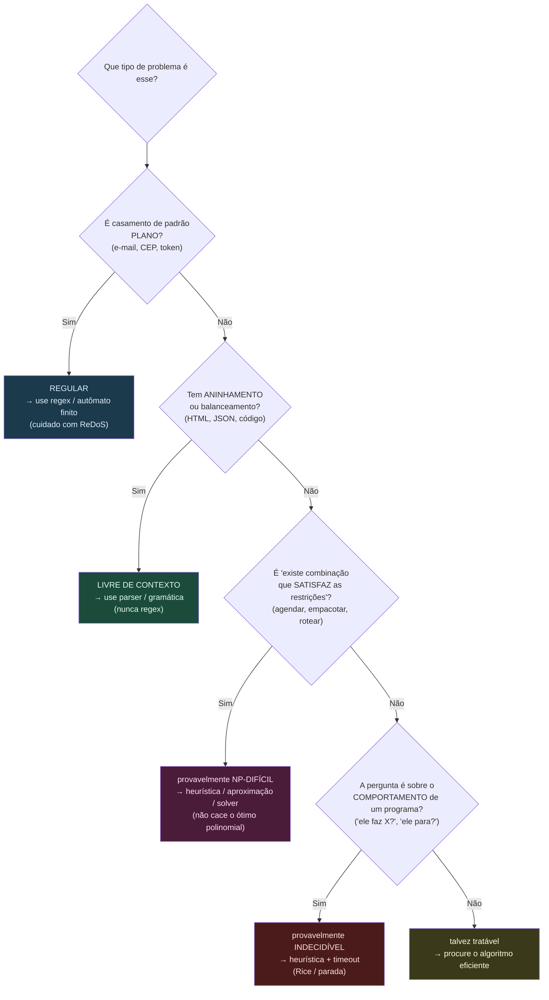

# A teoria da computação na vida do dev

> [!abstract] TL;DR
> Este é o capstone do galho. A teoria da computação não é decoração de currículo: ela te diz, **antes de você escrever uma linha**, o que é possível, o que é impossível e o que é caro demais. Regex tem teto (não parseia HTML). O linter perfeito não existe (Rice). Timeouts existem porque "vai parar?" é indecidível (parada). E quando um problema "cheira a empacotar/agendar/rotear", você para de caçar o algoritmo ótimo (provavelmente é NP-difícil) e parte pra heurística. Saber **reconhecer a classe de um problema** é o que separa quem força a barra de quem desenha a solução certa. Em entrevista o tema é raro — mas quando aparece, separa o sênior do resto.

---

## A torre, revisitada

Vamos subir a escada inteira de novo, agora de uma tacada só, porque o capstone é onde as peças encaixam.

Lá embaixo moram as **linguagens regulares**, reconhecidas por [[03 - Autômatos finitos - DFA e NFA|autômatos finitos]]. Uma máquina sem memória, só com estados. Ela enxerga padrões **planos**: um e-mail, um número de telefone, uma sequência de dígitos. É exatamente o universo das [[04 - Linguagens regulares e expressões regulares|expressões regulares]]. Poderosa pra caramba dentro do teto — e impotente fora dele.

Um degrau acima: as **linguagens livres de contexto**, reconhecidas por [[06 - Autômatos de pilha e gramáticas livres de contexto|autômatos de pilha]]. Agora a máquina ganhou uma pilha. Com uma pilha você conta, empilha e desempilha — ou seja, você lida com **aninhamento e balanceamento**: parênteses casados, tags HTML, blocos `{ }`. É o degrau onde vivem os parsers.

No topo da capacidade está a [[08 - A máquina de Turing|máquina de Turing]]: estados + fita infinita. A [[09 - A tese de Church-Turing|tese de Church-Turing]] diz que isso é tudo que "computar" significa. Qualquer computador, qualquer linguagem de programação de propósito geral, é equivalente a uma máquina de Turing. Esse é o teto da capacidade.

E aí vêm os **dois muros**. O primeiro é o muro do **incomputável**: existem problemas que nenhuma máquina de Turing resolve, ponto final. O [[11 - O problema da parada|problema da parada]] é o exemplar canônico, e o [[13 - O teorema de Rice|teorema de Rice]] generaliza isso pra "qualquer pergunta não-trivial sobre o comportamento de um programa é indecidível". O segundo muro é o muro do **caro**: problemas computáveis, mas que (provavelmente) exigem tempo proibitivo. É o reino da [[14 - Complexidade computacional formal - classes de tempo, P e NP|complexidade]], das classes P e NP, e do mapa traçado em [[16 - P vs NP e o mapa das classes|P vs NP]].

**Leitura do diagrama:** de cima pra baixo, cada degrau ganha mais memória e mais poder. Regular → pilha → fita = a hierarquia de capacidade. Os dois muros no fim são de naturezas diferentes: o primeiro diz "não dá, nunca"; o segundo diz "dá, mas não num tempo que você queira esperar". Confundir esses dois muros é o erro número um.

---

## O catálogo de resgates práticos

Aqui mora o miolo da nota. Cada limite teórico vira uma decisão de engenharia. O padrão é sempre: **limite → consequência → o que o dev faz**.

### 1. Regex tem teto (autômato finito)

**O limite.** Uma expressão regular é, no fundo, um autômato finito: estados, sem memória. Ela não conta. Não há pilha. Portanto ela **não consegue casar aninhamento arbitrário** — não consegue garantir que cada `
` tem seu `
`, nem que cada `{` fecha.

**A consequência.** Toda vez que alguém tenta parsear HTML, XML, JSON ou uma linguagem com regex, mais cedo ou mais tarde topa com um caso aninhado que quebra. (Há uma resposta lendária no Stack Overflow sobre isso, e ela está certa: você não pode.) Esses formatos são **livres de contexto** — moram um degrau acima do que regex alcança.

**O que o dev faz.** Para padrões planos — validar um CEP, extrair um número de uma string, tokenizar — regex é a ferramenta perfeita. Para qualquer coisa **aninhada ou balanceada**, use um parser de verdade (uma gramática livre de contexto: ANTLR, um parser de descida recursiva, a `json.loads` da vida). E cuidado com o **ReDoS** (Regular expression Denial of Service): certas regex com backtracking entram em **explosão catastrófica** — uma entrada de 30 caracteres trava a CPU por segundos. A causa raiz é o motor de regex tentar todos os caminhos de um NFA mal-comportado. Mitigação: regex sem backtracking aninhado, ou motores baseados em autômato (RE2). Detalhes em [[04 - Linguagens regulares e expressões regulares]].

> [!tip] Regra de bolso
> Se a estrutura pode se aninhar dentro de si mesma, regex não dá conta. Precisa de gramática.

Por que isso importa tanto no dia a dia? Porque a tentação é real. Regex é rápido de escrever, parece resolver, passa nos primeiros testes. Aí chega o documento com uma `
` dentro de outra `
` dentro de um comentário, e o castelo desaba. O teto não é uma limitação da sua regex específica — é uma limitação **da classe inteira**. Nenhuma regex, por mais engenhosa, alcança. Saber disso te poupa horas de tentar "uma versão melhor" de algo que é matematicamente impossível.

### 2. O problema da parada

**O limite.** Não existe programa que, dado qualquer outro programa e sua entrada, decida sempre e corretamente se ele vai **parar ou rodar pra sempre**. É indecidível, provado por diagonalização. Veja [[11 - O problema da parada]].

**A consequência.** Seu linter, seu IDE, seu compilador **não pegam todo loop infinito**. Não é preguiça dos engenheiros da JetBrains — é matematicamente impossível. Detecção de terminação é sempre **heurística**: pega casos óbvios, deixa passar os difíceis.

**O que o dev faz.** Aceita o que é heurístico como heurístico. E entende por que **timeouts existem em todo lugar** — no banco, no HTTP client, no job runner, no teste. Como ninguém pode provar de antemão "isso vai terminar?", a engenharia substitui a pergunta indecidível por uma decidível: "isso terminou em N segundos?". O timeout é a confissão prática de que a parada é indecidível.

Pense em quantas vezes você já viu isso sem perceber a raiz teórica: o `statement_timeout` do Postgres, o `--max-time` do `curl`, o circuit breaker que mata uma chamada lenta, o watchdog que reinicia um processo travado, o `setTimeout` que aborta uma Promise. Todos são a mesma ideia: como não posso decidir terminação, eu **imponho** terminação. Engenharia é, em boa parte, a arte de domesticar o indecidível com fronteiras práticas.

### 3. O teorema de Rice

**O limite.** Rice generaliza a parada: **qualquer propriedade não-trivial do comportamento** de um programa (o que ele computa, não como está escrito) é indecidível. "Esse programa sempre retorna um valor positivo?" "Esse programa nunca acessa null?" "Esses dois programas são equivalentes?" Tudo indecidível. Veja [[13 - O teorema de Rice]].

**A consequência.** **Análise estática perfeita não existe.** Todo type-checker, todo analisador, todo linter precisa escolher entre dois pecados:

- **Conservador (sound, mas incompleto):** nunca aprova um programa ruim, mas rejeita programas bons por precaução → **falsos positivos** ("o compilador reclamou e meu código estava certo").
- **Permissivo (completo, mas unsound):** nunca incomoda programas bons, mas deixa passar programas ruins → **falsos negativos** ("o linter passou e bugou em produção").

Esse é o trade-off **soundness × completeness**, e Rice diz que você **não pode ter os dois** com perfeição.

**O que o dev faz.** Para de esperar o "linter perfeito". Entende que cobertura de testes 100% **não significa ausência de bug** — testes mostram presença de erros, nunca a ausência (Dijkstra). E sabe ler os falsos positivos do type-checker com paciência: eles são o preço da soundness, não burrice da ferramenta.

Isso reenquadra discussões inteiras. Quando alguém pergunta "por que o TypeScript me obriga a checar `null` aqui se eu sei que nunca é null?", a resposta de fundo é Rice: o checker **não pode saber** o que você sabe sobre o comportamento em runtime, então ele é conservador por design. Quando o time discute "vamos confiar 100% no SonarQube?", a resposta é: ele acha bugs reais, mas a ausência de alertas **não prova** ausência de bugs — é incompleto por necessidade matemática, não por imaturidade da ferramenta. O sênior usa essas ferramentas como **rede de segurança**, não como **prova**.

> [!tip] O dial soundness ↔ completeness
> Toda ferramenta de análise tem um dial entre os dois extremos. Compiladores tendem ao sound (preferem incomodar a deixar passar). Linters de "code smell" tendem ao completo (preferem sugerir a calar). Saber pra que lado uma ferramenta pende te diz como interpretar o silêncio dela.

### 4. NP-completude

**O limite.** Uma enorme família de problemas é **NP-completa**: ninguém conhece algoritmo polinomial pra eles, e se você achar um pra **um deles**, achou pra **todos** (é o coração de [[15 - NP-completude - Cook-Levin e a cadeia de Karp]]). A aposta esmagadora da comunidade é que esse algoritmo **não existe** (P ≠ NP).

**A consequência.** Se o seu problema é NP-difícil, caçar o algoritmo ótimo polinomial é **caçar fantasma**. Você vai queimar semanas atrás de algo que provavelmente não existe.

**O que o dev faz.** Aprende a **farejar o cheiro**. Se o problema é da forma "empacotar coisas em caixas", "agendar tarefas em recursos", "rotear um veículo por pontos", "particionar um conjunto", "escolher o subconjunto ótimo sob restrições" — pare. Provavelmente é NP-difícil. Aí você troca o ótimo pelo **bom-o-suficiente**: heurística gulosa, aproximação com garantia (ex.: "no máximo 2× o ótimo"), um **solver** (SAT/ILP/CP-SAT resolvem instâncias gigantes na prática), ou explora **estrutura especial** da sua instância (talvez seu grafo seja uma árvore, e aí fica fácil). A face prática disso, a fundo, está em [[03-Dominios/Ciência/Algoritmos/13 - Intratabilidade]].

### 5. Turing-completude (o tarpit)

**O limite.** Uma linguagem é **Turing-completa** quando alcança o teto da computação — e com isso herda **a parada e Rice**: nela, é indecidível saber se um programa termina ou o que ele faz. Veja [[09 - A tese de Church-Turing]].

**A consequência.** Às vezes você **dá Turing-completude sem querer**. Aquele "arquivinho de config" YAML cresce, ganha condicionais, loops, includes — e vira uma linguagem de programação acidental, com toda a imprevisibilidade que isso implica. É o **"Turing tarpit"**: poder demais, garantia de menos.

**O que o dev faz.** Quando quer **garantia de terminação** — um sistema de templates que sempre renderiza, um config que sempre avalia, uma query que sempre retorna — escolhe uma linguagem **total** (não-Turing-completa de propósito): **Dhall** (config tipada, total), **regex** (não casa aninhamento, mas sempre para), **SQL puro** (sem recursão ilimitada). Você abre mão de poder pra ganhar previsibilidade. É um trade consciente, não um acidente.

### O catálogo numa tabela

Antes de seguir, o resumo em forma de mapa. Imprima na cabeça:

| Limite teórico | Consequência concreta no trabalho | O que o dev faz |
|---|---|---|
| Regex = autômato finito (sem memória) | Não parseia HTML/JSON/aninhado; ReDoS trava CPU | Regex só pra padrões planos; parser pra aninhado; RE2/regex sem backtracking aninhado |
| Problema da parada (indecidível) | Linter/IDE não pega todo loop infinito | Aceita heurística; impõe timeout / watchdog / circuit breaker |
| Teorema de Rice (indecidível) | Análise estática perfeita não existe; cobertura 100% ≠ sem bug | Lê falsos positivos como preço da soundness; usa ferramenta como rede, não prova |
| NP-completude (caro) | Não há (provavelmente) algoritmo ótimo polinomial | Heurística / aproximação com garantia / solver / estrutura especial |
| Turing-completude (poder demais) | Config/template vira linguagem acidental ("tarpit"); imprevisível | Escolhe linguagem total (Dhall, SQL puro) quando quer garantia de terminação |

**Leitura do diagrama:** é a árvore de decisão mental do dev. Quatro perguntas, na ordem certa, classificam quase qualquer problema do dia a dia. Note que ela desce pela torre: primeiro pergunta se é simples (regular), depois se é estruturado (livre de contexto), depois se é caro (NP), por fim se é impossível (indecidível). A última caixa verde é o caso feliz — vale a pena procurar o algoritmo bom.

---

## Como reconhecer a classe de um problema no trabalho

O fluxograma acima é o resumo; aqui vão as heurísticas em prosa, porque na vida real o problema vem disfarçado.

- **"Preciso validar/extrair um padrão fixo."** Plano, sem aninhamento → **regular** → regex. Ex.: validar formato de data, extrair hashtags.
- **"Preciso entender uma estrutura que se aninha."** Balanceamento, recursão na própria forma → **livre de contexto** → parser. Ex.: avaliar uma expressão matemática, ler um arquivo de config aninhado, interpretar uma DSL.
- **"Preciso encontrar a melhor combinação que respeita um monte de restrições."** Otimização combinatória → cheiro forte de **NP-difícil**. Ex.: alocar turmas em salas e horários, montar a rota mais curta passando por N cidades, escolher quais features cabem no sprint maximizando valor. Diante disso: pergunte-se "isso parece com mochila / caixeiro-viajante / coloração / SAT?". Se parece, é.
- **"Preciso responder algo sobre o que um programa faz."** Pergunta sobre comportamento → cheiro forte de **indecidível** (Rice). Ex.: "esse plugin do usuário vai travar o servidor?", "esses dois trechos são equivalentes?". Diante disso: não prometa garantia total; ofereça heurística + sandbox + timeout.

> [!example] O reflexo sênior
> O júnior pergunta "qual algoritmo eu uso?". O sênior pergunta primeiro **"que classe é esse problema?"** — e só então decide se procura o ótimo, aproxima, ou recua pro timeout.

### Um caso real, passo a passo

Suponha que chega o ticket: *"montar a grade horária da escola — N professores, M turmas, salas limitadas, ninguém em dois lugares ao mesmo tempo, respeitando preferências."* Vamos rodar a árvore mental:

1. **É padrão plano?** Não. Não estou casando um formato de string.
2. **É aninhado/balanceado?** Não. Não estou interpretando uma estrutura recursiva.
3. **É "existe combinação que satisfaz restrições"?** **Sim, exatamente.** "Alocar entidades a slots respeitando conflitos" é a definição de **coloração de grafo / scheduling** — NP-difícil.

Decisão tomada em trinta segundos, sem escrever código: **não vou procurar o algoritmo ótimo polinomial.** Vou modelar como um problema de satisfação de restrições e jogar num solver (CP-SAT, OR-Tools), ou aplicar uma heurística gulosa com troca local. Se o resultado não for perfeito, tudo bem — "bom-o-suficiente, rápido" vence "ótimo, nunca". Esse é o retorno prático do galho inteiro: a teoria te poupou de uma semana de frustração.

---

## Três mini-estudos de caso

A árvore mental brilha quando o problema chega disfarçado. Veja três situações genéricas — cada uma no formato **problema → teoria → decisão de engenharia.**

### Caso A — validar um formato de config aninhado

**O problema.** Você precisa validar um arquivo de config que permite blocos dentro de blocos: um `server` que contém `routes`, cada `route` que contém `middlewares`, e assim por diante, em profundidade arbitrária. O instinto do time é "joga uma regex que cheque as chaves".

**A teoria.** Aninhamento arbitrário é balanceamento, e balanceamento é **livre de contexto** — um degrau acima do que regex alcança. Regex é um autômato finito: sem pilha, não conta profundidade. Ela pode validar que cada linha *parece* uma chave, mas não consegue garantir que cada bloco aberto fecha no nível certo. Vai passar nos exemplos rasos e quebrar no primeiro config profundo.

**A decisão.** Use um parser de verdade. Carregue o formato com um parser estruturado (YAML/JSON/TOML já vêm com um) e valide a árvore resultante — tipos, chaves obrigatórias, profundidade — caminhando pela estrutura, não casando texto. Regex pode ainda servir para validar **folhas planas** dentro da árvore (um campo que é um e-mail, uma porta numérica). A divisão é limpa: parser para a forma aninhada, regex para os padrões planos lá dentro.

### Caso B — detectar deadlock estaticamente

**O problema.** O time quer uma ferramenta que, lendo o código, garanta "este serviço nunca vai dar deadlock". Parece o sonho: pegar o impasse antes de chegar em produção.

**A teoria.** "Esse programa pode entrar em deadlock?" é uma pergunta sobre o **comportamento** do programa — exatamente o que o [[13 - O teorema de Rice]] declara indecidível no caso geral. Não existe analisador que decida, para todo programa, se ele trava. Prometer um detector perfeito é prometer o impossível.

**A decisão.** Faz-se **análise conservadora**: a ferramenta reporta todo deadlock *possível*, aceitando levantar alarmes falsos (lock ordering analysis, detecção de ciclos no grafo de espera, type systems de sessão). Ela peca para o lado seguro — prefere acusar um deadlock que talvez não aconteça a deixar passar um real. Isso é o dial soundness↔completeness puxado para o sound. E em runtime você complementa: detecção de ciclo no grafo de locks, timeouts em aquisição de lock, ordem global de aquisição como disciplina. O estático conservador reduz o risco; ele não o elimina, porque Rice não deixa.

### Caso C — otimizar alocação de recursos

**O problema.** Distribuir tarefas entre servidores minimizando custo, respeitando capacidade de cada máquina e afinidades entre tarefas. Alguém propõe "vamos achar a alocação ótima".

**A teoria.** "Distribuir itens em recipientes minimizando custo sob restrições de capacidade" é **bin packing / partição** disfarçado — NP-difícil. Caçar a alocação ótima polinomial é caçar fantasma: o algoritmo provavelmente não existe (P ≠ NP).

**A decisão.** Reconhecer a classe e **escolher uma heurística**. First-fit decreasing resolve bin packing perto do ótimo na prática, com garantia teórica de fator conhecido. Se a qualidade precisa ser maior, um solver ILP/CP-SAT engole instâncias grandes. E o reflexo sênior: não venda "alocação ótima" no design — venda "alocação boa o suficiente, recalculada rápido". A face prática completa está em [[03-Dominios/Ciência/Algoritmos/13 - Intratabilidade]].

---

## Onde isso aparece em system design / entrevista

Vou ser honesto: este tema é **raro em entrevista**. Você não vai cair num round inteiro de "prove que SAT é NP-completo" a não ser que seja vaga de pesquisa. Mas ele aparece de lado, e quando aparece, **separa o sênior** — porque mostra que você sabe parar de cavar antes de quebrar a pá.

Três momentos onde ele surge:

1. **Discutir limites com elegância.** No meio de um design, você reconhece que o subproblema de "alocação ótima" é NP-difícil e, em vez de travar, propõe: *"isso é NP-difícil, então não vou atrás de uma solução exata; proponho uma heurística gulosa com garantia de fator 2, e se precisar de mais qualidade troco por um solver ILP."* Isso é ouro: mostra reconhecimento + saída pragmática.

2. **Validação de entrada complexa.** Se o sistema recebe uma estrutura aninhada (um documento, uma query do usuário, uma DSL), você sabe dizer: *"isso não dá pra validar com regex — precisa de um parser, porque a estrutura é livre de contexto."* Pequeno, mas denuncia maturidade.

3. **Por que não existe o "verificador perfeito".** Quando o entrevistador pergunta sobre garantir que código de terceiros não trava seu sistema, você invoca Rice: *"não dá pra provar estaticamente que esse plugin termina — isso é indecidível —, então isolo num sandbox com timeout e limite de recursos."*

> [!example] O movimento que impressiona
> Não é citar o teorema com nome pomposo. É a **transição suave** do reconhecimento pra ação: "reconheço que isso é NP-difícil / indecidível **→** logo, em vez de travar, faço X". O entrevistador não está testando se você decorou Sipser. Está vendo se você **para de cavar no lugar errado** e propõe um caminho pragmático. Reconhecer o muro e contorná-lo com elegância — esse é o sinal.

Um aviso de calibragem: **não force**. Soltar "isso é NP-completo" num problema que claramente roda em O(n log n) faz o efeito contrário — soa como decoreba mal aplicada. O valor está em usar a lente **só quando o problema realmente pertence à classe**. Reconhecimento correto > vocabulário impressionante.

### O que NÃO dizer em entrevista

Os anti-padrões abaixo são jeitos rápidos de soar como quem decorou o vocabulário sem entender. O entrevistador sênior fareja cada um deles na hora.

- **Não diga "NP é o que não roda em tempo polinomial".** NP é "*verificável* em tempo polinomial dado um certificado". P está *dentro* de NP. Trocar isso revela que você confunde verificar com resolver — o exato eixo do problema P vs NP.

- **Não diga "é impossível"** quando quer dizer "é indecidível no caso geral". Dizer "impossível detectar deadlock" soa derrotista e impreciso; o correto é *"é indecidível no caso geral, então faço análise conservadora mais runtime"*. A diferença mostra que você sabe contornar o muro, não só apanhar dele.

- **Não prometa um detector perfeito.** "Eu escrevo um analisador que pega todos os loops infinitos / todos os deadlocks / todos os bugs" é prometer derrubar Rice e a parada. Promessa que você não pode cumprir é a pior coisa a fazer num design. Diga "conservador" ou "heurístico", nunca "completo e correto".

- **Não diga que computador quântico resolve NP-completo.** Não há resultado conhecido nesse sentido. Quântico acelera problemas específicos (fatoração, com Shor; busca, com Grover dando ganho quadrático — não exponencial). Afirmar que quântico mata NP-completude é mito de divulgação, e o entrevistador técnico sabe.

- **Não diga "exponencial = NP".** Há problemas exponenciais que nem estão em NP, e o "exponencial" de NP-completo é uma *crença* (assumindo P ≠ NP), não um teorema. O termo seguro é "intratável" ou "sem algoritmo polinomial conhecido".

> [!warning] A regra de ouro do tom
> Sempre que for tentado a dizer **"impossível"**, pergunte-se: é *indecidível* (algoritmo nenhum existe) ou *intratável* (existe, mas é caro)? Dizer a palavra certa é metade da impressão que você causa.

---

## How to explain in English

Esta é a parte que você decora. Frases prontas, calibradas pra soar como engenheiro sênior numa entrevista internacional. (Este é o clímax do capstone — leia em voz alta até sair natural.)

**Sobre NP / intratabilidade:**

- *"This problem is NP-complete, so I wouldn't look for an exact polynomial-time algorithm — I'd use a heuristic or an approximation algorithm instead."*
- *"This smells like a scheduling / packing / routing problem, which tends to be NP-hard, so the right move is a good-enough solution, not the optimal one."*
- *"NP-hard doesn't mean impossible in practice — modern SAT and ILP solvers handle huge instances. I'd reach for a solver before writing my own search."*
- *"If the instance has special structure — say the graph is a tree — the problem may become tractable, so it's worth checking."*

**Sobre parsing / regex:**

- *"You can't parse nested structures with a regular expression — you need a context-free grammar, so I'd use a real parser here."*
- *"Regex is the right tool for flat patterns like tokens or IDs, but not for anything that can nest inside itself."*
- *"I'd be careful about ReDoS here: a poorly written regex can backtrack catastrophically and become a denial-of-service vector."*

**Sobre análise estática / Rice:**

- *"Perfect static analysis is impossible by Rice's theorem, so the linter is necessarily conservative — it'll either flag false positives or miss some real bugs."*
- *"There's a fundamental trade-off between soundness and completeness: a sound analyzer never misses a bug but rejects some valid programs, and vice versa."*
- *"100% test coverage doesn't mean the code is bug-free — tests can show the presence of bugs, never their absence."*

**Sobre a parada / terminação:**

- *"We can't statically prove this third-party code always terminates — that's undecidable — so I'd run it in a sandbox with a hard timeout."*
- *"Timeouts exist precisely because 'will this halt?' is undecidable; we replace an undecidable question with a decidable one: 'did it finish within N seconds?'."*

**Sobre Turing-completude:**

- *"This config format is becoming Turing-complete by accident — a 'Turing tarpit' — so I'd switch to a total language like Dhall to guarantee evaluation always terminates."*

**Quando o entrevistador cutuca (follow-ups):**

- *"What's the difference between NP-hard and undecidable?"* → *"NP-hard problems are solvable in principle — they're just expensive in the worst case. Undecidable problems have no algorithm at all, no matter how much time you allow. Routing is hard but doable; the halting problem is impossible."*
- *"Doesn't NP just mean it takes exponential time?"* → *"Not quite. NP means a solution can be verified in polynomial time given a certificate. We don't have a proof that solving requires exponential time — that's the open P versus NP question."*
- *"Could a quantum computer solve NP-complete problems quickly?"* → *"There's no known result saying it can. Quantum helps with specific problems like factoring, but NP-completeness in general isn't believed to fall to quantum speedups."*
- *"So should I never use regex for parsing?"* → *"Regex is great for flat, non-nested patterns. The moment the input can nest inside itself, you've crossed into context-free territory and you need a parser."*

**Full interview dialogues (interviewer asks, you answer like a senior):**

These are the harder, open-ended follow-ups. The skill is in the calm reframe — naming the class, then pivoting straight to the engineering move.

> **Interviewer:** *"Why can't you just write a tool that detects all infinite loops in our code?"*
>
> **You:** *"Because that's the halting problem, and it's provably undecidable — no program can decide, for every possible input program, whether it halts. It was proven by diagonalization back in 1936. So any loop detector is necessarily a heuristic: it catches the obvious cases and misses the subtle ones. In practice I don't try to prove termination; I bound it. I'd add timeouts, watchdogs, and resource limits so that even a runaway loop fails safe instead of taking down the box."*

> **Interviewer:** *"Is this problem actually solvable?"*
>
> **You:** *"It depends on which 'solvable' we mean — and that distinction matters. If you're asking whether an algorithm exists at all, that's decidability. If you're asking whether one runs fast enough to be useful, that's tractability. So I'd first check: is this a behavioral question about a program, like 'does it always do X'? If so, it's likely undecidable and I won't promise a perfect answer. If it's combinatorial optimization, it's solvable but probably NP-hard, so I'd aim for good-enough rather than optimal. Naming the wall tells me which tool to reach for."*

> **Interviewer:** *"How would you approach this scheduling problem — assigning jobs to machines under constraints?"*
>
> **You:** *"Scheduling under conflicting constraints is a classic NP-hard family — it reduces to graph coloring or constraint satisfaction. So I wouldn't burn time hunting for an exact polynomial algorithm; one almost certainly doesn't exist. I'd model it as a constraint-satisfaction problem and feed it to a solver like CP-SAT, or use a greedy heuristic with local search if I need a fast approximate answer. If the instances turn out to have special structure — say the conflict graph is sparse or tree-like — I'd exploit that, because that's where these problems become tractable."*

> **Interviewer:** *"What's the difference between NP and NP-complete?"*
>
> **You:** *"NP is the class of problems whose solutions can be verified in polynomial time, given a certificate. NP-complete is the hardest subset of NP: a problem is NP-complete if it's in NP and every other NP problem reduces to it in polynomial time. So if you found a fast algorithm for one NP-complete problem, you'd have one for all of NP — that's what makes them the linchpin. SAT was the first, by Cook and Levin. NP-hard is the broader bucket: at least as hard as NP-complete, but not necessarily in NP itself — it might not even be decidable."*

> **Interviewer:** *"Can't we just throw more hardware at an NP-complete problem?"*
>
> **You:** *"Only up to a point, and that's the trap. The cost grows exponentially with input size, so doubling your hardware buys you maybe one more element in the input — not a different growth curve. What actually scales is a smarter approach: a solver that prunes the search aggressively, an approximation with a proven bound, or exploiting structure in the real-world instances. Hardware fights the constant; the algorithm fights the exponent. You want to fight the exponent."*

---

## Vocabulário PT → EN

| Português | English |
|---|---|
| decidível / decidibilidade | decidable / decidability |
| indecidível | undecidable |
| reconhecível (Turing) | (Turing-)recognizable |
| recursivamente enumerável | recursively enumerable |
| problema da parada | halting problem |
| redução | reduction |
| redução por mapeamento | mapping reduction |
| diagonalização | diagonalization |
| lema do bombeamento | pumping lemma |
| autômato finito | finite automaton |
| autômato de pilha | pushdown automaton |
| máquina de Turing | Turing machine |
| linguagem regular | regular language |
| livre de contexto | context-free |
| gramática | grammar |
| Turing-completo | Turing-complete |
| linguagem total | total language |
| classe de complexidade | complexity class |
| complexidade de tempo | time complexity |
| complexidade de espaço | space complexity |
| tempo polinomial | polynomial time |
| satisfatibilidade (SAT) | satisfiability (SAT) |
| NP-difícil | NP-hard |
| NP-completo | NP-complete |
| certificado / testemunha | certificate / witness |
| verificador | verifier |
| tratável / intratável | tractable / intractable |
| aproximação | approximation |
| heurística | heuristic |
| solver | solver |
| soundness / sound | soundness / sound |
| completude (análise) | completeness |
| falso positivo / negativo | false positive / negative |
| backtracking catastrófico | catastrophic backtracking |

---

## Armadilhas comuns

> [!warning] Onde até gente boa tropeça
> - **"NP quer dizer não-polinomial."** Errado. NP é "verificável em tempo polinomial" (Nondeterministic Polynomial). Um problema em NP tem **solução conferível rápido** dado um certificado. P ⊆ NP. Confundir os dois é o erro clássico.
> - **"NP-difícil = impossível na prática."** Errado. NP-difícil é sobre o pior caso e sobre garantia teórica. **Solvers resolvem instâncias enormes** todo dia (planejamento, alocação, verificação). O "impossível" é achar um algoritmo polinomial **universal**, não resolver o seu caso concreto.
> - **"Indecidível = muito difícil."** Errado. Indecidível significa que **nenhum algoritmo existe**, nem com tempo infinito de espera por uma resposta correta garantida. É de outra natureza que "caro". Parada e Rice são indecidíveis; caixeiro-viajante é "só" caro.
> - **"Computação quântica resolve NP-completo rápido."** Não se sabe disso. Quântico ajuda em problemas específicos (fatoração, com Shor), mas **não há prova de que resolve NP-completo em tempo polinomial**; a crença predominante é que não.
> - **"Vou parsear esse HTML com regex."** Já discutimos. Não.

Há ainda uma armadilha mais sutil, de atitude: **achar que "teoria" é o oposto de "prático".** O galho inteiro prova o contrário. A teoria da computação é a coisa mais prática que existe, porque ela te diz onde **não** gastar esforço. Saber que um muro existe antes de correr até ele economiza mais tempo do que qualquer micro-otimização. O dev que ignora a teoria não é mais pragmático — é só alguém que vai descobrir os mesmos limites do jeito caro, depurando em produção às três da manhã.

---

## A torre amarrada num só princípio

Se você tivesse que sair desta nota com uma única frase, seria esta: **a teoria da computação te ensina a fazer a pergunta certa antes de escolher a ferramenta.**

Repare no padrão que atravessa o galho inteiro. Toda vez que a teoria diz "não dá" ou "é caro demais", a engenharia responde com a **mesma jogada**: troca uma pergunta impossível por uma possível.

- A parada é indecidível? → trocamos "vai terminar?" por "terminou em N segundos?" (**timeout**).
- Rice torna a análise perfeita impossível? → trocamos "está correto?" por "passou nos checks que eu sei rodar?" (**linter conservador + testes**).
- NP-completude torna o ótimo inviável? → trocamos "qual é o melhor?" por "qual é bom o suficiente, rápido?" (**heurística / solver**).
- Regex não casa aninhamento? → trocamos "uma regex melhor" por "a ferramenta da classe acima" (**parser**).

É sempre a mesma sabedoria: **reconhecer o muro, aceitar o muro, contornar o muro.** Quem nega que o muro existe bate nele. Quem o reconhece, desenha a rota ao redor. Esse é o presente que este galho deixa pra sua carreira — não fórmulas, mas um **filtro mental** que roda antes de cada decisão técnica importante.

> [!quote] Três limites, três reflexos
> **Plano vs. aninhado** → regex ou parser.
> **Caro (NP)** → ótimo ou bom-o-suficiente.
> **Impossível (parada/Rice)** → garantia ou heurística-com-fronteira.
> Decore esses três pares e você carrega o galho inteiro no bolso.

---

## Índice mental do galho inteiro

Um quadro-resumo para revisar antes de uma entrevista: cada conceito, onde mora, o que é em uma frase, e por que importa pro dev. Se você consegue preencher cada linha de memória, fechou o galho.

| Conceito | Nota | O que é (1 frase) | Por que importa pro dev (1 frase) |
|---|---|---|---|
| Autômato finito / DFA-NFA | [[03 - Autômatos finitos - DFA e NFA\|03]] | Máquina sem memória, só estados, que reconhece padrões planos. | É o motor por trás de regex — e o que define seu teto. |
| Linguagens regulares / regex | [[04 - Linguagens regulares e expressões regulares\|04]] | A classe mais baixa: padrões sem aninhamento. | Regex resolve o plano e falha (ou explode em ReDoS) no aninhado. |
| Autômato de pilha / GLC | [[06 - Autômatos de pilha e gramáticas livres de contexto\|06]] | Máquina com uma pilha, reconhece balanceamento e aninhamento. | É o degrau dos parsers: HTML, JSON, código vivem aqui. |
| Máquina de Turing | [[08 - A máquina de Turing\|08]] | Estados mais fita infinita — o teto da computação. | Define formalmente o que "computar" significa, e o limite de qualquer linguagem. |
| Tese de Church-Turing | [[09 - A tese de Church-Turing\|09]] | Tudo que é computável é computável por uma máquina de Turing. | Sua linguagem favorita não é mais poderosa que o modelo — herda os mesmos limites. |
| Problema da parada | [[11 - O problema da parada\|11]] | Decidir se um programa para é indecidível. | Por isso timeouts, watchdogs e circuit breakers existem em todo lugar. |
| Teorema de Rice | [[13 - O teorema de Rice\|13]] | Qualquer propriedade não-trivial do comportamento é indecidível. | Análise estática perfeita não existe; linter é rede, não prova. |
| Complexidade formal / P e NP | [[14 - Complexidade computacional formal - classes de tempo, P e NP\|14]] | Classes de problemas por custo de tempo; NP = verificável rápido. | Diz o que é tratável e o que é caro demais antes de você codar. |
| NP-completude / Cook-Levin / Karp | [[15 - NP-completude - Cook-Levin e a cadeia de Karp\|15]] | Os problemas mais duros de NP: resolver um resolve todos. | Reconhecer NP-difícil te poupa de caçar um algoritmo ótimo que não existe. |
| P vs NP / mapa das classes | [[16 - P vs NP e o mapa das classes\|16]] | A pergunta aberta: verificar rápido implica resolver rápido? | Organiza todo o reino do "caro" num mapa mental único. |

---

> [!info] Lastro
> - **Michael Sipser — _Introduction to the Theory of Computation_, 3ª ed.** (Cengage, 2013). A torre inteira deste galho, do degrau regular ao incomputável, com a melhor didática do mercado.
> - **Hopcroft, Motwani & Ullman — _Introduction to Automata Theory, Languages, and Computation_.** O clássico para autômatos, gramáticas e a hierarquia de linguagens.
> - **Sanjeev Arora & Boaz Barak — _Computational Complexity: A Modern Approach_** (Cambridge University Press, 2009). O tratado moderno sobre P, NP e o mapa das classes.
> - **Garey & Johnson — _Computers and Intractability: A Guide to the Theory of NP-Completeness_** (W. H. Freeman, 1979). A bíblia da NP-completude e o catálogo de problemas intratáveis — o livro que todo engenheiro consulta ao farejar NP-dificuldade.
