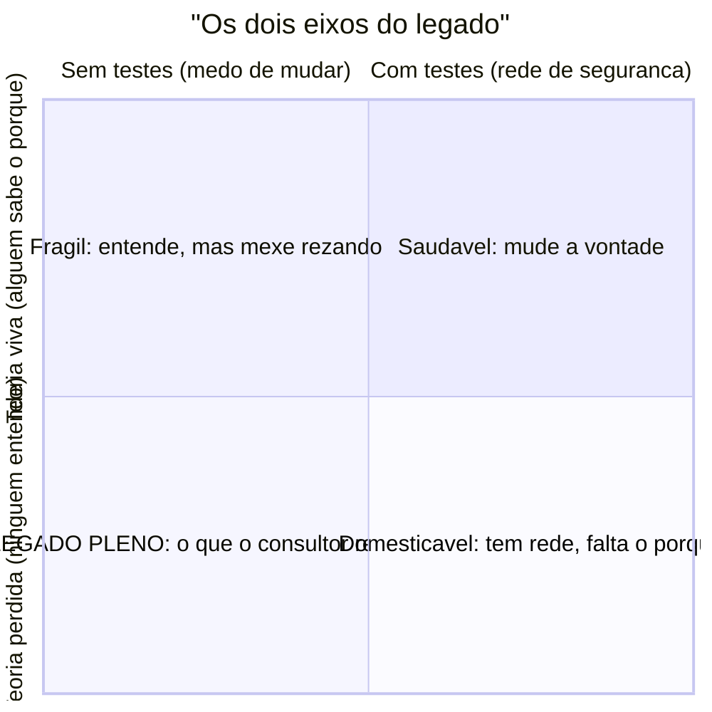

# O que é código legado

> [!abstract] TL;DR
> "Legado" não é sobre idade nem sobre tecnologia velha. Há duas definições que valem: a de **Michael Feathers** — *código sem testes*, porque sem rede de segurança você tem medo de mudá-lo — e a de **Marianne Bellotti** — *código cujo dono foi embora*, porque o que se perde não é o texto, é a **teoria** de por que ele existe. As duas se encontram no que o consultor quase sempre recebe: um sistema sem rede *e* sem ninguém que o explique. Este galho ensina a assumir exatamente esse sistema.

Você foi chamado para assumir um sistema. Pode ser um cliente que comprou uma empresa e herdou o software junto; pode ser uma equipe que perdeu o único dev que entendia o faturamento; pode ser um resgate — nada funciona e ninguém sabe por quê. Você abre o repositório pela primeira vez. E a primeira pergunta que todo mundo faz, cedo ou tarde, é: *"isso aqui é legado?"* — como se "legado" fosse um veredito, um carimbo de condenação.

O problema é que quase todo mundo responde essa pergunta pela razão errada.

## A resposta ingênua (e por que ela falha)

Pergunte a dez desenvolvedores o que é código legado e a maioria vai apontar para **idade** ou **tecnologia**: "é aquele COBOL de 1998", "é o monólito PHP", "é o sistema que roda em Java 6". É uma resposta intuitiva e quase sempre inútil.

Ela falha por dois motivos. Primeiro, existe código de vinte anos, escrito numa linguagem que ninguém mais ama, que é uma delícia de mexer: bem testado, bem nomeado, com quem o mantém sabendo exatamente o que faz. Segundo — e mais assustador — existe código que virou legado na sexta-feira da semana passada. Foi mal escrito, ninguém testou, e a única pessoa que o entendia pediu demissão. Ele tem uma semana de vida e já é um pântano.

> [!question]- Se não é idade nem tecnologia, então o que torna um código "legado"?
> Duas coisas, e elas são independentes: se você **consegue mudá-lo com segurança** e se **alguém ainda entende por que ele faz o que faz**. As duas definições a seguir atacam uma dessas dimensões cada.

Idade e stack são *sintomas correlacionados*, não a causa. Código velho tende a acumular os dois problemas reais — mas é o problema real que importa, não a data no `git log`.

### Um parêntese: "legado" não nasceu xingamento

Vale saber de onde a palavra vem, porque ela envenena o julgamento. *Legacy* não surgiu como insulto. Nos anos 1980, chamar um sistema de "legado" era quase elogio: era o sistema que **estabeleceu o padrão**, a herança sobre a qual tudo o que veio depois foi construído. Legado é, literalmente, o que se herda de quem veio antes — e herança costuma ser coisa de valor.

O tom pejorativo grudou depois, por associação com o custo de manter esses sistemas. Guardar o sentido original importa para o consultor: você não herdou lixo, herdou um **ativo que ainda roda o negócio de alguém**. É essa a postura que a próxima nota vai chamar de mentalidade do restaurador.

## Definição 1 — Feathers: legado é código sem testes

Michael Feathers, no livro que virou a bíblia do assunto (*Working Effectively with Legacy Code*, 2004), dá a definição mais citada e mais provocadora da indústria:

> **Código legado é simplesmente código sem testes.**

Na primeira leitura soa exagerado — quase uma provocação para vender uma metodologia de testes. Mas o raciocínio é cirúrgico, e é sobre **medo**, não sobre cobertura.

Pense no que um teste te dá quando você vai mexer em código alheio: uma rede. Você faz a mudança, roda a suíte, e ela te diz em segundos se você quebrou algo. Sem essa rede, cada alteração é um salto no escuro. Você lê o código três vezes, mexe com o coração na mão, faz o deploy rezando, e passa a semana esperando o telefonema. **Sem testes, você não tem como saber se a sua mudança preservou o comportamento** — e código que você tem medo de mudar é código que apodrece, porque as melhorias que ele precisa nunca chegam.

Repare no que essa definição faz de esperto: ela transforma "legado" de um lamento vago ("esse código é horrível") num **problema com solução**. Não dá para consertar "código velho" — o tempo não anda para trás. Mas dá, sim, para colocar um sistema sob testes. A definição de Feathers é otimista disfarçada de pessimista: ela aponta a saída.

> [!tip] Assista: Working Effectively with Legacy Code (20 anos depois) — com Michael Feathers
> **Canal:** Tech Lead Journal | **Duração:** ~60min | **Idioma:** EN (legenda manual)
>
> O próprio Feathers, duas décadas após o livro, reafirma e atualiza a definição — e mostra por que ela ainda organiza o tema. Boa ponte para o que vem no galho: ele fala de *characterization testing* (a nota 10) e do papel da IA em entender sistemas (a nota 16). Trecho de destaque [0:00]: *"Legacy code is code without tests. If you have code and it has lots of tests, it's relatively easy to change. If you don't have the tests, you're really in serious trouble."*
>
> 🎬 [Assistir no YouTube](https://www.youtube.com/watch?v=mwVRHDD0tEk)

## Definição 2 — Bellotti: legado é código cujo dono foi embora

Marianne Bellotti, que passou a carreira modernizando alguns dos sistemas mais antigos e caóticos do mundo (das Nações Unidas ao governo americano), enxerga de outro ângulo em *Kill It with Fire* (2021). Para ela, o que faz um sistema virar legado tem menos a ver com o texto do código e mais com **quem saiu pela porta**:

> O difícil no legado é *o sistema em volta do sistema* — a organização, a comunicação, a política e os incentivos.

Traduzindo para o dia a dia: um sistema vira legado no dia em que a pessoa que o entendia vai embora. Não importa quão limpo seja o código — se ninguém mais sabe **por que** a taxa é calculada daquele jeito, por que aquele `if` esquisito existe, por que o serviço de e-mail tem um retry de exatamente três tentativas, você herdou um legado. O código está lá, legível, rodando. O que sumiu foi o **significado**.

### O que realmente se perde: a teoria

Aqui as duas definições se encontram com uma ideia mais funda, de Peter Naur, que já mora neste Codex: [[03-Dominios/Engenharia/Complexidade de Software/04 - O programa como teoria|O programa como teoria]]. Naur argumenta que o valor real de um software **não é o código-fonte** — é a *teoria* viva na cabeça de quem o construiu: o modelo mental de como e por que tudo se encaixa, o que pode mudar e o que é intocável, quais decisões foram deliberadas e quais foram acidente.

O código é apenas a **encarnação parcial** dessa teoria. Muita coisa nunca chega a ser escrita — fica no tácito, no "todo mundo aqui sabe". Quando o autor vai embora sem transferir a teoria, o código continua, mas vira um artefato morto: um hieróglifo sem a pedra de Roseta. É por isso que a metáfora deste galho é **arqueologia**. Você não está lendo código; está escavando uma civilização perdida a partir das ruínas que ela deixou.

## As duas dimensões, juntas

As definições de Feathers e Bellotti não competem — elas medem **eixos diferentes** do mesmo objeto. Uma pergunta "você consegue mudar com segurança?" (rede de testes). A outra pergunta "alguém ainda entende por quê?" (teoria viva). Cruzando os dois eixos, o terreno fica claro:

- **Saudável** (testes + teoria viva): o sonho. Você muda com segurança e sabe o que está fazendo.
- **Frágil** (teoria viva, sem testes): o autor ainda está na cadeira ao lado, mas não há rede. Funciona — até ele sair. É legado esperando para acontecer.
- **Domesticável** (testes, sem teoria): raro e curioso — há uma suíte que trava se você quebrar algo, mas ninguém lembra por que as regras são o que são. Você refatora com segurança mesmo sem entender. A rede supre a teoria ausente.
- **Legado pleno** (sem testes, sem teoria): o pântano. Nenhuma rede *e* nenhum guia. É, quase sempre, o quadrante em que o consultor aterrissa — e o que este galho existe para atacar.

> [!example] O quadrante que confunde: "Domesticável" na prática
> Você herda um sistema de cobrança com uma suíte de testes decente — o time anterior era disciplinado, mas saiu inteiro. Nenhuma regra de negócio está documentada e ninguém sabe *por que* a multa é 2% e não 3%. Ainda assim, dá para refatorar com relativa segurança: se você quebrar algo, um teste acende o vermelho. A rede supre, em parte, a teoria ausente — você mexe no *como* sem entender o *porquê*. É o único quadrante em que dá para agir antes de escavar.

| | Feathers | Bellotti |
|---|---|---|
| **Pergunta central** | Consigo mudar com segurança? | Alguém entende por quê? |
| **O que falta** | Testes (a rede) | Teoria (o significado) |
| **Raiz do problema** | Técnica | Organizacional / humana |
| **A saída** | Pôr sob testes (rede de segurança) | Recuperar a teoria (arqueologia) |
| **Onde no galho** | Fase Adepto (rede de segurança, seams) | Fase Iniciado + Magus (entender + política) |

## Por que o consultor precisa das duas

Se você fosse um funcionário interno herdando o código do colega da mesa ao lado, talvez uma definição bastasse — ele ainda está lá para explicar. Mas a **lente do consultor é diferente**: você entra *de fora*, quase sempre pega os dois problemas de uma vez, e raramente tem o autor disponível.

Isso muda o seu método. Você não pode só "colocar sob testes" (Feathers) se não faz ideia de qual comportamento é correto e qual é bug que virou feature — precisa antes **escavar a teoria** (Bellotti/Naur) para saber o que a rede deve proteger. E não adianta só reconstruir a teoria se, no fim, você não tem como mudar nada sem quebrar. As duas definições viram as duas metades do seu trabalho: **entender** (arqueologia) e **poder agir com segurança** (a rede que habilita a restauração).

### Legado não é só o código que você escreveu

Um detalhe que a lente do consultor expõe cedo: legado não se limita ao código-fonte próprio da empresa. Um ERP de prateleira (COTS) cujo fornecedor faliu, um SaaS que foi descontinuado, uma biblioteca de terceiros que ninguém mantém mais (*abandonware*), um sistema preso a um fornecedor que segura a chave (*vendor lock-in*) — tudo isso é legado, e às vezes o pior tipo, porque você nem tem o código para escavar. As duas perguntas continuam valendo (consigo mudar com segurança? alguém entende por quê?), só que agora a resposta às duas pode ser "não, e não há como" — e a restauração vira **negociação com um terceiro** em vez de refatoração.

## Casos práticos

### Cenário 1: a due diligence de aquisição

Uma empresa vai comprar outra e te contrata para avaliar o software antes da assinatura. Você tem duas semanas e acesso ao repositório. A pergunta do comprador é: *"quanto risco estamos comprando?"*

Aqui as duas definições viram **métricas de avaliação**. Pela lente de Feathers, você mede a rede: existe suíte de testes? Ela roda? Cobre o quê? Um sistema sem testes é um passivo — cada mudança futura será cara e arriscada, e isso entra no preço. Pela lente de Bellotti, você mede a teoria: quantas pessoas entendem cada parte crítica? Se o faturamento inteiro está na cabeça de um único dev que vai embora depois da aquisição, o comprador está prestes a comprar um **legado pleno** por preço de sistema saudável. Seu relatório não diz "o código é feio" — diz "o `bus factor` do módulo de pagamentos é 1, e não há testes; provisione seis meses de estabilização".

### Cenário 2: o resgate

Um cliente liga em pânico: o sistema de logística cai toda madrugada, o desenvolvedor original sumiu, e a operação está perdendo dinheiro por hora. Você abre o código: 40 mil linhas, zero testes, comentários em duas línguas, um arquivo chamado `utils_final_v2_REAL.js`.

A tentação do iniciante é começar a consertar. O praticante sênior reconhece o quadrante — **legado pleno** — e sabe que não pode confiar em nenhuma suposição sobre o comportamento correto, porque não há teoria nem rede. O primeiro movimento não é corrigir; é **estabilizar o entendimento**: capturar o que o sistema faz hoje (mesmo o comportamento errado) antes de tocar em qualquer coisa. Você está aplicando as duas definições de trás para frente — primeiro escava, depois ergue a rede, só então restaura.

## Armadilhas comuns

> [!warning] Confundir "código feio" com "código legado"
> **O que acontece:** você olha um código mal formatado, com nomes ruins, e crava "é legado". **Por quê:** feiúra é estética; legado é sobre segurança de mudança e presença de teoria. Código lindo sem testes e sem dono é mais legado que código feio, testado e compreendido. **Como evitar:** julgue pelos dois eixos (rede + teoria), não pela primeira impressão visual.

> [!warning] Achar que reescrever "resolve" o legado
> **O que acontece:** diante do pântano, o instinto é jogar tudo fora e recomeçar do zero. **Por quê:** a teoria perdida não está no código que você vai deletar — ela precisa ser **recuperada** primeiro, ou você vai reencarnar os mesmos bugs sutis sem nem saber que existiam. Reescrever sem escavar é repetir a arqueologia do próximo consultor. **Como evitar:** trate o rewrite como a forma mais radical de restauração — legítima, mas só depois de recuperar a teoria. (Voltamos a isso nos [[17 - Frameworks de decisão|frameworks de decisão]].)

> [!warning] Tratar todo comportamento atual como correto
> **O que acontece:** você assume que o que o sistema faz hoje é o que ele *deveria* fazer, e "protege" esse comportamento como se fosse a especificação oficial. **Por quê:** em legado sem teoria, boa parte do comportamento atual é bug que virou feature — ou feature que virou bug — e ninguém lembra qual é qual. Congelar tudo como "correto" petrifica os defeitos junto com as regras legítimas. **Como evitar:** capture o comportamento atual sem *julgá-lo* — é o que os [[10 - A rede de segurança primeiro|characterization tests]] fazem — e trate "isto está certo?" como uma pergunta separada, respondida depois, com quem conhece o negócio.

## Como explicar em inglês

Um enquadramento pronto para entrevista, quando te perguntarem sobre lidar com sistemas existentes:

> "I don't define legacy code by its age or its tech stack. I use two lenses. Michael Feathers says legacy code is simply *code without tests* — because without a safety net, you're afraid to change it. Marianne Bellotti frames it organizationally: it's code whose owner is gone, so the *theory* behind it — the why — walked out the door. As a consultant taking over systems from the outside, I almost always inherit both at once, so my first job isn't to fix things — it's to recover the theory and build a safety net before I touch anything."

| PT | EN |
|----|----|
| código legado | legacy code |
| rede de segurança | safety net |
| teoria do sistema | the system's theory / mental model |
| o dono foi embora | the owner is gone |
| fator ônibus | bus factor |
| escavar / arqueologia | to excavate / archaeology |
| comportamento (correto vs. bug) | behavior (intended vs. bug) |

**Legado em uma frase:** código que você não consegue mudar com segurança (Feathers) ou cujo porquê ninguém mais conhece (Bellotti) — e, para o consultor, quase sempre os dois.

## O que vem a seguir

Definido o inimigo, a próxima pergunta é de **postura**: como você *encara* um sistema que não escreveu sem cair nos dois erros clássicos — o desprezo ("que lixo, vamos refazer") e a paralisia ("não entendo nada, não posso tocar")? A resposta é a mentalidade do restaurador.

- [[02 - A mentalidade do restaurador]] — Chesterton's Fence, respeito arqueológico e o legado como ativo.
- [[03 - A lente do consultor]] — os três modos de assumir de fora: due diligence, herança e resgate.
- [[03-Dominios/Engenharia/Complexidade de Software/04 - O programa como teoria|O programa como teoria]] — Naur, a base filosófica de "o que se perde é a teoria".

## Fontes

- **Michael Feathers** — *Working Effectively with Legacy Code* (2004), cap. 2 — a definição canônica "legado = código sem testes"; seams e characterization tests.
- **Marianne Bellotti** — *Kill It with Fire* (2021) — a definição organizacional; "o sistema em volta do sistema".
- **Peter Naur** — [*Programming as Theory Building*](https://pablo.rauzy.name/dev/naur1985programming.pdf) (1985) — a tese de que o valor do software é a teoria, não o código.
- **Nicolas Carlo** — [understandlegacycode.com](https://understandlegacycode.com/blog/key-points-of-working-effectively-with-legacy-code/) — síntese moderna e prática das ideias de Feathers.
- **Wikipedia** — [*Legacy system*](https://en.wikipedia.org/wiki/Legacy_system) — origem do termo nos anos 1980 (sistema que "estabeleceu o padrão"); legado como herança, não pejorativo.
- **TechTarget** — [*COTS, MOTS, GOTS and NOTS*](https://www.techtarget.com/searchdatacenter/definition/COTS-MOTS-GOTS-and-NOTS) — software de prateleira e o risco de vendor lock-in / abandono que também produz legado.

## Veja também

- [[03-Dominios/Engenharia/Arqueologia e Restauração de Software/index|Arqueologia e Restauração de Software (MOC)]]
- [[03-Dominios/Engenharia/Complexidade de Software/index|Complexidade de Software]] — por que o software apodrece
- [[03-Dominios/Engenharia/Testes/index|Testes]] — a base da rede de segurança que Feathers exige
