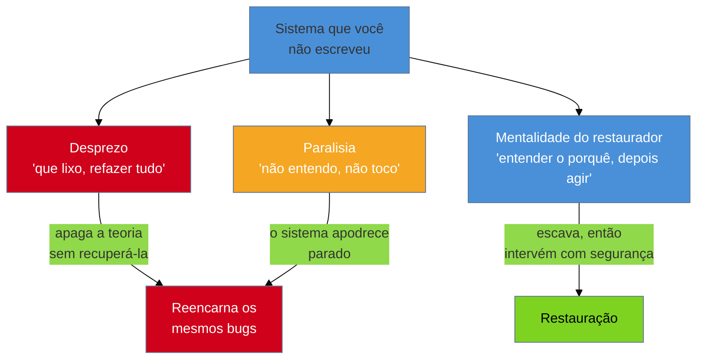

# A mentalidade do restaurador

> [!abstract] TL;DR
> Antes de qualquer técnica, o legado é um problema de **postura**. Diante de um sistema que
> você não escreveu, existem duas tentações opostas e igualmente fatais: o **desprezo** ("que
> lixo, vamos refazer") e a **paralisia** ("não entendo nada, não posso tocar"). A saída é a
> mentalidade do restaurador, ancorada na **Cerca de Chesterton**: nunca remova uma cerca até
> saber por que ela foi erguida. Aquele `if` esquisito, aquele retry de três tentativas, aquela
> linha de "código morto" — cada um é uma cerca. O restaurador trata o sistema como um **ativo
> que ainda roda o negócio de alguém**, não como entulho, e escava o *porquê* antes de mexer.

Você abriu o repositório. Quarenta mil linhas, comentários em duas línguas, um arquivo chamado
`utils_final_v2_REAL.js`, uma função de 600 linhas no meio do módulo de pagamentos. E, quase no
mesmo instante, você sente uma de duas coisas — talvez as duas, alternadas. A primeira é **nojo**:
"isso aqui é uma vergonha, quem escreveu não sabia o que fazia, o certo é jogar tudo fora e recomeçar
direito". A segunda é **pavor**: "eu não faço ideia do que isto faz, se eu encostar num arquivo o
sistema inteiro pode cair, melhor não tocar em nada".

As duas sensações são honestas. E as duas, se você as obedecer, arruínam o trabalho. Antes de
aprender qualquer ferramenta — antes de `git blame`, de characterization test, de Strangler Fig —
você precisa consertar a coisa que gera as duas: a sua **postura** diante de um sistema que não é
seu. É disso que trata esta nota.

## As duas tentações

Elas são imagens espelhadas do mesmo erro: **agir (ou travar) a partir da ignorância**, em vez de
agir a partir do entendimento.

**O desprezo** é a tentação do júnior confiante e do sênior arrogante. Ele confunde "eu não entendo
isto" com "isto não faz sentido" — e conclui que o autor era incompetente. É reconfortante: se o
problema é a burrice de quem veio antes, então eu, que sou esperto, resolvo reescrevendo. O desprezo
subestima sistematicamente o legado, porque não vê os **anos de casos de borda** que aquele código
feio já absorveu. Ele leva direto à reescrita que a [[01 - O que é código legado|nota anterior]]
já avisou ser uma armadilha: apagar a teoria sem tê-la recuperado.

**A paralisia** é o erro oposto e mais silencioso. Aqui você *respeita demais* — tanto que congela.
Cada arquivo parece uma bomba, cada mudança um risco existencial, então você não muda nada. O
problema é que o sistema não fica parado esperando você ganhar coragem: ele continua apodrecendo, a
dívida cresce, e a sua inação *também* é uma decisão — a de deixar tudo piorar. Paralisia é o
desprezo com sinal trocado: ambos nascem de **não entender**, um agindo cedo demais, o outro nunca.

> [!question]- Se os dois extremos são ruins, a resposta não é só "o meio-termo"?
> Não é um meio-termo morno entre coragem e medo — é uma **terceira postura** com um pré-requisito
> claro: entender antes de agir. O restaurador não é "menos ousado que o demolidor e menos travado
> que o paralisado". Ele é ousado *depois* de escavar e cauteloso *antes* — a ordem é o que muda,
> não a intensidade.

## A Cerca de Chesterton

A imagem que organiza tudo isso vem de fora da engenharia. Em 1929, o escritor G.K. Chesterton
propôs uma parábola que virou princípio de qualquer reforma:

> Imagine uma cerca atravessada numa estrada. O reformador moderno chega e diz: "Não vejo utilidade
> nisso, vamos remover." Ao que o reformador mais inteligente responde: "Se você não vê a utilidade,
> justamente por isso não vou deixar você removê-la. Vá, pense. Quando voltar e conseguir me dizer
> que *vê* a utilidade dela, aí talvez eu deixe você destruí-la."

O ponto é sutil e contraintuitivo. Chesterton **não** diz que a cerca é sagrada, nem que reformar é
errado. Ele diz que "não vejo para que serve" é a *pior* razão possível para remover algo — porque a
sua ignorância sobre a cerca é fato sobre **você**, não sobre a cerca. Alguém a colocou ali por um
motivo. Talvez o motivo tenha evaporado e a cerca hoje só atrapalhe; nesse caso, remova. Mas você só
ganha o direito de decidir isso *depois* de reconstruir o raciocínio de quem a ergueu.

> [!info] A ordem importa: primeiro entender, só então julgar
> A Cerca de Chesterton não é conservadorismo ("nunca mude nada"). É uma regra sobre **sequência**:
> o entendimento vem antes do veredito. Você pode acabar derrubando a cerca — mas por uma razão que
> você conquistou, não por preguiça de investigar.

## Toda linha estranha é uma cerca

Traduzindo para dentro do código: **cada trecho que parece sem sentido é uma cerca de Chesterton.**
Aquele `if (user.id == 47)` cravado no meio da regra de negócio. O retry de exatamente três
tentativas, nunca duas nem quatro. O `sleep(200)` antes da chamada ao gateway. A validação que
rejeita CEPs de um estado específico. As duzentas linhas que parecem "código morto" e que ninguém
tem coragem de apagar.

O júnior olha e vê **lixo**. O restaurador olha e vê **uma pergunta sem resposta ainda**: *por que
alguém escreveu isto?* Porque a resposta quase nunca é "burrice". Muito mais vezes é uma cicatriz —
o registro mudo de um incidente real:

- O `if (user.id == 47)` era o cliente que, numa madrugada de produção, expôs um caso que o modelo
  geral não cobria, e o patch de emergência nunca virou solução geral.
- O retry de três é o número em que o time anterior descobriu, no susto, que o gateway de pagamento
  se recupera de picos — nem menos (falha demais), nem mais (derruba o gateway parceiro).
- O `sleep(200)` compensa uma condição de corrida que só aparece sob carga, que ninguém soube
  consertar direito e todo mundo aprendeu a não remover.

Existe até um nome folclórico para a versão extrema disso: o desenvolvedor que apaga triunfante
"centenas de linhas de lixo legado" e derruba um subsistema inteiro — porque o "código morto" estava
bem vivo. A cerca estava lá por um motivo que ele não se deu ao trabalho de descobrir.

> [!example] Curiosidade vs. arrogância na frente do mesmo código
> Dois desenvolvedores encontram a mesma função grotesca de 300 linhas.
>
> O **arrogante** pensa: "isto é uma bagunça, quem fez não sabia programar" — e reescreve do zero,
> perdendo no caminho as sete correções de bug que aquelas linhas feias codificavam.
>
> O **curioso** pergunta: "que problema isto estava resolvendo? esse problema ainda é real? eu
> consigo resolver melhor?" — e só reescreve o que, depois de responder as três, ele *entende*. Se
> descobre que cinco das sete correções ainda são necessárias, ele as preserva de propósito.
>
> A diferença não é competência técnica. É **postura diante da própria ignorância**.

## Legado é ativo, não entulho

A raiz emocional do desprezo é enxergar o legado como lixo — algo que só nos atrapalha e que seria
melhor não existir. O restaurador inverte essa lente, e não por otimismo ingênuo: por leitura
correta do balanço.

Aquele sistema feio **está rodando o negócio de alguém agora mesmo**. Ele processa pagamentos reais,
emite notas fiscais válidas, atende clientes que pagam. Ele já foi pago — o custo de desenvolvimento
está amortizado — e, mais importante, ele **encapsula anos de conhecimento de domínio** que não está
em lugar nenhum além do próprio código: cada regra fiscal obscura, cada exceção de cliente, cada
caso de borda que a realidade impôs e que o código, aos trancos, aprendeu a tratar. Reescrever do
zero significa **redescobrir todas essas cicatrizes uma a uma**, quase sempre pela via dolorosa (o
bug em produção). É por isso que a [[01 - O que é código legado|nota 01]] insiste que "legado" nasceu
quase como elogio: era a herança de valor sobre a qual tudo se construiu.

Isso não quer dizer que todo legado deva ser mantido para sempre — a decisão de manter, restaurar,
substituir ou aposentar é o tema inteiro da fase Magus ([[17 - Frameworks de decisão|nota 17]]). Quer
dizer que a decisão parte de um **respeito de partida**: você herdou um ativo em operação, com uma
teoria embutida, não um saco de lixo. O respeito é arqueológico — o mesmo que um arqueólogo tem por
um sítio que ainda não compreende: você não pisoteia o que ainda não decifrou.

## A postura, em uma frase

Junte as três peças — recusar as duas tentações, honrar a Cerca de Chesterton, ler o legado como
ativo — e a mentalidade do restaurador se resume assim:

> **Humildade ativa:** humildade para assumir que o sistema provavelmente sabe algo que você ainda
> não sabe; atividade para escavar esse algo e então agir sobre ele com segurança.

Humildade sem ação é paralisia. Ação sem humildade é desprezo. As duas juntas são o ofício.

> [!warning] Confundir respeito pelo legado com medo de mexer
> **O que acontece:** em nome do "respeito ao código existente", você nunca refatora, nunca
> moderniza, e o sistema apodrece sob o pretexto da prudência.
> **Por quê:** respeito arqueológico é sobre *entender antes de agir*, não sobre *nunca agir*. O
> arqueólogo escava — com cuidado, mas escava. Congelar tudo é trair o sítio, não preservá-lo.
> **Como evitar:** trate o respeito como pré-condição da intervenção, não como desculpa para a
> inação. Entendeu a cerca? Então você ganhou o direito de decidir — inclusive de derrubá-la.

> [!warning] Assumir má-fé ou incompetência de quem veio antes
> **O que acontece:** você lê o histórico do código como um catálogo de erros de gente que não
> sabia programar, e isso contamina cada decisão sua.
> **Por quê:** quase todo código feio foi uma **decisão razoável sob restrições que você não vê** —
> prazo, um bug de biblioteca já corrigido, um requisito que mudou, uma pessoa sozinha às 3h da
> manhã. Presumir burrice te cega para a restrição real, que ainda pode estar valendo.
> **Como evitar:** adote a "regra do programador que veio antes" — presuma que ele era competente e
> tinha um motivo. Se o código parece idiota, a lacuna provavelmente está no seu contexto, não no
> QI dele. Ache o motivo primeiro.

> [!warning] Achar que reescrever é mais rápido do que entender
> **O que acontece:** diante do esforço de decifrar código alheio, você conclui que "do zero sai
> mais rápido" e começa a reescrever antes de compreender o que está sendo substituído.
> **Por quê:** é a falácia do canteiro limpo. A estimativa ignora o custo invisível — redescobrir,
> um a um e via bug em produção, todos os casos de borda que o código atual já resolve. Fred Brooks
> chamou isso de "second-system effect": o substituto quase sempre custa mais e entrega menos do que
> o otimismo previa.
> **Como evitar:** trate "entender" e "reescrever" como fases separadas. Só depois de recuperar a
> teoria você tem base para comparar honestamente o custo de restaurar por incrementos versus o de
> reescrever — decisão que a [[17 - Frameworks de decisão|nota 17]] estrutura.

> [!tip] Assista: From Code to Culture: Chesterton's Fence vs. Five Monkeys Experiment
> **Canal:** Mob Mentality Show | **Duração:** ~17min | **Idioma:** EN
>
> Dois praticantes de mob programming discutem a Cerca de Chesterton aplicada ao dia a dia de
> código — o que esta nota ainda não cobre em cena real: um "driver" tentando apagar um teste
> flaky sem entender por que ele existia, até descobrirem que ele cobria um bug importante. É a
> paralisia e o desprezo acontecendo ao vivo, com o antídoto sendo literalmente parar a linha
> ("stop the line") até entender a cerca.
> Trecho de destaque [8:26]: *"[The misapplication of this] is people are afraid to change
> anything [and so they change nothing]."*
>
> 🎬 [Assistir no YouTube](https://www.youtube.com/watch?v=a2bdNOsM_r0)

## Como explicar em inglês

Um enquadramento pronto para quando te perguntarem, em entrevista, como você aborda um sistema que
não construiu:

> "Before any technique, working with legacy code is a mindset problem. There are two failure modes:
> contempt — 'this is garbage, let's rewrite it' — and paralysis — 'I don't understand it, so I
> won't touch it.' I try to avoid both by applying **Chesterton's Fence**: don't remove a fence until
> you know why it was put up. That weird `if`, that retry count, that dead-looking code — each one is
> a fence, usually a scar from a real incident. I treat the system as an **asset that still runs
> someone's business**, not as junk, so my first move is to recover the *why* before I change
> anything. Call it active humility: humble enough to assume the code knows something I don't, active
> enough to dig it up and then act on it."

| PT | EN |
|----|----|
| mentalidade / postura | mindset |
| Cerca de Chesterton | Chesterton's Fence |
| desprezo / paralisia | contempt / paralysis |
| respeito arqueológico | archaeological respect |
| ativo (vs. passivo/lixo) | asset (vs. liability/junk) |
| cicatriz (no código) | scar (in the code) |
| humildade ativa | active humility |
| código aparentemente morto | dead-looking code |

## O que vem a seguir

Com a postura no lugar, falta o **contexto** em que ela se aplica. A mentalidade do restaurador vale
para qualquer um que herde código — mas este galho é escrito de uma cadeira específica: a de quem
entra *de fora*, sem o autor por perto, muitas vezes com um contrato e um prazo. Esse enquadramento
muda o método, e é o assunto da próxima nota.

- [[03 - A lente do consultor]] — assumir de fora vs. onboarding interno; os três modos (due diligence, herança, resgate). **(a espinha do galho)**
- [[01 - O que é código legado]] — as duas definições que esta postura pressupõe (rede + teoria).
- [[17 - Frameworks de decisão]] — quando a Cerca de Chesterton, já compreendida, autoriza derrubar: manter, restaurar, substituir ou aposentar.

## Fontes

- **G.K. Chesterton** — [*The Thing: Why I Am a Catholic*](https://www.chesterton.org/taking-a-fence-down/) (1929), cap. "The Drift from Domesticity" — a parábola original da cerca; a regra de que a ignorância sobre algo é a pior razão para removê-lo.
- **Marianne Bellotti** — *Kill It with Fire* (2021) — o legado como ativo em operação e o perigo do impulso de "queimar tudo"; a modernização como decisão deliberada.
- **Michael Feathers** — *Working Effectively with Legacy Code* (2004) — o respeito pelo comportamento existente como ponto de partida de qualquer mudança segura.
- **Brandon Bryson** — [*Assessing Legacy Code Using Chesterton's Fence*](https://medium.com/@BrandonBryson/assessing-legacy-code-using-chestertons-fence-38b299aa472f) — a aplicação direta do princípio à avaliação de código legado.
- **Michael Egger** — [*Understanding Chesterton's Fence: A Guiding Principle in Software Engineering*](https://medium.com/@mesw1/understanding-chestertons-fence-a-guiding-principle-in-software-engineering-7459e1fb7bf1) — curiosidade vs. arrogância e o "código morto que não estava morto".

## Veja também

- [[03-Dominios/Engenharia/Arqueologia e Restauração de Software/index|Arqueologia e Restauração de Software (MOC)]]
- [[03-Dominios/Engenharia/Complexidade de Software/04 - O programa como teoria|O programa como teoria]] — Naur: por que o *porquê* que a cerca guarda é a teoria do sistema
- [[03-Dominios/Engenharia/Complexidade de Software/index|Complexidade de Software]] — por que o software apodrece quando ninguém age
