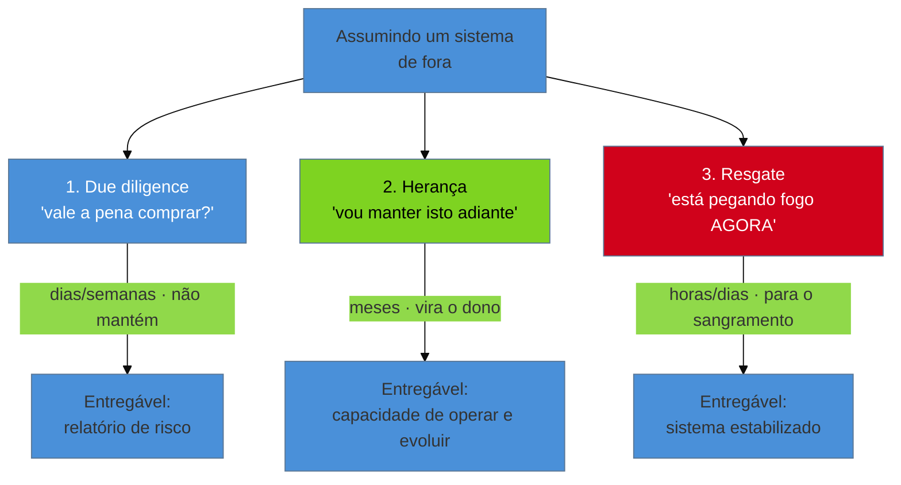

# A lente do consultor

> [!abstract] TL;DR
> Este galho inteiro é escrito de uma cadeira específica: a de quem assume um sistema **de fora**.
> O funcionário interno herda o código do colega da mesa ao lado — tem o autor por perto e tempo
> para aprender. O consultor é paraquedado num sistema que ninguém explica, sem o autor, com
> contrato e prazo. Isso não é um detalhe de crachá: **muda o método**. E "de fora" não é um só
> jeito — são **três modos**, cada um com objetivo, prazo, profundidade e entregável próprios:
> **due diligence** (avaliar risco antes de uma compra), **herança** (assumir a manutenção de um
> sistema órfão) e **resgate** (o sistema está pegando fogo agora). Saber em qual modo você está é
> a primeira decisão do trabalho — antes de qualquer linha de código.

Você recebe dois convites de trabalho na mesma semana. No primeiro, entra numa empresa como
desenvolvedor: te dão duas semanas de onboarding, um mentor, e o autor do sistema senta a três
mesas de distância — qualquer dúvida, é só girar a cadeira. No segundo, uma empresa que você nunca
viu te manda um repositório por e-mail e diz: "temos duas semanas para saber se vale a pena comprar
esta startup; o CTO deles vai embora depois do negócio fechar; nos diga o risco". Mesmo verbo —
"assumir um sistema legado" — duas situações que não se parecem em nada.

A [[02 - A mentalidade do restaurador|nota anterior]] cuidou da *postura*. Esta cuida do
**enquadramento**: quem é você em relação ao sistema, e por que isso decide como você trabalha. É a
espinha do galho, porque quase todo capítulo daqui pra frente responde, no fundo, à pergunta "como
faço isto *de fora*, sem o autor, sob prazo?".

## De dentro vs. de fora: por que a cadeira muda o método

Parece burocracia — interno, externo, que diferença faz? Faz toda. Volte às duas definições da
[[01 - O que é código legado|nota 01]]: legado é falta de **rede** (testes) e falta de **teoria**
(o porquê vivo na cabeça de alguém). O funcionário interno tem uma vantagem enorme contra a segunda:
a teoria não sumiu de todo — ela está diluída no time, nos corredores, na memória de quem ficou. Ele
pode reconstruí-la por osmose, ao longo de meses, perguntando.

O consultor entra depois que a teoria já foi embora — muitas vezes é *contratado exatamente porque*
ela foi embora. Não há colega para girar a cadeira. E, sobre isso, pesam duas restrições que o
interno raramente sente com a mesma força:

- **O relógio.** Você tem um contrato com escopo e prazo. Não existe "vou entendendo aos poucos nos
  próximos seis meses". A escavação precisa caber na janela.
- **A ausência do autor.** A fonte primária da teoria — a pessoa que sabia o porquê — não está
  disponível. Você depende de fontes secundárias: o código, o histórico do `git`, os dados em
  produção, um ou outro usuário que lembra "ah, isso aí era pro cliente tal".

> [!question]- Então o consultor está sempre em desvantagem em relação ao interno?
> Em teoria, sim — menos contexto, menos tempo. Mas a lente de fora também **liberta**. Você não
> herdou os apegos emocionais, as vacas sagradas ("não mexe nisso que o fulano fez"), nem a cegueira
> de quem convive com o problema há tanto tempo que parou de vê-lo. O consultor troca *profundidade
> de contexto* por *frescor de olhar e mandato para mudar*. O ofício é justamente extrair o máximo
> de teoria no mínimo de tempo — e é isso que o resto do galho ensina.

Essa é a razão de o galho ser escrito nesta chave. Um livro de "trabalhar com legado" escrito para o
interno gastaria capítulos em "converse com o time original". Aqui, o time original não existe — e a
técnica precisa dar conta dessa ausência. **Método de fora é método sem muletas.**

## Os três modos de assumir de fora

"De fora" não é monolítico. Antes de abrir o primeiro arquivo, você precisa saber em qual dos três
modos está — porque cada um responde a uma pergunta diferente, e responder à pergunta errada é
desperdiçar a janela inteira.

A tabela a seguir é o mapa que você consulta no primeiro dia. O resto da nota destrincha cada linha.

| | **Due diligence** | **Herança** | **Resgate** |
|---|---|---|---|
| **Pergunta central** | Vale a pena comprar? Quanto risco? | Como viro o dono disto? | Como paro o sangramento? |
| **Objetivo** | Avaliar (não consertar) | Operar e evoluir | Estabilizar |
| **Prazo típico** | Dias a poucas semanas | Meses (contínuo) | Horas a dias |
| **Profundidade** | Ampla e rasa (mapa de riscos) | Profunda e crescente | Cirúrgica no ponto que sangra |
| **Você vai manter?** | Não | Sim | Talvez (primeiro apagar o fogo) |
| **Entregável** | Relatório de risco | Autonomia sobre o sistema | Sistema de pé |
| **Erro fatal** | Mergulhar fundo demais e não cobrir | Agir antes de entender | Perder tempo entendendo tudo |

### Modo 1 — Due diligence: avaliar antes de comprar

Uma empresa vai adquirir outra (ou um fundo vai investir) e te contrata para responder uma pergunta
de negócio, não de código: **"quanto risco técnico estamos comprando?"**. Você tem acesso ao
repositório por uma janela curta e, crucialmente, **não vai manter o sistema** — seu produto é um
*parecer*, não um patch.

Isso inverte a economia da escavação. Você não precisa entender cada linha; precisa **mapear os
riscos que mudam o preço ou matam o negócio**. A indústria de *technical due diligence* já
consolidou o que se olha: qualidade e dívida do código, dependências e licenças de open source
(≈75% de um codebase típico é código de terceiros — uma licença incompatível pode contaminar a
propriedade intelectual inteira), vulnerabilidades de segurança, e — o item mais subestimado — o
**risco de pessoa-chave**. Se o faturamento inteiro mora na cabeça de um único dev que vai embora
depois da aquisição (o *bus factor* de 1 da [[01 - O que é código legado|nota 01]]), o comprador está
prestes a pagar preço de sistema saudável por um legado pleno.

O erro fatal aqui é o do perfeccionista: **mergulhar fundo demais num módulo interessante e não
cobrir o resto**. Numa due diligence, largura vence profundidade — um risco crítico não-detectado
custa muito mais que um módulo mal-compreendido. Seu relatório não diz "o código é feio"; diz "o
`bus factor` de pagamentos é 1, não há testes, há uma dependência GPL num produto proprietário;
provisione seis meses de estabilização e uma auditoria de licenças antes de assinar".

### Modo 2 — Herança: virar o dono

Aqui o negócio já está fechado — ou o cliente simplesmente perdeu quem cuidava do sistema — e você é
contratado para **assumir a manutenção continuada**. O objetivo não é um parecer nem um remendo: é
tornar-se, ao longo do tempo, a pessoa que *entende e evolui* o sistema. Você vai virar o novo dono
da teoria.

Esse é o modo com o horizonte mais longo e a escavação mais profunda. Como você vai conviver com o
sistema por meses ou anos, o investimento em reconstruir o modelo mental **se paga**: cada hora
gasta entendendo hoje evita dez horas de bug amanhã. É o modo em que faz sentido o protocolo de
aterrissagem completo — os [[04 - Os primeiros 30-60-90 dias|30-60-90 dias]], o
[[05 - First Contact|First Contact]], a leitura sistemática, a arqueologia de histórico. A pressa
aqui é a inimiga: o erro fatal é **agir cedo demais**, refatorar antes de ter recuperado teoria
suficiente para saber o que a mudança pode quebrar — exatamente a Cerca de Chesterton da
[[02 - A mentalidade do restaurador|nota 02]].

### Modo 3 — Resgate: parar o sangramento

O telefone toca em pânico: o sistema de logística cai toda madrugada, o dev original sumiu, e a
operação perde dinheiro por hora. Aqui a pergunta não é "vale a pena?" nem "como viro o dono?" — é
**"como faço isto parar de sangrar *agora*?"**.

O resgate inverte a prioridade de todos os outros modos. Nos modos 1 e 2, entender vem antes de agir.
No resgate, você **estabiliza primeiro e entende depois** — não porque a Cerca de Chesterton deixou
de valer, mas porque um paciente em hemorragia não espera o diagnóstico completo. A escavação é
**cirúrgica**: você mira exclusivamente no ponto que sangra (o job que trava às 3h), ignora
deliberadamente os outros 90% do sistema, e busca a menor intervenção que estanca — muitas vezes um
paliativo (um retry, um restart automático, um circuit breaker) que compra tempo, não a cura.
Estabilizado o paciente, aí sim você decide se há um modo 2 pela frente.

## Os modos não são estanques

Na vida real, um trabalho migra de modo — e reconhecer a transição é parte do ofício. Um **resgate**
bem-sucedido quase sempre desemboca numa proposta de **herança**: você parou o sangramento, o cliente
confia em você, e agora quer que você assuma o sistema de vez. Uma **due diligence** que aprova a
compra pode te render o contrato de **herança** do mesmo sistema que você acabou de avaliar — e o
mapa de riscos que você produziu vira o seu plano de trabalho.

O que não muda é a exigência de **saber em qual modo você está agora**. O mesmo sistema, o mesmo
código, pedem métodos diferentes conforme a pergunta que te trouxe até ele. Escavar fundo numa due
diligence é desperdício; escavar raso numa herança é negligência; escavar antes de estancar num
resgate é deixar o paciente morrer bonito.

> **A lente do consultor em uma frase:** você assume o sistema de fora, sem o autor e sob prazo — e a
> primeira decisão, antes de qualquer código, é reconhecer se veio para *avaliar* (due diligence),
> *possuir* (herança) ou *estabilizar* (resgate), porque cada resposta escava de um jeito diferente.

## Casos práticos

### Cenário 1: a due diligence que virou preço de negociação

Um fundo vai comprar uma fintech e te dá dez dias com o repositório. Em vez de mergulhar no código
mais elegante, você faz uma varredura larga: roda análise de dependências (acha uma biblioteca de
criptografia sem atualização há quatro anos, com CVE conhecido), mede o *bus factor* por módulo (o
motor antifraude tem um único autor, que já avisou que sai após a aquisição), checa a suíte de testes
(existe, mas cobre 12%). Seu relatório não condena nem aprova — **precifica**: "risco alto no
antifraude por dependência de pessoa e ausência de rede; recomendo reter 15% do valor em earnout
condicionado à transferência de conhecimento em seis meses". O comprador usa isso na mesa de
negociação. Você nunca escreveu uma linha do sistema — e entregou o que foi contratado.

### Cenário 2: o resgate que precisou virar herança para não voltar

Uma transportadora te chama às 22h: o roteirizador trava toda madrugada e caminhões saem sem rota.
Modo resgate: em duas horas você descobre, pelos logs, que um job acumula memória até estourar, e
aplica o paliativo — um restart agendado às 4h que segura a operação. O sangramento parou. Mas você
sabe que restart não é cura: o vazamento continua lá. Você apresenta ao cliente a bifurcação honesta:
"o fogo está apagado, mas a causa raiz exige entender o roteirizador de verdade — isso é um trabalho
de semanas, não de horas". O cliente contrata a fase 2. O resgate abriu a porta da herança, e o
paliativo comprou o tempo para fazer a coisa certa sem pânico.

## Armadilhas comuns

Repare que os três erros a seguir são **o mesmo pecado — escavar na profundidade errada — cometido
em cada modo**. O antídoto nunca é "escavar mais" ou "escavar menos" em abstrato; é calibrar a
escavação ao modo em que você está.

> [!warning] Due diligence: mergulhar fundo quando o pedido era largura
> **O que acontece:** com o repositório em mãos, você se apaixona por um módulo interessante, passa
> três dos dez dias entendendo-o a fundo, e entrega um relatório que ignora metade do sistema.
> **Por quê:** o instinto do engenheiro é entender de verdade. Mas numa avaliação, um risco crítico
> não-detectado (uma licença GPL, um *bus factor* de 1) custa infinitamente mais que um módulo
> mal-compreendido — e você não vai manter o sistema mesmo.
> **Como evitar:** trate a due diligence como uma varredura de radar, não um mergulho. Largura
> primeiro; só aprofunde onde o radar acusa risco que muda o preço ou mata o negócio.

> [!warning] Herança: agir antes de ter recuperado a teoria
> **O que acontece:** empolgado por "melhorar as coisas", você refatora, renomeia e reescreve nas
> primeiras semanas — e quebra comportamentos sutis que ninguém sabia que dependiam daquilo.
> **Por quê:** na herança você tem tempo, e a pressa desperdiça a única vantagem do modo. Mudar sem
> teoria é derrubar cercas de Chesterton no escuro ([[02 - A mentalidade do restaurador|nota 02]]).
> **Como evitar:** no modo herança, o relógio joga a seu favor — use-o. Escave primeiro (30-60-90,
> First Contact, arqueologia de histórico); intervenha quando souber o que a mudança protege.

> [!warning] Resgate: tentar entender tudo enquanto o sistema sangra
> **O que acontece:** chamado para apagar um incêndio, você começa a mapear a arquitetura inteira e
> a planejar a refatoração "certa" — enquanto caminhões saem sem rota e o cliente perde dinheiro.
> **Por quê:** o mesmo instinto de "entender antes de agir" que é virtude na herança vira defeito no
> resgate, onde o custo do tempo parado sobrepõe tudo. Fazer a coisa certa devagar demais é fazer a
> coisa errada.
> **Como evitar:** defina o sangramento em uma frase, mire só nele, aplique o menor paliativo que
> estanca. Entender o sistema inteiro é o modo *herança* — vem depois que o paciente estabiliza.

## Como explicar em inglês

Quando te perguntarem, em entrevista, sobre assumir sistemas que você não construiu:

> "I work with legacy systems from the *outside* — as a consultant, not an internal hire. The
> difference matters: an internal engineer inherits code with the original author a few desks away
> and months to learn. I parachute into a system nobody can explain, without the author, under a
> contract and a deadline. So my first decision, before touching any code, is figuring out which of
> three modes I'm in. **Due diligence** — assessing risk before an acquisition; I map risks broadly,
> I don't fix anything, and I deliver a report. **Inheritance** — taking over long-term maintenance;
> I dig deep because I'm becoming the new owner. **Rescue** — the system is on fire right now; I
> stabilize first and understand later, surgically targeting whatever is bleeding. Same system, same
> code — but the mode dictates how deep I dig and what I deliver."

| PT | EN |
|----|----|
| a lente do consultor | the consultant's lens / an outside-in view |
| assumir de fora | to take over from the outside |
| due diligence de aquisição | acquisition due diligence |
| herança (de sistema) | (system) inheritance / handover |
| resgate de emergência | emergency rescue / firefighting |
| parecer / relatório de risco | assessment / risk report |
| risco de pessoa-chave | key-person risk / bus factor |
| estabilizar o sangramento | stop the bleeding / stabilize |
| paliativo (vs. cura) | stopgap / band-aid (vs. root-cause fix) |

## O que vem a seguir

Definido o modo, a pergunta seguinte é operacional: **como você aterrissa sem se afogar?** Sobretudo
no modo herança — o de horizonte mais longo — existe um protocolo consagrado para converter caos em
autonomia ao longo dos primeiros meses. É o que estrutura a próxima nota.

- [[04 - Os primeiros 30-60-90 dias]] — o protocolo de aterrissagem: orientar-se, contribuir, tornar-se independente.
- [[05 - First Contact]] — o primeiríssimo movimento: conseguir buildar e rodar o sistema antes de entendê-lo.
- [[01 - O que é código legado]] — as duas ausências (rede e teoria) que a lente de fora enfrenta sem muletas.
- [[17 - Frameworks de decisão]] — no modo herança, como decidir o destino do sistema depois de escavá-lo.

## Fontes

- **Marianne Bellotti** — *Kill It with Fire* (2021) — a experiência de assumir sistemas alheios em larga escala (ONU, governo dos EUA); "o sistema em volta do sistema" que o consultor enfrenta de fora.
- **Michael Feathers** — *Working Effectively with Legacy Code* (2004) — o método técnico que pressupõe ausência de teoria e de rede, base do trabalho "sem muletas".
- **Black Duck** — [*M&A Software Due Diligence Checklist*](https://www.blackduck.com/blog/software-quality-audits-ma-due-diligence.html) — o que se avalia numa due diligence técnica: qualidade, licenças de OSS, segurança, risco de equipe.
- **Vaultinum** — [*Technology due diligence in M&A*](https://vaultinum.com/blog/technology-due-diligence-in-ma) — por que a avaliação técnica precede a aquisição e como o risco vira preço.
- **The Code Registry** — [*Software due diligence in Investments, M&A*](https://thecoderegistry.com/software-due-diligence-in-investments-mergers-acquisitions-key-considerations-and-risks/) — dívida técnica, key-person dependency e vendor lock-in como riscos centrais.

## Veja também

- [[03-Dominios/Engenharia/Arqueologia e Restauração de Software/index|Arqueologia e Restauração de Software (MOC)]]
- [[03-Dominios/Engenharia/Arqueologia e Restauração de Software/26 - Firefighting em produção|Firefighting em produção]] — o modo resgate aprofundado: investigar e mitigar incidente sem entender o sistema
- [[03-Dominios/Engenharia/Complexidade de Software/index|Complexidade de Software]] — o diagnóstico (por que apodrece) que a lente de fora assume como dado
