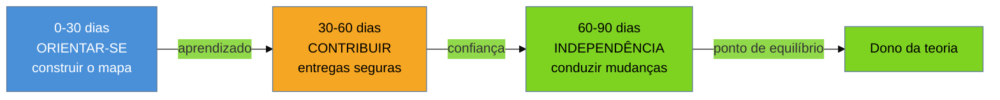

# Os primeiros 30-60-90 dias

> [!abstract] TL;DR
> Assumir um sistema legado tem um **ponto de equilíbrio**: até certo momento você custa mais do que
> entrega (está aprendendo, e cada mudança arrisca quebrar algo). O protocolo dos 30-60-90 dias é a
> receita para chegar a esse ponto **mais rápido e sem cavar sua própria cova** no caminho. São três
> arcos — **orientar-se** (0-30: construir o mapa mental sem tocar em nada crítico), **contribuir**
> (30-60: entregas pequenas e seguras que provam domínio e geram confiança) e **tornar-se
> independente** (60-90: você já é o dono da teoria e conduz mudanças estruturais). É o plano do
> **modo herança** da [[03 - A lente do consultor|nota 03]] — o de horizonte longo. E, para o
> consultor de fora, ele tem uma torção: o roteiro clássico pressupõe um colega ao lado que te
> ensina; aqui **não há autor** — o mentor é o código, o `git` e a produção.

Você foi contratado numa segunda-feira para assumir um sistema de faturamento que ninguém mais
mantém. Na terça, ansioso para mostrar serviço, você abre uma função de 400 linhas, acha um `if`
que parece redundante, remove, faz o deploy — e na quarta descobre que aquele `if` tratava um
formato de nota fiscal de um estado específico, e que agora 3% dos clientes não conseguem faturar.
Você acaba de aprender, da pior forma, por que existe um protocolo. A ansiedade de contribuir cedo
demais é o inimigo número um de quem assume um sistema alheio — e a estrutura dos 30-60-90 dias
existe justamente para canalizar essa energia para onde ela não faz estrago.

A [[03 - A lente do consultor|nota anterior]] definiu **qual modo** você está assumindo. Esta nota
é o plano operacional do modo de horizonte mais longo — a **herança**, onde você vira o dono. Ela
responde à pergunta que a 03 deixou em aberto: *definido o modo, como eu aterriso sem me afogar nem
quebrar tudo?*

## Por que um protocolo? O ponto de equilíbrio

Michael Watkins, em *The First 90 Days*, mede uma transição por um número simples: o **ponto de
equilíbrio** (*break-even point*) — o momento em que o valor que você entrega finalmente supera o
que a organização investiu em te trazer. Antes dele, você é passivo no balanço: consome atenção,
faz perguntas, e cada mudança sua carrega risco desproporcional. Depois dele, você começa a pagar
o investimento. A pesquisa de Watkins com executivos aponta ~6 meses para um gestor de nível médio;
o objetivo do protocolo é chegar lá **até 40% mais rápido**.

Assumir código legado é a versão mais brutal dessa curva, por um motivo que a
[[01 - O que é código legado|nota 01]] já nomeou: você entra com **duas ausências** — sem a rede
(testes) e sem a teoria (o porquê vivo). Isso empurra seu ponto de equilíbrio para longe e torna
cada intervenção precoce mais perigosa. Daí a tentação mortal que Watkins chama de **imperativo da
ação**: a pressão (interna e do cliente) de "fazer algo logo" para justificar a contratação. No
legado, ceder a esse imperativo cedo demais é derrubar cercas de Chesterton no escuro — exatamente
o pecado da [[02 - A mentalidade do restaurador|nota 02]].

> [!question]- Se agir cedo é perigoso, por que não ficar só estudando até dominar tudo?
> Porque o extremo oposto também é uma armadilha — a **paralisia por análise**. Um sistema legado é
> grande demais para ser inteiramente compreendido antes de qualquer ação; se você esperar o
> entendimento total, nunca entrega, e o cliente perde a confiança antes de ver valor. O protocolo
> não é "só estudar" nem "só agir": é uma **sequência calibrada** em que a profundidade do que você
> se permite mexer cresce junto com a teoria que você recupera. Você age desde cedo — mas em
> superfícies seguras, escolhidas para ensinar sem arriscar.

**O ponto de equilíbrio em uma frase:** existe um momento em que você deixa de custar e passa a
entregar — e todo o protocolo é uma corrida honesta para chegar lá antes, sem trapacear pulando o
entendimento.

## Os três arcos

O nome "30-60-90" sugere prazos rígidos, mas os números são **marcos**, não datas de cartório —
num sistema pequeno os arcos comprimem para semanas; num monólito de 15 anos, cada um pode dobrar.
O que não muda é a **ordem** e o que cada arco entrega.

| | **0-30: Orientar-se** | **30-60: Contribuir** | **60-90: Independência** |
|---|---|---|---|
| **Pergunta** | Como este sistema funciona e onde dói? | Consigo mudá-lo com segurança? | Consigo conduzir sua evolução? |
| **Modo dominante** | Aprender | Aprender fazendo | Fazer (com teoria) |
| **O que você toca** | Nada crítico — leitura, build, testes exploratórios | Mudanças pequenas, reversíveis, visíveis | Estrutura: seams, refactor, restauração |
| **Entrega do arco** | Um mapa mental e uma lista de riscos | Um *early win* que gera confiança | Autonomia — você é o novo dono |
| **Erro fatal** | Já sair mexendo | Escolher um "win" grande demais | Continuar pedindo permissão que não precisa |

### 0-30: Orientar-se — o mapa antes do território

O primeiro arco é quase todo **leitura e escuta**, e resiste ativamente à vontade de codar. O
objetivo é sair dele com duas coisas: um **modelo mental** de como o sistema funciona (o quê chama o
quê, onde moram os dados, qual o fluxo principal do negócio) e uma **lista de riscos** priorizada (o
que está frágil, o que ninguém entende, o que sangra).

Para o consultor de fora, este arco tem uma diferença crucial em relação ao roteiro corporativo de
onboarding: **não há um *onboarding buddy*** — aquele colega sênior que, no plano clássico, você
"sombra" nas primeiras semanas. O autor foi embora; é essa a premissa do galho. Então as fontes
mudam de figura: em vez de perguntar a uma pessoa, você interroga os **artefatos**. O primeiro
movimento concreto — conseguir *buildar e rodar* o sistema — é tão central que ganha nota própria
([[05 - First Contact|First Contact]]). A leitura sistemática do código sem o autor por perto é a
[[06 - Lendo código que você não escreveu|nota 06]]. E o histórico do `git`, que substitui a memória
oral do time, é a [[07 - Arqueologia do histórico|nota 07]]. Este arco é, na prática, o portal para
essas três técnicas.

Uma tática barata e poderosa para este período: **rastrear uma requisição de ponta a ponta**. Pegue
o fluxo mais importante do negócio (uma venda, um faturamento, um login) e siga-o do primeiro byte
que entra até a resposta que sai, anotando cada camada. Ao fim, você tem o esqueleto do sistema — e
descobriu, no caminho, metade dos seus riscos.

### 30-60: Contribuir — o *early win* seguro

Recuperada teoria suficiente, chega a hora de **provar que você pode mudar o sistema sem quebrá-lo**.
Watkins chama isso de **early win** (vitória rápida): uma entrega "grande o bastante para importar,
pequena o bastante para terminar". No legado, o *early win* tem um requisito extra que o mundo do
código novo não tem — ele precisa ser **seguro**, e segurança aqui significa reversível e de baixo
raio de explosão.

Por que isso importa tanto? Porque o *early win* tem uma função dupla. A óbvia é **técnica**: um bug
irritante corrigido, uma dependência crítica atualizada, um endpoint lento acelerado. A menos óbvia,
e mais importante no modo herança, é **política** (a [[23 - A dimensão política|dimensão que a nota
23 aprofunda]]): cada entrega segura constrói o **capital de confiança** que você vai gastar depois,
quando propuser as mudanças estruturais que assustam o cliente. Um consultor que passou 60 dias sem
entregar nada visível não tem crédito para dizer, no dia 90, "precisamos reescrever o módulo de
pagamentos".

A escolha do *early win* é uma arte. O candidato ideal: um problema que **incomoda o cliente**
(logo, a vitória é visível para quem paga), que você **entende bem** (recuperou teoria suficiente no
arco anterior), e cuja mudança é **contida** (não toca no coração não-testado do sistema). Corrigir
um bug reproduzível numa borda do sistema é ouro. Refatorar o núcleo do faturamento "porque está
feio" é uma cova.

### 60-90: Independência — virar o dono

No terceiro arco, a relação se inverte: você deixa de ser alguém que *pede contexto* e passa a ser
alguém *a quem se pede contexto*. Você virou o dono da teoria. Agora as intervenções podem ser
estruturais — instalar a rede de segurança onde ela falta ([[10 - A rede de segurança primeiro|
characterization tests]]), abrir seams para quebrar dependências ([[12 - Seams e quebra de
dependência|nota 12]]), conduzir a primeira restauração de verdade.

Este é o arco em que o protocolo de aterrissagem se dissolve no trabalho contínuo do galho. Os
30-60-90 dias eram o *como aterrissar*; daqui pra frente é o *como restaurar* — e é isso que as fases
Adepto e Magus deste galho ensinam. O marco de independência não é uma data; é o momento em que você
pode decidir o **destino** do sistema com base em teoria recuperada, e não em achismo — a decisão que
os [[17 - Frameworks de decisão|frameworks da nota 17]] estruturam.

## Como isto muda por modo

O 30-60-90 é o plano do **modo herança**. Nos outros dois modos da [[03 - A lente do consultor|nota
03]], ele se deforma — e reconhecer a deformação evita aplicar o protocolo errado:

- No **resgate**, os três arcos colapsam em horas. Você não tem 30 dias para se orientar; estabiliza
  primeiro, e o "aprendizado" vira um mergulho cirúrgico só no ponto que sangra. O protocolo completo
  só volta *se* o resgate virar herança.
- Na **due diligence**, existe orientação (arco 1) mas **nunca há arco 2 nem 3** — você avalia e vai
  embora; não contribui, não vira dono. O produto é o relatório de risco, não um *early win*.

Ou seja: o protocolo de aterrissagem completo é um privilégio do horizonte longo. Saber que você
está na herança é o que autoriza a paciência dos primeiros 30 dias.

## Casos práticos

### Cenário 1: o consultor que resistiu ao imperativo da ação

Uma empresa de logística te contrata para assumir o roteirizador que o dev original deixou órfão. A
pressão para "mostrar valor" na primeira semana é enorme — o gestor pergunta todo dia "e aí, já
achou o que melhorar?". Você resiste: nos primeiros 25 dias, apenas rastreia o fluxo de uma rota da
criação à expedição, mapeia as integrações e cataloga onde o sistema é cego (nenhum log útil no
cálculo de custo). No dia 30, em vez de um patch apressado, você entrega ao gestor **o mapa e a
lista de riscos** — e ele, que esperava código, percebe que ganhou algo mais raro: alguém que
finalmente entende o sistema. O *early win* veio no dia 40, com um bug de arredondamento de frete
que o financeiro reclamava há meses. Pequeno, visível, seguro — e comprou o crédito para, no dia 85,
propor a instrumentação do cálculo de custo.

### Cenário 2: o *early win* que era uma cova disfarçada

Contraexemplo. Outro consultor, no mesmo tipo de contrato, escolhe como primeira vitória "limpar" o
módulo de tarifação — o mais bagunçado, e por isso o mais tentador. Parece um *early win* ambicioso.
Mas o módulo é o coração não-testado do sistema, e a "limpeza" quebra uma regra de desconto que só
aparecia em contratos antigos. O que era para ser a vitória de estreia virou o primeiro incidente —
e queimou, de uma vez, o capital de confiança que levaria meses para reconstruir. A lição: no
legado, *early win* não é o problema mais impressionante; é o mais **seguro** entre os que importam.

## Armadilhas comuns

> [!warning] O imperativo da ação: entregar código antes de recuperar teoria
> **O que acontece:** pressionado a "mostrar serviço", você faz uma mudança nas primeiras semanas e
> quebra um comportamento sutil que ninguém sabia que dependia daquilo.
> **Por quê:** a ansiedade de justificar a contratação atropela o arco de orientação. Mas mudar sem
> teoria, no legado, é apostar contra a Cerca de Chesterton ([[02 - A mentalidade do restaurador|nota
> 02]]).
> **Como evitar:** no arco 0-30, sua entrega **é** o entendimento — o mapa e a lista de riscos.
> Venda isso ao cliente como o valor que é; segure o código para o arco 2.

> [!warning] Paralisia por análise: estudar para sempre, nunca entregar
> **O que acontece:** com medo de quebrar algo, você prolonga o "aprendizado" indefinidamente e passa
> 90 dias sem nenhuma entrega visível — e o cliente perde a fé antes de ver valor.
> **Por quê:** um sistema legado é grande demais para ser 100% compreendido antes de agir; esperar o
> entendimento total é esperar para sempre.
> **Como evitar:** trate o *early win* do arco 2 como obrigatório, não opcional. A profundidade do
> que você mexe cresce com a teoria — mas nunca chega a zero de entrega.

> [!warning] Copiar o playbook do contratado interno
> **O que acontece:** você espera o *onboarding buddy*, a documentação de boas-vindas, o autor para
> tirar dúvidas — e trava quando nada disso existe.
> **Por quê:** o roteiro corporativo de 30-60-90 pressupõe uma organização que te recebe. O
> consultor de legado entra pela ausência: sem autor, sem docs, sob prazo (a lente da
> [[03 - A lente do consultor|nota 03]]).
> **Como evitar:** troque as fontes humanas por artefatos desde o dia 1 — build, `git log`,
> produção. O mentor é o sistema; a técnica de interrogá-lo é o resto deste galho.

## Como explicar em inglês

Quando te perguntarem, em entrevista, como você aborda seus primeiros meses num sistema que não
construiu:

> "I run a 30-60-90 protocol, but adapted for legacy work. The first 30 days are almost pure
> learning — I build and run the system, trace a key request end to end, read the `git` history, and
> come out with a mental model and a prioritized risk list. I deliberately resist the *action
> imperative* — shipping code early to look busy is how you knock down a Chesterton's fence in the
> dark. Days 30 to 60 are about a **safe early win**: something big enough to matter, small enough to
> finish, and low-blast-radius — it proves I can change the system without breaking it, and it earns
> the trust I'll spend later. Days 60 to 90 are independence — I'm the owner of the theory now, so I
> can take on structural work. The twist for a consultant is that there's no onboarding buddy and no
> original author: my mentor is the code, the commit history, and production."

| PT | EN |
|----|----|
| protocolo de aterrissagem | landing / onboarding protocol |
| ponto de equilíbrio | break-even point |
| imperativo da ação | the action imperative |
| paralisia por análise | analysis paralysis |
| vitória rápida (segura) | (safe) early win |
| raio de explosão | blast radius |
| capital de confiança | trust capital / political capital |
| mudança reversível | reversible change |
| virar o dono (da teoria) | to become the owner (of the theory) |
| rastrear de ponta a ponta | to trace end to end |

## O que vem a seguir

O arco 0-30 tem um primeiríssimo movimento, anterior a qualquer leitura de código: você precisa
**conseguir rodar o sistema**. Parece trivial, mas num legado sem documentação isso pode consumir
dias — e é a diferença entre estudar o sistema vivo ou apenas ler seu cadáver estático. É o primeiro
contato de verdade.

- [[05 - First Contact]] — o primeiro movimento do arco de orientação: buildar e rodar antes de entender.
- [[06 - Lendo código que você não escreveu]] — como interrogar o código quando o autor não está lá.
- [[07 - Arqueologia do histórico]] — o `git log` como substituto da memória oral do time.
- [[23 - A dimensão política]] — por que o *early win* é capital de confiança, não só correção técnica.

## Fontes

- **Michael D. Watkins** — [*The First 90 Days*](https://www.imd.org/leadership/f90d/the-first-90-days/) (2003, ed. rev. 2013) — a fonte canônica do protocolo de transição: ponto de equilíbrio, imperativo da ação, early wins e o modelo STARS de diagnóstico da situação.
- **Michael Feathers** — *Working Effectively with Legacy Code* (2004) — a premissa técnica das "duas ausências" (rede e teoria) que empurra o ponto de equilíbrio para longe no legado.
- **First Round Review** — [*This 90-Day Plan Turns Engineers into Remarkable Managers*](https://review.firstround.com/this-90-day-plan-turns-engineers-into-remarkable-managers/) — o 30-60-90 aplicado a transições técnicas reais.
- **Dormy Tech** — [*30-60-90 Day Onboarding Plan for Software Engineers*](https://dormytech.com/articles/templates/30-60-90-day-software-engineer/) — a tática de rastrear uma requisição de ponta a ponta e revisar os últimos PRs como leitura rápida do sistema.

## Veja também

- [[03-Dominios/Engenharia/Arqueologia e Restauração de Software/index|Arqueologia e Restauração de Software (MOC)]]
- [[03-Dominios/Engenharia/Arqueologia e Restauração de Software/03 - A lente do consultor|A lente do consultor]] — o modo (herança) que este protocolo pressupõe
- [[03-Dominios/Engenharia/Arqueologia e Restauração de Software/17 - Frameworks de decisão|Frameworks de decisão]] — o que fazer no arco de independência: decidir o destino do sistema
- [[03-Dominios/Engenharia/Complexidade de Software/index|Complexidade de Software]] — o diagnóstico de por que o sistema chegou até você assim
