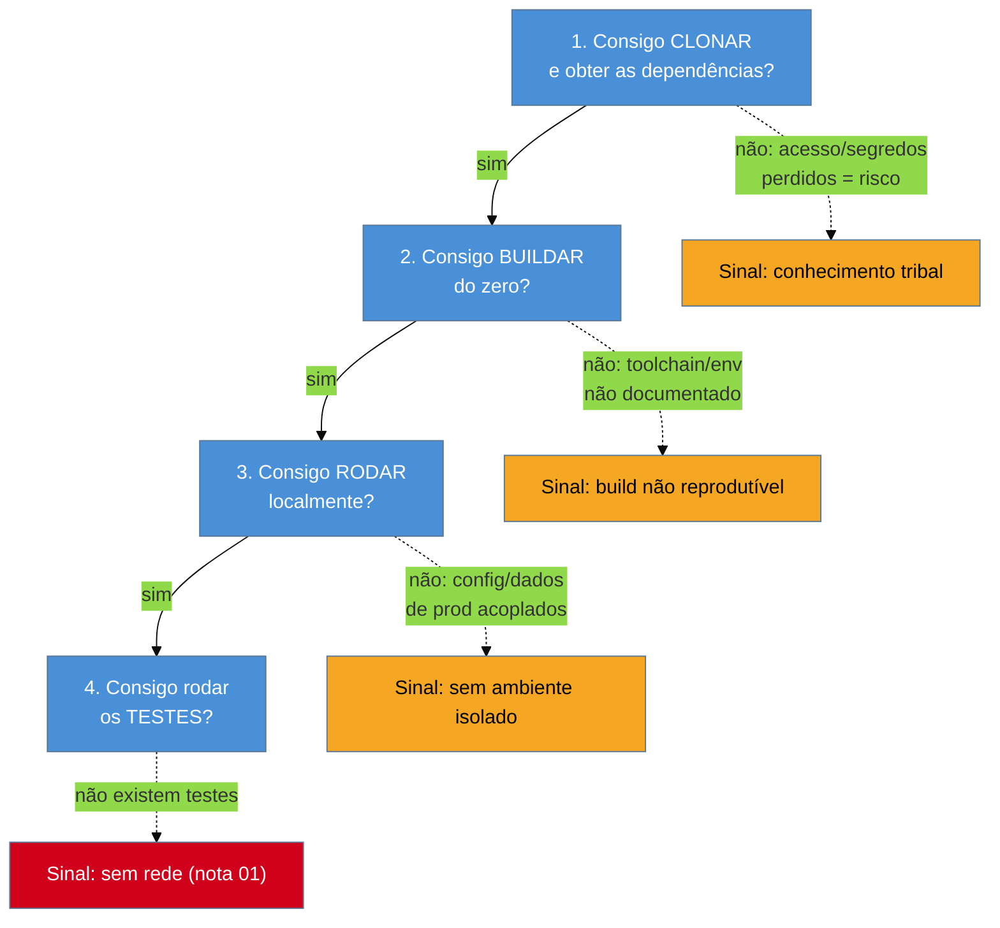

# First Contact

> [!abstract] TL;DR
> Antes de entender uma linha de código, você precisa de duas coisas humildes e surpreendentemente difíceis: **conseguir buildar** e **conseguir rodar** o sistema. O primeiríssimo movimento do arco de orientação ([[04 - Os primeiros 30-60-90 dias|nota 04]]) não é ler — é montar o **inventário técnico**: clonar, compilar, subir, e ver o sistema vivo. Um sistema que você não consegue rodar é um **cadáver** — você só pode ler seu esqueleto estático, nunca observar seu comportamento. O padrão *First Contact* (do livro *Object-Oriented Reengineering Patterns*) organiza esse primeiro encontro sob pressão de tempo: colher informação de **qualidade e rápido**, cruzando código, documentação (com desconfiança) e — quando existirem — usuários. Para o consultor de fora há uma ausência que mói: o padrão original manda "conversar com os mantenedores", e **não há mantenedores**. As fontes viram artefatos e usuários.

Você recebe o acesso ao repositório numa sexta à tarde, animado. `git clone`. Abre o README: três comandos. Roda o primeiro — erro de versão de runtime. Instala a versão certa — agora quebra uma dependência nativa que não compila no seu sistema operacional. Descobre, num comentário de issue de 2019, que o build só funciona com uma variável de ambiente que ninguém documentou. Segunda-feira ao meio-dia, você ainda não viu o sistema rodar uma única vez. Bem-vindo ao *First Contact* — a etapa que todo mundo subestima e que, no legado, pode consumir dias antes de você ler a primeira função de verdade.

A [[04 - Os primeiros 30-60-90 dias|nota 04]] disse *quando* fazer isto: é o primeiro movimento do arco 0-30, antes de qualquer leitura sistemática. Esta nota diz *como* — e por que "só fazer buildar" é, ele mesmo, o seu primeiro ato de arqueologia.

## Por que buildar e rodar vêm antes de ler

Parece fora de ordem. Se o objetivo é *entender* o sistema, por que não começar lendo o código, que é onde a lógica mora? Porque ler código estático é como estudar um animal pela ossada: você vê a estrutura, mas não o movimento. Um sistema **rodando** te dá coisas que o código parado esconde — o fluxo real de execução, os dados de verdade, as mensagens de erro, o comportamento nos casos que você nunca imaginaria ler. A [[04 - Os primeiros 30-60-90 dias|nota 04]] já cunhou a distinção: estudar o sistema vivo ou apenas ler seu cadáver.

Mas há um segundo motivo, mais sutil e mais valioso: **o processo de buildar já é diagnóstico**. Cada obstáculo que você encontra para colocar o sistema de pé é um dado sobre a sua saúde. Um build que funciona com um comando é sinal de um projeto cuidado; um build que exige arqueologia de issues antigas e uma sequência mágica de variáveis de ambiente já te contou, antes de qualquer código, que o **conhecimento de operação é tribal** — mora na cabeça de alguém que foi embora. Você não está só perdendo tempo com setup: está medindo a distância entre o sistema e a reprodutibilidade.

> [!question]- Se o build está quebrado, por que não pular essa parte e ir direto ao código?
> Porque a incapacidade de rodar o sistema **é** um dos seus maiores riscos — e escondê-la não a resolve. Um sistema que ninguém consegue buildar do zero não pode ser testado com segurança, não pode receber um ambiente de staging, e provavelmente só é deployado por um ritual manual que mora na memória de uma pessoa. Fazer o build voltar a funcionar (e **documentá-lo**, idealmente num container reprodutível) costuma ser, ele mesmo, um excelente candidato a *early win* do arco 30-60 ([[04 - Os primeiros 30-60-90 dias|nota 04]]): visível, valioso e de baixo risco.

**O inventário técnico em uma frase:** antes de entender o que o sistema *faz*, prove que você consegue fazê-lo *existir* na sua frente — porque tudo depois disso (testar, mudar, restaurar) pressupõe um sistema que roda.

## O inventário técnico: as quatro perguntas

O *First Contact* técnico se resume a responder, em ordem, quatro perguntas — e cada resposta é tanto um pré-requisito para a próxima quanto um sinal de diagnóstico.

A quarta pergunta — "existem testes que rodam?" — reencontra a definição de Feathers da [[01 - O que é código legado|nota 01]]: código sem testes é código legado. Se a resposta for "não há testes", você acabou de confirmar, empiricamente, que herdou a primeira das duas ausências. A resposta não te desanima; te diz onde o trabalho começa (a [[10 - A rede de segurança primeiro|rede de segurança da nota 10]]).

Uma prática que economiza sofrimento futuro: **enquanto você descobre o ritual do build, documente-o num artefato reprodutível** — um `Dockerfile`, um `devcontainer`, um script. Você está transformando conhecimento tribal em conhecimento explícito no exato momento em que ele passa pela sua cabeça — e nunca mais vai estar tão fresco.

> [!tip] Assista: Reproducible Builds, the first ten years
> **Canal:** media.ccc.de (FOSDEM) | **Duração:** ~24min | **Idioma:** EN
>
> Holger Levsen (mantenedor do projeto Reproducible Builds) conta a história de por que "buildar de novo e comparar o binário" virou disciplina séria — e dá o vocabulário exato pra essa nota: reprodutibilidade não é sobre o binário ser "bom", é sobre poder **provar** que ele veio do código que você está olhando. É o mesmo ideal citado nas Fontes desta nota (reproducible-builds.org), aqui com o histórico e os bastidores por trás dele. Trecho de destaque [5:45]: *"our mission is to enable anyone to independently verify that a given source produces bit by bit identical results."*
>
> 🎬 [Assistir no YouTube](https://www.youtube.com/watch?v=JLcNkxB70p8)

## As fontes de informação sob pressão de tempo

O *First Contact* do OORP não é só técnico; é sobre **colher informação de qualidade, rápido**, de todas as fontes disponíveis. O livro cataloga alguns padrões — e é aqui que a lente do consultor os deforma, porque uma das fontes centrais do original simplesmente não existe para nós.

| Padrão OORP | O que é | A torção do consultor de fora |
|---|---|---|
| **Chat with the Maintainers** | Conversar com quem mantém o sistema | **Não há mantenedores** — é a premissa do galho. Vira: interrogar os *artefatos* (código, `git`, prod). |
| **Interview during Demo** | Pedir a um usuário que demonstre o sistema, e trabalhar de trás pra frente da tela ao código | **A fonte humana que sobra.** O usuário não sabe do código, mas sabe o que o sistema *faz* — ouro para reconstruir a teoria de negócio. |
| **Read all the Code in One Hour** | Um *skim* cronometrado do código inteiro, para pegar a forma geral, não os detalhes | Vale igual — dá o "mapa de altitude" antes do mergulho da [[06 - Lendo código que você não escreveu|nota 06]]. |
| **Skim the Documentation** | Ler rápido o que houver de docs | Com **desconfiança ativa**: no legado, a doc quase sempre está defasada (mente sobre o presente). Útil como registro do *passado*, não do *agora*. |
| **Do a Mock Installation** | Reproduzir a instalação do zero para expor o que está implícito | É literalmente o inventário técnico acima — buildar e rodar como ato de descoberta. |

O padrão que mais rende ao consultor é o **Interview during Demo**. O autor foi embora, mas os **usuários** ficaram — e eles carregam metade da teoria perdida, a metade do *negócio*. Um usuário não vai te explicar a arquitetura, mas vai te mostrar "primeiro eu clico aqui, aí gera a nota, mas pro cliente do sul tem que marcar essa caixa senão dá erro" — e nessa frase mora um requisito inteiro que você jamais deduziria do código sozinho. Você observa a demo e trabalha **de trás pra frente**: da tela que ele mostrou, ao endpoint, à função, aos dados.

> [!warning] A documentação mente — mas conta a verdade sobre o passado
> Docs de legado quase nunca descrevem o sistema atual: descrevem o que ele era quando alguém, um dia, parou de atualizar o `README`. Isso não as torna inúteis — torna-as **arqueológicas**. Uma doc defasada é um estrato: revela intenções e decisões de uma época. Leia-a para entender o *porquê histórico*, nunca para confiar no *como atual*. A única fonte que não mente sobre o presente é o sistema rodando.

## Casos práticos

### Cenário 1: o build quebrado que virou o primeiro mapa

Você assume um sistema de emissão de boletos órfão. O `README` promete `make install && make run`; nenhum dos dois funciona. Em vez de tratar isso como um aborrecimento, você trata como escavação: cada erro que você resolve — a versão exata do runtime (achada num arquivo de CI esquecido), a biblioteca nativa (que exigia uma flag de compilação), o segredo de API (que estava só nas variáveis de produção) — é anotado. Ao fim de dois dias, você não só tem o sistema rodando: tem um `Dockerfile` que qualquer pessoa roda com um comando, e um mapa das integrações externas que descobriu no caminho (o sistema fala com três APIs que ninguém tinha listado). O que parecia tempo perdido produziu o primeiro artefato de valor e metade do inventário de riscos.

### Cenário 2: a demo que revelou a regra invisível

Um varejista te contrata para assumir o sistema de preços. Você consegue rodá-lo, mas o código do cálculo é um emaranhado de condicionais sem nome. Antes de mergulhar, você faz um *Interview during Demo*: senta com a gerente de categoria e pede que ela precifique alguns produtos na tela. Ela narra: "esse é importado, então entra o câmbio do dia; esse aqui é de fornecedor exclusivo, aí o desconto máximo é 5%; e produto de Black Friday ignora a margem mínima". Em vinte minutos você ganhou três regras de negócio que o código escondia atrás de flags anônimas — e agora, ao ler o código ([[06 - Lendo código que você não escreveu|nota 06]]), você sabe *o que procurar*. A demo virou a legenda do mapa.

## Armadilhas comuns

> [!warning] O buraco de coelho do ambiente
> **O que acontece:** você passa uma semana inteira brigando com o build, cada vez mais fundo em dependências obscuras, sem nunca parar para pedir ajuda ou registrar o que já resolveu. **Por quê:** o setup de legado é um poço sem fundo aparente, e a persistência do engenheiro vira teimosia — você perde a noção de quanto tempo (do contrato!) já queimou. **Como evitar:** *time-box* o inventário. Se o build resiste além do razoável, use o [[04 - Os primeiros 30-60-90 dias|imperativo de aprender, não de sofrer]]: registre o estado, peça os segredos que faltam a quem contratou, e siga com o que já roda. Perfeição de ambiente não é o objetivo — visão do sistema vivo é.

> [!warning] Confiar na documentação como se fosse o presente
> **O que acontece:** você lê o `README` e o wiki, monta seu modelo mental a partir deles, e depois descobre que metade daquilo mudou há três anos — e você aprendeu um sistema que não existe mais. **Por quê:** a doc é a fonte mais confortável (texto em português, não código), e por isso a mais sedutora. Mas ela envelhece em silêncio, enquanto o código muda. **Como evitar:** trate doc como estrato histórico, não como espelho do presente. Cruze toda afirmação da doc com o sistema rodando ou com o `git log` ([[07 - Arqueologia do histórico|nota 07]]). Quando divergirem, o código vivo ganha.

> [!warning] Ler o código antes de vê-lo rodar
> **O que acontece:** você mergulha na leitura estática no dia 1, sem nunca ter executado o sistema — e constrói uma teoria elegante que a primeira execução real desmente. **Por quê:** ler parece produtivo e não depende de resolver o build chato. Mas código estático esconde o fluxo real, os dados de verdade e o comportamento de borda. **Como evitar:** priorize rodar. Mesmo um *skim* de uma hora ([[06 - Lendo código que você não escreveu|Read the Code in One Hour]]) rende dez vezes mais depois que você viu o sistema executar uma vez e sabe qual caminho o código realmente percorre.

## Como explicar em inglês

Quando te perguntarem, em entrevista, qual é seu primeiro movimento num sistema desconhecido:

> "Before I read a single function, I make sure I can **build it and run it** — I call that the technical inventory. A system you can't run is a cadaver: you can only read its static skeleton, never watch its behavior. And the build process itself is diagnostic — if getting it to run takes archaeology through old issues and a magic sequence of env vars, that already tells me the operational knowledge is tribal. I follow the *First Contact* patterns from *Object-Oriented Reengineering Patterns*, adapted for consulting: there are no maintainers to chat with — the author is gone — so I interrogate the artifacts instead, and I lean hard on **Interview during Demo**: users can't explain the architecture, but they carry the business half of the lost theory. I skim the docs too, but with suspicion — legacy docs describe the past, not the present. Only the running system tells the truth about now."

| PT | EN |
|----|----|
| primeiro contato | first contact |
| inventário técnico | technical inventory |
| buildar / compilar do zero | to build from scratch |
| build reprodutível | reproducible build |
| conhecimento tribal | tribal knowledge |
| entrevista durante demo | interview during demo |
| ler o código em uma hora | read (all) the code in one hour |
| a documentação está defasada | the documentation is stale / out of date |
| estrato (arqueológico) | (archaeological) stratum / layer |
| o sistema vivo vs. o cadáver | the running system vs. the cadaver |

## O que vem a seguir

Com o sistema rodando na sua frente e as primeiras regras de negócio colhidas na demo, chega o momento que o inventário técnico apenas preparou: **ler o código de verdade** — não o *skim* de uma hora, mas a leitura sistemática que constrói o modelo mental. E ler código que você não escreveu, sem o autor para explicar, é uma técnica em si.

- [[06 - Lendo código que você não escreveu]] — a leitura sistemática depois do primeiro contato; técnicas para construir o modelo mental sozinho.
- [[07 - Arqueologia do histórico]] — o `git log` e o `git blame` como a fonte que não mente sobre o passado *nem* o presente.
- [[10 - A rede de segurança primeiro]] — o que fazer com a quarta pergunta do inventário quando a resposta é "não há testes".
- [[04 - Os primeiros 30-60-90 dias]] — o arco de orientação que este primeiro contato inaugura.

## Fontes

- **Serge Demeyer, Stéphane Ducasse, Oscar Nierstrasz** — [*Object-Oriented Reengineering Patterns*](https://oorp.github.io/) (2003, PDF livre) — a fonte canônica do cluster *First Contact*: Chat with the Maintainers, Interview during Demo, Read all the Code in One Hour, Skim the Documentation, Do a Mock Installation.
- **Michael Feathers** — *Working Effectively with Legacy Code* (2004) — a definição (código sem testes = legado) que a quarta pergunta do inventário confirma empiricamente.
- **DeployFlow** — [*Continuous Integration for Legacy Systems*](https://deployflow.co/blog/legacy-codebase-continuous-integration/) — por que a reprodutibilidade do build é o primeiro eixo de custo ao assumir um legado.
- **reproducible-builds.org** — [*Reproducible Builds*](https://reproducible-builds.org/) — o ideal técnico (mesmo fonte → mesmo binário) que transforma o ritual de build em artefato confiável.

## Veja também

- [[03-Dominios/Engenharia/Arqueologia e Restauração de Software/index|Arqueologia e Restauração de Software (MOC)]]
- [[03-Dominios/Engenharia/Arqueologia e Restauração de Software/06 - Lendo código que você não escreveu|Lendo código que você não escreveu]] — o passo seguinte: leitura sistemática
- [[03-Dominios/Engenharia/Arqueologia e Restauração de Software/01 - O que é código legado|O que é código legado]] — a ausência de testes que a quarta pergunta expõe
- [[03-Dominios/Engenharia/Operação/index|Operação]] — deploy, containers e ambientes como disciplina (o inventário técnico é o primeiro passo disso, sob a lente do legado)
