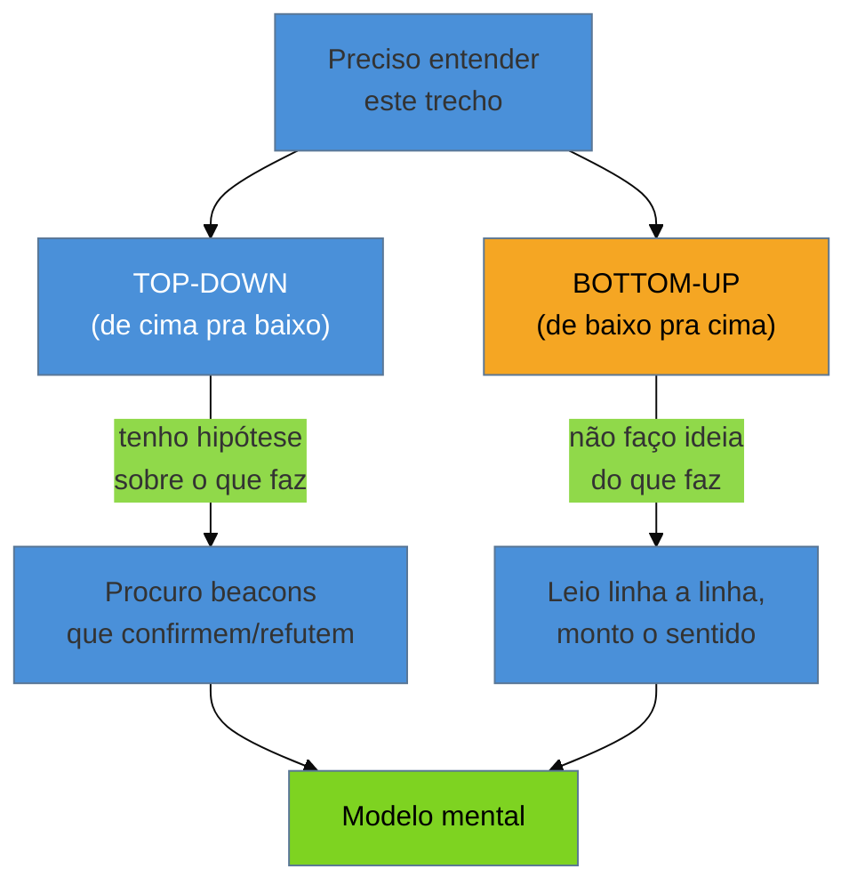

# Lendo código que você não escreveu

> [!abstract] TL;DR
> Ler código alheio cansa de um jeito que escrever não cansa — e há uma razão biológica: sua
> **memória de trabalho** só segura de 2 a 6 pedaços de informação por vez, e código desconhecido
> chega em pedaços pequenos demais. O programador que escreveu aquilo lia um bloco inteiro como *um*
> conceito ("ah, isso é o cache"); você, sem os mesmos **chunks** na memória de longo prazo, lê
> quarenta linhas soltas e transborda. Esta nota trata a leitura de código legado como uma técnica
> deliberada, não como "ir lendo": **ler de cima pra baixo** (hipótese + beacons) ou **de baixo pra
> cima** (linha a linha), **rastrear a execução** (pra frente ou de trás pra frente), e — o mais
> importante — **externalizar o modelo** para fora da cabeça (anotações, rascunho de refatoração,
> renomeações), porque a única forma de vencer uma memória de trabalho pequena é não depender dela.

Você abre uma função de 400 linhas herdada. Lê o começo, entende. Continua, e no meio percebe que esqueceu o que a primeira variável significava. Volta. Reencontra o fio, avança mais um pouco — e agora perdeu a condição do `if` de três blocos atrás. Volta de novo. Depois de vinte minutos relendo os mesmos trechos em círculos, você conclui que "esse código é confuso". Talvez seja. Mas parte do problema não está no código — está no fato de que você está tentando segurar na cabeça mais coisas do que a cabeça humana consegue segurar. E isso tem solução.

O [[05 - First Contact|First Contact]] colocou o sistema pra rodar na sua frente. Agora vem a leitura de verdade — não o *skim* de uma hora, mas a construção do **modelo mental** que te fará o dono da teoria ([[03 - A lente do consultor|nota 03]]). E, sem o autor por perto, ler é a principal forma de recuperar a teoria que se perdeu.

## Por que código alheio sobrecarrega: as três memórias

Felienne Hermans, em *The Programmer's Brain*, explica a experiência de "me perco lendo esse código"
com um modelo simples e libertador. Sua mente usa três memórias ao ler código:

- A **memória de longo prazo** — o "HD": tudo que você já sabe (padrões, idiomas da linguagem,
  algoritmos que reconhece de cara).
- A **memória de curto prazo** — a entrada temporária: o que você acabou de ler, retido por segundos.
- A **memória de trabalho** — o "processador": onde você *raciocina*, combinando o que leu com o que
  sabe. É pequena: processa de **2 a 6 pedaços** por vez.

A palavra-chave é **chunk** (pedaço). A memória de trabalho não conta linhas — conta *conceitos*. Um
programador experiente que conhece o domínio olha um bloco e o comprime num único chunk: "isso é uma
paginação padrão". Ele gastou 1 dos seus 6 slots. Você, que não tem esse padrão pré-formado *neste
sistema*, lê as mesmas linhas como 15 fatos independentes — e transborda no oitavo.

> [!question]- Então "código confuso" é só falta de familiaridade? A culpa é minha?
> Nem uma coisa nem outra, e as duas ao mesmo tempo. Código legado costuma ser genuinamente difícil
> de "chunkar" — nomes ruins, sem abstrações claras, sem os *beacons* (marcos reconhecíveis) que
> deixariam você agrupar. Isso é um defeito real do código. Mas a **sua** dificuldade também vem de
> ainda não ter construído os chunks daquele sistema na memória de longo prazo — o que só o tempo e a
> leitura ativa resolvem. A boa notícia: entender que o gargalo é a memória de trabalho muda a
> estratégia. Em vez de "ler com mais força", você **descarrega** a cabeça para fora (papel, editor)
> e constrói chunks deliberadamente. É disso que trata o resto da nota.

**A sobrecarga em uma frase:** você não se perde no código legado por ser fraco — se perde porque
está pedindo à sua memória de trabalho, que segura 6 coisas, que segure 60; a técnica toda é parar
de depender dela.

## Duas direções de leitura

Não existe "a" forma de ler código. Existem duas, e o profissional alterna entre elas conforme o que
já sabe.

**Top-down (de cima pra baixo):** você chega com uma *hipótese* ("isto deve ser o cálculo de frete")
e lê procurando **beacons** — nomes, chamadas, estruturas que confirmam ou derrubam a hipótese. É
rápido e é como especialistas leem quando reconhecem o domínio. O risco: se a hipótese estiver errada,
você lê o código enviesado, encaixando o que vê na história errada.

**Bottom-up (de baixo pra cima):** você não faz ideia do que o trecho faz, então lê **linha a linha**,
montando o sentido a partir dos identificadores e das operações, incrementalmente. É lento e cansativo
(é o que transborda a memória de trabalho), mas é honesto — você não impõe uma história prévia.

Na prática, você **alterna**: começa top-down com uma hipótese barata, e quando bate num trecho que
não encaixa, desce para bottom-up naquele ponto específico. Reconhecer *em qual modo você está* já
evita metade dos enganos.

## Rastrear a execução: pra frente e de trás pra frente

Ler estático só leva até certo ponto; em algum momento você precisa **simular o computador** —
seguir o fluxo de execução. Há dois sentidos:

- **Tracing linear (pra frente):** parta do início do fluxo e siga o controle até o fim, como o
  runtime faria. Bom para entender *o caminho feliz* de um caso de uso inteiro.
- **Tracing reverso / sob demanda (de trás pra frente):** parta do *resultado* que te interessa (uma
  variável, um valor que apareceu errado na tela da demo do [[05 - First Contact|First Contact]]) e
  volte, perguntando "quem escreveu isto? de onde veio?". Bom para responder uma pergunta específica
  sem ler o sistema inteiro — é o modo de depurar um comportamento pontual.

O tracing reverso é o mais subestimado e o que mais economiza tempo no legado: em vez de tentar
entender tudo, você deixa a *pergunta* guiar a leitura, e só toca no código que a resposta exige.

## Leitura ativa: tire o modelo da cabeça

Aqui está o segredo que separa quem consegue ler legado de quem desiste: **você não vence a memória
de trabalho pequena com esforço — vence descarregando-a para fora**. Leitura de legado é uma
atividade de *escrita*.

- **Anote e desenhe.** Cada chunk que você forma, registre: um diagrama de dependências rabiscado, uma
  lista de "quem chama quem", um glossário dos nomes obscuros. O papel não transborda em 6 itens.
- **Renomeie enquanto aprende.** Descobriu que `tmp2` é na verdade o `saldoLíquido`? Renomeie (com a
  segurança de refatoração da sua IDE). Cada nome bom que você fixa é um chunk permanente que a
  próxima leitura ganha de graça — você está *construindo os beacons* que o autor não deixou.
- **Scratch refactoring (refatoração de rascunho).** Técnica de Feathers: refatore o código
  agressivamente *só para entendê-lo* — extraia funções, renomeie, quebre condicionais — e depois
  **jogue tudo fora** (`git reset --hard`). O objetivo nunca foi manter a mudança; foi que o *ato* de
  reorganizar force você a compreender. A refatoração de verdade, que fica, vem depois, com a rede de
  segurança da [[10 - A rede de segurança primeiro|nota 10]] — aqui é descartável e por isso pode ser
  ousada.

Todas as três táticas têm o mesmo princípio: **mover o modelo mental da sua memória de trabalho
(pequena, volátil) para um meio externo (grande, permanente)**. É a diferença entre reler o mesmo
bloco cinco vezes e nunca mais precisar relê-lo.

## Casos práticos

### Cenário 1: o tracing reverso que achou a regra escondida

Na demo do sistema de preços ([[05 - First Contact|nota 05]]), a gerente mostrou que produtos
importados usam o câmbio do dia. Você quer achar *onde* isso acontece — mas o código de precificação
tem 2.000 linhas. Em vez de ler tudo (bottom-up no sistema inteiro = transbordo garantido), você faz
tracing reverso: parte do valor final exibido, e volta, chamada por chamada, perguntando "de onde
veio esse número?". Em quatro saltos você chega a uma função `aplicarAjustes` que consulta uma tabela
de câmbio — e para. Você entendeu a regra tocando em 4 funções, não em 2.000. A pergunta guiou a
leitura.

### Cenário 2: o scratch refactoring de uma função ilegível

Você precisa entender uma função de 300 linhas que calcula comissões, cheia de `if` aninhados e
variáveis chamadas `a`, `b`, `x2`. Ler passivamente não cola — você se perde no terceiro nível de
aninhamento. Então você refatora *para descartar*: extrai cada bloco numa função com nome ("isto é
`comissãoBase`, isto é `bônusPorMeta`, isto é `descontoDeDevolução`"), renomeia as variáveis conforme
entende. Ao fim de uma hora, a função virou legível — e você entendeu a lógica de comissão inteira. Aí
você dá `git reset --hard` e joga tudo fora. Não perdeu o trabalho: o produto do scratch refactoring
nunca foi o código, foi o **modelo mental** que agora mora na sua cabeça (e nas suas anotações). A
refatoração que vai *ficar* você fará depois, com testes.

## Armadilhas comuns

> [!warning] Tentar segurar tudo na cabeça
> **O que acontece:** você lê um trecho complexo sem anotar nada, confiando na memória — e relê os
> mesmos blocos indefinidamente, perdendo o fio a cada nova camada.
> **Por quê:** é o gargalo da memória de trabalho (2-6 chunks). Código legado gera chunks demais para
> caberem; sem descarregar, você fica preso num ciclo de releitura.
> **Como evitar:** externalize desde a primeira linha difícil — rabisque um diagrama, mantenha um
> glossário de nomes, renomeie na IDE. Trate leitura como escrita.

> [!warning] Ler passivamente, sem hipótese nem pergunta
> **O que acontece:** você "vai lendo" do topo do arquivo sem um objetivo, absorvendo detalhes que não
> importam para a sua tarefa e se afogando no volume.
> **Por quê:** sem uma hipótese (top-down) ou uma pergunta (tracing reverso) guiando, todo trecho
> parece igualmente importante — e nada é retido.
> **Como evitar:** entre em cada sessão de leitura com uma pergunta concreta ("onde o frete é
> calculado?") e deixe-a filtrar o que você lê. Leitura sem alvo é turismo, não escavação.

> [!warning] Confundir scratch refactoring com refatoração de verdade
> **O que acontece:** o scratch refactoring deixa o código tão melhor que você se apega e comita a
> mudança — sem testes, sem a rede de segurança, num código que você acabou de conhecer.
> **Por quê:** dói jogar fora um trabalho que melhorou tudo. Mas você refatorou para *entender*, não
> para *manter* — e sem rede, essa mudança é uma cerca de Chesterton derrubada no escuro
> ([[02 - A mentalidade do restaurador|nota 02]]).
> **Como evitar:** discipline o `git reset --hard`. A refatoração que fica exige a rede de segurança
> primeiro ([[10 - A rede de segurança primeiro|nota 10]]) — o scratch é sempre descartável.

## Como explicar em inglês

Quando te perguntarem, em entrevista, como você aborda um código grande que não escreveu:

> "The first thing I remind myself is that getting lost in unfamiliar code isn't a failure of
> effort — it's working memory overload. Following Felienne Hermans' *The Programmer's Brain*, working
> memory only holds a handful of chunks, and legacy code arrives in chunks that are too small because
> the good names and abstractions aren't there. So my strategy is to stop relying on my head: I read
> with a **hypothesis** top-down and follow beacons, or if I'm lost I go **bottom-up** line by line;
> I **trace execution backward** from a value I care about instead of reading everything; and above
> all I **externalize the model** — I sketch dependency diagrams, keep a glossary, rename variables as
> I learn, and I use **scratch refactoring**: I aggressively refactor a nasty function purely to
> understand it, then `git reset --hard` and throw it away. The product was never the code — it was
> the understanding."

| PT | EN |
|----|----|
| memória de trabalho | working memory |
| carga cognitiva | cognitive load |
| pedaço (de informação) | chunk |
| marco reconhecível | beacon |
| leitura de cima pra baixo | top-down reading |
| leitura de baixo pra cima | bottom-up reading |
| rastrear a execução | to trace execution |
| tracing reverso / sob demanda | backward / on-demand tracing |
| refatoração de rascunho | scratch refactoring |
| descarregar / externalizar o modelo | to offload / externalize the model |

## O que vem a seguir

Ler o código te dá o *estado atual* do sistema — o que ele é agora. Mas metade da teoria perdida está
no *porquê* ele chegou aqui, e isso o código presente não conta. Existe uma fonte que registra cada
decisão, cada correção, cada "gambiarra às pressas na madrugada da virada": o histórico de versões.
Ler o `git` é a arqueologia propriamente dita.

- [[07 - Arqueologia do histórico]] — o `git log` e o `git blame` como sítio de escavação: a ordem em que o sistema foi construído e o porquê de cada camada.
- [[10 - A rede de segurança primeiro]] — o que fazer antes de transformar leitura em mudança que fica.
- [[16 - IA como acelerador e seus riscos]] — LLMs como aceleradores de compreensão: explicar trechos, gerar diagramas — e por que não confiar cegamente.
- [[05 - First Contact]] — o inventário técnico que precede e alimenta esta leitura.

## Fontes

- **Felienne Hermans** — [*The Programmer's Brain*](https://www.manning.com/books/the-programmers-brain) (2021) — o modelo cognitivo (três memórias, chunking, carga cognitiva) que explica *por que* código alheio sobrecarrega e como a leitura ativa contorna o gargalo.
- **Michael Feathers** — *Working Effectively with Legacy Code* (2004) — a técnica de *scratch refactoring*: refatorar para entender e depois descartar.
- **understandlegacycode.com** — [*Key points of The Programmer's Brain*](https://understandlegacycode.com/blog/key-points-of-programmer-brain/) — a aplicação direta do modelo de Hermans ao trabalho com código legado.
- **Storey et al. / literatura de *program comprehension*** — [síntese sobre modelos mentais de programas](https://arxiv.org/pdf/2212.07763) — top-down (hipótese + beacons) vs. bottom-up e as estratégias de tracing (linear vs. sob demanda).

## Veja também

- [[03-Dominios/Engenharia/Arqueologia e Restauração de Software/index|Arqueologia e Restauração de Software (MOC)]]
- [[03-Dominios/Engenharia/Arqueologia e Restauração de Software/07 - Arqueologia do histórico|Arqueologia do histórico]] — a outra metade da leitura: o porquê histórico no `git`
- [[03-Dominios/Engenharia/Complexidade de Software/index|Complexidade de Software]] — por que o código chegou ilegível até você (o diagnóstico)
- [[03-Dominios/Engenharia/Testes/index|Testes]] — a rede que transforma leitura-para-entender em mudança-que-fica
