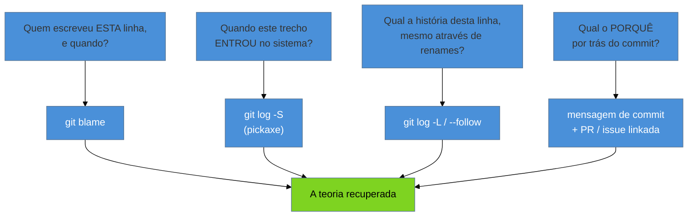

# Arqueologia do histórico

> [!abstract] TL;DR
> O código presente te diz **como** o sistema funciona; ele quase nunca te diz **por quê** é assim. E
> o "porquê" é exatamente a teoria perdida ([[03 - A lente do consultor|nota 03]]) que você veio
> recuperar. Existe uma fonte que preserva esse porquê: o **histórico de versões**. Cada linha
> estranha foi escrita por alguém, num commit, com uma mensagem, respondendo a um problema real. As
> ferramentas de escavação são simples e subutilizadas: `git blame` (quem tocou nesta linha e
> quando), `git log -S` (o *pickaxe*: quando este trecho *entrou* no mundo), `git log -L` (a história
> de uma linha através de renames), e a leitura das **mensagens de commit** e PRs como narrativa. É
> aqui que a Cerca de Chesterton ([[02 - A mentalidade do restaurador|nota 02]]) deixa de ser
> metáfora: o histórico é *como você descobre por que a cerca foi construída* — antes de derrubá-la.

Lembra do `if` que o consultor apressado da [[04 - Os primeiros 30-60-90 dias|nota 04]] removeu, e que
quebrou o faturamento de 3% dos clientes? Ele não precisava de sorte para evitar aquilo. Precisava de
um comando. Um `git blame` naquela linha teria mostrado o commit que a introduziu, e a mensagem —
"fix: formato especial de nota fiscal para ES" — teria contado a história inteira em cinco palavras. O
código dizia *o quê* aquele `if` fazia (uma condição), mas escondia *por quê* existia. O histórico
não escondia. A tragédia da nota 04 foi, no fundo, não ter feito arqueologia.

Esta nota fecha o arco de orientação (a fase Iniciado do galho). O [[05 - First Contact|First
Contact]] pôs o sistema pra rodar; a [[06 - Lendo código que você não escreveu|leitura do código]] te
deu o *estado atual*. O `git` te dá a dimensão que faltava: o **tempo** — a ordem em que o sistema foi
construído e a razão de cada camada.

## O código é o "como"; o histórico é o "porquê"

Um sistema é feito de duas coisas que envelhecem de formas diferentes. O **código** é o presente
congelado: descreve o comportamento atual, mas é mudo sobre suas próprias origens. Uma condição
bizarra, um valor mágico `* 1.0413`, uma exceção tratada de um jeito esquisito — o código executa
isso fielmente, mas não explica de onde veio. É o "como".

O **histórico** é o "porquê" em forma narrativa. Cada uma dessas esquisitices entrou por um commit,
num momento, resolvendo um problema que era urgente para alguém. O `* 1.0413` pode ser uma alíquota de
imposto de uma cidade específica, fixada num commit de 2019 com um link para a lei municipal na
mensagem. O código sozinho te faria adivinhar (ou pior, "limpar"); o histórico te conta.

> [!question]- Se a mensagem de commit é tão importante, e se ela for inútil ("fix", "wip", "ajustes")?
> Aí você aprendeu duas coisas. Primeiro, sobre *aquela* linha: terá de recorrer a outras fontes (o PR
> linkado, a issue, o ticket, ou o tracing reverso da [[06 - Lendo código que você não escreveu|nota
> 06]]). Segundo, e mais valioso, sobre a **cultura** que produziu o sistema: um histórico de
> mensagens vazias é um sinal de diagnóstico tão eloquente quanto um build quebrado — te diz que a
> disciplina de registrar o *porquê* nunca existiu, e que a teoria se perdeu mais fundo do que o
> normal. Isso, por sua vez, eleva a prioridade de você começar a registrar o porquê *agora* (os ADRs
> da [[24 - Conhecimento e documentação|nota 24]]).

**A distinção em uma frase:** ler só o código é como escavar um sítio ignorando os estratos — você vê
os artefatos, mas perde a ordem e a intenção que só o tempo registra; o `git` é o corte estratigráfico.

## As ferramentas de escavação

Poucos comandos, muito subutilizados. O que importa não é decorá-los, é saber **qual pergunta cada um
responde**.

| Pergunta | Comando | Cuidado |
|---|---|---|
| Quem tocou nesta linha por último? | `git blame <arquivo>` | Costuma cair num commit de *refatoração/reformatação*, não na mudança original. |
| ...ignorando mudanças de espaço? | `git blame -w` | `-w` pula alterações que são só de whitespace. |
| ...seguindo código que foi *movido*? | `git blame -M -C` | Detecta linhas movidas/copiadas e credita o commit original. |
| Quando este texto exato entrou/saiu? | `git log -S"<trecho>"` | O *pickaxe*: varre toda a história atrás de quando um trecho apareceu. |
| Qual a história desta linha específica? | `git log -L <ini>,<fim>:<arquivo>` | Segue a linha através de renames e movimentações. |
| Por que este commit foi feito? | `git show <hash>` + PR/issue | A mensagem é o ouro — se existir e for honesta. |

O `git blame` é a porta de entrada, mas tem uma **armadilha embutida**: ele te mostra a *última* vez
que a linha mudou, que muitas vezes é um commit de "reformatar código" ou "migrar de tabs para
espaços" — ruído histórico que esconde a mudança que importa. Por isso o `-w` (ignora espaço) e o `-M`
(segue movimentações) existem: eles removem os estratos de poeira para você chegar ao commit que
realmente introduziu a lógica. Quando mesmo assim o blame cair num refactor, use o hash daquele commit
como ponto de partida e escave mais fundo (`git log -L`, ou blame na revisão *anterior* àquela).

## O histórico também revela onde dói — mas isso é a nota 09

Ao ler o `git log`, você vai notar que certos arquivos aparecem em quase todo commit, enquanto outros
não mudam há anos. Essa frequência de mudança é um sinal poderoso — arquivos que mudam o tempo todo
*e* são complexos são os **hotspots**, o coração do risco do sistema. Mas transformar isso numa
análise sistemática (frequência × complexidade, acoplamento temporal, *bus factor* por arquivo) é
**forense quantitativa**, e ganha nota própria: a [[09 - Forense de software|nota 09]], sobre o método
de Adam Tornhill. Aqui, na fase de orientação, basta o olho: repare em *quais* arquivos o histórico
não para de tocar — eles são onde você vai voltar a atenção depois.

## Casos práticos

### Cenário 1: a cerca de Chesterton recuperada pelo blame

Você encontra, no cálculo de frete, uma linha que soma `+ 2.5` a certos pedidos, sem comentário
nenhum. O instinto de limpeza diz "número mágico, isso é lixo, remove". Antes, você faz arqueologia:
`git blame -w` na linha aponta um commit de 2021; `git show` naquele hash revela a mensagem "taxa de
manuseio para itens frágeis — acordo com a transportadora, contrato #4471". O `+ 2.5` não era lixo:
era uma **cerca de Chesterton** ([[02 - A mentalidade do restaurador|nota 02]]), um acordo comercial
codificado. Você não só evitou quebrar um contrato — descobriu uma regra de negócio que ninguém tinha
documentado, e agora pode dar a ela um nome (`taxaManuseioFragil`) em vez de deletá-la. O histórico
transformou um "número mágico" em teoria recuperada.

### Cenário 2: o pickaxe que datou a origem de um bug

Um bug intermitente de arredondamento aparece só em pedidos antigos. Você suspeita de uma mudança na
lógica de cálculo, mas não sabe quando ela entrou. Em vez de ler todo o histórico, você usa o
*pickaxe*: `git log -S"roundHalfUp"` lista exatamente os commits em que aquela string apareceu ou
sumiu. Descobre que o modo de arredondamento foi trocado de `roundHalfEven` para `roundHalfUp` num
commit de migração, sem que ninguém percebesse o efeito nos pedidos legados. Em dois minutos, o
pickaxe te deu a data, o autor e o contexto do bug — algo que a leitura estática levaria horas para
inferir, se inferisse.

## Armadilhas comuns

> [!warning] Confiar na primeira camada do blame
> **O que acontece:** você roda `git blame`, vê um commit recente de "code cleanup" e conclui que a
> linha não tem história relevante — quando na verdade a lógica que importa entrou anos antes.
> **Por quê:** o blame mostra a *última* alteração, e reformatações/refatorações são as últimas a
> tocar quase toda linha, soterrando a mudança original.
> **Como evitar:** use `-w` e `-M` para pular ruído de espaço e movimentação; quando cair num
> refactor, faça blame na revisão anterior (`git blame <hash>^ -- <arquivo>`) ou use o *pickaxe* para
> achar a introdução real.

> [!warning] Deletar o "estranho" sem consultar o histórico
> **O que acontece:** você remove uma condição, um valor mágico ou um `try/catch` esquisito por parecer
> desnecessário — e quebra um comportamento que atendia a um caso real e raro.
> **Por quê:** é o pecado da [[04 - Os primeiros 30-60-90 dias|nota 04]] em miniatura: derrubar uma
> cerca de Chesterton sem perguntar por que ela existe. O código não explica; o histórico sim.
> **Como evitar:** faça do `git blame` + leitura da mensagem um **reflexo** antes de apagar qualquer
> coisa que você não entende. Trinta segundos de arqueologia versus um incidente em produção.

> [!warning] Julgar o autor pelo padrão de hoje
> **O que acontece:** você lê um commit antigo, acha a solução horrível, e conclui que o dev anterior
> era incompetente — perdendo a chance de entender a *restrição* que o levou àquilo.
> **Por quê:** o histórico registra decisões tomadas sob pressões que você não vê (um prazo, uma versão
> antiga de framework, um bug de biblioteca da época). Julgar é confortável e improdutivo.
> **Como evitar:** leia o histórico com a "humildade ativa" da [[02 - A mentalidade do restaurador|nota
> 02]] — presuma uma boa razão sob restrições reais, e use a mensagem/data do commit para reconstruí-la
> em vez de condenar.

## Como explicar em inglês

Quando te perguntarem, em entrevista, como você descobre *por que* um código legado é do jeito que é:

> "The source code tells you *how* the system behaves, but it's almost silent about *why* — and the
> 'why' is the lost theory I'm there to recover. So I treat the version history as an archaeological
> site. `git blame` tells me who last touched a line and when — though I always use `-w` and `-M`,
> because raw blame usually lands on a reformatting commit and hides the change that matters. The
> **pickaxe**, `git log -S`, tells me when a specific piece of code first *entered* the system, which
> is perfect for dating the origin of a bug. And the commit messages and linked PRs are the real
> gold — that's where a weird line reveals it was a tax rule or a contract clause, not junk. This is
> literally how I find out *why a Chesterton's fence was built* before I decide whether to remove it."

| PT | EN |
|----|----|
| arqueologia do histórico | code / history archaeology |
| histórico de versões | version history |
| quem tocou nesta linha | who touched this line |
| pickaxe (`git log -S`) | the pickaxe |
| número mágico | magic number |
| mensagem de commit | commit message |
| ruído histórico | historical debris / noise |
| o "como" vs. o "porquê" | the *how* vs. the *why* |
| datar a origem de um bug | to date the origin of a bug |

## O que vem a seguir

Com o inventário técnico ([[05 - First Contact|05]]), a leitura do código ([[06 - Lendo código que
você não escreveu|06]]) e a arqueologia do histórico (esta nota), você fecha o **arco de orientação**:
tem um modelo mental do presente e do passado do sistema. Começa agora a fase **Adepto** — deixar de
apenas *entender* e passar a *mudar com segurança*. O primeiro salto é elevar o que você aprendeu lendo
a um mapa formal da arquitetura, e depois tornar quantitativo o faro que o histórico te deu sobre onde
dói.

- [[08 - Engenharia reversa e recuperação de arquitetura]] — de trechos lidos a um mapa formal do sistema: dependency graphs, análise estática.
- [[09 - Forense de software]] — o método de Tornhill: transformar a frequência de mudança do histórico em hotspots, acoplamento temporal e *bus factor* quantificados.
- [[02 - A mentalidade do restaurador]] — a Cerca de Chesterton que a arqueologia do histórico ensina a respeitar.
- [[24 - Conhecimento e documentação]] — registrar o *porquê* agora (ADRs), para que o próximo não precise escavar.

## Fontes

- **John Firebaugh** — [*Code Archaeology with Git*](https://jfire.io/blog/2012/03/07/code-archaeology-with-git/) — as técnicas para separar commits interessantes do ruído histórico (reformatação, movimentação): `blame -w`, `-M`, o *pickaxe*.
- **Atlassian** — [*Git blame tutorial*](https://www.atlassian.com/git/tutorials/inspecting-a-repository/git-blame) — o uso e as limitações do `git blame` para inspecionar autoria e datar mudanças linha a linha.
- **git-scm** — [*git-blame Documentation*](https://git-scm.com/docs/git-blame) — a referência das flags (`-w`, `-M`, `-C`, `-L`) que removem os estratos de poeira do histórico.
- **Michael Feathers** — *Working Effectively with Legacy Code* (2004) — a recuperação de intenção como parte central de trabalhar sobre código sem documentação.

## Veja também

- [[03-Dominios/Engenharia/Arqueologia e Restauração de Software/index|Arqueologia e Restauração de Software (MOC)]]
- [[03-Dominios/Engenharia/Arqueologia e Restauração de Software/09 - Forense de software|Forense de software]] — a forense quantitativa que aprofunda o faro de hotspots desta nota
- [[03-Dominios/Engenharia/Arqueologia e Restauração de Software/02 - A mentalidade do restaurador|A mentalidade do restaurador]] — a Cerca de Chesterton que o histórico ensina a respeitar
- [[03-Dominios/Engenharia/Complexidade de Software/index|Complexidade de Software]] — por que a teoria se perde (o diagnóstico que a arqueologia tenta reverter)
