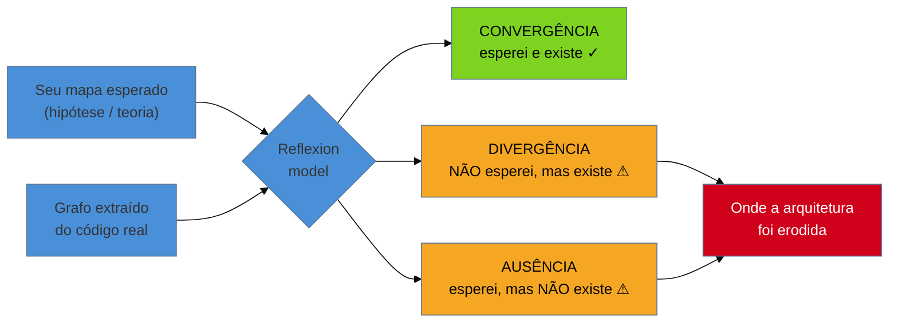
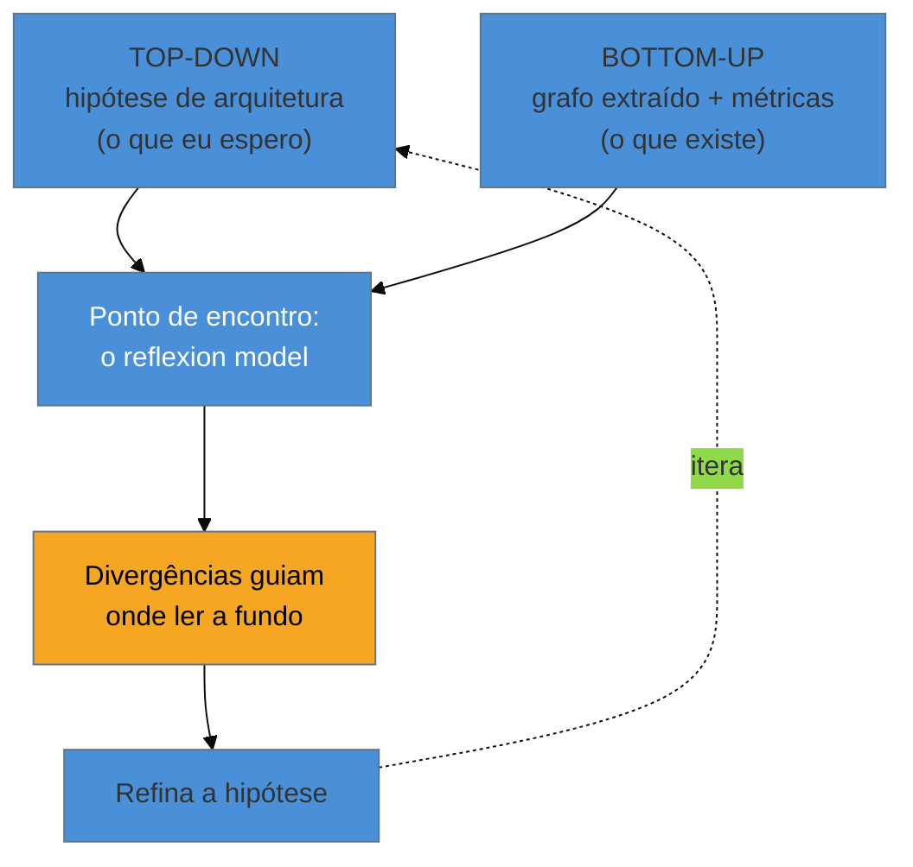

# Engenharia reversa e recuperação de arquitetura

> [!abstract] TL;DR
> Ler o código ([[06 - Lendo código que você não escreveu|nota 06]]) e escavar o histórico ([[07 - Arqueologia do histórico|nota 07]]) te dá **fragmentos** — trechos que você entende um a um. Mas o sistema não cabe na sua cabeça: você precisa de um **mapa formal**, e ninguém tem um que seja verdadeiro. **Engenharia reversa** é o ato de reconstruir esse mapa a partir do artefato: extrair automaticamente o **grafo de dependências** e a estrutura real (análise estática), e confrontá-la com a arquitetura que *dizem* que o sistema tem. A ferramenta-chave dessa etapa é o **reflexion model** (Murphy & Notkin): você desenha o mapa que *esperava*, a ferramenta extrai o mapa que *existe*, e a diferença entre os dois — a **erosão arquitetural** (Perry & Wolf) — é exatamente onde mora o risco. Você não mapeia tudo: mapeia guiado por hipótese, top-down encontra bottom-up. É a fase em que a [[03 - A lente do consultor|teoria perdida]] deixa de ser intuição e vira um artefato que você pode mostrar ao cliente.

Você já passou três semanas no sistema do cliente. Leu os módulos que mais assustavam, rodou o *pickaxe* nos trechos estranhos, montou um modelo mental decente de *pedaços* do sistema. Aí o CTO te convida para uma reunião de due diligence e faz a pergunta que você temia: **"Me desenha a arquitetura disso aqui."** Você congela. Não porque não entende as partes — entende. Mas porque o sistema tem 340 mil linhas, 1.200 classes, e o que você tem na cabeça são ilhas desconexas. Ninguém consegue segurar 340 mil linhas na memória de trabalho (a [[06 - Lendo código que você não escreveu|nota 06]] explicou por quê: sete itens, lembra?). Você precisa de um mapa — e o único diagrama que existe, aquele PowerPoint de 2019 pendurado na parede do time, você já desconfia que é ficção.

Esta nota abre a fase **Adepto** do galho. A fase Iniciado te deu orientação: entender o sistema peça por peça. Agora o salto é de outra natureza — **elevar fragmentos a estrutura**. Deixar de dizer "esse arquivo faz X" e passar a dizer "o sistema tem *estas* camadas, com *estas* dependências, e *aqui* a arquitetura pretendida foi violada". Isso é engenharia reversa: reconstruir o mapa que ninguém documentou, e — mais importante — descobrir onde o mapa oficial mente.

## O problema: você tem fragmentos, precisa de um mapa

Reengenharia começa com um paradoxo cruel. Para mudar o sistema com segurança, você precisa entendê-lo como um todo. Mas entender um todo grande é justamente o que a mente humana não faz — e é por isso que o sistema virou legado em primeiro lugar (a teoria se perdeu porque ninguém mais a segurava inteira).

A leitura de código resolve o *local*: você mergulha num método e o entende. A engenharia reversa resolve o *global*: ela produz uma representação do sistema **em escala** que cabe numa folha, num grafo, numa matriz — algo que sua memória de trabalho consegue manipular. A diferença é a mesma entre conhecer cada rua de um bairro andando por elas e ter o **mapa da cidade**. As duas coisas são necessárias; a segunda não emerge sozinha da primeira.

> [!question]- Se eu já li o código, por que não desenho a arquitetura de cabeça? Por que preciso de ferramenta?
> Porque sua cabeça mente por conveniência. Quando você desenha "de memória", você desenha a arquitetura que faz *sentido* — as camadas limpas, o fluxo lógico. O código real quase nunca é assim: tem o atalho que alguém fez numa sexta-feira, a dependência circular que ninguém quis resolver, o módulo de UI que fala direto com o banco pulando três camadas. Um grafo **extraído** do código não tem essa cortesia: ele te mostra as setas que *existem*, não as que deveriam existir. É justamente o desacordo entre o que você desenharia e o que a ferramenta extrai que carrega a informação valiosa. Desenhar de cabeça esconde exatamente o que você precisa ver.

**O problema em uma frase:** ler código te dá as ruas; engenharia reversa te dá o mapa — e sem o mapa você não consegue nem descrever o sistema ao cliente, nem decidir com segurança onde intervir.

## Os dois braços da engenharia reversa

Reconstruir o mapa tem dois movimentos que se completam. Um é **automático e ascendente** (bottom-up): deixar as ferramentas extraírem a estrutura que está de fato no código. O outro é **humano e descendente** (top-down): trazer a hipótese do que o sistema *deveria* ser e confrontá-la com o extraído. O ouro está no encontro dos dois.

### Braço 1 — Extração: o que o código realmente diz

A máquina lê o código muito mais rápido e honestamente que você. **Análise estática** percorre o código-fonte (sem executá-lo) e responde perguntas estruturais: quem chama quem, quem importa quem, quais classes dependem de quais. O resultado é um **grafo de dependências** — nós são módulos/pacotes/classes, arestas são "usa/importa/chama". Esse grafo é o esqueleto do sistema, e ele revela padrões que a leitura linha a linha nunca mostraria:

- **Módulos-deus (*god modules*):** um nó com dezenas de arestas entrando e saindo. É o coração do acoplamento — mexer nele reverbera por todo o sistema.
- **Ciclos de dependência:** A depende de B que depende de A. Ciclos são o cimento que impede decomposição: você não consegue isolar, testar ou extrair nada dentro de um ciclo sem arrastar o resto.
- **Camadas fantasma:** o grafo mostra que a "camada de domínio" na verdade importa a camada de infraestrutura, invertendo a dependência que a arquitetura pretendia.

### Braço 2 — Validação: onde a arquitetura pretendida foi traída

O grafo cru é grande e ruidoso demais para ler direto. É aqui que entra a ideia mais poderosa da recuperação de arquitetura: o **reflexion model**, de Gail Murphy e David Notkin (1995). O procedimento é enganosamente simples e você o executa em horas, não semanas:

1. **Desenhe o mapa que você espera.** Um diagrama de caixas-e-setas de alto nível: "UI → Serviços → Repositórios → Banco", umas 5 a 15 caixas. É a sua *hipótese* da arquitetura — a teoria que você acredita que o sistema tem.
2. **Mapeie as caixas para o código.** Diga à ferramenta quais arquivos/pacotes pertencem a cada caixa (ex.: `com.cliente.web.*` → caixa "UI").
3. **Deixe a ferramenta computar o reflexion model.** Ela extrai o grafo real e o sobrepõe à sua hipótese, classificando cada relação em três tipos:

- **Convergências** (verde): você esperava a dependência e ela existe. Sua teoria estava certa ali.
- **Divergências** (âmbar): existe uma dependência que você *não* esperava — a UI falando direto com o banco, o módulo de relatórios importando o de pagamento. **Cada divergência é uma decisão perdida**, um ponto onde a arquitetura real traiu a pretendida.
- **Ausências** (âmbar): você esperava uma dependência que *não* existe — sinal de que sua hipótese estava errada, ou de que uma camada morreu sem que ninguém notasse.

Murphy e Notkin validaram isso reconstruindo o subsistema de memória virtual do **NetBSD — 250 mil linhas de C — em poucas horas**, um mapa global que nenhum engenheiro tinha inteiro na cabeça. O poder do reflexion model é que ele **não te pede para ler tudo**: ele te dá uma visão global aproximada e aponta exatamente os pontos onde vale a pena mergulhar.

## Erosão e desvio: por que o diagrama na parede sempre mente

Aquele PowerPoint de 2019 na parede não é uma mentira maldosa — é o resultado inevitável de um processo que Dewayne Perry e Alexander Wolf batizaram em 1992. Toda arquitetura sofre dois males ao longo do tempo:

- **Desvio arquitetural (*architectural drift*):** decisões vão sendo tomadas sem malícia, mas sem aderência à visão original, simplesmente porque ninguém a conhece ou a impõe. A estrutura vai *deslizando*.
- **Erosão arquitetural (*architectural erosion*):** violações *diretas* da arquitetura pretendida — aquele atalho da UI ao banco — que se acumulam e enfraquecem a estrutura, como infiltrações numa viga.

O diagrama oficial congela a *intenção* de um momento passado; o código continua se movendo. A distância entre os dois só cresce. Por isso o consultor experiente **nunca confia no diagrama que lhe mostram** — ele o trata como uma *hipótese a ser testada* (exatamente o input do reflexion model), não como um fato. O reflexion model é, no fundo, um **medidor de erosão**: quanto mais divergências, mais o sistema se afastou da própria teoria — e mais fundo a [[03 - A lente do consultor|teoria se perdeu]].

## O procedimento de mapeamento: top-down encontra bottom-up

O livro *Object-Oriented Reengineering Patterns* (Demeyer, Ducasse & Nierstrasz) organiza a engenharia reversa como uma escalada do *First Contact* ([[05 - First Contact|nota 05]]) até o entendimento detalhado dos subsistemas críticos. A lição central: você **não mapeia o sistema inteiro** — isso é impossível e inútil. Você mapeia guiado por objetivo, num vaivém entre dois sentidos:

Você começa com uma hipótese grosseira (top-down), extrai a estrutura real (bottom-up), e usa as **divergências** para decidir *onde* investir sua leitura cara de código. Cada mergulho refina a hipótese, que refina o próximo mapa. É iterativo e barato: em vez de ler 340 mil linhas, você lê as 3 mil que o mapa apontou como o coração do risco.

### Ferramentas por stack

Você não precisa das ferramentas de pesquisa dos anos 90 — hoje há opções maduras e gratuitas em quase todo ecossistema. O que importa é ter *uma* que extraia o grafo e, de preferência, *uma* que valide contra uma arquitetura declarada.

| Stack | Extrair grafo / métricas | Validar arquitetura (reflexion-like) |
|---|---|---|
| Java/JVM | `jdeps` (vem no JDK), Structure101, Sonargraph | **ArchUnit** (regras de camada como teste), Sonargraph |
| .NET | NDepend, Visual Studio dep. diagram | NDepend (regras CQLinq), ArchUnitNET |
| JavaScript/TS | `madge`, `dependency-cruiser` | `dependency-cruiser` (regras `forbidden`), `eslint-plugin-boundaries` |
| Python | `pydeps`, `import-linter` grafo | **import-linter** (contratos de camada), `tach` |
| Poliglota / geral | **CodeScene**, Understand, Structure101, `cloc` (tamanho) | Sonargraph, Structure101 |

> [!info] A virada moderna: arquitetura como teste automatizado
> Ferramentas como **ArchUnit** (Java), **import-linter** (Python) e **dependency-cruiser** (JS) fazem algo que Murphy e Notkin só sonhavam: transformam o reflexion model num **teste executável**. Você declara "a camada de domínio não pode depender da de infraestrutura" como código, e o CI quebra a build na próxima violação. Isso não só mede a erosão — **estanca** o sangramento. É a ponte da engenharia reversa (esta nota) para a rede de segurança que vem depois: uma vez recuperada, a arquitetura vira um invariante protegido, não mais um PowerPoint que ninguém lê.

> [!tip] Assista: Unit Test Your Java Architecture With ArchUnit
> **Canal:** JCON (Roland Weisleder) | **Duração:** ~43min | **Idioma:** EN
>
> A nota já explica *que* o ArchUnit transforma o reflexion model num teste executável; este talk mostra *como* isso funciona no dia a dia, ao vivo, com regras de nomeação, camadas e ciclos. O ganho maior para quem trabalha com legado é o mecanismo de **freezing**: ao introduzir o ArchUnit num sistema com centenas de violações acumuladas, você "congela" o estado atual num arquivo de exceções conhecidas — os testes ficam verdes de novo, mas qualquer violação *nova* quebra o build. É o equivalente ao *strangler fig* aplicado a dívida arquitetural: você não para tudo para corrigir 500 violações de uma vez, mas também não deixa a erosão continuar sem ser notada. Trecho de destaque [34:01]: *"The third thing is the freezing of ArchUnit... we acknowledge that these violations exist, but we can't fix them right away — and we have a clean state and known state of violations. But if we would try to add a new violation, the test will fail."*
>
> 🎬 [Assistir no YouTube](https://www.youtube.com/watch?v=MxP521_i9zM)

### Design Structure Matrix: o grafo que vira matriz

Quando o grafo fica grande demais para os olhos, a **Design Structure Matrix (DSM)** o comprime numa matriz quadrada N×N: módulos nas linhas e colunas, uma marca na célula `(i,j)` quando `i` depende de `j`. A leitura é poderosa:

- Marcas **abaixo** da diagonal principal = dependências "para trás" = **ciclos**. Uma matriz bem arquitetada é quase triangular (tudo acima da diagonal), com camadas empilhadas limpamente.
- **Blocos** densos ao longo da diagonal revelam módulos naturalmente coesos — candidatos a subsistema.
- Uma coluna densa = um módulo do qual *todo mundo* depende (utilitário ou god module).

A DSM é o instrumento que torna o acoplamento *visível em escala* — e prepara o terreno para decidir onde cortar quando chegar a hora de quebrar dependências ([[12 - Seams e quebra de dependência|nota 12]]).

## Casos práticos

### Cenário 1: due diligence — o "núcleo cíclico" que matou a estimativa

Um fundo te contrata para avaliar o risco técnico de uma aquisição: 12 semanas para dizer se o sistema do alvo é modularizável ou uma bola de lama. Em vez de ler por meses, você roda `jdeps` no primeiro dia e gera a DSM. O padrão salta aos olhos: 40% das classes estão num único **componente fortemente conexo** — um emaranhado onde tudo depende de tudo, sem uma ordem topológica possível. Você mostra a matriz ao fundo: "vejam esse bloco abaixo da diagonal; não dá para extrair *nenhum* serviço daqui sem arrastar o resto". Aquilo muda a negociação — o custo de modernização que o vendedor estimava em 3 meses é, na verdade, um projeto de reescrita de núcleo. O grafo disse em um dia o que a leitura não diria em três meses, e o disse numa linguagem que um não-técnico entende: *a forma da matriz*.

### Cenário 2: resgate — a divergência que explicava os incidentes

Um cliente sofre incidentes recorrentes: toda mudança na tela de relatórios derruba o processamento de pagamentos, dois módulos que "não têm nada a ver". O diagrama na parede mostra `Relatórios` e `Pagamentos` como caixas separadas, sem seta entre elas. Você não confia: desenha esse mapa como hipótese, mapeia os pacotes e roda o reflexion model. Aparece uma **divergência** gritante — `Relatórios` importa diretamente uma classe interna de `Pagamentos` para reaproveitar um cálculo de taxa. A seta que "não deveria existir" existe, e é exatamente o canal por onde o acoplamento propaga a quebra. O diagrama oficial mentia por omissão; o reflexion model expôs a erosão em minutos. Agora você tem alvo: quebrar *aquela* dependência específica ([[12 - Seams e quebra de dependência|nota 12]]) resolve a classe inteira de incidentes.

## Armadilhas comuns

> [!warning] Confiar no diagrama que te entregam
> **O que acontece:** você recebe o diagrama de arquitetura do time, o toma como verdade, e planeja a intervenção em cima dele — para descobrir em produção que a realidade é outra. **Por quê:** todo diagrama sofre desvio e erosão (Perry & Wolf) desde o dia em que foi desenhado; ele registra a *intenção* de um momento, não o código de hoje. **Como evitar:** trate o diagrama como **hipótese**, nunca como fato. É o input do reflexion model — o mapa esperado que você vai *confrontar* com o extraído, não copiar.

> [!warning] Tentar mapear o sistema inteiro (ferver o oceano)
> **O que acontece:** você decide gerar o grafo completo das 1.200 classes, produz um "prato de espaguete" ilegível com milhares de setas, e não consegue tirar conclusão nenhuma. **Por quê:** o grafo cru total tem baixíssima razão sinal/ruído; a estrutura relevante se perde no volume. Engenharia reversa não é catalogar tudo, é responder uma pergunta. **Como evitar:** parta de um objetivo (a divergência que explica um incidente, o subsistema que você vai mudar) e mapeie *guiado por hipótese*. Deixe as divergências dirigirem sua atenção; suba o nível de abstração (pacotes, não classes) até o mapa caber numa folha.

> [!warning] Tomar o mapa estático como a verdade completa
> **O que acontece:** você conclui que dois módulos são independentes porque não há dependência estática entre eles — e ignora que eles se acoplam por reflexão, injeção de dependência, eventos ou config em runtime. **Por quê:** análise estática enxerga o que está escrito explicitamente; acoplamentos dinâmicos (reflection, DI, mensageria, chamadas via string) são invisíveis a ela. **Como evitar:** cruze o mapa estático com outras fontes — o **acoplamento temporal** do histórico ([[09 - Forense de software|nota 09]]: arquivos que mudam *juntos* mesmo sem dependência estática) e, se preciso, tracing dinâmico em runtime. O mapa estático é o primeiro esboço, não a palavra final.

## Como explicar em inglês

Quando te perguntarem, em entrevista, como você entende a arquitetura de um sistema grande que ninguém documentou:

> "Reading code gives you fragments; it doesn't give you the whole. So I reverse-engineer the map. I run static analysis to extract the real **dependency graph** — that alone exposes god modules and dependency cycles you'd never see reading line by line. But the most useful technique is the **reflexion model**, from Murphy and Notkin: I draw the architecture I *expect*, map the boxes to the actual packages, and let a tool compute where my model **converges** with the code and where it **diverges**. The divergences are the gold — that's the **architectural erosion**, the shortcuts that betrayed the intended design. I never trust the diagram on the wall; I treat it as a hypothesis to test, because every architecture drifts from its own documentation. And with tools like ArchUnit, I can turn the recovered architecture into an automated test so the erosion stops there."

| PT | EN |
|----|----|
| engenharia reversa | reverse engineering |
| recuperação de arquitetura | architecture recovery / reconstruction |
| grafo de dependências | dependency graph |
| análise estática | static analysis |
| reflexion model | reflexion model |
| convergência / divergência / ausência | convergence / divergence / absence |
| erosão / desvio arquitetural | architectural erosion / drift |
| módulo-deus | god module |
| ciclo de dependência | dependency cycle |
| ferver o oceano | to boil the ocean |
| matriz de estrutura de dependências | Design Structure Matrix (DSM) |

## O que vem a seguir

Você saiu de fragmentos para um **mapa formal**: sabe as camadas reais, onde a arquitetura foi erodida, e onde o acoplamento mora. Mas o mapa estático te diz a *forma* do risco, não a sua *intensidade* nem sua *evolução*. Duas classes podem estar no mesmo emaranhado, mas uma muda toda semana e a outra não é tocada há três anos — o risco real não é o mesmo. Para medir isso, você cruza a estrutura de agora com o *tempo* do histórico ([[07 - Arqueologia do histórico|nota 07]]): é a forense quantitativa da próxima nota.

- [[09 - Forense de software]] — o método de Adam Tornhill: sobrepor frequência de mudança à complexidade (hotspots), medir acoplamento temporal e *bus factor*. É a intensidade que falta ao mapa estático.
- [[12 - Seams e quebra de dependência]] — de posse do mapa, os pontos concretos onde cortar as dependências que a DSM e o reflexion model expuseram.
- [[06 - Lendo código que você não escreveu]] — a leitura local que a engenharia reversa eleva a estrutura global.
- [[03-Dominios/Engenharia/Complexidade de Software/04 - O programa como teoria|O programa como teoria]] — a teoria de Naur que a recuperação de arquitetura torna, enfim, um artefato visível.

## Fontes

- **Gail Murphy & David Notkin** — [*Software Reflexion Models: Bridging the Gap between Source and High-Level Models*](https://www.cs.ubc.ca/~murphy/papers/rm/fse95.html) (FSE, 1995) — o método canônico de confrontar a arquitetura esperada com a extraída; convergências, divergências e ausências; o caso NetBSD em poucas horas.
- **Serge Demeyer, Stéphane Ducasse & Oscar Nierstrasz** — [*Object-Oriented Reengineering Patterns*](https://scg.unibe.ch/download/oorp/OORP.pdf) (livre) — o catálogo de padrões da engenharia reversa: do *First Contact* ao mapeamento de subsistemas críticos, guiado por hipótese.
- **Dewayne Perry & Alexander Wolf** — [*Foundations for the Study of Software Architecture*](https://users.ece.utexas.edu/~perry/work/papers/swa.pdf) (1992) — a origem dos conceitos de *erosão* e *desvio* arquitetural: por que o diagrama sempre se afasta do código.
- **Michael Feathers** — *Working Effectively with Legacy Code* (2004) — a recuperação de estrutura como pré-condição para intervir com segurança; a ponte para seams.
- **Adam Tornhill** — *Software Design X-Rays* (2018) — a leitura de dependências e acoplamento em escala, que a nota 09 aprofunda no eixo do tempo.

## Veja também

- [[03-Dominios/Engenharia/Arqueologia e Restauração de Software/index|Arqueologia e Restauração de Software (MOC)]]
- [[03-Dominios/Engenharia/Arqueologia e Restauração de Software/09 - Forense de software|Forense de software]] — a intensidade e a evolução do risco que o mapa estático não mede
- [[03-Dominios/Engenharia/Arqueologia e Restauração de Software/12 - Seams e quebra de dependência|Seams e quebra de dependência]] — onde cortar as dependências que o reflexion model expôs
- [[03-Dominios/Engenharia/Complexidade de Software/index|Complexidade de Software]] — o acoplamento e a entropia que a engenharia reversa torna mensuráveis
