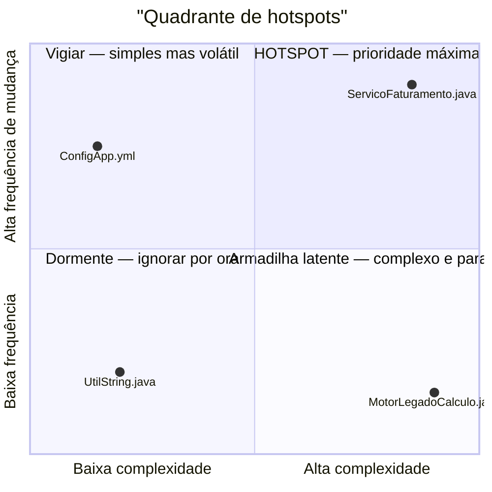
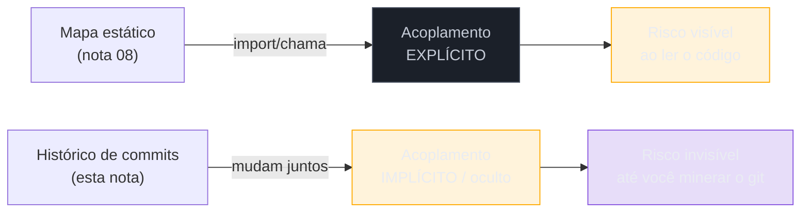

# Forense de software

> [!abstract] TL;DR
> Um sistema de 500 mil linhas não pode ser modernizado inteiro — você tem dias, não anos, para dizer ao cliente **onde** intervir primeiro. Nem complexidade sozinha, nem frequência de mudança sozinha respondem isso: código complexo que ninguém toca não é urgente, código simples que muda toda semana também não. O cruzamento das duas — **hotspots**, o método de Adam Tornhill (*Your Code as a Crime Scene*, 2ª ed. 2024) — é o alvo. O histórico ([[07 - Arqueologia do histórico|nota 07]]) também revela **acoplamento temporal**: arquivos que mudam *juntos* nos commits sem nenhuma dependência estática entre eles, o ponto cego do mapa da [[08 - Engenharia reversa e recuperação de arquitetura|nota 08]]. E o `git log` tem um terceiro sinal: quem mexeu em cada módulo — o **bus factor**, o risco de conhecimento concentrado numa única cabeça. Juntos, os três transformam o "faro" qualitativo em um **mapa de calor de risco** que você mostra ao cliente em vez de opinar.
>
> [!info] O instrumento, a fundo
> Aqui está o **método** de priorização e a conversa com o cliente. Os **comandos** que produzem esses números — hotspots, acoplamento temporal e autoria a partir do `git log` puro, as ferramentas (code-maat, git-of-theseus) e, principalmente, **o que esses dados não dizem** — estão em [[03-Dominios/Tecnologia/Controle de Versão/N6 - O repositório como testemunha/33 - Forense de repositório|Controle de Versão 33 — Forense de repositório]].

Você está na segunda semana de uma due diligence. O CTO do fundo comprador te pergunta: "onde você recomendaria a gente investir os primeiros três meses de refatoração?" Você já tem o mapa estático da [[08 - Engenharia reversa e recuperação de arquitetura|nota 08]] — sabe que há um núcleo cíclico, sabe onde a arquitetura foi erodida. Mas isso responde *onde a estrutura está ruim*, não *onde ela está doendo agora*. Um módulo pode ser uma bagunça arquitetural perfeita e não ser tocado há três anos — zero risco prático. Outro pode ter uma estrutura decente e ainda assim ser reescrito a cada sprint, sangrando incidentes. Sem dados, você responderia com a intuição de quem passou duas semanas lendo código — um palpite educado. Com forense de software, você responde com um gráfico gerado em minutos a partir do `git log`, e o CTO não precisa confiar na sua opinião: ele vê o mapa de calor com os próprios olhos.

## O problema: complexidade e frequência, sozinhas, mentem

A intuição mais comum é olhar para a complexidade do código — ciclomática, aninhamento, tamanho de função — e concluir que o arquivo mais complexo é o mais arriscado. Errado com frequência suficiente para ser perigoso: existem sistemas legados cheios de módulos monstruosos e complicadíssimos que **funcionam e ninguém precisa tocar**. Refatorá-los primeiro é desperdiçar orçamento num risco adormecido. A intuição oposta — olhar só a frequência de mudança, "esse arquivo aparece em todo commit, deve ser importante" — também falha: um arquivo de configuração simples pode mudar toda semana sem nunca causar um incidente, porque é trivial de entender e alterar.

O erro em ambos os casos é medir uma dimensão só. O risco real mora na **interação** das duas: um módulo complexo *e* frequentemente modificado é onde cada mudança tem alta chance de erro (porque é difícil de entender) *e* alta frequência de oportunidade para esse erro acontecer (porque é mexido o tempo todo). É a mesma lógica de qualquer análise de risco atuarial — probabilidade × impacto — só que aplicada a arquivos em vez de sinistros.

> [!question]- Por que não simplesmente medir "linhas de código mudadas por commit" e pronto?
> Porque isso mede só *volume* de mudança, não *risco*. Um arquivo gigante e estável que recebe um commit trivial de formatação a cada trimestre teria volume alto e risco zero. O que Tornhill mede é **frequência de revisões** (quantos commits distintos tocaram o arquivo — não quantas linhas) contra a complexidade estrutural do próprio arquivo. É a repetição de intervenções num terreno difícil que aumenta a chance de erro, não o tamanho do diff isolado.

**O problema em uma frase:** nem complexidade nem frequência de mudança, isoladas, apontam risco real — só o cruzamento das duas, sustentado por dados do histórico, separa o "feio mas inofensivo" do "pequeno incêndio que ninguém está vendo".

## Hotspots: o cruzamento que localiza o risco

Adam Tornhill batizou esse cruzamento de **hotspot** em *Your Code as a Crime Scene* (2015, 2ª edição
2024) e depois o aprofundou em *Software Design X-Rays* (2018) — o mesmo livro que a [[08 - Engenharia reversa e recuperação de arquitetura|nota 08]] cita para dependências em escala. O procedimento é reproduzível com dados que você já tem: o repositório git.

O quadrante superior direito — alta complexidade *e* alta frequência — é o **hotspot**: o lugar onde cada mudança é uma aposta com dados ruins. É ali que sua equipe deveria gastar o orçamento de refatoração primeiro, não no módulo "mais feio" que ninguém abre.

- **Alta complexidade, alta frequência (hotspot):** prioridade máxima. Cada mudança nesse arquivo tem alto risco de bug, e há muitas mudanças. É onde incidentes se originam com mais frequência.
- **Baixa complexidade, alta frequência:** vigiar. Muda muito, mas é fácil de mexer — risco moderado, às vezes sinal de um design correto (mudança concentrada num lugar simples é bom).
- **Alta complexidade, baixa frequência:** a armadilha que a intuição erra ao priorizar. É feio, mas dorme. Só vira urgente se você já sabe que vai mexer nele em breve (ex.: é o próximo passo de uma migração).
- **Baixa complexidade, baixa frequência:** dormente. Ignore com segurança.

### A complexidade barata: whitespace complexity

A parte contraintuitiva do método de Tornhill é que ele **evita** métricas caras de complexidade (complexidade ciclomática exige parser específico por linguagem, é lenta de calcular num repositório gigante e poliglota). Em vez disso, usa um proxy quase ridiculamente simples: a **indentação** do código-fonte, linha a linha — a chamada *whitespace complexity*. A intuição é sólida: código aninhado fundo (`if` dentro de `for` dentro de `if` dentro de `try`) tende a ser estruturalmente mais complexo que código plano, e a indentação captura isso sem entender uma única palavra-reservada da linguagem.

O ganho prático é enorme: o mesmo script funciona em Java, Python, COBOL ou JavaScript sem configuração por linguagem — essencial num sistema legado poliglota, onde parsers dedicados para cada tecnologia antiga seriam um projeto à parte. Não é uma métrica acadêmica perfeita; é uma métrica **barata o suficiente para rodar em todo o repositório hoje** — e correlaciona surpreendentemente bem com complexidade percebida por desenvolvedores.

**Hotspots em uma frase:** frequência de mudança (do `git log`) cruzada com complexidade barata (indentação) aponta, em minutos, os poucos arquivos onde o próximo incidente tem mais chance de nascer.

## Acoplamento temporal: o que o mapa estático não vê

A [[08 - Engenharia reversa e recuperação de arquitetura|nota 08]] te deu o grafo de dependências — quem *importa* quem, extraído do código. Mas existe uma classe inteira de acoplamento que a análise estática é cega para enxergar: dois arquivos sem nenhuma linha de import entre si, que ainda assim **mudam juntos**, commit após commit, porque compartilham uma regra de negócio implícita, uma convenção, ou uma dependência via configuração/reflexão que nenhum parser capta.

Tornhill chama isso de **change coupling** (ou *logical coupling*, *temporal coupling*): a evidência não está na sintaxe, está na **história**. Se `PedidoService.java` e `EmailTemplate.html` aparecem juntos em 80% dos commits nos últimos dois anos, existe um acoplamento real ali — provavelmente "toda vez que muda a regra do pedido, alguém esquece de atualizar o e-mail e depois corrige num commit separado". O grafo estático nunca mostraria essa seta; só o histórico mostra.

O uso mais valioso do acoplamento temporal é **validar (ou refutar) o mapa estático da nota 08**: quando dois módulos que o reflexion model classificou como "independentes" aparecem no topo do ranking de change coupling, você achou exatamente o tipo de acoplamento dinâmico que a análise estática nunca enxergaria — reflection, injeção de dependência, eventos, configuração compartilhada. É o gancho que a própria nota 08 já antecipa na sua terceira armadilha: "cruze o mapa estático com... o acoplamento temporal do histórico".

> [!question]- Acoplamento temporal não pode ser só coincidência — dois arquivos que mudam juntos por acaso?
> Pode, em amostras pequenas. Por isso a análise usa um limiar mínimo de revisões compartilhadas (ex.: só considerar pares com 5+ commits em comum) e reporta a **força** do acoplamento como percentual (em quantos dos commits de A, B também mudou). Um par com 2 commits compartilhados em 200 revisões totais é ruído; um par com 40 de 50 é sinal quase certo de uma dependência real e não documentada.

**Acoplamento temporal em uma frase:** o histórico revela dependências que nenhum import declara — e é o único jeito de flagrar acoplamento dinâmico que a engenharia reversa estática não alcança.

## Bus factor: o risco que mora nas pessoas

O terceiro sinal que o `git log` esconde é sobre **quem** — não *o quê* muda, mas quem sabe mexer naquilo. Para cada módulo, o histórico de autoria revela a concentração de conhecimento: se 95% dos commits de `MotorLegadoCalculo.java` nos últimos três anos vieram de uma única pessoa, você tem um **bus factor de 1** naquele módulo — a metáfora sombria de "quantas pessoas precisam ser atropeladas por um ônibus até o conhecimento sumir". Esse é o risco organizacional que a [[03 - A lente do consultor|lente do consultor]] pede que você levante logo na due diligence: não é só código frágil, é conhecimento tribal preso numa cabeça só.

O cruzamento perigoso — e é aqui que a forense fecha o círculo com os hotspots — é **hotspot com bus factor baixo**: o módulo mais arriscado do sistema, mudado com frequência, complexo, e que só uma pessoa entende de verdade. Se essa pessoa sai, o sistema perde simultaneamente a capacidade de manter *e* de entender seu ponto mais crítico. Priorizar pair programming, documentação (a [[24 - Conhecimento e documentação|nota 24]] adiante) ou rotação de responsabilidade nesse módulo específico vale mais que em qualquer outro do sistema.

**Bus factor em uma frase:** o `git log` também mede pessoas, não só código — e o hotspot com dono único é o ponto onde o risco técnico e o risco organizacional se somam.

## A ferramenta-âncora: CodeScene

Tornhill não só descreveu o método, fundou uma empresa em cima dele: **CodeScene**, que roda hotspots, acoplamento temporal e mapas de conhecimento automaticamente sobre qualquer repositório git, com visualizações prontas para mostrar a um cliente não-técnico (o mesmo mapa de calor citado no TL;DR). É a ferramenta comercial de referência, e o motivo de citá-la aqui é honestidade sobre o estado da arte — não é obrigatório usá-la para aplicar o método.

Para quem quer rodar isso sem custo, o próprio Tornhill mantém **code-maat**, uma ferramenta de linha de comando (Clojure) que faz a mineração de `git log` e calcula hotspots, sum-of-coupling e logical coupling a partir de logs exportados. Outras opções open-source na mesma família:

| Ferramenta | O que faz | Custo |
|---|---|---|
| **CodeScene** | Hotspots, change coupling, mapas de conhecimento, com dashboards prontos | Comercial (free tier para open source) |
| **code-maat** (Tornhill) | CLI que mina `git log` exportado; hotspots, sum-of-coupling, logical coupling | Gratuito, open-source |
| **git-of-theseus** | Visualiza a evolução do código ao longo do tempo (linhas por autor/idade) | Gratuito, open-source |
| `git log --format=... \| script próprio` | Frequência de mudança e pares co-modificados, feito na mão | Gratuito, esforço manual |

Na prática, mesmo sem nenhuma ferramenta, um script de trinta linhas contando `git log --name-only` por arquivo já produz o ranking de frequência — o que falta é só cruzar com a métrica de complexidade e, se quiser change coupling, contar pares de arquivos que aparecem no mesmo commit. O método é mais importante que a ferramenta.

> [!tip] Assista: Guide Refactorings With Behavioral Code Analysis
> **Canal:** Domain-Driven Design Europe | **Duração:** ~48min | **Idioma:** EN
>
> O próprio Tornhill demonstra o método ao vivo sobre o código-fonte do Android (3 milhões de linhas, 2000+ autores) — mostra a visualização de hotspots como *circle packing* e, na segunda metade, caminha por um caso real de change coupling. É o complemento hands-on que esta nota descreve em texto: aqui você vê o mapa de calor sendo construído passo a passo. Trecho de destaque [8:27]: *"complexity is only a problem when we need to deal with it (...) when we combine these two [complexity and change frequency] we're capable of identifying complicated code that we have to work with often — and those are our hotspots."*
>
> 🎬 [Assistir no YouTube](https://www.youtube.com/watch?v=okT9xZc6UtY)

## Casos práticos

### Cenário 1: due diligence — o mapa de calor que virou o orçamento

No mesmo engajamento de due diligence da [[08 - Engenharia reversa e recuperação de arquitetura|nota 08]] (o núcleo cíclico de 40% das classes), o fundo quer saber não só *se* dá para modernizar, mas *quanto vai custar* e *por onde começar*. Você roda uma análise de hotspots sobre os últimos dois anos de commits. O resultado: dos 1.200 arquivos do sistema, apenas 14 caem no quadrante hotspot — e três deles estão *dentro* do núcleo cíclico que a nota 08 identificou estruturalmente. Você cruza os dois mapas (estrutura + intensidade) e entrega ao fundo uma lista de 14 arquivos, não 1.200, como escopo do primeiro trimestre. O orçamento que parecia "modernizar tudo" vira um plano concreto, defensável com dados, de três meses focados. O CTO aprova o investimento porque o número não é uma opinião sua — é um gráfico gerado do próprio histórico do cliente.

### Cenário 2: resgate — o acoplamento temporal que confirmou o bus factor

Um cliente em modo resgate tem incidentes recorrentes num módulo de conciliação financeira, e o único desenvolvedor que "entende aquilo" está de licença médica. Você roda change coupling e descobre que `ConciliacaoService.java` está fortemente acoplado (72% dos commits em comum) a um script de migração de dados esquecido numa pasta `scripts/legacy/`, sem nenhuma referência estática entre eles — ninguém sabia que os dois precisavam mudar juntos. Ao rodar o mapa de autoria, os dois arquivos têm o mesmo autor único nos últimos três anos: confirma que o bus factor 1 não era boato, e explica por que os incidentes começaram justo quando essa pessoa saiu. Você entrega ao cliente uma recomendação dupla: documentar o acoplamento oculto entre os dois arquivos (um ADR de emergência) e priorizar pareamento imediato para transferir esse conhecimento antes que se perca de vez.

## Armadilhas comuns

> [!warning] Priorizar pela complexidade sozinha
> **O que acontece:** você ordena os arquivos por complexidade ciclomática ou tamanho e ataca o "pior" primeiro — que acaba sendo um módulo estável, tocado uma vez por ano. **Por quê:** complexidade mede dificuldade potencial, não risco realizado. Sem frequência de mudança, você não sabe se aquela dificuldade é exercitada de fato. **Como evitar:** sempre cruze complexidade com frequência de revisões do `git log`; só o quadrante hotspot (alto nos dois eixos) justifica prioridade imediata.

> [!warning] Tratar acoplamento temporal como causalidade
> **O que acontece:** você vê dois arquivos com alta força de acoplamento e conclui que um *causa* mudanças no outro, sem investigar — e propõe uma refatoração baseada numa suposição errada. **Por quê:** change coupling é correlação extraída de commits, não uma prova de dependência lógica real; pode ser coincidência de dois times que sempre entregam junto, não uma relação de código. **Como evitar:** trate o acoplamento temporal como um **alvo de investigação**, não como conclusão — vá ler o diff dos commits compartilhados para confirmar a razão antes de agir sobre ela.

> [!warning] Medir hotspots numa janela de tempo longa demais (ou curta demais)
> **O que acontece:** você roda a análise sobre os 10 anos inteiros de histórico e o resultado aponta módulos que foram intensamente desenvolvidos na fundação do sistema, mas estão estáveis há anos — um falso hotspot. Ou roda sobre só o último mês e captura ruído de uma sprint isolada. **Por quê:** hotspots descrevem risco *atual*; janelas longas demais diluem sinal recente sob volume histórico, janelas curtas demais capturam anomalias pontuais. **Como evitar:** use uma janela de 6 a 24 meses como padrão, e valide cruzando com o conhecimento de quem está no time hoje — "isso ainda dói?" é a pergunta de calibração final.

## Como explicar em inglês

Quando te perguntarem, em entrevista, como você prioriza onde investir esforço de refatoração num sistema legado grande:

> "I don't rank files by complexity alone, because a complex file nobody touches isn't urgent. I mine the git history and cross two signals: **change frequency** — how often a file gets revised — against a cheap complexity proxy, usually indentation-based **whitespace complexity**, because it works across any language without a dedicated parser. The intersection is what Adam Tornhill calls a **hotspot**: code that's both complex and frequently changed, which is where defects statistically cluster. I also mine **change coupling** — files that consistently change together in the same commits even with zero static dependency between them — because that's the hidden coupling that static analysis alone can never see. And I check the **bus factor** per module: if a hotspot has a single dominant author, that's both a technical and an organizational risk stacked on the same file. Together, these three signals let me hand a client a data-backed heat map instead of an opinion about where to start."

| PT | EN |
|----|----|
| forense de software | software forensics |
| hotspot | hotspot |
| complexidade de código | code complexity |
| whitespace complexity | whitespace complexity |
| frequência de mudança / revisões | change / revision frequency |
| acoplamento temporal / lógico | temporal / logical / change coupling |
| mapa de calor de risco | risk heat map |
| bus factor | bus factor |
| mapa de conhecimento | knowledge map |
| mineração de repositório | repository mining |

## O que vem a seguir

Você agora sabe **onde** intervir primeiro — hotspots, acoplamento oculto, bus factor — não só *como* o sistema está desenhado. Mas conhecer o alvo não é o mesmo que conseguir mexer nele com segurança: um hotspot, quase por definição, é um lugar sem testes confiáveis (é código legado sob pressão constante). Antes de tocar nesses arquivos priorizados, você precisa de uma rede de segurança que capture o comportamento atual — para que sua mudança não vire mais um commit no ranking de incidentes.

- [[10 - A rede de segurança primeiro]] — characterization tests: como colocar os hotspots que você acabou de encontrar sob proteção antes de mexer.
- [[12 - Seams e quebra de dependência]] — onde exatamente cortar as dependências dentro do hotspot priorizado, usando o mapa estático (nota 08) e o cruzamento temporal (esta nota) juntos.
- [[08 - Engenharia reversa e recuperação de arquitetura]] — o mapa estático que a forense valida e complementa com a dimensão do tempo.
- [[24 - Conhecimento e documentação]] — o antídoto de longo prazo para o bus factor que a forense expõe.

## Fontes

- **Adam Tornhill** — [*Your Code as a Crime Scene, 2nd Edition*](https://pragprog.com/titles/atcrime2/your-code-as-a-crime-scene-second-edition/) (Pragmatic Bookshelf, 2024) — o método completo: hotspots, whitespace complexity, change coupling, mapas de conhecimento e bus factor, com técnicas de investigação forense aplicadas ao histórico de versionamento.
- **Adam Tornhill** — *Software Design X-Rays: Fix Technical Debt with Behavioral Code Analysis* (Pragmatic Bookshelf, 2018) — aprofunda hotspots e acoplamento em sistemas grandes; citado também na [[08 - Engenharia reversa e recuperação de arquitetura|nota 08]].
- **Adam Tornhill** — [code-maat](https://github.com/adamtornhill/code-maat) (GitHub) — a ferramenta open-source de linha de comando que implementa a mineração de hotspots, sum-of-coupling e logical coupling a partir de logs de `git`.
- **CodeScene** — [codescene.com](https://codescene.com/) — a ferramenta comercial fundada por Tornhill que automatiza hotspots, change coupling e mapas de conhecimento com dashboards prontos para due diligence.
- **Erik Bern** — [git-of-theseus](https://github.com/erikbern/git-of-theseus) (GitHub) — ferramenta open-source para visualizar a evolução do código por autor e idade ao longo do histórico do repositório.

## Veja também

- [[03-Dominios/Engenharia/Arqueologia e Restauração de Software/index|Arqueologia e Restauração de Software (MOC)]]
- [[03-Dominios/Engenharia/Arqueologia e Restauração de Software/08 - Engenharia reversa e recuperação de arquitetura|Engenharia reversa e recuperação de arquitetura]] — o mapa estático que a forense valida com a dimensão do tempo
- [[03-Dominios/Engenharia/Arqueologia e Restauração de Software/07 - Arqueologia do histórico|Arqueologia do histórico]] — as ferramentas `git` cruas que a forense agrega em análise quantitativa
- [[03-Dominios/Engenharia/Complexidade de Software/index|Complexidade de Software]] — a teoria de complexidade e entropia que os hotspots tornam mensurável em escala
