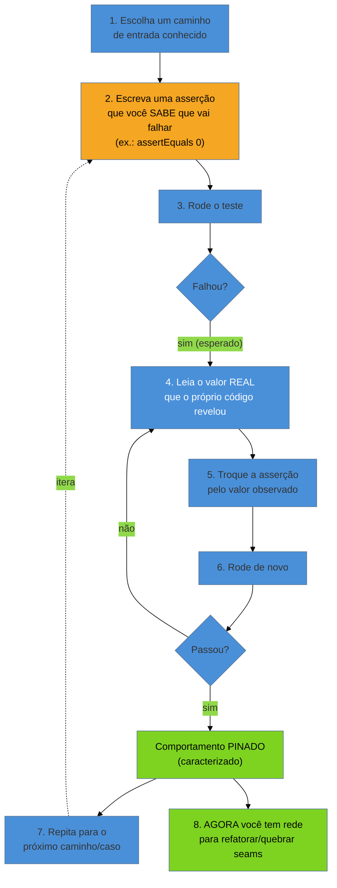

# A rede de segurança primeiro

> [!abstract] TL;DR
> Você tem o mapa ([[08 - Engenharia reversa e recuperação de arquitetura|nota 08]]) e sabe onde dói
> ([[09 - Forense de software|nota 09]]). Chegou a hora de mudar o código — e é aí que bate o paradoxo
> do legado: **Michael Feathers** define código legado como *código sem testes*, mas você não pode
> escrever um teste de verdade sem antes mudar o código para torná-lo testável, e não pode mudar o
> código com segurança sem um teste. Galinha e ovo. A saída é o **characterization test** (teste de
> caracterização): um teste que não verifica o comportamento *correto* — verifica o comportamento
> **atual**, seja ele certo ou errado. Você não sabe o que o código *deveria* fazer; sabe o que ele
> *faz*. A técnica de Feathers para escrevê-lo é quase absurda de simples: escreva uma asserção que
> você **sabe** que vai falhar, rode o teste, deixe o próprio código te dizer o valor real, e substitua
> a asserção por ele. O teste passa a **pinar** (*pin*) aquele comportamento — qualquer mudança futura
> que o altere vai acusar. Esta é a nota-pivô do galho: fecha a fase de *entender* (Iniciado + 08-09) e
> abre a fase de *mudar com segurança* — nada em 12-16 acontece sem a rede primeiro.

Você acabou de rodar o reflexion model ([[08 - Engenharia reversa e recuperação de arquitetura|nota 08]]) e a forense de Tornhill ([[09 - Forense de software|nota 09]]). Sabe exatamente qual classe é o
hotspot: `CalculadoraDeComissao`, 800 linhas, mudou em 60% dos últimos commits, e é a que mais gera
incidente. O cliente quer que você conserte um bug ali — um valor de comissão levemente errado para
vendedores com meta parcial. Você abre o arquivo. Zero testes. Zero. Você pensa: "fácil, eu vejo o erro,
troco duas linhas". Troca. Faz o deploy. Duas horas depois, o time de RH liga: as comissões de *todo
mundo* vieram erradas neste mês, não só dos vendedores com meta parcial. Sua "correção" mexeu num
caminho que você nem sabia que existia, porque ninguém — nem você, nem o código, nem um teste — te
avisou que aquele método era compartilhado por três fluxos diferentes.

Isso não foi azar. Foi a ausência exata do que esta nota resolve.

## O paradoxo galinha-e-ovo do legado

**Michael Feathers**, em *Working Effectively with Legacy Code* (2004), propõe uma definição
provocadora que já apareceu na [[01 - O que é código legado|nota 01]]: código legado é, simplesmente,
**código sem testes**. Não é sobre idade, nem sobre a linguagem, nem sobre quão feio ele é — é sobre a
ausência de uma rede que te avisa quando você quebra algo. E daí vem o paradoxo: para mudar código com
segurança, Feathers argumenta, você precisa de testes automatizados que confirmem que seu comportamento
não regrediu. Mas para *escrever* um teste automatizado de verdade, muitas vezes você precisa antes
**alterar o código** — isolar uma classe, quebrar uma dependência dura, extrair uma interface (o
território das [[12 - Seams e quebra de dependência|seams]], nota 12). E para alterar o código com
segurança... você precisa de um teste. É um círculo fechado, e é exatamente por isso que tanto código
legado nunca ganha rede: a barreira de entrada parece infinita.

> [!question]- Se eu não posso testar sem mudar, e não posso mudar sem testar, como alguém quebra esse ciclo?
> Rompendo a exigência mais forte primeiro. Você não precisa, de saída, do teste *ideal* — desacoplado,
> rápido, isolado, testando uma unidade pura. Precisa de **qualquer** teste automatizado que rode contra
> o comportamento real, mesmo que seja lento, mesmo que toque banco de dados, mesmo que cubra uma classe
> inteira em vez de um método. Esse teste "ruim" — chamado às vezes de teste de integração grosso — é o
> suficiente para lhe dar coragem de fazer a *primeira* mudança segura: normalmente, uma quebra de
> dependência mínima que finalmente permite escrever testes melhores. A rede de caracterização não
> precisa ser bonita. Precisa existir.

**O paradoxo em uma frase:** você não pode testar sem mudar, nem mudar sem testar — e a saída não é
resolver o círculo, é entrar nele pelo ponto mais barato: um teste feio que caracteriza o que já existe.

## A virada mental: caracterizar, não especificar

Aqui está o ponto que separa quem trabalha bem com legado de quem trava: um **characterization test**
não pergunta "o código está certo?". Pergunta "o que o código *faz*, agora, hoje?" — e trava essa
resposta num teste. É uma inversão completa do que se ensina em TDD clássico, onde você escreve o teste
*antes* do código, descrevendo o comportamento *desejado*. Aqui, o código já existe, ninguém sabe mais
qual era o comportamento desejado, e a única fonte de verdade disponível é o próprio comportamento
observado — certo ou errado.

Pense assim: um agrimensor que chega numa propriedade sem escritura não inventa onde ficam os limites —
ele **mede** o terreno como está e registra a medição. Só depois, com o mapa em mãos, alguém discute se
aquele limite está certo ou deveria mudar. O characterization test é o agrimensor do seu sistema: ele
mede o comportamento existente e o registra, sem opinar se está certo.

Isso tem uma consequência desconfortável e libertadora ao mesmo tempo: **se o código tem um bug, o
characterization test vai caracterizar o bug**. E é isso mesmo que você quer, nesta etapa. O bug vira
parte do comportamento documentado — um contrato explícito, ainda que errado — em vez de continuar
escondido. Você não está *aceitando* o bug para sempre; está tornando-o **visível e nomeado**, para que
a decisão de corrigi-lo seja deliberada (um commit separado, com o teste atualizado de propósito) e não
um acidente que você causa sem perceber ao tocar em código adjacente.

> [!question]- Isso não trava o bug no lugar para sempre? Não é o oposto de "consertar"?
> Não — é o oposto de **consertar por acidente**. Sem a rede, toda mudança tem duas saídas possíveis
> misturadas: você pode corrigir o bug que queria corrigir, ou pode quebrar um comportamento correto em
> algum lugar que você nem sabia que existia — como aconteceu na abertura desta nota. Com a rede, essas
> duas coisas se separam: o characterization test te avisa **imediatamente** se você mudou *qualquer*
> comportamento, correto ou não. Se a mudança era deliberada (corrigir o bug X), você atualiza a
> asserção correspondente e segue — o teste passa a caracterizar o comportamento *novo* e correto. Se a
> mudança foi um efeito colateral não intencional em outro lugar, o teste quebra e te avisa antes do
> deploy. A rede não impede consertar bugs; impede consertar bugs **sem querer**, escondidos dentro de
> uma mudança que você achava que era outra coisa.

**A virada em uma frase:** você não sabe o que o código *deveria* fazer, mas sabe o que ele *faz* — e é
isso, só isso, que o characterization test tem a obrigação de proteger.

## A técnica: deixe o código confessar o próprio comportamento

Feathers descreve um procedimento quase mecânico para escrever o primeiro characterization test de um
método que você não entende — e a graça dele é não exigir que você entenda o método *antes*:



O passo que mais surpreende quem vê isso pela primeira vez é o 2: você escreve uma asserção
**deliberadamente errada** — `assertEquals(0, resultado)` quando você não faz ideia se o resultado é 0.
Você não está adivinhando o valor certo; está usando o próprio *test runner* como instrumento de
medição. O teste falha, e a mensagem de falha ("esperado 0, mas foi 847.32") te entrega o valor real que
o código produz *agora*, para *aquela* entrada. Você copia esse valor para a asserção, roda de novo, o
teste passa — e a partir desse instante, aquele valor está pinado: se algum dia o código passar a
devolver outra coisa para a mesma entrada, o teste vai gritar.

> [!tip] Assista: Working Effectively with Legacy Code and AI Coding Assistant
> **Canal:** Michael Feathers | **Duração:** ~56min | **Idioma:** EN
>
> É o próprio Michael Feathers, criador do termo, explicando characterization test com as mesmas
> palavras que esta nota usa: escrever o teste *depois* do código (não antes, como em TDD), fazer
> uma pergunta ao sistema, e usar a resposta como expectativa — o que ele também chama de *pinning
> test* ou *golden master testing*. Vale como confirmação direta da fonte, sem intermediários.
> Trecho de destaque [7:58]: *"One of the things I talk about in the book, something I call
> characterization tests. [...] you write tests that you use to describe the current behavior of
> the system. So you're not writing them first, you're writing them after the code has been
> written. [...] once you get the answer, you basically take that answer and you put it in as the
> expectation. And sometimes this is called golden mastery testing in a way."*
>
> 🎬 [Assistir no YouTube](https://www.youtube.com/watch?v=mwVRHDD0tEk)

### Exemplo — caracterizando um comportamento contra-intuitivo

Voltando ao cenário da abertura: `CalculadoraDeComissao.calcular()`, sem testes, com um bug suspeito no
arredondamento para vendedores com meta parcial. Antes de tocar em qualquer linha, você caracteriza o
que existe:

```java
// Passo 1-2: você sabe que o método é chamado com meta parcial (60%) e valor 1000.
// Você NÃO sabe o resultado correto — então chuta uma asserção que sabe estar errada,
// só para forçar o teste a revelar o valor real.
@Test
void caracterizarComissaoComMetaParcial() {
    CalculadoraDeComissao calc = new CalculadoraDeComissao();
    BigDecimal resultado = calc.calcular(valorVenda: new BigDecimal("1000.00"), percentualMeta: 0.60);

    // Asserção propositalmente errada — só para o test runner nos entregar o valor real.
    assertEquals(new BigDecimal("0.00"), resultado);
}

// Passo 3: roda. Falha assim:
//   Expected :0.00
//   Actual   :62.40
//
// Passo 4-5: o código acabou de confessar o próprio comportamento. Você não precisou
// ler as 800 linhas para saber o QUE ele faz com essa entrada — ele te disse.
// Trocamos a asserção pelo valor real observado:

@Test
void caracterizarComissaoComMetaParcial() {
    CalculadoraDeComissao calc = new CalculadoraDeComissao();
    BigDecimal resultado = calc.calcular(valorVenda: new BigDecimal("1000.00"), percentualMeta: 0.60);

    // 62.40 não é o valor "certo" — é o valor ATUAL. Pode até ser o bug que você veio
    // corrigir! Mas agora ele está documentado como contrato, não escondido.
    assertEquals(new BigDecimal("62.40"), resultado);
}

// Passo 7: repita para meta 100%, meta 0%, valor negativo, valor nulo — cada caminho
// vira uma asserção pinada. SÓ DEPOIS de ter essa rede cobrindo os caminhos relevantes
// você troca o arredondamento — e se o valor esperado mudar de propósito (ex.: de
// 62.40 para 62.50, corrigindo o bug de verdade), você atualiza AQUELA asserção
// especificamente, com plena consciência do que está mudando — não por acidente.
```

Repare no que aconteceu: o teste caracterizou `62.40` sem que você soubesse se esse é o valor "certo".
Se depois de investigar você descobrir que o correto seria `62.50`, ótimo — agora você tem uma rede que
te avisa se corrigir isso quebra *outro* caminho, e o commit da correção muda exatamente uma asserção,
de forma deliberada e revisável. É a diferença entre a tragédia da abertura (bug consertado, RH inteiro
quebrado, sem aviso) e uma correção cirúrgica com rastro.

## Rede pequena vs. rede grande: onde esta nota para

Caracterizar "à mão", asserção por asserção, funciona bem quando a saída do método é **pequena e
legível** — um número, uma string, um objeto com poucos campos, como no exemplo acima. Mas e quando o
método monta um relatório de 40 campos, ou gera um XML de 2000 linhas, ou renderiza uma página inteira?
Escrever `assertEquals` campo a campo vira uma segunda fonte de bugs — e ninguém revisa 40 asserções.

- **Saída pequena e legível → caracterize à mão** (esta nota): a técnica da asserção-que-falha, direto.
- **Saída grande/opaca (relatório, XML, HTML, blob) → approval testing / golden master**
  ([[11 - Approval e Golden Master testing|nota 11]]): você tira uma "foto" (*snapshot*) da saída
  inteira, um humano aprova essa foto uma vez, e o teste passa a comparar execuções futuras contra o
  aprovado. É a mesma ideia — caracterizar o atual, não o correto — só que mecanizada para escala.

Esta nota não invade esse território: ela é o **conceito e o método manual**; a nota 11 é o
**ferramental** para quando a mão não dá conta.

## Por que "a rede primeiro" é uma ordem, não uma sugestão

O nome do galho aqui na fase Adepto entrega o recado: **primeiro** a rede, **depois** qualquer coisa que
mexa na estrutura — refactoring ([[14 - Refactoring em terreno hostil|nota 14]]), técnicas cirúrgicas
([[13 - Técnicas cirúrgicas|nota 13]]), o Método Mikado ([[15 - O Método Mikado|nota 15]]), até deixar
uma IA tocar no código ([[16 - IA como acelerador e seus riscos|nota 16]]). Não é dogma — é sequência
causal: sem um teste que pina o comportamento atual, você não tem como distinguir "eu mudei o que
pretendia mudar" de "eu quebrei algo que não sabia que existia". A rede é o que transforma uma mudança
em legado de um salto no escuro para um experimento controlado.

Há uma tensão que vale nomear desde já, mesmo que o desenvolvimento fique para a próxima nota: às vezes
você **não consegue nem instanciar** a classe para escrever o primeiro teste — um construtor que abre
conexão de banco, uma dependência estática global, um `new` escondido no meio do método. Nesse caso, a
testabilidade e a quebra de dependência (as *seams*, [[12 - Seams e quebra de dependência|nota 12]])
andam entrelaçadas com a caracterização: às vezes você quebra uma dependência mínima só para conseguir
rodar o teste feio o suficiente para começar. Essa cirurgia — o quê, quando e como quebrar — é o
conteúdo inteiro da nota 12; aqui, só marque o ponto no mapa.

## Casos práticos

### Cenário 1: due diligence — caracterizar antes de opinar sobre qualidade

Um fundo te contrata para avaliar, em dez dias, se vale a pena adquirir uma fintech cujo motor de
antifraude ninguém documenta. Você não tem tempo de reescrever nada, só de opinar sobre risco. Em vez
de ler as 4 mil linhas do motor, você escolhe os cinco cenários de transação mais comuns (nos logs de
produção) e escreve characterization tests para cada um: chama o motor com a transação real, deixa a
asserção-que-falha revelar o veredito atual (aprovado/negado/score), e trava isso. Ao final, você não
tem um relatório de "o código é bom ou ruim" — tem uma **rede reproduzível** que qualquer engenheiro do
comprador pode rodar no dia seguinte à aquisição, antes de tocar em qualquer linha. Você entrega, junto
do laudo, os testes: "aqui está o que o sistema faz hoje, provado, não inferido pela leitura".

### Cenário 2: resgate — caracterizar o bug antes de corrigir o incêndio

Um cliente liga em pânico: um cálculo de frete está devolvendo valores negativos para alguns CEPs, e
ninguém sabe por quê nem há quanto tempo isso acontece. Antes de tocar no código — mesmo sob pressão de
"resolve logo" — você escreve um characterization test com o CEP problemático, deixa o teste revelar o
valor negativo atual, e o trava. Só então você investiga a causa (um `if` sem `else` que deixa uma
variável não inicializada cair no cálculo). Ao corrigir, você atualiza *aquela* asserção específica para
o valor positivo esperado — e roda toda a suíte de characterization tests dos outros CEPs, que continuam
passando intactos. Sem a rede, a correção sob pressão do incêndio é o momento de maior risco de causar um
segundo incêndio; com ela, você prova, em segundos, que só mudou o que pretendia mudar.

## Armadilhas comuns

> [!warning] Achar que characterization test é "escrever teste ruim de propósito"
> **O que acontece:** o time trata characterization tests como desculpa para nunca escrever testes bons,
> deixando a suíte inteira travada em asserções feitas às pressas, sem nunca migrar para testes de
> unidade legíveis.
> **Por quê:** a técnica é um **degrau de entrada**, não um destino — ela resolve o paradoxo
> galinha-e-ovo te dando coragem para o primeiro corte; depois que a estrutura fica testável (via seams,
> [[12 - Seams e quebra de dependência|nota 12]]), o esperado é substituir os testes grossos por testes
> de unidade normais, guiados pelo restante do galho `Testes`.
> **Como evitar:** trate cada characterization test como temporário até prova em contrário; ao refatorar
> um trecho, pergunte se agora dá para escrever um teste melhor no lugar dele — e escreva.

> [!warning] Corrigir o bug e a asserção no mesmo commit, sem separar as intenções
> **O que acontece:** você percebe, ao caracterizar, que o valor `62.40` está errado (deveria ser
> `62.50`) — e já sai trocando o código e a asserção junto, misturado com outras mudanças no mesmo
> commit.
> **Por quê:** isso apaga o rastro que a rede existe para deixar: ninguém revisando o diff consegue
> distinguir "esta linha mudou porque o comportamento estava errado e foi corrigido de propósito" de
> "esta linha mudou como efeito colateral de outra coisa".
> **Como evitar:** primeiro caracterize o valor atual (mesmo sabendo que é o bug) num commit isolado.
> Depois, em commit separado e explícito, corrija o comportamento **e** a asserção junto, com mensagem
> do tipo "fix: corrige arredondamento de comissão com meta parcial (era 62.40, agora 62.50)".

> [!warning] Achar que caracterizar exige entender o código primeiro
> **O que acontece:** o engenheiro trava antes de começar, achando que precisa ler e entender as 800
> linhas do método antes de conseguir escrever qualquer teste — e nunca termina de ler.
> **Por quê:** é o próprio paradoxo galinha-e-ovo se manifestando na cabeça da pessoa: ela acha que
> precisa "saber" o comportamento para testá-lo, quando a técnica de Feathers inverte exatamente isso —
> o teste é o instrumento que *revela* o comportamento, não o registro de um conhecimento prévio.
> **Como evitar:** escreva a asserção errada de propósito e deixe o código responder. Você não precisa
> entender o método para caracterizar sua saída — só precisa saber como chamá-lo.

## Como explicar em inglês

Quando te perguntarem, em entrevista, como você começa a colocar testes num sistema legado que nunca
teve nenhum:

> "Legacy code, by Feathers' definition, is code without tests — and there's a chicken-and-egg problem:
> you need tests to change code safely, but you often need to change the code to make it testable. The
> way out is a **characterization test**. It doesn't verify what the code *should* do — it verifies what
> the code **actually does**, right now, bugs included. My technique is Feathers' trick: I write an
> assertion I *know* is wrong — `assertEquals(0, result)` — run it, and let the test failure tell me the
> real value. I swap the assertion for that observed value, and now the behavior is **pinned**: any
> future change that alters it will fail loudly. If there's a real bug in there, it gets documented as
> part of the characterized contract, and I fix it deliberately, in its own commit, updating that one
> assertion on purpose — not by accident while doing something else. This is always step one before any
> refactoring or dependency-breaking on legacy code."

| PT | EN |
|----|----|
| rede de segurança | safety net |
| teste de caracterização | characterization test |
| comportamento atual (vs. correto) | actual (vs. correct) behavior |
| pinar o comportamento | to pin down the behavior |
| paradoxo galinha-e-ovo | chicken-and-egg problem |
| asserção que sabe que vai falhar | assertion known to fail |
| contrato caracterizado | characterized contract |
| bug documentado (não corrigido) | documented (not fixed) bug |
| teste de integração grosso | coarse-grained integration test |

## O que vem a seguir

Você agora sabe caracterizar comportamento à mão, método a método — a rede mínima que te dá coragem
para tocar num sistema sem documentação. Duas frentes se abrem a partir daqui, e ambas assumem esta nota
como pré-requisito:

- [[11 - Approval e Golden Master testing]] — quando a saída é grande demais para caracterizar campo a
  campo, o mesmo princípio (atual, não correto) escala via *snapshots* aprovados.
- [[12 - Seams e quebra de dependência]] — quando você nem consegue instanciar a classe para rodar o
  primeiro teste, os pontos onde cortar dependência para destravar a testabilidade.
- [[13 - Técnicas cirúrgicas]] e [[14 - Refactoring em terreno hostil]] — o que você finalmente pode
  fazer com segurança, agora que a rede existe.
- [[09 - Forense de software]] — o hotspot que te disse *onde* aplicar a rede primeiro.

## Fontes

- **Michael Feathers** — *Working Effectively with Legacy Code* (2004) — a obra-fonte: a definição de
  legado como código sem testes, o paradoxo galinha-e-ovo, e o método passo a passo de characterization
  testing.
- **Michael Feathers** — [*Understanding Legacy Code with Characterization Testing*](https://www.infoq.com/news/2007/03/characterization-testing/) (InfoQ, 2007) — o artigo original de Feathers explicando a técnica fora do livro, com o passo a passo da asserção-que-falha.
- **Wikipedia** — [*Characterization test*](https://en.wikipedia.org/wiki/Characterization_test) — definição de referência e contexto histórico do termo.
- **understandlegacycode.com** — [*The key points of Working Effectively with Legacy Code*](https://understandlegacycode.com/blog/key-points-of-working-effectively-with-legacy-code/) — síntese acessível dos conceitos centrais do livro de Feathers, incluindo characterization tests e seams.

## Veja também

- [[03-Dominios/Engenharia/Arqueologia e Restauração de Software/index|Arqueologia e Restauração de Software (MOC)]]
- [[03-Dominios/Engenharia/Testes/index|Testes]] — a teoria geral de testes (pirâmide, TDD, mocking); aqui usamos só o subconjunto que serve de rede a código legado
- [[03-Dominios/Engenharia/Arqueologia e Restauração de Software/11 - Approval e Golden Master testing|Approval e Golden Master testing]] — o ferramental para caracterizar saídas grandes/opacas
- [[03-Dominios/Engenharia/Arqueologia e Restauração de Software/12 - Seams e quebra de dependência|Seams e quebra de dependência]] — como quebrar dependência quando nem dá para instanciar a classe
- [[03-Dominios/Engenharia/Arqueologia e Restauração de Software/09 - Forense de software|Forense de software]] — os hotspots que apontam onde aplicar a rede primeiro
