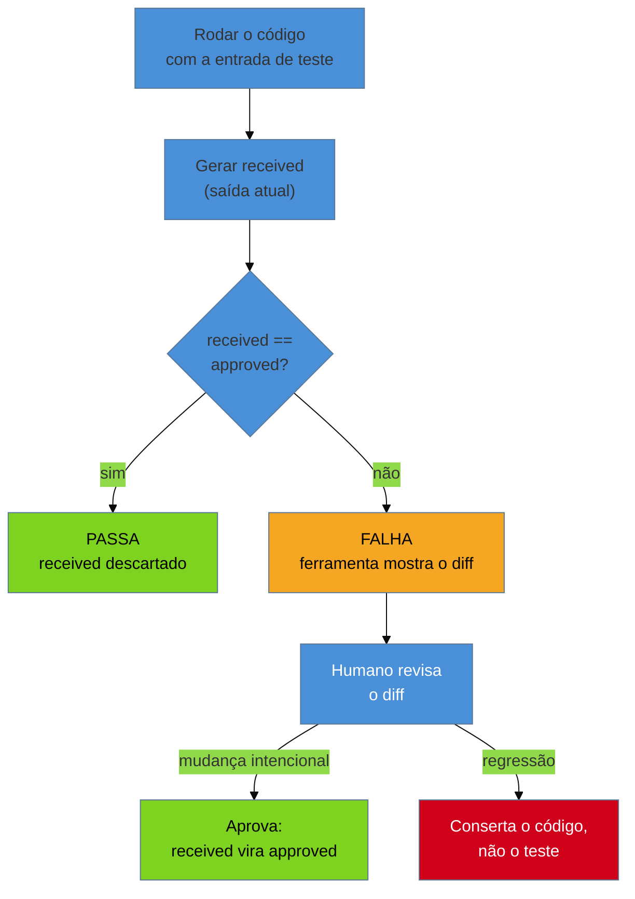

# Approval e Golden Master testing

> [!abstract] TL;DR
> A [[10 - A rede de segurança primeiro|nota 10]] te deu o conceito de *characterization test* — um teste que registra o comportamento **atual**, não o "correto" — e te mostrou como escrevê-lo à mão, método por método, quando a saída cabe numa asserção (`assertEquals(42, resultado)`). Mas e quando a saída é um HTML de 2 mil linhas, um relatório fiscal com 80 campos, ou um cálculo que ninguém consegue descrever em uma frase? Escrever essa asserção à mão é impraticável — e é exatamente aí que **Golden Master testing** e sua evolução ergonômica, o **approval testing**, entram: em vez de você descrever o resultado esperado, você **captura** a saída inteira como está hoje, congela-a como arquivo "aprovado", e todo teste futuro vira um `diff` entre o que o sistema produz agora (*received*) e o que você aprovou ontem (*approved*). Se bater, passa. Se não bater, você olha o diff e decide: mudança intencional (aprova de novo) ou regressão (conserta o código). É a alavanca que põe, em horas, uma rede de segurança sob um monstro de saída complexa que ninguém ousaria tocar.

Você herdou um módulo de emissão de nota fiscal: 1.100 linhas de Java, zero testes, produz um XML com 147 campos, cálculos de impostos por estado, arredondamentos específicos por regime tributário. O gerente quer que você mude uma regra de ICMS antes de sexta. A [[10 - A rede de segurança primeiro|nota 10]] te ensinou o caminho certo — caracterizar antes de tocar — mas quando você tenta escrever o characterization test à mão, trava: a asserção que "define" a saída correta teria 147 linhas de `assertEquals`, uma para cada campo do XML, e você levaria dois dias só pra transcrever o output atual em código. Isso não é rede de segurança, é reescrever o sistema em forma de teste. Precisa de outro jeito.

## O limite da nota 10: caracterização não escala à mão

A [[10 - A rede de segurança primeiro|nota 10]] resolveu o problema conceitual: um teste que grava o comportamento *como ele é hoje* (não como deveria ser) já é uma rede de segurança válida, porque qualquer desvio futuro vira um sinal — "algo mudou, olhe aqui". O método manual funciona muito bem quando a saída é **pequena e simples**: um inteiro, um booleano, um objeto com três campos. Você chama o método, olha o valor que saiu, copia pro `assertEquals`, pronto — cinco minutos, teste feito.

O problema é de escala, não de conceito. Uma saída **grande, estruturada ou opaca** — o XML de 147 campos, o relatório PDF, o HTML renderizado, o JSON aninhado de uma API legada — quebra o método manual de duas formas:

- **Transcrever é impraticável.** Copiar 147 valores num `assertEquals` por campo é trabalho mecânico de horas, sujeito a erro de digitação, e ilegível pra quem revisar o teste depois.
- **Você não sabe o que importa.** Numa saída grande, boa parte dos campos você nem entende — não tem como escrever a asserção "certa" pra algo que você não domina. E é justamente esse tipo de código (opaco, sem estrutura testável, "big ball of mud" de saída) que mais precisa de rede.

**O limite em uma frase:** caracterização manual funciona célula a célula; quando a saída é grande demais pra caber numa asserção legível, você precisa de uma técnica que capture o *todo* de uma vez — e é isso que Golden Master e approval testing fazem.

## Golden Master testing: congelar a saída inteira como referência

A ideia, descrita por Michael Feathers, é simples e brutal: em vez de decidir *o que* verificar, você **grava tudo**. Rode o sistema com um conjunto amplo de entradas reais, capture a saída completa de cada uma, e salve isso em disco como o **golden master** — o "mestre dourado", a referência contra a qual toda mudança futura é comparada. O teste não sabe (nem precisa saber) o que cada campo do XML significa; ele só sabe: "rode de novo com a mesma entrada, e o resultado tem que ser byte a byte igual ao master — ou alguém precisa explicar por quê".

> [!question]- Isso não é só "copiar a saída errada e fingir que é certa"?
> É exatamente essa a inversão que a [[10 - A rede de segurança primeiro|nota 10]] já defendeu: o golden master não afirma que a saída está *correta* — afirma que ela é a saída **atual**, o comportamento real que produção depende hoje, goste você ou não. Se havia um bug no cálculo de ICMS, ele está congelado no master também. Isso é uma limitação real (o teste não pega bugs pré-existentes), mas o trade-off vale a pena: sem o master, você não tem *nenhuma* rede, e qualquer refactor é um salto no escuro. Com o master, você refatora livre sabendo que o comportamento (bom ou ruim) não mudou por acidente — e uma vez com a rede, é seguro *depois* investigar e corrigir bugs específicos, um de cada vez, com teste próprio pra cada correção.

Uma técnica que multiplica a força do golden master é gerar **entradas em massa** em vez de escolher manualmente umas poucas: alimentar o sistema com centenas ou milhares de combinações (todas as combinações de estado × regime tributário × faixa de valor, por exemplo, ou entradas aleatórias dentro de limites plausíveis) e capturar a saída de cada uma. Isso cobre caminhos de código que você **nem sabia que existiam** — a rede fica larga o suficiente pra pegar a regressão num canto do sistema que ninguém pensaria em testar manualmente.

## Approval testing: a evolução ergonômica do golden master

Golden master resolve o problema de escala, mas na forma original (scripts caseiros, comparação de arquivo por diff manual) ainda é artesanal: você precisa escrever a lógica de captura, de comparação, e de "promover" um novo master quando a mudança é intencional. **Approval testing** é essa mesma ideia, empacotada em ferramenta, com um fluxo de trabalho ergonômico:

1. O teste roda o código e produz a saída atual — o **received** (`nome.received.txt`, `nome.received.xml`...).
2. A ferramenta compara automaticamente com o arquivo **approved** correspondente (`nome.approved.txt`) — o que você aprovou da última vez.
3. Se batem, o teste passa e o `.received` é descartado.
4. Se diferem, o teste **falha** e a ferramenta te mostra um **diff** — muitas vezes abrindo automaticamente uma ferramenta visual de comparação (Beyond Compare, `diff`, ou o diff do editor).
5. Você olha o diff com os olhos de quem entende a mudança que acabou de fazer. Se é a mudança esperada, você **aprova**: copia (ou a ferramenta copia) o `.received` por cima do `.approved`, e ele vira a nova referência. Se não era esperada, é uma regressão — você conserta o código, não o teste.



A vantagem sobre `assertEquals` manual é dupla: você nunca **digita** o esperado (elimina erro de transcrição, e funciona pra qualquer tamanho de saída), e a **aprovação vira o ato de revisão** — o diff é a interface que te obriga a olhar exatamente o que mudou, campo a campo, formatado de um jeito legível, em vez de adivinhar lendo o código do teste.

### Ferramentas do ecossistema

O approval testing nasceu de duas linhagens que se encontraram. **TextTest**, de Geoff Bache, foi um dos primeiros frameworks a formalizar comparação de saída de texto contra um "gold standard" para testes de regressão funcional. **ApprovalTests**, criado por Llewellyn Falco (com Emily Bache — esposa de Geoff — como uma das principais divulgadoras e treinadoras da técnica em cursos e conferências), generalizou a ideia numa biblioteca multiplataforma: Java, .NET (`ApprovalTests.Net`, hoje também `Verify`), Python (`approvaltests`), Ruby, PHP, Node.js. No mundo JavaScript, os **snapshot tests do Jest** são um parente muito próximo — mesma ideia (capturar e comparar contra um arquivo de referência que você "atualiza" quando a mudança é intencional), popularizada de forma independente pelo ecossistema React.

```java
// Approval test com ApprovalTests (Java) sobre o gerador de XML de nota fiscal legado.
// Nenhum assertEquals campo a campo: comparamos o XML inteiro contra o arquivo aprovado.
@Test
void geraXmlParaNotaComIcmsSP() {
    NotaFiscal nota = notaDeTeste("SP", regimeSimples(), valor(1500.00));

    String xmlGerado = GeradorNotaFiscal.gerar(nota); // saída atual, o "received"

    // Approvals.verify grava xmlGerado em
    // .../geraXmlParaNotaComIcmsSP.received.xml e compara
    // com .../geraXmlParaNotaComIcmsSP.approved.xml
    Approvals.verify(xmlGerado);
    // 1ª execução: não existe .approved.xml -> falha, você revisa o .received e aprova
    // (copia .received para .approved) se o XML gerado está correto.
    // Execuções seguintes: se o XML mudar 1 byte, o teste falha e mostra o diff.
}

// PROBLEMA: um teste aparentemente igual, mas frágil por não-determinismo --------------
@Test
void geraReciboComTimestamp() {
    Recibo recibo = GeradorRecibo.gerar(pedidoDeTeste());
    // recibo.toXml() inclui <geradoEm>2026-07-02T14:32:07.418Z</geradoEm> e
    // <id>3f9a7c21-...</id> (GUID) -- cada execução produz um valor diferente.
    // Approvals.verify(recibo.toXml()) falharia SEMPRE, mesmo sem regressão real:
    // o diff mostraria só o timestamp/GUID mudando, e o teste vira ruído.

    // CORREÇÃO: normalizar ("scrub") os campos não-determinísticos antes de comparar.
    Approvals.verify(
        recibo.toXml(),
        Scrubbers.scrubAll(
            "<geradoEm>.*?</geradoEm>", "<geradoEm>[TIMESTAMP]</geradoEm>",
            "<id>[0-9a-f-]{36}</id>", "<id>[GUID]</id>"
        )
    );
    // Agora o approved.xml tem [TIMESTAMP] e [GUID] fixos; o diff só aparece
    // quando o conteúdo REAL do recibo muda -- o teste volta a proteger de verdade.
}
```

> [!question]- E se o "approved" mudar toda vez que rodo o teste em outra máquina — locale, encoding, quebra de linha?
> É a mesma família de problema do timestamp acima: qualquer fonte de variação que não seja o comportamento que você quer proteger vira ruído no diff. A disciplina é sempre a mesma — **normalizar antes de comparar** (fixar locale/timezone no teste, forçar `UTF-8` e `\n` na serialização, ordenar coleções antes de gerar a saída se a ordem não for garantida) — em vez de aceitar aprovações "porque sempre dá diferente mesmo".

**O mecanismo em uma frase:** você não escreve o esperado, você **aprova** o atual; o teste vira um alarme que dispara sempre que a saída real se afasta do que você último olhou e disse "sim, isso está certo".

> [!tip] Assista: "Approval Testing" by Emily Bache (@emilybache)
> **Canal:** The Legacy of SoCraTes | **Duração:** ~45min | **Idioma:** EN
>
> Emily Bache — divulgadora e treinadora da técnica citada nas Fontes desta nota — apresenta approval testing do zero sobre um exemplo de código legado (na linha do Gilded Rose), mostrando o fluxo completo received/approved/diff/aprovação. O ponto mais útil pra quem já leu esta nota é quando ela explica *por que rejeita* o próprio termo "golden master": o nome sugere algo "dourado" e imutável, quando na prática o approved file é esperado mudar e ser reaprovado — a mesma ideia central desta nota, dita com outras palavras por quem cunhou boa parte do vocabulário da técnica. Trecho de destaque [38:34]: *"the other term I really don't like is golden master testing, because it also implies that the thing never changes... this is an agile approach, we expect [the approved file] to change and be updated — that's why I use the term approval testing."*
>
> 🎬 [Assistir no YouTube](https://www.youtube.com/watch?v=0ZVKcFsEp-4)

## Casos práticos

### Cenário 1: o relatório fiscal legado antes da migração

Você foi contratado para migrar um sistema de geração de relatórios fiscais de Delphi para uma API Java, mantendo a saída **byte a byte idêntica** (o órgão regulador valida o formato exato). Não dá pra escrever characterization tests manuais — o relatório tem 200+ campos calculados, cruzando dezenas de regras fiscais que ninguém no time domina mais. Em vez disso, você roda o sistema Delphi original contra um conjunto de **500 casos reais anonimizados** dos últimos dois anos (cobrindo todos os regimes tributários e faixas de valor observados em produção) e captura cada saída como golden master. Depois, escreve a nova API em Java e faz cada caso rodar via approval test contra o master do sistema antigo. Nos primeiros dias, o diff aponta dúzias de discrepâncias de arredondamento — bugs reais na sua reimplementação, pegos em minutos, não em produção. Quando o último caso bate, você tem confiança objetiva (não uma sensação) de que a migração preserva o comportamento, para migrar com segurança usando [[03-Dominios/Engenharia/Arqueologia e Restauração de Software/18 - Strangler Fig|Strangler Fig]] mais adiante no galho.

### Cenário 2: o approval test que vazava data e quase foi aprovado no automático

Um consultor júnior no seu time põe um módulo de faturamento sob approval test, mas o approved.xml inclui um campo `dataProcessamento`. Todo dia a suíte de CI falha — o diff mostra só a data mudando. O júnior, sob pressão pra "deixar verde", começa a aprovar o diff sem olhar, todo dia, virando rotina. Você intervém: isso não é mais um teste, é teatro — ele carimba qualquer coisa que apareça, inclusive uma regressão real escondida atrás da mudança de data (é exatamente esse o risco que a armadilha "aprovar cegamente" descreve abaixo). A correção é técnica, não disciplinar: você adiciona um *scrubber* que substitui `dataProcessamento` por um marcador fixo antes da comparação. O approved.xml volta a ser estável dia após dia, e quando ele finalmente muda de novo, a mudança é **sempre** significativa — o júnior volta a ter motivo pra olhar o diff com atenção.

## Armadilhas comuns

> [!warning] Aprovar cegamente ("rubber-stamping")
> **O que acontece:** o diff aparece, o desenvolvedor não entende (ou não tem tempo de entender) o que mudou, e aprova assim mesmo só pra fazer o build passar. **Por quê:** a força do approval testing depende inteiramente do julgamento humano no momento da aprovação; sem revisão real, o teste vira um ritual vazio que sempre passa, e para de proteger qualquer coisa — pior ainda, dá **falsa confiança** de que existe rede quando não existe mais. **Como evitar:** trate todo diff de approval test como um pedido de revisão de código, não como um obstáculo de CI. Se o diff é grande demais pra revisar com atenção, é sinal de que o escopo do teste está grande demais — quebre em approvals menores e mais focados.

> [!warning] Snapshot não-determinístico (timestamps, GUIDs, ordenação)
> **O que acontece:** o approved.xml/json muda a cada execução mesmo sem nenhuma mudança de comportamento real — datas de geração, UUIDs, ordem de itens num `HashMap`/`Set` sem ordem garantida. **Por quê:** o teste compara **byte a byte**; qualquer campo cuja geração não é determinística vira ruído permanente no diff, treinando o time a ignorar (ou aprovar cegamente) diffs — que é exatamente a armadilha anterior, autoalimentada. **Como evitar:** normalize ("*scrub*") os campos não-determinísticos antes da comparação — substitua por marcadores fixos (`[TIMESTAMP]`, `[GUID]`) — e ordene explicitamente coleções cuja ordem de iteração não é garantida pela linguagem. A maioria das bibliotecas (ApprovalTests, Verify) tem suporte nativo a *scrubbers*/*converters* pra isso.

> [!warning] Golden master gigante e ilegível
> **O que acontece:** o approved.xml tem 5 mil linhas, ninguém consegue revisar o diff a olho, e a aprovação vira automática por exaustão — o mesmo destino do "aprovar cegamente", mas causado pelo **tamanho**, não pela pressa. **Como evitar:** prefira **muitos approvals pequenos e focados** (um por cenário de negócio) a um monstro que tenta cobrir tudo de uma vez. Se a saída em si é gigante por natureza (o relatório inteiro), formate o approved de forma legível — quebra de linha por campo, ordenação estável — em vez de um blob de uma linha só.

## Como explicar em inglês

Quando te perguntarem, em entrevista, como você põe testes num código legado cuja saída é complexa demais pra escrever asserções à mão:

> "When the output is too large or too opaque to hand-write assertions for — a generated report, a big XML, a legacy calculation with dozens of fields — I don't try to describe the expected result. I capture the *entire current output* and treat it as a **golden master**: any future change that alters it shows up as a diff. In practice I use **approval testing** tools like ApprovalTests, which automate that workflow: the test produces a **received** file, compares it to a previously **approved** file, and if they differ, it fails and shows me the diff. If the change is intentional, I approve the new output and it becomes the new baseline; if not, it's a regression and I fix the code, not the test. The one discipline that makes or breaks this technique is **scrubbing** non-deterministic fields — timestamps, GUIDs — before comparing, and never rubber-stamping a diff you didn't actually read. Done right, it lets me put a safety net under a legacy module in hours instead of the days it would take to hand-write assertions for every field."

| PT | EN |
|----|----|
| Golden Master testing | Golden Master testing |
| approval testing | approval testing |
| saída atual / recebida | received (output) |
| saída aprovada / referência | approved (output) |
| aprovar (o diff) | to approve (the diff) |
| aprovar cegamente | to rubber-stamp |
| normalizar / mascarar campos voláteis | scrubbing |
| não-determinismo | non-determinism |
| snapshot frágil | flaky / brittle snapshot |
| entradas geradas em massa | generated / combinatorial inputs |

## O que vem a seguir

Golden master e approval testing te dão a **rede**, mesmo sobre a saída mais complexa e opaca do sistema. Mas rede sozinha não muda código: para intervir, você ainda precisa **isolar** a parte que vai mexer do resto do sistema — quebrar as dependências que impedem até de instanciar a classe num teste. Essa é a próxima peça do arsenal: os **seams**, os pontos onde o sistema cede espaço pra você inserir comportamento de teste sem reescrever tudo em volta.

- [[12 - Seams e quebra de dependência]] — os pontos de intervenção onde você quebra dependências para tornar testável o que antes não era; o *legacy change algorithm* de Feathers.
- [[10 - A rede de segurança primeiro]] — o conceito de characterization test e a inversão "atual, não correto" que esta nota herda e estende para saídas grandes.
- [[16 - IA como acelerador e seus riscos]] — LLM pode ajudar a gerar entradas de teste ou a primeira leva de characterization/approval tests — sob a mesma regra: caracterizar antes de deixar a IA mudar código.

## Fontes

- **Michael Feathers** — *Working Effectively with Legacy Code* (2004) — a origem do Golden Master testing como técnica para colocar sob rede código com saída complexa demais para asserções manuais.
- **Llewellyn Falco** — [ApprovalTests](https://approvaltests.com/) — a biblioteca multiplataforma (Java, .NET, Python, Ruby, PHP, Node.js) que formaliza o fluxo received/approved/diff/aprovação.
- **Geoff Bache** — [TextTest](http://texttest.org/) — um dos frameworks pioneiros de comparação de saída de texto contra um "gold standard" para testes de regressão funcional; linhagem que precede o approval testing moderno. Ver também a cobertura em [InfoQ, "Approval Testing with TextTest"](https://www.infoq.com/news/2017/02/approval-testing-texttest/).
- **Emily Bache** — [Coding Is Like Cooking — Approval Testing](https://coding-is-like-cooking.info/tag/approval-testing/) e [Hands-On Approval Testing for Developers](https://github.com/emilybache/Hands-On-Approval-Testing-For-Developers-Materials) — treinamentos e material prático que popularizaram a técnica.
- **ApprovalTests.Python** — [github.com/approvals/ApprovalTests.Python](https://github.com/approvals/ApprovalTests.Python) — implementação de referência do fluxo approval no ecossistema Python.

## Veja também

- [[03-Dominios/Engenharia/Arqueologia e Restauração de Software/index|Arqueologia e Restauração de Software (MOC)]]
- [[03-Dominios/Engenharia/Arqueologia e Restauração de Software/10 - A rede de segurança primeiro|A rede de segurança primeiro]] — o conceito de characterization test que esta nota estende para saídas grandes
- [[03-Dominios/Engenharia/Arqueologia e Restauração de Software/12 - Seams e quebra de dependência|Seams e quebra de dependência]] — os pontos de intervenção que a rede de segurança destrava
- [[03-Dominios/Engenharia/Testes/index|Testes]] — a teoria geral de testes e snapshots da qual approval testing é um caso especial
