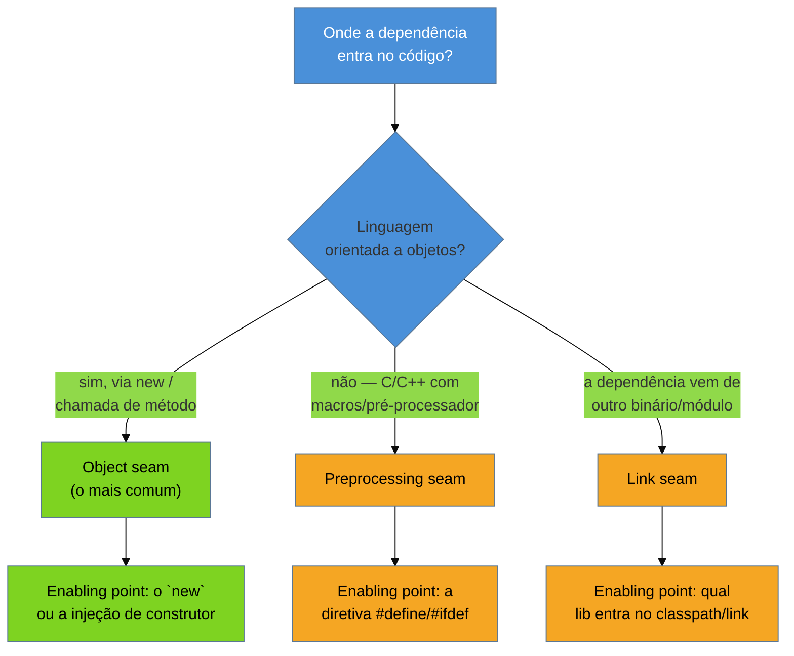
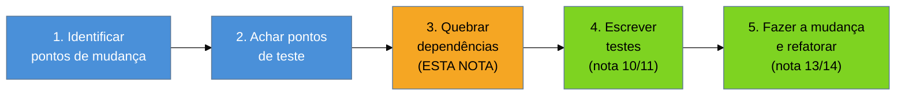

# Seams e quebra de dependência

> [!abstract] TL;DR
> Você quer caracterizar `CalculadoraDeComissao` ([[10 - A rede de segurança primeiro|nota 10]]) mas
> não consegue nem escrever a primeira linha do teste: o construtor abre uma conexão JDBC de verdade
> contra um banco de produção. **Michael Feathers** chama o ponto onde você conseguiria trocar esse
> comportamento sem editar ali de **seam** — "a lugar onde você pode alterar o comportamento do
> programa sem editar naquele lugar". Todo seam tem um **enabling point**: a linha de código onde você
> decide qual comportamento entra em cena (um `new`, um `#include`, uma entrada no classpath). Feathers
> descreve três tipos — **object seam** (o mais comum em OO: trocar um objeto por outro via
> polimorfismo/injeção), **preprocessing seam** (macros do pré-processador, típico de C/C++) e **link
> seam** (trocar na ligação: bibliotecas, classpath, dynamic linking). O **legacy change algorithm** de
> Feathers amarra isso a um fluxo de 5 passos: (1) identificar pontos de mudança, (2) achar pontos de
> teste, (3) **quebrar dependências**, (4) escrever testes (a nota 10), (5) mudar e refatorar. Esta nota
> é o passo 3 — e a razão de ele existir: sem um seam aberto, o passo 4 é impossível. As técnicas de
> quebra (Extract Interface, Parameterize Constructor, Extract and Override Call, Subclass and Override
> Method) resolvem o **paradoxo da testabilidade**: você precisa quebrar dependência para testar, mas
> quebrar dependência sem teste é arriscado — a saída é "apoiar-se no compilador" (*lean on the
> compiler*), mudanças mecânicas que a própria linguagem garante seguras, sem exigir teste prévio.

Você já sabe que `CalculadoraDeComissao` é o hotspot ([[09 - Forense de software|nota 09]]) e já
decidiu que o primeiro passo é caracterizar o comportamento atual ([[10 - A rede de segurança
primeiro|nota 10]]). Você abre o editor, cria `CalculadoraDeComissaoTest`, escreve:

```java
CalculadoraDeComissao calc = new CalculadoraDeComissao();
```

E trava. Porque o construtor de `CalculadoraDeComissao`, você acaba de descobrir, faz isto:

```java
public CalculadoraDeComissao() {
    this.conexao = DriverManager.getConnection(
        "jdbc:oracle:thin:@prod-db.internal:1521:ERP", "app_user", System.getenv("DB_PASS"));
    this.tabelaDeAliquotas = new CarregadorDeAliquotas(conexao).carregarTudo();
}
```

Instanciar a classe — a coisa mais simples que existe num teste — já abre uma conexão real contra o
banco de produção. Sem VPN, sem credenciais válidas no seu ambiente de CI, o teste nem compila
logicamente: ele quebra antes de testar qualquer coisa relacionada à comissão. Você não tem um problema
de lógica de negócio; tem um problema de **acoplamento a uma dependência concreta e inevitável**. E aqui
mora a armadilha mental mais comum de quem chega em legado vindo de código verde: seu instinto diz "vou
refatorar isso para ficar testável" — mas refatorar sem rede é exatamente o que a nota 10 avisou para
não fazer. Você está preso entre precisar de um seam para testar e não ter teste para mudar com
segurança até abrir o seam.

Feathers resolveu essa aparente contradição décadas atrás, e a resposta é surpreendentemente concreta.

## O que é um seam, e por que a ideia liberta

A definição de Feathers, no capítulo 4 de *Working Effectively with Legacy Code*, é enganosamente
simples:

> "A seam is a place where you can alter behavior in your program without editing in that place."

Repare no que essa frase **não** exige: não exige que você entenda as 800 linhas de
`CalculadoraDeComissao`. Não exige que você refatore a lógica de comissão. Não exige coragem para mexer
no método que ninguém entende. Ela exige só uma coisa: achar o ponto onde uma dependência entra na
classe, e trocar *aquele ponto de entrada* — sem tocar em uma linha do comportamento que você está
tentando proteger.

Pense num encanamento de casa antiga. Você não precisa abrir a parede inteira para trocar um registro de
água — precisa achar o **registro**, o ponto já preparado (ou que você prepara) onde a água pode ser
desviada sem quebrar a parede toda. O seam é esse registro no código: o ponto de articulação onde você
consegue desviar o fluxo (a conexão real com o banco) para outro lugar (uma conexão falsa, em memória)
sem demolir a parede (o método `calcular()` que você está tentando proteger).

Isso é libertador porque muda a pergunta. Em vez de "como eu entendo e conserto essa classe de 800
linhas com segurança?", a pergunta vira "onde está o ponto mais barato, mais mecânico, mais seguro para
substituir só a dependência que me impede de instanciar isso num teste?". Você não precisa consertar o
código difícil. Precisa achar a costura.

**Em uma frase:** um seam não é onde o código está errado — é onde ele já é (ou pode ser tornado)
substituível, sem editar ali.

## O enabling point: onde a decisão realmente acontece

Todo seam tem um **enabling point** (ponto habilitador): o lugar exato onde você decide *qual*
comportamento entra em cena. No exemplo acima, o enabling point não é a classe inteira — é a linha
`new CarregadorDeAliquotas(conexao)` dentro do construtor. Antes daquela linha, nada foi decidido; depois
dela, o comportamento real (ler de um banco Oracle de produção) já está fixado.

> [!question]- Se o seam é "o lugar onde eu poderia trocar", por que preciso de mais um conceito (enabling point)?
> Porque um seam sozinho não é acionável — é só uma constatação de que ali *poderia* haver uma
> substituição. O enabling point é a resposta prática a "ok, e onde exatamente eu mudo uma linha para
> ativar essa troca?". Em um object seam, por exemplo, o seam inteiro é o *tipo* da dependência (a
> interface `RepositorioDeAliquotas`); o enabling point é a linha específica que decide *qual*
> implementação concreta é usada ali — normalmente um `new` ou uma injeção de construtor. Sem separar os
> dois conceitos, fica fácil confundir "identifiquei um seam" com "já sei o que fazer" — quando na
> verdade falta achar a linha exata a tocar.

## Os três tipos de seam

Feathers descreve três famílias, cada uma amarrada a um mecanismo de linguagem diferente:



- **Object seam** — o seam do dia a dia em OO (Java, C#, Python, TypeScript, Ruby). Você troca um
  objeto concreto por outro através de polimorfismo: uma interface, uma classe injetada via construtor
  ou setter, um método `protected` sobrescrevível. É o seam que você vai abrir na maioria absoluta dos
  casos em código legado corporativo, e é o foco do resto desta nota.
- **Preprocessing seam** — específico de linguagens com pré-processador textual, como C e C++. Uma
  macro `#ifdef TESTING` pode literalmente trocar o texto do código antes da compilação, substituindo
  uma chamada real por um stub. É um seam "sujo" — mexe no texto-fonte de forma condicional — mas é
  frequentemente a única saída em código C legado sem nenhuma camada de abstração.
- **Link seam** — o comportamento muda dependendo de qual biblioteca/módulo é ligado (linkado) ao
  programa em tempo de build ou de execução: uma DLL diferente, uma versão diferente no classpath, um
  módulo stub que substitui o real na etapa de *linking*. Útil quando a dependência está fora do seu
  controle de código-fonte — por exemplo, uma biblioteca de terceiros sem interface nenhuma para
  implementar.

Na prática de sistemas corporativos modernos (Java, C#, Python, JS/TS), você vai abrir object seams em
mais de 90% dos casos. Os outros dois existem para os cantos que a orientação a objetos não cobre —
vale saber que existem para não ficar preso quando o object seam simplesmente não é possível (ex.: uma
lib de terceiros sem interface, decompilada, sem fonte).

## O legacy change algorithm: onde o passo 3 se encaixa

Feathers amarra tudo isso a um fluxo de cinco passos que ele chama de *legacy change algorithm* — a
espinha dorsal de como mudar qualquer código legado com segurança:



Repare na ordem: o passo 3 (quebrar dependência) vem **antes** do passo 4 (escrever o teste), não
depois. Isso responde a uma pergunta que a nota 10 deixou em aberto — "às vezes você quebra uma
dependência mínima só para conseguir rodar o teste feio o suficiente para começar". É exatamente isto:
sem abrir o seam do construtor de `CalculadoraDeComissao`, você não tem *onde* plugar o characterization
test. A rede de segurança da nota 10 pressupõe que a classe já seja instanciável isolada — e é essa
instanciação que esta nota resolve.

**Em uma frase:** você não escreve o characterization test na classe acoplada — primeiro abre um seam
mínimo, só o suficiente para instanciar e chamar o método sob teste; o resto da lógica continua
intocado.

## O paradoxo da testabilidade — e como Feathers resolve

Aqui está a tensão real, nomeada por Feathers sem rodeio: para testar, você precisa quebrar dependência;
mas quebrar dependência é uma **mudança no código**, e mudar código sem teste é exatamente o que a nota
10 disse para não fazer. Você não pode escrever o characterization test antes de quebrar a dependência
(não consegue nem instanciar a classe), e não devia quebrar a dependência sem um teste que garanta que
não alterou comportamento algum no processo.

A saída de Feathers não é filosófica — é disciplinar: as técnicas de quebra de dependência precisam ser
**mudanças que o compilador (ou o interpretador, ou a IDE) garante que preservam o comportamento**, sem
exigir um teste para confiar nelas. Feathers chama isso de *"leaning on the compiler"* — apoiar-se no
compilador. Extrair uma interface de uma classe existente, por exemplo, é uma operação **mecânica**: o
compilador Java garante que qualquer código que compilava contra a implementação concreta continua
compilando contra a interface, porque a interface é gerada a partir dos métodos que já existem. Não há
espaço para o compilador aceitar uma extração de interface que mude a assinatura de um método por
engano — ele simplesmente não compila se isso acontecer. É por isso que ferramentas de refatoração
automatizada de IDE (Extract Interface, Rename, Extract Method com verificação estática) são o
instrumento preferido aqui: não porque sejam "mais seguras" em abstrato, mas porque **a própria
ferramenta, apoiada no compilador, garante a preservação de comportamento** sem que você precise de um
teste prévio para confiar nisso.

> [!question]- Isso não é meio contraditório com "nunca mude sem teste"?
> Não — é uma exceção deliberada e estreita. A regra "rede antes de mudar" (nota 10) vale para mudanças
> de **comportamento**: lógica de negócio, condicionais, cálculos. As técnicas de quebra de dependência
> desta nota são deliberadamente escolhidas para **não mudar comportamento nenhum** — só mudam *como* uma
> dependência é obtida (de "criada internamente" para "recebida de fora"), de um jeito que a linguagem
> consegue verificar estaticamente. Se uma técnica de quebra de dependência exigisse julgamento humano
> para confiar que nada mudou, ela não estaria "apoiada no compilador" — estaria arriscada como qualquer
> outra mudança sem rede, e Feathers não a recomendaria neste passo.

## Técnicas de quebra de dependência

Feathers cataloga 24 técnicas no livro; quatro cobrem a maioria dos casos reais.

### Parameterize Constructor — a mais simples

O construtor de `CalculadoraDeComissao` cria a própria dependência internamente. A técnica mais direta
é fazer o construtor **receber** a dependência em vez de criá-la:

```java
// ANTES — dependência hard-coded. Impossível testar sem banco real.
public class CalculadoraDeComissao {
    private final RepositorioDeAliquotas repositorio;

    public CalculadoraDeComissao() {
        Connection conexao = DriverManager.getConnection(
            "jdbc:oracle:thin:@prod-db.internal:1521:ERP", "app_user", System.getenv("DB_PASS"));
        this.repositorio = new RepositorioDeAliquotasJdbc(conexao);
    }

    public BigDecimal calcular(BigDecimal valorVenda, double percentualMeta) {
        List<Aliquota> aliquotas = repositorio.buscarTodas();
        // ... 800 linhas de lógica de comissão, intocadas ...
    }
}

// DEPOIS — seam aberto. O enabling point virou o parâmetro do construtor.
public class CalculadoraDeComissao {
    private final RepositorioDeAliquotas repositorio;

    // Construtor de produção: continua montando a dependência real,
    // preservando o comportamento existente para quem já chama assim.
    public CalculadoraDeComissao() {
        this(new RepositorioDeAliquotasJdbc(conexaoDeProducao()));
    }

    // Construtor novo: o SEAM. Quem chama decide qual repositório entra.
    public CalculadoraDeComissao(RepositorioDeAliquotas repositorio) {
        this.repositorio = repositorio;
    }

    public BigDecimal calcular(BigDecimal valorVenda, double percentualMeta) {
        List<Aliquota> aliquotas = repositorio.buscarTodas();
        // ... a mesma lógica, NENHUMA linha de comportamento mudou ...
    }
}
```

```java
// No teste, agora você instancia sem tocar em banco nenhum:
@Test
void caracterizarComissaoComMetaParcial() {
    RepositorioDeAliquotas dublê = new RepositorioDeAliquotasFalso(List.of(
        new Aliquota(0.60, 0.05), new Aliquota(1.00, 0.08)));
    CalculadoraDeComissao calc = new CalculadoraDeComissao(dublê); // seam aberto aqui

    BigDecimal resultado = calc.calcular(new BigDecimal("1000.00"), 0.60);
    assertEquals(new BigDecimal("0.00"), resultado); // asserção-propositalmente-errada, nota 10
}
```

Note o que a técnica **não** fez: não mexeu em uma linha das 800 da lógica de comissão. Adicionou um
construtor. O compilador garante que o construtor antigo continua existindo com o comportamento antigo
(chama o novo, com a dependência real); o construtor novo é puramente aditivo. É uma mudança que você
podia fazer *antes* de ter qualquer teste, porque a garantia vem da linguagem, não de uma suíte.

### Extract Interface — quando o tipo concreto está espalhado

Às vezes a dependência concreta (`RepositorioDeAliquotasJdbc`) é referenciada em vários lugares — não só
no construtor. Nesse caso, extrair uma interface a partir dos métodos públicos usados abre o seam de
forma mais ampla:

```java
// Extraída mecanicamente pela IDE a partir dos métodos já usados de
// RepositorioDeAliquotasJdbc — nenhuma lógica nova, só um contrato.
public interface RepositorioDeAliquotas {
    List<Aliquota> buscarTodas();
}

public class RepositorioDeAliquotasJdbc implements RepositorioDeAliquotas {
    // implementação real, intocada
}

public class RepositorioDeAliquotasFalso implements RepositorioDeAliquotas {
    private final List<Aliquota> aliquotas;
    public RepositorioDeAliquotasFalso(List<Aliquota> aliquotas) { this.aliquotas = aliquotas; }
    public List<Aliquota> buscarTodas() { return aliquotas; }
}
```

Combinada com Parameterize Constructor, essa é a dupla mais usada em bases Java/C# legadas: extrai a
interface, muda o construtor para receber a interface em vez do tipo concreto. Ambas são operações que
uma IDE moderna (IntelliJ, Eclipse, Rider) automatiza com garantia estática — de novo, apoiando-se no
compilador.

### Extract and Override Call / Factory Method — quando não dá para mudar o construtor

Às vezes o construtor é chamado em centenas de lugares e mudar a assinatura é caro demais para o
momento. A alternativa é extrair a **chamada problemática** (não a classe inteira) em um método próprio
`protected` e criar uma subclasse de teste que sobrescreve só aquele método:

```java
public class CalculadoraDeComissao {
    public BigDecimal calcular(BigDecimal valorVenda, double percentualMeta) {
        List<Aliquota> aliquotas = buscarAliquotas(); // extraído
        // ... lógica intocada ...
    }

    // Factory Method extraído — o enabling point agora é este método sobrescrevível.
    protected List<Aliquota> buscarAliquotas() {
        return new RepositorioDeAliquotasJdbc(conexaoDeProducao()).buscarTodas();
    }
}

// Subclasse SÓ de teste, nunca vai para produção.
class CalculadoraDeComissaoTestável extends CalculadoraDeComissao {
    @Override
    protected List<Aliquota> buscarAliquotas() {
        return List.of(new Aliquota(0.60, 0.05), new Aliquota(1.00, 0.08));
    }
}
```

O nome popular para essa família — **Subclass and Override Method** — é mais invasivo que Parameterize
Constructor (exige que o método não seja `private` nem `final`), mas serve quando mudar a assinatura do
construtor teria um raio de impacto grande demais para arriscar agora.

**Em uma frase:** cada técnica abre o seam de um jeito diferente, mas todas compartilham a mesma
disciplina — mudanças mecânicas, verificáveis pelo compilador, que não tocam uma linha do comportamento
que você está protegendo.

## Casos práticos

### Cenário 1: due diligence — seam mínimo para caracterizar sem infraestrutura de produção

Você está avaliando o motor de precificação de uma fintech em dez dias, sem acesso ao ambiente de
produção deles (política de segurança do fundo). O motor, como `CalculadoraDeComissao`, abre conexões
reais no construtor. Você não tem tempo nem mandato para refatorar a arquitetura — só precisa rodar os
cinco cenários de transação que decidem seu laudo de risco. A solução é o menor seam possível:
Parameterize Constructor, só na dependência que bloqueia a instanciação. Em duas horas você tem o
construtor testável e os cinco characterization tests rodando localmente, sem VPN, sem credenciais de
produção. O seam não virou parte da arquitetura permanente da fintech — virou a costura mínima que
permitiu a auditoria acontecer dentro do prazo.

### Cenário 2: resgate — Extract and Override quando mudar a assinatura é arriscado demais

No incêndio do cálculo de frete com CEPs negativos, você descobre que o construtor de
`CalculadorDeFrete` é chamado em 40 lugares diferentes, muitos em batch jobs noturnos que você não pode
testar em produção sob pressão. Mudar a assinatura do construtor tocaria os 40 pontos de chamada — risco
alto demais para um resgate sob pressão. Em vez disso, você extrai a chamada de rede (consulta de
distância a um serviço de geolocalização externo) para um método `protected` isolado e cria uma
subclasse de teste que devolve uma distância fixa. Você caracteriza o bug em vinte minutos, sem tocar
nos outros 39 pontos de chamada — o seam foi cirúrgico, proporcional ao risco aceitável naquele momento.

## Armadilhas comuns

> [!warning] Confundir "abrir um seam" com "consertar a arquitetura"
> **O que acontece:** o engenheiro, animado por ter aberto o primeiro seam, começa a extrair interfaces
> e injetar dependências pela classe inteira, numa sessão só, sem rede cobrindo o resto.
> **Por quê:** o objetivo do passo 3 do legacy change algorithm é o **mínimo** seam necessário para
> chegar ao passo 4 (escrever teste). Expandir o escopo vira exatamente o tipo de mudança grande, sem
> teste que a cubra, que a nota 10 existe para evitar.
> **Como evitar:** abra só o seam que bloqueia a instanciação/chamada do caminho que você precisa
> caracterizar agora. Deixe o resto da arquitetura para quando a rede ([[13 - Técnicas cirúrgicas|nota
> 13]], [[14 - Refactoring em terreno hostil|nota 14]]) já cobrir aquele território.

> [!warning] Escolher uma técnica de quebra que exige julgamento humano em vez de garantia do compilador
> **O que acontece:** em vez de Extract Interface (mecânico, verificado estaticamente), o engenheiro faz
> um `copy-paste` manual do método inteiro, editando à mão os pontos que "acha" que precisam mudar para
> desacoplar — sem rede cobrindo a cópia.
> **Por quê:** isso quebra a premissa central do paradoxo da testabilidade: a técnica de quebra de
> dependência só é segura *sem teste prévio* porque é mecânica e verificável. Uma edição manual "no
> olho" tem exatamente o mesmo risco de qualquer mudança de comportamento sem rede.
> **Como evitar:** prefira sempre a operação de refatoração automatizada da IDE (Extract Interface,
> Extract Method, Rename) a uma edição manual equivalente — mesmo que pareça mais lento no primeiro
> momento, a garantia estática é o que sustenta todo o passo 3.

> [!warning] Esquecer o construtor de produção ao fazer Parameterize Constructor
> **O que acontece:** o engenheiro adiciona o construtor novo (que recebe a dependência) mas apaga o
> construtor antigo, quebrando todos os pontos de chamada em produção que dependiam do construtor sem
> parâmetro.
> **Por quê:** Parameterize Constructor é aditiva por definição — o construtor de produção deve
> continuar existindo, delegando para o novo com a dependência real, exatamente como no exemplo desta
> nota. Removê-lo transforma uma mudança "apoiada no compilador" numa mudança de comportamento real
> (agora produção não compila, ou pior, alguém adapta às pressas e erra).
> **Como evitar:** trate o construtor sem parâmetro como uma fachada que delega para o novo — nunca o
> remova até que todos os pontos de chamada em produção migrem deliberadamente para injeção explícita
> (normalmente já fora do escopo desta nota, no território de um contêiner de DI).

## Como explicar em inglês

Quando te perguntarem, em entrevista, como você torna testável um método que você não consegue nem
instanciar num teste:

> "Michael Feathers calls this a **seam** — a place where you can alter behavior without editing in that
> place. Every seam has an **enabling point**: the exact line that decides which behavior gets used. In
> object-oriented code, that's almost always an **object seam** — you swap a concrete dependency for one
> you control, usually through **Parameterize Constructor** or **Extract Interface**. Both are mechanical
> changes the compiler guarantees are behavior-preserving, so I can do them safely *before* I have a test
> — that's the resolution to what Feathers calls the testability paradox: you need to break a dependency
> to test, but breaking a dependency without a test is risky, so you 'lean on the compiler' and only use
> refactorings that are provably safe by construction, like an IDE's automated Extract Interface. This is
> step 3 of Feathers' legacy change algorithm — identify change points, find test points, break
> dependencies, write characterizing tests, then make the change. I only open the smallest seam needed to
> get the class under test, not a full architectural rewrite."

| PT | EN |
|----|----|
| seam | seam |
| ponto habilitador | enabling point |
| seam de objeto | object seam |
| seam de pré-processador | preprocessing seam |
| seam de ligação (linkedição) | link seam |
| quebra de dependência | dependency breaking |
| algoritmo de mudança em legado | legacy change algorithm |
| apoiar-se no compilador | leaning on the compiler |
| paradoxo da testabilidade | testability paradox |
| extrair interface | extract interface |
| parametrizar construtor | parameterize constructor |
| método de fábrica extraído | extracted factory method |

## O que vem a seguir

Você agora sabe achar e abrir o seam mínimo que destrava a instanciação — o pré-requisito mecânico que
faltava entre "código acoplado" e "código sob rede de caracterização" (nota 10). Duas frentes se abrem:

- [[13 - Técnicas cirúrgicas]] — aqui você quebrou dependência **para testar o que já existe**; lá você
  aprende a **adicionar comportamento novo sem tocar no código intocável** (Sprout Method/Class, Wrap
  Method/Class) — às vezes sem precisar sequer abrir um seam, contornando o método hostil por fora.
- [[14 - Refactoring em terreno hostil]] — com a rede existindo e o seam aberto, o catálogo de Fowler
  finalmente pode ser aplicado com segurança à lógica interna que esta nota deixou intocada.
- [[10 - A rede de segurança primeiro]] e [[11 - Approval e Golden Master testing]] — o passo 4 do
  algoritmo, que só é possível depois do seam que esta nota abre.
- [[03-Dominios/Engenharia/Testes/index|Testes]] — a teoria geral de dublês de teste (mocks, stubs,
  fakes) que você usa para preencher o seam uma vez aberto; aqui só cobrimos como abrir o ponto de
  substituição, não o catálogo de dublês em si.

## Fontes

- **Michael Feathers** — *Working Effectively with Legacy Code* (Prentice Hall, 2004) — obra-fonte: a
  definição de seam, enabling point, os três tipos de seam, o legacy change algorithm e o catálogo de
  técnicas de quebra de dependência (Parameterize Constructor, Extract Interface, Extract and Override
  Call, Subclass and Override Method, entre outras).
- **Michael Feathers** — [*Working Effectively with Legacy Code* (resumo do capítulo de seams, via
  informIT)](https://www.informit.com/articles/article.aspx?p=359417) — trecho do livro disponibilizado
  pela editora, com a definição literal de seam e enabling point.
- **understandlegacycode.com** — [*The key points of Working Effectively with Legacy Code*](https://understandlegacycode.com/blog/key-points-of-working-effectively-with-legacy-code/) — síntese
  acessível do legacy change algorithm e dos tipos de seam.
- **Wikipedia** — [*Seam (software development)*](https://en.wikipedia.org/wiki/Seam_(software_development)) — definição de referência e histórico do termo cunhado por Feathers.

## Veja também

- [[03-Dominios/Engenharia/Arqueologia e Restauração de Software/index|Arqueologia e Restauração de Software (MOC)]]
- [[03-Dominios/Engenharia/Arqueologia e Restauração de Software/10 - A rede de segurança primeiro|A rede de segurança primeiro]] — o passo 4 do algoritmo, que depende do seam aberto aqui
- [[03-Dominios/Engenharia/Arqueologia e Restauração de Software/11 - Approval e Golden Master testing|Approval e Golden Master testing]] — o ferramental para caracterizar saídas grandes, também depende de instanciação testável
- [[03-Dominios/Engenharia/Arqueologia e Restauração de Software/13 - Técnicas cirúrgicas|Técnicas cirúrgicas]] — adicionar comportamento novo sem tocar no código intocável (Sprout/Wrap)
- [[03-Dominios/Engenharia/Arqueologia e Restauração de Software/14 - Refactoring em terreno hostil|Refactoring em terreno hostil]] — o catálogo de Fowler aplicado depois que o seam está aberto
- [[03-Dominios/Engenharia/Testes/index|Testes]] — a teoria geral de dublês de teste (mocks, stubs, fakes)
