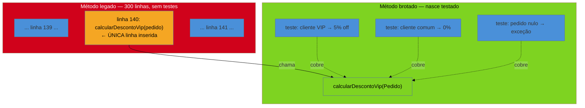
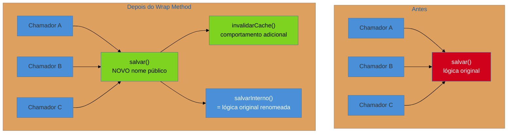
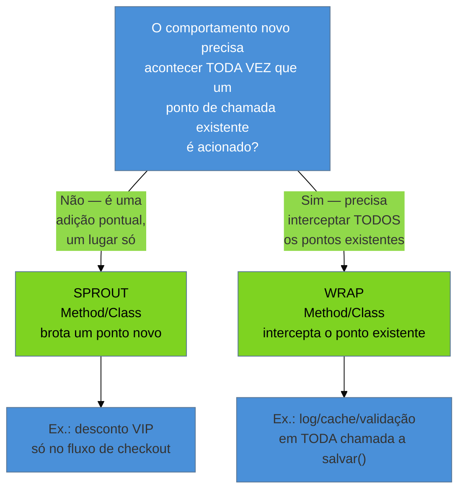

# Técnicas cirúrgicas

> [!abstract] TL;DR
> Você precisa adicionar uma regra nova num método de 300 linhas que ninguém ousa tocar. A tentação é abrir o método e enfiar o código novo no meio do emaranhado — mas ali ele nasce tão intestável e arriscado quanto o resto. **Michael Feathers** propõe o oposto: em vez de abrir o código velho para testá-lo (o território da [[12 - Seams e quebra de dependência|nota 12]]), você **costura o novo em volta dele**, quase sem tocar no que já existe. **Sprout Method/Class** (brotar) cria o comportamento novo numa unidade nova — testável por TDD desde o nascimento — e o chama do código velho com uma única linha de inserção. **Wrap Method/Class** (embrulhar) intercepta um ponto de chamada existente: renomeia o método velho, cria um novo com o nome antigo que chama o velho **e** o comportamento adicional. A escolha entre os dois é mecânica: brotar quando o novo é uma adição pontual; embrulhar quando o novo precisa acontecer **toda vez** que o antigo acontecer. A disciplina que sustenta as duas é o **micro-commit**: passos minúsculos, cada um verde, cada um revertível em segundos. É a cirurgia minimamente invasiva — a forma de entregar valor **já**, sem esperar meses de cobertura de testes.

Você acabou de herdar `ProcessadorDePedido.processar()` — 300 linhas, um único método, sem uma chave sequer de indentação que sugira onde uma coisa termina e outra começa. O cliente pede algo simples na superfície: "quando o pedido vier de um cliente VIP, aplique 5% de desconto adicional antes do cálculo de frete". Você abre o arquivo. Não há um lugar óbvio para colar essas três linhas — o fluxo de cálculo está espalhado por variáveis mutáveis que se acumulam do topo ao fim do método. Duas opções te encaram. A primeira: enfiar o `if (cliente.isVip())` ali no meio, entre a linha 140 e a 141, torcendo para não esbarrar em nenhuma das outras quinze variáveis que já vivem naquele escopo. A segunda: parar, gastar um dia inteiro tentando entender o método por completo antes de escrever uma linha. Nenhuma das duas é o que um cirurgião faria. Um cirurgião não abre o paciente inteiro para tratar um dedo — e não recusa operar só porque não tem o histórico médico completo. Ele isola o campo, opera o mínimo necessário, e sai.

## O princípio: não abra o que você não precisa entender

A nota 12 já te deu o vocabulário de **seam** — um ponto onde você pode alterar comportamento sem editar o código naquele lugar — e o *legacy change algorithm* de Feathers para decidir onde intervir. Mas seams resolvem um problema específico: **testar** código que já existe, quebrando uma dependência dura o suficiente para colocar aquele trecho sob rede. As técnicas cirúrgicas desta nota resolvem um problema diferente: você precisa **adicionar comportamento novo**, e a pergunta não é "como testo isso que já existe?" — é "como faço o novo nascer testado, sem arrastar o velho para dentro do risco?".

> [!question]- Isso não é só "escrever código limpo no lugar certo"? Por que precisa de nome e técnica?
> Porque a tentação errada é forte demais para depender de bom senso. Sob pressão de prazo, com um método de 300 linhas na tela, a rota de menor resistência é sempre colar as três linhas novas ali no meio — é literalmente menos digitação que criar um método novo, escrever testes para ele e adicionar uma chamada. As técnicas de Feathers existem porque **nomeiam a alternativa** como primeira escolha, não como refinamento posterior: você treina o reflexo de perguntar "isto é uma adição ou uma interceptação?" antes de tocar o teclado, porque o custo de errar — mais 20 linhas acopladas ao emaranhado — é alto e silencioso. Ninguém vê o dano no dia; ele aparece seis meses depois, quando aquele método tem 340 linhas em vez de 300.

**O princípio em uma frase:** o código novo que você escreve hoje deve nascer testável mesmo que o código velho ao redor não seja — e isso só acontece se ele nascer **fora** do velho, chamado por ele, não dentro dele.

## Sprout: brotar um galho novo a partir do tronco velho

**Sprout Method** é a técnica para quando o comportamento novo é uma **adição pontual**: algo que precisa acontecer *neste ponto* do fluxo, mas que não precisa interceptar nada que já existe. O procedimento tem três passos, na ordem:

1. Identifique exatamente **onde**, no método velho, o comportamento novo deveria entrar — geralmente um ponto lógico entre duas responsabilidades existentes.
2. Escreva o comportamento novo num **método novo** (ou, se ele precisar de estado próprio e várias colaborações, numa **classe nova** — Sprout Class). Este método/classe nasce do zero, então nasce sob TDD, com testes de unidade normais, sem nenhuma das restrições do código legado ao redor.
3. Insira **uma única linha** no método velho, chamando o método/classe novo. É a única mudança que o código legado sofre.



Repare no que o diagrama mostra: o retângulo vermelho (o método velho, arriscado) recebe uma única linha âmbar — o ponto de sutura. Tudo o que é verde nasceu testado, isolado, TDD do início ao fim. Se você errar a lógica do desconto, o teste do método novo acusa em segundos. Se você quebrar alguma das outras 299 linhas do método velho... bem, essa é justamente a aposta: você não tocou nelas, então a probabilidade de quebrá-las despenca.

### Exemplo — antes e depois do sprout

```java
// ANTES — a tentação errada: colar a lógica nova no meio do método legado.
// A variável `desconto` já é usada e mutada em outros 8 lugares deste método
// de 300 linhas; adicionar mais um `if` aqui aumenta o acoplamento interno
// e não pode ser testado isoladamente — só rodando o método inteiro.
public class ProcessadorDePedido {
    public Recibo processar(Pedido pedido) {
        // ... 139 linhas de cálculo de itens, impostos, frete parcial ...
        BigDecimal desconto = calcularDescontoBase(pedido);

        // ERRADO: lógica nova enfiada direto no fluxo emaranhado
        if (pedido.getCliente().isVip()) {
            desconto = desconto.add(pedido.getSubtotal().multiply(new BigDecimal("0.05")));
        }
        // ... mais 160 linhas que dependem de `desconto` ...
    }
}

// DEPOIS — Sprout Method: o novo brota como método próprio, testável.
public class ProcessadorDePedido {
    public Recibo processar(Pedido pedido) {
        // ... 139 linhas intocadas ...
        BigDecimal desconto = calcularDescontoBase(pedido);

        // ÚNICA linha inserida no método velho — a sutura.
        desconto = aplicarDescontoVip(pedido, desconto);
        // ... mais 160 linhas intocadas ...
    }

    // Método novo: nasce sob TDD, testável isoladamente, sem depender
    // do resto do emaranhado.
    BigDecimal aplicarDescontoVip(Pedido pedido, BigDecimal descontoAtual) {
        if (!pedido.getCliente().isVip()) {
            return descontoAtual;
        }
        BigDecimal adicional = pedido.getSubtotal().multiply(new BigDecimal("0.05"));
        return descontoAtual.add(adicional);
    }
}

// Testes escritos ANTES do método (TDD normal — o novo código não tem
// nenhuma das restrições do legado):
// @Test void clienteVip_recebeCincoPorCentoAdicional() { ... }
// @Test void clienteComum_naoRecebeAdicional() { ... }
// @Test void pedidoComSubtotalZero_naoQuebra() { ... }
```

O ganho não é estético. É que `aplicarDescontoVip` pode ser refatorado, testado e evoluído independentemente do resto do método — e, no dia em que alguém finalmente decidir desmembrar `processar()` inteiro (o trabalho da [[14 - Refactoring em terreno hostil|nota 14]]), esse pedaço já está pronto, já separado, já testado.

## Wrap: embrulhar um ponto de chamada existente

**Wrap Method** resolve um problema diferente do sprout: o comportamento novo não é uma adição num ponto específico do fluxo — é algo que precisa acontecer **sempre que** um método existente for chamado, em todos os pontos de chamada, sem exceção. Exemplos típicos: logar toda chamada a um método sensível, validar uma pré-condição antes de qualquer execução, medir o tempo de execução, invalidar um cache depois de qualquer gravação. Nesses casos, brotar não ajuda — brotar adiciona um ponto de chamada novo; embrulhar **intercepta** um ponto de chamada que já existe, potencialmente em dezenas de lugares no código.

O procedimento:

1. **Renomeie** o método velho (ex.: `salvar` vira `salvarInterno`). A maioria das IDEs faz isso com *rename refactoring* seguro, atualizando as chamadas existentes automaticamente.
2. Crie um método **novo com o nome antigo** (`salvar`) que chama o método renomeado **e** o comportamento adicional, na ordem que fizer sentido (antes, depois, ou os dois).
3. Todo o resto do sistema continua chamando `salvar()` sem saber que algo mudou — exceto que agora o comportamento novo acontece sempre.



Note a diferença estrutural em relação ao sprout: lá, o ponto de sutura era uma linha nova **dentro** do método velho. Aqui, o método velho inteiro (renomeado) passa a ser **chamado por dentro** do novo — a intercepção acontece no nome, não no corpo. Ninguém fora da classe precisa saber que `salvar()` hoje é outro método.

**Wrap Class** é a mesma ideia num nível acima: em vez de embrulhar um método, você embrulha a classe inteira com um **decorator** — uma classe nova que implementa a mesma interface, recebe a instância velha por composição, e intercala o comportamento novo em torno de cada chamada delegada. Você usa Wrap Class quando precisa interceptar **múltiplos** métodos da mesma classe de uma vez (por exemplo, instrumentar toda a superfície pública de um repositório com métricas), em vez de embrulhar método por método.

## A decisão: brotar ou embrulhar?

A pergunta que decide entre as duas técnicas é sempre a mesma, e vale a pena tê-la memorizada antes de abrir o editor:



Em uma frase: **brotar adiciona; embrulhar intercepta.** Se você se pegar tentando embrulhar algo que só precisa acontecer numa chamada específica, está complicando à toa — um sprout simples resolveria com menos superfície de mudança. Se você se pegar tentando brotar algo que precisa valer em todos os chamadores, vai esquecer um dos pontos de chamada mais cedo ou mais tarde — é exatamente o cenário que o wrap existe para eliminar.

## A disciplina que torna a cirurgia segura: micro-commits

Nenhuma das duas técnicas é segura sem a disciplina que as sustenta: passos **minúsculos** e **reversíveis**. Cada passo — renomear o método, criar o método novo vazio, adicionar o primeiro teste, fazer o primeiro teste passar, inserir a linha de chamada — é um commit próprio, e cada commit deixa o código num estado **verde** (compila, os testes existentes continuam passando). A lógica é a mesma de qualquer cirurgia de verdade: você não faz um corte de 10 centímetros de uma vez só torcendo para acertar; você faz incisões pequenas, verifica a cada uma, e só avança quando o passo anterior está confirmado seguro.

O benefício concreto: se um passo quebra algo, `git reset --hard HEAD~1` (ou o equivalente na sua IDE) te devolve ao último estado verde em segundos — sem precisar entender *o que* deu errado antes de recuar. Em terreno legado, onde você não tem o modelo mental completo do sistema, essa reversibilidade barata é mais valiosa que qualquer análise prévia: você não precisa prever todos os efeitos colaterais possíveis se sabe que pode desfazer o passo que os causou em segundos, não em horas.

> [!question]- Commitar a cada passo minúsculo não gera um histórico poluído demais para revisar depois?
> Dois caminhos resolvem isso sem abrir mão da segurança. Primeiro: muitos times fazem os micro-commits localmente, numa branch de trabalho, e depois usam `git rebase -i` para **espremer** (*squash*) a sequência inteira num commit final coerente antes de abrir o PR — o histórico público fica limpo, mas você teve os pontos de restauração granulares enquanto operava. Segundo: mesmo sem squash, um histórico de passos pequenos e nomeados ("rename salvar→salvarInterno", "cria salvar() wrapper vazio", "adiciona invalidação de cache no wrapper") é, na prática, **mais** legível que um commit monolítico de "adiciona cache" — ele documenta a sequência de decisões, não só o resultado.

Vale mencionar de passagem uma prima próxima desta disciplina: quando você ainda não sabe *o que* vai mudar e só quer entender o código mexendo nele — o **exploratory refactoring** (ou *scratch refactoring*) — a técnica é a mesma inversão de segurança, só que aplicada à leitura, não à cirurgia: você refatora livremente para enxergar a estrutura, e depois **descarta tudo** com `git reset --hard`. Isso já foi coberto a fundo na [[06 - Lendo código que você não escreveu|nota 06]]; aqui vale só o aceno: o scratch refactoring é o reconhecimento antes da operação, não a operação em si.

## Casos práticos

### Cenário 1: due diligence — um sprout como prova de conceito de baixo risco

Você está avaliando, para um fundo, se um sistema legado de precificação é modificável ou é uma bola de lama que só aceita reescrita total. Em vez de argumentar em abstrato, você pede ao time do vendedor uma mudança real e pequena — adicionar uma regra de desconto sazonal — e a implementa você mesmo, ao vivo, em uma hora. Você não toca no método de 400 linhas de cálculo de preço: broto um `calcularDescontoSazonal` novo, com três testes, e insere uma linha de chamada. O exercício não prova só que a regra funciona — prova, ao fundo, que o sistema **aceita** intervenção cirúrgica sem exigir uma reescrita de semanas para qualquer mudança pequena. Isso muda a conversa de "reescrever ou não" para "quanto custa restaurar", que é exatamente o [[03 - A lente do consultor|julgamento que a lente do consultor]] precisa formar.

### Cenário 2: resgate — um wrap para estancar um vazamento sem entender a causa raiz

Um cliente descobre, em produção, que o cache de sessão está ficando obsoleto sempre que um pedido é editado depois de criado — mas o método `atualizarPedido()` é chamado em onze lugares diferentes do código, e você não tem tempo, sob pressão de incidente, de rastrear e alterar os onze. Em vez disso, você embrulha: renomeia `atualizarPedido` para `atualizarPedidoInterno`, cria um `atualizarPedido()` novo que chama o interno e depois invalida a entrada de cache correspondente. Uma mudança, num único arquivo, resolve os onze pontos de chamada de uma vez — porque o wrap intercepta o **nome**, não cada chamador individualmente. O incêndio para em minutos; a investigação de por que o cache não invalidava sozinho (provavelmente um seam quebrado, território da [[12 - Seams e quebra de dependência|nota 12]]) continua depois, sem pressão.

## Armadilhas comuns

> [!warning] Brotar quando deveria embrulhar (esquecer um ponto de chamada)
> **O que acontece:** você adiciona um sprout num dos lugares onde a lógica nova deveria valer, mas o comportamento precisava, na verdade, valer em todos os chamadores de um método existente — e meses depois alguém encontra um caminho de código onde a regra nova simplesmente não se aplica. **Por quê:** sprouts adicionam um ponto de chamada **novo**; eles não protegem os pontos de chamada **já existentes** de um método que continua sendo invocado do jeito antigo em outros lugares. **Como evitar:** antes de escolher, pergunte explicitamente "isto precisa valer em toda chamada existente, ou só neste fluxo específico?" — se a resposta for "toda chamada", é wrap, não sprout.

> [!warning] Deixar o sprout crescer até virar um novo emaranhado
> **O que acontece:** o método/classe brotado começa pequeno e testado, mas ao longo de meses absorve mais e mais responsabilidades ad-hoc — porque é "o lugar novo e limpo" — até virar, ele mesmo, um método de 200 linhas sem estrutura. **Por quê:** sprout é uma técnica de **entrada** segura, não uma licença para acumular complexidade indefinidamente; sem disciplina de refatoração contínua, o padrão se repete um nível abaixo. **Como evitar:** trate o método brotado como qualquer outro código de produção — aplique o catálogo de refactoring normal ([[14 - Refactoring em terreno hostil|nota 14]]) nele assim que crescer, em vez de deixá-lo "especial" só porque nasceu limpo.

> [!warning] Fazer o rename do Wrap Method manualmente, sem apoio de ferramenta
> **O que acontece:** ao renomear o método velho para criar espaço para o wrapper, você edita o texto à mão em vez de usar o *rename refactoring* automatizado da IDE — e esquece de atualizar uma chamada interna (uma referência via reflection, um teste que usa o nome antigo como string), quebrando algo silenciosamente. **Por quê:** rename manual depende de você encontrar **todas** as ocorrências textualmente; em código legado grande, isso é exatamente o tipo de garantia que a memória humana não oferece. **Como evitar:** use sempre o rename seguro da IDE (que resolve referências via AST, não busca de texto), rode a suíte de testes completa logo após o rename — antes de escrever qualquer linha do wrapper — e só então prossiga para o passo seguinte.

## Como explicar em inglês

Quando te perguntarem, em entrevista, como você adiciona uma funcionalidade num sistema legado sem refatorar o mundo inteiro primeiro:

> "I don't try to make the whole legacy method testable before adding to it — that's too slow and too risky under deadline pressure. Feathers gives two surgical techniques instead. If the new behavior is a one-off addition at a specific point, I use **Sprout Method**: I write the new logic as a brand-new method, developed with normal TDD, and insert a single line in the legacy method to call it. The legacy code barely changes; the new code is born fully tested. If the new behavior needs to happen at **every** existing call site of a method — logging, cache invalidation, validation — I use **Wrap Method** instead: rename the old method, create a new one with the old name that calls the renamed method plus the new behavior, and every caller picks it up automatically without being touched. Either way, I work in tiny, reversible steps — commit after every green step — so if anything breaks, I can roll back in seconds instead of debugging blind."

| PT | EN |
|----|----|
| técnicas cirúrgicas | surgical techniques |
| brotar (Sprout Method/Class) | sprout method / sprout class |
| embrulhar (Wrap Method/Class) | wrap method / wrap class |
| ponto de sutura | insertion point / seam of insertion |
| ponto de chamada | call site |
| decorator | decorator |
| micro-commit | micro-commit |
| passo reversível | reversible step |
| refatoração exploratória | exploratory refactoring / scratch refactoring |
| interceptar um método existente | to intercept an existing method |

## O que vem a seguir

Você agora sabe fazer a cirurgia local: adicionar (sprout) ou interceptar (wrap) sem abrir o paciente inteiro, com micro-commits garantindo que cada corte é reversível. Isso resolve mudanças **pontuais** — uma regra nova, um comportamento que precisa valer em todo lugar. Mas duas perguntas maiores ficam abertas, e cada uma tem sua própria nota:

- [[14 - Refactoring em terreno hostil]] — e se o problema não é adicionar algo novo, mas **reestruturar** o que já existe — extrair método, mover responsabilidade, quebrar uma classe-deus — num código que resiste porque tem acoplamento e nenhuma rede completa? É o catálogo de Fowler aplicado sob as restrições do legado.
- [[15 - O Método Mikado]] — e se a mudança não é pequena o bastante para uma cirurgia local? Quando uma alteração dispara uma cascata de pré-requisitos que você só descobre tentando, o Mikado Method organiza essa cascata num grafo e usa o revert agressivo como rede — a versão macro da disciplina de micro-commit que esta nota introduziu na escala micro.

## Fontes

- **Michael Feathers** — *Working Effectively with Legacy Code* (Prentice Hall, 2004) — capítulos sobre Sprout Method, Sprout Class, Wrap Method e Wrap Class; a obra-fonte das duas técnicas e do vocabulário usado nesta nota.
- **Michael Feathers** — [*Sprout Method*](https://understandlegacycode.com/blog/key-points-of-working-effectively-with-legacy-code/) (síntese em understandlegacycode.com) — resumo acessível das técnicas de brotar e embrulhar, com o contraste entre as duas.
- **Martin Fowler** — [*Refactoring: Improving the Design of Existing Code*](https://martinfowler.com/books/refactoring.html) — o catálogo de refatorações (incluindo *Extract Method*, base técnica do sprout) que a [[14 - Refactoring em terreno hostil|nota 14]] aprofunda.
- **Emily Bache** — [*The Gilded Rose kata and legacy code techniques*](https://understandlegacycode.com/) — exercícios práticos de sprout/wrap aplicados a código legado real, citados em complemento a Feathers.

## Veja também

- [[03-Dominios/Engenharia/Arqueologia e Restauração de Software/index|Arqueologia e Restauração de Software (MOC)]]
- [[03-Dominios/Engenharia/Arqueologia e Restauração de Software/12 - Seams e quebra de dependência|Seams e quebra de dependência]] — abrir o código velho para testá-lo; o complemento desta nota, que evita abri-lo
- [[03-Dominios/Engenharia/Arqueologia e Restauração de Software/10 - A rede de segurança primeiro|A rede de segurança primeiro]] — por que o código brotado nasce testado por characterization/TDD
- [[03-Dominios/Engenharia/Arqueologia e Restauração de Software/14 - Refactoring em terreno hostil|Refactoring em terreno hostil]] — reestruturar o que já existe, não apenas adicionar
- [[03-Dominios/Engenharia/Arqueologia e Restauração de Software/15 - O Método Mikado|O Método Mikado]] — a estratégia para mudanças grandes demais para uma cirurgia local
- [[03-Dominios/Engenharia/Arqueologia e Restauração de Software/06 - Lendo código que você não escreveu|Lendo código que você não escreveu]] — o scratch refactoring como técnica de leitura
