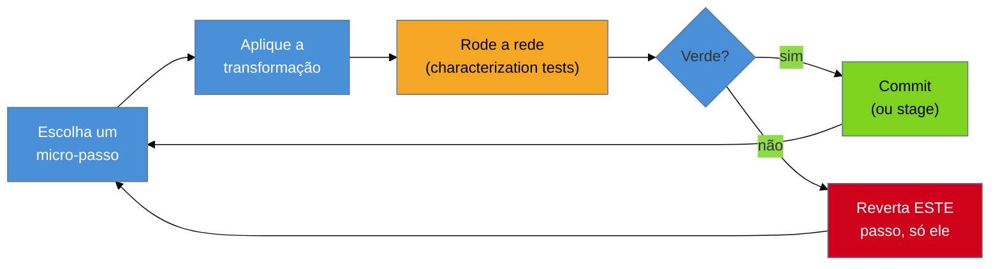
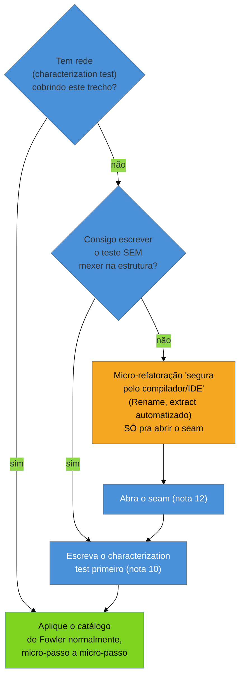

# Refactoring em terreno hostil

> [!abstract] TL;DR
> A forense ([[09 - Forense de software|nota 09]]) já te disse qual classe é o hotspot: `GerenciadorDePedido`, 900 linhas, um método `processar()` de 240 linhas que mistura validação, cálculo de preço, persistência e envio de e-mail. Você tem a rede posta ([[10 - A rede de segurança primeiro|nota 10]]) e o seam aberto ([[12 - Seams e quebra de dependência|nota 12]]). Agora entra o **catálogo de refactoring** de **Martin Fowler** (*Refactoring*, 2ª ed., 2018): uma coleção nomeada de transformações — Extract Method, Rename, Extract Variable, Extract Class — cada uma preservando o **comportamento observável** enquanto muda a **estrutura interna**. O problema: o catálogo de Fowler foi escrito pensando em código com testes rápidos e baixo acoplamento. No terreno hostil, nenhuma das duas coisas é garantida. Refatorar aqui não é aplicar o catálogo — é aplicá-lo **desconfiado**, em passos menores que os do livro, apoiado nas refatorações automatizadas da IDE (as únicas quase-sem-risco quando você não confia na própria rede) e disciplinado pela regra mais importante de todas: **nunca misturar reestruturar com mudar comportamento no mesmo passo**. Esta nota assume o seam aberto e a rede posta (12 e 10) e foca só na reestruturação em si.

Você abre `GerenciadorDePedido.processar()`. 240 linhas, um único método, sem quebra de parágrafo visual — só um bloco compacto de `if`s aninhados, cálculos e chamadas a três serviços diferentes. A forense (nota 09) marcou essa classe como hotspot nº 1: mudou em 70% dos últimos commits, é onde mais bug reabre. O cliente pede uma mudança pontual — adicionar um novo tipo de desconto para clientes corporativos. Você já sabe, pela [[10 - A rede de segurança primeiro|nota 10]], que tem characterization tests cobrindo os caminhos principais. Já sabe, pela [[12 - Seams e quebra de dependência|nota 12]], que quebrou a dependência dura no serviço de e-mail para poder rodar o método em teste. Agora o problema é outro: como você **toca** nesse método sem transformá-lo, na tentativa, num organismo ainda mais confuso — ou pior, sem introduzir um bug que a rede não pega porque você mudou duas coisas de uma vez e não sabe qual delas quebrou o quê?

É aqui que entra o catálogo de Fowler. Mas entra com um aviso: cada receita do livro pressupõe testes rápidos rodando em segundos e classes razoavelmente desacopladas. No hostil, os testes que você tem são os characterization tests grosseiros da nota 10 — lentos, de integração, cobrindo caminhos, não unidades — e o acoplamento é exatamente o que fez a classe virar hotspot. O catálogo continua sendo a ferramenta certa; só que você o maneja com mais cuidado, em passos menores, checando a rede com mais frequência.

## A definição estrita: mudar a estrutura, não o comportamento

Fowler é rigoroso numa distinção que, no legado, deixa de ser purismo acadêmico e vira questão de sobrevivência: **refactoring é a disciplina de reestruturar código existente, alterando sua estrutura interna sem alterar seu comportamento observável externo**. Não é "melhorar o código" em sentido vago — é um conjunto de transformações **comportamento-preservantes**. Se o comportamento muda, não é refactoring: é uma mudança de funcionalidade, um bugfix, um feature. Pode ser uma mudança boa e necessária — só não é a mesma operação, e misturá-la com refactoring é exatamente o erro que a disciplina existe para prevenir.

> [!question]- Por que essa distinção importa tanto mais no legado do que em código novo?
> Porque em código com testes rápidos e cobertura real, se você mistura reestruturação com mudança de comportamento e algo quebra, a suíte aponta o arquivo, a linha, às vezes até a asserção exata em segundos. Você erra, descobre rápido, corrige rápido — o custo do erro é baixo. No legado, sua rede é a characterization test da nota 10: mais lenta, mais grosseira, cobrindo *caminhos* em vez de unidades. Se ela falhar depois de um passo que misturou as duas coisas, você não sabe se foi a reestruturação que quebrou algo ou se foi a mudança de comportamento que você queria fazer de propósito — e agora precisa investigar as duas hipóteses ao mesmo tempo, sem saber qual delas é a culpada. É o cenário exato da abertura da nota 10: a "correção de duas linhas" que quebrou o RH inteiro. A disciplina de nunca misturar as duas coisas é o que transforma "o teste quebrou, e agora?" em "o teste quebrou, e eu sei exatamente por quê".

**A definição em uma frase:** refactoring muda a forma do código sem mudar o que ele faz — e no hostil, onde sua rede é grossa e lenta, essa fronteira precisa ser vigiada em cada commit, não só em teoria.

## O passo minúsculo como método: no hostil, ainda menor

A segunda contribuição estrutural de Fowler não é uma técnica — é um **ritmo**. Refatorar bem não é reescrever um trecho inteiro de uma vez e torcer para os testes passarem. É uma sequência de **micro-passos**, cada um pequeno o bastante para ser revertido em segundos se algo falhar, cada um seguido imediatamente de "rodar os testes, ver verde, considerar um commit".



Em código com testes rápidos, "pequeno" pode significar renomear uma variável e já rodar a suíte. No terreno hostil, "pequeno" fica **ainda menor**, por duas razões práticas. Primeiro, sua rede de characterization tests é lenta — rodar a suíte inteira a cada linha alterada é inviável, então você aprende a rodar o subconjunto relevante e a manter passos pequenos o bastante para que, se algo quebrar, a causa seja óbvia sem precisar de `git bisect` dentro do próprio commit. Segundo, o acoplamento oculto (o motivo pelo qual a classe é hotspot) significa que uma mudança que parece local pode ter efeito em três lugares que você não vê — quanto menor o passo, menor a superfície de dano por transformação, e mais fácil isolar qual delas causou o efeito colateral.

**O ritmo em uma frase:** o passo minúsculo não é lentidão burocrática — é o mecanismo que transforma um erro inevitável, cedo ou tarde, num incidente de segundos em vez de horas.

## O catálogo aplicado ao hostil: quatro receitas, quatro perigos

Fowler cataloga dezenas de refatorações nomeadas. No terreno hostil, quatro delas cobrem a maior parte do trabalho de domar um hotspot — e cada uma carrega um perigo específico quando aplicada a código sem rede robusta e com estado compartilhado.

### Extract Method — domar o método de 240 linhas, cuidado com o estado compartilhado

**O mecanismo:** você identifica um trecho coeso dentro do método gigante — digamos, as 30 linhas que calculam o desconto — e o move para um método novo, nomeado pelo que faz, chamado no lugar do trecho original. A IDE moderna (IntelliJ, VS Code com extensões, Rider) automatiza isso: seleciona o trecho, aciona "Extract Method", e a ferramenta identifica sozinha quais variáveis locais precisam virar parâmetros e qual precisa virar retorno.

**O perigo no hostil:** em código com forte acoplamento — o tipo que fez a classe virar hotspot — o trecho que parece "um cálculo isolado" quase sempre lê e escreve **estado compartilhado**: um campo da classe, uma variável mutável declarada 100 linhas antes e usada 50 linhas depois. Se você extrai o método sem perceber que ele *escreve* nesse campo compartilhado (não só lê), o método extraído continua funcionando — mas agora o efeito colateral está escondido atrás de um nome que sugere função pura. É o oposto do que Extract Method deveria entregar.

```java
// ANTES: dentro de processar() (240 linhas), este trecho calcula o desconto
// E, de quebra, atualiza um campo da classe usado mais adiante — um efeito
// colateral escondido no meio do método gigante.
double descontoBase = valorPedido * 0.05;
if (cliente.isCorporativo()) {
    descontoBase = valorPedido * 0.10;
}
this.ultimoDescontoAplicado = descontoBase; // <-- efeito colateral, 200 linhas
                                             //     depois alguém lê este campo!
double valorFinal = valorPedido - descontoBase;

// EXTRACT METHOD ingênuo (perigoso): a IDE extrai o cálculo, mas se você não
// perceber a escrita em `this.ultimoDescontoAplicado`, o método extraído
// parece puro e não é — quem move o método pra outra classe no futuro (Extract
// Class, adiante) vai quebrar o comportamento sem perceber.
private double calcularDesconto(BigDecimal valorPedido, Cliente cliente) {
    double descontoBase = valorPedido * 0.05;
    if (cliente.isCorporativo()) {
        descontoBase = valorPedido * 0.10;
    }
    this.ultimoDescontoAplicado = descontoBase; // efeito colateral sobrevive escondido
    return descontoBase;
}

// PASSO SEGURO: extraia primeiro SEM tocar no efeito colateral (deixe o campo
// sendo escrito no chamador, não no método extraído) — um micro-passo a mais,
// mas cada um continua comportamento-preservante e o efeito colateral fica
// visível no call site, não enterrado dentro do método:
private double calcularDesconto(BigDecimal valorPedido, Cliente cliente) {
    double descontoBase = valorPedido * 0.05;
    if (cliente.isCorporativo()) {
        descontoBase = valorPedido * 0.10;
    }
    return descontoBase;
}
// no chamador, o efeito colateral continua explícito:
double descontoBase = calcularDesconto(valorPedido, cliente);
this.ultimoDescontoAplicado = descontoBase; // ainda visível, ainda no lugar certo
double valorFinal = valorPedido - descontoBase;
```

O micro-passo extra — deixar o efeito colateral no chamador em vez de arrastá-lo para dentro do método extraído — é exatamente o tipo de cautela que o terreno hostil exige e que o livro de Fowler, escrito para código mais limpo, não precisa enfatizar tanto.

### Rename — recuperar a intenção perdida

**O mecanismo:** trocar o nome de uma variável, método ou classe por um que comunique intenção. `d` vira `diasDesdeUltimoPagamento`; `processar()` vira `calcularDescontoEEnviarConfirmacao()` (nome feio, mas honesto — sinal de que o método faz coisa demais, candidato a Extract Method na sequência).

**O elo com a nota 03:** Rename é, literalmente, o ato de **recuperar a teoria perdida** que [[03-Dominios/Engenharia/Complexidade de Software/04 - O programa como teoria|Naur]] descreve — o nome antigo era o fóssil de uma decisão que ninguém mais lembra o porquê; o nome novo é a hipótese que você, como consultor, reconstruiu ao ler o código e o histórico. Rename automatizado pela IDE (que atualiza todos os call sites de uma vez, com segurança de compilador em linguagens tipadas) é a refatoração de **menor risco** de todo o catálogo no terreno hostil — é por isso que ela é o ponto de entrada favorito quando você ainda não confia na rede: o compilador já é uma rede, para esse caso específico.

**O perigo:** em linguagens dinamicamente tipadas ou em código que usa reflexão/strings para referenciar nomes (configuração, serialização, chamadas via nome de método), o Rename automatizado da IDE pode não enxergar todas as referências — e você sai do refactor com uma referência quebrada silenciosamente. Sempre rode a rede depois, mesmo num Rename "garantido pelo compilador".

### Extract Variable / Introduce Explaining Variable — nomear o número mágico

**O mecanismo:** um número mágico ou uma expressão complexa (`valorPedido * 0.05` sem explicação) vira uma variável nomeada (`descontoPadrao`). É a refatoração mais barata do catálogo e a mais diretamente ligada ao que a [[07 - Arqueologia do histórico|nota 07]] chamou de "o porquê perdido": o `git blame` daquela linha pode até revelar quem escreveu `0.05`, mas não revela *por que* 5%. Extract Variable não recupera o porquê — mas transforma um número anônimo num rótulo que documenta a *intenção percebida*, e é ponto de partida para investigar o histórico e confirmar (ou corrigir) esse rótulo.

**O perigo no hostil:** nomear errado. Se você extrai `valorPedido * 0.05` como `descontoPadrao` sem confirmar, via characterization test ou via histórico, que aquilo é de fato um desconto "padrão" (e não, digamos, uma taxa de processamento que coincide numericamente), você não documentou a teoria — você **inventou** uma e a gravou como se fosse fato. Extract Variable exige a mesma humildade da leitura de código: nomeie com uma hipótese, não com uma certeza, e marque a incerteza se ela existir.

### Extract Class — quebrar a god class apontada pela forense

**O mecanismo:** quando uma classe acumula responsabilidades demais (validação, cálculo, persistência, notificação, tudo em `GerenciadorDePedido`), Extract Class move um subconjunto coeso de campos e métodos para uma classe nova, com a classe original passando a delegar a ela. É a refatoração que ataca diretamente o **módulo-deus** que a [[08 - Engenharia reversa e recuperação de arquitetura|nota 08]] descreveu como o nó do grafo com dezenas de arestas — o mesmo que a [[09 - Forense de software|nota 09]] provavelmente já apontou como o hotspot nº 1 do sistema.

**O perigo no hostil:** Extract Class é a maior das quatro refatorações desta nota — não é um micro-passo, é uma sequência de dezenas deles (mover um campo, mover um método, ajustar as referências, repetir). Tentar fazer de uma vez, sem rede rodando a cada movimento, é a receita mais comum de "a refatoração que virou uma reescrita acidental" — você perde o rastro de qual mudança quebrou o quê, porque moveu 15 métodos antes de rodar o teste uma vez. E se a classe-deus tem o tipo de emaranhado que a nota 08 chamaria de **componente fortemente conexo** (um ciclo de dependências, não uma árvore limpa), pode ser que nem exista um "subconjunto coeso" para extrair sem quebrar algo — nesse caso, Extract Class local não é suficiente, e o problema pede a estratégia maior da [[15 - O Método Mikado|nota 15]].

## A tensão central: você alterna, não resolve de uma vez

A [[12 - Seams e quebra de dependência|nota 12]] descreveu o paradoxo: você precisa de testes para refatorar com segurança, mas às vezes precisa refatorar um pouco só para conseguir instanciar a classe e escrever o primeiro teste. Esta nota assume que o seam já foi aberto — mas vale nomear como a alternância continua acontecendo, agora dentro do próprio trabalho de refatoração:



A saída prática: as refatorações **garantidas pelo compilador/IDE** — Rename automatizado, Extract Method automatizado sem tocar em campos compartilhados — são quase sem risco mesmo sem rede, porque a própria ferramenta é uma rede parcial (ela recusa a transformação se detectar ambiguidade). Você usa essas para abrir espaço suficiente para instanciar a classe e escrever o characterization test. Só depois de a rede existir é que o restante do catálogo — Extract Class, mudanças que a IDE não automatiza com segurança total — entra em jogo.

**A tensão em uma frase:** no hostil você não espera a rede perfeita para começar a refatorar; usa as refatorações mecânicas da IDE como ponte para chegar à rede, e só então libera o resto do catálogo.

## Quando não refatorar: o código que não vai mudar não precisa ser bonito

A regra pragmática de Feathers, adotada por quase todo praticante sênior de legado, corta na direção oposta do instinto de "deixar tudo limpo": **código que você não vai tocar não precisa de refactoring**. Um módulo feio, mas estável, que ninguém muda há três anos e não está no caminho da mudança atual, não é um alvo — é um risco desnecessário. Refatorar por estética, sem uma mudança real amarrada, gasta orçamento do cliente sem entregar valor observável e introduz risco de regressão num código que, paradoxalmente, estava seguro justamente por ninguém mexer nele.

A régua prática: refatore **o que você vai tocar, junto da mudança que veio fazer**, guiado pelos hotspots da [[09 - Forense de software|nota 09]] — não o repositório inteiro, não por iniciativa própria de "limpeza geral". É a regra do escoteiro (*boy scout rule*): deixe o código um pouco melhor do que encontrou, na área que você já estava mexendo — não decida, por conta própria, expandir o raio da mudança para "aproveitar e limpar" um módulo vizinho que ninguém pediu para tocar.

## Casos práticos

### Cenário 1: due diligence — usar Extract Class pra provar que o núcleo é modularizável

Você está avaliando, para um fundo, se vale a pena adquirir uma fintech cujo motor de crédito é uma classe de 1.500 linhas. A pergunta do cliente não é "conserte isso" — é "isso é modularizável, ou é uma bola de lama irreversível?". Você escolhe **um** subconjunto claramente coeso (as regras de score de crédito, que a forense mostrou mudarem juntas nos commits) e faz, ao vivo, um Extract Class controlado: characterization tests primeiro, depois passos minúsculos movendo método a método, rodando a rede a cada um. Em duas horas você entrega uma classe `CalculadoraDeScore` extraída, testada, funcionando — não porque o cliente pediu aquele refactor específico, mas como **prova de conceito**: "dá para modularizar isso; aqui está a evidência, não a promessa". É o argumento mais forte que existe num laudo de due diligence: código que já rodou o processo, não uma opinião sobre se ele rodaria.

### Cenário 2: resgate sob pressão — micro-passo como disciplina contra o pânico

Um cliente em produção reporta que pedidos corporativos às vezes recebem o desconto errado. Você já caracterizou o comportamento atual (nota 10) e abriu o seam necessário (nota 12) para isolar `calcularDesconto`. A pressão para "só resolver logo" é real — mas você resiste ao impulso de reescrever o método inteiro numa tacada. Em vez disso: Extract Variable no número mágico que suspeita ser o culpado (revela que `0.05` e `0.10` estão trocados num `if` invertido), roda a rede, vê o teste específico daquele caminho falhar exatamente como esperado, corrige o `if` **num commit separado e explícito** do refactor anterior, roda a rede de novo, vê tudo verde. Cada passo levou menos de cinco minutos; o incidente todo, sob pressão real, ficou rastreável linha por linha no histórico — o oposto da "correção de duas linhas" que abriu a nota 10.

## Armadilhas comuns

> [!warning] Misturar refactor com mudança de comportamento no mesmo passo
> **O que acontece:** no meio de um Extract Method, você "aproveita" e já corrige um bug que percebeu no trecho, tudo no mesmo commit, sem separar as duas intenções. **Por quê:** se a rede falhar depois, você não sabe se foi a reestruturação que introduziu um erro ou se foi a correção do bug que teve um efeito colateral em outro caminho — as duas hipóteses ficam emaranhadas, exatamente o cenário que a definição estrita de Fowler existe para prevenir. **Como evitar:** todo passo é OU refactoring (comportamento idêntico, provado pela rede verde) OU mudança de comportamento (rede muda de propósito, numa asserção específica) — nunca as duas coisas na mesma transformação. Separe em commits.

> [!warning] Refatorar sem rede, confiando só na leitura
> **O que acontece:** o método parece simples o bastante para reestruturar "de olho", sem rodar characterization tests antes — e uma dependência de estado compartilhado, invisível na leitura rápida, quebra em produção. **Por quê:** no terreno hostil, "parece simples" é exatamente onde o acoplamento oculto se esconde — é por isso que a classe virou hotspot em primeiro lugar. A confiança na leitura é o mesmo viés que a [[08 - Engenharia reversa e recuperação de arquitetura|nota 08]] descreveu: sua cabeça desenha a versão limpa, não a real. **Como evitar:** a ordem da nota 10 não é sugestão — rede primeiro, sempre. Se a rede ainda não existe para aquele trecho, use só as micro-refatorações garantidas pela IDE/compilador até abrir espaço para escrevê-la.

> [!warning] Refatorar código que não está no caminho da mudança
> **O que acontece:** ao mexer no hotspot, você nota um módulo vizinho feio e decide "aproveitar e limpar" também, ampliando o raio da mudança para algo que ninguém pediu. **Por quê:** cada linha tocada é superfície de risco nova, sem benefício correspondente ao cliente — código estável e não tocado já estava seguro pela própria inércia; "melhorá-lo" sem necessidade troca estabilidade real por estética, às custas do orçamento e do risco de regressão. **Como evitar:** aplique a regra do escoteiro dentro do escopo da mudança atual — deixe um pouco melhor o que você já ia tocar, guiado pelos hotspots da nota 09. Resista à tentação de expandir.

> [!warning] Tentar Extract Class de uma vez, sem checkpoints
> **O que acontece:** você planeja mover 15 métodos e 8 campos para a classe nova, faz tudo, e só então roda a rede — que falha, sem indicar qual dos 15 movimentos foi o culpado. **Por quê:** Extract Class não é um passo, é uma sequência de dezenas de micro-passos; tratá-la como atômica anula exatamente a proteção que o ritmo minúsculo de Fowler oferece. **Como evitar:** mova um método, rode a rede, considere um commit (ou stage); repita. Se a classe-alvo faz parte de um ciclo de dependência (a nota 08 chamaria de componente fortemente conexo), talvez Extract Class local não baste — é sinal para escalar à estratégia de grafo de pré-requisitos da nota 15.

## Como explicar em inglês

Quando te perguntarem, em entrevista, como você refatora um hotspot de legado sem rede robusta:

> "I follow Fowler's strict definition: refactoring changes the internal structure without changing observable behavior — and in legacy code, that discipline matters even more, because my safety net is coarse characterization tests, not fast unit tests. If I mix restructuring with a behavior change in the same step and something breaks, I can't tell which one caused it. So every step is either refactoring — proven by the net staying green — or a behavior change, tracked in its own commit. I lean on **IDE-automated refactorings** first — Rename, safe Extract Method — because the compiler itself acts as a partial safety net; that buys me room to open a seam and write a proper characterization test before tackling anything bigger, like Extract Class on a god class. And I only refactor what I'm already touching, guided by hotspots — code that isn't changing doesn't need to be pretty."

| PT | EN |
|----|----|
| refatoração / refactoring | refactoring |
| comportamento observável | observable behavior |
| estrutura interna | internal structure |
| passo minúsculo | tiny step / baby step |
| refatoração automatizada (pela IDE) | automated / mechanical refactoring |
| extrair método / variável / classe | extract method / variable / class |
| renomear | rename |
| estado compartilhado | shared state |
| classe-deus / god class | god class |
| regra do escoteiro | boy scout rule |
| misturar reestruturação com mudança de comportamento | mixing refactoring with behavior change |

## O que vem a seguir

O catálogo de Fowler, aplicado em micro-passos, resolve a refatoração **local**: um método, uma classe, um trecho coeso o bastante para caber num punhado de transformações nomeadas. Mas e quando a mudança que o cliente pede não cabe num trecho — quando ela exige tocar dezenas de arquivos entrelaçados, e cada tentativa de começar esbarra num pré-requisito que só aparece depois de você já estar no meio do código, sem rede, sem reverter fácil? É o cenário em que o passo minúsculo, sozinho, não basta mais — você precisa de uma **estratégia** para navegar a teia de dependências antes de tocar a primeira linha.

- [[15 - O Método Mikado]] — o grafo de pré-requisitos e o revert agressivo para mudanças grandes e emaranhadas, quando a refatoração local desta nota não é suficiente.
- [[13 - Técnicas cirúrgicas]] — o par que precede esta nota na ordem de leitura: Sprout/Wrap *adicionam* comportamento novo ao lado do legado; esta nota *reorganiza* o que já existe.
- [[09 - Forense de software]] — os hotspots que dizem onde vale a pena aplicar o catálogo primeiro.
- [[12 - Seams e quebra de dependência]] — o pré-passo que abre espaço para a rede que esta nota pressupõe.

## Fontes

- **Martin Fowler** — *Refactoring: Improving the Design of Existing Code*, 2ª ed. (2018) — a obra-fonte: a definição estrita de refactoring, o catálogo nomeado de transformações, o ritmo do passo minúsculo.
- **Martin Fowler** — [*Refactoring Catalog*](https://refactoring.com/catalog/) — o catálogo online, atualizado, com cada refatoração da 2ª edição documentada (mecânica, motivação, exemplos).
- **Martin Fowler** — [*RefactoringMalapropism*](https://martinfowler.com/bliki/RefactoringMalapropism.html) — o ensaio curto sobre o erro mais comum: chamar de "refactoring" qualquer mudança de código, mesmo quando o comportamento muda junto.
- **Michael Feathers** — *Working Effectively with Legacy Code* (2004) — a regra pragmática de refatorar só o que se vai tocar, e o legacy change algorithm que ampara a alternância entre micro-refatoração e rede.

## Veja também

- [[03-Dominios/Engenharia/Arqueologia e Restauração de Software/index|Arqueologia e Restauração de Software (MOC)]]
- [[03-Dominios/Engenharia/Arqueologia e Restauração de Software/10 - A rede de segurança primeiro|A rede de segurança primeiro]] — a rede que esta nota pressupõe posta
- [[03-Dominios/Engenharia/Arqueologia e Restauração de Software/12 - Seams e quebra de dependência|Seams e quebra de dependência]] — o pré-passo que abre espaço para refatorar
- [[03-Dominios/Engenharia/Arqueologia e Restauração de Software/13 - Técnicas cirúrgicas|Técnicas cirúrgicas]] — Sprout/Wrap adicionam; esta nota reorganiza o existente
- [[03-Dominios/Engenharia/Arqueologia e Restauração de Software/15 - O Método Mikado|O Método Mikado]] — a estratégia para mudanças grandes que a refatoração local não resolve sozinha
- [[03-Dominios/Engenharia/Complexidade de Software/index|Complexidade de Software]] — os code smells e a entropia que explicam por que o hotspot apodreceu
