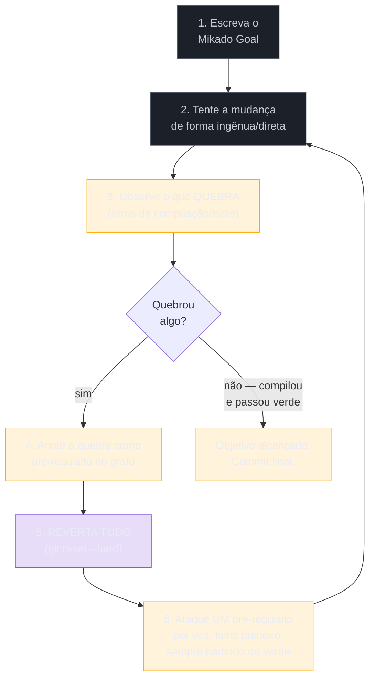
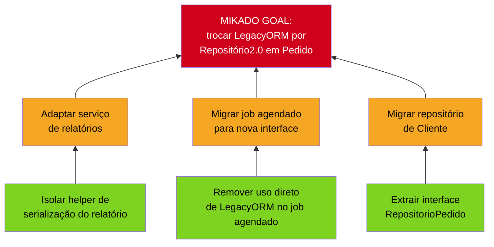

# O Método Mikado

> [!abstract] TL;DR
> A nota anterior domou um método de 240 linhas com o catálogo de Fowler — refatoração **local**, um trecho coeso por vez. Mas há mudanças que não são locais: trocar a biblioteca de acesso a dados enraizada em 80 arquivos, extrair um módulo de um monólito, migrar um framework inteiro. Toda vez que você tenta começar, a mudança revela um pré-requisito que você não via — e três horas depois seu branch está vermelho, meio-editado, com o compilador gritando em lugares que você nem lembra ter tocado. Essa é a **hidra**: você conserta uma cabeça, nascem três. O **Método Mikado** (Ola Ellnestam & Daniel Brolund, *The Mikado Method*, Manning, 2014) organiza esse caos com uma inversão contraintuitiva: em vez de consertar cada pré-requisito assim que o descobre, você **anota** e **reverte tudo** de volta ao verde — `git reset --hard`, sem dó — e só então ataca os pré-requisitos, um de cada vez, sempre partindo de um estado que compila. O produto colateral é o **grafo Mikado**: uma árvore de pré-requisitos onde as **folhas** são o que você pode fazer com segurança agora, e a **raiz** é o objetivo final (o "Mikado Goal"). Você trabalha das folhas para a raiz, cada passo commitado em verde — nunca há um branch morto, e o sistema fica entregável o tempo todo. Sob a lente do consultor: você entra num sistema alheio e ataca uma reestruturação grande sem apostar semanas num branch que pode não fechar — o Mikado revela o tamanho real do trabalho enquanto mantém tudo funcionando.

Você tenta trocar a biblioteca de acesso a dados que o sistema usa há oito anos — uma troca que, no papel, é "só" mudar a camada de persistência. Você começa pelo repositório mais óbvio, o de `Pedido`. Compila. Ajusta o de `Cliente`, que depende de um helper que a lib antiga expunha. Ajusta o helper — e descobre que ele é usado por um serviço de relatórios que ninguém tocava há dois anos. Ajusta o serviço de relatórios, que quebra um job agendado. Trinta minutos viram três horas. Seu `git status` mostra 40 arquivos modificados, metade deles por razões que você já não lembra com precisão, e o projeto não compila. Você está no meio de uma hidra: cada cabeça que você corta faz nascerem outras duas, e agora você não sabe mais se está mais perto do objetivo ou só mais fundo no buraco. É exatamente o cenário que a [[03-Dominios/Engenharia/Arqueologia e Restauração de Software/14 - Refactoring em terreno hostil|nota 14]] citou no fim, ao apontar aqui: a refatoração local — Extract Method, Extract Class, um trecho de cada vez — não dá conta quando a mudança em si é grande e as dependências ocultas se revelam só na prática, não na leitura antecipada do código.

## A analogia: o jogo Mikado

O método pega o nome do jogo de mesa homônimo (no Brasil, mais conhecido como "pega-varetas"). Você derruba um punhado de varetas coloridas numa pilha desordenada; o objetivo é remover a vareta de maior valor — em geral a preta, no fundo da pilha — sem mexer em nenhuma das outras. O truque óbvio, mas fácil de esquecer sob pressão: você não ataca a vareta do fundo primeiro. Ela está presa por todas as que estão em cima. Você remove as varetas de cima, uma a uma, começando pelas que já estão soltas — as que não têm nada apoiado nelas — e só depois de limpar o caminho é que a vareta-alvo sai livre.

O paralelo é direto: a vareta do fundo é o **Mikado Goal** — a mudança grande que você quer fazer (trocar a lib, extrair o módulo). As varetas por cima são os **pré-requisitos** — o código que precisa mudar antes, para que o objetivo saia sem derrubar o resto do sistema. E a regra do jogo — remover de cima para baixo, uma de cada vez, só as que já estão livres — é literalmente o algoritmo do método: trabalhar das **folhas** do grafo de dependências para a **raiz**, nunca ao contrário.

**A analogia em uma frase:** você não força a vareta do fundo; libera as de cima, na ordem que a própria pilha impõe, e a vareta-alvo sai sozinha quando chega a vez dela.

## O ciclo Mikado: tentar, observar, anotar, reverter

O mecanismo central do método é um ciclo curto, repetido quantas vezes forem necessárias até o grafo de pré-requisitos estar completo:

Passo a passo:

1. **Escreva o Objetivo Mikado.** Uma frase concreta e testável: "trocar `LegacyORM` por `Repositório2.0` em todos os módulos de pedido", não "melhorar a camada de dados". Sem um objetivo nítido, você não sabe quando parar de escavar pré-requisitos.
2. **Tente a mudança de forma ingênua.** Vá direto ao ponto, como se o sistema fosse desacoplado — troque a dependência, mude a assinatura, o que for. Você **sabe** que provavelmente vai quebrar algo; esse é o objetivo do passo, não uma falha.
3. **Observe o que quebra.** Erros de compilação, testes vermelhos, um comportamento que muda de forma inesperada — cada quebra é uma **dependência oculta revelada**. É informação valiosa: o sistema acabou de te contar, na prática, algo que a leitura estática do código (nota 08) ou a documentação (quando existe) não contavam.
4. **Anote, não conserte.** Cada quebra vira um nó no grafo: um pré-requisito que precisa ser resolvido antes do objetivo. O impulso natural aqui — "já que descobri, deixa eu já consertar" — é exatamente o que o próximo passo existe para bloquear.
5. **Reverta tudo.** `git reset --hard` (ou `git checkout -- .` / descarte equivalente na sua VCS). Você volta ao estado antes da tentativa — verde, compilando, sem nenhuma mudança pendurada.
6. **Ataque um pré-requisito de cada vez**, recursivamente aplicando o mesmo ciclo a cada um — começando pelos que já são **folhas** (não dependem de mais nada): resolva, rode a rede (nota 10), veja verde, **commit**. Só depois de esgotar as folhas você sobe um nível na árvore, até finalmente ter espaço livre para o objetivo original entrar sem quebrar nada.

> [!question]- Por que "tentar de forma ingênua" e não planejar tudo antes de tocar no código?
> Porque em código acoplado — o tipo que fez o sistema virar terreno hostil em primeiro lugar — as dependências ocultas não aparecem na leitura estática com confiabilidade suficiente. Você pode até desenhar um grafo de dependências de cabeça (nota 08), mas ele vai estar incompleto, porque parte do acoplamento é dinâmico, é feito por convenção, é um `import` que ninguém documentou. A tentativa ingênua não é preguiça de planejamento — é o **experimento mais barato que existe** para descobrir a dependência real: você deixa o compilador e os testes fazerem o levantamento por você, em segundos, em vez de tentar adivinhar. O preço desse experimento é zero, porque o passo 5 desfaz tudo.

**O ciclo em uma frase:** você usa a tentativa ingênua como sensor de dependências ocultas, registra o que ela revela, descarta a tentativa em si, e só depois ataca os pré-requisitos na ordem que o próprio sistema acabou de te ensinar.

## O grafo Mikado: da bagunça para a árvore navegável

Depois de algumas rodadas do ciclo, o que era uma pilha de "descobri isso, descobri aquilo" vira uma estrutura visual — o **grafo Mikado**. É uma árvore de pré-requisitos: o objetivo no topo (ou na raiz, dependendo de como você desenha), e cada nó abaixo dele é algo que precisa estar pronto antes que o nó acima possa avançar sem quebrar. As **folhas** — os nós sem filhos, sem mais pré-requisitos pendurados neles — são exatamente o que você **pode fazer agora, com segurança**, sem depender de mais nada.

O grafo acima é o retrato de três rodadas do ciclo aplicadas ao cenário de abertura: cada tentativa de tocar o objetivo revelou uma quebra, cada quebra virou um nó. As três folhas verdes (extrair a interface, isolar o helper, remover o uso direto no job) são trabalho seguro para começar amanhã de manhã — nenhuma delas depende de mais nada. Resolvidas as folhas, os nós âmbar (adaptar o serviço, migrar o job, migrar o repositório de cliente) tornam-se as novas folhas, e assim por diante, até o objetivo vermelho no topo virar alcançável — e, quando alcançado, verde.

**O grafo em uma frase:** é o mapa que emerge da experimentação, não da suposição — e ele te diz, sem ambiguidade, qual é o próximo passo seguro: sempre a folha mais próxima de você, nunca a raiz.

## Por que reverter é contraintuitivo mas genial

O instinto de quem acabou de descobrir uma dependência é resolvê-la ali mesmo — "já que abri o arquivo, já percebi o problema, deixa eu só consertar logo". O Mikado diz o oposto: reverta, e ataque essa dependência depois, na ordem certa, a partir de um estado limpo. Três razões concretas sustentam essa disciplina:

1. **O sistema fica entregável o tempo todo.** Não existe, em nenhum momento do processo, um branch morto de dias ou semanas, vermelho, que ninguém pode integrar. Se o cliente perguntar amanhã "quanto já foi feito?", a resposta é sempre "isto aqui, commitado e testado" — nunca "estou no meio de algo que ainda não sei se vai fechar". É o mesmo princípio de sempre-entregável que reaparece, na escala de sistema inteiro, no [[03-Dominios/Engenharia/Arqueologia e Restauração de Software/18 - Strangler Fig|Strangler Fig]] (nota 18, fase Magus): nunca aposte tudo num único corte grande.
2. **Cada correção nasce isolada.** Ao consertar um pré-requisito a partir do verde, você sabe exatamente o que mudou naquele passo — a mesma disciplina de não misturar reestruturação com mudança de comportamento que a nota 14 já defendia, agora aplicada em escala maior. Se o pré-requisito, sozinho, revelar *sua própria* sub-árvore de dependências, o ciclo se aplica recursivamente a ele, sem contaminar o resto do trabalho.
3. **A ordem importa, e só o revert garante que você a respeite.** Se você consertasse tudo na hora, na ordem em que as quebras aparecem — que é a ordem em que o compilador as encontra, não a ordem lógica de dependência —, você corre o risco de atacar um nó do meio da árvore antes de suas próprias dependências estarem prontas, reproduzindo a mesma bagunça de sempre, só que documentada. Reverter e recomeçar do zero, a cada vez que uma folha nova fica disponível, é o que garante que você sempre parte de um estado consistente.

**A disciplina em uma frase:** reverter não é desperdiçar o trabalho de descoberta — é separar *descobrir* de *executar*, para que a execução aconteça sempre na ordem certa, a partir de um chão firme.

## Casos práticos

### Cenário 1: due diligence — dimensionar o custo real de uma migração antes de prometer prazo

Um fundo pede um laudo: "quanto custa tirar esse sistema da lib de ORM proprietária, que está sendo descontinuada, antes de fecharmos a aquisição?" Sem o Mikado, a resposta seria um chute educado baseado em grep e intuição. Com o Mikado, você roda duas ou três iterações do ciclo num branch descartável — tenta a troca no módulo mais simples, observa o que quebra, anota, reverte — e em duas horas tem um **grafo real**, não uma estimativa: 14 pré-requisitos identificados, 4 deles folhas triviais, 6 de complexidade média, 4 que tocam código sem nenhuma rede de testes (sinal para acionar a nota 10 antes de tocar). O laudo entrega o grafo como anexo: não é "acho que leva um trimestre", é "aqui estão as 14 dependências reais, medidas na prática, com estimativa por nó". É o argumento mais forte que existe num laudo — evidência experimental, não opinião.

### Cenário 2: extrair um módulo de um monólito sem parar o time por semanas

O cliente quer extrair o módulo de faturamento de um monólito de dez anos para um serviço separado. A tentação é abrir um branch longo, "isolar tudo primeiro, depois integrar". Em vez disso, você aplica o Mikado: o objetivo é "faturamento não importa mais nada de fora do seu próprio pacote". Primeira tentativa ingênua — mover o pacote — revela seis imports quebrados. Reverte, anota os seis como pré-requisitos. Ataca as duas folhas (um helper de formatação de moeda sem dependência nenhuma, um enum duplicado em dois lugares), commita as duas em separado, ainda no monólito, ainda entregável. Duas semanas depois, com o time inteiro continuando a entregar features no monólito em paralelo — porque nunca houve um branch vermelho bloqueando ninguém — o grafo está reduzido a duas folhas finais, e a extração real acontece num único commit pequeno, quase anticlimático, porque todo o risco já foi drenado nas iterações anteriores.

## Armadilhas comuns

> [!warning] Consertar na hora em vez de reverter, deixando o branch inchar
> **O que acontece:** você segue o impulso natural — "já que vi o problema, já resolvo" — e o branch cresce passo a passo, sem nunca voltar ao verde, até virar exatamente a hidra da abertura desta nota. **Por quê:** cada correção feita fora de ordem pode depender de outra correção que ainda não existe, gerando mais quebras em cima de quebras não resolvidas — o mesmo emaranhado, só que maior e sem rastreabilidade nenhuma de qual mudança causou o quê. **Como evitar:** trate o passo 5 do ciclo (`git reset --hard`) como não-negociável. A tentativa ingênua existe para gerar informação, não código de produção; descarte-a sempre.

> [!warning] Atacar a raiz (ou o meio da árvore) antes das folhas
> **O que acontece:** o grafo aponta claramente que um nó tem dois pré-requisitos ainda não resolvidos, mas a pressão do prazo empurra você a tentar mesmo assim — "vamos tentar, talvez dessa vez funcione". **Por quê:** o nó ainda depende de algo que não está pronto; a tentativa vai quebrar de novo, pelas mesmas razões já documentadas no grafo, desperdiçando o ciclo em vez de avançar por ele. **Como evitar:** trabalhe estritamente das folhas para a raiz. Se um nó parece urgente mas tem pré-requisitos pendentes, resolva os pré-requisitos primeiro — o grafo existe exatamente para impor essa disciplina contra a pressão do prazo.

> [!warning] Deixar o grafo só na cabeça, sem registrar
> **O que acontece:** depois de duas ou três rodadas do ciclo, você já "sabe" quais são os pré-requisitos e para de desenhar o grafo — confia na memória. **Por quê:** o valor do grafo não é só de execução, é de **comunicação**: sem ele registrado (num quadro, num arquivo, num board), ninguém mais no time consegue pegar uma folha e trabalhar nela em paralelo, e você perde o rastro exato de por que cada nó existe quando a pressão do prazo faz você esquecer o raciocínio original. **Como evitar:** desenhe o grafo de verdade — post-its, quadro branco, arquivo — e atualize-o a cada rodada do ciclo. Ele é o ativo que sobrevive à sessão de trabalho, não a mudança em si.

> [!warning] Confundir "compilou" com "seguro"
> **O que acontece:** você trata "o código compila de novo depois de reverter" como sinal de verde suficiente, sem rodar a rede de characterization tests. **Por quê:** compilar prova só que a sintaxe está correta; não prova que o comportamento observável não mudou — o mesmo risco que a [[03-Dominios/Engenharia/Arqueologia e Restauração de Software/10 - A rede de segurança primeiro|nota 10]] já descreveu para qualquer refatoração em terreno hostil. **Como evitar:** "verde", no ciclo Mikado, significa compilação **e** rede de testes passando — nunca só um dos dois. Cada commit de folha resolvida deve rodar a mesma rede que ampara o restante do trabalho de reestruturação (notas 10-12).

## Como explicar em inglês

Quando te perguntarem, em entrevista, como você ataca uma refatoração grande e emaranhada num sistema legado:

> "For changes too big and tangled for local refactoring — swapping a deeply-rooted dependency, extracting a module from a monolith — I use the **Mikado Method**. I write the goal, attempt the change naively, and let the compiler and test suite reveal hidden dependencies as failures. Instead of fixing what breaks on the spot, I record it as a prerequisite in a graph and **revert everything** back to green. Then I work the graph leaf-first — tackling the prerequisites that have no dependencies of their own, committing each one from a clean, compiling state — until the path to the original goal is clear. The counterintuitive part is the revert: it feels wasteful, but it's what keeps the system shippable at every point in the process, instead of betting weeks on a branch that might not even close. The Mikado graph itself becomes the estimate — not a guess, but a map built from actually probing the system."

| PT | EN |
|----|----|
| Método Mikado | Mikado Method |
| Objetivo Mikado | Mikado Goal |
| grafo Mikado | Mikado Graph |
| pré-requisito | prerequisite |
| folha (do grafo) | leaf |
| raiz / objetivo | root / goal |
| tentativa ingênua | naive attempt |
| reverter tudo | revert everything / `git reset --hard` |
| sempre entregável | always shippable / always releasable |
| branch morto/inchado | dead / bloated branch |

## O que vem a seguir

O Mikado te dá uma **estratégia de execução** para a mudança grande — mas não decide se a mudança vale a pena, nem escolhe *para onde* migrar. Essa é a pergunta da fase Magus: qual dos seis ou sete R's (manter, restaurar, substituir, aposentar...) você aplica a este sistema, e com que framework de decisão? Aponte também para dentro da própria fase Adepto: antes de fechar este bloco, falta cobrir o outro acelerador — e o outro risco — que mudou o ofício nos últimos anos.

- [[16 - IA como acelerador e seus riscos]] — fecha a fase Adepto: LLMs aplicados à engenharia reversa e à geração de código em terreno hostil, e a regra que os protege de piorar o emaranhado — characterization antes de deixar a IA mudar qualquer coisa.
- [[03-Dominios/Engenharia/Arqueologia e Restauração de Software/17 - Frameworks de decisão|17 - Frameworks de decisão]] — fase Magus: os R's e o TIME (Gartner) que decidem *se* e *para onde* migrar; o Mikado é a técnica de execução que essa decisão, uma vez tomada, vai reutilizar.
- [[03-Dominios/Engenharia/Arqueologia e Restauração de Software/18 - Strangler Fig|18 - Strangler Fig]] — fase Magus: o mesmo princípio de sempre-entregável, na escala de sistema inteiro em vez de um módulo.

## Fontes

- **Ola Ellnestam & Daniel Brolund** — [*The Mikado Method*](https://www.manning.com/books/the-mikado-method) (Manning, 2014) — a obra-fonte: o ciclo tentar/observar/reverter, o grafo Mikado, o Mikado Goal.
- **Manning** — [capítulo 1 gratuito (PDF)](https://manning-content.s3.amazonaws.com/download/3/558b9be-92a7-4ebf-90ba-c7fdd830aea7/MikadoMethod_CH01.pdf) — introdução ao método com o exemplo original dos autores.
- **ACM Digital Library** — [ficha do livro](https://dl.acm.org/doi/book/10.5555/2631379) — registro bibliográfico formal (ISBN 978-1-61729-121-0, 240 páginas).
- **Methods & Tools** — [*What is the Mikado Method?*](https://www.methodsandtools.com/archive/mikado.php) — resumo prático do ciclo e do grafo, com exemplo de aplicação.

## Veja também

- [[03-Dominios/Engenharia/Arqueologia e Restauração de Software/index|Arqueologia e Restauração de Software (MOC)]]
- [[03-Dominios/Engenharia/Arqueologia e Restauração de Software/14 - Refactoring em terreno hostil|Refactoring em terreno hostil]] — a refatoração local que este método complementa quando a mudança é grande demais para caber num catálogo de transformações nomeadas
- [[03-Dominios/Engenharia/Arqueologia e Restauração de Software/13 - Técnicas cirúrgicas|Técnicas cirúrgicas]] — Sprout/Wrap para adição pontual; contraste direto com o Mikado, que é para reestruturação ampla
- [[03-Dominios/Engenharia/Arqueologia e Restauração de Software/10 - A rede de segurança primeiro|A rede de segurança primeiro]] — a rede que define "verde" em cada passo do ciclo
- [[03-Dominios/Engenharia/Arqueologia e Restauração de Software/12 - Seams e quebra de dependência|Seams e quebra de dependência]] — quebrar dependência costuma ser um dos pré-requisitos que o grafo revela
- [[03-Dominios/Engenharia/Arqueologia e Restauração de Software/18 - Strangler Fig|Strangler Fig]] — o mesmo princípio de sempre-entregável, aplicado à modernização de sistema inteiro
