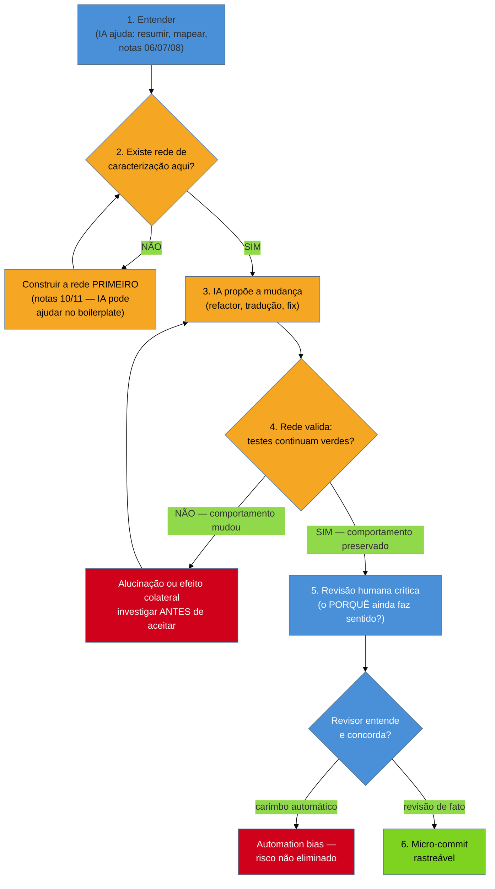

# IA como acelerador e seus riscos

> [!abstract] TL;DR
> Um dev pede ao agente de codificação para "modernizar" um módulo legado de 600 linhas. A IA devolve
> uma versão limpa, com nomes melhores, sem o `if` estranho que "não fazia sentido". O dev revisa por
> alto — o diff parece razoável, os testes que existiam (poucos) continuam verdes — e mergeia. Duas
> semanas depois, um cliente específico para de conseguir fazer um tipo de pedido que só ele fazia: o
> `if` removido era uma regra de negócio, não um resíduo. **A regra de ouro desta nota:** a IA é um
> gerador plausível de código, não um garantidor de comportamento; a única coisa que transforma "plausível"
> em "seguro" é a rede de caracterização ([[10 - A rede de segurança primeiro|nota 10]] e
> [[11 - Approval e Golden Master testing|nota 11]]) — construída **antes** de deixar a IA tocar em
> qualquer coisa, não depois. No legado, a IA acelera de verdade a compreensão (leitura, mapas,
> documentação, characterization tests) e a execução mecânica de refatorações já decididas
> (notas 12-14); ela **não substitui** o julgamento sobre o que aquele código deveria fazer, porque
> esse julgamento depende de uma teoria histórica ([[07 - Arqueologia do histórico|nota 07]]) que a IA
> nunca teve acesso. Esta é a nota que **fecha a fase Adepto**: você sai dela sabendo mudar rápido *e*
> com segurança — a fase Magus que vem a seguir decide, com essa velocidade em mãos, o destino do
> sistema.

Um desenvolvedor pleno herda um módulo de cálculo de frete: 600 linhas, sem testes, um `if` no meio que
compara um código de cliente contra uma lista de números mágicos e aplica um desconto que ninguém sabe
explicar. Ele abre um agente de codificação e pede: "modernize este módulo, está uma bagunça". A IA
devolve algo genuinamente melhor de se ler — funções pequenas, nomes descritivos, um switch em vez de um
emaranhado de `if`s. E ela removeu aquele `if` esquisito, com um comentário educado: "lógica redundante
removida — o desconto já é coberto pela regra geral de fidelidade". O dev olha o diff, acha bonito, roda
a suíte de testes (três testes, todos sobre o caminho feliz), tudo verde. Mergeia. Duas semanas depois, o
time de vendas liga: um cliente específico, com um contrato antigo negociado por telefone há quatro anos,
parou de receber o desconto que fazia parte do acordo dele. Não existe documento. Não existe ticket. O
único lugar onde aquele acordo ainda vivia era naquele `if` — e a IA, corretamente do ponto de vista dela,
"limpou" o que parecia código morto.

Ninguém mentiu para ninguém aqui. A IA fez exatamente o que fazem os modelos de linguagem: gerou a
continuação mais plausível para "modernize este código", e código morto sem explicação *parece* mesmo
redundante. O erro não foi da IA — foi do processo que deixou a IA mudar comportamento sem nada que
pudesse detectar a mudança antes do cliente.

## Onde a IA acelera de verdade neste galho

Antes da regra de ouro, vale nomear com precisão o que a IA compra — porque o risco só faz sentido em
contraste com o ganho real. Em cada fase anterior deste galho, há uma tarefa específica onde um LLM reduz
o tempo de forma honesta, sem exigir que ele "entenda" o sistema como você entende:

- **Compreensão e leitura** ([[06 - Lendo código que você não escreveu|nota 06]]): colar um método
  críptico de 200 linhas e pedir "explique o que isso faz, passo a passo" costuma produzir um resumo
  plausível e útil mais rápido do que você leria sozinho — o LLM é bom em parafrasear texto (e código é
  texto) que já está na frente dele. Também serve para gerar um primeiro rascunho de diagrama de
  dependências a partir de um arquivo grande, ou um mapa mental de um módulo inteiro — um ponto de
  partida para o [[08 - Engenharia reversa e recuperação de arquitetura|reflexion model da nota 08]], não
  um substituto dele.
- **Documentação** ([[07 - Arqueologia do histórico|nota 07]]): pedir um rascunho de ADR, de comentário
  de topo de arquivo, ou de resumo de um módulo a partir do código e das mensagens de commit acelera a
  *redação*. A IA é boa em transformar informação que **já existe** (o diff, o commit, a issue linkada)
  em prosa legível. Ela não é boa — e aqui mora o risco tratado adiante — em *inventar* o porquê quando a
  informação não existe.
- **Rede de segurança** ([[10 - A rede de segurança primeiro|nota 10]] e
  [[11 - Approval e Golden Master testing|nota 11]]): gerar o boilerplate de um characterization test —
  a estrutura do teste, a chamada ao método, até sugerir quais entradas testar a partir dos caminhos que
  ela identifica no código — é trabalho mecânico que a IA faz bem. A *asserção-que-sabe-que-vai-falhar* e
  a leitura do valor real continuam sendo você quem confere, mas o esqueleto do teste sai mais rápido.
- **Refatoração e tradução** (notas [[12 - Seams e quebra de dependência|12]]–
  [[14 - Refactoring em terreno hostil|14]]): sugerir onde extrair uma interface, propor a tradução
  mecânica de uma sintaxe antiga para uma moderna (de uma versão de linguagem para outra, de um framework
  morto para um vivo), ou aplicar uma receita de refactoring conhecida — isso é exatamente o tipo de
  transformação sintática em que um LLM (e as ferramentas de refactoring automatizado que ele potencializa)
  brilha, como já apontado na nota 14.

**Em uma frase:** a IA comprime o tempo de "não entendo nada" para "tenho um rascunho de mapa e um
rascunho de rede" — o maior gargalo do consultor que entra de fora ([[03 - A lente do consultor|nota
03]]). O que ela não compra é julgamento: decidir se o rascunho está certo continua seu.

> [!info] O funcionamento interno dos agentes de codificação não é o assunto desta nota
> Como um agente de codificação decide qual arquivo abrir, que ferramentas chamar, como o loop
> *plan → act → observe* funciona por dentro, e como diferentes ferramentas (Claude Code, Cursor, Aider,
> Copilot Agents...) se comparam em benchmarks como SWE-bench — isso é o território do galho
> [[03-Dominios/Tecnologia/IA/Agentes de Codificação/index|Agentes de Codificação]]. Esta nota assume que
> você já sabe *pedir* a um agente para fazer algo; o assunto aqui é *quando* e *sob que salvaguarda* isso
> é seguro especificamente em terreno legado.

## A regra de ouro: rede antes de IA, sempre

Aqui está a espinha da nota, e ela cabe numa frase: **você nunca deixa a IA mudar comportamento de código
que não está sob uma rede de caracterização.** Não "de preferência". Não "quando der tempo". Sempre.

O mecanismo é simples de enunciar e fácil de esquecer sob pressão. Um LLM gera a continuação mais
*plausível* para o seu pedido — "modernize", "simplifique", "corrija o bug X", "traduza para Kotlin". Ele
não tem acesso a um oráculo de comportamento correto; ele tem acesso ao texto do código e ao seu prompt.
Quando o código tem uma regra de negócio embutida sem explicação — o `if` do cenário de abertura, a
[[02 - A mentalidade do restaurador|Cerca de Chesterton]] que a nota 02 já avisou que existe em toda parte
esquisita do legado — a IA não tem como distinguir "isso é lixo acumulado" de "isso é um contrato com um
cliente que ninguém documentou". As duas coisas *parecem* idênticas no texto. A única coisa que distingue
uma da outra é o comportamento observado em produção ao longo do tempo — exatamente o que a rede de
caracterização registra e a IA nunca viu.

Por isso a rede não é burocracia — é o único instrumento que consegue responder, em segundos, à pergunta
que a IA é estruturalmente incapaz de responder sozinha: **"esta mudança preservou o que o sistema fazia
antes?"** Sem characterization tests ([[10 - A rede de segurança primeiro|nota 10]]) cobrindo o método, ou
approval tests ([[11 - Approval e Golden Master testing|nota 11]]) cobrindo a saída, você não tem como
saber — só pode *acreditar* no diff, e acreditar é exatamente o que a nota 10 chamou de "salto no escuro"
em vez de "experimento controlado".

Repare no que o diagrama força: a caixa 2 é um **gate**, não uma formalidade. Se a resposta é "não" e você
segue em frente mesmo assim — pulando direto para "IA propõe a mudança" — você recriou exatamente o
cenário de abertura desta nota. E repare também na bifurcação da caixa 4 (H): a rede passar de verde não
é o fim da história se o carimbo humano na revisão for automático. Isso é o próximo risco.

> [!question]- Se a IA pode até gerar o boilerplate da rede, por que a ordem importa tanto — não dá pra fazer os dois juntos?
> Dá, e é exatamente o que a nota recomenda: peça à IA o characterization test **primeiro**, revise que
> ele de fato caracteriza o comportamento atual (não o que você *acha* que deveria ser), rode e confirme
> que está verde contra o código como está — e só **depois** peça a mudança de comportamento. A ordem que
> importa não é "IA nunca antes de tudo"; é "a rede precisa estar validada e travada *antes* da mudança de
> comportamento ser aceita", porque é essa trava que vai detectar se a mudança seguinte alterou algo que
> não devia. Pedir os dois no mesmo prompt ("modernize e adicione testes") é o jeito mais comum de furar a
> regra sem perceber: a IA pode gerar testes que já validam a *versão nova*, não a antiga — e aí a rede não
> protege nada, só documenta a própria mudança que deveria estar sendo verificada.

**A regra de ouro em uma frase:** a IA gera o que é plausível, a rede confirma o que é verdadeiro sobre o
comportamento — e no legado, onde o custo de uma mudança sutilmente errada é mais alto porque ninguém mais
lembra do porquê original, você nunca troca a segunda coisa pela primeira.

## Os riscos específicos no legado — o mecanismo de cada um

### Alucinação de comportamento e de API

O risco mais citado sobre LLMs em geral ganha um peso diferente aqui: a IA pode afirmar, com total
confiança sintática, que um método faz algo que ele não faz — que uma função de uma biblioteca interna
tem um parâmetro que na verdade não existe, ou que um efeito colateral conhecido (uma escrita em cache, um
disparo de evento) simplesmente não acontece. Num código novo, bem documentado, com testes, isso é
irritante mas detectável rápido: o compilador reclama, o teste falha, o IDE sublinha vermelho. Num sistema
legado sem documentação e sem rede, a alucinação sobre comportamento **não tem contra quem se confrontar**
— não existe doc para checar, não existe teste que discorde. Ela só é descoberta quando o efeito colateral
que a IA garantiu não existir aparece em produção.

### Perda da teoria — a IA adora derrubar cercas que não entende

Esta é a face mais perigosa por ser a mais sedutora: código "limpo" parece sempre uma melhoria. Mas a
[[02 - A mentalidade do restaurador|Cerca de Chesterton da nota 02]] existe precisamente para esse
momento — antes de remover algo que parece sem sentido, alguém deveria perguntar por que foi colocado ali.
Um humano cético consegue, ao menos, sentir o desconforto e ir checar o `git blame`
([[07 - Arqueologia do histórico|nota 07]]). Uma IA não sente desconforto: ela otimiza para o pedido
("simplifique", "modernize", "remova código morto") e o `if` esquisito, sintaticamente, *parece* código
morto. A IA nunca teve acesso à teoria do sistema — ao porquê histórico que só existe, quando existe, na
cabeça de alguém ou nas entrelinhas do histórico de commits. Ela lê o presente do texto, não o passado da
decisão.

### Contexto limitado — ela vê o trecho, não o sistema

Um LLM trabalha com o que está na janela de contexto: o arquivo que você colou, talvez alguns arquivos
vizinhos que o agente decidiu abrir. Ela não vê, a menos que você a aponte explicitamente, o acoplamento
temporal que a forense da [[09 - Forense de software|nota 09]] revela — aquele módulo que muda *junto* com
outro sem nenhuma dependência estática entre eles, só porque os dois implementam a mesma regra de negócio
em paralelo. Uma sugestão de mudança local, perfeitamente razoável olhando só o arquivo aberto, pode
quebrar algo a três camadas de distância que nunca apareceu no prompt.

### Confiança automática — o automation bias

Mesmo com a rede no lugar, existe um segundo colapso possível: o revisor humano vê "testes verdes" e
carimba o diff sem de fato ler o que mudou — a mesma armadilha que a nota 11 já nomeou para approval
testing ("aprovar cegamente"), agora aplicada à saída da IA em vez da saída do código. Esse fenômeno tem
nome na literatura de fatores humanos: **automation bias**, a tendência de confiar excessivamente na
saída de um sistema automatizado, relaxando a própria vigilância crítica exatamente porque a ferramenta
parece competente. Testes verdes provam que o comportamento *coberto pela rede* não mudou; não provam que
a mudança faz sentido, nem que a rede cobre tudo que importa. A revisão humana depois da rede não é
redundância — é a camada que julga o *porquê*, que nenhuma rede automatizada consegue avaliar.

### Vazamento — a lente do consultor aplicada a dados

Por fim, um risco que é puramente da posição do consultor ([[03 - A lente do consultor|nota 03]]): você
frequentemente está lendo código de **outra empresa** — um cliente, uma aquisição em due diligence, um
sistema herdado sob NDA. Colar trechos desse código, ou pior, dados reais de produção usados para gerar um
characterization test, numa ferramenta de IA externa cujo contrato de dados você não auditou é um risco de
vazamento de propriedade intelectual e, em muitos casos, uma violação contratual direta. A pergunta que
precede qualquer uso de IA em código de terceiro não é técnica — é "este contrato me permite colar isso
aqui?".

## Casos práticos

### Cenário 1: due diligence acelerada — ler um monólito de 300 mil linhas em dias, não semanas

Você tem duas semanas para dar um parecer de risco técnico sobre uma aquisição, um cenário parecido com o
da [[08 - Engenharia reversa e recuperação de arquitetura|nota 08]]. O sistema é um monólito Java sem
documentação viva. Você usa um agente de codificação para acelerar exatamente as partes de leitura: pedir
resumos módulo a módulo, gerar um primeiro rascunho do grafo de dependências para alimentar o reflexion
model, e resumir os commits mais densos dos últimos dois anos para localizar onde a "teoria" mais mudou.
Nada disso *modifica* o sistema — é leitura acelerada, não escrita. O parecer final continua sendo seu
julgamento, apoiado em evidência que a IA ajudou a reunir mais rápido; você não assina "a IA disse que o
sistema está saudável", você assina o que *você* concluiu a partir do mapa que a IA ajudou a desenhar.

### Cenário 2: tradução de framework — characterization tests antes da IA reescrever uma linha

Um cliente precisa migrar um serviço de um framework web morto para um vivo. Antes de pedir à IA
qualquer reescrita, você segue a regra de ouro à risca: para cada endpoint do serviço antigo, escreve
(com ajuda da IA para o boilerplate) um characterization test que grava request-resposta reais contra o
sistema rodando — um approval test no estilo da [[11 - Approval e Golden Master testing|nota 11]], porque
as respostas são JSONs grandes demais para caracterizar campo a campo. Só depois de ter essa rede rodando
e verde contra o código *antigo* você pede à IA para traduzir cada endpoint para o framework novo. Cada
tradução roda contra a mesma bateria de approval tests. Quando um teste quebra, você não corrige o teste
para "passar" — você investiga se foi uma tradução incorreta (o caso comum) ou uma correção intencional de
comportamento (que exige atualizar o snapshot aprovado, deliberadamente, como a nota 10 já ensinou a fazer
com asserções). A velocidade da tradução mecânica vem da IA; a garantia de que nada quebrou vem
inteiramente da rede que você recusou pular.

## Armadilhas comuns

> [!warning] Deixar a IA mudar comportamento sem rede de caracterização
> **O que acontece:** o time pede a uma IA para "limpar", "modernizar" ou "corrigir" um trecho de código
> legado sem testes, revisa o diff por cima, e mergeia — repetindo o cenário de abertura desta nota.
> **Por quê:** a IA gera a continuação mais plausível para o pedido; sem uma rede que confirme o
> comportamento antes e depois, não existe forma barata de distinguir uma limpeza correta de uma perda
> silenciosa de regra de negócio.
> **Como evitar:** trate a caixa "existe rede aqui?" do fluxo desta nota como um gate de verdade, não uma
> sugestão. Se a resposta é não, a primeira tarefa da IA é ajudar a construir a rede — não a mudança em si.

> [!warning] Aceitar a explicação da IA como verdade sobre o comportamento
> **O que acontece:** a IA explica "este método aplica um desconto de fidelidade padrão, o resto é
> redundante" e o time aceita essa explicação como se fosse um fato verificado, em vez de uma hipótese a
> confirmar.
> **Por quê:** um LLM narra o código com a mesma fluência e confiança sintática que teria narrando algo
> verdadeiro; a fluência da explicação não é evidência de que ela está correta, especialmente quando o
> código não tem documentação para contrastar.
> **Como evitar:** trate toda explicação da IA sobre comportamento como uma hipótese de leitura, no mesmo
> nível de uma leitura sua própria — e confirme contra a única fonte de verdade disponível: o comportamento
> observado (rodar o código, checar o histórico da nota 07, ou caracterizar com um teste).

> [!warning] Vazar código ou dados de cliente para uma ferramenta externa
> **O que acontece:** um consultor cola um trecho de código proprietário — ou pior, dados reais de
> produção para gerar um caso de teste — numa ferramenta de IA de terceiros sem checar o contrato de
> dados dela.
> **Por quê:** sob a lente do consultor ([[03 - A lente do consultor|nota 03]]), você frequentemente
> está de posse temporária do código e dos dados de *outra* empresa; o contrato com o cliente raramente
> autoriza compartilhar isso com um provedor externo, e o contrato da própria ferramenta de IA pode
> reter esse conteúdo.
> **Como evitar:** confirme antes de colar qualquer coisa: a ferramenta é aprovada pelo cliente/empregador
> para este tipo de dado? Existe opção *on-premise* ou de retenção zero? Dados reais de produção podem
> ser anonimizados antes de virarem input de um characterization test?

## Como explicar em inglês

Quando te perguntarem, em entrevista, como você usa IA para acelerar trabalho em sistemas legados sem
deixar isso virar um risco:

> "AI coding agents are a real accelerator on legacy systems — for comprehension: summarizing a cryptic
> method, drafting a dependency map, writing the boilerplate for a characterization test. But I follow one
> non-negotiable rule: I never let an AI change behavior in code that isn't under a characterization or
> approval test suite first. An LLM generates the most *plausible* continuation of my prompt — it has no
> way to tell a genuinely dead code path from an undocumented business rule that a single client depends
> on, because both look identical in the text. The safety net is what actually verifies whether behavior
> was preserved; without it, I'm just trusting a diff that looks reasonable. I also treat the AI's
> explanation of what code does as a hypothesis, not a fact — it can hallucinate behavior with full
> confidence — and I never paste a client's proprietary code into an external tool without checking the
> data contract first. The AI compresses the 'I understand nothing' phase into 'I have a draft map'; the
> judgment about what the system *should* do stays mine."

| PT | EN |
|----|----|
| acelerador (IA) | accelerator |
| gerador plausível (vs. garantidor de comportamento) | plausible generator (vs. behavior guarantor) |
| alucinação de comportamento/API | behavior/API hallucination |
| viés de automação | automation bias |
| carimbar o diff | rubber-stamp the diff |
| rede de caracterização | characterization/safety net |
| teoria perdida | lost system theory |
| vazamento de dados/código | data/code leakage |
| revisão humana crítica | critical human review |
| janela de contexto | context window |

## O que vem a seguir

Esta nota fecha a fase **Adepto**: você agora sabe entender o sistema (Iniciado), reconstruir seu mapa e
sua história (notas 08-09), construir a rede que torna qualquer mudança segura (notas 10-11), operar
cirurgicamente dentro dela (notas 12-14), lidar com mudanças grandes e emaranhadas
([[15 - O Método Mikado|nota 15]]) — e agora, acelerar tudo isso com IA sem trocar velocidade por
desastre. Você sai daqui sabendo **mudar** um sistema legado com segurança e rapidez.

O que falta é outra pergunta inteiramente: dado que você agora consegue mudar com segurança, **o que você
deveria fazer** com esse sistema? Mantê-lo como está, restaurá-lo aos poucos, substituí-lo por partes,
aposentá-lo? Essa é a virada da fase **Magus**, que abre com
[[17 - Frameworks de decisão]] — os R's da modernização e o framework TIME. De "como mudar com segurança"
para "o que decidir sobre o destino do sistema".

- [[10 - A rede de segurança primeiro]] e [[11 - Approval e Golden Master testing]] — o pré-requisito
  desta nota: sem rede, nenhuma sugestão de IA pode ser validada.
- [[02 - A mentalidade do restaurador]] — a Cerca de Chesterton, a razão pela qual "limpar" código sem
  entender o porquê é sempre um risco, com ou sem IA.
- [[07 - Arqueologia do histórico]] — onde mora o porquê que a IA não tem acesso.
- [[08 - Engenharia reversa e recuperação de arquitetura]] e [[09 - Forense de software]] — o que a IA
  acelera (mapa, resumo) e o que ela não vê sozinha (acoplamento temporal, contexto além da janela).
- [[03-Dominios/Tecnologia/IA/Agentes de Codificação/index|Agentes de Codificação]] — como esses agentes
  funcionam por dentro, arquitetura e comparação de ferramentas.
- [[17 - Frameworks de decisão]] — a próxima nota: decidir o destino do sistema, agora que mudar com
  segurança deixou de ser o gargalo.

## Fontes

- **Michael Feathers** — *Working Effectively with Legacy Code* (2004) — a base da regra de ouro: sem rede
  de caracterização, nenhuma mudança (humana ou de IA) é verificável.
- **Anthropic** — [*Claude Code overview*](https://docs.claude.com/en/docs/claude-code/overview) — documentação oficial de um agente de codificação, referência de capacidades e limites de contexto tratados nesta nota.
- **National Institute of Standards and Technology (NIST)** — [*Taxonomy of Human and Automation Interaction*](https://www.nist.gov/publications) e literatura clássica de fatores humanos sobre **automation bias** (Parasuraman & Manzey, *Complacency and Bias in Human Use of Automation*, 2010) — o mecanismo por trás de carimbar diffs de IA sem revisão crítica.
- **OWASP** — [*OWASP Top 10 for Large Language Model Applications*](https://owasp.org/www-project-top-10-for-large-language-model-applications/) — risco de vazamento de dados sensíveis via prompts para ferramentas de IA externas.
- Este galho — [[03-Dominios/Engenharia/Arqueologia e Restauração de Software/index|Arqueologia e Restauração de Software]] — a rede de segurança (10-11) e a arqueologia do histórico (07) que esta nota assume como pré-requisito.

## Veja também

- [[03-Dominios/Engenharia/Arqueologia e Restauração de Software/index|Arqueologia e Restauração de Software (MOC)]]
- [[03-Dominios/Engenharia/Arqueologia e Restauração de Software/10 - A rede de segurança primeiro|A rede de segurança primeiro]] — a salvaguarda central desta nota
- [[03-Dominios/Engenharia/Arqueologia e Restauração de Software/11 - Approval e Golden Master testing|Approval e Golden Master testing]] — a rede para saídas grandes/opacas
- [[03-Dominios/Engenharia/Arqueologia e Restauração de Software/02 - A mentalidade do restaurador|A mentalidade do restaurador]] — a Cerca de Chesterton
- [[03-Dominios/Engenharia/Arqueologia e Restauração de Software/07 - Arqueologia do histórico|Arqueologia do histórico]] — onde mora o porquê que a IA não vê
- [[03-Dominios/Engenharia/Arqueologia e Restauração de Software/08 - Engenharia reversa e recuperação de arquitetura|Engenharia reversa e recuperação de arquitetura]] — o mapa que a IA ajuda a rascunhar
- [[03-Dominios/Engenharia/Arqueologia e Restauração de Software/09 - Forense de software|Forense de software]] — o acoplamento temporal fora da janela de contexto da IA
- [[03-Dominios/Tecnologia/IA/Agentes de Codificação/index|Agentes de Codificação]] — como os agentes funcionam por dentro
- [[03-Dominios/Engenharia/Arqueologia e Restauração de Software/17 - Frameworks de decisão|Frameworks de decisão]] — a próxima fase: decidir o destino do sistema
