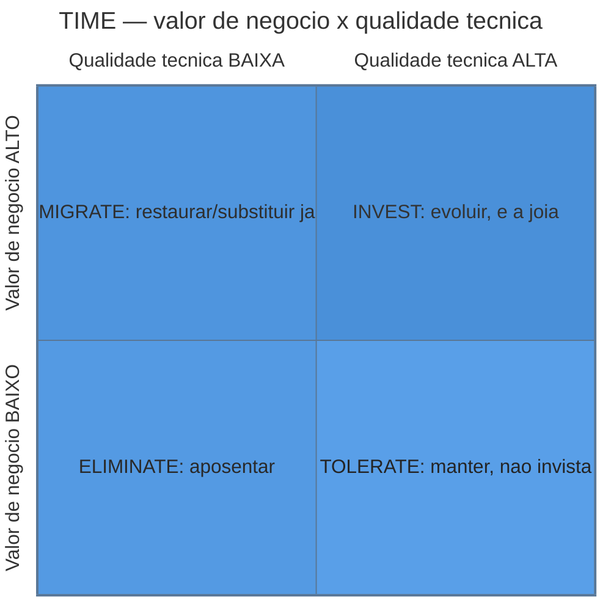
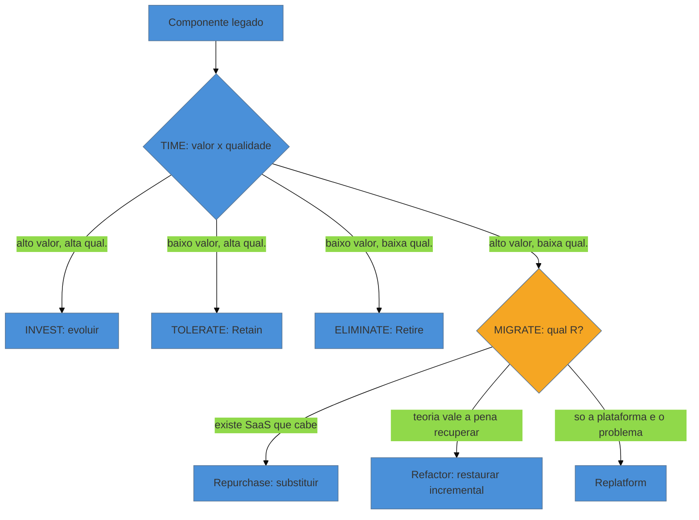

# Frameworks de decisão

> [!abstract] TL;DR
> Você já sabe mudar um sistema legado sem quebrá-lo — as fases anteriores lhe deram a rede de
> segurança (notas 10-11), os seams (nota 12), o bisturi (notas 13-14) e o mapa de pré-requisitos
> (nota 15). Mas *saber mudar com segurança* não responde à pergunta que o dono do sistema realmente
> faz: **este código merece ser mudado?** A fase Magus abre com essa virada — de *como intervir* para
> *se, onde e por quê intervir*. Esta nota dá o vocabulário de decisão: os **7 R's** da modernização
> (Retain, Rehost, Replatform, Repurchase, Refactor, Retire, Relocate — Gartner→AWS) como cardápio de
> destinos possíveis para *um* componente, e o **modelo TIME** de Gartner (Tolerate, Invest, Migrate,
> Eliminate) como a lente de portfólio que decide *quais* componentes recebem qual verbo, cruzando
> **valor de negócio × qualidade técnica**. No centro está o debate mais caro da carreira de um
> restaurador: **rewrite total vs. incremento** — e por que Spolsky chamou reescrever do zero de "o
> pior erro estratégico que uma empresa de software pode cometer", com o contraponto de quando o
> rewrite de fato se justifica. A tese do galho reaparece aqui em sua forma mais afiada: você não
> decide o destino do *código*, decide o destino da **teoria** que ele carrega ([[03-Dominios/Engenharia/Complexidade de Software/04 - O programa como teoria|teoria de Naur]]).

Seis meses depois de assumir a manutenção de uma plataforma de logística, um consultor sênior é
chamado para uma reunião que ele sabia que viria. O diretor de tecnologia coloca a pergunta na mesa
sem rodeios: *"Esse sistema tem quinze anos. Metade do time que o escreveu já foi embora. A gente
reescreve tudo do zero, contrata um time novo, faz do jeito certo — ou continua remendando?"* Todos
na sala já têm uma resposta emocional. Os desenvolvedores mais novos querem o rewrite: código limpo,
stack moderna, nada de gambiarra. O gerente financeiro quer remendar: rewrite é caro e arriscado. O
diretor quer que *alguém* decida com autoridade, porque a decisão errada custa um ano de trabalho e,
possivelmente, o emprego de quem a defendeu.

O erro que quase todo mundo comete nessa sala é tratar isso como uma pergunta binária e monolítica —
*reescrever tudo* ou *manter tudo* — quando ela nunca é nem binária nem monolítica. Um sistema legado
não é um bloco: é um portfólio de componentes com valores e qualidades muito diferentes. O módulo de
faturamento pode ser um horror técnico que sustenta 80% da receita; o gerador de relatórios pode ser
código impecável que ninguém usa há dois anos. Aplicar o mesmo verbo aos dois é garantir o desperdício:
ou você joga fora algo valioso, ou investe pesado em algo morto. **O trabalho do Magus não é escolher
um destino para o sistema — é atribuir o destino certo a cada parte dele.** E para isso é preciso um
vocabulário melhor do que "reescrever" e "remendar".

## O cardápio de destinos: os 7 R's

Antes de decidir *o quê* fazer com um componente, você precisa saber quais opções existem. A indústria
convergiu, ao longo de quinze anos, para um cardápio de sete verbos — os **7 R's**. A história da lista
importa porque explica seu viés: Gartner publicou os **5 R's** originais em 2010 (Richard Watson), num
contexto de *migração de aplicações para a nuvem*; a AWS os reduziu e reorganizou em **6 R's** em 2016
(Stephen Orban), acrescentando depois o sétimo. Ou seja, o vocabulário nasceu falando de *para onde
mover* um sistema — mas cada verbo carrega, embutida, uma **decisão sobre o quanto mexer na teoria do
sistema**, e é assim que o restaurador os lê.

Ordenados do menos ao mais invasivo:

| R | O que é | O que acontece com a teoria (Naur) | Custo/risco |
|---|---------|-------------------------------------|-------------|
| **Retain** (manter) | Deixar como está, deliberadamente. Não é inércia — é uma decisão de *não investir agora*. | Preservada intacta, mas não recuperada — continua só no código. | Mínimo (mas o débito segue rendendo juros) |
| **Rehost** (lift-and-shift) | Mover para outra infra sem tocar no código. Trocar o corpo, não o órgão. | Intacta — nada muda no comportamento. | Baixo |
| **Replatform** (lift-and-reshape) | Ajustes cirúrgicos para caber numa plataforma nova (trocar o banco, o runtime), sem rearquitetar. | Quase intacta — mexe na borda, não no miolo. | Baixo-médio |
| **Repurchase** (drop-and-shop) | Substituir por um produto de prateleira/SaaS. Aposentar o *seu* código, comprar a função. | Descartada — você abre mão da teoria própria e adota a de um fornecedor. | Médio (risco de *lock-in* e de o produto não caber) |
| **Refactor / Re-architect** (restaurar) | Reescrever internamente preservando o comportamento externo — o coração deste galho. | **Recuperada e reencarnada** — a teoria é reconstruída e passa a viver de novo. | Médio-alto (mas incremental e reversível) |
| **Retire** (aposentar) | Desligar. O componente não serve mais a ninguém. | Extinta conscientemente — você confirma que a teoria não tem mais valor. | Baixo (se você tiver certeza de que está morto — ver [[27 - Compliance e arqueologia legal|nota 27]]) |
| **Relocate** (mover em bloco) | Transferir VMs/containers inteiros para outro hipervisor, sem mexer no SO nem no app. | Intacta — variação de infraestrutura do Rehost. | Baixo |

> [!question]- Se os 7 R's nasceram falando de nuvem, por que servem para decidir sobre legado que nunca vai sair do datacenter?
> Porque a pergunta subjacente é a mesma: *dado um componente que existe, qual é a menor intervenção que
> entrega o resultado desejado?* "Nuvem" é só o destino que estava na moda quando a lista foi cunhada.
> Troque "migrar para a nuvem" por "trazer para o presente" e os sete verbos continuam descrevendo, com
> precisão, o leque de coisas que você pode fazer com um pedaço de sistema legado. O restaurador ignora
> a bagagem de marketing de nuvem e fica com o que interessa: um **espectro de invasividade**, do "não
> toque" (Retain) ao "jogue fora" (Retire).

Repare que os sete verbos se colapsam nos **quatro verbos do consultor** que abrem esta nota:
**manter** (Retain, Rehost, Relocate — mudanças que não tocam a teoria), **restaurar** (Replatform,
Refactor — recuperar e reencarnar a teoria), **substituir** (Repurchase — trocar a teoria própria pela
de um terceiro) e **aposentar** (Retire — extinguir a teoria). Os 7 R's são o cardápio fino; os 4
verbos são como você fala disso com o diretor na reunião.

## A lente de portfólio: o modelo TIME

Os 7 R's dizem *o que você pode fazer* com um componente. Eles não dizem *qual componente merece
qual verbo* — e é aí que quase toda modernização se perde, gastando o orçamento de refatoração no
módulo errado. O framework que resolve isso é o **modelo TIME** de Gartner, a ferramenta canônica de
*application portfolio management*. Sua genialidade é reduzir a decisão a **duas perguntas**, e só
duas, sobre cada componente:

1. **Quanto valor de negócio ele entrega?** (Alto/baixo — quão crítico é para a operação e a estratégia.)
2. **Qual a qualidade técnica dele?** (Alta/baixa — quão saudável, manutenível e alinhado à arquitetura desejada.)

Cruzar esses dois eixos produz quatro quadrantes, e cada quadrante prescreve um verbo:

- **Invest** (alto valor, alta qualidade): a joia da coroa. Evolua, acrescente features, dê recursos.
  Nada de arqueologia aqui — é o sistema saudável e importante. Em R's: Refactor pontual, novas
  funcionalidades.
- **Tolerate** (baixo valor, alta qualidade): funciona bem, mas não é estratégico. Não gaste um centavo
  além do necessário para mantê-lo vivo. Em R's: **Retain**. A armadilha aqui é o engenheiro que quer
  "melhorar" código que já é bom e irrelevante — puro desperdício.
- **Migrate** (alto valor, baixa qualidade): **este é o território do restaurador.** Crítico para o
  negócio *e* tecnicamente podre — o módulo de faturamento da história de abertura. É aqui que a rede de
  segurança, os seams e o Strangler Fig ([[18 - Strangler Fig|nota 18]]) ganham a vida. Em R's:
  Refactor, Replatform ou Repurchase, conforme o caso. **Todo o resto deste galho existe para servir
  bem a este quadrante.**
- **Eliminate** (baixo valor, baixa qualidade): morto e ruim. Aposente. Em R's: **Retire**. O único
  cuidado é confirmar que "baixo valor" é verdade — código que parece morto às vezes carrega uma
  obrigação legal ou um cliente esquecido (o `if` da [[16 - IA como acelerador e seus riscos|nota 16]],
  a compliance da [[27 - Compliance e arqueologia legal|nota 27]]).

> [!info] Por que só dois eixos?
> A tentação é enriquecer o modelo com dez critérios (custo de manutenção, risco de segurança,
> satisfação do time, idade da stack...). Gartner resiste a isso de propósito. Um framework de decisão
> que exige medir dez variáveis não é usado — vira planilha morta. Dois eixos cabem na cabeça, cabem
> num quadro branco na frente do diretor, e forçam a conversa difícil: *"você concorda que esse módulo
> é de alto valor e baixa qualidade?"* O poder do TIME é ser **rápido o bastante para ser aplicado de
> verdade** a um portfólio inteiro numa tarde. Os outros critérios entram *depois*, ao escolher o R
> dentro do quadrante Migrate.

O fluxo de decisão completo, então, tem duas etapas: primeiro o TIME classifica cada componente num
quadrante (a decisão *estratégica*, de portfólio); depois, dentro do quadrante Migrate — o único que
demanda intervenção pesada — você escolhe o R específico (a decisão *tática*, de execução).

## A decisão mais cara: rewrite total vs. incremento

Dentro do quadrante Migrate mora a decisão que define carreiras: quando você conclui que um componente
de alto valor está tecnicamente podre, **restaura por incrementos (Refactor) ou reescreve do zero
(Rebuild)?** A pressão emocional empurra quase sempre para o rewrite — e é justamente aí que mora a
armadilha mais bem documentada da engenharia de software.

Em 2000, Joel Spolsky escreveu o ensaio *Things You Should Never Do, Part I*, analisando a decisão da
Netscape de reescrever seu navegador do zero. O veredito dele é brutal e famoso: reescrever do zero é
*"o pior erro estratégico que uma empresa de software pode cometer"*. A Netscape passou quase três anos
reescrevendo enquanto a Microsoft comia seu mercado com o Internet Explorer; quando o código novo ficou
pronto, a guerra dos navegadores já estava perdida. O argumento central de Spolsky é uma verdade
incômoda sobre código legado:

> [!quote] O que aquele código feio realmente é
> Aquele `if` esquisito, aquela função de 300 linhas cheia de casos especiais, aquele trecho que
> "ninguém entende" — cada um deles é, com frequência, **um bug consertado**. Uma correção que custou
> horas de investigação, que responde a um caso real de produção que aconteceu uma vez, às três da
> manhã, e nunca mais. Reescrever do zero joga fora todo esse conhecimento acumulado. O código novo,
> "limpo", vai *reintroduzir* silenciosamente cada um desses bugs — e você vai reconsertá-los, um a um,
> ao longo dos anos, redescobrindo do jeito difícil por que aquele código feio era feio.

Isso é a [[03-Dominios/Engenharia/Complexidade de Software/04 - O programa como teoria|tese de Naur]]
dita em outra língua: o valor real do sistema não é o código, é a **teoria** — o conhecimento sobre por
que cada decisão foi tomada. Um rewrite do zero descarta a teoria e mantém só a *especificação
aparente*, que é sempre incompleta. Por isso o default deste galho inteiro é **restaurar por
incrementos**: o Refactor preserva a teoria justamente porque você a recupera peça por peça, mantendo o
comportamento (a rede de caracterização garante isso) enquanto troca a estrutura por baixo.

Mas o dogma "nunca reescreva" é tão perigoso quanto o impulso de reescrever tudo. Há casos reais em que
o rewrite é a decisão correta — e o restaurador maduro sabe reconhecê-los:

> [!warning] Quando o rewrite de fato se justifica
> **O que caracteriza:** a teoria embutida no código **já se perdeu** (ninguém a detém, e o custo de
> recuperá-la por engenharia reversa supera o de reconstruí-la); *ou* a plataforma-base está morta e
> sem caminho de migração incremental (linguagem/runtime sem suporte, dependência descontinuada sem
> equivalente); *ou* o modelo de domínio mudou tão radicalmente que o sistema atual codifica uma
> realidade que não existe mais.
> **Por que é raro:** todas as três condições exigem que o *incremento* seja comprovadamente
> inviável, não apenas desconfortável. "O código é feio" nunca é uma delas.
> **Como decidir com honestidade:** faça um *spike* time-boxed ([[25 - Sustentabilidade humana|nota 25]])
> tentando o caminho incremental primeiro. Se você não consegue nem estabelecer um seam para começar a
> restaurar, isso é evidência real a favor do rewrite — não um palpite.

> [!tip] Assista: Joel Spolsky, Things You Should Never Do: Rewriting the Code from Scratch
> **Canal:** ratherabstract | **Duração:** ~8min | **Idioma:** EN
>
> É a leitura em voz alta do próprio ensaio de 2000, mas o formato falado acrescenta algo que o
> texto corrido não deixa tão nítido: Spolsky separa as três razões pelas quais um programador acha
> que "o código é um lixo" — problema arquitetural (resolve-se refatorando, sem jogar fora),
> ineficiência (otimiza-se a parte lenta, não o todo) e feiúra (resolve-se com um macro de 5
> minutos) — e mostra, com os casos Borland/Quattro Pro e o projeto "Pyramid" da própria Microsoft
> para reescrever o Word, que o erro da Netscape não foi um acidente isolado.
> Trecho de destaque [4:11]: *"When you throw away code and start from scratch, you are throwing
> away all that knowledge, all those collected bug fixes, years of programming work."*
>
> 🎬 [Assistir no YouTube](https://www.youtube.com/watch?v=SoHc1Gfykb8)

E mesmo quando o rewrite se justifica, ele quase nunca é *big-bang*. A forma segura de reescrever é o
**Strangler Fig** ([[18 - Strangler Fig|nota 18]]): o sistema novo cresce em volta do velho, assumindo
uma função de cada vez, com o velho ainda no ar até a última função migrar. Isso transforma o rewrite —
uma aposta de tudo-ou-nada de três anos — numa sequência de migrações pequenas e reversíveis. O "nunca
reescreva do zero" de Spolsky é, na prática, "nunca reescreva **de uma vez, no escuro, com o velho
desligado**".

## Fundamento teórico: por que decidir é gestão de portfólio sob incerteza

Os frameworks acima parecem receitas práticas, mas repousam sobre uma base teórica que vale nomear —
porque entendê-la é o que separa aplicar o TIME mecanicamente de decidir com julgamento.

**1. É teoria de portfólio, não de engenharia.** O modelo TIME é filho direto da *portfolio theory*
financeira: você não avalia cada ativo isoladamente, avalia como cada um contribui para o valor e o
risco do conjunto. Um sistema legado é uma carteira de ativos técnicos de qualidade heterogênea; a
decisão racional não é maximizar a qualidade de cada peça, é **alocar um orçamento escasso de
modernização onde ele rende mais valor de negócio por real investido** — exatamente o quadrante
Migrate. Investir em Tolerate ou refatorar um Eliminate é o equivalente técnico de comprar um ativo de
retorno negativo.

**2. A falácia do custo afundado é o inimigo.** A pergunta certa nunca é "quanto já gastamos neste
sistema?" (custo afundado, irrecuperável, irrelevante para a decisão) mas "qual o valor futuro de cada
verbo daqui para frente?". O apego emocional a um sistema — "investimos dez anos nisso" — é precisamente
o viés que o TIME neutraliza ao perguntar apenas por valor *futuro* e qualidade *atual*. O mesmo viés,
invertido, é o que seduz o time júnior a reescrever: a **falácia da tela em branco**, a crença de que
começar do zero é mais barato do que entender o que existe — quando quase sempre é o contrário
(Spolsky).

**3. Lehman e a lei da evolução contínua.** Meir Lehman formulou, nos anos 1970-80, suas *leis da
evolução de software*. Duas importam aqui. A **lei da mudança contínua**: um sistema em uso precisa
evoluir continuamente ou se torna progressivamente menos útil — o que justifica por que "Retain" é
sempre uma decisão *temporária*, um adiamento com juros, nunca um estado final. E a **lei da
complexidade crescente**: à medida que evolui, um sistema fica mais complexo, a menos que se trabalhe
ativamente para reduzir essa complexidade — o que é a definição formal do trabalho de restauração
(Refactor) e a razão de o débito técnico ser um custo que *cresce sozinho* se ignorado.

**4. O valor de opção da reversibilidade.** A superioridade do incremento sobre o rewrite big-bang não
é só psicológica — é teoria de opções reais. Uma sequência de mudanças pequenas e reversíveis (Strangler
Fig, [[15 - O Método Mikado|Mikado]]) preserva, a cada passo, a **opção de parar, corrigir de rota ou
voltar atrás** com custo baixo. Um rewrite big-bang é uma aposta única que destrói essa opção: você só
descobre se acertou depois de anos, quando voltar atrás já custa tudo. Sob incerteza — e restauração de
legado é o reino da incerteza — a estratégia que preserva opcionalidade vence a que aposta tudo de uma
vez, mesmo que ambas tenham o mesmo destino final.

**Frameworks de decisão em uma frase:** decidir o destino de um sistema legado é gestão de portfólio
sob incerteza — atribuir a cada componente o menor verbo que recupera seu valor futuro, preservando a
teoria onde ela ainda vale e a opção de voltar atrás sempre.

## Casos práticos

Frameworks só provam seu valor quando aplicados a um sistema real. Voltemos à plataforma de logística
da reunião de abertura e passemos dois de seus componentes pela máquina de decisão inteira — TIME
primeiro, R depois.

### Cenário 1: o módulo de faturamento — alto valor, baixa qualidade → Migrate → Refactor

O faturamento é 900 linhas de PHP sem testes, com regras de imposto embutidas em `if`s aninhados e uma
função `calcularTotal()` de 200 linhas que ninguém ousa tocar. É feio, frágil e assustador. Mas a
forense ([[09 - Forense de software|nota 09]]) mostra que ele processa **toda a receita** da empresa e
muda **toda semana** (mudanças de alíquota, novos tipos de contrato). No TIME: valor de negócio *altíssimo*,
qualidade técnica *baixa* → quadrante **Migrate**. Esse é o único quadrante que justifica intervenção
pesada, então a decisão de portfólio está tomada: sim, invista aqui.

Agora o R. As opções realistas são Repurchase (existe SaaS de faturamento fiscal que caberia?) ou
Refactor. Uma investigação rápida mostra que as regras de contrato são específicas demais para um
produto de prateleira — a teoria embutida ali tem valor próprio, não é *commodity*. Logo: **Refactor
incremental**. Nada de rewrite: a caracterização ([[10 - A rede de segurança primeiro|nota 10]]) trava
o comportamento atual, um seam isola `calcularTotal()`, e a restauração acontece semana a semana,
reversível a cada passo, com o velho no ar. A decisão inteira — de "reescrevemos tudo?" a "refatore o
faturamento por incrementos, mantenha o resto" — nasceu de duas perguntas do TIME e uma do cardápio de R's.

### Cenário 2: o gerador de relatórios — parece Eliminate, mas Retire quase custa caro

O gerador de relatórios é o oposto: código relativamente limpo, mas os logs de acesso mostram que
ninguém abre aqueles relatórios há dezoito meses. No TIME: baixo valor, qualidade média → parece
**Eliminate**, e a decisão óbvia é **Retire** (desligar). O time júnior já ia deletar o módulo na
sprint seguinte.

Antes de apertar o botão, a verificação de compliance ([[27 - Compliance e arqueologia legal|nota 27]])
revela o detalhe que muda tudo: um daqueles relatórios — o de movimentação de carga controlada — é
**exigido por uma norma regulatória** e precisa ser gerável sob demanda numa auditoria, mesmo que
ninguém o abra no dia a dia. "Ninguém usa" era verdade sobre o *uso rotineiro*, não sobre a *obrigação
legal*. O verbo correto não era Retire, era **Retain** (manter só aquele relatório vivo, aposentar o
resto) — um lembrete de que "baixo valor de negócio" no eixo do TIME precisa incluir valor de
*conformidade*, não só de operação. Retire, sendo irreversível, é o único R que erra de forma
definitiva.

## Armadilhas comuns

> [!warning] Aplicar um único verbo ao sistema inteiro
> **O que acontece:** o time decide "vamos reescrever a plataforma" ou "vamos só manter" como bloco
> monolítico, e o orçamento vai inteiro para o módulo errado — reescrevendo o relatório morto e
> mantendo o faturamento podre.
> **Por quê:** confortável politicamente (uma decisão só) e emocionalmente (uma narrativa só), mas
> ignora que um sistema é um portfólio heterogêneo.
> **Como evitar:** rode o TIME componente a componente *antes* de escolher qualquer R. A decisão é
> sempre plural.

> [!warning] Confundir "código feio" com "baixa qualidade técnica" no eixo do TIME
> **O que acontece:** um módulo funcional, estável e crítico é classificado como "baixa qualidade" só
> porque é feio de ler, e entra na fila de rewrite.
> **Por quê:** feiúra é visível e irritante; qualidade real (taxa de defeitos, custo de mudança,
> acoplamento) exige medição — a forense da [[09 - Forense de software|nota 09]].
> **Como evitar:** meça qualidade com hotspots e métricas de mudança, não com a reação estética de
> quem abre o arquivo. Código feio que muda pouco e falha pouco é, tecnicamente, de qualidade alta.

> [!warning] Tratar Retire e Retain como decisões "de graça"
> **O que acontece:** aposenta-se um módulo que carregava uma obrigação legal, ou mantém-se
> indefinidamente um componente sobre uma dependência que vira uma CVE crítica.
> **Por quê:** ambos parecem "não fazer nada", mas Retire é irreversível e Retain acumula risco de
> segurança e EOL silenciosamente.
> **Como evitar:** Retire passa pela verificação de compliance ([[27 - Compliance e arqueologia legal|nota 27]]);
> Retain tem prazo de validade e um gatilho de reavaliação ([[22 - Dependências, upgrades e segurança|nota 22]]).

## Como explicar em inglês

> We don't decide the fate of the *system* — we decide the fate of each *component*. I run every
> module through Gartner's TIME model first: business value against technical quality. Only the
> high-value, low-quality quadrant — Migrate — earns a heavy intervention, and there I default to
> incremental refactoring over a rewrite. A from-scratch rewrite throws away years of embedded
> bug fixes, so I only take it when the incremental path is provably blocked, and even then I do it
> as a strangler, never big-bang.

| PT | EN |
|----|----|
| decidir o destino do sistema | decide the fate of the system |
| valor de negócio × qualidade técnica | business value vs. technical quality |
| manter / restaurar / substituir / aposentar | retain / refactor / repurchase / retire |
| reescrever do zero | rewrite from scratch |
| gestão de portfólio de aplicações | application portfolio management |
| custo afundado | sunk cost |
| aposta de tudo-ou-nada | all-or-nothing bet |

## O que vem a seguir

Você agora tem o vocabulário para *decidir* — mas a decisão mais comum e mais valiosa (o quadrante
Migrate) é também a mais arriscada de executar: como você restaura um componente crítico sem desligar o
sistema que depende dele? As próximas notas são a caixa de ferramentas da execução dessa decisão.

- [[18 - Strangler Fig|nota 18]] — a técnica que transforma "restaurar/reescrever" numa sequência de
  passos pequenos, entregáveis e reversíveis, com o velho no ar até o fim.
- [[19 - Branch by Abstraction e Anti-Corruption Layer|nota 19]] — como fazer o novo e o velho
  coexistirem em segurança durante a migração.
- [[20 - Migração de dados e schema|nota 20]] — o problema mais difícil por baixo de toda decisão de
  Migrate: mover os dados sem downtime e sem perder história.
- [[23 - A dimensão política|nota 23]] — porque nenhum desses frameworks vale nada se você não
  conseguir *vender* a decisão para quem assina o orçamento.

## Fontes

- **Gartner** — [*Migrating Applications to the Cloud: Rehost, Refactor, Revise, Rebuild, or Replace?*](https://www.gartner.com/en/documents/1485116) (Richard Watson, 2010) — os 5 R's originais, raiz do cardápio de destinos.
- **Stephen Orban / AWS** — [*6 Strategies for Migrating Applications to the Cloud*](https://aws.amazon.com/blogs/enterprise-strategy/6-strategies-for-migrating-applications-to-the-cloud/) (2016) — a reformulação em 6 R's (depois 7, com Relocate), hoje o vocabulário-padrão da indústria.
- **Gartner (via LeanIX)** — [*The Gartner TIME Model for Application Portfolio Management*](https://www.leanix.net/en/wiki/apm/gartner-time-model) — o framework de quadrantes valor × qualidade que organiza a decisão de portfólio.
- **Joel Spolsky** — [*Things You Should Never Do, Part I*](https://www.joelonsoftware.com/2000/04/06/things-you-should-never-do-part-i/) (2000) — o argumento clássico contra o rewrite do zero, via o caso Netscape; a defesa do código legado como conhecimento acumulado.
- **Meir M. Lehman** — *Laws of Software Evolution* (Programs, Life Cycles, and Laws of Software Evolution, 1980) — a base formal de por que "manter" é sempre temporário e por que a complexidade cresce sozinha.
- Ver também a tese do galho em [[03-Dominios/Engenharia/Complexidade de Software/04 - O programa como teoria|O programa como teoria]] (Naur) — o fundamento de por que se restaura a teoria, não o código.
