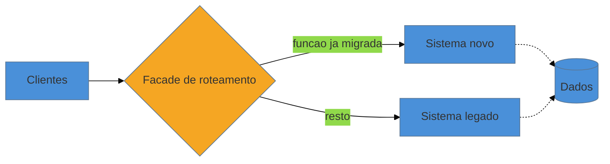
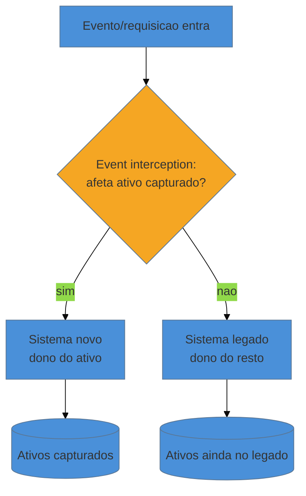

# Strangler Fig

> [!abstract] TL;DR
> A nota anterior lhe deu o vocabulário para *decidir* o destino de cada componente; o quadrante Migrate do TIME — alto valor, baixa qualidade — é o que exige a intervenção mais pesada e mais arriscada: restaurar ou reescrever um sistema **crítico**, que não pode sair do ar. O **Strangler Fig** (Martin Fowler) é a técnica que torna isso seguro. Em vez de construir o sistema novo em paralelo por anos e virar a chave num único *big-bang cutover* — a aposta de tudo-ou-nada que Spolsky condena —, você faz o novo **crescer em volta do velho**, interceptando requisições numa *facade* de roteamento e migrando **uma função de cada vez**, com o sistema antigo no ar até a última função ser transplantada. Cada passo entrega valor real, é reversível, e o velho só é removido quando estrangulado por completo. As duas estratégias que operacionalizam o padrão são **event interception** (interceptar as requisições/eventos e desviar as certas para o novo) e **asset capture** (mover a posse dos dados de um subconjunto de entidades por vez). No fundo, é a [[17 - Frameworks de decisão|decisão de Migrate]] executada como uma sequência de opções reais reversíveis — o mesmo princípio de sempre-entregável do [[15 - O Método Mikado|Mikado]], agora no nível do sistema em produção.

Volte à plataforma de logística da nota anterior. A decisão de portfólio já foi tomada: o módulo de faturamento é alto valor e baixa qualidade — quadrante Migrate, verbo Refactor. Ótimo. Agora vem a parte que faz o consultor suar frio na reunião seguinte, quando o diretor pergunta *"e como, exatamente, você troca o motor de faturamento de um avião em pleno voo?"*. Porque o faturamento processa toda a receita, roda toda semana, e não existe um sábado à noite em que ele possa ficar duas horas fora do ar — muito menos os três meses que uma migração de verdade leva.

O reflexo do time júnior é o mais perigoso que existe: *"a gente constrói o faturamento novo do lado, com calma, com testes, código limpo; quando estiver pronto, num fim de semana a gente desliga o velho e liga o novo."* Isso tem nome — **big-bang cutover** — e é a forma mais confiável de transformar uma modernização em desastre. O sistema novo fica pronto meses depois do previsto (sempre fica); no dia da virada, mil comportamentos sutis do velho que ninguém documentou aparecem de uma vez, em produção, sob pressão; e não há caminho de volta, porque o velho já foi desligado e o mundo inteiro já aponta para o novo. Você trocou os dois motores no ar simultaneamente e rezou. A pergunta certa não é *"como construo o novo?"* — é **"como faço a transição sem nunca ter os dois sistemas fora do ar ao mesmo tempo, e sem nunca ficar sem caminho de volta?"**. A resposta é uma árvore.

## A metáfora: a figueira estranguladora

Numa viagem à Austrália, Martin Fowler ficou impressionado com as *strangler figs* — figueiras estranguladoras — das florestas tropicais de Queensland. Elas têm um ciclo de vida peculiar: a semente germina no alto de uma árvore hospedeira, e a muda cresce **para baixo**, lançando raízes em volta do tronco do hospedeiro até o chão. Ao longo de anos, a figueira envolve a árvore original numa treliça de raízes, disputando luz e nutrientes. Eventualmente a hospedeira morre e apodrece — mas a essa altura a figueira já é uma estrutura autoportante, oca por dentro no formato exato da árvore que substituiu. O antigo tronco não é derrubado num golpe: é **gradualmente envolvido e substituído**, e some só quando o novo já sustenta tudo sozinho.

Fowler viu nisso a metáfora exata de como se deve substituir um sistema legado crítico. O sistema novo é a figueira; o legado é a árvore hospedeira. Você não corta o hospedeiro — você cresce em volta dele, transferindo função por função, até que o velho não sustente mais nada e possa ser removido sem que ninguém sinta. Fowler batizou o padrão de **Strangler Application** em 2004; anos depois renomeou para **Strangler Fig Application**, tanto por precisão botânica quanto porque "estrangulador" soava mais destrutivo do que a ideia pretende — o ponto do padrão é justamente **não** matar nada de forma abrupta.

> [!question]- A metáfora não é meio sinistra? Estrangular é matar.
> É, e é por isso que o próprio Fowler se incomodou com o nome. Mas o que a botânica ensina aqui não é a morte — é o **método**. A figueira nunca fica sem estrutura de sustentação: em todo momento do processo, ou o hospedeiro sustenta o galho, ou a figueira já sustenta a si mesma naquele ponto. Nunca há um instante em que a árvore inteira dependa de nada. Traduzido para software: em todo momento da migração, cada função ou está sendo servida pelo sistema velho, ou já está sendo servida pelo novo — nunca há um instante em que a função esteja no vácuo. É o oposto exato do big-bang, onde por um fim de semana inteiro *tudo* depende de um sistema que nunca rodou em produção de verdade.

## A anatomia: interceptar, construir ao lado, migrar, remover

O Strangler Fig se apoia numa peça de infraestrutura que é o coração de todo o padrão: uma **facade de roteamento** (um proxy, um API gateway, um controlador na borda) posicionada entre os clientes e o sistema legado. No dia zero, ela é invisível — encaminha 100% das requisições para o velho, sem alterar nada. Mas é ela que dá a você o **botão de desvio por rota**: a capacidade de dizer "esta requisição específica vai para o novo, todo o resto continua no velho". Sem esse ponto único de roteamento, não há Strangler Fig — há só duas versões do sistema e nenhuma forma controlada de escolher entre elas.

Com a facade no lugar, o ciclo é sempre o mesmo, repetido por função:

1. **Interceptar** — pôr a facade na frente do legado, roteando tudo para ele. Passo de risco quase zero (nada de comportamento muda), mas que instala o interruptor de que todo o resto depende.
2. **Construir ao lado** — implementar *uma* fatia de funcionalidade no sistema novo. Uma só. A menor que entregue valor de forma independente.
3. **Migrar a função** — reconfigurar a facade para que aquela rota específica passe a apontar para o novo. O velho continua no ar servindo todo o resto. Se algo der errado, você reverte a rota — o velho ainda está lá, intacto.
4. **Repetir** — voltar ao passo 2 para a próxima fatia, até que a facade não encaminhe mais nada para o legado.
5. **Remover** — quando o velho não serve mais nenhuma rota, ele está estrangulado. Desligue-o. E, se a facade não tiver mais nenhum propósito, remova-a também (ou promova-a ao gateway definitivo do novo sistema).

O segredo do padrão está no passo 3: a **unidade de trabalho é a função, não o sistema**. Você nunca aposta o sistema inteiro num único evento. Aposta uma função — e mesmo essa aposta é reversível enquanto o velho não for removido.

## As duas estratégias de Fowler: event interception e asset capture

"Migrar uma função" soa simples até você perguntar: *migrar o quê, exatamente — o código que responde à requisição, ou os dados que ele lê e escreve?* Fowler nomeia as duas metades desse problema como duas estratégias complementares, e entendê-las separadas é o que evita as piores armadilhas do padrão.

**Event interception** é a metade do *fluxo*. Você identifica os pontos de integração por onde as requisições e atualizações de estado entram no sistema — os *seams* de borda ([[12 - Seams e quebra de dependência|nota 12]], agora no nível da arquitetura, não da classe) — e intercepta esse fluxo, desviando para o componente novo **apenas os eventos das funções já migradas**. O ponto crucial, que Fowler faz questão de sublinhar: você **não** intercepta todos os eventos, só os do subconjunto que está migrando. O resto flui direto para o velho, como sempre.

**Asset capture** é a metade dos *dados*. Quase todo sistema legado é, no fundo, o guardião de um conjunto de ativos: uma folha de pagamento guarda funcionários, um sistema de faturamento guarda faturas, uma plataforma de logística guarda cargas. Migrar de verdade significa transferir a **posse** desses ativos — quem é a fonte da verdade sobre cada fatura — do velho para o novo. E a estratégia é a mesma da interceptação: você não move todos os ativos de uma vez, **captura um subconjunto por vez** (as faturas de um tipo de contrato, os clientes de uma região) e migra a posse só deles.

As duas se amarram: para capturar um ativo, você precisa interceptar todos os eventos que o afetam, para que o novo sistema — agora dono daquele ativo — receba tudo o que muda seu estado.

> [!info] Por que separar fluxo de dado importa tanto
> A tentação é pensar em migração como uma coisa só — "migrei o faturamento". Mas o fluxo e o dado migram em ritmos diferentes e falham de formas diferentes. É perfeitamente possível o novo código já responder à requisição (event interception feito) enquanto a fonte da verdade dos dados **ainda é o banco antigo** (asset capture pendente) — e é aí que moram os bugs mais traiçoeiros do padrão: dois sistemas escrevendo no mesmo dado sem um dono claro. Separar as duas estratégias força você a responder, para cada fatia, *quem é o dono do fluxo* e *quem é o dono do dado* — e a nunca deixar essa segunda pergunta implícita. Toda a mecânica de mover a posse do dado sem downtime é o assunto da [[20 - Migração de dados e schema|nota 20]].

## Fundamento teórico: por que o incremento reversível vence a aposta única

O Strangler Fig parece só uma tática esperta de sequenciamento, mas sua superioridade sobre o big-bang tem base teórica em três frentes — e nomeá-las é o que distingue aplicar o padrão por hábito de aplicá-lo com julgamento.

**1. Valor de opção da reversibilidade (opções reais).** Este é o argumento que a [[17 - Frameworks de decisão|nota 17]] já abriu, e o Strangler Fig é sua encarnação mais pura. Cada migração de rota é uma **opção real**: você adquire o direito, mas não a obrigação, de continuar — e a qualquer passo pode parar, corrigir a rota ou reverter, porque o sistema velho continua funcional embaixo. O big-bang cutover *destrói* essa opcionalidade: é uma decisão única e irreversível cujo acerto você só descobre depois de meses, quando voltar atrás já custa tudo. Sob incerteza — e substituir um sistema que você não escreveu é o reino da incerteza — a estratégia que preserva a opção de voltar atrás vale mais do que a que aposta tudo, **mesmo que ambas cheguem ao mesmo destino final**. Você está pagando um pouco de sobrecusto (manter os dois sistemas e a facade por um tempo) para comprar um seguro contra a ruína.

**2. Redução de risco por tamanho de lote (small batches).** Há uma verdade da teoria de sistemas de fluxo que a entrega contínua tornou canônica: o risco de uma mudança não cresce linearmente com o tamanho dela — cresce de forma **desproporcional**, porque a dificuldade de diagnosticar uma falha explode com o número de coisas que mudaram ao mesmo tempo. Se você migra uma função e algo quebra, o espaço de suspeitos é aquela função. Se você migra o sistema inteiro num fim de semana e algo quebra, o espaço de suspeitos é *tudo* — e você está depurando às três da manhã com o negócio parado. O Strangler Fig é a aplicação literal do princípio de **lotes pequenos**: ao fatiar a migração em incrementos independentes, cada falha fica pequena, isolada e barata de diagnosticar. O tamanho do lote é o botão de controle de risco, e o padrão o mantém no mínimo.

**3. Entrega incremental de valor e ciclos de feedback curtos.** No big-bang, o valor é entregue de uma só vez, no fim — e até lá o investimento é puro custo, sem retorno e sem validação. No Strangler Fig, **cada função migrada já está em produção, gerando valor e, sobretudo, gerando feedback real**. Você descobre no segundo incremento que sua abordagem de migração tem um defeito, e conserta antes de repeti-lo mais trinta vezes — em vez de descobrir tudo de uma vez no cutover. Isso conecta o padrão diretamente às [[03-Dominios/Engenharia/Complexidade de Software/index|leis de evolução de Lehman]]: um sistema em uso precisa continuar evoluindo, e o Strangler Fig é a única estratégia de substituição que **não congela a evolução** durante a migração — o negócio continua entregando features (no velho ou no novo) o tempo todo, em vez de parar por um ano esperando o novo ficar pronto.

> [!info] O parentesco com o Mikado
> O [[15 - O Método Mikado|Método Mikado]] e o Strangler Fig são o mesmo princípio em escalas diferentes. O Mikado opera no nível do *código* (reverter para o verde a cada passo, nunca acumular um branch quebrado); o Strangler Fig opera no nível do *sistema em produção* (manter o velho no ar até o novo sustentar tudo). Ambos recusam a mesma coisa — o grande salto irreversível no escuro — e ambos compram a mesma coisa: um estado sempre-entregável a cada passo. Quem internalizou o Mikado já entende a alma do Strangler Fig.

**Strangler Fig em uma frase:** substituir um sistema crítico é uma sequência de opções reais reversíveis — migre uma função de cada vez atrás de uma facade de roteamento, com o velho no ar até estar estrangulado por completo, para que nenhuma falha seja grande e nenhum passo seja irreversível.

## Casos práticos

### Cenário 1: o monólito que vira serviços (o caso canônico)

Uma aplicação monolítica de e-commerce, alto valor e baixa qualidade, precisa virar serviços para escalar o time. O big-bang seria reescrever o monólito inteiro como microsserviços e virar a chave — meses de trabalho sem entregar nada, terminando num fim de semana de terror.

Em vez disso: sobe-se um **API gateway** na frente do monólito (a facade), roteando 100% para ele. A primeira fatia escolhida é a de menor risco e maior independência — digamos, o catálogo de produtos (leitura pesada, poucas escritas, poucas dependências). Constrói-se o `catalog-service` novo; via **asset capture**, ele passa a ser o dono dos dados de produto; via **event interception**, o gateway passa a rotear `GET /products/*` para ele, enquanto todo o resto — carrinho, checkout, pagamento — continua no monólito. Entregue, em produção, reversível. Na sequência migram-se carrinho, depois checkout, cada um uma fatia. A cada passo o monólito encolhe, sempre funcional. Quando a última rota sai dele, o monólito é desligado. Nenhum fim de semana de terror aconteceu; o e-commerce nunca ficou fora do ar; e se o `catalog-service` tivesse dado errado, bastava reapontar a rota de volta ao monólito, que continuava lá.

### Cenário 2: o faturamento da plataforma de logística — a facade na borda

Voltando ao faturamento da [[17 - Frameworks de decisão|nota 17]] (Migrate → Refactor). Aqui o alvo não é quebrar em serviços, é **restaurar** o motor de cálculo podre sem desligá-lo. A facade não precisa ser um gateway de rede sofisticado — pode ser um ponto de despacho no próprio código, na borda do módulo, que decide para qual implementação de `calcularTotal()` uma requisição vai. Constrói-se a implementação nova, já limpa e testada, para *um tipo de contrato* primeiro (asset capture: só as faturas daquele tipo). A rede de caracterização ([[10 - A rede de segurança primeiro|nota 10]]) garante que a saída nova bate com a velha para aquele tipo. A facade roteia só aquele tipo para o novo; todos os outros continuam no motor velho. Semana a semana, mais um tipo de contrato migra, sempre com a caracterização travando o comportamento e a rota reversível. Quando o último tipo migra, a função velha é removida. O motor foi trocado no ar, um tipo de contrato de cada vez, e a receita nunca parou.

> [!example] A técnica de validação que casa com o Strangler Fig
> No faturamento, antes de rotear um tipo de contrato *de vez* para o novo, um passo intermediário poderoso é o **parallel run**: por um período, a facade envia a requisição para os *dois* motores, retorna a resposta do velho (ainda a fonte da verdade) e **compara** silenciosamente com a do novo, registrando qualquer divergência. Você acumula evidência real de produção de que o novo está correto antes de confiar nele. Essa técnica — e as feature flags que a controlam — é o assunto da [[21 - Validação em produção|nota 21]].

## Armadilhas comuns

> [!warning] O Strangler Fig que nunca termina
> **O que acontece:** as primeiras fatias migram com entusiasmo, mas as últimas — sempre as mais acopladas e feias — ficam para depois indefinidamente. Anos depois, você tem os dois sistemas no ar, a facade permanente, e o dobro de custo de manutenção. O "temporário" virou arquitetura. **Por quê:** as fatias fáceis dão dopamina rápida; as difíceis são adiadas, e sem um compromisso explícito de *terminar*, a organização acostuma-se ao estado híbrido. **Como evitar:** trate a remoção do legado como parte do escopo, não como bônus. Defina de saída quais fatias faltam, e não declare a migração "feita" enquanto o velho não for desligado. Um Strangler Fig sem data de morte do hospedeiro é só dívida técnica com um nome bonito.

> [!warning] A facade que vira o novo gargalo
> **O que acontece:** todo o tráfego passa pela facade de roteamento, e ela vira um ponto único de falha e de latência — um novo monólito na borda, às vezes pior que o que você está estrangulando. **Por quê:** é fácil enfiar lógica de negócio na facade ("já que toda requisição passa aqui...") e transformá-la de roteador burro em orquestrador esperto. **Como evitar:** mantenha a facade **fina** — ela roteia, no máximo intercepta e compara; não decide regra de negócio. E projete-a para falhar bem (timeouts, fallback para o legado) desde o primeiro dia.

> [!warning] Ignorar o asset capture: dois donos do mesmo dado
> **O que acontece:** você migra o *fluxo* (o novo código responde à requisição) mas esquece do *dado* — o velho e o novo escrevem no mesmo registro sem um dono claro. As escritas se sobrescrevem, o estado diverge, e você tem corrupção silenciosa de dados em produção. **Por quê:** event interception é visível (a requisição muda de destino) e asset capture é invisível (quem é a fonte da verdade não aparece na rota). É fácil migrar a primeira e esquecer a segunda. **Como evitar:** para cada fatia, declare explicitamente quem é o dono do dado *antes* de rotear o fluxo. A mecânica de transferir a posse sem downtime é a [[20 - Migração de dados e schema|nota 20]] — não improvise.

> [!warning] Escolher a primeira fatia pela ambição, não pela segurança
> **O que acontece:** para "provar o valor", o time escolhe a função mais central e crítica como primeira migração — e trava no componente mais acoplado, com o padrão inteiro ainda não rodado sob fogo real. **Por quê:** pressão política por um resultado impressionante logo. **Como evitar:** a primeira fatia é a que valida o *mecanismo* (facade, interceptação, captura, reversão) com o menor risco de negócio — a mais independente, não a mais importante. Aprenda o padrão no fácil antes de aplicá-lo no difícil. O early win seguro da [[04 - Os primeiros 30-60-90 dias|nota 04]] vale aqui também.

## Como explicar em inglês

> Instead of a big-bang rewrite, I put a routing facade in front of the legacy system and grow the new one around it, migrating one capability at a time. Fowler calls it the strangler fig, after the vines that grow around a host tree until it can be removed. Two strategies drive it: event interception routes only the requests for migrated features to the new system, and asset capture moves ownership of a subset of the data at a time. Every step ships value and is reversible — the legacy stays live until it's fully strangled, so no single failure is catastrophic and there's always a way back.

| PT | EN |
|----|----|
| figueira estranguladora | strangler fig |
| facade de roteamento | routing facade |
| virada de tudo-de-uma-vez | big-bang cutover |
| interceptação de eventos | event interception |
| captura de ativos | asset capture |
| fonte da verdade | source of truth |
| execução em paralelo | parallel run |
| uma função de cada vez | one capability at a time |

## O que vem a seguir

O Strangler Fig lhe deu a **estratégia macro** — o velho e o novo coexistindo atrás de uma facade, migrando função a função. Mas ele levanta três perguntas de execução que as próximas notas respondem, cada uma cobrindo uma camada que o padrão pressupõe resolvida.

- [[19 - Branch by Abstraction e Anti-Corruption Layer|nota 19]] — o Strangler Fig roteia no nível da requisição/sistema; quando a substituição precisa acontecer *dentro* do código, sem uma borda de rede onde pôr a facade, o **Branch by Abstraction** é o equivalente no nível do código — e a **Anti-Corruption Layer** protege o novo modelo de ser contaminado pelo velho durante a coexistência.
- [[20 - Migração de dados e schema|nota 20]] — a metade do *asset capture* aprofundada: como transferir a posse dos dados sem downtime (expand-contract, dual writes, shadow tables).
- [[21 - Validação em produção|nota 21]] — como ter coragem de virar cada rota: feature flags, dark launch e o parallel run que compara velho e novo em produção antes de confiar no novo.

> [!tip] Assista: Patterns of Legacy Displacement
> **Canal:** GOTO Conferences | **Duração:** ~43min | **Idioma:** EN
>
> Ian Cartwright e Rob Horn (Thoughtworks) — os mesmos autores dos artigos de *Legacy Displacement* citados nas Fontes desta nota — apresentam a série de padrões que inclui o Strangler Fig num nível mais amplo: como fatiar o problema (por produto, por *user journey*, por *seam* técnico), e um catálogo de técnicas concretas de **event interception** (mensageria, APIs, micro front-ends, CDC em bancos de dados) que a nota cobre em teoria — aqui aparecem como receita prática, com o conceito extra de **legacy mimic** (o novo sistema fingindo a API do velho para não quebrar consumidores que ainda não migraram). Trecho de destaque [18:17]: *"introducing a facade of some kind and then using that as a level of indirection to then create new implementations of your application gradually moving across features over time until essentially your new application has strangled the life out of your legacy system."*
>
> 🎬 [Assistir no YouTube](https://www.youtube.com/watch?v=noOoLULfInc)

## Fontes

- **Martin Fowler** — [*StranglerFigApplication*](https://martinfowler.com/bliki/StranglerFigApplication.html) (2004, renomeado depois) — o texto original que cunha o padrão e conta a metáfora das figueiras de Queensland.
- **Martin Fowler** — [*Event Interception*](https://martinfowler.com/articles/patterns-legacy-displacement/event-interception.html) (série *Patterns of Legacy Displacement*, com Ian Cartwright e James Lewis) — a estratégia de interceptar o fluxo e desviar só os eventos das funções migradas.
- **Martin Fowler** — [*Asset Capture*](https://martinfowler.com/bliki/AssetCapture.html) — a estratégia complementar de mover a posse de um subconjunto de ativos por vez, e por que ela depende do event interception.
- **Microsoft Azure Architecture Center** — [*Strangler Fig pattern*](https://learn.microsoft.com/en-us/azure/architecture/patterns/strangler-fig) — formulação de referência do padrão para migração incremental, com a facade de roteamento no centro.
- **AWS Prescriptive Guidance** — [*Strangler fig pattern*](https://docs.aws.amazon.com/prescriptive-guidance/latest/cloud-design-patterns/strangler-fig.html) — o caso canônico monólito → microsserviços aplicando o padrão.
- Ver também a decisão que leva ao Strangler em [[17 - Frameworks de decisão|Frameworks de decisão]] (quadrante Migrate) e o mesmo princípio de reversibilidade no [[15 - O Método Mikado|Método Mikado]].
