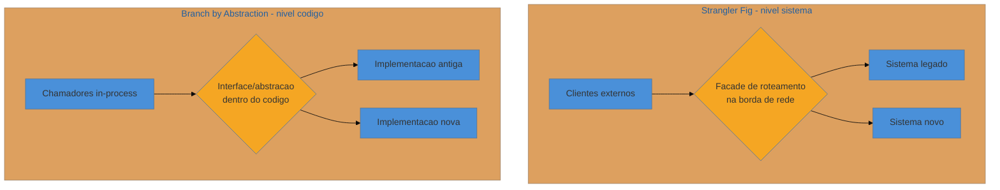
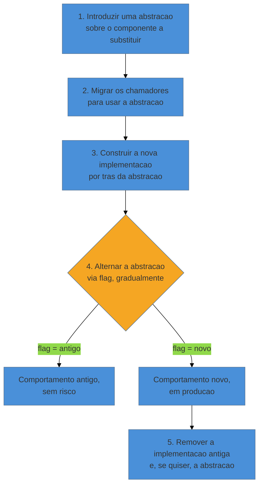
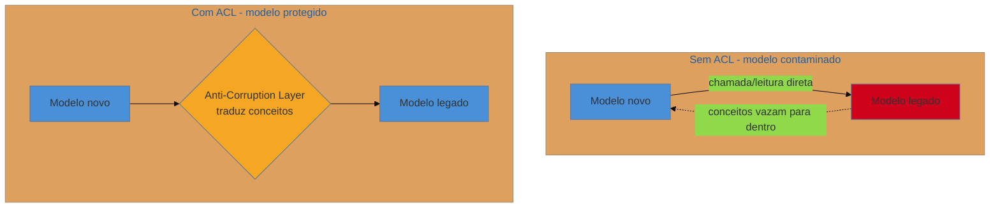

# Branch by Abstraction e Anti-Corruption Layer

> [!abstract] TL;DR
> O [[18 - Strangler Fig|Strangler Fig]] resolve a coexistência quando existe uma **borda de rede** — uma
> facade de roteamento entre clientes e sistema pode desviar requisições função a função. Mas boa parte do
> código legado não tem essa borda: é uma biblioteca interna, um motor de cálculo chamado por dezenas de
> pontos do mesmo processo, sem HTTP nem gateway no meio. Para esse caso, a resposta é o **Branch by
> Abstraction** (Paul Hammant, popularizado por Fowler e por Humble & Farley em *Continuous Delivery*):
> introduzir uma interface *dentro* do código, migrar os chamadores para ela, construir a implementação nova
> por trás dela e só então alternar — sem nunca abrir um branch Git de longa duração. Quando o componente
> novo, limpo, precisa **conversar** com o legado durante essa coexistência, entra a segunda técnica: a
> **Anti-Corruption Layer** (Eric Evans, DDD), uma camada de tradução que impede que os conceitos podres do
> modelo velho vazem para dentro do modelo novo. As duas resolvem problemas diferentes e complementares:
> Branch by Abstraction troca a *implementação*; Anti-Corruption Layer protege o *modelo*. Ambas são, no
> fim, a mesma aposta do [[17 - Frameworks de decisão|quadrante Migrate]] — reversibilidade e
> incrementalismo — aplicada em escalas onde o Strangler Fig não alcança.

Volte, mais uma vez, à plataforma de logística. Desta vez o alvo não é o faturamento — é o **motor de
alocação de frete**, a rotina que decide qual transportadora, rota e veículo atendem cada carga. Esse
motor não é um serviço HTTP separado: é uma classe de 1.200 linhas, `AlocadorDeFrete`, importada e chamada
diretamente — em memória, dentro do mesmo processo — por dezenas de pontos do monólito: a tela de
cotação, o job noturno de reprocessamento, a API pública de rastreamento, o painel do operador. Não existe
gateway, não existe rota HTTP, não existe fila de mensagens entre quem chama e o motor. É código chamando
código, direto, síncrono, dentro do mesmo binário.

O consultor propõe o óbvio: "vamos fazer aqui o mesmo que fizemos no faturamento — pôr uma facade na
frente e migrar aos poucos." Só que não há frente onde pôr nada. Uma facade de roteamento pressupõe uma
borda por onde as requisições *entram* de fora — HTTP, RPC, uma fila. `AlocadorDeFrete` não tem borda
nenhuma: é só uma classe instanciada e chamada em quarenta lugares diferentes do código-fonte. Tentar
"interceptar" essas chamadas exigiria reescrever quarenta pontos de chamada de uma vez só para apontar
para um roteador — e nesse momento você já fez o big-bang que o Strangler existe para evitar, só que
disfarçado. O problema do Strangler Fig, aqui, não é a técnica estar errada — é o **nível** estar errado.

## Duas escalas, dois lugares para a costura

A distinção que resolve isso é simples de enunciar e fácil de esquecer sob pressão: **o Strangler Fig
opera no nível da requisição/sistema; o Branch by Abstraction opera no nível do código.** O primeiro
precisa de uma borda de rede — algo que já intercepta tráfego de fora, como um gateway ou um proxy — para
existir. O segundo não precisa de rede nenhuma: ele constrói a borda que falta, *dentro* do processo, na
forma de uma interface.

Repare no paralelo estrutural: em ambos os casos existe um único ponto de decisão (a facade, a interface)
que sabe rotear entre velho e novo, e em ambos os casos os chamadores não sabem — nem precisam saber —
qual dos dois está respondendo. A diferença é só *onde* esse ponto de decisão mora: na borda de rede, ou
na borda do código. Quem já internalizou o Strangler Fig não está aprendendo um padrão novo aqui — está
aprendendo a aplicar o mesmo princípio um nível mais fundo, onde não existe rede para interceptar.

> [!question]- Por que não simplesmente subir um serviço novo e chamar via rede, criando a borda que falta?
> Porque isso troca um problema pequeno por um grande. Transformar uma chamada de método em memória
> (microssegundos, sem falha de rede, sem serialização) numa chamada remota (rede, timeout, serialização,
> um novo ponto de falha) é, por si só, uma mudança arquitetural pesada — e você estaria fazendo essa
> mudança **só para poder usar a técnica de migração**, não porque o sistema precisa de um serviço
> separado. O Branch by Abstraction existe exatamente para evitar essa armadilha: ele deixa a decisão de
> "isso deveria virar um serviço de verdade?" separada da decisão de "como troco essa implementação com
> segurança?". Você pode responder a segunda sem se comprometer com a primeira.

## O mecanismo: cinco passos, sempre no trunk

Paul Hammant descreveu o Branch by Abstraction como uma alternativa a uma prática comum e perigosa: abrir
um branch Git de longa duração para fazer uma mudança grande, trabalhar nele por semanas, e depois enfrentar
um merge doloroso. O nome é irônico de propósito — "branch" no título, mas o método inteiro existe para
**evitar** um branch de verdade. Em vez de ramificar o *repositório*, você ramifica a *implementação*,
dentro do próprio trunk, atrás de uma abstração:

1. **Introduzir a abstração.** Antes de mudar qualquer comportamento, você extrai uma interface —
   `IAlocadorDeFrete` — que descreve o contrato do componente sem expor sua implementação interna. Esse
   passo, sozinho, já é valioso mesmo se a migração parar aqui: é literalmente a instalação de um **seam**
   deliberado ([[12 - Seams e quebra de dependência|nota 12]]), só que aqui o objetivo não é testar, é
   trocar a implementação inteira por trás dele.
2. **Migrar os chamadores.** Os quarenta pontos que chamavam `AlocadorDeFrete` diretamente passam a
   depender de `IAlocadorDeFrete`. Nada de comportamento muda — é uma refatoração mecânica, apoiada pela
   rede de caracterização ([[10 - A rede de segurança primeiro|nota 10]]), commitada em pequenos passos no
   trunk. Ao final deste passo, ninguém no código conhece mais a classe concreta antiga; todo mundo
   conhece só o contrato.
3. **Construir a implementação nova por trás da abstração.** Só agora começa o trabalho de restauração de
   fato: uma nova classe, `AlocadorDeFreteV2`, implementando `IAlocadorDeFrete` do zero (ou por
   refatoração incremental), sem que nenhum chamador saiba que ela existe. Ela pode ser desenvolvida ao
   longo de semanas, incompleta, sem pressa — porque ainda não está no caminho de produção.
4. **Alternar a abstração.** Um mecanismo de seleção — tipicamente uma *feature flag*, às vezes tão simples
   quanto um `if` de configuração — decide, em runtime, qual implementação a abstração entrega a cada
   chamador. A alternância pode ser total (todo o tráfego de uma vez) ou gradual (uma flag por segmento de
   carga, por operador, por porcentagem), e nos dois sentidos: se algo quebrar, a flag volta para o antigo
   sem deploy. Este é o único passo com risco real — e ele é reversível em segundos, não em semanas.
5. **Remover o antigo.** Depois que a implementação nova prova, sob carga real, que está correta, a classe
   antiga (e, se não houver mais razão para trocar de implementação, a própria interface) pode ser
   deletada. Só agora a migração está de fato completa — o passo que a [[18 - Strangler Fig|nota 18]] já
   avisou que costuma ser adiado para sempre.

> [!info] O parentesco com o trunk-based development
> Branch by Abstraction não é uma técnica isolada — é a peça que torna o *trunk-based development* viável
> para mudanças grandes. A alternativa ingênua, um feature branch vivendo por semanas enquanto a
> implementação nova amadurece, acumula *merge debt*: quanto mais tempo o branch diverge do trunk, mais
> caro e arriscado é reconciliar as duas linhas de código. Humble & Farley, em *Continuous Delivery*,
> tratam isso como pré-condição de integração contínua de verdade: se sua estratégia de branch te impede
> de integrar ao trunk todo dia, a integração não é contínua, é adiada. Branch by Abstraction resolve isso
> comitando a implementação incompleta direto no trunk, inerte atrás da flag, em vez de isolá-la num branch
> paralelo. O código novo existe em produção, compilado e testado, dias antes de ser *ativado*.

## Anti-Corruption Layer: proteger o modelo, não só a implementação

Branch by Abstraction resolve *como trocar uma implementação sem quebrar quem a chama*. Mas surge um
problema diferente assim que a implementação nova cresce o suficiente para virar um componente com
identidade própria — digamos, o time decide que `AlocadorDeFreteV2` deveria, na verdade, nascer como um
novo serviço de otimização de rotas, com seu próprio modelo de domínio, mais rico e mais correto do que o
do legado (que trata "frete" como um número solto, sem noção de janela de entrega, capacidade de veículo
ou restrição regulatória). Esse serviço novo, durante toda a migração, ainda precisa **ler dados do
legado** — pedidos, clientes, cargas — porque o legado continua sendo, por enquanto, a fonte da verdade
para tudo que ainda não migrou.

O risco aqui não é técnico, é conceitual: se o serviço novo simplesmente importa as classes do legado ou
lê diretamente do banco antigo, o **modelo de domínio confuso do legado vaza para dentro do modelo novo**.
Os `if`s especiais, os campos com três significados diferentes dependendo do contexto, os `NULL`s que
significam "zero" às vezes e "desconhecido" outras vezes — tudo isso se espalha pelo código novo, e em
seis meses o serviço "limpo" está tão contaminado quanto o legado que deveria substituir. Você não migrou
para um modelo melhor; você clonou o modelo velho num corpo novo.

Eric Evans, em *Domain-Driven Design*, batizou a defesa contra isso de **Anti-Corruption Layer (ACL)**:
uma camada de **tradução** posicionada exatamente na fronteira entre os dois modelos, cujo único trabalho é
converter os conceitos de um lado nos conceitos do outro. Do lado de dentro do novo *bounded context*, o
código só fala a linguagem do modelo novo — nunca vê um tipo, um campo ou uma regra do legado diretamente.
Do lado de fora, a ACL sabe como o legado pensa, e traduz.

Concretamente, a ACL costuma ter três peças, mesmo em implementações simples: um **adaptador** que fala o
protocolo de acesso ao legado (chamar a classe antiga, consultar a tabela antiga); um **tradutor** que
mapeia os tipos e conceitos do legado para os tipos e conceitos do modelo novo (um `enum StatusCarga`
limpo em vez do `char(1)` com sete valores mágicos do banco antigo); e uma **fachada** que expõe, para o
resto do serviço novo, só a interface no vocabulário do domínio novo — a *ubiquitous language* que Evans
coloca no centro do DDD.

> [!question]- Isso não é só um DTO com um passo de mapeamento a mais? Por que merece um nome próprio?
> A diferença não é mecânica, é de **intenção**. Um mapeamento de DTO comum geralmente assume que os dois
> modelos são parecidos — campo bate com campo, só o formato muda. A ACL assume o oposto: que os dois
> modelos representam o domínio de formas **genuinamente incompatíveis**, e que forçar uma correspondência
> 1-para-1 seria mentir. Às vezes um conceito do legado não tem equivalente direto no modelo novo e precisa
> ser decomposto em três; às vezes dois conceitos legados colapsam num só. A ACL existe para você poder
> fazer essa tradução com honestidade, num lugar isolado e testável — em vez de deixar pequenas
> concessões ao modelo velho se infiltrarem, campo a campo, pelo código novo inteiro.

## Como as duas se combinam com o Strangler Fig

As três técnicas não competem — elas operam em camadas diferentes da mesma migração, e uma migração real
costuma usar as três ao mesmo tempo, em pontos diferentes do sistema:

- O **Strangler Fig** decide, na borda de rede, *quem responde* a cada requisição — velho ou novo sistema.
- O **Branch by Abstraction** decide, dentro do código, *qual implementação executa* quando não há borda de
  rede para interceptar — a costura fica no processo, não na infraestrutura.
- A **Anti-Corruption Layer** decide, na fronteira entre modelos, *como os dados e conceitos são traduzidos*
  quando o lado novo precisa falar com o lado velho sem herdar sua bagunça conceitual.

No exemplo do motor de frete: o serviço novo de otimização de rotas pode estar atrás de uma facade de
Strangler Fig (na borda de rede, para as chamadas que já vêm de fora do monólito) **e**, ao mesmo tempo,
usar uma ACL internamente sempre que precisa ler um pedido do banco legado. Se, além disso, uma parte do
próprio motor de cálculo continuar vivendo dentro do monólito por mais um tempo — porque ainda não valeu a
pena extraí-la — essa parte pode estar sendo trocada, por dentro, via Branch by Abstraction. As três
técnicas coexistindo, cada uma resolvendo a costura no nível onde ela realmente está.

## Fundamento teórico: por que a fronteira importa mais que a implementação

As duas técnicas parecem truques de engenharia, mas cada uma se apoia num princípio bem mais antigo — e
nomear esses princípios é o que separa aplicar a receita de entender por que ela funciona.

**1. Information hiding (Parnas, 1972).** David Parnas argumentou que módulos deveriam ser decompostos em
torno de **decisões que provavelmente vão mudar**, escondendo cada decisão atrás de uma interface estável.
A abstração do passo 1 do Branch by Abstraction é exatamente isso: você já sabe, de antemão, que "qual
implementação de alocação de frete está ativa" é uma decisão que vai mudar — então esconde essa decisão
atrás de `IAlocadorDeFrete` *antes* de a mudança acontecer. É information hiding aplicado não a um módulo
qualquer, mas ao próprio ato de migrar.

**2. Inversão de dependência (SOLID, Martin).** Sem a abstração, os quarenta chamadores dependem
diretamente da classe concreta antiga — uma dependência de alto acoplamento, difícil de trocar. Ao inserir
a interface, você inverte essa dependência: chamadores e implementações passam a depender ambos de um
contrato abstrato, nenhum dos dois do outro diretamente. Essa inversão é o que torna o passo 4 (alternar)
uma mudança de configuração, e não uma cirurgia em quarenta arquivos.

**3. Bounded contexts e a corrupção de modelo (Evans, DDD).** O argumento de Evans para a ACL é que
sistemas de domínio complexo só permanecem compreensíveis se cada *bounded context* mantém seu próprio
modelo íntegro, com uma linguagem ubíqua consistente internamente. Modelos vizinhos podem — e em sistemas
reais quase sempre vão — discordar sobre o que as mesmas palavras significam. A ACL é a aplicação
disciplinada dessa ideia na fronteira mais hostil que existe: entre um modelo novo, cuidadosamente
desenhado, e um modelo legado que nunca teve esse cuidado. Sem uma fronteira de tradução explícita, as
duas linguagens colapsam numa só — sempre para pior, porque a confusão se espalha com mais facilidade do
que a clareza.

**4. Reversibilidade como valor de opção.** O mesmo argumento de opções reais que sustenta o
[[18 - Strangler Fig|Strangler Fig]] ([[17 - Frameworks de decisão|nota 17]]) sustenta o Branch by
Abstraction: a flag do passo 4 não é um detalhe de implementação, é o mecanismo que preserva, até o último
momento antes da remoção, o direito de voltar atrás sem custo. A diferença de escala — reverter uma rota
HTTP versus reverter uma flag de código — não muda o princípio: nenhuma migração de verdade compra
irreversibilidade em troca de velocidade.

**Branch by Abstraction e Anti-Corruption Layer em uma frase:** quando não há borda de rede para uma
facade, você constrói a costura dentro do próprio código — uma abstração que troca a implementação sem
branch de longa duração — e, sempre que o novo precisa falar com o velho, uma camada de tradução que
impede o modelo confuso de vazar para dentro do modelo limpo.

## Casos práticos

### Cenário 1: o motor de alocação de frete — Branch by Abstraction sem borda de rede

Retomando a abertura: `AlocadorDeFrete`, classe interna, quarenta pontos de chamada, sem HTTP no meio. O
time extrai `IAlocadorDeFrete`, migra os quarenta chamadores (trabalho mecânico, um PR pequeno por vez,
sempre no trunk, sempre verde). Constrói `AlocadorDeFreteV2` com o algoritmo novo — que agora considera
janela de entrega e capacidade de veículo, coisas que o antigo ignorava. Ativa a flag primeiro para 5% das
cargas de um único centro de distribuição, compara os resultados com a rede de caracterização, sobe
gradualmente para 100%. Quando a confiança está estabelecida e nenhum chamador restante usa o antigo, a
classe velha é deletada. Do início ao fim, nenhum branch Git viveu mais do que um dia; o trunk sempre
compilou, sempre passou os testes, sempre foi implantável — mesmo com a implementação nova, incompleta,
dormindo atrás da flag por semanas.

### Cenário 2: o serviço de precificação — Anti-Corruption Layer contra o modelo confuso do CRM legado

Um novo `serviço-de-precificacao`, com modelo de domínio limpo (`Cliente`, `TabelaDeDesconto`,
`RegraComercial`), precisa saber o histórico de volume de um cliente para calcular desconto — e esse
histórico só existe no CRM legado, onde "cliente" é uma tabela com 80 colunas, um campo `tipo` que
significa coisas diferentes conforme o valor de outro campo, e descontos representados como strings livres
digitadas por vendedores ao longo de dez anos. Sem ACL, o time importaria o cliente do CRM diretamente, e
em poucos meses `RegraComercial` teria `if`s tratando os mesmos casos especiais do legado.

Em vez disso, constrói-se uma ACL: um adaptador que consulta o CRM pela API interna dele; um tradutor que
converte o registro de 80 colunas num `PerfilDeCliente` de cinco campos, os únicos que o domínio de
precificação precisa, com as strings livres de desconto normalizadas para um `enum` fechado (e um log de
alerta para qualquer valor que não bate com nenhum caso conhecido — em vez de assumir silenciosamente);
uma fachada que expõe só `PerfilDeCliente` para o resto do serviço novo. `RegraComercial` nunca viu, e
nunca vai ver, uma coluna do CRM. Se o CRM for substituído no futuro, só a ACL muda — o coração do
domínio novo permanece intocado.

## Armadilhas comuns

> [!warning] A abstração porosa (leaky abstraction)
> **O que acontece:** a interface `IAlocadorDeFrete` parece limpa, mas um de seus métodos retorna um tipo
> específico da implementação antiga (um `DataSet` do ORM legado, um código de erro numérico proprietário),
> e a implementação nova precisa se contorcer para simular esse detalhe irrelevante.
> **Por quê:** é tentador desenhar a abstração *a partir* da implementação existente — extrair a interface
> "de dentro para fora" — em vez de desenhá-la a partir do que os chamadores realmente precisam.
> **Como evitar:** desenhe a interface pensando no consumidor ideal, não na implementação atual. Se a
> implementação nova não consegue satisfazer o contrato sem gambiarra, o contrato está errado — refine-o
> antes de seguir para o passo 3.

> [!warning] A flag que vira dívida permanente
> **O que acontece:** a alternância entre implementações fica configurável "para sempre, por segurança", e
> ninguém nunca remove a implementação antiga nem a flag. Anos depois, o código carrega dois caminhos
> inteiros, cada mudança precisa ser testada nos dois, e ninguém lembra por que a flag existe.
> **Por quê:** o mesmo padrão do Strangler Fig que nunca termina ([[18 - Strangler Fig|nota 18]]) — o passo
> 5 (remover) não dá dopamina como o passo 4 (ativar), então é sempre adiado.
> **Como evitar:** trate a remoção da implementação antiga como parte do escopo original da migração, com
> um critério explícito de "pronto para remover" (N dias sem incidente com a flag em 100% no novo), não
> como um item de faxinar depois. Flags de longa duração pedem gestão explícita — ver
> [[21 - Validação em produção|nota 21]].

> [!warning] A Anti-Corruption Layer que vira um God Adapter
> **O que acontece:** a ACL, criada para só traduzir, começa a acumular regra de negócio ("se o tipo de
> cliente for X, aplica desconto Y") porque é o único lugar que já enxerga os dois modelos.
> **Por quê:** é conveniente — a ACL já está lá, já tem acesso aos dois lados, então "só mais um `if`" é
> sempre o caminho de menor resistência no momento.
> **Como evitar:** trate qualquer regra de decisão como sinal de vazamento de responsabilidade. A ACL
> traduz *estrutura* (tipos, campos, formatos); regras de negócio pertencem ao domínio novo, que já recebeu
> os dados traduzidos e limpos para decidir sobre eles.

> [!warning] Usar Branch by Abstraction onde uma facade de rede já bastaria
> **O que acontece:** o time aplica a técnica de código dentro de um serviço que já tem uma borda HTTP
> clara, duplicando esforço — uma abstração interna *e* uma facade externa, para o mesmo problema.
> **Por quê:** Branch by Abstraction virou o martelo depois da nota 18, e todo problema começa a parecer
> prego.
> **Como evitar:** pergunte primeiro se existe uma borda de rede real por onde interceptar. Se existe,
> Strangler Fig é mais simples e mais barato. Reserve Branch by Abstraction para quando essa borda
> genuinamente não existe.

## Como explicar em inglês

> When there's no network edge to route on — the component is an in-process library, not a service — I use
> branch by abstraction instead of the strangler pattern. I introduce an interface over the old
> implementation, migrate every caller to depend on the abstraction, build the new implementation behind
> it, and flip a flag once it's proven. No long-lived Git branch, ever — trunk stays green the whole time.
> When the new code needs to read from the legacy model, I never let it touch legacy types directly: an
> anti-corruption layer translates legacy concepts into the new domain's language, so the old model's mess
> never bleeds into the clean one.

| PT | EN |
|----|----|
| borda de rede | network edge/boundary |
| abstração / interface deliberada | deliberate abstraction / seam |
| alternar via feature flag | flip via feature flag |
| branch de longa duração | long-lived branch |
| desenvolvimento baseado em trunk | trunk-based development |
| camada de tradução | translation layer |
| contexto delimitado (DDD) | bounded context |
| vazamento de modelo | model bleed / leaky abstraction |

## O que vem a seguir

Com Strangler Fig, Branch by Abstraction e Anti-Corruption Layer, você tem as três formas de fazer velho e
novo coexistirem — na rede, no código e no modelo. Mas todas as três, olhadas de perto, escondem o mesmo
problema não resolvido: os *dados*. Alguém precisa ser o dono da verdade a cada instante, e essa
transferência de posse tem sua própria mecânica.

- [[20 - Migração de dados e schema|nota 20]] — o *asset capture* do Strangler Fig e a ACL aprofundados: como
  mover a posse dos dados sem downtime (expand-contract, dual writes, shadow tables), o problema que toda
  técnica de coexistência deste galho pressupõe resolvido.
- [[21 - Validação em produção|nota 21]] — como decidir, com evidência e não com fé, o momento certo de
  virar a flag do passo 4 (ou a rota do Strangler): feature flags, dark launch, parallel run.

## Fontes

- **Paul Hammant** — [*Branch By Abstraction*](https://trunkbaseddevelopment.com/branch-by-abstraction/) (Trunk Based Development) — a formulação canônica da técnica pelo autor que a batizou, no contexto de manter o trunk sempre integrável.
- **Martin Fowler** — [*BranchByAbstraction*](https://martinfowler.com/bliki/BranchByAbstraction.html) — a entrada do bliki que populariza o termo e o liga à prática de continuous integration.
- **Jez Humble & David Farley** — [*Continuous Delivery*](https://continuousdelivery.com/) (Addison-Wesley, 2010) — o livro que trata branch by abstraction como pré-condição para integração contínua em mudanças grandes, evitando merge debt de branches de longa duração.
- **Eric Evans** — [*Domain-Driven Design: Tackling Complexity in the Heart of Software*](https://www.domainlanguage.com/ddd/) (Addison-Wesley, 2003) — a obra que define bounded contexts e a Anti-Corruption Layer como defesa da integridade de um modelo contra a corrupção de modelos vizinhos.
- Ver também [[18 - Strangler Fig|Strangler Fig]] (a técnica-irmã no nível de sistema) e [[17 - Frameworks de decisão|Frameworks de decisão]] (o valor de opção da reversibilidade que sustenta as duas).
