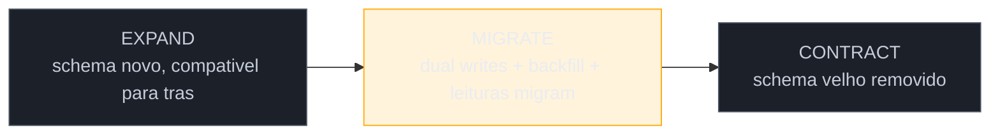
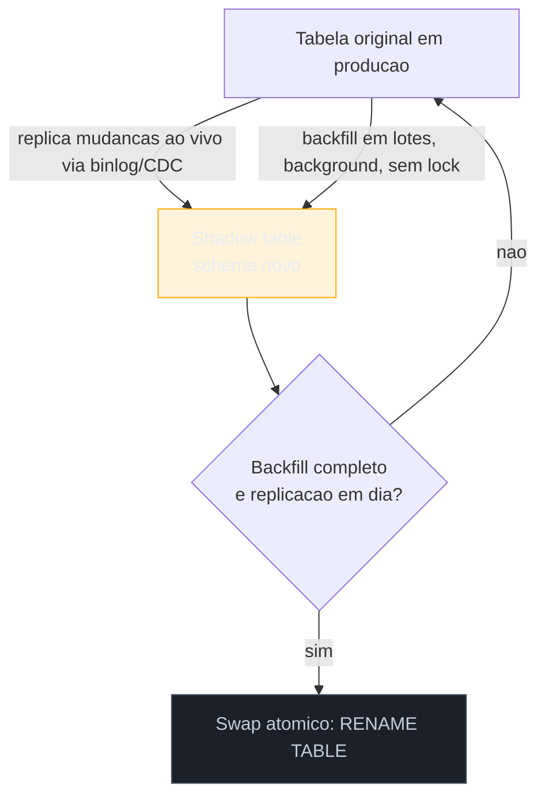

# Migração de dados e schema

> [!abstract] TL;DR
> Toda decisão Migrate da [[17 - Frameworks de decisão|nota 17]], executada via [[18 - Strangler Fig|Strangler Fig]] ou [[19 - Branch by Abstraction e Anti-Corruption Layer|Branch by Abstraction]], esbarra cedo ou tarde no mesmo fundo: os dados. Rotear código é reversível numa linha de configuração; mover **dados** de um schema para outro, sem downtime e sem perder história, é o problema mais difícil por baixo de qualquer migração — porque dado tem *estado*, e estado não se recompila. Esta nota aprofunda o **asset capture** da nota 18 no nível do schema: o padrão **expand-contract** (Fowler/Sato — também chamado *parallel change*), que separa a mudança em três fases disciplinadas — expandir o schema de forma compatível-para-trás, migrar com *dual writes* e *backfill*, só então contrair o velho —, mais a técnica das **shadow tables** para tabelas grandes demais para travar, e a **arqueologia de dados**: escavar o *significado* real de colunas sujas (a [[03-Dominios/Engenharia/Complexidade de Software/04 - O programa como teoria|teoria de Naur]] aplicada ao dado) antes de migrar qualquer coisa. Feature flags e o *parallel run* que compara valores velho×novo em produção ficam para a [[21 - Validação em produção|nota 21]] — aqui o assunto é só schema e movimento de dado.

Volte ao motor de faturamento da nota 18. A facade já roteia por tipo de contrato, a rede de caracterização trava o comportamento, e o primeiro tipo de contrato acabou de migrar para a implementação nova — no papel, um sucesso. Só que, na retro, alguém faz a pergunta que devia ter vindo antes: *"a fatura #48213, emitida essa manhã, existe em qual banco?"* Silêncio. O código novo grava no banco novo. O código velho, que ainda processa os outros oito tipos de contrato, grava no banco velho. E o relatório fiscal mensal — que ninguém tocou, porque "é só leitura" — consulta apenas o banco velho. As faturas do tipo já migrado, emitidas pelo motor novo, simplesmente não aparecem nele. Ninguém decidiu isso conscientemente; aconteceu porque a migração de *código* correu com toda a disciplina do Strangler Fig, mas ninguém aplicou a mesma disciplina a para onde os **dados** estavam indo.

Esse é o buraco que esta nota tapa. O Strangler Fig te ensinou a mover o *fluxo* de requisições sem downtime; agora é preciso mover o *estado* que esse fluxo lê e escreve — sem downtime, sem perder uma fatura sequer, e sem que dois sistemas briguem por quem é dono do mesmo registro.

## A anatomia: expand, migrate, contract

O nome vem de Martin Fowler e Danilo Sato, que descreveram o padrão como **parallel change** — mudar uma interface (de código ou de schema) em três passos, nunca num só, para que nunca exista um instante em que consumidores antigos e novos não tenham para onde ir. Aplicado a schema de banco, os três passos ganharam o apelido mais comum na indústria: **expand-contract**.

**EXPAND — adicionar sem remover.** O primeiro passo é puramente aditivo: cria-se a coluna, a tabela ou o schema novo *ao lado* do velho, sem tocar em nada que já existe. Nenhum código antigo quebra, porque nada que ele lê ou escreve mudou — só apareceu algo novo que ele ainda ignora. Esta é a fase mais barata e mais segura de toda a migração, e é onde a maior parte do trabalho de *design* do schema novo acontece: pensar a estrutura certa sem a pressão de já estar movendo dado real.

**MIGRATE — o meio do rio.** Esta é a fase que dura mais tempo e concentra quase todo o risco. Três coisas acontecem, geralmente nesta ordem:

1. **Dual writes.** O código passa a escrever em *ambos* os schemas a cada operação — toda fatura nova grava no banco velho *e* no banco novo. É assim que se evita a lacuna que abriu a história de abertura: a partir do instante em que o dual write liga, nenhum dado novo nasce só num dos lados.
2. **Backfill.** Dual writes cobrem dados *novos*, não os que já existiam antes de ligar. Um job de backfill percorre o histórico — todas as faturas emitidas antes de hoje — e as copia, lote a lote, do schema velho para o novo, até que os dois estejam sincronizados ponta a ponta.
3. **Migrar as leituras.** Só depois que o backfill termina e a confiança no dado novo está estabelecida é que as leituras (relatórios, APIs, telas) passam, uma consumidora de cada vez, a consultar o schema novo em vez do velho — o mesmo princípio de uma-rota-por-vez do Strangler Fig, agora aplicado a *consultas* em vez de *escritas*.

**CONTRACT — remover só quando ninguém mais olha.** O schema velho só é desligado quando toda escrita e toda leitura já migraram — quando ele virou, de fato, um espectador silencioso que ninguém consulta. Remover antes disso quebra alguém que você não sabia que ainda dependia do velho; é o erro mais comum do padrão, e a primeira armadilha desta nota.

> [!question]- Por que não simplesmente trocar o schema de uma vez, como um `ALTER TABLE` gigante?
> Porque um `ALTER TABLE` que muda o significado de uma coluna em produção é, na prática, o *big-bang cutover* da [[18 - Strangler Fig|nota 18]] aplicado a dados: por um instante, o schema inteiro está num estado só, e se algo estiver errado — um valor que não migra limpo, um consumidor que ninguém mapeou — não há como voltar sem perder o que foi escrito nesse meio-tempo. O expand-contract troca essa aposta única por uma sequência de passos reversíveis: em EXPAND você pode simplesmente não terminar o schema novo e não ter quebrado nada; em MIGRATE você pode pausar o backfill e migrar leituras de volta; só em CONTRACT — o único passo destrutivo — a reversão fica cara, e é por isso que ele vem por último, só depois que toda incerteza já foi resolvida nos passos anteriores.

## Shadow tables: migrar schema em tabelas gigantes sem travar tudo

O expand-contract descreve a *estratégia*; para tabelas de milhões ou bilhões de linhas, falta a *técnica* — porque um `ALTER TABLE` direto numa tabela desse tamanho trava escritas por minutos ou horas, o que é inaceitável num sistema que não pode sair do ar. A solução que se tornou padrão de fato na indústria — popularizada pelo `gh-ost` do GitHub e por ferramentas irmãs como o `pt-online-schema- change` da Percona — é a **shadow table**.

A ideia: em vez de alterar a tabela em produção, cria-se uma cópia dela — a *sombra* — já com o schema novo, vazia. Um mecanismo de captura de mudanças (no caso do `gh-ost`, lendo o *binary log* de replicação do MySQL) espelha, em tempo real, toda escrita que chega na tabela original para a sombra. Em paralelo, um job de *backfill* copia, em lotes pequenos e sem lock, as linhas que já existiam antes de a sombra nascer. Quando a sombra está totalmente sincronizada — todo histórico copiado, toda escrita nova replicando em tempo real — a troca final é um `RENAME TABLE` atômico: a sombra vira a tabela oficial, a antiga vira a que vai ser descartada. A operação inteira nunca bloqueia uma escrita por mais do que o tempo de um `RENAME`, tipicamente milissegundos.

Repare que a shadow table é, em miniatura, o próprio expand-contract: a sombra é o EXPAND (schema novo crescendo ao lado), a replicação ao vivo mais o backfill são o MIGRATE, e o `RENAME` atômico é o CONTRACT — só que comprimido para dentro de uma única operação de banco, em vez de espalhado por semanas de código de aplicação. É por isso que ferramentas como `gh-ost` resolvem *mudança de estrutura* (adicionar coluna, mudar tipo, criar índice) numa única tabela, mas não substituem o expand-contract quando a migração cruza *sistemas* diferentes (do monólito para um serviço novo, por exemplo) — aí o dual write e o backfill precisam viver no código da aplicação, não dentro do banco.

## Arqueologia de dados: escavar o significado antes de mover

Tudo até aqui presume que você sabe o que cada coluna significa. Em sistema legado, essa é a presunção mais perigosa que existe. Abra a tabela de cargas da plataforma de logística e você encontra uma coluna `status_carga`, inteiro, valores de 1 a 9. Pergunte ao time o que cada número significa e a resposta mais honesta que você vai ouvir é *"1 é criado, 9 é entregue... o resto eu não tenho certeza"*. Ninguém mente de propósito — é que a coluna foi criada em 2014, teve dois reaproveitamentos de valor ao longo dos anos (o "5" já significou "cancelado" e hoje significa "aguardando alfândega"), e a única documentação que já existiu era a cabeça de alguém que saiu da empresa há três anos.

Migrar esse dado *mecanicamente* — copiar o inteiro 1-9 para uma coluna nova, ponto — é migrar o símbolo e perder o significado. É a versão, no nível do dado, exatamente do que Naur descreve sobre código: o valor real não está no artefato, está na teoria de por que ele existe. Uma coluna `status` sem essa teoria é um número arbitrário; migrá-la sem recuperar o significado é apostar que o número novo vai continuar significando, para sempre, o que ele parece significar hoje — uma aposta que frequentemente perde.

A escavação, na prática, cruza várias fontes de evidência, nenhuma confiável sozinha:

- **Distribuição real dos valores.** Uma consulta simples — `SELECT status_carga, COUNT(*) FROM cargas GROUP BY status_carga` — já revela padrões: se "5" aparece só em registros anteriores a 2019 e nunca depois, é forte evidência de que o significado mudou naquela época, não que "5" seja ambíguo hoje.
- **Correlação com outras colunas e datas.** Cruzar `status_carga` com `data_atualizacao` e com outras tabelas (existe uma `carga_alfandega` associada às linhas com status 5 recentes?) costuma revelar o significado atual mesmo quando ninguém lembra dele de cabeça.
- **Forense de histórico.** O `git blame` e o `git log` no código que lê e escreve aquela coluna — a mesma técnica da [[07 - Arqueologia do histórico|nota 07]], aqui aplicada ao *schema* — frequentemente acha o commit que introduziu o valor "5" novo, com uma mensagem ou um ticket linkado que explica o porquê.
- **Entrevista com quem ainda usa o dado.** O time de operação que resolve chamados de alfândega sabe, na prática, o que "5" quer dizer hoje, mesmo que nunca tenha lido o código. Conhecimento tribal ([[24 - Conhecimento e documentação|nota 24]]) é fonte primária aqui, não coadjuvante.

> [!tip] Trate a decisão de mapeamento como código, e teste-a como código
> Depois de reconstruir o significado, a tentação é aplicar o mapeamento uma vez, no script de backfill, e seguir em frente. Melhor: escreva o mapeamento como uma função pura (`status_carga: int -> status: enum`) e trave-a sob um **approval test** ([[11 - Approval e Golden Master testing|nota 11]]) — rode a função contra uma amostra real da distribuição de valores e aprove o resultado à mão, uma vez. Isso transforma uma decisão de arqueologia, feita sob incerteza, num artefato versionado e revisável — e pega na hora qualquer regressão se alguém "corrigir" o mapeamento sem entender o motivo original.

## Fundamento teórico: por que mover dados é mais difícil que mover código

Os padrões acima parecem só disciplina de engenharia, mas por baixo deles há uma diferença estrutural entre código e dado que vale nomear — porque é ela que explica por que atalhos que funcionam bem para refatorar código falham silenciosamente quando aplicados a dados.

**1. Dado tem estado; código, não.** Refatorar uma função é seguro porque, se o resultado está errado, basta reverter o commit — a função *não carrega história própria*, ela é recriada do zero a cada deploy. Uma tabela carrega história: cada linha é um fato que já aconteceu (a fatura #48213 já foi emitida), e "reverter" não apaga o fato, só a representação dele. É por isso que o expand-contract nunca tenta o equivalente do `git revert` em dados — ele *acumula* estado em camadas (o velho intacto, o novo crescendo ao lado) em vez de substituir, porque substituir estado vivo sem um plano de recuperação é irreversível de um jeito que substituir código nunca é.

**2. Dual writes não são atômicas — e Kleppmann é claro sobre o porquê.** Em *Designing Data-Intensive Applications*, Martin Kleppmann nomeia precisamente o risco que abriu esta nota: escrever em dois sistemas de dados diferentes, a partir do código da aplicação, **não é uma operação atômica**. Entre a escrita no banco velho e a escrita no banco novo pode haver falha parcial (a segunda escrita falha enquanto a primeira já comitou) ou uma corrida entre duas requisições concorrentes que gravam a mesma entidade em ordens diferentes nos dois bancos — e o resultado, em ambos os casos, é **divergência silenciosa**: os dois sistemas descrevem realidades diferentes e nada acusa o erro até um relatório bater errado meses depois. A correção estrutural que Kleppmann recomenda — e que ferramentas como `gh-ost` aplicam por baixo dos panos — é ter **um único escritor real** (o banco velho, durante a transição) e propagar as mudanças para o novo por um mecanismo de replicação de log (*change data capture*), em vez de fazer a aplicação escrever duas vezes de forma independente. Quando o dual write explícito no código da aplicação é inevitável (é o caso mais comum no expand-contract clássico), a mitigação é tratar cada par de escritas como uma transação lógica com reconciliação: registrar toda escrita, comparar periodicamente os dois lados, e ter um processo de correção para as divergências que aparecerem — nunca presumir que "escrevi nos dois, então está sincronizado".

**3. Ambler & Sadalage: schema também se refatora — com o mesmo rigor, e um período de transição formal.** *Refactoring Databases* (Scott Ambler e Pramod Sadalage) estende ao schema a mesma disciplina que Fowler formalizou para código: toda mudança de estrutura deve ser pequena, testável e **preservar o comportamento observável** de quem consome o schema. A contribuição central do livro para esta nota é nomear formalmente o **transition period** — a janela em que schema velho e novo coexistem, com triggers, views ou dual writes garantindo que os dois permaneçam consistentes — como parte *obrigatória* de qualquer refatoração de banco em produção, nunca um passo opcional que se pula quando o time está com pressa. É a mesma fase MIGRATE do expand-contract, com um nome formal e um catálogo de técnicas.

**4. A teoria do dado é teoria de Naur, só que sobre valores em vez de código.** A arqueologia de dados não é uma etapa burocrática antes da migração técnica — é a aplicação literal da [[03-Dominios/Engenharia/Complexidade de Software/04 - O programa como teoria|tese de Naur]] ao dado: o significado de `status_carga = 5` não está armazenado em lugar nenhum do banco, só na cabeça de quem o escreveu (ou escreveu por último). Migrar sem recuperar essa teoria é o equivalente, em dados, de reescrever código sem entender por que ele é feio — você descarta conhecimento acumulado e reintroduz, silenciosamente, os mesmos erros que aquele "5" reaproveitado já resolveu uma vez.

**Migração de dados em uma frase:** mover dado sem downtime é expandir o schema sem quebrar ninguém, migrar com um único escritor real por trás de qualquer dual write, e só contrair o velho depois de recuperar — não presumir — o significado que cada valor sempre carregou.

## Casos práticos

### Cenário 1: expand-contract no motor de faturamento

Voltando à história de abertura. Depois do incidente do relatório fiscal, o time formaliza o processo. **EXPAND**: cria-se a tabela `faturas_v2`, com o schema novo (campos normalizados de imposto, em vez dos `if`s aninhados), vazia, sem tocar na `faturas` original. **MIGRATE**: o código do motor novo passa a gravar em `faturas_v2` a cada fatura emitida — mas, crucialmente, em vez de a aplicação escrever nas duas tabelas de forma independente (o dual write ingênuo que Kleppmann alerta), um processo de *change data capture* lendo o log de transações da `faturas` original replica cada escrita também para `faturas_v2`, garantindo que exista **um** escritor real. Um job de backfill, rodando em lotes fora do horário de pico, copia as faturas históricas. Só quando a contagem de linhas e uma amostra de somas batem entre as duas tabelas é que o relatório fiscal migra a leitura para `faturas_v2` — resolvendo, de uma vez por todas, o buraco que abriu a nota. **CONTRACT** acontece semanas depois, quando o último consumidor (um script batch de auditoria, achado só depois de uma busca ampla por referências a `faturas`) também migra, e a tabela velha é finalmente removida.

### Cenário 2: arqueologia antes de migrar o cadastro de cargas

Um subsistema separado, o cadastro de cargas, precisa da mesma tratativa — mas aqui o problema não é volume, é significado. Antes de desenhar o schema novo, o consultor roda a escavação descrita acima na coluna `status_carga`: a distribuição de valores mostra que "5" praticamente desaparece depois de outubro de 2019 e reaparece com um padrão de uso diferente a partir de 2021; o `git blame` no código que lê essa coluna acha um commit de 2021 com a mensagem "reusa status 5 p/ alfândega, evita migration"; uma conversa de dez minutos com o time de operação confirma o significado atual. O schema novo nasce já com um `enum` explícito (`CRIADO`, `EM_TRANSITO`, ..., `AGUARDANDO_ALFANDEGA`), e a função de mapeamento `status_carga -> StatusCarga` é travada por um approval test rodado contra uma amostra real de dez mil linhas antes de qualquer backfill começar. O trabalho mais caro dessa migração não foi mover o dado — foi descobrir, com evidência e não com achismo, o que ele sempre quis dizer.

## Armadilhas comuns

> [!warning] Dual write sem fonte única da verdade
> **O que acontece:** a aplicação escreve nos dois bancos de forma independente, em código de aplicação, sem nenhum mecanismo de reconciliação. Uma falha parcial ou uma corrida entre requisições concorrentes deixa os dois bancos divergentes, e ninguém percebe até um relatório bater errado. **Por quê:** dual write parece trivial ("é só chamar `.save()` duas vezes"), mas não é atômico — é exatamente o risco que Kleppmann nomeia em *Designing Data-Intensive Applications*. **Como evitar:** prefira um mecanismo de captura de mudanças (CDC) com um único escritor real por trás das duas escritas; quando o dual write explícito for inevitável, instrumente reconciliação periódica que compare os dois lados e alarme divergência — nunca confie no "escrevi nos dois" sem verificação.

> [!warning] Contrair cedo demais
> **O que acontece:** o schema velho é removido assim que os consumidores *conhecidos* migraram — e semanas depois um job batch esquecido, um relatório de auditoria ou uma integração externa quebra, porque ainda lia do velho. **Por quê:** "quem ainda usa isso" é uma pergunta sobre comportamento em produção, não sobre a lista de serviços que o time lembra de cabeça; scripts esporádicos e integrações externas são os primeiros a ficar de fora do inventário. **Como evitar:** antes do CONTRACT, monitore acessos reais ao schema velho por um período — se ele parou de ser lido/escrito de verdade, não só "no que a gente sabe" — e só então remova. A técnica de comparação de tráfego velho×novo em produção é o assunto da [[21 - Validação em produção|nota 21]].

> [!warning] Migrar o símbolo, não o significado
> **O que acontece:** uma coluna reaproveitada, com significados diferentes ao longo do tempo, é copiada mecanicamente para o schema novo — e o dado migrado passa a mentir sobre metade da sua própria história. **Por quê:** o significado de um valor legado só existe fora do banco — na cabeça de quem o escreveu, em commits antigos, em conhecimento tribal — e é fácil presumir que o valor "fala por si". **Como evitar:** rode a arqueologia de dados (distribuição, correlação, forense de histórico, entrevista) antes de desenhar o schema novo, e trave o mapeamento resultante sob approval test.

> [!warning] Backfill sem idempotência ou sem lote
> **O que acontece:** um job de backfill que roda uma vez "com sorte" duplica registros se precisar ser reexecutado (por uma falha no meio do caminho), ou trava a tabela inteira por travar tudo de uma vez em vez de andar em lotes pequenos. **Por quê:** backfill em sistema legado quase nunca roda limpo na primeira tentativa — falhas de rede, timeouts e dados inesperados são a regra, não a exceção — e reprocessar sem proteção contra duplicação é o caminho mais curto para corromper o próprio dado que você está tentando salvar. **Como evitar:** projete o backfill para ser re-executável com segurança (chave de upsert, não insert puro) e para andar em lotes pequenos e pausáveis — o mesmo princípio de lotes pequenos que sustenta o Strangler Fig, agora aplicado a jobs de dados.

## Como explicar em inglês

> Moving data safely is harder than moving code, because data carries state that can't just be recompiled. I use the expand-contract pattern — sometimes called parallel change — to do it: expand the schema in a backward-compatible way first, migrate with dual writes and a backfill job while reads gradually move over, and only contract the old schema once nothing reads it anymore. For large tables I lean on shadow-table tooling like gh-ost, which replicates live changes via the binlog and swaps tables atomically. And before touching legacy columns, I always do a round of data archaeology — profiling value distributions, checking git blame, talking to whoever still uses the data — because a reused status column can silently mean two different things across two eras of the codebase.

| PT | EN |
|----|----|
| expandir / migrar / contrair | expand / migrate / contract |
| escrita dupla | dual write |
| preenchimento retroativo | backfill |
| tabela sombra | shadow table |
| fonte única da verdade | single source of truth |
| captura de mudanças (log) | change data capture (CDC) |
| arqueologia de dados | data archaeology |
| significado perdido | lost meaning |
| troca atômica | atomic swap |

## O que vem a seguir

Com o schema migrado e os dados sob um dono claro, falta a coragem de confiar no lado novo em produção — e é aí que o *asset capture* se encontra com a *validação*.

- [[21 - Validação em produção|nota 21]] — feature flags, dark launch e o *parallel run* que compara, requisição a requisição, se o dado novo bate com o velho antes de você desligar qualquer coisa: o complemento natural desta nota.
- [[22 - Dependências, upgrades e segurança|nota 22]] — muitas migrações de schema nascem de um upgrade forçado de banco ou framework (EOL, CVE); a próxima nota cobre essa outra pressão que empurra componentes para o quadrante Migrate.
- [[24 - Conhecimento e documentação|nota 24]] — depois de escavar o significado de uma coluna, registre a decisão em algum lugar que sobreviva ao próximo consultor; a arqueologia que você fez aqui não pode virar conhecimento tribal de novo.

## Fontes

- **Scott W. Ambler & Pramod J. Sadalage** — *Refactoring Databases: Evolutionary Database Design* (Addison-Wesley, 2006) — o livro canônico que estende a disciplina de refactoring ao schema, incluindo o conceito formal de *transition period*.
- **Martin Fowler / Danilo Sato** — [*ParallelChange*](https://martinfowler.com/bliki/ParallelChange.html) — o padrão de mudar uma interface (código ou schema) em expand/migrate/contract, nome-raiz do expand-contract.
- **Martin Kleppmann** — [*Designing Data-Intensive Applications*](https://dataintensive.net/) (O'Reilly,
  2017) — a análise definitiva de por que dual writes não são atômicas e por que change data capture é a alternativa estrutural.
- **GitHub Engineering** — [*Introducing gh-ost*](https://github.blog/2016-08-01-gh-ost-github-s-online-migration-tool-for-mysql/) — a origem e o mecanismo (shadow table + binlog + swap atômico) da ferramenta de migração de schema online mais usada em MySQL.
- Ver também [[18 - Strangler Fig|Strangler Fig]] (o *asset capture* que esta nota aprofunda) e [[03-Dominios/Engenharia/Complexidade de Software/04 - O programa como teoria|O programa como teoria]] (Naur) — o fundamento de por que o significado de um dado nunca está só no dado.
