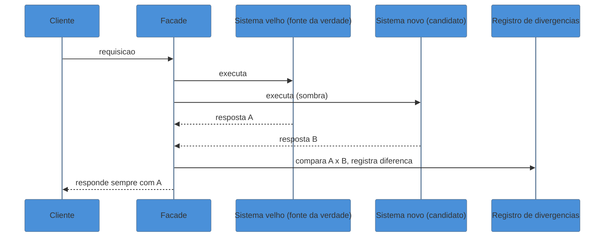
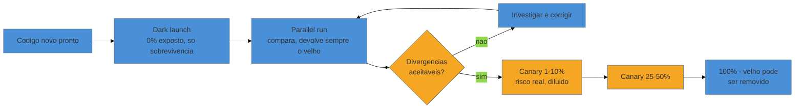

# Validação em produção

> [!abstract] TL;DR
> A [[18 - Strangler Fig|nota 18]] deu a você a facade e o botão de desvio por rota; a [[20 - Migração de dados e schema|nota 20]] deu a você o controle sobre quem é o dono do dado. Falta a peça que decide **quando** apertar o botão: como ter evidência real — não confiança de estômago — de que o código novo está certo antes de deixá-lo responder por um cliente de verdade? Esta nota fecha esse laço com quatro técnicas em ordem crescente de exposição: **dark launch** (rodar o novo em produção sem que ninguém veja o resultado), **parallel run** (rodar os dois, devolver sempre a resposta do velho, comparar em silêncio e acumular divergências — o GitHub Scientist é a ferramenta canônica), **canary release** (expor uma fatia pequena e crescente de tráfego real) e, por baixo de tudo isso, **instrumentar o legado** — dar olhos a um sistema que, sob a lente do consultor, muitas vezes nunca foi observável. Feature flags (Hodgson/Fowler) são o interruptor que sustenta as três primeiras; saber que tipo de flag você está criando é o que evita a próxima geração de dívida técnica.

Volte ao faturamento da plataforma de logística. A implementação nova de `calcularTotal()` para o primeiro tipo de contrato está pronta: a caracterização ([[10 - A rede de segurança primeiro|nota 10]]) bate, os testes unitários passam, o code review foi limpo. A facade ([[18 - Strangler Fig|nota 18]]) já sabe rotear aquele tipo para o motor novo — falta só apertar o botão. E é nesse exato momento que o consultor sênior trava, porque uma pergunta incômoda aparece: *os testes provam que o código faz o que você **pensou** que ele deveria fazer. Eles não provam que ele faz o que a produção real, com seus mil casos de borda que ninguém documentou, vai exigir dele.* Rotear direto para 100% do tráfego é apostar a receita da semana numa hipótese ainda não testada contra a realidade. O time júnior aperta o botão porque "os testes passaram". O consultor sênior sabe que testes passam para o sistema que você imaginou — e o sistema real, depois de quinze anos de remendos, quase sempre tem um pouco mais de mundo do que a sua imaginação.

O que falta não é mais confiança no código — é **evidência de produção antes de arriscar produção**. É esse o problema que as técnicas desta nota resolvem, cada uma expondo o código novo a uma fatia maior de realidade, e cada uma pagando esse aumento de exposição com uma redução proporcional de incerteza.

## O interruptor: feature flags de liberação

Nada do que vem a seguir funciona sem um jeito de ligar e desligar o caminho novo **sem fazer outro deploy**. Esse jeito é a *feature flag* — um `if` controlado em runtime, geralmente por configuração externa, que decide qual caminho de código executa. Pete Hodgson, no artigo de referência hospedado no bliki de Fowler, insiste num ponto que a maioria dos times ignora: nem toda flag é a mesma coisa, e confundir os tipos é a origem da dívida de flags.

| Tipo de toggle | Vida útil típica | Pergunta que responde |
|---|---|---|
| **Release toggle** | Curta (dias a poucas semanas) | "O código novo já pode ser visto por todo mundo?" |
| **Experiment toggle** | Média (semanas) | "Qual variante performa melhor?" (A/B testing) |
| **Ops toggle** | Pode ser longa | "Preciso conseguir desligar isso rápido, num incidente?" |
| **Permissioning toggle** | Longa, é feature de negócio | "Quem tem direito de ver isso?" |

O que esta nota usa, quase o tempo todo, é o **release toggle** — com um pé no **ops toggle**, porque durante a validação a flag também funciona como um interruptor de emergência: se o novo motor de faturamento começar a errar em produção, você reverte a rota num segundo, sem deploy, sem incidente de verdade. A distinção importa porque um release toggle tem uma promessa embutida que um ops toggle não tem: **ele vai ser removido**. O dia em que o motor novo assume 100% do tráfego para sempre é o dia em que a flag — e o `if` que a lê, e o código velho que ela ainda consegue rotear — deveriam desaparecer do repositório. Tratar um release toggle como se fosse permanente é o primeiro passo para recriar, dentro do seu próprio código de migração, o mesmo tipo de legado que você foi contratado para consertar.

## Dark launch: rodar sem que ninguém veja

Antes de comparar o novo com o velho, a primeira pergunta é mais básica: **o código novo sobrevive à carga real de produção?** Você pode ter testado com dados sintéticos, num ambiente de staging que nunca reproduz o tráfego de verdade — picos de horário de pico, payloads malformados que só existem porque um cliente de 2014 ainda usa uma integração antiga, volume concorrente que nenhum teste de carga replica fielmente. O **dark launch** responde a essa pergunta executando o código novo contra tráfego real de produção, **sem jamais expor o resultado a um usuário**. A saída é descartada, ou só logada para inspeção; o que interessa não é se a resposta está certa (isso vem depois, no parallel run) — é se o código aguenta, sem estourar exceção, sem vazar memória, sem degradar latência do resto do sistema.

> [!example] O exemplo canônico
> Fowler registra, no artigo *DarkLaunching* do seu bliki, o caso do Facebook Chat em 2008: a equipe de engenharia ligou toda a infraestrutura de mensageria em produção, para a base inteira de usuários, **semanas antes** de expor um único pixel de interface de chat. O objetivo não era testar se as mensagens estavam certas — era descobrir, sob carga real, se o backend aguentava o volume antes de arriscar a reputação do produto num lançamento público que travasse.

O dark launch é a etapa de menor risco de todas: como ninguém vê o resultado, mesmo uma resposta completamente errada não causa dano nenhum ao usuário. É por isso que ele vem primeiro — é onde você aprende se o código novo *funciona como sistema*, antes de perguntar se ele *responde certo*.

## Parallel run: fechar o laço, comparar em silêncio

Este é o momento em que o laço aberto pela [[18 - Strangler Fig|nota 18]] se fecha. O **parallel run** roda os dois sistemas — velho e novo — para a *mesma* requisição, mas **devolve ao cliente sempre a resposta do velho**, porque o velho continua sendo a fonte da verdade até prova em contrário. A resposta do novo é capturada, comparada com a do velho, e qualquer divergência é registrada — silenciosamente, sem que ninguém no outro lado da chamada perceba que dois motores rodaram. Repetido milhares de vezes contra tráfego real, isso produz o que nenhum conjunto de testes manuais consegue produzir sozinho: **evidência empírica, em volume, de que o novo concorda com o velho na distribuição real de entradas** — não na distribuição que você imaginou ao escrever os testes.

A ferramenta canônica dessa técnica é o **Scientist**, biblioteca de código aberto que o GitHub criou para si mesmo — e o nome não é acidental. Scientist estrutura o parallel run como um experimento formal: você define um bloco `use` (o controle — o comportamento velho, que é executado e cujo resultado é sempre retornado) e um bloco `try` (o candidato — o comportamento novo, executado em paralelo, cujo resultado é só observado). A biblioteca cuida de rodar os dois, medir o tempo de cada um, comparar as saídas e publicar o veredito para um sistema de métricas — tudo isso sem que o resultado do candidato jamais alcance o usuário. O GitHub usou exatamente essa técnica para migrar partes centrais e arriscadas do próprio GitHub.com com confiança, e é a razão pela qual "Scientist" virou sinônimo de parallel run em boa parte da indústria.

> [!question]- Por que não simplesmente confiar nos testes de caracterização e pular direto pra 100%?
> Porque a caracterização testa contra o **modelo que você reconstruiu** do comportamento do sistema — e esse modelo, por melhor que seja a engenharia reversa, é sempre uma aproximação. A produção real testa contra a **distribuição real de entradas**, que inclui combinações que ninguém pensou em escrever como caso de teste: o cliente com um CNPJ mal formatado desde 2016, o desconto composto com um cupom vencido, o fuso horário que ninguém lembrava que existia. O parallel run não substitui a caracterização — ele a **valida em escala**, contra a realidade que nenhuma suíte de testes consegue antecipar sozinha.

## Canary release: expor uma fatia, sob observação

A analogia dá nome à técnica antes de qualquer explicação técnica: mineiros de carvão desciam com um canário numa gaiola porque o pássaro morre de intoxicação por gás muito antes de um humano perceber qualquer sintoma — o canário é exposto ao risco real primeiro, em dose pequena, como sistema de alarme antecipado. O **canary release** faz exatamente isso com tráfego: depois que o dark launch provou que o código sobrevive e o parallel run acumulou evidência de que ele responde certo, você finalmente deixa o novo **responder de verdade** — mas só para uma fatia pequena do tráfego real (1%, depois 10%, depois 50%), observando de perto métricas técnicas (erros, latência) e, principalmente, métricas de negócio, antes de ampliar a fatia.

A diferença crucial entre canary e parallel run é essa: no parallel run, o resultado do candidato nunca chega ao usuário — o risco real é zero. No canary, o resultado do candidato **é** a resposta que o usuário recebe — o risco real é diluído, não eliminado. É por isso que o canary vem depois, não antes: você só expõe usuários reais ao candidato depois de já ter evidência (dark launch + parallel run) de que a probabilidade de erro é baixa. Pular direto para canary sem as duas etapas anteriores é descer na mina sem o pássaro.

## Instrumentar o legado: dar olhos a um sistema cego

Tudo o que veio antes pressupõe uma capacidade que, sob a lente do consultor, quase nunca vem de graça: a capacidade de **ver** o que aconteceu. Comparar respostas no parallel run, medir erro e latência no canary, confirmar que o dark launch não vazou memória — nada disso é possível se o sistema que você herdou não produz métricas, logs estruturados ou traces. E um sintoma comum de sistema legado, especialmente o que chega por herança de cliente ou resgate de emergência, é exatamente esse: ninguém instrumentou nada, porque quem escreveu o sistema confiava na própria memória para saber o que ele fazia — e foi embora.

Isso não é o assunto de [[03-Dominios/Engenharia/Operação/index|Operação]] reaparecendo por inteiro aqui — SLO, SLI, a disciplina completa de observabilidade como prática de engenharia continua morando lá, e não vale a pena reescrever aquilo neste galho. O que é assunto **daqui** é mais estreito e mais urgente: antes de rotear qualquer flag, você precisa instrumentar **cirurgicamente** o exato seam ([[12 - Seams e quebra de dependência|nota 12]]) por onde a mudança vai passar — um contador de chamadas, uma linha de log estruturado no ponto de decisão, um span de trace ao redor da função candidata. Não é um projeto de observabilidade da empresa inteira; é o mínimo de olhos necessário para que o parallel run e o canary tenham algo para medir. Instrumentar tudo é trabalho de meses; instrumentar o seam certo é trabalho de uma tarde — e é o que desbloqueia toda a validação que vem depois.

## Fundamento teórico: observabilidade como pré-condição epistêmica

As quatro técnicas acima parecem só uma escada de exposição crescente, mas por baixo delas há uma ideia mais forte: você só pode **saber** se uma mudança está certa na medida em que o sistema permite que você observe seu comportamento. Vale nomear essa base.

**1. Observabilidade, no sentido formal, é uma propriedade do sistema — não uma ferramenta.** O termo vem da teoria de controle: Rudolf Kálmán, em 1960, definiu formalmente que um sistema é *observável* quando seu estado interno pode ser reconstruído a partir apenas de suas saídas externas, observadas ao longo do tempo. Um sistema legado sem logs, sem métricas, sem traces é, nesse sentido literal e técnico, **inobservável**: não existe sequência de saídas que permita reconstruir o que aconteceu por dentro. É por isso que instrumentar não é um passo opcional de polimento — é a **pré-condição** para que qualquer uma das outras três técnicas signifique alguma coisa. Rotear uma flag para um sistema inobservável não é validação; é só torcer no escuro com um interruptor a mais.

**2. Falsificação vale mais que confirmação.** Karl Popper argumentou que uma teoria científica se prova não acumulando casos que a confirmam, mas resistindo a tentativas sérias de refutá-la. O nome "Scientist" da biblioteca do GitHub não é retórica vazia: um parallel run bem desenhado está ativamente **procurando divergência** — ele não roda esperando que os dois sistemas concordem, ele compara sistematicamente atrás de qualquer caso em que discordem. Isso é o oposto epistêmico de um QA manual, que tende a testar os caminhos felizes e sair satisfeito quando eles funcionam (confirmação). Rodar milhares de comparações silenciosas contra tráfego real é uma busca ativa por refutação, em escala que nenhum humano roda manualmente — e é exatamente por isso que ela vale mais como evidência.

**3. O gap entre teoria reconstruída e realidade.** A [[10 - A rede de segurança primeiro|nota 10]] mostrou como reconstruir, via characterization tests, a teoria (Naur) do comportamento atual do sistema. Mas essa teoria reconstruída é sempre um **modelo**, não a coisa em si — construído a partir dos casos que você conseguiu imaginar e observar durante a engenharia reversa. A produção real expõe o candidato à distribuição *verdadeira* de entradas, que sempre excede o modelo reconstruído por alguma margem. O parallel run é, portanto, o teste definitivo de quão boa foi a sua reconstrução da teoria: cada divergência que ele encontra não é (só) um bug no código novo — é um buraco na teoria que você achou que tinha recuperado por completo.

**Validação em produção em uma frase:** você só sabe se uma mudança está certa na medida em que consegue observá-la — instrumente o sistema para torná-lo observável, exponha o candidato em doses crescentes de risco real (dark launch, parallel run, canary) e trate cada divergência encontrada como evidência sobre os limites da sua própria teoria reconstruída, não só como um bug.

## Casos práticos

### Cenário 1: o faturamento — parallel run e canary por tipo de contrato

Retomando o faturamento da [[17 - Frameworks de decisão|nota 17]] e da [[18 - Strangler Fig|nota 18]]: a implementação nova de `calcularTotal()` para contratos do tipo "assinatura mensal" está pronta e passa na caracterização. Antes de rotear qualquer coisa, o consultor cria uma release toggle `novo_calculo_assinatura`, com data de expiração marcada no calendário do time — o compromisso explícito de que ela será removida. A facade passa a rodar os dois motores para cada fatura desse tipo, devolvendo sempre a resposta do motor velho e logando qualquer diferença. Na primeira semana, a taxa de divergência é de 0,3% — investigando, o consultor descobre que o motor novo arredonda parcelas de forma diferente em contratos com desconto composto, um caso de borda que nenhum teste unitário cobria. Corrigido o arredondamento, mais uma semana de parallel run sem divergência é o suficiente para virar a flag em canary: 5% do tráfego real recebe a resposta do motor novo, com alarmes configurados em cima da instrumentação recém-adicionada. Sem incidentes em dois dias, sobe para 50%, depois 100%. Só então a rota antiga — e a flag — são removidas do código.

### Cenário 2: o sistema de reconciliação sem instrumentação nenhuma

Um consultor entra num resgate de emergência: um sistema de reconciliação financeira, herdado sem documentação, falha esporadicamente à noite, e ninguém sabe dizer por quê — porque o sistema nunca teve um único log estruturado, só `print`s soltos que ninguém revisa. Antes de cogitar qualquer mudança de código, a primeira ação não é corrigir nada: é **dar olhos ao sistema**. O consultor instrumenta cirurgicamente o único seam relevante — o ponto onde a reconciliação compara os dois lados do balanço — com um log estruturado contendo os valores de entrada e o resultado, e um contador de falhas por tipo de causa. Uma semana rodando essa instrumentação (um dark launch de observabilidade, não de código novo: nada muda no comportamento, só se passa a enxergá-lo) revela o padrão: as falhas coincidem exatamente com um job de importação noturno que grava dados parcialmente antes de um timeout. O bug nunca foi de lógica de negócio — era uma condição de corrida que só ficou visível quando o sistema, pela primeira vez, foi capaz de relatar o que estava fazendo.

## Armadilhas comuns

> [!warning] O toggle esquecido
> **O que acontece:** a flag de release, criada para durar dias, ainda está no código dois anos depois — ninguém lembra por que ela existe, ninguém tem coragem de removê-la, e o `if` que ela controla acumula ao redor de si o mesmo tipo de complexidade não-documentada que caracteriza código legado. **Por quê:** remover uma flag exige um passo deliberado (confirmar que 100% do tráfego já vai pelo caminho novo, apagar o código velho, apagar a flag), e esse passo compete por prioridade com trabalho "novo" — sempre perde. **Como evitar:** toda release toggle nasce com uma data de expiração no calendário do time, não só na cabeça de quem a criou. Trate a remoção da flag como parte do escopo da migração, exatamente como a [[18 - Strangler Fig|nota 18]] trata a remoção do sistema velho como parte do escopo do Strangler Fig — não como um bônus opcional.

> [!warning] Parallel run em operações com efeito colateral
> **O que acontece:** o candidato roda "em sombra" contra uma operação que envia e-mail, cobra um cartão ou grava num banco — e o cliente recebe dois e-mails, é cobrado duas vezes, ou o banco fica com dado duplicado, mesmo que só a resposta do velho tenha sido devolvida. **Por quê:** parallel run pressupõe que rodar os dois lados é seguro, o que só é verdade para operações sem efeito colateral (leituras) ou cuidadosamente isoladas (escritas redirecionadas para um sandbox, nunca para o sistema real). **Como evitar:** antes de rodar em paralelo, classifique a operação. Se ela tem efeito colateral, ou você isola o lado candidato (grava num ambiente espelho, não no real) ou você troca o parallel run por dark launch com dados sintéticos — nunca rode um efeito colateral duas vezes contra produção de verdade.

> [!warning] Canary não representativo
> **O que acontece:** o canary "passa limpo" — zero erro, latência normal — e o time libera 100% do tráfego, só para descobrir, dias depois, que o candidato quebra num cenário que a fatia do canary simplesmente não continha (um fuso horário, um tipo de cliente, um país). **Por quê:** um canary de 1% escolhido por conveniência (só funcionários internos, só uma região geográfica, só o primeiro ambiente que veio à mão) não é uma amostra da distribuição real — é uma fatia enviesada que parece segura porque nunca encontrou o caso que a quebraria. **Como evitar:** desenhe o canary para ser estatisticamente representativo do tráfego real, e observe métricas de **negócio**, não só técnicas — um canary com 0% de erro HTTP pode, ainda assim, estar calculando o valor errado da fatura, o que nenhum dashboard de infraestrutura vai acusar.

> [!warning] Validar sem instrumentar primeiro
> **O que acontece:** o time constrói a flag, o dark launch, o canary — toda a mecânica de exposição gradual — mas o sistema por baixo continua sem logs nem métricas no ponto que importa, e ninguém consegue dizer, ao final, se o candidato realmente concordou com o velho ou só não quebrou de forma visível. **Por quê:** instrumentar parece trabalho de suporte, não trabalho "de verdade" — e é tentador pular direto para a parte vistosa (a flag, o rollout) sem construir a capacidade de observar o resultado. **Como evitar:** trate a instrumentação do seam específico como pré-requisito bloqueante, não como acompanhamento opcional. Sem observabilidade no ponto certo, dark launch e parallel run só produzem a ilusão de validação — você está torcendo o interruptor no escuro com mais cerimônia.

## Como explicar em inglês

> I never flip a legacy code path straight to a hundred percent. I climb a ladder of increasing exposure: dark launch first, running the new path against real traffic with the output discarded, just to see if it survives load. Then a parallel run — Scientist-style — where I always return the legacy system's answer but silently compare it against the candidate and log every divergence, so I accumulate real evidence before trusting anything. Only then a canary, exposing a small, representative slice of real traffic to the new behavior. None of that works if the legacy system isn't instrumented, so making it observable at the exact seam I'm touching is a prerequisite, not an afterthought.

| PT | EN |
|----|----|
| flag de liberação (curta vida) | release toggle |
| lançamento oculto | dark launch |
| execução em paralelo | parallel run |
| lançamento canário | canary release |
| interceptar sem expor | shadow / intercept without exposing |
| divergência registrada | logged divergence |
| dar olhos ao sistema / instrumentar | instrument the system / add observability |
| fonte da verdade | source of truth |

## O que vem a seguir

Você agora sabe decidir (nota 17), migrar sem desligar (nota 18-20) e validar cada passo com evidência real (esta nota). O que falta é o que ronda por fora do código: dependências que apodrecem sozinhas e o telefone que toca às três da manhã mesmo depois de todo esse cuidado.

- [[22 - Dependências, upgrades e segurança|nota 22]] — a mesma disciplina de exposição gradual aplicada a um problema diferente: atualizar um runtime ou uma dependência com CVE crítica sem quebrar o que depende dela.
- [[26 - Firefighting em produção|nota 26]] — o dia em que, apesar de toda a validação, algo quebra mesmo assim, e a mesma instrumentação construída aqui é o que separa um incidente de dez minutos de um de dez horas.

## Fontes

- **Pete Hodgson / Martin Fowler** — [*Feature Toggles (aka Feature Flags)*](https://martinfowler.com/articles/feature-toggles.html) — a taxonomia dos quatro tipos de toggle e o alerta sobre a dívida de flags esquecidas.
- **Martin Fowler** — [*DarkLaunching*](https://martinfowler.com/bliki/DarkLaunching.html) — o padrão de rodar código novo em produção sem expor o resultado, com o caso do Facebook Chat.
- **Martin Fowler** — [*CanaryRelease*](https://martinfowler.com/bliki/CanaryRelease.html) — o padrão de expor uma fatia crescente de tráfego real, com a origem da metáfora do canário na mina.
- **GitHub** — [*Scientist*](https://github.com/github/scientist) — a biblioteca de referência para parallel run, com o vocabulário de controle/candidato que este padrão consolidou na indústria.
- **Jez Humble & David Farley** — [*Continuous Delivery*](https://martinfowler.com/books/continuousDelivery.html) — o livro que canonizou a entrega incremental e a redução de risco por exposição gradual, base teórica de toda esta nota.
- **Google** — [*Site Reliability Engineering*](https://sre.google/sre-book/table-of-contents/) — o capítulo sobre monitoramento e observabilidade que fundamenta a exigência de instrumentar antes de validar.
- Ver também [[17 - Frameworks de decisão|Frameworks de decisão]] e [[18 - Strangler Fig|Strangler Fig]], que abrem o laço que esta nota fecha.
