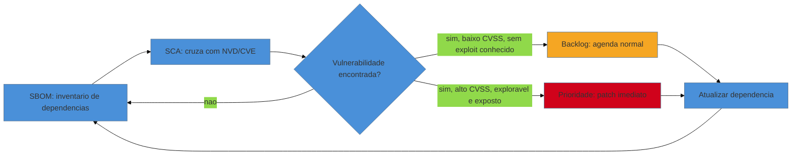

# Dependências, upgrades e segurança

> [!abstract] TL;DR
> A [[17 - Frameworks de decisão|nota 17]] deixou uma dívida em aberto: disse que **Retain tem prazo de
> validade** e prometeu um "gatilho de reavaliação" — esta nota é esse gatilho. Existe uma categoria de
> apodrecimento que nenhuma das técnicas deste galho até aqui cobre, porque ela não acontece *no* seu
> código: acontece **por baixo** dele, nas dependências, no runtime, no framework — enquanto o seu código
> fica parado. Uma biblioteca estável hoje vira uma CVE crítica amanhã sem que ninguém tenha tocado numa
> linha. O trabalho aqui tem duas metades que se alimentam: **due diligence de vulnerabilidades** (SCA,
> SBOM, scanners automatizados como Dependabot/Renovate, o ciclo detectar→priorizar→atualizar) e
> **migração de versão de plataforma** (por que subir um major de cada vez, ler changelog e migration
> guide, e o *transitive dependency hell* que pune quem adia). No fundo, é a
> [[03-Dominios/Engenharia/Complexidade de Software/04 - O programa como teoria|teoria de Naur]] outra
> vez, só que invertida: aqui não é a *sua* teoria que se perde — é a teoria do **mundo em volta** do
> seu sistema que muda, e seu código, parado, fica cada vez mais desalinhado com ela.

Um consultor está na terceira semana de uma due diligence de aquisição. O código-fonte da plataforma de
logística está limpo o bastante — não é o pior legado que ele já viu. Mas o relatório do scanner de
dependências que ele rodou na primeira manhã chegou com 340 alertas, 12 deles marcados **crítico**. Um é
numa biblioteca de parsing XML usada, indiretamente, pelo módulo de integração com a transportadora — uma
dependência transitiva, duas camadas abaixo do que qualquer desenvolvedor do time já abriu no editor. O
CTO da empresa-alvo, na call de fechamento, reage com genuína surpresa: *"Mas esse módulo não muda há dois
anos. Como ele ficou mais arriscado sozinho?"* É a pergunta certa, e a resposta é o assunto desta nota:
**o código pode ficar parado; o mundo em volta dele não para.**

## O código parado, mas o risco andando

Todo o resto deste galho lida com apodrecimento que você pode *ver*: complexidade que sobe a cada commit,
acoplamento que aumenta a cada feature, testes que faltam desde sempre. Esse apodrecimento tem uma
assinatura no `git log` — você consegue apontar o commit, o autor, a data. O apodrecimento de dependência
é diferente por um motivo estrutural: **o `git blame` do seu repositório não mostra nada**, porque nada
mudou no seu repositório. O que mudou foi o ecossistema em volta.

Três relógios correm, independentes da sua vontade, sobre qualquer dependência que você importou:

1. **O relógio da vulnerabilidade.** Um pesquisador de segurança encontra uma falha numa biblioteca que
   você usa. Publica um CVE. A partir desse instante — não do instante em que você "descobre" — o seu
   sistema está exposto, mesmo que você não tenha lido a notícia ainda.
2. **O relógio da manutenção.** O mantenedor de um pacote open source é uma pessoa, às vezes uma só,
   frequentemente não paga para manter aquele código. Ela pode perder o interesse, trocar de emprego, ou
   simplesmente cansar. Quando isso acontece, patches de segurança param de sair — não porque alguém
   decidiu isso, mas porque não há mais ninguém do outro lado.
3. **O relógio do fim de vida (EOL).** Fornecedores de linguagem e framework anunciam datas de fim de
   suporte com anos de antecedência — Python 2 parou em 2020, várias LTS de Node e Java têm janelas
   públicas — e depois dessa data, mesmo uma CVE gravíssima não recebe mais patch oficial.

Nenhum desses três relógios espera você decidir mexer no código. Eles correm sozinhos. E é exatamente por
isso que "Retain" — a decisão de não investir agora, do cardápio de R's da [[17 - Frameworks de decisão|nota 17]] — não pode ser um estado de aposentadoria. É uma pausa com **juros correndo**, e o
trabalho desta nota é o de administrar esses juros antes que virem uma dívida que você não escolheu.

> [!question]- Isso não é só a lei de Lehman de novo, reciclada?
> É a mesma lei, mas operando por um mecanismo diferente — e vale separar os dois. A lei da complexidade
> crescente de Lehman ([[17 - Frameworks de decisão|nota 17]]) fala de complexidade que cresce *quando o
> sistema evolui* (cada feature nova, cada patch, empilha um pouco mais de entropia). Aqui a complexidade
> relativa cresce **mesmo quando o sistema não evolui**, porque o referencial — o estado da arte em
> segurança, as versões suportadas, o conhecimento público sobre falhas — se move sozinho. Um sistema
> perfeitamente parado ainda fica, com o tempo, mais desatualizado em relação ao mundo. É a mesma lei de
> Lehman aplicada a um segundo eixo: não só o código envelhece o ecossistema, o ecossistema envelhece o
> código.

## O ciclo de detectar, priorizar e atualizar

A resposta operacional a um risco que cresce sozinho não pode ser manual — ninguém vai relembrar, toda
sexta-feira, de checar se as 340 dependências transitivas do sistema ganharam alguma CVE nova. Precisa ser
automatizado, contínuo, e alimentar um processo de decisão, não só um alarme. Três peças compõem esse
ciclo.

**SBOM (Software Bill of Materials)** é o inventário: a lista completa e versionada de tudo que o seu
sistema depende, direta e transitivamente — um pacote de nível 1 que depende de um de nível 2 que depende
de um de nível 3. Sem esse inventário, você nem sabe o que perguntar. É o mesmo princípio do inventário
técnico da [[05 - First Contact|nota 05]] (conseguir buildar e rodar), aplicado agora a "conseguir listar
tudo que o sistema importa". Formatos como CycloneDX e SPDX padronizaram isso o bastante para que
ferramentas diferentes leiam o mesmo SBOM — e desde a *Executive Order 14028* de 2021 nos EUA, SBOM deixou
de ser boa prática e virou exigência contratual em vários setores regulados.

**SCA (Software Composition Analysis)** é o cruzamento: pegar aquele inventário e checá-lo, pacote por
pacote e versão por versão, contra bancos de vulnerabilidades públicos — o **NVD** (National Vulnerability
Database, mantido pelo NIST) sendo o canônico, cada entrada com um identificador **CVE** (Common
Vulnerabilities and Exposures) e uma pontuação **CVSS** (0 a 10) que estima severidade. Ferramentas como
OWASP Dependency-Check, Snyk ou o `npm audit`/`pip-audit` nativos fazem esse cruzamento automaticamente. O
resultado não é "seguro/inseguro" — é uma lista priorizável.

**Scanners contínuos** — Dependabot (nativo do GitHub desde 2019) ou Renovate (mais configurável,
open source) — fecham o ciclo: eles não rodam o SCA uma vez por auditoria, rodam **todo dia**, e quando
encontram uma atualização disponível — de segurança ou não — abrem automaticamente um pull request com o
bump de versão e o changelog relevante. Transformam "manter dependências em dia" de um projeto especial
que ninguém tem tempo de fazer numa esteira que roda sozinha em segundo plano.



> [!info] Priorizar não é só ler o número do CVSS
> Um CVSS de 9.8 numa biblioteca que você importa mas nunca chama, num caminho de código morto, é menos
> urgente do que um 6.5 numa função exposta direto a input de usuário não autenticado. A priorização real
> cruza três coisas: a **severidade** (CVSS), a **explorabilidade** (existe exploit público conhecido? é
> fácil de disparar remotamente, como no Log4Shell — CVE-2021-44228, que bastava uma string de log
> controlada por atacante?) e a **exposição** (esse código roda, de fato, em produção, tocando dado
> externo?). É o mesmo raciocínio de hotspot da [[09 - Forense de software|nota 09]] — cruzar duas
> variáveis em vez de confiar numa métrica isolada — aplicado a segurança em vez de manutenibilidade.

## A migração de versão: por que um major de cada vez

Detectar e atualizar patches pequenos (`4.2.1` → `4.2.3`) é o caso fácil: em geral não quebra nada, e as
ferramentas de scanning automatizam até o merge. O caso difícil — o que gera medo real de mexer — é o
**major upgrade**: `Spring Boot 1.x` para `3.x`, `Python 2` para `3`, `Node 12` para `22`. Aqui a
tentação de quem adiou por anos é pular direto: por que gastar três migrações separadas se dá pra ir de
uma vez ao destino final?

A resposta está no contrato que o **Semantic Versioning** (SemVer) estabelece: um bump de versão *major*
sinaliza *breaking changes* — a promessa explícita de que algo que funcionava vai parar de funcionar.
Quando você pula de `v1` direto para `v5`, você não evita as breaking changes de `v2`, `v3` e `v4` — você
as **acumula e recebe todas ao mesmo tempo**, sem nenhum ponto intermediário onde isolar qual mudança
quebrou o quê. É o mesmo argumento de lotes pequenos que fundamenta o Strangler Fig
([[18 - Strangler Fig|nota 18]]): o risco de uma migração não cresce linearmente com o tamanho do salto,
cresce de forma desproporcional, porque o espaço de causas possíveis de uma falha explode com o número de
coisas que mudaram juntas.

```mermaid
%%{init: {"theme": "base", "themeVariables": {"primaryColor": "#4A90D9"}}}%%
graph LR
    subgraph Incremental - um major por vez, testado a cada passo
    A1[v1] --> A2[v2] --> A3[v3] --> A4[v4]
    end
    subgraph Salto direto - todas as breaking changes de uma vez
    B1[v1] -.-> B2[v4]
    end
    style A1 fill:#4A90D9
    style A2 fill:#4A90D9
    style A3 fill:#4A90D9
    style A4 fill:#4A90D9
    style B1 fill:#4A90D9
    style B2 fill:#D0021B
```

Há uma segunda razão, mais mecânica, para subir um major de cada vez: o **transitive dependency hell**.
Cada pacote direto que você usa depende de outros pacotes, que dependem de outros — e cada um deles avança
no tempo, ganhando suas próprias majors, enquanto o seu fica parado. Quanto mais tempo passa, maior o
**gap de versão** em cada ramo dessa árvore, e maior a chance de dois pacotes exigirem versões
incompatíveis de uma terceira dependência compartilhada — o resolvedor de pacotes (npm, Maven, pip) não
consegue satisfazer ambos e ou falha, ou instala duplicatas silenciosamente. Adiar não congela o problema:
**alarga a árvore inteira ao mesmo tempo**, tornando a eventual migração exponencialmente mais cara do que
teria sido se feita major a major, ano a ano.

O procedimento que funciona, sempre: ler o **changelog** e o **migration guide** oficial de cada major
(quase todo framework maduro publica um, com a lista exata de breaking changes e o caminho de codemod
automatizado, quando existe); subir um major; rodar a suíte de testes e, na ausência dela, a rede de
caracterização ([[10 - A rede de segurança primeiro|nota 10]]); só então avançar para o próximo major.
Cada passo é um degrau reversível — exatamente o padrão do [[15 - O Método Mikado|Método Mikado]] e do
[[18 - Strangler Fig|Strangler Fig]], agora aplicado à plataforma em vez de ao código de negócio.

## Fundamento teórico: por que o risco cresce mesmo parado

**1. Lehman revisitado — o eixo externo.** A [[17 - Frameworks de decisão|nota 17]] já trouxe as leis de
Lehman para explicar por que "manter" é sempre temporário. Aqui a mesma lei ganha uma segunda leitura: a
complexidade de Lehman é normalmente lida como *interna* (o sistema fica mais complexo à medida que
evolui). Mas há um eixo *externo* simétrico — o sistema fica mais complexo **em relação ao ambiente**
mesmo parado, porque o ambiente (padrões de segurança, versões suportadas, expectativas de compliance)
segue evoluindo sem ele. Retain, sob esse eixo, não é uma decisão neutra — é uma aposta implícita de que
o ambiente não vai se mover rápido demais antes da próxima reavaliação.

**2. A economia da manutenção open source.** A maior parte do software moderno se apoia numa pirâmide de
pacotes open source mantidos, muitas vezes, por uma única pessoa, sem remuneração — o relatório *Roads
and Bridges* de Nadia Eghbal (2016) documentou essa fragilidade sistêmica: infraestrutura digital crítica
mundial dependendo do tempo livre não pago de um pequeno número de mantenedores. Isso não é uma falha
moral de ninguém — é uma **tragédia dos comuns** estrutural: todo mundo se beneficia do pacote, quase
ninguém contribui de volta com manutenção ou dinheiro, e quando o mantenedor esgota, o patch de segurança
simplesmente não vem. Entender isso muda como você lê um alerta de EOL: não é burocracia de fornecedor, é
o sintoma de um recurso comum que ficou sem quem cuide dele.

**3. CVSS como medida, não como veredito.** O *Common Vulnerability Scoring System* (mantido pelo FIRST)
formaliza severidade em números para tornar priorização comparável entre milhares de achados — mas o
score sozinho mede o *potencial* de dano, não o *risco real* no seu contexto, que depende de exposição e
explorabilidade (como discutido acima). Tratar CVSS como um veredito automático — "tudo acima de 7 é
emergência" — sem cruzar com exposição real é abdicar do julgamento que a
[[03-Dominios/Engenharia/Segurança/index|Segurança Conceitual]] chama de avaliação de risco
propriamente dita.

**4. SemVer como contrato social, não garantia técnica.** O Semantic Versioning (Tom Preston-Werner,
2010) formalizou uma convenção — major.minor.patch, onde major sinaliza breaking change — mas é um
**contrato social**: depende de todo mantenedor da árvore de dependências segui-lo com disciplina. Quando
alguém quebra o contrato (publica uma breaking change num minor, por engano ou pressa), o dependency hell
deixa de ser hipotético. É por isso que testar a cada passo de upgrade — nunca confiar cegamente no
número da versão — não é paranoia, é reconhecer que o contrato é só tão forte quanto quem o assina.

**Dependências, upgrades e segurança em uma frase:** o risco de uma dependência cresce mesmo sem você
tocar no código, porque o ambiente ao redor dela — vulnerabilidades descobertas, mantenedores que somem,
prazos de fim de vida — segue um relógio próprio; administrar esse risco é o gatilho que impede o Retain
de virar negligência.

## Casos práticos

### Cenário 1: a CVE transitiva na integração com a transportadora

Voltando à plataforma de logística da abertura. O SBOM gerado na primeira semana da due diligence revela
que o módulo de integração com a transportadora usa, três camadas abaixo, uma biblioteca de parsing XML
com uma CVE crítica publicada há oito meses — desserialização insegura que permite execução remota de
código se o payload XML vier de fonte não confiável. Ninguém no time sabia que essa dependência existia;
ela chegou transitivamente, via um SDK de terceiros.

O consultor aplica o ciclo: SCA confirma o CVSS (9.8, crítico); a checagem de exposição mostra que o
endpoint que processa esses XMLs *é* acessível pela API pública da transportadora — exposição real, não
teórica. Prioridade máxima. A correção não é reescrever a integração: é forçar, via *dependency
override/BOM*, a versão patchada da biblioteca transitiva, rodar a suíte de testes de integração
existente, e validar em staging antes do deploy. Trinta e seis horas do achado ao patch em produção — não
porque o time é rápido, mas porque o SBOM já tinha o mapa pronto e a priorização já tinha isolado o que
importava dos outros 339 alertas de baixo risco.

### Cenário 2: o salto de três majors represado

Um sistema interno de RH roda sobre uma versão de framework que saiu de suporte oficial há dois anos. O
time evitou o upgrade por medo — "vai quebrar tudo" — e o Dependabot, ligado desde então, acumulou 60 pull
requests não revisados, a maioria bumps de major que ninguém teve coragem de mergear. A dívida de
dependência virou dívida de atenção: tantos alertas que o time parou de olhar qualquer um deles, inclusive
os críticos escondidos no meio.

A recuperação segue o protocolo de "um major de cada vez": primeiro, fechar o gap represado migrando na
ordem certa (a versão imediatamente seguinte à atual, não a mais recente), lendo o migration guide de cada
salto e rodando a suíte a cada passo. No meio do caminho, o time descobre exatamente o transitive
dependency hell previsto: dois pacotes internos exigem versões incompatíveis de uma biblioteca de logging
compartilhada, resolvido só depois de atualizar também o pacote interno mais antigo — um lembrete de que
o "gap" nunca é só do seu framework principal, é de toda a árvore junto. Ao final, o backlog de PRs do
Dependabot cai de 60 para 4, e o time estabelece uma política simples: revisar e mergear bumps de patch
automaticamente (com CI verde), e agendar bumps de major como trabalho planejado, não como surpresa.

## Armadilhas comuns

> [!warning] "Zero CVEs no relatório" lido como "seguro"
> **O que acontece:** o time trata um scan limpo como certificado de segurança e para de investir em
> atualização de dependências até o próximo alerta.
> **Por quê:** o SCA só encontra o que já está catalogado em bancos como o NVD. Uma vulnerabilidade
> recém-descoberta, ainda não publicada, ou um pacote raro fora da cobertura do scanner, não aparece —
> "zero achados" mede a qualidade da busca, não a ausência de risco.
> **Como evitar:** trate o scan como uma camada de defesa entre várias (junto com princípios da
> [[03-Dominios/Engenharia/Segurança/index|Segurança Conceitual]], como defesa em profundidade),
> não como veredito final. E mantenha o scan **contínuo**, porque o banco de CVEs muda todo dia mesmo que
> seu código não mude nada.

> [!warning] Fadiga de pull request automatizado
> **O que acontece:** Dependabot/Renovate abrem dezenas de PRs por semana; o time, sem processo para
> triá-los, ignora todos — inclusive os críticos — e eventualmente desliga a ferramenta "porque só gera
> ruído".
> **Por quê:** tratar todo bump de dependência com a mesma urgência (revisão manual completa para um patch
> trivial de documentação e para um patch de segurança crítico) é insustentável; o volume mata a atenção
> antes de matar o risco.
> **Como evitar:** diferencie a política por tipo de bump — auto-merge para patches com CI verde e sem
> breaking change declarado; revisão manual só para majors e para qualquer bump marcado como correção de
> segurança. A automação deve reduzir trabalho humano nas partes seguras, não eliminá-lo nas arriscadas.

> [!warning] Pular versões para "economizar tempo"
> **O que acontece:** o time salta direto de uma versão antiga para a mais recente, ignorando os majors
> intermediários, e recebe uma pilha de breaking changes simultâneas impossível de depurar isoladamente.
> **Por quê:** parece mais eficiente fazer uma migração só em vez de três — mas cada major pulado carrega
> mudanças que se combinam de formas imprevisíveis, e o transitive dependency hell cresce junto.
> **Como evitar:** siga o migration guide oficial major a major, testando (ou caracterizando) a cada passo.
> É o mesmo argumento de lotes pequenos do [[18 - Strangler Fig|Strangler Fig]] — reversibilidade a cada
> degrau vale mais do que a economia aparente de pular etapas.

> [!warning] Tratar Retain como decisão permanente
> **O que acontece:** um componente é classificado Retain no TIME ([[17 - Frameworks de decisão|nota 17]])
> e nunca mais reavaliado — até que um CVE crítico ou um EOL anunciado o transforma de "estável" em
> "urgente" da noite para o dia, sem que ninguém tivesse orçamento ou plano prontos.
> **Por quê:** Retain responde à pergunta "vale investir agora?" com base no estado *no momento da
> decisão*; sem um gatilho de reavaliação, ninguém volta a fazer essa pergunta até que a crise force.
> **Como evitar:** todo componente em Retain entra no ciclo de scanning contínuo desta nota — SBOM e SCA
> não são só para o que você está mudando ativamente, são o alarme que reabre a decisão de portfólio antes
> que a urgência escolha por você.

## Como explicar em inglês

> Dependency risk is unusual because it grows even when your code doesn't change — a library that's
> stable today can become a critical CVE tomorrow without a single commit on your side. I run continuous
> SCA against an SBOM so every transitive dependency is inventoried and checked against the NVD, and I
> prioritize by CVSS score combined with real exploitability and exposure, not the score alone. For major
> version upgrades, I always go one major at a time, reading the migration guide at each step — jumping
> straight to the latest version compounds every breaking change at once and multiplies transitive
> dependency conflicts. That's why "retain" from the decision framework always needs an expiration date:
> unpatched dependency risk is interest that accrues whether or not you decide to pay it down.

| PT | EN |
|----|----|
| análise de composição de software | software composition analysis (SCA) |
| inventário de materiais de software | software bill of materials (SBOM) |
| fim de vida / fim de suporte | end-of-life (EOL) |
| dependência transitiva | transitive dependency |
| inferno de dependências | dependency hell |
| janela de exposição/exploração | exploit window |
| versionamento semântico | semantic versioning (SemVer) |
| gatilho de reavaliação | reassessment trigger |

## O que vem a seguir

Você agora tem o gatilho que reabre a decisão de portfólio quando o Retain vence seu prazo — mas
identificar o risco não é o mesmo que conseguir orçamento e apoio para agir sobre ele. As próximas notas
respondem às duas metades que faltam: como convencer quem assina o cheque, e como garantir que a decisão
sobrevive ao próximo aniversário de compliance.

- [[23 - A dimensão política|nota 23]] — um relatório de CVEs críticos não vira ação sozinho; é preciso
  vender a modernização para quem controla o orçamento, na mesma linguagem de risco de negócio que abriu
  esta nota.
- [[27 - Compliance e arqueologia legal|nota 27]] — em setores regulados, manter dependências em dia deixa
  de ser boa prática e vira obrigação auditável; SBOM muitas vezes é exigência contratual, não escolha.

## Fontes

- **OWASP** — [*OWASP Top 10:2021 — A06:2021 Vulnerable and Outdated Components*](https://owasp.org/Top10/A06_2021-Vulnerable_and_Outdated_Components/) — a categorização canônica desse risco como um dos dez principais riscos de segurança de aplicações.
- **OWASP** — [*OWASP Dependency-Check*](https://owasp.org/www-project-dependency-check/) — ferramenta SCA de referência open source, cruzando dependências com o NVD.
- **NIST** — [*National Vulnerability Database (NVD)*](https://nvd.nist.gov/) — o banco canônico de CVEs e pontuação CVSS mantido pelo governo americano.
- **GitHub** — [*About Dependabot*](https://docs.github.com/en/code-security/dependabot/dependabot-alerts/about-dependabot-alerts) — documentação oficial do fluxo de alertas e atualização automatizada de dependências.
- **CISA / NTIA** — [*Software Bill of Materials (SBOM)*](https://www.cisa.gov/sbom) — as diretrizes federais americanas que formalizaram o SBOM como exigência de cadeia de suprimentos de software.
- **Snyk** — [*State of Open Source Security*](https://snyk.io/reports/open-source-security/) — série anual de pesquisa sobre volume de vulnerabilidades, tempo de patch e comportamento real de times diante de alertas.
- **Nadia Eghbal (Ford Foundation)** — [*Roads and Bridges: The Unseen Labor Behind Our Digital Infrastructure*](https://www.fordfoundation.org/media/2976/roads-and-bridges-the-unseen-labor-behind-our-digital-infrastructure.pdf) (2016) — a economia frágil da manutenção open source por trás de todo alerta de EOL.
- **Tom Preston-Werner** — [*Semantic Versioning 2.0.0*](https://semver.org/) — a especificação que formaliza o contrato de compatibilidade por trás de todo major upgrade.
