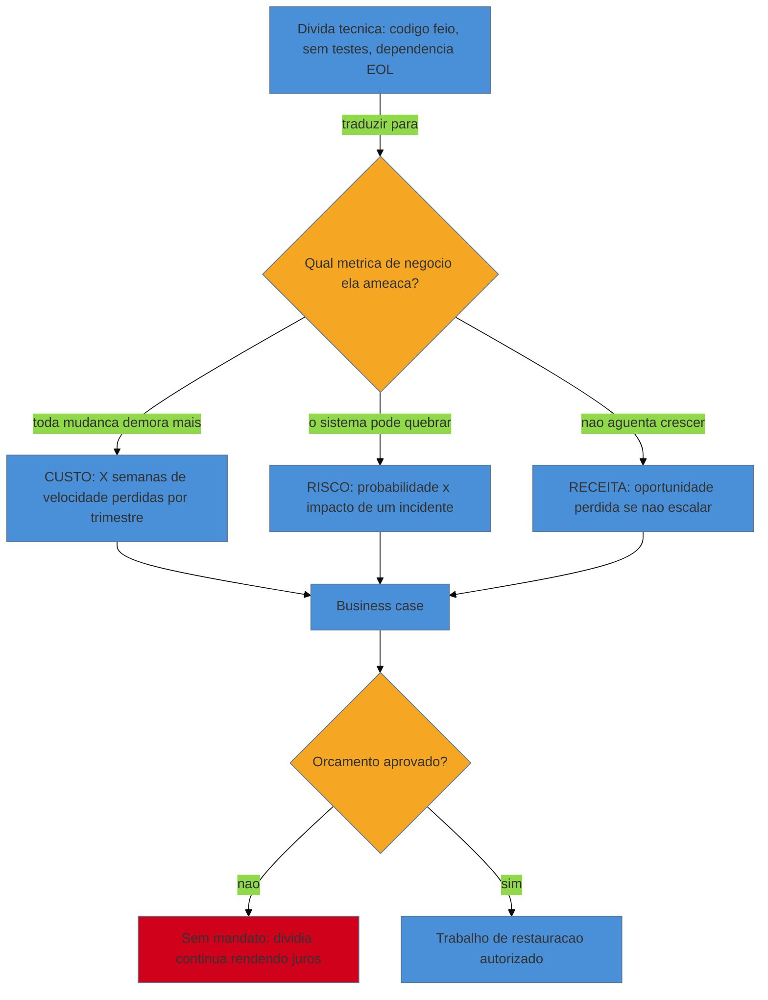

# A dimensão política

> [!abstract] TL;DR
> A [[17 - Frameworks de decisão|nota 17]] deu o vocabulário técnico para decidir o destino de um componente (TIME, os 7 R's); esta nota é sobre **vender essa decisão já tomada** para quem assina o orçamento — a etapa que a maioria dos consultores tecnicamente competentes ignora, e é por isso que tantas modernizações morrem sem nunca terem sido tecnicamente erradas. Marianne Bellotti chama a organização em volta do código de *"o sistema em volta do sistema"*: as pessoas, os incentivos e o jogo de poder que cercam um legado são tão legado quanto o código, e resistem à mudança pelas mesmas razões — ninguém entende mais por que estão do jeito que estão. Vender modernização exige traduzir dívida técnica para a língua que o executivo fala (risco, custo, receita), construir um **business case**, escolher batalhas e gerenciar stakeholders — e o **early win** que a [[04 - Os primeiros 30-60-90 dias|nota 04]] já apresentou como técnica de aterrissagem reaparece aqui em seu papel real: **capital político**, a moeda que compra o direito de propor a mudança grande.

Imagine o consultor da nota 17, TIME rodado, decisão tomada: o faturamento é Migrate, o verbo é Refactor, a técnica é Strangler Fig ([[18 - Strangler Fig|nota 18]]). Ele tem, no papel, um plano impecável — seams identificados, rede de caracterização desenhada, cronograma de seis meses fatiado em incrementos entregáveis. Ele leva isso para a reunião com o CFO esperando aprovação imediata. O CFO ouve, educado, e faz uma pergunta que o plano inteiro não responde: *"por que eu deveria gastar seiscentas horas de engenharia num sistema que, pelo que você mesmo diz, **já funciona**?"*

É o momento em que a competência técnica encontra seu limite. O framework da nota 17 provou, para um engenheiro, que o faturamento merece intervenção. Ele não prova nada, sozinho, para alguém cujo trabalho é decidir entre financiar essa refatoração ou financiar duas contratações de vendas. "Dívida técnica" não é uma linha no orçamento de ninguém — é uma abstração de engenharia que precisa ser traduzida antes de competir por dinheiro real. **A decisão certa, tecnicamente, morre na porta da sala se ninguém souber vendê-la.** É esse o trabalho desta nota: não decidir (isso a nota 17 já fez), mas converter a decisão em algo que se compra.

## O sistema em volta do sistema

Marianne Bellotti, em *Kill It with Fire*, faz uma observação que muda como o restaurador enxerga a organização: o código legado nunca existe sozinho — ele está encaixado numa estrutura de pessoas, processos de aprovação, orçamentos anuais, linhas de reporte e reputações construídas em torno dele. Essa estrutura é, segundo ela, tão "legada" quanto o código: ninguém mais lembra por que o processo de deploy exige três aprovações manuais, por que a equipe de faturamento reporta para finanças e não para engenharia, ou por que "mexer no faturamento" carrega um estigma desde um incidente de 2019 que ninguém do time atual viveu. É a mesma Cerca de Chesterton ([[02 - A mentalidade do restaurador|nota 02]]) — só que erguida em pessoas e processos, não em `if`s.

> [!question]- Por que isso importa pra decisão de modernizar código, especificamente?
> Porque um plano tecnicamente perfeito que ignora essa estrutura vai bater nela de qualquer jeito — só que tarde, e com o time já mobilizado. Se a decisão de "refatorar o faturamento" ameaça o time que mantém o faturamento há oito anos (medo de obsolescência, perda de status de "único que entende aquilo"), esse time vai resistir de formas que nenhum diagrama técnico prevê: reuniões que não terminam, prioridades que misteriosamente mudam, "achados" de risco inflados. Bellotti argumenta que **diagnosticar a organização é parte do trabalho de arqueologia**, não um extra — você já sabe fazer isso com código (a forense da [[09 - Forense de software|nota 09]]); aqui o objeto é o organograma, e o método é o mesmo: observar quem realmente decide, quem realmente resiste, e por quê.

O corolário prático: antes de escrever o business case, o restaurador faz um mapa curto — que Bellotti chama, informalmente, de mapear os "donos" e os "afetados". Quem perde controle, status ou trabalho familiar se essa mudança acontecer? Quem ganha? Quem só precisa ser informado? Esse mapa não aparece em nenhum diagrama de arquitetura, mas decide se o projeto sobrevive tanto quanto qualquer seam.

## Traduzir dívida técnica em risco, custo e receita

O erro mais comum na hora de pedir orçamento é falar a língua errada. "O código é feio", "não tem testes", "usa uma versão descontinuada" — tudo isso é verdadeiro e tudo isso é **irrelevante** para quem decide entre financiar isso ou financiar outra coisa. Executivos não compram qualidade de código; compram redução de risco, redução de custo ou aumento de receita. O trabalho do restaurador, nesta etapa, é de **tradução**, não de engenharia:

"O código do faturamento é frágil" vira "cada alíquota nova leva três semanas para entrar no ar, contra três dias no resto do sistema — e isso já causou dois atrasos regulatórios este ano" (custo, com número). "Não tem testes" vira "a última mudança nessa área gerou um incidente de faturamento indevido que consumiu 40 horas de suporte e um crédito ao cliente" (risco, com histórico real). "Usa uma biblioteca EOL" vira "essa dependência para de receber patch de segurança em março; se um CVE crítico aparecer depois disso, não há fornecedor a chamar" (risco, com prazo).

Martin Fowler oferece um vocabulário fino para essa tradução com o **Technical Debt Quadrant**: dívida pode ser *deliberada* (você sabia do atalho e o tomou conscientemente) ou *inadvertida* (só descobriu depois que era um atalho), e pode ser *prudente* (o atalho fez sentido no contexto) ou *imprudente* (não fazia sentido nem então). Isso importa politicamente porque muda o tom da conversa: dívida prudente e deliberada não é uma acusação a ninguém — foi uma escolha de negócio válida no seu tempo, que agora venceu o prazo, como um empréstimo. Isso é muito mais fácil de vender do que "o time anterior fez tudo errado", uma narrativa que cria inimigos desnecessários entre você e as pessoas cujo apoio você precisa.

> [!info] O business case não precisa de precisão, precisa de credibilidade
> A tentação do engenheiro é buscar o número exato — "vai custar 4.320 horas". Isso é falso conforto: nenhuma estimativa de projeto de meses é exata, e fingir precisão mina sua credibilidade quando o número real diverge. O que o executivo precisa é de **ordem de grandeza justificada** e de **comparação honesta**: "isso custa entre dois e quatro meses de um time de três pessoas; o custo de *não* fazer é um risco crescente de incidente que, historicamente, já custou X quando aconteceu". Ligado a um número real de incidente passado, o business case ganha peso que nenhuma planilha hipotética tem.

## Gerenciar stakeholders e escolher batalhas

Um business case bem traduzido convence a razão; ele raramente vence sozinho, porque decisões de orçamento são feitas por várias pessoas com interesses diferentes, nem todos alinhados ao que é tecnicamente certo. O restaurador precisa fazer, conscientemente, o que Kotter chama de **construir uma coalizão** — não pedir aprovação a uma única pessoa, mas mapear quem precisa estar do seu lado antes do pedido formal ser feito.

Isso significa distinguir três papéis, nem sempre óbvios num organograma:

- **Quem decide** (segura o orçamento) — geralmente precisa do business case traduzido em risco/custo/receita.
- **Quem influencia** (o tech lead respeitado, o gerente de produto cujo roadmap depende do sistema) — precisa ser conquistado *antes* da reunião de decisão, não durante ela. Se essas pessoas ouvem a proposta pela primeira vez na reunião, o instinto natural é questionar, não apoiar — ninguém quer parecer que só está concordando.
- **Quem é afetado** (o time que mantém o sistema hoje, cuja rotina muda) — precisa ser incluído, não informado depois do fato. É esse grupo, ignorado, que vira a resistência silenciosa que a seção anterior descreveu.

**Escolher batalhas** é o corolário disso: nem toda dívida técnica merece uma campanha política. Gastar capital numa briga que o negócio não vai priorizar este trimestre — por mais certo que você esteja tecnicamente — é queimar recurso escasso por pouco retorno. O restaurador maduro pergunta, antes de montar o business case: *"esta é a batalha certa para agora, ou existe uma prioridade concorrente que vai engolir a atenção do decisor de qualquer jeito?"* Levar a proposta certa no momento errado tem o mesmo resultado prático de não tê-la levado.

## O early win como capital político

A [[04 - Os primeiros 30-60-90 dias|nota 04]] já introduziu a mecânica: uma entrega pequena, segura e visível nos primeiros dias constrói **capital de confiança**. Esta nota fecha o laço explicando *por que* isso funciona como moeda política, não só como boa impressão.

Toda organização opera com um orçamento implícito de confiança em cada pessoa nova. Você chega com saldo zero: ninguém sabe se você vai entender o sistema, se vai quebrar algo, se as recomendações que vai trazer são competentes ou são teoria de quem "não conhece o negócio de verdade". O early win não é sobre o bug corrigido em si — é sobre **depositar prova** nesse saldo. Cada entrega pequena, segura e verificável é um depósito. O pedido estrutural maior — "precisamos de seis meses e três engenheiros para refatorar o faturamento" — é um **saque** contra esse saldo. Pedir o saque antes de ter feito nenhum depósito é pedir a alguém que confie num histórico que não existe.

Isso explica por que a ordem importa: o protocolo 30-60-90 não coloca o early win no dia 1 nem a proposta estrutural no dia 30 por acaso. É uma sequência de acúmulo deliberado de capital, gasto na hora certa — na reunião do CFO, o consultor da abertura desta nota não estava com as mãos vazias *apenas* de dados; ele já tinha, idealmente, dois ou três meses de entregas pequenas e seguras provando que a promessa de "seis meses sem quebrar nada" é crível vindo dele especificamente.

## Por que vender incremento é politicamente mais fácil que vender big-bang

A [[17 - Frameworks de decisão|nota 17]] já argumentou, do lado técnico, que o incremento (Refactor via Strangler) bate o rewrite big-bang porque preserva opcionalidade e reduz o raio de explosão de cada falha. Essa mesma propriedade técnica é, sem nenhuma tradução adicional, um **argumento político** mais forte — e é importante nomear isso separadamente, porque o restaurador que só pensa "isso é melhor engenharia" perde a chance de usar o argumento certo na sala certa.

Pedir aprovação para um projeto de doze meses, sem entrega intermediária, exige que o decisor confie **tudo de uma vez**, num resultado que só vai aparecer daqui a um ano — e que ele não tem como verificar até lá. Isso é, para quem segura orçamento, uma aposta de alto risco percebido, mesmo que o risco técnico real seja idêntico ao de uma abordagem incremental. Pedir aprovação para a primeira fatia de um Strangler Fig — "seis semanas, uma função só, reversível, com o velho no ar o tempo todo" — é uma aposta pequena, com um ponto de checagem visível no fim de cada fatia. O decisor não está comprando um resultado; está comprando o **direito de reavaliar** depois de cada entrega, com a opção de parar se o sinal não for bom. Isso é exatamente o argumento de opções reais que fundamenta o Strangler tecnicamente — só que dito na língua de quem assina o cheque, não na língua de engenharia.

## Fundamento teórico: por que a mudança organizacional é um processo, não um pitch

Vender uma decisão de modernização parece uma questão de apresentação — um bom slide, um bom número. Não é. Há um corpo formal de teoria sobre como mudanças sobrevivem ou morrem dentro de organizações, e conhecê-lo é o que distingue tentar "convencer" de fato conduzir o processo.

**1. O modelo de oito passos de Kotter.** John Kotter estudou dezenas de tentativas de mudança organizacional e identificou um padrão: as que falham pulam etapas, geralmente na pressa de "chegar logo à execução". O modelo tem oito passos, e três importam de forma direta para o restaurador. O primeiro é **criar um senso de urgência genuíno** — não pânico fabricado, mas evidência concreta de que o status quo é insustentável (o incidente de faturamento real, não um hipotético). O segundo é **construir uma coalizão orientadora** — exatamente o mapeamento de stakeholders da seção anterior; uma mudança estrutural não sobrevive com um único patrocinador, porque um único patrocinador pode sair da empresa, mudar de prioridade, ou simplesmente perder uma briga política sua. O sexto passo é **gerar vitórias de curto prazo** — o early win, nomeado formalmente: Kotter observa que projetos de mudança sem resultados visíveis dentro de meses perdem apoio antes de terminar, porque a paciência organizacional para pagar custo sem ver retorno é curta e finita.

**2. Capital político como recurso econômico escasso.** A metáfora "capital" não é decorativa — ela segue as mesmas regras de qualquer capital: acumula com depósitos (entregas verificáveis), se esgota com saques (pedidos grandes), e — crucialmente — **deprecia se não for reinvestido**. Um consultor que faz um early win e depois passa seis meses "trabalhando por baixo dos panos" sem nenhuma entrega visível está deixando o capital perder valor: a organização esquece a prova e volta a exigi-la. Isso é o argumento formal por trás de por que o Strangler Fig, com sua cadência de entregas frequentes, também funciona como um mecanismo de **reinvestimento contínuo** de capital político, e não só de redução de risco técnico.

**3. "O sistema em volta do sistema" como objeto de diagnóstico legítimo.** A contribuição de Bellotti é elevar a organização — normalmente tratada como "política", num tom pejorativo, algo a suportar — ao status de objeto de arqueologia com o mesmo rigor que o código. Um organograma tem hotspots, tem acoplamento temporal (decisões que sempre precisam passar pelas mesmas duas pessoas), tem bus factor (o único gerente que entende por que aquele processo de aprovação existe). Tratar isso como dado, não como ruído emocional, é o que torna a navegação política **sistemática** em vez de intuitiva — o mesmo salto que a forense da [[09 - Forense de software|nota 09]] deu para o código.

**A dimensão política em uma frase:** nenhuma decisão técnica sobrevive sem mandato, e mandato se constrói traduzindo dívida técnica em risco/custo/receita, mapeando quem ganha e quem perde com a mudança, e gastando capital político acumulado por entregas pequenas e verificáveis — nunca pedindo o saque grande antes de ter feito o depósito.

## Casos práticos

### Cenário 1: o business case do faturamento — traduzir e provar

Retomando o consultor da abertura: depois da pergunta do CFO ("por que gastar nisso?"), ele volta com uma segunda versão da proposta, desta vez traduzida. Ele não fala em "refatorar o motor de cálculo" — fala em três números concretos, extraídos da forense ([[09 - Forense de software|nota 09]]) e do histórico de incidentes: **custo** (cada alíquota nova leva três semanas a mais que o padrão do resto do sistema, atrasando duas mudanças regulatórias já este ano), **risco** (o último incidente de faturamento indevido custou 40 horas de suporte e um crédito relevante a um cliente grande), e **receita indireta** (dois clientes enterprise em negociação pediram, no processo de due diligence deles, evidência de que o sistema de faturamento tem testes automatizados — um requisito que hoje o time não consegue satisfazer). Nenhum desses três argumentos usa a palavra "dívida técnica". O pedido também mudou de forma: em vez de seis meses fechados, ele pede **seis semanas para a primeira fatia** do Strangler (um tipo de contrato), com um ponto de checagem explícito no fim — "se funcionar, seguimos para a próxima; se não, paramos aqui e reavaliamos". O CFO aprova a primeira fatia, não o projeto inteiro. O consultor conseguiu o saque exato do tamanho do capital que tinha.

### Cenário 2: o time que se sente ameaçado — a política interna

Outro cenário, diferente em natureza: o business case está aprovado, o orçamento existe, mas a execução trava. O time que mantém o módulo de tarifação há oito anos — o único grupo que realmente entende as regras de desconto — começa a atrasar sistematicamente as reuniões de levantamento de requisitos que o consultor precisa para caracterizar o comportamento atual ([[10 - A rede de segurança primeiro|nota 10]]). Não é sabotagem deliberada e falada em voz alta; é resistência difusa — prioridade que sempre muda, disponibilidade que nunca fecha. O consultor, aplicando o mapa de "donos e afetados" de Bellotti, percebe a causa raiz: para aquele time, ser "o único que entende a tarifação" é uma fonte real de segurança no emprego e de status técnico; a modernização, por bem-intencionada que seja, é lida como uma ameaça a isso. A resposta não é técnica — é política: o consultor propõe que o time de tarifação **co-autore** a nova versão, com crédito explícito, em vez de ser "substituído" por uma consultoria externa. A resistência cai quase imediatamente, porque a mudança deixou de ser uma perda de status e virou uma oportunidade de aparecer como autor do sistema novo, não só do velho.

## Armadilhas comuns

> [!warning] Vender dívida técnica em termos técnicos
> **O que acontece:** a proposta usa "código sujo", "sem testes", "arquitetura ruim" — e o decisor, sem uma métrica de negócio para ancorar a urgência, adia indefinidamente, porque nada nesses termos compete com uma feature nova que promete receita imediata. **Por quê:** risco, custo e receita são a linguagem em que orçamento é decidido; qualidade de código, por si só, não é. **Como evitar:** todo argumento técnico precisa de uma tradução explícita antes de chegar à mesa de decisão — a pergunta de teste é "que número de negócio essa frase sustenta?".

> [!warning] Pedir o saque estrutural antes de ter feito qualquer depósito
> **O que acontece:** um consultor recém-chegado, sem nenhuma entrega visível ainda, propõe direto um projeto de reescrita de seis meses — e a proposta é recebida com ceticismo, mesmo sendo tecnicamente correta, porque não há histórico que sustente a confiança que o pedido exige. **Por quê:** capital político não existe por padrão; ele se acumula com prova, e pedir antes de provar inverte a ordem que a [[04 - Os primeiros 30-60-90 dias|nota 04]] estabelece. **Como evitar:** sequencie: primeiro o early win seguro e visível, depois o pedido proporcional ao capital já acumulado — nunca o inverso.

> [!warning] Ignorar quem perde poder ou status com a mudança
> **O que acontece:** a proposta é aprovada no nível executivo, mas a execução trava em atrito difuso — reuniões que não terminam, prioridades que mudam — vindo do time que hoje é o guardião exclusivo do sistema legado. **Por quê:** modernização frequentemente remove a exclusividade de conhecimento que dá status a quem mantém o sistema antigo; ignorar isso trata um problema humano como se fosse logístico. **Como evitar:** mapeie quem ganha e quem perde antes de propor a mudança, e, onde possível, ofereça aos "donos" atuais um papel de protagonismo na versão nova — coautoria, não substituição.

> [!warning] Fabricar urgência artificial
> **O que acontece:** para acelerar a aprovação, o consultor exagera o risco ("o sistema pode cair a qualquer momento") sem evidência real por trás — e quando a previsão não se confirma, a credibilidade de todo o business case futuro desmorona. **Por quê:** Kotter distingue urgência genuína (baseada em evidência) de pânico fabricado; o segundo funciona uma vez e queima a confiança permanentemente quando é descoberto como exagero. **Como evitar:** ancore toda alegação de risco num incidente real, numa data real de EOL, ou numa métrica real — nunca num cenário hipotético inflado para parecer mais urgente do que é.

## Como explicar em inglês

> Technical merit alone doesn't get budget approved — you need a business case that speaks risk, cost, and revenue, not "the code is ugly." I map stakeholders before I pitch: who decides, who influences, who's affected — and I never skip the people who might feel threatened by the change, because unaddressed political resistance kills more modernization projects than bad architecture does. Early wins aren't just good PR, they're political capital: you earn the right to ask for the big structural change by first proving, in something small and safe, that you can deliver without breaking anything. That's also why incremental migration sells easier than a big-bang rewrite — you're asking for a small, reversible bet with a checkpoint, not blind trust in a twelve-month black box.

| PT | EN |
|----|----|
| o sistema em volta do sistema | the system around the system |
| business case | business case |
| capital político / capital de confiança | political capital / trust capital |
| stakeholder / partes interessadas | stakeholder |
| coalizão orientadora | guiding coalition |
| vitória de curto prazo | short-term win |
| dívida técnica deliberada/inadvertida | deliberate / inadvertent technical debt |
| urgência genuína vs. pânico fabricado | genuine urgency vs. manufactured panic |

## O que vem a seguir

O orçamento foi aprovado, o time embarcou, a resistência política foi endereçada — mas o mandato que você conquistou tem prazo de validade se o conhecimento que sustenta essa restauração ficar só na sua cabeça. As próximas duas notas cuidam do que sustenta o trabalho depois que a venda foi feita: primeiro o conhecimento em si, depois quem o carrega.

- [[24 - Conhecimento e documentação|nota 24]] — como registrar o *porquê* das decisões (ADRs, living docs) para que a próxima pessoa não precise repetir todo este trabalho político do zero, e para que o bus factor não volte a ser um.
- [[25 - Sustentabilidade humana|nota 25]] — gerenciar stakeholders, escrever business cases e escolher batalhas é trabalho emocionalmente caro; a próxima nota cobre o custo humano de sustentar essa maratona sem esgotar o time que você acabou de conquistar.

## Fontes

- **Marianne Bellotti** — [*Kill It with Fire: Manage Aging Computer Systems*](https://www.oreilly.com/library/view/kill-it-with/9781492099340/) (O'Reilly, 2021) — a fonte do conceito de "o sistema em volta do sistema" e da leitura da organização como objeto de arqueologia.
- **John P. Kotter** — [*Leading Change: Why Transformation Efforts Fail*](https://hbr.org/1995/05/leading-change-why-transformation-efforts-fail-2) (Harvard Business Review, 1995) — o artigo original que funda o modelo dos oito passos, incluindo urgência, coalizão e vitórias de curto prazo.
- **Kotter Inc.** — [*The 8-Step Process for Leading Change*](https://www.kotterinc.com/methodology/8-steps/) — a formulação de referência, atualizada, do modelo completo.
- **Martin Fowler** — [*TechnicalDebtQuadrant*](https://martinfowler.com/bliki/TechnicalDebtQuadrant.html) — o vocabulário de dívida deliberada/inadvertida, prudente/imprudente, usado para traduzir dívida técnica sem criar inimigos desnecessários.
- Ver também [[04 - Os primeiros 30-60-90 dias|nota 04]] (onde o early win é introduzido como técnica de aterrissagem) e [[17 - Frameworks de decisão|nota 17]] (a decisão técnica que esta nota ensina a vender).
