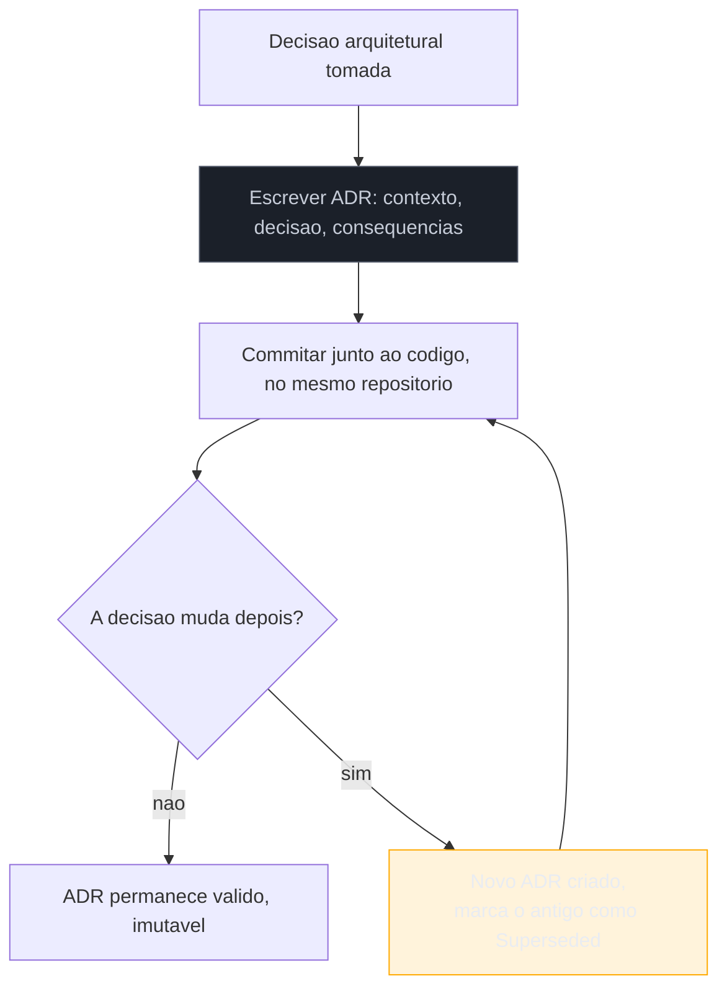
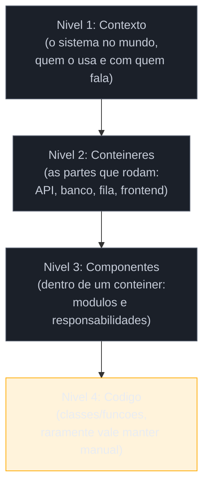

# Conhecimento e documentação

> [!abstract] TL;DR
> Você fechou o quadrante Migrate ([[17 - Frameworks de decisão|nota 17]]), restaurou o faturamento com Strangler Fig ([[18 - Strangler Fig|nota 18]]) e sobreviveu à dimensão política ([[23 - A dimensão política|nota 23]]). O sistema agora tem uma teoria viva de novo — na **sua** cabeça. Esta nota é sobre o que acontece no dia em que você sai da sala: como você impede que a mesma perda de teoria que trouxe você até aqui aconteça de novo com quem vier depois. Três ferramentas fecham esse ciclo: **ADRs** (Michael Nygard) capturam o *porquê* de cada decisão, não o *o quê* — leves, versionados junto ao código, imutáveis; **living documentation** e o **C4 model** (Simon Brown) descrevem a arquitetura em camadas que não apodrecem porque vivem perto do código; e o combate deliberado ao **bus factor** ([[09 - Forense de software|nota 09]] mediu o risco — aqui você **age** sobre ele) espalha o conhecimento tribal por mais de uma cabeça. A tese se fecha: você restaura a [[03-Dominios/Engenharia/Complexidade de Software/04 - O programa como teoria|teoria de Naur]] durante toda a jornada; agora você a **externaliza de propósito**, porque offboarding bem-feito é o onboarding de outra pessoa.

Seis meses depois daquela reunião sobre reescrever ou remendar, o consultor está prestes a fechar o contrato. O sistema de faturamento foi restaurado, os testes de caracterização travam o comportamento, a facade do Strangler Fig está quase vazia. O diretor de tecnologia pede, meio de passagem, quase como formalidade: *"antes de você ir, escreve uma documentação pra gente, né?"* É o tipo de pedido que soa simples e é, na prática, a última chance de fazer a única coisa que realmente importa nesse projeto inteiro — e a mais fácil de fazer errado.

O erro óbvio é escrever um manual do usuário: telas, campos, botões. Isso já existe, ou é fácil de gerar. O erro mais sutil, e mais caro, é escrever um documento técnico que descreve **o que** o sistema faz — os endpoints, as tabelas, o fluxo de dados — porque isso é o que qualquer engenheiro competente consegue extrair lendo o código em uma tarde. O que ninguém consegue extrair lendo o código, e o que vai custar ao próximo consultor os mesmos seis meses que custou a você, é o **porquê**: por que o cálculo de imposto tem aquele `if` estranho, por que a equipe escolheu Refactor em vez de Repurchase, por que aquela tabela tem uma coluna que parece redundante mas na verdade guarda uma exceção regulatória descoberta na marra. Essa é exatamente a teoria que Naur descreve — e é ela que apodrece primeiro, porque vive só na sua cabeça, e a sua cabeça está prestes a sair pela porta.

## Fundamento teórico: documentação é conversão de conhecimento tácito em explícito

Antes das ferramentas, vale nomear por que esse problema é genuinamente difícil — não é preguiça de escrever, é um limite epistemológico real.

**1. O conhecimento tácito não se transfere por escrita direta.** O filósofo Michael Polanyi cunhou a frase que resume o obstáculo: *"sabemos mais do que conseguimos dizer"* (*we can know more than we can tell*). Grande parte do que um engenheiro sabe sobre um sistema — a intuição de que "esse módulo é perigoso", o padrão que ele reconhece num stack trace antes de ler a mensagem de erro, o motivo real (não o documentado) por trás de uma decisão de três anos atrás — é conhecimento **tácito**: ele opera, mas resiste à verbalização completa. É exatamente essa a natureza da teoria de Naur: ela não é um artefato que existe fora da cabeça de quem a construiu, é um estado mental. Documentar não é copiar essa teoria para o papel — é **traduzir uma fração dela** para uma forma que outra cabeça consegue absorver. Sempre com perda.

**2. O modelo SECI descreve como essa conversão acontece — e por que precisa de mais de um canal.** Ikujiro Nonaka e Hirotaka Takeuchi, estudando como empresas japonesas criavam conhecimento organizacional, propuseram que o conhecimento tácito só vira valor coletivo através de um ciclo de quatro modos de conversão: **socialização** (tácito→tácito, por convivência — pair programming, mob programming, sentar do lado de quem sabe), **externalização** (tácito→explícito, o momento difícil de verbalizar o que só existia na cabeça — é aqui que mora o ADR), **combinação** (explícito→explícito, organizar documentos dispersos em um corpo coerente e navegável — é aqui que mora a living documentation e o C4) e **internalização** (explícito→tácito, quando o próximo engenheiro lê o explícito e o reconstrói como intuição própria, fechando o ciclo). O erro do "escreve uma documentação" do diretor é tratar isso como se um único documento bastasse para os quatro modos. Não basta: **socialização não se substitui por texto**, e é por isso que pairing continua necessário mesmo com ADRs impecáveis.

**3. Naur já havia avisado: documentação apoia a reconstrução, não a substitui.** No próprio ensaio de 1985, Naur descreve um experimento revelador: pediu a programadores que nunca tinham visto um certo sistema para modificá-lo, dando a um grupo apenas o código e a especificação, e a outro grupo o mesmo material *mais* acesso a alguém que tinha construído o sistema original. O segundo grupo produziu mudanças muito mais alinhadas com o design original. A conclusão de Naur não é "documentação não serve" — é que documentação escrita, por si só, **nunca reconstitui a teoria por completo**; ela acelera a reconstrução, ancorando o processo de internalização, mas o processo continua exigindo trabalho ativo de quem chega depois. Isso já é a tese central deste galho aplicada ao seu próprio ofício: você, o consultor, faz esse trabalho de reconstrução toda vez que assume um sistema; documentar bem é reduzir o custo desse trabalho para o próximo, nunca eliminá-lo.

> [!question]- Se a teoria nunca se transfere por completo, por que documentar vale o esforço?
> Porque a alternativa não é "teoria perfeita vs. documentação imperfeita" — é "documentação imperfeita vs. nada". Sem nada, o próximo consultor reconstrói a teoria do zero, por arqueologia pura, do jeito que você fez nas notas 05 a 09 deste galho. Com ADRs e living docs, ele reconstrói a mesma teoria em uma fração do tempo, porque você deixou marcos: aqui está o *porquê*, aqui está a arquitetura em camadas, aqui está quem sabe o quê. Documentação não é a teoria — é o **mapa arqueológico** que você deixa para a próxima escavação, feito por quem já cavou o sítio inteiro.

```mermaid
graph LR
    classDef falha fill:#FF6B6B24,stroke:#FF6B6B,color:#E9ECF2
    classDef neutro fill:#1B2029,stroke:#4E5666,color:#C6CCD8
    T1[Teoria viva na cabeca<br/>do time original] -->|equipe sai, teoria some| L[LEGADO: so sobra codigo]
    L -->|voce reconstroi por arqueologia| T2[Teoria reconstruida<br/>na sua cabeca]
    T2 -->|voce sai sem documentar| L
    T2 -->|voce externaliza de proposito| E[ADR + Living Docs + C4<br/>+ pairing]
    E --> T3[Proximo consultor<br/>reconstroi mais rapido]
    class L falha
    class T2 neutro
    class E neutro
    class T3 neutro
```

O ciclo vermelho do diagrama é o que trouxe você até este galho na nota 01. O ciclo azul é o que você escolhe deliberadamente ativar antes de sair — e é o único jeito de garantir que o próximo consultor não comece do zero absoluto, como você começou.

**Documentação em uma frase:** documentar é converter, com perda inevitável mas redutível, a teoria tácita que só existe na sua cabeça em artefatos explícitos que aceleram a reconstrução dessa teoria na cabeça de quem vier depois de você.

## As três ferramentas de externalização

### ADRs: capturar o porquê, não o quê

Em 2011, Michael Nygard publicou um post curto que se tornou o padrão de fato da indústria para registrar decisões arquiteturais: o **Architecture Decision Record**. A ideia central é quase teimosa em sua simplicidade: um ADR é um arquivo de texto curto, numerado, imutável depois de aceito, guardado **junto com o código** (no mesmo repositório, versionado no mesmo `git log`), com quatro seções fixas — **Título**, **Contexto** (a situação e as forças em jogo, sem julgamento), **Decisão** (o que foi decidido, em voz ativa: "vamos fazer X"), e **Consequências** (o que fica mais fácil, o que fica mais difícil, o débito que essa escolha assume conscientemente).

O detalhe que faz o ADR funcionar, e que a maioria das tentativas de documentação erra, é a **imutabilidade**. Um ADR nunca é editado depois de aceito — se a decisão muda, você escreve um **ADR novo** que marca o antigo como *superseded* e explica por que a circunstância mudou. Isso preserva algo que nenhuma wiki editável preserva: o **histórico do raciocínio ao longo do tempo**. Seis meses depois, quando alguém perguntar "por que a gente não usou o SaaS de faturamento fiscal?", a resposta não está perdida numa mensagem de Slack de 2019 — está no ADR-014, junto do commit que a implementou, legível para sempre.

> [!info] Por que "leve" é a característica que faz o ADR sobreviver
> Nygard escreveu o post original justamente reagindo à documentação arquitetural tradicional: pesada, num formato Word gigante, mantida por um "arquiteto" separado do time, sempre desatualizada meses depois de escrita. Um ADR é o oposto em cada eixo: escrito pela pessoa que decidiu, no momento da decisão, em texto puro, versionado como código. Não é ninguém "responsável por manter a documentação atualizada" — o ADR nunca precisa ser atualizado, porque é imutável; a atualização vira um ADR novo. A leveza não é um compromisso de qualidade, é o que torna realista que alguém *de fato* escreva o documento no calor da decisão, em vez de adiar para "depois", que nunca chega.

### Living documentation e o C4 model: descrever a arquitetura sem apodrecer

ADRs capturam decisões pontuais — eventos no tempo. Mas existe outra pergunta que um ADR isolado não responde: *"como o sistema inteiro se encaixa, hoje?"* É aqui que entra a **living documentation**, termo de Cyrille Martraire para uma família de práticas com um princípio comum: documentação que **vive perto o suficiente do código para não poder mentir por muito tempo** — seja porque é extraída automaticamente do código (diagramas gerados de anotações, contratos de API extraídos do próprio schema), seja porque é mantida no mesmo pull request que a mudança que descreve, seja porque é curta o bastante para custar pouco manter.

O **C4 model** de Simon Brown é o formato mais adotado dessa família para descrever arquitetura. A ideia é resolver um problema real: diagramas de arquitetura tendem a ser ou vagos demais (uma caixa "Sistema" e pronto) ou detalhados demais (um diagrama UML de classes que ninguém lê). C4 resolve isso com **quatro níveis de zoom**, cada um respondendo a uma pergunta diferente e para uma audiência diferente:

Repare que Brown recomenda **não** manter o nível 4 manualmente — o próprio código já é essa documentação, e um diagrama de classes desatualizado é pior do que nenhum diagrama. Os níveis que valem o investimento são 1 a 3: um diretor entende o Contexto em trinta segundos; um novo engenheiro entende os Contêineres no primeiro dia; quem vai mexer num módulo específico lê os Componentes daquele módulo antes de tocar nele. Para o consultor, o C4 é o antídoto direto contra o "primeiro contato" caótico da [[05 - First Contact|nota 05]] — é o mapa que você deixa para que o *próximo* primeiro contato seja mais curto que o seu.

> [!tip] O teste de "documentação viva de verdade"
> Pergunte: se essa documentação estiver errada, alguém vai perceber **rápido**? Um ADR versionado junto ao código passa no teste (está no mesmo PR review). Um diagrama C4 de Contexto/Contêineres, revisado a cada mudança arquitetural relevante, passa. Uma wiki externa, editada por "quem tiver tempo", raramente passa — ninguém percebe que está errada até alguém confiar nela e se machucar.

### Matar o bus factor: espalhar o que só uma cabeça sabe

A [[09 - Forense de software|nota 09]] lhe deu o instrumento para **medir** o bus factor: cruzar hotspots com autoria concentrada no `git blame` e descobrir que um módulo crítico só tem um dono real. O que fazer com essa medição é o assunto de agora — e a resposta não é só "documentar". Pelo modelo SECI da seção anterior, você já sabe por quê: ADR e living docs são **externalização**, mas o conhecimento tácito mais denso de um sistema — a intuição, os padrões de falha, os atalhos mentais — só se transfere por **socialização**.

Três práticas concretas fecham essa lacuna. **Pair e mob programming** deliberado nos módulos de bus factor 1: não como política genérica de qualidade, mas como intervenção cirúrgica, focada exatamente onde a forense apontou risco. **README executável**: em vez de um `README.md` que descreve em prosa como rodar o sistema (e que apodrece), um script ou `Makefile` que *é* a documentação de setup — rodar `make dev` é, ao mesmo tempo, a instrução e a prova de que a instrução ainda funciona. E **rotação deliberada de responsabilidade**: fazer com que mais de uma pessoa seja *on-call* real para o módulo crítico, mesmo que isso pareça, no curto prazo, mais lento do que deixar o especialista resolver sozinho.

> [!warning] O bus factor não se resolve escrevendo mais
> **O que acontece:** o time mede bus factor 1 num módulo crítico e reage escrevendo uma documentação extensa sobre ele — e o risco continua exatamente igual. **Por quê:** o que torna aquela pessoa insubstituível não é informação que falta no papel, é o reconhecimento de padrão construído por anos de contato direto — conhecimento tácito, no vocabulário de Polanyi. Documentação escrita converte parte disso, nunca tudo. **Como evitar:** trate bus factor como um problema de **socialização**, não só de externalização. Documentação reduz o tempo de reconstrução; pairing reduz a dependência em primeiro lugar. Use os dois.

## Casos práticos

### Cenário 1: o ADR retroativo do faturamento

Voltando à plataforma de logística: a decisão de Refactor (e não Repurchase) para o faturamento, tomada na [[17 - Frameworks de decisão|nota 17]], nunca foi escrita — foi discutida numa reunião e virou código diretamente. Antes de fechar o contrato, o consultor escreve o ADR retroativamente, porque tarde ainda é melhor do que nunca:

> [!example] ADR-014 — Refactor do motor de calculo de faturamento (nao Repurchase)
> **Contexto:** o motor de calculo de imposto (`calcularTotal()`) e critico — processa 100% da receita — mas tecnicamente podre: 200 linhas, sem testes, regras fiscais em `if`s aninhados. Avaliamos adotar um SaaS de faturamento fiscal para substitui-lo. **Decisao:** vamos restaurar o motor internamente, por incrementos (Strangler Fig, um tipo de contrato por vez), em vez de adotar o SaaS. **Consequencias:** mantemos controle total sobre regras de contrato especificas do negocio, que o SaaS nao cobria sem customizacao cara. Em troca, assumimos o custo continuo de manter a logica fiscal internamente — decisao a revisitar se a complexidade regulatoria crescer muito (ver [[22 - Dependências, upgrades e segurança|nota 22]]).

Esse único documento, de dez linhas, economiza ao próximo consultor a reunião inteira que gerou a decisão original — e principalmente evita que ele reabra o debate "por que não compramos um SaaS?" do zero, sem saber que a pergunta já foi respondida com evidência.

### Cenário 2: o bus factor do módulo de tarifação de fretes

A forense da nota 09 identificou que o cálculo de tarifação de fretes internacionais — um módulo à parte do faturamento, com regras de câmbio e taxas alfandegárias — tem bus factor 1: só uma desenvolvedora sênior entende as exceções de cada rota. Ela não vai sair da empresa amanhã, mas o risco já está medido e ignorá-lo é decidir, por omissão, torcer para que nada aconteça.

A ação combina as três ferramentas: um C4 de Componentes documenta, pela primeira vez, os módulos internos da tarifação e como eles se relacionam (living doc, revisada a cada PR que toca o módulo); um ADR registra o *porquê* de duas das regras mais estranhas, que a desenvolvedora explica numa sessão de pairing gravada; e duas sprints de mob programming, com o resto do time revezando ao lado dela, elevam o bus factor de 1 para 3. O custo de curto prazo é real — o time entrega menos features naquelas duas sprints. O retorno é que a empresa deixa de depender de uma única pessoa não sair de férias, adoecer ou pedir demissão numa semana ruim.

## Armadilhas comuns

> [!warning] Documentar o "o quê" em vez do "porquê"
> **O que acontece:** o documento final descreve endpoints, tabelas e telas — tudo o que já está no código e é redundante escrever de novo — e não diz uma palavra sobre por que as decisões foram tomadas. **Por quê:** é mais fácil descrever o que existe (visível, mecânico) do que reconstruir o raciocínio por trás (exige lembrar contexto, admitir trade-offs, às vezes admitir erros). **Como evitar:** todo documento de arquitetura deve responder "por que não a alternativa óbvia?" para cada decisão relevante. Se a resposta não estiver lá, o documento é um resumo do código, não um ADR.

> [!warning] A documentação que vira teatro burocrático
> **O que acontece:** a organização exige um ADR para toda mudança, por menor que seja; ninguém lê os ADRs acumulados, e escrevê-los vira uma etapa de compliance interno, não uma ferramenta de pensamento. **Por quê:** o valor do ADR está na disciplina de *pensar* contexto/decisão/consequências antes de agir — quando isso vira checkbox obrigatório para tudo, o pensamento sai e só a burocracia fica. **Como evitar:** reserve ADRs para decisões que alguém, no futuro, provavelmente vai perguntar "por que fizemos assim?" — mudanças arquiteturais, escolhas de dependência estrutural, trade-offs de portfólio (nota 17). Uma mudança de nome de variável não precisa de ADR.

> [!warning] Documentação divorciada do código
> **O que acontece:** a "documentação oficial" mora numa wiki externa, num Confluence, num Google Doc — longe do repositório — e diverge do sistema real em semanas, sem que ninguém perceba até confiar nela às cegas e se ferrar. **Por quê:** nada força a atualização; editar a wiki não faz parte do fluxo de revisão de código, então é sempre a primeira coisa esquecida sob pressão de prazo. **Como evitar:** aplique o teste de living documentation — o documento deve estar perto o bastante do código para ser revisado no mesmo pull request que a mudança que ele descreve. Se não está no repositório, considere-o desatualizado por padrão.

> [!warning] Confiar só em documentação para resolver bus factor
> **O que acontece:** escreve-se uma documentação extensa sobre um módulo crítico e a organização se sente segura — até a pessoa que o mantinha sair, e o time descobrir que ler o documento não é o mesmo que ter reconstruído a intuição. **Por quê:** conhecimento tácito (Polanyi) não converte inteiramente em texto; documentação acelera a internalização, não a substitui. **Como evitar:** trate a medição de bus factor da nota 09 como gatilho para socialização ativa (pairing, mob, rotação de on-call), não só para um ticket de "escrever documentação".

## Como explicar em inglês

> The code tells you what the system does; only deliberate documentation tells you why. I use ADRs — lightweight, immutable records of context, decision, and consequences, versioned right next to the code — to capture the reasoning behind architectural choices at the moment they're made. For the overall shape of a system, I keep living documentation close enough to the code that it can't drift for long, using the C4 model's four zoom levels — context, containers, components, code — so different audiences get the right altitude. And I treat bus factor as a socialization problem, not just a writing problem: pairing and mob sessions transfer the tacit knowledge that no document fully captures.

| PT | EN |
|----|----|
| registro de decisão arquitetural | architecture decision record (ADR) |
| documentação viva | living documentation |
| conhecimento tácito | tacit knowledge |
| externalizar o conhecimento | externalize knowledge |
| fator de ônibus | bus factor |
| imutável, versionado junto ao código | immutable, versioned alongside the code |
| níveis de zoom da arquitetura | architecture zoom levels |

## O que vem a seguir

Você fechou o ciclo central deste galho: chegou como um estranho diante de uma teoria perdida, reconstruiu essa teoria por arqueologia, restaurou o sistema com segurança e agora a deixa registrada de propósito para quem vier depois. O que falta na fase Magus são as camadas que cercam esse trabalho — o custo humano de fazê-lo, o dia em que algo pega fogo apesar de tudo, e as amarras legais que nem toda decisão técnica pode ignorar.

- [[25 - Sustentabilidade humana|nota 25]] — o custo humano de meses de arqueologia sob incerteza: burnout, estimativa honesta, o valor de um *spike* time-boxed antes de prometer prazo.
- [[26 - Firefighting em produção|nota 26]] — o cenário em que, apesar de toda a documentação, algo quebra em produção num sistema que você ainda não domina por completo — e como investigar sem pânico.
- [[27 - Compliance e arqueologia legal|nota 27]] — por que algumas decisões de Retire ou Retain não são técnicas, são legais; a documentação certa aqui pode ser a diferença entre uma auditoria tranquila e uma multa.
- [[28 - Capstone - Assumindo um sistema legado do zero|nota 28]] — o playbook inteiro, do primeiro contato ao offboarding documentado, costurado num único estudo de caso.

## Fontes

- **Michael Nygard** — [*Documenting Architecture Decisions*](https://cognitect.com/blog/2011/11/15/documenting-architecture-decisions) (2011) — o post seminal que define o formato ADR (contexto, decisão, consequências) e por que ele deve ser leve, imutável e versionado com o código.
- **Simon Brown** — [*The C4 model for visualising software architecture*](https://c4model.com/) — os quatro níveis de zoom (contexto, contêineres, componentes, código) e o argumento de por que o nível de código raramente vale manter manualmente.
- **Cyrille Martraire** — [*Living Documentation*](https://leanpub.com/livingdocumentation) (Addison-Wesley, 2019) — o princípio geral de documentação que não apodrece porque vive perto do código ou é derivada dele.
- **Peter Naur** — [*Programming as Theory Building*](https://pages.cs.wisc.edu/~remzi/Naur.pdf) (1985) — a fonte da tese do galho, incluindo o experimento sobre por que documentação escrita acelera, mas não substitui, a reconstrução da teoria por um sucessor.
- **Michael Polanyi** — [*Michael Polanyi* (Stanford Encyclopedia of Philosophy)](https://plato.stanford.edu/entries/polanyi/) — a base filosófica do conhecimento tácito ("sabemos mais do que conseguimos dizer") que explica o limite de qualquer documentação escrita.
- **Ikujiro Nonaka** — [*The Knowledge-Creating Company*](https://hbr.org/1991/11/the-knowledge-creating-company) (Harvard Business Review, 1991) — o modelo SECI de conversão entre conhecimento tácito e explícito, base para entender por que socialização e externalização são complementares, não substitutas.
