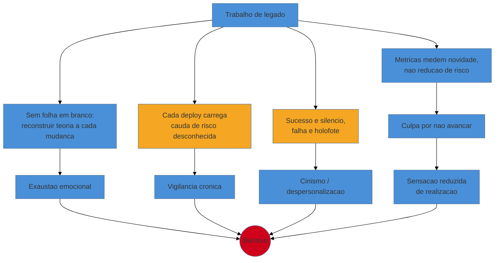
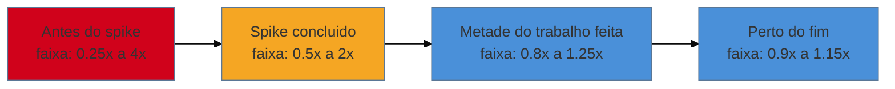

# Sustentabilidade humana

> [!abstract] TL;DR
> Todas as técnicas deste galho — a rede de segurança, os seams, o Mikado, o Strangler Fig, os frameworks de decisão — resolvem o problema *técnico* de mudar legado sem quebrá-lo. Nenhuma delas resolve o problema *humano* de ser a pessoa que faz esse trabalho, semana após semana, sem fim à vista e sem ninguém aplaudindo. Esta nota é a camada pessoal: o burnout específico de trabalhar com sistemas que você não escreveu (frustração crônica, culpa por "não avançar", medo permanente de quebrar produção, trabalho invisível e ingrato), as ferramentas honestas para estimar sob incerteza real — fechando o laço do **spike time-boxed** que a [[17 - Frameworks de decisão|nota 17]] só citou — ancoradas no **cone da incerteza** de McConnell, e o **ritmo sustentável** de Kent Beck como antídoto estrutural, não só motivacional. O sempre-entregável do [[15 - O Método Mikado|Mikado]] e do [[18 - Strangler Fig|Strangler Fig]] não é só uma tática de risco técnico — é também, e talvez sobretudo, uma tecnologia de saúde mental: progresso visível é o que mantém você e o time no jogo até o fim da maratona.

## O consultor que não consegue explicar por que está exausto

Três meses depois de assumir a manutenção da plataforma de logística, o consultor sênior está no seu melhor momento técnico e no pior momento pessoal do engajamento. Ele já mapeou o sistema, montou a rede de caracterização do módulo de faturamento, isolou dois seams e estrangulou a primeira fatia sem incidente. Pelos números, o trabalho está indo bem. E ainda assim ele chega em casa todo dia exausto de um jeito que o código em si não explica — não escreveu mais linhas do que num projeto greenfield, não trabalhou mais horas do que o normal. Alguma coisa além da carga de trabalho está drenando.

Ele tenta nomear o que sente numa conversa com o gerente e não encontra as palavras certas: não é cansaço de esforço, é cansaço de **vigilância**. Cada deploy carrega um peso desproporcional ao tamanho da mudança, porque ele nunca tem certeza total do que vai quebrar num sistema cuja teoria ele está reconstruindo aos poucos. Ele também percebe que ninguém, em nenhuma reunião, comemorou o fato de que o faturamento não caiu nas últimas doze semanas — mas na única semana em que um relatório saiu com o totalizador errado por seis horas, três pessoas diferentes perguntaram o que tinha acontecido. O trabalho que ele faz bem é invisível; o trabalho que falha, mesmo uma vez, é visto por todos. E pior: ele não sabe dizer quando vai terminar. Não há um marco de "pronto" — só mais um módulo, mais uma função, mais um seam, indefinidamente.

Esse desconforto não tem nome oficial em nenhum dos frameworks técnicos das notas anteriores, mas tem um padrão bem documentado — e reconhecê-lo é o primeiro passo para não ser consumido por ele.

## Por que o burnout de legado é um burnout específico

O erro é tratar isso como o burnout genérico de "trabalhar demais". A carga de trabalho até pode ser razoável; o que corrói é a **estrutura** particular do trabalho com legado, que ataca simultaneamente quatro pontos que o trabalho greenfield raramente toca.

O primeiro é a **frustração crônica de nunca partir de uma folha em branco**. Em código novo, cada função que você escreve é sua, legível, previsível. Em legado, cada mudança exige primeiro reconstruir mentalmente uma teoria que você não tem ([[03-Dominios/Engenharia/Complexidade de Software/04 - O programa como teoria|a teoria de Naur]]) — e esse esforço de reconstrução não aparece em nenhum commit, não é *trabalho visível*, mas consome a mesma energia cognitiva que escrever código novo. Você termina o dia exausto tendo, aos olhos de fora, "só arrumado três bugs".

O segundo é a **culpa por "não avançar"**. As métricas que o negócio entende — velocity, features entregues, pontos de história — medem produção de novidade, não redução de risco. Um mês inteiro investido em pôr uma rede de caracterização sob um módulo sem testes produz *zero* funcionalidade nova e todo o valor futuro do trabalho de restauração. Sem uma linguagem para narrar esse valor, o consultor internaliza a métrica errada e se sente improdutivo mesmo fazendo exatamente o trabalho certo.

O terceiro é o **medo permanente de quebrar produção**. Toda mudança em sistema legado crítico carrega uma cauda de risco que você não consegue eliminar — só reduzir. Isso instala um estado de vigilância crônica, o oposto do "flow" saudável: cada deploy é precedido por uma checagem mental de "o que eu não sei que não sei", porque a rede de segurança, por melhor que seja, nunca é prova de que você entendeu o sistema por inteiro. Esse tipo de ansiedade de baixo grau e permanente é fisiologicamente mais desgastante do que picos de estresse pontuais e resolvidos.

O quarto é o **trabalho invisível e ingrato**. Marianne Bellotti nomeia isso com precisão em *Kill It with Fire*: o trabalho de manutenção só é notado quando falha. Ninguém aplaude o incidente que não aconteceu. A assimetria é brutal — o sucesso é silêncio, o fracasso é holofote — e ao longo de meses ela ensina o cérebro a associar o trabalho a punição potencial, nunca a recompensa.

> [!question]- Isso não é só "a vida é dura, se acostuma"? Todo trabalho técnico tem partes chatas.
> A diferença não é a existência do desconforto, é a **falta de válvula de escape estrutural**. No trabalho greenfield, a válvula existe: você entrega uma feature, ela é demonstrada, aplaudida, encerrada — um ciclo completo de esforço-reconhecimento-fechamento que recarrega a motivação. No trabalho de legado, os quatro fatores acima removem, um a um, os pontos dessa válvula: não há folha em branco (frustração), o esforço não conta como produção (culpa), o resultado bom é silêncio e o resultado ruim é holofote (medo e ingratidão), e não há fim visível (exaustão sem recarga). Não é que o trabalho seja mais difícil tecnicamente — é que ele é estruturado de um jeito que drena sem devolver. Reconhecer esse mecanismo é o que separa "estou fraco" de "este trabalho tem uma física específica, e existem contramedidas para ela".

## Fechando o laço: o spike como ferramenta de estimativa honesta

A [[17 - Frameworks de decisão|nota 17]] mencionou, de passagem, que a decisão de reescrever versus restaurar deveria ser testada com "um *spike* time-boxed" antes de virar aposta — e prometeu que esta nota explicaria o mecanismo. Aqui está: um **spike** é uma investigação com prazo fixo e uma única pergunta a responder, não uma entrega de produto. Você não sai de um spike com código pronto para produção; sai com uma resposta — *"dá para estabelecer um seam aqui em menos de dois dias, sim ou não?"* — e o prazo é irrevogável: quando o tempo acaba, o spike acaba, resposta que você tiver.

O motivo de o spike existir é a raiz de todo o problema de estimar em legado: **você não pode estimar com precisão um território que ainda não mapeou**, e mapear o território é, ele mesmo, trabalho de duração incerta. Pedir "quantos dias vai levar para refatorar o faturamento?" no primeiro dia de engajamento é pedir uma resposta que ninguém, honestamente, tem — nem o consultor mais experiente do mundo, porque a resposta depende de fatos que só existem depois de escavar (as notas 05 a 09 desta trilha). Fingir precisão nesse ponto não é otimismo, é desonestidade disfarçada de confiança.

O spike resolve isso trocando a pergunta impossível ("quanto tempo leva?") por uma pergunta respondível ("o que descobrimos investigando por N dias?"). E o time-boxing é o que impede o spike de virar, ele mesmo, um buraco sem fundo: sem prazo fixo, uma investigação exploratória tem a mesma característica sem-fim do próprio legado — sempre há mais uma camada para escavar.

> [!info] Time-boxing não é só para spikes
> A mesma disciplina de prazo fixo com escopo flexível vale para qualquer tarefa em legado cujo esforço real é desconhecido: "vou passar até quatro horas tentando entender esse módulo; se não conseguir, paro e reporto o que sei, não o que queria saber." O time-box protege duas coisas ao mesmo tempo — o cronograma do projeto (você nunca estoura um orçamento indefinidamente) e a sua própria energia (você nunca se afunda numa toca de coelho sem saída). É o Chesterton's Fence da própria agenda: um limite deliberado, não um limite arbitrário.

## O cone da incerteza: por que a faixa importa mais que o número

Mesmo depois do spike, a estimativa em legado continua sendo uma faixa, não um número — e há uma razão formal para isso que Steve McConnell batizou de **cone da incerteza**. A ideia, em poucas palavras: a precisão possível de uma estimativa de software cresce ao longo do projeto, na medida em que você acumula conhecimento real sobre o problema. No início, quando você sabe menos, a variação honesta entre o pior e o melhor cenário é enorme; perto do fim, quando quase tudo já foi descoberto, a variação encolhe para quase zero. O cone não é uma opinião — é a forma geométrica da própria curva de aprendizado do projeto.

Em legado, esse cone começa mais largo e mais assimétrico do que em greenfield, porque a incerteza não é só "quanto código escrever" — é "quanto do sistema eu ainda não entendo, e o que vou descobrir que vai mudar tudo". Um `if` esquisito escondido numa função de 300 linhas pode virar, ao ser investigado, uma regra de negócio inteira não documentada que multiplica o escopo por três. É por isso que dar um número único no primeiro dia é sempre uma mentira, mesmo quando dita de boa-fé: nenhuma quantidade de talento compensa a largura real do cone naquele ponto do projeto.

A prática honesta, então, tem três componentes:

1. **Dar faixas, nunca números.** "Entre duas e seis semanas, e vou reduzir essa faixa depois do spike" é uma frase honesta. "Quatro semanas" é uma frase que ninguém pode cumprir com confiança tão cedo — e que se torna um compromisso implícito que você vai carregar como culpa depois.
2. **Sub-prometer e super-entregar deliberadamente.** Ao comunicar a faixa, ancore-se na extremidade mais conservadora, não na mais otimista. Não é pessimismo — é reconhecer que o viés natural de quem estima é subestimar (o cérebro simula o caminho feliz, não os obstáculos), e corrigir esse viés de propósito é mais honesto do que fingir neutralidade.
3. **Reduzir a faixa com evidência, não com pressão.** A única forma legítima de estreitar o cone é fazer o trabalho de descoberta — mais um spike, mais uma característica testada. Pressão do cronograma para "comprometer-se com um número menor" não estreita a incerteza real, só transfere o risco silenciosamente do gerente para o consultor, que vai carregá-lo sozinho quando o número não bater.

> [!warning] O cone ao contrário: prometer com base na pressão, não no conhecimento
> **O que acontece:** sob pressão de um diretor que quer um número na reunião, o consultor cede e dá uma data que, no fundo, ele sabe que está fora do cone real de incerteza daquele ponto do projeto. **Por quê:** dizer "não sei ainda" para uma sala inteira exige mais coragem do que dar um número confortável e sofrer as consequências depois, em silêncio, sozinho. **Como evitar:** treine a frase pronta — "posso dar um número hoje, mas ele vai estar fora do cone de confiança real; prefiro dar a faixa honesta e reduzi-la com um spike de N dias". Isso protege você e devolve à organização a decisão de investir tempo em reduzir a incerteza antes de comprometer um prazo.

## Fundamento teórico: burnout como desequilíbrio mensurável, não fraqueza de caráter

Os quatro fatores da seção anterior não são observação anedótica — eles mapeiam, com precisão incômoda, para um corpo de pesquisa formal sobre burnout que vale nomear, porque tratá-lo como teoria muda a resposta: burnout não é um defeito de caráter de quem "não aguenta a pressão", é um **desequilíbrio estrutural mensurável** entre a pessoa e o trabalho.

**1. O Maslach Burnout Inventory e suas três dimensões.** Christina Maslach e Susan Jackson, no artigo seminal *The Measurement of Experienced Burnout* (1981), definiram burnout como um construto de três dimensões independentes, hoje o instrumento de medição padrão da área: **exaustão emocional** (a energia esgotada — o cansaço de vigilância do consultor da abertura), **despersonalização/cinismo** (o distanciamento defensivo de um trabalho que parece não recompensar — a resposta natural a ser notado só quando algo falha) e **reduzida realização pessoal** (a sensação de que o esforço não conta, mesmo quando conta de verdade — a culpa por "não avançar" quando a métrica errada é a régua). Os quatro fatores específicos do legado batem, cada um, numa dessas três dimensões — e nomear a dimensão certa ajuda a escolher a contramedida certa: contra exaustão, ritmo sustentável; contra cinismo, tornar o trabalho visível; contra realização reduzida, celebrar pequenas vitórias.

**2. As seis áreas de descompasso (Maslach & Leiter).** Numa obra posterior, *The Truth About Burnout* (1997), Maslach e Michael Leiter refinam o modelo: burnout nasce de um descompasso entre pessoa e organização em seis áreas — carga de trabalho, controle, recompensa, comunidade, justiça e valores. O trabalho de legado atinge com força particular duas delas: **recompensa** (reconhecimento social e material desproporcionalmente baixo para o valor real entregue — o "ninguém aplaude o desastre que não aconteceu") e **carga de trabalho** (sem-fim visível, sem marco de conclusão — a lei da mudança contínua de Lehman, mencionada na [[17 - Frameworks de decisão|nota 17]], torna estrutural essa ausência de fim). Isso implica algo prático e nada óbvio: a solução para o burnout de legado não é só "trabalhar menos horas" — é também **redesenhar como o trabalho é reconhecido e como o progresso é tornado visível**, o que aponta direto para a seção de pequenas vitórias adiante.

**3. Ritmo sustentável como propriedade de sistema, não de vontade (Kent Beck).** Kent Beck incluiu o **ritmo sustentável** entre as práticas originais de Extreme Programming em *Extreme Programming Explained* — formulado, na primeira edição, como a regra concreta da "semana de 40 horas". O argumento de Beck não é motivacional, é de engenharia de sistemas: um time em ritmo insustentável produz mais defeitos por hora trabalhada à medida que a fadiga acumula, e esses defeitos, em legado, custam desproporcionalmente mais para diagnosticar do que em código novo — porque cada bug novo se soma à incerteza que você já carrega sobre o sistema. Trabalhar mais horas numa maratona sem fim visível não acelera a chegada; degrada a qualidade de cada passo e adia o fim ao criar mais trabalho para o futuro. O ritmo sustentável não é sobre bem-estar como recompensa moral — é a política de estimativa mais barata que existe: a única forma confiável de manter a velocidade *real* (não a velocidade aparente de curto prazo) num trabalho sem linha de chegada definida.

**Sustentabilidade humana em uma frase:** o burnout de legado é um desequilíbrio mensurável entre esforço invisível, recompensa ausente e incerteza permanente — e se combate com estimativa honesta em faixas, ritmo de maratona e progresso feito visível a cada passo, não com força de vontade.

## Casos práticos

### Cenário 1: a semana em que nada "avançou" — mas tudo mudou

O consultor da plataforma de logística passa uma semana inteira sem mudar uma linha de código de produção: instrumenta o módulo de faturamento com logging, escreve dezoito casos de caracterização e confirma, via forense, que o `calcularTotal()` de 200 linhas na verdade encapsula quatro regras fiscais distintas que ninguém tinha documentado. No relatório de sprint, a linha "código entregue" está vazia. O reflexo antigo do consultor seria sentir a culpa de sempre — "essa semana não produzi nada". A prática honesta é reformular a métrica: ele reduziu o cone de incerteza da refatoração de "duas a oito semanas" para "três a quatro semanas", porque agora sabe exatamente o que existe lá dentro. Isso é o produto real da semana, só que invisível nas réguas de velocity. Ele registra essa redução — não em pontos de história, mas explicitamente, numa nota de status: *"semana de descoberta: cone de incerteza reduzido de 4x para 1.3x"* — e passa a comunicar esse tipo de progresso ao diretor com a mesma regularidade com que comunicaria features entregues.

### Cenário 2: o time que celebra o revert como vitória

Um par de desenvolvedores júnior, aplicando o Método Mikado ([[15 - O Método Mikado|nota 15]]) para introduzir um novo formato de contrato, revertem o terceiro commit seguido depois de descobrir mais um pré-requisito escondido. O reflexo instintivo é desânimo — "estamos andando em círculos, três tentativas e nada ficou". O tech lead, que internalizou a lógica da sustentabilidade humana, reformula explicitamente a narrativa na daily: cada revert não é fracasso, é uma unidade de conhecimento adquirida a um custo baixo e controlado — o grafo de pré-requisitos do Mikado está mais completo agora do que ontem, e o próximo commit tem uma chance real de ficar. Ele instala um hábito simples: toda vez que uma rota é estrangulada com sucesso ([[18 - Strangler Fig|nota 18]]) ou um nó do Mikado fica verde, alguém escreve uma linha num canal compartilhado — não para o diretor, para o time. Não é teatro corporativo; é a válvula de escape estrutural que o trabalho de legado remove por padrão, reinstalada manualmente.

## Armadilhas comuns

> [!warning] Confundir heroísmo com competência
> **O que acontece:** o consultor que resolve um incidente crítico trabalhando a noite inteira vira o herói da história, reforçando culturalmente que crunch é a resposta certa para pressão em legado. **Por quê:** heroísmo é narrativamente satisfatório e visível — exatamente o tipo de reconhecimento que o trabalho invisível de manutenção normalmente não dá — então a organização (e a própria pessoa) aprende a buscar crises para obter o reconhecimento que o trabalho constante nunca oferece. **Como evitar:** separe explicitamente reconhecimento de heroísmo de reconhecimento de prevenção. Comemore publicamente quem *evitou* o incidente (instrumentou, testou, documentou) com o mesmo peso de quem o apagou às três da manhã — e prefira sempre investigar por que o incidente foi possível, não só quem o resolveu bem.

> [!warning] Tratar a estimativa como promessa, não como cone
> **O que acontece:** uma faixa dada honestamente no início do projeto ("duas a oito semanas") vira, na cabeça de todo mundo, um compromisso fixo pela extremidade mais otimista — e quando o trabalho leva seis semanas, é lido como atraso, não como resultado dentro da faixa prevista. **Por quê:** faixas são desconfortáveis para quem planeja orçamento e cronograma; a memória organizacional tende a arredondar a incerteza para o número mais conveniente e esquecer que era uma faixa. **Como evitar:** reafirme a faixa por escrito, sempre, e reduza-a publicamente à medida que o cone estreita — não deixe o primeiro número dado virar, por omissão, a única referência que sobrevive.

> [!warning] Achar que sustentabilidade é problema individual, não estrutural
> **O que acontece:** a organização trata burnout como fraqueza pessoal a ser resolvida com um dia de folga ou um aplicativo de meditação, sem tocar nas seis áreas de descompasso reais — carga sem fim visível, recompensa ausente para trabalho de manutenção. **Por quê:** é mais barato, no curto prazo, oferecer um benefício individual do que redesenhar como o trabalho de restauração é medido e reconhecido. **Como evitar:** leve a discussão para o nível de processo — métricas que capturem redução de risco (não só features), marcos artificiais de "fim de fase" mesmo num trabalho sem-fim, e visibilidade deliberada de pequenas vitórias, como nos dois casos práticos acima. Isso é trabalho de gestão, não de bem-estar individual — e se conecta diretamente ao business case da [[23 - A dimensão política|nota 23]]: vender a sustentabilidade do time é parte de vender a modernização.

## Como explicar em inglês

> Legacy work has a specific flavor of burnout: chronic frustration from never starting with a blank slate, guilt from metrics that only count new features, constant low-grade fear of breaking production, and thankless invisibility — nobody claps for the disaster that didn't happen. I estimate honestly using McConnell's cone of uncertainty: I give ranges, not numbers, and I narrow them with time-boxed spikes rather than pressure. And I protect sustainable pace deliberately, because this is a marathon with no finish line, not a sprint — fatigue compounds defects, and defects in legacy cost more to diagnose than anywhere else.

| PT | EN |
|----|----|
| ritmo sustentável | sustainable pace |
| cone da incerteza | cone of uncertainty |
| spike time-boxed | time-boxed spike |
| trabalho invisível e ingrato | invisible, thankless work |
| exaustão emocional | emotional exhaustion |
| despersonalização / cinismo | depersonalization / cynicism |
| sub-prometer e super-entregar | under-promise and over-deliver |
| pequenas vitórias | small wins |

## O que vem a seguir

Sustentar-se no ritmo de maratona prepara você para o cenário em que o ritmo vira sprint de emergência de verdade: o incidente agudo em produção, quando não há tempo para spike nem para faixa de estimativa. As últimas notas do galho descem desse dia a dia sustentável para o momento de crise e para o chão legal que sustenta ambos.

- [[26 - Firefighting em produção|nota 26]] — a versão aguda do medo que esta nota nomeou: investigar e mitigar um incidente num sistema que você ainda não entende por completo, e como reduzir a frequência de chegar lá.
- [[27 - Compliance e arqueologia legal|nota 27]] — por que algumas decisões de Retire ou de rewrite têm amarras que nenhuma estimativa técnica captura, e como desenterrá-las antes de prometer qualquer prazo.
- [[28 - Capstone - Assumindo um sistema legado do zero|nota 28]] — o playbook inteiro do consultor, do primeiro dia à independência, amarrando técnica, decisão, política e sustentabilidade num só estudo de caso.

## Fontes

- **Kent Beck** — [*Extreme Programming Explained: Embrace Change*](https://www.oreilly.com/library/view/extreme-programming-explained/0201616416/) (2ª ed., com Cynthia Andres, 2004) — a prática do ritmo sustentável (originalmente "semana de 40 horas") como regra de engenharia, não de bem-estar.
- **Steve McConnell** — [*Software Estimation: Demystifying the Black Art*](https://www.construx.com/resources/software-estimation-demystifying-the-black-art/) (Microsoft Press, 2006) — o cone da incerteza e a matemática de por que estimativas precoces são necessariamente faixas largas.
- **Marianne Bellotti** — [*Kill It with Fire: Manage Aging Computer Systems*](https://nostarch.com/kill-it-fire) (No Starch Press, 2021) — o custo humano e organizacional do trabalho de manutenção invisível em sistemas legados.
- **Christina Maslach & Susan E. Jackson** — [*The Measurement of Experienced Burnout*](https://onlinelibrary.wiley.com/doi/10.1002/job.4030020205) (Journal of Organizational Behavior, 1981) — o artigo fundador do Maslach Burnout Inventory e suas três dimensões.
- **Christina Maslach & Michael P. Leiter** — [*The Truth About Burnout*](https://www.google.com/search?q=%22The+Truth+About+Burnout%22+Maslach+Leiter) (Jossey-Bass, 1997) — o modelo das seis áreas de descompasso entre pessoa e trabalho.
- Ver também o spike citado e prometido em [[17 - Frameworks de decisão|Frameworks de decisão]], e a mecânica de progresso sempre-visível em [[15 - O Método Mikado|O Método Mikado]] e [[18 - Strangler Fig|Strangler Fig]].
