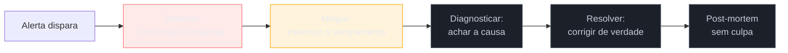
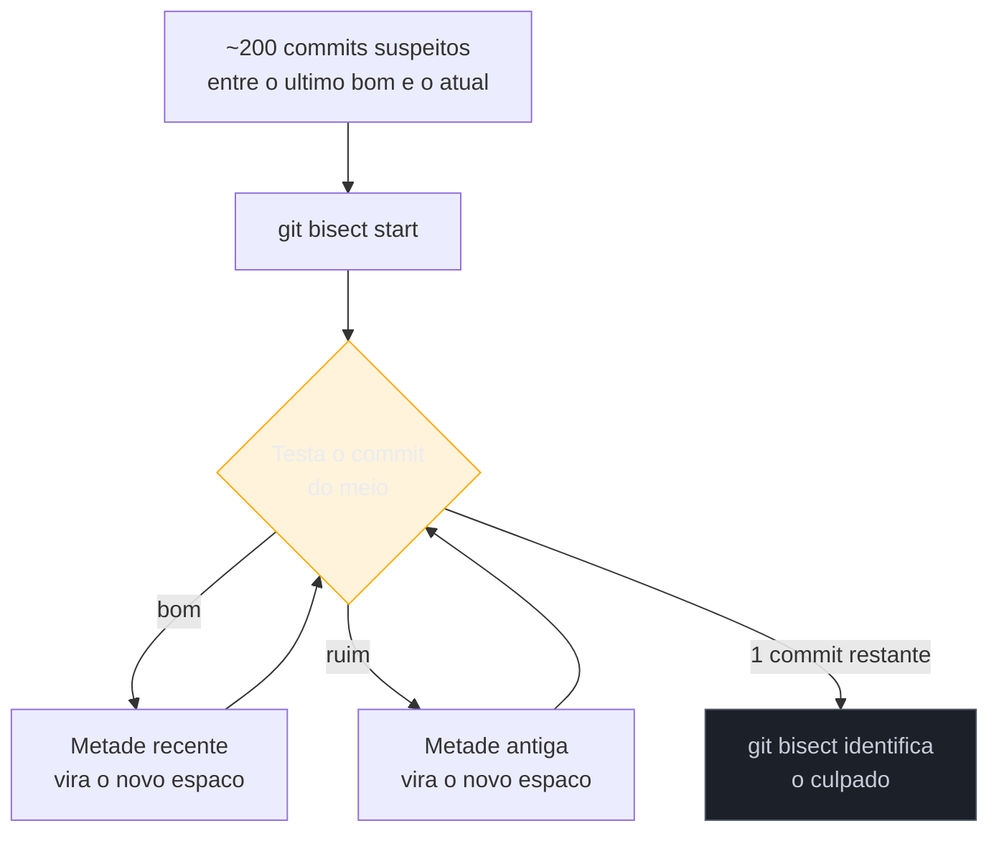
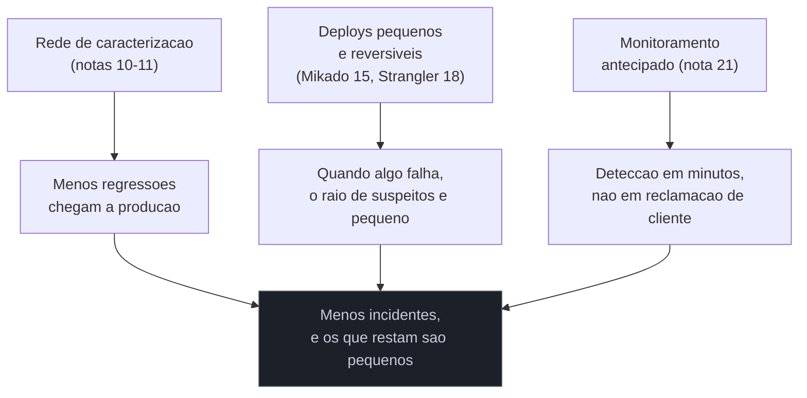

# Firefighting em produção

> [!abstract] TL;DR
> Dos três modos do consultor descritos na [[03 - A lente do consultor|nota 03]] — due diligence, herança, resgate —, este é o **resgate levado ao limite**: um incidente em produção, num sistema que você não escreveu e mal conhece, com o negócio parado e o relógio correndo. A regra de ouro que organiza tudo: **restaurar o serviço não é o mesmo que resolver o bug.** Primeiro você estanca o sangramento (rollback, feature flag desligada, circuit breaker) — depois, com o paciente estável, você investiga a causa. O playbook tem cinco passos — detectar, mitigar, diagnosticar, resolver, post-mortem sem culpa — e as ferramentas que os movem já são as do galho, agora usadas sob pressão: `git bisect`/blame ([[07 - Arqueologia do histórico|nota 07]]) para achar a mudança culpada, forense ([[09 - Forense de software|nota 09]]) para os hotspots suspeitos, observabilidade ([[21 - Validação em produção|nota 21]]) para ver o que está acontecendo *agora*. A disciplina de incident response como campo — SRE, on-call, SLO — mora em [[03-Dominios/Engenharia/Operação/index|Operação]]; aqui a pegamos emprestada sob a lente específica do legado: apagar incêndio num sistema desconhecido.

São três da manhã. O celular do consultor vibra com um alerta do PagerDuty: a plataforma de logística está devolvendo erro 500 em 40% das requisições de faturamento. Ele assumiu a manutenção desse sistema há duas semanas. Ainda não tem o mapa mental completo — mal terminou o [[04 - Os primeiros 30-60-90 dias|inventário técnico]] dos primeiros dias. Não sabe de cor onde fica o código de cálculo de imposto, não sabe quais dependências externas o faturamento chama, não sabe se existe um `README` que explica o que aquele serviço faz de madrugada. O que ele sabe é isto: cada minuto fora do ar é receita perdida e confiança queimada, e ninguém na sala de guerra virtual quer ouvir "deixa eu entender a arquitetura primeiro".

É o pesadelo específico do restaurador: toda a paciência arqueológica das notas 01 a 09 — ler antes de tocar, respeitar a Chesterton's Fence, construir o modelo mental aos poucos — colide de frente com uma situação em que ler devagar custa dinheiro real a cada segundo. O erro mais caro que se comete nessa hora não é técnico, é de **sequenciamento**: tentar entender a causa raiz *antes* de estancar o sangramento. É gastar vinte minutos preciosos investigando por que `calcularTotal()` está lançando exceção, quando a resposta certa para os primeiros cinco minutos era simplesmente **reverter o último deploy** e voltar a pensar depois, com o sistema já respirando.

## A regra de ouro: mitigar não é resolver

Todo incidente sério tem duas perguntas, e elas não são a mesma pergunta feita duas vezes.

A primeira é **"como paro a sangria agora?"** — a pergunta de **mitigação**. A resposta ideal não exige entender por que o bug acontece; exige apenas saber qual alavanca reverte o sistema para o último estado conhecido-bom. Um rollback do deploy. Uma feature flag desligada. Um circuit breaker que corta a chamada para o serviço externo que está lento e derrubando tudo em cascata. Nenhuma dessas ações resolve o bug — todas elas apenas **removem o sistema da linha de fogo**, dando tempo para pensar sem o relógio da receita perdida correndo.

A segunda é **"por que isso aconteceu?"** — a pergunta de **causa raiz**. Essa exige exatamente a arqueologia que este galho ensina: ler o histórico, entender o seam que quebrou, reconstruir a teoria do trecho de código que falhou. É trabalho lento e cuidadoso por natureza — o oposto da urgência da mitigação.

> [!question]- Por que não simplesmente corrigir o bug de verdade e já resolver tudo de uma vez?
> Porque a correção de verdade exige entender o sistema, e entender sob pressão, com o negócio parado, é a receita para introduzir um *segundo* bug em cima do primeiro — agora sem tempo nem cabeça fria para caracterizar o comportamento antes de mudar ([[10 - A rede de segurança primeiro|nota 10]]). Mitigar primeiro compra o único recurso que falta numa crise: **tempo sem pressão**. Um rollback devolve o sistema ao estado de ontem, que você já sabe que funcionava — mesmo sem entender por quê. Só depois, com a sangria estancada, vale a pena investir na pergunta mais difícil.

A ordem entre as duas nunca se inverte. Isso é o que separa o playbook de firefighting de uma sessão comum de debugging: em debugging normal, causa e correção costumam vir juntas, sem custo de esperar. Num incidente, esperar a causa raiz custa dinheiro a cada minuto — então você separa as duas fases *de propósito*, mesmo que a fase de mitigação pareça "não estar resolvendo nada".

## O playbook: detectar, mitigar, diagnosticar, resolver, post-mortem

Cinco passos, sempre nessa ordem, mesmo que o passo 3 leve minutos e o passo 4 leve dias:

1. **Detectar** — confirmar que é um incidente de verdade, não ruído (um alerta falso, um pico normal de tráfego). Em sistema legado sem observabilidade, esse passo sozinho pode consumir minutos preciosos: você não tem dashboard, só um cliente reclamando no chat. É o primeiro argumento a favor de instrumentar *antes* de precisar ([[21 - Validação em produção|nota 21]]).
2. **Mitigar** — a alavanca mais rápida e mais reversível disponível. Em ordem de preferência: reverter o último deploy (se o incidente coincide com um release recente — o caso mais comum), desligar uma feature flag, isolar uma dependência instável com circuit breaker, ou, no limite, escalar recursos (mais réplicas, mais memória) como paliativo enquanto o resto se resolve. Nenhuma decisão aqui requer entender o código — requer entender **qual botão volta o sistema ao estado de ontem**.
3. **Diagnosticar** — agora, com o serviço estável, investigar a causa real. É aqui que o kit de ferramentas do galho entra com força total (próxima seção).
4. **Resolver** — a correção de verdade, feita com o cuidado normal do restaurador: caracterizar o comportamento, isolar um seam, corrigir, validar. Sem pressa artificial — a pressa já foi absorvida pela mitigação no passo 2.
5. **Post-mortem sem culpa** — documentar o que aconteceu, por que, e o que muda para que não se repita. A disciplina de como conduzir esse ritual — facilitação, template, cultura *just culture* — é de [[03-Dominios/Engenharia/Operação/index|Operação]]; aqui o que importa é o princípio que o sustenta (ver Fundamento teórico).

> [!warning] O passo que mais gente pula: 2 antes de 3
> **O que acontece:** sob pressão, o instinto de quem já entende bem o sistema é ir direto ao passo 3 — investigar. Num sistema legado, onde você *não* entende bem o sistema, esse instinto é ainda mais perigoso, porque a investigação demora muito mais. **Por quê:** investigar parece "fazer progresso de verdade", enquanto mitigar parece um curativo. Mas o curativo é o que para o sangramento — a cirurgia vem depois, com o paciente estável. **Como evitar:** antes de abrir um único arquivo de código, pergunte "existe uma mudança recente que eu possa simplesmente reverter?". Se a resposta for sim, reverta primeiro, investigue depois.

## O kit de ferramentas do galho, agora sob fogo

As técnicas de escavação que este galho ensinou nas fases Iniciado e Adepto não mudam sob incidente — mudam de **ritmo**. O que era exploração cuidadosa vira busca dirigida por hipótese, com um cronômetro correndo.

**`git bisect` e `git blame`** ([[07 - Arqueologia do histórico|nota 07]]) são a primeira parada quando o incidente coincide com um deploy recente — o cenário mais comum de longe. Em vez de ler commit por commit em ordem cronológica, `git bisect` faz busca binária: você marca um commit "bom" (o último release estável) e um "ruim" (o atual), e o Git escolhe o ponto médio para você testar. A cada rodada, o espaço de commits suspeitos cai pela metade — encontrar o culpado entre 200 commits leva, no pior caso, apenas 8 testes, não 200.

Uma vez achado o commit culpado, `git blame` na linha exata que ele tocou te dá o contexto que falta: quem escreveu, quando, e — se a mensagem de commit for boa — *por quê*. É o passo mais rápido de recuperação parcial de teoria (Naur) que existe: você não reconstrói a teoria inteira do sistema, só a teoria daquela linha específica, e é exatamente o suficiente para diagnosticar.

**A forense de hotspots** ([[09 - Forense de software|nota 09]]) entra quando o incidente **não** coincide com nenhum deploy — o cenário mais assustador, porque significa que algo mudou de comportamento sem que ninguém tenha tocado no código (um limite de recursos estourado com o crescimento orgânico do tráfego, um dado inesperado que chegou pela primeira vez hoje). Sem um commit para culpar, você usa o histórico para achar onde *provavelmente* mora o problema: os arquivos de maior acoplamento temporal com o subsistema que está falhando, os hotspots de complexidade × frequência de mudança que já eram suspeitos antes mesmo do incidente.

**Observabilidade** ([[21 - Validação em produção|nota 21]]) é o que responde à pergunta mais urgente de todas: **o que está acontecendo agora, neste exato momento, em produção?** Logs estruturados, traces distribuídos, métricas — quando existem — encurtam o diagnóstico de horas para minutos, porque você para de adivinhar e passa a *ver*. Quando não existem (o caso comum em legado), o primeiro ato de diagnóstico costuma ser instrumentar às pressas o trecho suspeito só para conseguir observar, o que por si só já é uma pequena restauração feita sob fogo.

> [!info] Por que isso não é "aprender SRE de novo"
> Este galho não ensina a disciplina de incident response — isso é [[03-Dominios/Engenharia/Operação/index|Operação]]: runbooks, rotação de on-call, SLO/error budget, a mecânica de escalar uma sala de guerra. O que este galho acrescenta é a camada que falta nos manuais genéricos de SRE: **e se você não souber onde fica o botão de rollback porque nunca viu esse deploy pipeline antes?** É aí que a arqueologia do histórico, a forense e a lente do consultor viram parte do arsenal do resgate.

## Fundamento teórico: decidir rápido com informação incompleta

O playbook acima parece só bom senso operacional, mas repousa sobre teoria formal de tomada de decisão sob pressão — e conhecê-la muda como você se comporta na sala de guerra, não só o que você faz.

**1. O ciclo OODA (Boyd).** O piloto de caça e estrategista militar John Boyd formulou o ciclo **Observe-Orient-Decide-Act** para explicar por que, num combate, vence quem decide *mais rápido com informação incompleta*, não quem espera ter informação completa. Aplicado ao incidente: **Observe** é o passo Detectar (o que os alertas e logs mostram agora); **Orient** é interpretar isso à luz do que você já sabe do sistema (por mais pouco que seja); **Decide** é escolher a alavanca de mitigação; **Act** é puxá-la. O ponto central de Boyd é que **ciclos curtos e repetidos batem uma única decisão "perfeita" e lenta** — que é exatamente por que reverter rápido e reavaliar bate investigar exaustivamente antes de agir.

**2. Decisão por reconhecimento de padrões (Gary Klein).** Klein estudou bombeiros veteranos e descobriu que eles não comparam opções racionalmente sob pressão — eles **reconhecem** a situação como similar a uma vivida antes e agem pelo padrão reconhecido, sem deliberação consciente (*recognition- primed decision*). É por isso que um consultor sênior, mesmo sem conhecer *este* sistema específico, triagem mais rápido que um júnior: ele já viu cem incidentes de "erro 500 em massa logo após deploy" e reconhece o padrão "reverta primeiro" antes mesmo de olhar o código. A experiência acumulada em sistemas legados *diferentes* transfere — não porque o código se repete, mas porque os **padrões de falha** se repetem.

**3. Segurança como propriedade emergente, não ausência de erro (Dekker, Safety-II).** A engenharia de resiliência de Sidney Dekker argumenta que sistemas complexos não falham porque alguém foi negligente — falham porque o sistema real (*work as done*) sempre diverge do sistema imaginado nos documentos e na cabeça de quem o projetou (*work as imagined*). Num sistema legado, essa divergência é **máxima**: o que o código realmente faz há muito deixou de bater com qualquer documentação. O incidente não é uma anomalia — é o momento em que essa divergência, sempre presente, se torna visível e cara. Isso reformula o objetivo do post-mortem: não é achar "quem errou", é entender **onde o modelo mental do time divergia da realidade**, porque essa divergência vai continuar produzindo incidentes até ser fechada.

**4. Cultura justa e post-mortem sem culpa (Allspaw).** John Allspaw, então na Etsy, formalizou o princípio que hoje é padrão da indústria: culpar uma pessoa por um incidente **garante que o próximo incidente será escondido**, não evitado — porque a resposta racional a um ambiente punitivo é esconder erros, não relatá-los. O post-mortem *blameless* trata o erro humano como sintoma de um sistema (técnico e organizacional) que tornou aquele erro fácil de cometer, e pergunta "o que no sistema permitiu isso?" em vez de "quem fez isso?". Num sistema legado isso é ainda mais crítico: se o incidente aconteceu porque a documentação mentia ou porque o histórico de `git` não explicava uma decisão crítica, a "causa" nunca foi a pessoa que apertou o botão — foi a teoria perdida que este galho inteiro existe para recuperar.

**Firefighting em produção em uma frase:** sob pressão e informação incompleta, cicle rápido entre observar e agir para estancar o dano primeiro, reconheça padrões de incidentes passados para acelerar a triagem, e trate a causa raiz — sempre depois, nunca antes — como uma divergência sistêmica a corrigir, não uma culpa a atribuir.

## Como evitar chegar lá: prevenção é o incidente que não aconteceu

O melhor incidente é o que nunca acontece, e as ferramentas para isso já foram dadas em notas anteriores — o firefighting é, em boa parte, a fatura que se paga quando elas faltaram.

A rede de caracterização ([[10 - A rede de segurança primeiro|nota 10]]) captura o comportamento atual antes de qualquer mudança — a maioria das regressões que viram incidente de madrugada são exatamente o tipo de coisa que um teste de caracterização pegaria em CI, de dia, sem pressão. Deploys pequenos e reversíveis (o [[15 - O Método Mikado|Mikado]] no nível do código, o [[18 - Strangler Fig|Strangler Fig]] no nível do sistema) fazem o mesmo trabalho que o `git bisect` faz depois do fato — só que *antes*: se cada mudança é pequena, o espaço de suspeitos quando algo quebra já nasce pequeno. E monitoramento instalado com antecedência ([[21 - Validação em produção|nota 21]]) transforma o passo Detectar de "um cliente reclamou às três da manhã" para "um alerta automático disparou em segundos". Firefighting bem-sucedido é uma habilidade que vale a pena ter — mas a melhor versão dela é nunca precisar usá-la.

## Casos práticos

### Cenário 1: o deploy que quebrou o faturamento — mitigação por rollback, causa por bisect

Voltando à plataforma de logística: o alerta de 500 em massa no faturamento coincide, no tempo, com um deploy feito duas horas antes por outro time. **Mitigação**: sem entender ainda o que mudou, o consultor reverte o deploy para a versão anterior — decisão de segundos, não de investigação. O erro para imediatamente. **Diagnóstico**: com o sistema respirando, `git bisect` entre os ~15 commits daquele deploy isola em quatro testes o commit culpado: uma mudança na função de cálculo de imposto que assumia, incorretamente, que todo contrato tinha um campo `regiao_fiscal` preenchido — verdade para 99% dos contratos, falso para os 1% legados de antes de uma migração de anos atrás. `git blame` mostra que a linha original tinha uma checagem de nulo que o autor do novo commit removeu, achando-a redundante. **Resolução**: a checagem volta, agora com um teste de caracterização cobrindo explicitamente o caso do contrato sem `regiao_fiscal`, fechando a lacuna que permitiu a regressão.

### Cenário 2: o vazamento sem deploy — forense e observabilidade, sem bisect para ajudar

Semanas depois, um incidente diferente: o serviço de rastreamento de cargas começa a ficar lento e, depois de uma hora, cai por exaustão de memória. Não houve deploy naquele dia — nem na véspera. Sem um commit para culpar, `git bisect` não serve de nada. **Mitigação**: a alavanca disponível é reiniciar o processo (o que libera a memória temporariamente) e escalar réplicas, comprando tempo sem entender nada ainda — um paliativo puro, sabidamente temporário. **Diagnóstico**: a forense de hotspots ([[09 - Forense de software|nota 09]]) aponta o módulo de cache de rotas como o de maior acoplamento temporal com incidentes anteriores de performance — um sinal de que já era suspeito antes de hoje. Observabilidade recém-instalada na semana anterior (por sorte, ou por disciplina) mostra, em minutos, o tamanho do cache crescendo sem limite ao longo do dia: um *cache* sem política de expiração, que vinha funcionando "por acaso" porque o volume de rotas distintas era pequeno — até a empresa expandir para uma nova região e o número de rotas explodir. **Resolução**: a causa não era um bug pontual, era uma premissa de capacidade que deixou de valer — o tipo de descoberta que só a combinação de forense histórica e observabilidade em tempo real revela, porque nenhuma das duas sozinha contava a história inteira.

## Armadilhas comuns

> [!warning] Confundir "o serviço voltou" com "o problema acabou"
> **O que acontece:** o incidente é declarado encerrado assim que a mitigação funciona — o rollback parou os erros, todo mundo respira e volta a dormir. Ninguém agenda o diagnóstico real. **Por quê:** o alívio de ver o dashboard verde de novo é forte, e sem um processo formal que force o passo seguinte, a pressão organizacional para "seguir em frente" ganha. **Como evitar:** trate a mitigação como abertura de um ticket obrigatório, não como fechamento do incidente. O incidente só fecha depois do post-mortem — mesmo que isso leve dias.

> [!warning] Investigar de memória em vez de deixar o histórico guiar
> **O que acontece:** sob pressão, o instinto é abrir o código e ler, tentando adivinhar a causa por inspeção — em vez de perguntar primeiro "o que mudou recentemente aqui?" via `git log`/`bisect`. **Por quê:** ler código parece mais "técnico" e produtivo do que rodar um comando de histórico, mas em sistema legado a inspeção visual é lenta e o histórico costuma ser mais rápido — a mudança recente é, de longe, a causa mais comum de incidente. **Como evitar:** a primeira pergunta de diagnóstico é sempre "houve deploy recente?". Se sim, `bisect` antes de ler uma linha de código a mais do que o necessário.

> [!warning] Post-mortem com caça às bruxas
> **O que acontece:** a ata da reunião de post-mortem vira, na prática, uma lista de "quem fez o quê errado" — mesmo que ninguém diga isso em voz alta, o tom da conversa aponta dedos. **Por quê:** é o reflexo humano padrão diante de um prejuízo real; e em sistema legado é ainda mais tentador, porque "o código estava confuso" facilmente vira "a pessoa que mexeu nele devia ter percebido". **Como evitar:** aplique a disciplina *blameless* de Allspaw: toda pergunta do post-mortem é sobre o sistema ("o que tornou esse erro fácil de cometer, e difícil de detectar antes de produção?"), nunca sobre a pessoa. A facilitação formal desse ritual é assunto de [[03-Dominios/Engenharia/Operação/index|Operação]] — aqui, o mínimo inegociável é a pergunta certa.

> [!warning] Sobreviver ao incidente sem fechar a lacuna que o causou
> **O que acontece:** a correção pontual entra (o `if` que faltava, o limite de cache que faltava), mas ninguém transforma isso em prevenção: nenhum teste de caracterização novo, nenhum alerta novo, nenhuma nota em documentação. Seis meses depois, uma variação do mesmo incidente acontece de novo. **Por quê:** depois de um incidente estressante ([[25 - Sustentabilidade humana|nota 25]]), a energia do time vai para "seguir em frente", não para consolidar o aprendizado. **Como evitar:** todo post-mortem termina com pelo menos um item de ação que vira rede de segurança permanente — um teste de caracterização, um alerta, uma linha de ADR ([[24 - Conhecimento e documentação|nota 24]]) explicando a premissa que quebrou. O incidente só "valeu a pena" se ele deixar o sistema mais difícil de quebrar da mesma forma outra vez.

## Como explicar em inglês

> Under incident pressure, I never let root-cause analysis block mitigation — stopping the bleeding always comes first, understanding why comes second. My first move is checking whether a recent deploy correlates with the incident; if it does, I roll back before reading a single line of code. Git bisect turns "which of two hundred commits broke this" into a handful of tests through binary search. Once the system is stable, I diagnose properly — hotspot forensics when there's no deploy to blame, observability when I need to see what's happening right now. Every post-mortem is blameless: the question is always what in the system made the error easy to make, never who made it.

| PT | EN |
|----|----|
| mitigar vs. resolver | mitigate vs. resolve |
| estancar o sangramento | stop the bleeding |
| busca binária de commits | binary search over commits |
| post-mortem sem culpa | blameless postmortem |
| divergência entre o imaginado e o real | work-as-imagined vs. work-as-done |
| ciclo de decisão curto | tight decision loop / OODA loop |
| reconhecimento de padrões | pattern recognition / recognition-primed decision |
| circuit breaker | circuit breaker |

## O que vem a seguir

Sobreviver ao incidente resolve o problema técnico e humano imediato, mas às vezes a correção mais óbvia — apagar um trecho de código que parece morto, ou reverter uma decisão antiga — esbarra numa camada que nenhuma ferramenta de diagnóstico revela sozinha: obrigações legais e regulatórias que tornam certo código intocável mesmo sob fogo. E depois de dominar cada ferramenta isolada do galho, a última nota amarra tudo num único estudo de caso de ponta a ponta.

- [[27 - Compliance e arqueologia legal|nota 27]] — por que certo código *não pode* ser deletado nem durante um incidente, e como desenterrar essas restrições antes de agir sob pressão.
- [[28 - Capstone - Assumindo um sistema legado do zero|nota 28]] — o playbook do consultor completo, do primeiro contato ao incidente e à decisão de portfólio, num estudo de caso único.

## Fontes

- **Google** — [*Managing Incidents*](https://sre.google/sre-book/managing-incidents/) e [*Emergency Response*](https://sre.google/sre-book/emergency-response/), capítulos do *Site Reliability Engineering* — a referência canônica da indústria para o playbook de detecção, mitigação e resposta a incidentes.
- **John Allspaw** — [*Blameless PostMortems and a Just Culture*](https://codeascraft.com/2012/05/22/blameless-postmortems/) (Code as Craft, blog de engenharia da Etsy, 2012) — o texto que formalizou o post-mortem sem culpa como prática padrão da indústria.
- **PagerDuty** — [*Incident Response Documentation*](https://response.pagerduty.com/) — guia aberto e prático de resposta a incidentes, com o vocabulário de detectar/mitigar/resolver usado na indústria.
- **git-scm** — [*git-bisect Documentation*](https://git-scm.com/docs/git-bisect) — a referência oficial da busca binária sobre o histórico de commits.
- **Marianne Bellotti** — *Kill It with Fire: Manage Aging Computer Systems* (No Starch Press, 2021) — o capítulo sobre debugar e estabilizar legado sob pressão real de produção.
- **Farnam Street** — [*The OODA Loop*](https://fs.blog/ooda-loop/) — explicação acessível do ciclo de decisão de John Boyd (Observe-Orient-Decide-Act), aplicável à triagem de incidentes.
- Ver também [[03 - A lente do consultor|nota 03]] (o modo Resgate que esta nota aprofunda) e [[03-Dominios/Engenharia/Operação/index|Operação]] (a disciplina de incident response como campo).
