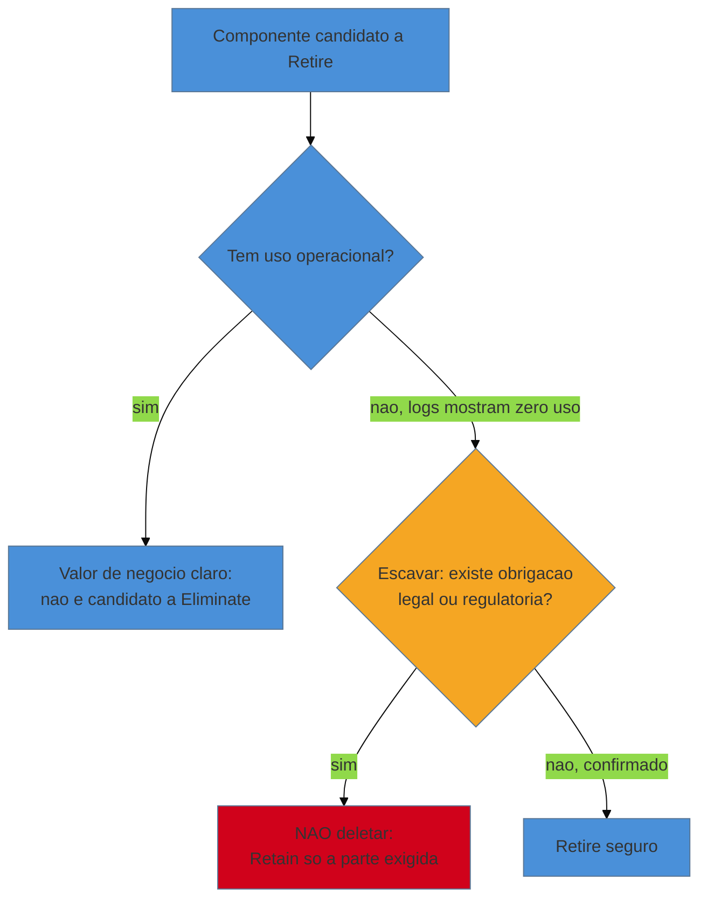
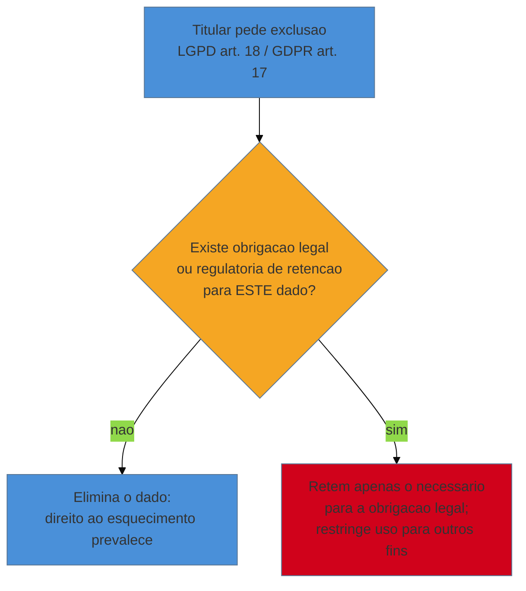

# Compliance e arqueologia legal

> [!abstract] TL;DR
> A [[16 - IA como acelerador e seus riscos|nota 16]] e a [[17 - Frameworks de decisão|nota 17]] apontaram para cá duas vezes: o `if` que parece morto e o relatório que "ninguém usa" mas que, quando você escava mais fundo, carrega uma **obrigação legal** que nenhum log de uso jamais vai revelar. O quadrante **Eliminate** do TIME manda **Retire** — mas Retire é o único dos 7 R's que é **irreversível**: uma vez deletado, o código, a query, o histórico de auditoria não voltam. Esta nota é a escavação que precede qualquer Retire: desenterrar as **restrições legais e regulatórias** — retenção de dados obrigatória, auditabilidade sob demanda, a tensão entre LGPD/GDPR (direito ao esquecimento) e leis fiscais/trabalhistas (dever de guardar) — antes de apertar o botão que não tem desfazer. A tese do galho aparece aqui em sua forma mais literal: às vezes a **teoria** que um trecho de código carrega não está na cabeça de nenhum engenheiro, está escrita numa lei.

Um consultor está fazendo a limpeza de portfólio da [[17 - Frameworks de decisão|nota 17]] numa plataforma de logística. O relatório de "movimentação de carga por rota" não é aberto por ninguém há dezoito meses — os logs de acesso confirmam, zero hits. Qualidade técnica mediana, valor de uso aparentemente zero. Quadrante Eliminate, verbo Retire, decisão óbvia. O time já tem o pull request pronto: `git rm -r relatorio-movimentacao/`. Antes de aprovar o merge, o consultor faz uma pergunta que não está em nenhum dashboard de uso: *"por que esse relatório existe? Alguém pediu, uma vez, para que ele fosse criado — quem, e por quê?"*

A resposta, encontrada duas camadas abaixo na arqueologia do histórico ([[07 - Arqueologia do histórico|nota 07]]), está num commit de sete anos atrás, com uma mensagem seca: *"relatório exigido pela ANTT para fiscalização de carga perigosa — ver ofício 4471/2019"*. Ninguém no time atual sabe o que é esse ofício. Ninguém jamais precisou gerar o relatório de verdade, porque nenhuma fiscalização aconteceu nesses sete anos. Mas se ela acontecer — e é questão de "quando", não de "se", em qualquer setor regulado — a empresa precisa produzir aquele relatório sob demanda, em horas, ou responde a uma multa que custa mais do que todo o orçamento de modernização do ano. "Ninguém usa" era verdade sobre o **uso rotineiro**. Era falso sobre a **obrigação**. E é exatamente esse tipo de falso-positivo que o Retire, sozinho entre os sete verbos, não perdoa.

## Por que "ninguém usa" não é "pode deletar"

O erro de raciocínio aqui é sutil e comum: confundir **valor de uso** com **valor total**. O TIME mede valor de negócio olhando, quase sempre implicitamente, para telemetria — quem chama a API, quem abre a tela, quem consulta a query. Isso captura bem o valor operacional. Mas existe uma segunda categoria de valor que não deixa rastro nenhum de uso porque sua função não é ser usada — é **existir, pronta, para o dia em que for exigida**. Um extintor de incêndio tem valor altíssimo mesmo que jamais tenha sido acionado; um relatório de compliance tem exatamente essa natureza. Ele não serve ao negócio no dia a dia — serve ao negócio no dia da auditoria, do processo, da fiscalização, e nesse dia a ausência dele não é um inconveniente, é uma infração.

A escavação que fecha essa lacuna tem três perguntas, na ordem certa, e cada uma delas é um tipo diferente de arqueologia que o galho já ensinou:

1. **Por que este código foi escrito?** — arqueologia do histórico (nota 07): `git log` e `git blame` até o commit original, procurando o ticket, o ofício, a norma citada na mensagem ou no comentário.
2. **Alguém, algum dia, pediu isso por escrito?** — arqueologia documental: contratos, pareceres jurídicos, atas de compliance, e-mails do jurídico arquivados em qualquer lugar que não seja o código.
3. **Existe uma lei ou norma setorial que obriga isso, mesmo que ninguém no time saiba nomeá-la?** — arqueologia regulatória: o assunto do resto desta nota.

> [!question]- Isso não devia estar documentado em algum ADR, em vez de escondido num commit de sete anos atrás?
> Devia — e é exatamente por isso que a [[24 - Conhecimento e documentação|nota 24]] existe. Mas o legado raramente teve o luxo de um ADR desde o início; a decisão "isso precisa existir por lei" foi tomada por alguém que já foi embora, registrada (se sorte) numa mensagem de commit ou (sem sorte) só na cabeça de um analista de compliance que também já foi embora. A arqueologia legal é o que você faz quando a documentação ideal nunca existiu. E quando você a encontra, o primeiro passo de restauração é justo escrevê-la agora, como ADR, para que o próximo consultor não precise escavar de novo.

## Retenção de dados: o que a lei obriga a guardar, e por quanto tempo

A primeira categoria de restrição legal não é sobre código — é sobre **dados**, e a maioria dos legados guarda muito mais dado histórico do que qualquer regra de negócio exige, precisamente porque ninguém nunca teve coragem de apagar nada. Mas a pergunta certa não é "podemos apagar?", é "**quanto tempo somos obrigados a guardar isto?**" — e a resposta varia por natureza do dado e por jurisdição:

- **Registros fiscais** (notas fiscais, livros contábeis): no Brasil, prazos de guarda que tipicamente seguem o prazo decadencial/prescricional tributário (a regra geral do CTN gira em torno de cinco anos, mas varia por tributo e por hipótese de suspensão da contagem — nunca assuma um número redondo sem checar com o jurídico do cliente).
- **Registros trabalhistas** (folha de pagamento, recolhimentos previdenciários): prazos historicamente longos no Brasil, com discussões específicas sobre FGTS que, na prática, empurram parte da retenção para décadas.
- **Registros de auditoria financeira** (empresas de capital aberto nos EUA): a **Sarbanes-Oxley Act**, Seção 802, com a regulamentação da SEC de 2003, obriga firmas de auditoria a reter os *workpapers* e registros relacionados à auditoria por **sete anos** após a conclusão da auditoria — e destruir esses registros antes do prazo, ou durante uma investigação, é crime.
- **Registros setoriais** — cada indústria regulada (transporte de carga, energia, saúde, telecom) tem seu próprio prazo, geralmente definido pela agência reguladora, não pelo Código Civil genérico.

O ponto que a arqueologia legal precisa internalizar: **o prazo de retenção não é uma política de produto, é uma restrição externa**. Você não decide quanto tempo guardar uma nota fiscal com base em quanto espaço em disco custa — decide com base no que a lei manda, e o código/schema que implementa essa retenção não é "legado esquecido", é **controle de compliance ativo**, mesmo que nunca tenha sido tocado desde que foi escrito.

## Auditabilidade: gerável sob demanda, mesmo sem uso rotineiro

A segunda categoria de restrição é sutil porque não é sobre *guardar dado* — é sobre **guardar a capacidade de produzir um artefato**. Um relatório exigido por norma regulatória não precisa ser executado todo mês; precisa **poder ser executado, corretamente, no dia em que um auditor pedir**. Isso muda a pergunta que o Adepto (notas 08-16) faz sobre código morto: não é "este código roda em produção?", é "**este código continua correto o suficiente para rodar quando for chamado, mesmo que não tenha rodado em meses?**"

Isso tem uma consequência prática incômoda: código de auditoria não pode ser tratado como código morto do ponto de vista de manutenção, mesmo tendo zero chamadas. Se o schema do banco mudar (nota 20) e ninguém atualizar a query do relatório de compliance porque "ninguém usa", o relatório vai quebrar silenciosamente — e você só vai descobrir no pior momento possível, com um auditor esperando o resultado. A [[10 - A rede de segurança primeiro|rede de caracterização]] que o galho ensina para código de negócio se aplica com ainda mais força aqui: um teste que garante que o relatório de compliance continua produzindo o resultado certo é a única forma barata de saber que ele não apodreceu em silêncio.

> [!info] Auditabilidade não é só "ter o relatório" — é ter a trilha
> ISO/IEC 27001, o padrão de referência para sistemas de gestão de segurança da informação, trata retenção de registros como um controle formal (histórico no Anexo A, hoje incorporado como parte dos controles organizacionais da revisão de 2022): não basta guardar o dado, é preciso guardar **evidência de que o controle foi seguido** — logs de acesso, histórico de alterações, quem gerou o quê e quando. Para o restaurador isso significa que apagar o *log de geração* de um relatório de compliance pode ser tão grave quanto apagar o relatório em si: a auditoria pergunta não só "o dado existe?" mas "como você prova que o processo foi seguido corretamente ao longo do tempo?".

## A tensão LGPD/GDPR: o mesmo dado, proibido de guardar E obrigatório de guardar

Aqui mora a armadilha mais contraintuitiva de toda esta nota, porque parece uma contradição lógica e não é: o **mesmo dado pessoal** pode estar sob uma lei que **obriga você a apagá-lo** e, simultaneamente, sob outra lei que **obriga você a guardá-lo**.

O GDPR (Regulamento UE 2016/679), no seu artigo 17, consagra o **direito ao esquecimento** (*right to erasure*): o titular pode pedir a exclusão de seus dados pessoais, e o controlador é, em regra, obrigado a atender. Mas o próprio artigo 17(3) lista exceções — e a mais relevante aqui é a alínea (b): o direito ao esquecimento **não se aplica** quando o tratamento for necessário para "cumprimento de obrigação legal que exija o tratamento" imposta ao controlador. O mesmo regulamento, no artigo 5(1)(e), impõe o princípio da **limitação da conservação** (*storage limitation*): dados pessoais não devem ser guardados além do necessário para os fins para os quais foram coletados — a não ser, de novo, que uma lei específica exija prazo maior.

A LGPD (Lei nº 13.709/2018) espelha exatamente essa estrutura no seu **artigo 16**: dados pessoais devem ser eliminados após o fim do tratamento, mas a lei autoriza expressamente a conservação para (I) cumprimento de obrigação legal ou regulatória pelo controlador, além de pesquisa, transferência a terceiros nos termos da lei, e uso exclusivo do controlador com anonimização. Ou seja: LGPD e GDPR, apesar de jurisdições diferentes, chegam à mesma arquitetura — o direito ao esquecimento é a **regra geral**, e a obrigação legal de retenção é a **exceção que a suspende**, dado a dado.

Na prática, isso significa que apagar dados de um usuário por causa de uma solicitação LGPD **não é** um `DELETE` único no banco inteiro. É uma decisão dado-a-dado: os campos de perfil, preferências e histórico de navegação podem (e devem) sair; os registros da nota fiscal daquele mesmo usuário, sujeitos a prazo fiscal, ficam — mas com o uso restrito **exclusivamente** ao propósito da obrigação legal que os mantém vivos, não mais disponíveis para marketing, recomendação ou qualquer outro fim.

> [!warning] Quando a arquitetura não separa "dado operacional" de "dado retido por obrigação"
> **O que caracteriza:** um sistema legado costuma ter os dois tipos de dado misturados na mesma tabela, sem nenhum campo que diga *por que* aquele registro ainda existe. **Por que é raro fazer isso desde o início:** ninguém desenhou o schema pensando em direito ao esquecimento — a LGPD é de 2018, muitos desses sistemas são mais velhos que a lei. **Como decidir com honestidade:** antes de implementar qualquer fluxo de exclusão por solicitação do titular, mapeie explicitamente, por tabela, qual coluna tem qual base legal de retenção. Sem esse mapa, o `DELETE` que atende ao titular vira, sem querer, uma violação da obrigação fiscal — ou o contrário.

## Regimes por domínio: cada setor tem seu próprio conjunto de restrições

Além da retenção genérica e da tensão LGPD/GDPR, setores regulados carregam obrigações específicas que a arqueologia precisa conhecer para saber onde procurar:

- **SOX** (financeiro, empresas de capital aberto): além dos sete anos de retenção de auditoria já citados, a Seção 404 exige controles internos sobre relatórios financeiros — o que inclui, na prática, que sistemas que geram números para o balanço tenham trilha auditável e não possam ser alterados sem registro de quem mudou o quê.
- **HIPAA** (saúde, EUA): protege informação de saúde (*PHI*) com regras próprias de retenção, acesso mínimo necessário e trilha de auditoria de quem acessou o prontuário — deletar um sistema que processa PHI sem entender essas regras é risco regulatório direto.
- **PCI-DSS** (dados de cartão de pagamento): exige uma política explícita de retenção e descarte de dados de titular de cartão, minimizando o quanto é guardado e por quanto tempo — aqui a lógica se inverte em relação às outras: o padrão **empurra para deletar mais cedo**, não mais tarde, porque dado de cartão parado é risco de vazamento.

O padrão comum a todos: nenhum desses regimes aparece nos logs de uso do sistema. Eles vivem em contratos, políticas internas de compliance e nas cabeças (cada vez mais raras, à medida que o tempo passa) de quem os implementou. Escavar essas restrições é, literalmente, arqueologia — reconstruir uma teoria que nunca esteve no código, só na lei que o código obedece.

## Fundamento teórico: compliance como restrição externa não-negociável

Todo o resto deste galho trata restrições como coisas que o restaurador pode, com julgamento técnico, pesar contra outras — custo contra benefício, risco contra velocidade. Compliance quebra essa simetria, e vale nomear por que.

**1. É uma restrição exógena, não um trade-off de engenharia.** As decisões da [[17 - Frameworks de decisão|nota 17]] pesam valor de negócio contra qualidade técnica — dois eixos que o próprio time controla e pode, dentro de certos limites, negociar. Uma obrigação legal de retenção não é negociável pela engenharia: ela é imposta de fora, por um Estado ou por um regulador setorial, e seu descumprimento gera consequência que nenhuma métrica de portfólio captura — multa, processo, em casos extremos responsabilidade pessoal de diretores. Isso reclassifica compliance: não é um critério a mais no TIME, é um **filtro que roda antes** do TIME, determinando quais componentes sequer podem entrar no quadrante Eliminate.

**2. Irreversibilidade assimétrica.** Dos 7 R's da nota 17, seis são corrigíveis se você errar: um Rehost malfeito pode ser refeito, um Refactor pode ser revertido, um Retain pode ser reavaliado no próximo ciclo. Retire, sozinho, não é — uma vez que o código e os dados que ele mantinha são apagados, a reconstrução (se for sequer possível) custa ordens de grandeza mais do que a checagem que a teria evitado. Em teoria de decisão sob incerteza, ações irreversíveis exigem um limiar de evidência muito mais alto do que ações reversíveis — o mesmo argumento do **valor de opção** que a nota 17 usou para preferir incremento a rewrite big-bang se aplica aqui, na sua forma mais extrema: antes de uma ação sem volta, o custo de checar é sempre menor que o custo esperado de errar.

**3. A teoria de Naur, versão jurídica.** A tese do galho — o que se restaura é a teoria do sistema, não o código — ganha aqui uma leitura literal. Naur descreve a teoria como o conhecimento tácito de *por que* o sistema é como é, vivo na cabeça de quem o construiu. Uma obrigação regulatória é exatamente esse tipo de conhecimento, só que sua origem não é um engenheiro, é uma lei. Quando o programador que implementou o relatório de compliance vai embora sem documentar o motivo, a teoria não desaparece — ela continua existindo, escrita no ofício da agência reguladora, no artigo da lei, no contrato com o cliente. Ela só ficou **desacoplada do código** que a implementa. Escavar essa desconexão e reconectar o código à sua justificativa legal é, no sentido mais estrito, o mesmo trabalho de recuperação de teoria que este galho ensina desde a nota 01 — só que a fonte da teoria, desta vez, não é um repositório git, é um diário oficial.

**Compliance e arqueologia legal em uma frase:** antes de qualquer Retire, escave se o código carrega uma obrigação legal que nenhum log de uso revela — porque é o único dos sete R's cujo erro não tem conserto.

## Casos práticos

### Cenário 1: o relatório de carga perigosa — a obrigação que reverte o Retire

Retomando a abertura desta nota: o relatório de movimentação de carga da plataforma de logística tinha zero uso em dezoito meses e qualidade técnica mediana — no TIME, aparentemente Eliminate. A escavação do histórico revela a obrigação regulatória (o ofício da ANTT citado no commit original). A decisão muda completamente: em vez de Retire no módulo inteiro, o verbo correto é **Retain seletivo** — mantém-se funcional apenas o caminho que gera aquele relatório específico (dados de carga perigosa, formato exigido), e o restante do módulo de relatórios (dashboards de uso interno, sem base legal) pode, sim, ser aposentado. A escavação não impediu a limpeza — **refinou seu escopo**, isolando o um por cento que era, de fato, obrigatório, do resto que era, de fato, morto.

### Cenário 2: a solicitação de exclusão LGPD que esbarra no prazo fiscal

Um cliente da plataforma exerce seu direito de exclusão sob a LGPD, pedindo que todos os seus dados sejam apagados. O time de engenharia, sem mapear a base legal de cada tabela, roda um script que deleta o usuário em cascata — incluindo as notas fiscais das entregas que ele contratou. Três meses depois, uma fiscalização tributária pede exatamente esses registros, dentro do prazo de guarda obrigatório, e a empresa não tem como produzi-los: já os apagou atendendo a uma lei diferente. O erro não foi atender ao pedido do titular — foi **não separar**, antes de atender, quais dados daquele usuário estavam protegidos pelo direito ao esquecimento e quais estavam sob obrigação de retenção fiscal (LGPD art. 16, I). A correção estrutural é o mapa dado-a-dado descrito na seção da tensão LGPD/GDPR: o fluxo de exclusão consulta esse mapa antes de deletar, anonimizando ou desvinculando o que pode e retendo, sob acesso restrito, só o que a lei exige.

## Armadilhas comuns

> [!warning] Tratar ausência de uso como prova de ausência de valor
> **O que acontece:** um componente sem chamadas nos últimos meses/anos é classificado direto como Eliminate, sem checar se seu valor é de conformidade, não de operação. **Por quê:** telemetria mede o que é fácil de medir — chamadas, acessos, cliques — e é cega para obrigações que só se manifestam sob auditoria, uma vez a cada anos. **Como evitar:** antes de qualquer Retire, faça as três perguntas da escavação (por que foi escrito, quem pediu por escrito, existe norma que obriga) — mesmo que o componente pareça óbvio demais para merecer o esforço. É exatamente quando parece óbvio que a checagem é mais barata do que o erro.

> [!warning] Confundir "eliminar dado" com "eliminar código/schema"
> **O que acontece:** ao atender a uma solicitação de exclusão LGPD/GDPR, o time apaga não só os dados do titular, mas a estrutura (tabela, coluna, endpoint) que os mantinha — inclusive a parte que servia outros registros, ainda sob obrigação de retenção. **Por quê:** "excluir os dados do usuário X" e "excluir o sistema que guarda dados de usuários" parecem a mesma ação, mas operam em escopos completamente diferentes. **Como evitar:** direito ao esquecimento é sempre escopado por titular e por finalidade — nunca por tabela inteira. O que se apaga é a linha (ou o campo), respeitando as exceções do art. 16 da LGPD / art. 17(3) do GDPR; a estrutura que serve outros titulares, sob outras bases legais, permanece.

> [!warning] Presumir que a política interna de retenção é a lei
> **O que acontece:** o time encontra uma política de retenção documentada ("guardamos por 5 anos") e a trata como o teto legal, quando na verdade é uma convenção interna, às vezes desatualizada, às vezes mais conservadora — ou mais permissiva — do que a lei exige hoje. **Por quê:** política interna é o artefato mais fácil de achar (está no wiki, não no Diário Oficial), então vira a fonte de verdade por conveniência, não por precisão. **Como evitar:** trate a política interna como *hipótese* a validar com o jurídico, nunca como fato consumado. Leis e normas setoriais mudam (a própria LGPD é de 2018; regulamentações da ANPD continuam saindo); uma política escrita há oito anos pode estar defasada nos dois sentidos.

## Como explicar em inglês

> Before I retire any "dead" component, I check whether its value is compliance-based rather than operational — usage logs never show that. Retention obligations, audit requirements, and privacy law can point in opposite directions on the very same record: GDPR's right to erasure and LGPD's Article 16 both carve out an explicit exception for data kept to fulfill a legal or regulatory obligation, so the same field can be simultaneously required to delete and required to keep, depending on which law is asking. Retire is the one decision among the seven R's that has no undo, so I treat it as the highest-evidence-bar action in the whole framework.

| PT | EN |
|----|----|
| retenção de dados | data retention |
| direito ao esquecimento | right to erasure |
| limitação da conservação | storage limitation |
| obrigação legal/regulatória | legal/regulatory obligation |
| trilha de auditoria | audit trail |
| gerável sob demanda | generable on demand |
| código morto (por uso) vs. valor de conformidade | dead-by-usage code vs. compliance value |
| irreversível | irreversible |

## O que vem a seguir

Você agora sabe escavar a restrição legal que pode reverter um Retire — mas essa restrição raramente chega sozinha até o consultor. Ela chega embutida na política, no orçamento e na paciência de quem decide se a modernização acontece, e é isso que as próximas notas endereçam.

- [[23 - A dimensão política|nota 23]] — a compliance descoberta aqui é, com frequência, o argumento mais forte para convencer um stakeholder cético a investir em restauração: "isso não é só dívida técnica, é risco regulatório" muda a conversa no orçamento.
- [[24 - Conhecimento e documentação|nota 24]] — uma vez escavada, a obrigação legal precisa virar um ADR explícito, para que o próximo consultor não repita a mesma escavação do zero.
- [[28 - Capstone - Assumindo um sistema legado do zero|nota 28]] — o playbook completo do consultor, do primeiro contato à decisão final, amarra compliance como um dos filtros obrigatórios antes de qualquer corte.

## Fontes

- **União Europeia** — [*Regulation (EU) 2016/679 (GDPR)*, Artigo 17 (Right to erasure) e Artigo 5 (Principles relating to processing)](https://eur-lex.europa.eu/eli/reg/2016/679/oj) — a base legal do direito ao esquecimento e suas exceções, incluindo cumprimento de obrigação legal.
- **Governo do Brasil** — [*Lei nº 13.709, de 14 de agosto de 2018 (LGPD)*, Artigo 16 (Eliminação de dados pessoais)](https://www.planalto.gov.br/ccivil_03/_ato2015-2018/2018/lei/l13709.htm) — as quatro hipóteses de conservação de dados após o fim do tratamento, espelhando a estrutura do GDPR.
- **U.S. Securities and Exchange Commission** — [*Retention of Records Relevant to Audits and Reviews* (Regulation S-X, implementando a Seção 802 do Sarbanes-Oxley Act)](https://www.sec.gov/rules-regulations/2003/01/retention-records-relevant-audits-reviews) — o prazo de sete anos de retenção de registros de auditoria e a base legal da auditabilidade obrigatória.
- **ISO** — [*ISO/IEC 27001 — Information security management systems*](https://www.iso.org/standard/27001) — o padrão de referência que trata retenção e trilha de evidência como controles formais de segurança da informação.
- **Marianne Bellotti** — *Kill It with Fire: Manage Aging Computer Systems* (2021) — o argumento de que todo sistema legado carrega "o sistema em volta do sistema", incluindo restrições regulatórias que não aparecem em nenhum diagrama de arquitetura.
- Ver também a origem desta escavação em [[17 - Frameworks de decisão|Frameworks de decisão]] (o quadrante Eliminate) e em [[16 - IA como acelerador e seus riscos|IA como acelerador e seus riscos]] (o `if` que parece inútil).
