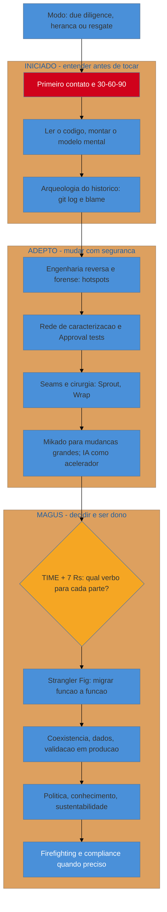
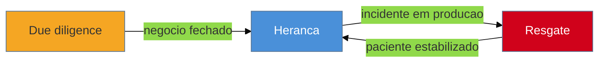

# Capstone - Assumindo um sistema legado do zero

> [!abstract] TL;DR
> As 27 notas anteriores deste galho lhe deram peças — o primeiro contato, a rede de caracterização, os seams, o Mikado, o TIME, o Strangler Fig. Esta nota não adiciona uma peça nova: ela mostra as peças **em uso, na ordem certa, dentro de um único engajamento**. Segue-se um consultor por uma jornada completa em uma plataforma de logística — dos três modos de assumir de fora ([[03 - A lente do consultor|due diligence, herança, resgate]]) até virar o dono confiante — passando pelas três fases do galho: **Iniciado** (entender antes de tocar), **Adepto** (mudar com segurança) e **Magus** (decidir e ser dono). A tese sobrevive intacta ao caso inteiro: o que se restaura nunca foi o código, foi a [[03-Dominios/Engenharia/Complexidade de Software/04 - O programa como teoria|teoria do sistema (Naur)]] — e o default, do primeiro dia ao último, é restaurar por incrementos seguros, nunca o *"kill it with fire"*.
>
> [!info] O roteiro instrumental das primeiras horas
> O par técnico deste capstone é [[03-Dominios/Tecnologia/Controle de Versão/34 - Capstone - assumir um repositório desconhecido|Controle de Versão 34 — Assumir um repositório desconhecido]]: quatro horas de comandos, hora a hora, extraindo do repositório o mapa de risco, autoria e hotspots que alimentam o método daqui.

Três semanas atrás, um fundo de investimento ligou. Está avaliando comprar uma empresa de logística cujo diferencial competitivo é uma plataforma de rastreamento e faturamento que roda há quinze anos. O fundo precisa de uma resposta antes de assinar o cheque: *esse software é um ativo ou um passivo escondido?* Isso é [[03 - A lente do consultor|modo due diligence]] — e é onde esta jornada começa.

O consultor que aceita essa ligação não está entrando num onboarding tranquilo com um tech lead explicando tudo com calma. Está entrando de paraquedas num sistema que ninguém vai lhe explicar, sob um relógio que não é seu, para tomar decisões cujo custo de errar é medido em milhões e em empregos. É exatamente a postura que abre o galho inteiro, na [[02 - A mentalidade do restaurador|nota 02]]: respeito arqueológico por um sítio que você não escavou, ceticismo sobre o que parece morto, e paciência para entender antes de agir. Esta nota não introduz nenhuma técnica nova — ela é o teste de que todas as 27 anteriores, juntas, formam um método coerente, e não uma coleção de truques soltos.

## A forma da jornada

Antes de entrar no caso, vale ver o mapa inteiro de uma vez. As três fases do galho não são um índice de sumário — são uma sequência de posturas que o consultor assume, cada uma pré-requisito da seguinte:

Vermelho no início não é decoração: é o estado real do consultor no primeiro dia, cego diante de um sistema que não escreveu. Azul no fim é o destino — não "sistema perfeito", mas *dono confiante*, alguém que entende a teoria bem o bastante para decidir e agir sobre ela sem medo. O âmbar no meio marca a única bifurcação genuína da jornada: o ponto onde TIME e os 7 R's ([[17 - Frameworks de decisão|nota 17]]) transformam tudo o que foi escavado em decisão.

Só que o diagrama acima mente por omissão, e a jornada real corrige essa mentira já no primeiro capítulo do caso.

## Os modos não são estanques — e a jornada também não

A [[03 - A lente do consultor|nota 03]] avisa: due diligence, herança e resgate "não são estanques" — um engajamento migra de modo, e reconhecer a transição é parte do trabalho. O mesmo vale para as três fases. Elas não são um trilho de mão única onde, uma vez em Magus, você nunca mais volta a agir como Iniciado. Um incidente em produção durante a execução de um Strangler Fig te devolve, sem aviso, à postura de primeiro contato — só que agora sob fogo.

Guarde esse diagrama — os dois cenários a seguir são exatamente essa sequência acontecendo, na mesma plataforma de logística que abriu as notas 17 e 18.

## Fundamento teórico: por que a jornada tem essa forma

Os frameworks de decisão já mostraram sua base teórica (portfólio, custo afundado, Lehman, opções reais — [[17 - Frameworks de decisão|nota 17]]). O que falta nomear é *por que a jornada inteira* — não só a decisão do quadrante Migrate — tem a forma de três fases sequenciais que podem regredir.

**1. Naur, outra vez: a missão de ponta a ponta é uma só.** Cada nota deste galho, do primeiro contato ao compliance, é instrumental a um único objetivo: recuperar, na cabeça do consultor e depois em artefatos compartilháveis, a [[03-Dominios/Engenharia/Complexidade de Software/04 - O programa como teoria|teoria que o sistema carrega]]. O 30-60-90 recupera teoria por observação; a forense recupera teoria pelo padrão de mudança (quem mexeu em quê, e quando); a rede de caracterização recupera teoria pelo comportamento observado sob teste; o Mikado recupera teoria pelo mapa de pré-requisitos; e a decisão de Migrate recupera teoria *ativamente*, reencarnando-a em código novo. É a mesma operação, repetida em instrumentos diferentes, em escalas diferentes.

**2. O modelo de Dreyfus explica por que a ordem Iniciado→Adepto→Magus não é arbitrária.** Hubert e Stuart Dreyfus descreveram, a partir de 1980, cinco estágios de aquisição de perícia — do novato, que segue regras explícitas sem julgamento de contexto, ao especialista, que reconhece padrões holisticamente e age por intuição treinada, sem decompor a decisão em regras. O novato em código legado *precisa* de um protocolo explícito (o 30-60-90, os passos do Sprout Method) porque ainda não tem o julgamento para improvisar com segurança. O Magus dispensa parte do protocolo — reconhece um hotspot de relance, sente quando um "código feio" esconde um bug consertado — porque internalizou o padrão. As três fases deste galho não são só um índice didático: são um andaime que imita, de propósito, a curva real de aquisição de perícia. Por isso pular etapas (ir direto para decidir sem ter escavado) não é atalho — é regredir a novato tomando decisão de especialista, a pior combinação possível.

**3. Cynefin explica por que "entender antes de tocar" é uma exigência estrutural, não prudência.** Dave Snowden classifica domínios de decisão em claro, complicado, complexo e caótico. Um sistema legado bem documentado é *complicado*: exige perícia, mas a relação entre causa e efeito é descobrível por análise. Um sistema legado real — sem documentação, sem quem o escreveu, sob quinze anos de mudanças não registradas — é **complexo**: a relação causa-efeito só é visível *depois do fato*, e a estratégia correta não é "analisar e planejar antes de agir" (sense-analyze-respond), é **sondar com segurança, observar, só então agir** (probe-sense-respond). É exatamente o que a rede de caracterização e os *safe-to-fail experiments* do Mikado fazem: sondas de baixo risco que revelam a estrutura real do sistema antes de qualquer aposta grande. A fase Magus só pode aplicar julgamento de especialista (complicado) depois que Iniciado e Adepto reduziram a complexidade a algo analisável — e é por isso que pular direto para o TIME sem ter escavado é aplicar a ferramenta errada ao domínio errado.

**4. A jornada inteira é, ela mesma, uma sequência de opções reais.** O mesmo argumento que justifica o Strangler Fig sobre o big-bang ([[18 - Strangler Fig|nota 18]]) se aplica ao engajamento inteiro: due diligence é uma opção barata de reconhecimento; herança é o exercício dessa opção com compromisso crescente; e mesmo dentro da herança, cada fase é um checkpoint onde o consultor pode (e deve) reavaliar. A jornada de 28 notas não é percorrida de uma vez no escuro — é percorrida em incrementos reversíveis, do mesmo jeito que o código é restaurado.

**A jornada do consultor em uma frase:** três fases que reencenam, na prática, como perícia se constrói — sondar com segurança antes de julgar, julgar antes de decidir — para recuperar, de um sistema que você não escreveu, a mesma teoria que o especialista original carregava.

## Casos práticos

### Cenário 1 — due diligence: três semanas para decidir se o ativo é real

O fundo dá três semanas antes da assinatura. É pouco tempo e muito dinheiro em jogo, e a [[03 - A lente do consultor|nota 03]] é clara sobre a prioridade desse modo: **largura vence profundidade**. Não há tempo para entender tudo — há tempo para cobrir tudo por cima e mergulhar fundo só onde o risco aparece.

O consultor comprime o protocolo de [[04 - Os primeiros 30-60-90 dias|aterrissagem]] em dias, não meses: [[05 - First Contact|First Contact]] confirma que o sistema sequer builda (builda, com avisos preocupantes de dependências não atualizadas). A [[07 - Arqueologia do histórico|arqueologia do histórico]] no `git log` revela o primeiro sinal de alarme: 80% dos commits dos últimos cinco anos vêm de um único autor, que saiu da empresa há oito meses — o [[01 - O que é código legado|bus factor de Bellotti]] em carne viva. Uma passada leve de [[08 - Engenharia reversa e recuperação de arquitetura|engenharia reversa]] traça o mapa de módulos; a [[09 - Forense de software|forense]] cruza hotspots com esse mapa e aponta exatamente o módulo de faturamento — alta complexidade, alta frequência de mudança, agora sem ninguém que o entenda de fato.

O relatório final não recomenda "comprar" ou "não comprar" — recomenda um preço ajustado e um esboço de TIME no nível de portfólio: faturamento é claramente alto valor e qualidade questionável (candidato a Migrate, a ser confirmado com escavação real); o resto do sistema parece saudável o bastante para Tolerate. O fundo fecha o negócio, com esse ajuste de preço no contrato. O modo due diligence termina — e, como a nota 03 previu, "um bom trabalho de due diligence pode te render o contrato de herança do mesmo sistema que você acabou de avaliar". É exatamente o que acontece: o comprador contrata o mesmo consultor para efetivamente cuidar do sistema depois do fechamento.

### Cenário 2 — herança: restaurar o faturamento, sobreviver a um incêndio no meio do caminho

Agora o relógio é outro. Modo herança, meses de horizonte, e a prioridade se inverte: dessa vez compensa escavar fundo antes de agir — o [[04 - Os primeiros 30-60-90 dias|30-60-90 completo]], com [[06 - Lendo código que você não escreveu|leitura]] de verdade do módulo de faturamento, não mais a passada rasa da due diligence.

A [[10 - A rede de segurança primeiro|rede de caracterização]] e o [[11 - Approval e Golden Master testing|Golden Master]] travam o comportamento atual de `calcularTotal()` antes de qualquer refatoração tocar nela. Um [[12 - Seams e quebra de dependência|seam]] isola a função do resto do sistema. As [[13 - Técnicas cirúrgicas|técnicas cirúrgicas]] — Sprout Method, micro-commits — movem o código em passos pequenos; onde a mudança é grande demais para caber num único passo seguro, o [[15 - O Método Mikado|grafo do Mikado]] mapeia os pré-requisitos, e a [[16 - IA como acelerador e seus riscos|IA]] acelera a leitura e a geração de testes de caracterização — nunca a mudança direta no comportamento. Com o terreno preparado, o [[17 - Frameworks de decisão|TIME]] confirma o que a due diligence só suspeitava: faturamento é Migrate, o R é Refactor. O [[18 - Strangler Fig|Strangler Fig]] entra em ação, migrando um tipo de contrato por semana atrás de uma facade fina.

Na terceira semana de migração, o telefone toca de novo — mas dessa vez é um alerta de produção, não o fundo de investimento. Um job noturno do módulo de faturamento *legado* (ainda no ar, servindo os tipos de contrato não migrados) trava consumindo memória até derrubar o servidor, às três da manhã, no fechamento fiscal do mês. Por um dia e meio, o engajamento inteiro regride ao [[03 - A lente do consultor|modo resgate]]: [[26 - Firefighting em produção|estabilizar primeiro, entender depois]]. A mesma rede de caracterização que sustenta a migração vira, emprestada, a ferramenta de diagnóstico do incidente — porque já documenta o comportamento esperado, é fácil ver *onde* o comportamento real diverge sob a carga do fechamento mensal. O paciente estabiliza; o consultor volta ao modo herança sabendo uma coisa a mais: aquele job era exatamente o tipo de comportamento tribal que ninguém tinha documentado, e que quase não sobreviveu à migração.

Os meses seguintes fecham o arco: cada [[20 - Migração de dados e schema|migração de dados]] usa expand-contract para não perder histórico de faturas; cada rota nova passa por [[21 - Validação em produção|parallel run]] antes de virar a fonte da verdade; uma [[22 - Dependências, upgrades e segurança|auditoria de dependências]] descobre e corrige duas CVEs adormecidas na stack antiga, que ninguém teria olhado sem o pretexto da migração; a [[23 - A dimensão política|dimensão política]] entra quando o CFO pergunta por que o orçamento de "manutenção" virou um projeto de meses — e a resposta é o mesmo TIME que convenceu o fundo, um ano antes, a ajustar o preço da aquisição. Antes de desligar o último trecho do faturamento velho, a checagem de [[27 - Compliance e arqueologia legal|compliance]] confirma que nenhuma obrigação regulatória depende daquele código morto. E ao longo de tudo, [[24 - Conhecimento e documentação|ADRs]] registram o *porquê* de cada decisão — a teoria, escrita, sobrevivendo à saída do consultor —, enquanto a [[25 - Sustentabilidade humana|sustentabilidade da equipe]] impede que a pressão do incidente vire um padrão insustentável de trabalho.

Quando a última rota do faturamento migra e o motor velho é desligado, o que sobrou não foi só código novo. Foi um time interno que entende, documentado em ADRs e testes de caracterização, o *porquê* de cada regra fiscal daquele módulo — o bus factor que a due diligence sinalizou como risco, um ano antes, foi neutralizado. O consultor deixa de ser o único dono da teoria. Essa é a definição operacional de "virar o dono confiante": não é o consultor sabendo tudo — é o conhecimento não depender mais de uma única cabeça.

> [!tip] Assista: Displacing Legacy Systems — Martin Fowler on Patterns and Methods for Dealing with Legacy Code
> **Canal:** Modern Software Engineering | **Duração:** ~12min | **Idioma:** EN
>
> Fowler comenta o projeto de James Lewis, Ian Cartwright e Rob Horn ("Patterns of Legacy Displacement") sobre como deslocar sistemas legados de forma gradual, não com um "big bang" de cinco anos — o mesmo argumento que sustenta o Strangler Fig desta nota. O ângulo que ele acrescenta: o padrão mais citado do projeto é, na verdade, um *anti*-padrão — perseguir "feature parity" cegamente com o sistema antigo, em vez de decidir, caso a caso, o que realmente vale a pena replicar. Trecho de destaque [4:41]: *"if we're going to replace the legacy system, let's build a new system that has feature parity to the old system — don't do this, or at least feature parity can work but only in a very limited set of contexts."*
>
> 🎬 [Assistir no YouTube](https://www.youtube.com/watch?v=lwP80OiKtXI)

## Armadilhas comuns

> [!warning] Tratar a jornada como um trilho de mão única
> **O que acontece:** o time assume que, uma vez em Magus, nunca mais precisa agir como Iniciado — e é pego de surpresa quando um incidente exige exatamente a postura humilde do primeiro dia, no meio de uma migração avançada. **Por quê:** o diagrama de fases sugere progressão linear, mas a fase é uma **postura**, não um calendário — e um incidente é, por definição, um primeiro contato com um comportamento que ninguém documentou ainda. **Como evitar:** trate qualquer sinal de comportamento não mapeado (um incidente, um dado inconsistente, um usuário reportando algo "impossível") como gatilho automático para reentrar em modo Iniciado/resgate naquele ponto específico, sem abandonar o resto do trabalho em Magus.

> [!warning] Pular Adepto e ir direto para decidir
> **O que acontece:** sob pressão de prazo, o consultor aplica TIME e escolhe um R sem ter construído rede de caracterização nem medido hotspots — a decisão vira palpite maquiado de framework. **Por quê:** o modelo de Dreyfus explica o erro exato: julgamento de especialista (Magus) aplicado sem o andaime de novato (Adepto) que ainda seria necessário para aquele sistema específico é intuição sem lastro, não perícia. **Como evitar:** nenhuma decisão de R sai sem evidência da forense ([[09 - Forense de software|nota 09]]) e sem uma rede de caracterização mínima cobrindo o componente decidido.

> [!warning] Confundir a técnica com a missão
> **O que acontece:** o consultor se apaixona pelo Strangler Fig ou pelo Mikado como fim em si — uma migração tecnicamente elegante que só ele entende, enquanto a documentação e o conhecimento tribal ficam para "depois". **Por quê:** técnica é visível e dá orgulho de ofício; transferência de teoria é invisível e parece trabalho administrativo — mas é o objetivo real do galho inteiro (Naur). **Como evitar:** trate [[24 - Conhecimento e documentação|nota 24]] como gate de saída de cada fatia migrada, não como tarefa opcional de fim de projeto. Uma migração "perfeita" que deixa o bus factor em 1 fracassou na missão, mesmo tendo sucesso na técnica.

> [!warning] Não perceber quando o modo do engajamento mudou
> **O que acontece:** o consultor continua se comportando em modo due diligence (largura, raso, rápido) semanas depois de o contrato ter virado herança de fato — ou trata um resgate real como se houvesse tempo para escavar fundo primeiro, e o paciente piora enquanto ele documenta. **Por quê:** a transição de modo raramente é anunciada formalmente; ela acontece no meio de uma conversa, e é fácil continuar no piloto automático do modo anterior. **Como evitar:** pergunte explicitamente, a cada marco do engajamento — *"em qual dos três modos da nota 03 estou agora?"* — porque a resposta certa muda a estratégia de escavação inteira, e escavar no modo errado é, respectivamente, desperdício, negligência ou risco de vida.

## Como explicar em inglês

> The whole point of this playbook isn't any single technique — it's that they chain into one coherent engagement. I start wide and shallow to assess risk, narrow and deepen once I own the system, and I'm always ready to drop back into first-contact mode the moment production proves me wrong. Every tool, from characterization tests to the strangler fig, exists to recover the theory the original author carried — and I'm not done until that theory lives in more than one head.

| PT | EN |
|----|----|
| a lente do consultor | the consultant's lens |
| os três modos (due diligence, herança, resgate) | the three modes (due diligence, inheritance, rescue) |
| teoria do programa | theory of the program |
| bus factor | bus factor |
| rede de caracterização | characterization test suite |
| dono confiante | confident owner |
| virar o dono | taking ownership |
| jornada não é linear | the journey isn't linear |

## O que vem a seguir

Não há uma nota 29. O que vem a seguir é outro sistema — e a prova de que este galho funcionou não é você ter lido 28 notas, é você reconhecer, na próxima ligação de um cliente ou de um fundo de investimento, em qual dos três modos acabou de entrar.

- [[03-Dominios/Engenharia/Arqueologia e Restauração de Software/index|Arqueologia e Restauração de Software (índice)]] — volte ao mapa completo do galho; é o ponto de partida certo na próxima vez que você assumir um sistema que não escreveu.
- [[01 - O que é código legado|nota 01]] — releia com olhos novos: as duas definições (Feathers, Bellotti) que pareciam acadêmicas no primeiro dia agora são o vocabulário exato do bus factor que você acabou de neutralizar no caso desta nota.
- [[03-Dominios/Engenharia/Complexidade de Software/index|Complexidade de Software]] — se este galho te convenceu de que o problema é a teoria perdida, o domínio irmão explica *por que* ela se perde no primeiro lugar: entropia, dívida técnica, Conway.
- [[03-Dominios/Engenharia/Operação/index|Operação]] — o firefighting desta nota usa um subconjunto emprestado; a disciplina completa de observabilidade e resposta a incidentes mora lá, para quando o sistema deixa de ser legado e passa a só precisar ser operado bem.

## Fontes

- **Peter Naur** — [*Programming as Theory Building*](https://pages.cs.wisc.edu/~remzi/Naur.pdf) (1985) — a tese que este galho inteiro operacionaliza: o programa é a teoria na cabeça de quem o construiu, não o texto do código.
- **Michael Feathers** — *Working Effectively with Legacy Code* (Prentice Hall, 2004) — a definição de legado como código sem testes, e o catálogo de técnicas (seams, characterization tests) que sustenta toda a fase Adepto.
- **Marianne Bellotti** — *Kill It with Fire: Manage Aging Computer Systems* (No Starch Press, 2021) — a definição de legado como código cujo dono foi embora, e o "sistema em volta do sistema" que fundamenta a dimensão política e o bus factor.
- **Martin Fowler** — [martinfowler.com](https://martinfowler.com/) — a base do catálogo de refactoring, do Strangler Fig e do Branch by Abstraction que carregam a fase Magus.
- **Adam Tornhill** — *Your Code as a Crime Scene* (Pragmatic Bookshelf, 2015) — a forense de software (hotspots, acoplamento temporal) que orienta onde escavar fundo, tanto na due diligence quanto na herança.
- **Hubert L. Dreyfus & Stuart E. Dreyfus** — *Mind Over Machine* (Free Press, 1986) — o modelo de cinco estágios de aquisição de perícia que explica por que a sequência Iniciado→Adepto→Magus não é arbitrária.
- **Dave Snowden & Mary Boone** — [*A Leader's Framework for Decision Making*](https://hbr.org/2007/11/a-leaders-framework-for-decision-making) (Harvard Business Review, 2007) — o framework Cynefin que explica por que sistemas legados exigem sondar antes de decidir.
