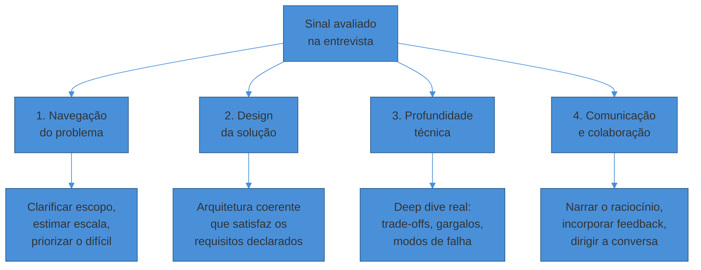
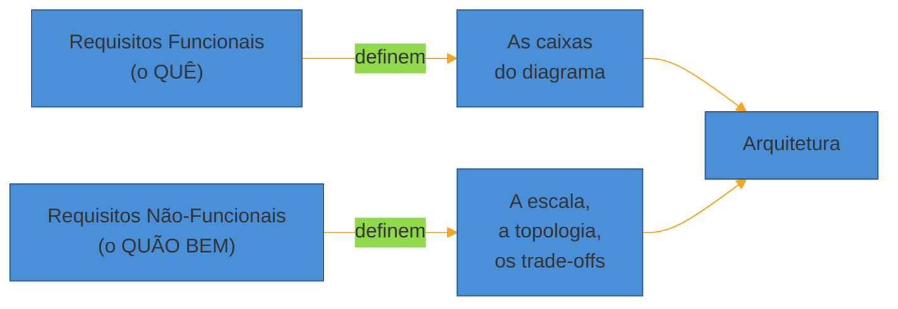
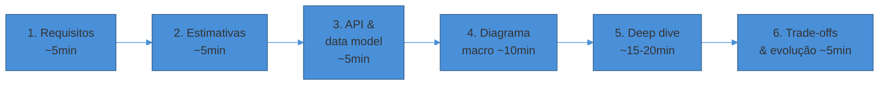

# O que é System Design e o que a entrevista avalia

> [!abstract] TL;DR
> A entrevista de **system design** não pede *a arquitetura certa* — ela não existe. Pede que você **navegue um problema aberto sob restrições**, **justifique cada escolha por um trade-off** e **conduza a conversa em voz alta**. O sinal avaliado se organiza em quatro eixos: navegação do problema, design da solução, profundidade técnica e comunicação. A diferença entre júnior e sênior não é conhecer mais componentes — é **dirigir a conversa** e trocar "eu usaria um cache" por "eu usaria cache-aside aqui porque a carga é 95% leitura e tolero staleness de alguns segundos". A primeira lente para tudo isso são os **requisitos**: separar o funcional (o que o sistema faz) do não-funcional (quão rápido, quão disponível, quão consistente) antes de desenhar qualquer caixa.

Um engenheiro staff — anos de experiência, currículo forte — entra na sala de system design. O entrevistador pede: "desenhe o Twitter".

Ele começa bem. Caixas para o serviço de tweets, um banco, um cache, um load balancer, uma fila para o fan-out do feed. Tudo tecnicamente correto. Ele preenche o quadro com uma arquitetura que funcionaria.

E foi **reprovado**.

Por quê? Porque durante 45 minutos ele **descreveu componentes e nunca discutiu um único trade-off**. Nunca disse "eu poderia fazer fan-out na escrita ou na leitura". Nunca disse "vou escolher na escrita porque o sistema é read-heavy, mas isso quebra para celebridades com 100M seguidores, então para esses casos eu faço híbrido". Ele entregou *uma* resposta como se fosse *a* resposta.

E system design não avalia se você conhece a resposta — porque **não há uma**. Avalia como você raciocina quando não há.

Essa é a inversão mental mais difícil para quem vem de entrevistas de algoritmo. Em coding, existe a solução ótima: `O(n log n)` bate `O(n²)`, ponto final. Em system design, "melhor" só existe *em relação a restrições que você mesmo precisa arrancar do entrevistador*.

Trocar um banco relacional por um NoSQL não é certo nem errado no vácuo. É certo se o padrão de acesso é chave-valor de alta escala e você aceita consistência eventual. É errado se você precisa de transações multi-tabela com garantias ACID. A mesma decisão, avaliada de formas opostas, dependendo do contexto que *você* estabeleceu.

## Não é a resposta certa — é a conversa

A frase que mais se repete entre entrevistadores experientes é: **system design não é uma competição, é uma conversa**. Isso não é gentileza corporativa — é uma descrição precisa do que está sendo medido.

Numa prova, você produz um artefato final e é julgado por ele. Numa conversa de design, o *artefato* — o diagrama no quadro — é quase um subproduto. O que é julgado é o **processo de pensamento que o gerou**, tornado visível pela sua fala.

Dois candidatos podem terminar com diagramas idênticos e receber avaliações opostas. Um narrou o raciocínio, expôs alternativas e explicou por que descartou cada uma. O outro desenhou em silêncio e apresentou o resultado pronto.

O primeiro mostrou como pensa sob incerteza. O segundo mostrou só que decorou uma arquitetura de referência. A entrevista foi desenhada para separar exatamente esses dois.

> [!question]- Se não há resposta certa, como o entrevistador decide se passei?
> Ele não compara seu diagrama a um gabarito. Ele preenche uma **rubrica** — um conjunto de eixos de avaliação — observando *comportamentos* ao longo da conversa. Você fez as perguntas de escopo certas? Suas estimativas eram defensáveis? Você identificou o componente mais difícil e foi fundo nele, em vez de gastar tempo no trivial? Quando ele apontou uma falha ("e se esse nó cair?"), você tratou como colaboração ou como ataque? Cada um desses momentos é um ponto de dado. O diagrama final importa muito menos do que a trilha de decisões que levou até ele.

Em uma frase: **o quadro branco registra o que você decidiu; sua voz é onde você prova que sabia por quê.**

## Os quatro eixos que a entrevista avalia

As rubricas de empresas diferentes usam nomes distintos, mas convergem em quatro dimensões. Vale conhecê-las porque elas dizem, literalmente, onde alocar sua energia nos 45 minutos.

**1. Navegação do problema.** Você recebe um enunciado vago de propósito: "projete um encurtador de URL". O primeiro sinal é se você *estreita* esse problema antes de atacá-lo.

Quantos usuários? Leitura ou escrita dominante? Precisa de analytics? Um candidato fraco começa a desenhar imediatamente. Um forte gasta os primeiros minutos transformando "projete o Twitter" em "projete um sistema de 200M usuários diários, read-heavy 100:1, com feed em até 2s e tolerância a staleness de segundos".

**2. Design da solução.** Aqui entra a arquitetura em si — as caixas e setas. Mas o que é avaliado não é a existência dos componentes, e sim a **coerência com os requisitos que você declarou**.

Se você disse "precisa de consistência forte" e depois desenhou um banco com replicação assíncrona sem comentar a contradição, perdeu ponto. A solução tem que *responder* aos requisitos, não apenas existir ao lado deles.

**3. Profundidade técnica.** Nenhuma entrevista cabe o sistema inteiro em detalhe. O entrevistador vai pedir — ou esperar que você proponha — um **deep dive**: escolher 1 ou 2 componentes e ir fundo.

Como o cache lida com stampede? Como o sharding evita hot spots? O que acontece quando a fila enche? É onde a senioridade fica mais visível, porque exige conhecer os *modos de falha*, não só o caminho feliz.

**4. Comunicação e colaboração.** O eixo que reprovou o staff engineer da abertura. Inclui narrar o pensamento, expor alternativas e — crucialmente — tratar o feedback do entrevistador como um colega tratando, não como um juiz atacando.

Quando ele diz "esse componente não vira gargalo?", a resposta certa não é defender cegamente nem capitular na hora. É *pensar junto*: "boa — deixa eu estimar a carga nele... é, a 50k req/s isso satura; eu colocaria uma camada de cache na frente ou sharding por user_id".

## O que o entrevistador realmente anota

Ajuda desmistificar o outro lado do quadro. O entrevistador não está formando uma impressão vaga — na maioria das big techs, ele preenche um **scorecard** com sinais concretos por dimensão. Conhecer os *green flags* e *red flags* te diz que comportamentos cultivar e quais evitar.

| Dimensão | Green flag (sobe seu nível) | Red flag (derruba) |
|----------|------------------------------|--------------------|
| Navegação | Estreita o escopo com perguntas cirúrgicas | Aceita o enunciado e desenha na hora |
| Estimativas | Números defensáveis que guiam decisões | Chuta ou pula estimativa "para ganhar tempo" |
| Design | Cada componente amarrado a um requisito | Componentes soltos, sem porquê |
| Profundidade | Vai fundo no ponto mais difícil, com falhas | Fica no alto nível o tempo todo |
| Trade-offs | Antecipa alternativas e escolhe com critério | Só menciona trade-off quando cutucado |
| Comunicação | Dirige a conversa, pensa em voz alta | Silêncios longos; defensivo ao feedback |

Repare que **conhecimento cru quase não aparece na coluna verde**. Ninguém marca ponto por "citou o teorema CAP". Marca por "usou o CAP para justificar por que, sob partição, esse serviço prioriza disponibilidade sobre consistência". O sinal é sempre *aplicação sob restrição*, nunca recitação.

> [!question]- Preciso decorar arquiteturas de referência (Twitter, Uber) para passar?
> Conhecer os designs clássicos ajuda — eles são o vocabulário compartilhado. Mas decorá-los é uma armadilha: se você despejar a arquitetura de referência do Twitter sem amarrá-la aos requisitos *desta* conversa, cai direto no red flag "componentes sem porquê". O valor de estudar os walkthroughs (fase Magus deste galho) não é ter respostas prontas — é reconhecer *padrões* que você recombina sob as restrições novas que o entrevistador te der. Decorar é frágil; reconhecer padrões é robusto.

## A rubrica: júnior vs sênior

A mesma pergunta ("projete o Twitter") é feita para um júnior e para um staff. O que muda não é a pergunta — é a **barra**. E a diferença quase nunca está em *saber mais componentes*; está em profundidade, iniciativa e trade-offs.

| Dimensão | Júnior (sinal esperado) | Sênior / Staff (sinal esperado) |
|----------|-------------------------|---------------------------------|
| Quem dirige | O entrevistador guia; o candidato responde | O candidato dirige; o entrevistador só cutuca |
| Building blocks | Reconhece e usa (DB, cache, LB, fila) | Usa e **justifica cada um por um trade-off** |
| Trade-offs | Menciona quando perguntado | Antecipa; expõe alternativas e o critério de escolha |
| Escopo | Aceita o enunciado como veio | Estreita o problema e negocia o que fica de fora |
| Falhas | Foca no caminho feliz | Traz modos de falha, degradação, operação (deploy, monitoring) |
| Profundidade | Alto nível consistente | Vai fundo no componente mais difícil, com números |

> [!warning] O erro que reprova sêniores: descrever sem justificar
> **O que acontece:** o candidato preenche um diagrama competente, mas cada componente aparece sem um "porquê". Cache, banco, fila — tudo presente, nada justificado.
> **Por quê:** descrever componentes prova que você *já viu* uma arquitetura de referência; não prova que você sabe *escolher* sob restrições. A entrevista mede a segunda coisa.
> **Como evitar:** para cada caixa que você desenhar, diga em voz alta a alternativa que rejeitou e o trade-off que decidiu. "Cache aqui — alternativa era ler direto do banco, mas a 100:1 de leitura o banco vira gargalo; aceito staleness de segundos, então cache-aside serve."

O corolário prático: numa entrevista sênior, **é bom sinal você falar mais que o entrevistador**. No júnior, espera-se que ele guie. Conforme o nível sobe, a expectativa se inverte — quem lidera a conversa é você. Ficar esperando ser perguntado, num nível sênior, já é um sinal fraco.

## Os arquétipos de pergunta

Nem toda pergunta de system design é "projete o X do zero". Reconhecer o arquétipo te diz onde a dificuldade vai morar.

**Design from scratch** ("projete um encurtador de URL"). O mais comum. A dificuldade está em navegar o espaço aberto: escopo, estimativas, escolher uma topologia coerente. É o arquétipo que este sub-galho detalha passo a passo.

**Evolua um sistema** ("você tem um monólito servindo 10k usuários; agora são 10M — o que muda?"). Aqui a habilidade avaliada é *identificar o próximo gargalo* e atacá-lo sem reescrever tudo. Testa maturidade: você entende que arquitetura é evolutiva, não um big bang.

**Troubleshoot / deep dive** ("o p99 de latência dobrou na última semana; como você investiga?"). Menos desenho, mais raciocínio de operação. Testa se você sabe onde os sistemas quebram na vida real — o tipo de sinal que só quem operou produção tem.

Em uma frase: **saber o arquétipo antes de responder evita que você desenhe do zero um sistema que a pergunta só pedia para evoluir.**

## A primeira lente: requisitos funcionais vs não-funcionais

Antes de qualquer caixa no quadro, existe um passo que separa quem tem método de quem improvisa: **arrancar e classificar os requisitos**. E a classificação que importa é funcional vs não-funcional.

- **Requisito funcional (RF):** *o que* o sistema faz — as capacidades observáveis. "Usuário encurta uma URL." "Usuário posta um tweet." "Seguidores veem o post no feed." São verbos, features.
- **Requisito não-funcional (RNF):** *quão bem* o sistema faz — as qualidades sob as quais as features operam. Latência ("feed carrega em <2s"), disponibilidade ("99,9%"), consistência ("vejo meu próprio tweet na hora, mas tolero atraso para seguidores"), escala ("200M DAU"), durabilidade ("nunca perder um tweet publicado").

Por que essa separação é a lente-mestra? Porque **os RFs definem o que você desenha, mas os RNFs definem como você desenha**.

A mesma feature "postar um tweet" gera arquiteturas radicalmente diferentes conforme o RNF. Se são 1000 usuários, um Postgres e um app server resolvem. Se são 200 milhões com feed em 2s, você precisa de fan-out, cache de timeline, sharding e filas.

O RF é idêntico nos dois casos. O RNF é que explode a complexidade — e é exatamente onde os pontos da entrevista são ganhos.

> [!question]- Por que gastar tempo com requisitos em vez de ir logo desenhar?
> Porque desenhar sem requisitos é resolver um problema que ninguém fez. Se você não fixou "consistência forte ou eventual?", toda escolha de banco à frente fica sem critério — e o entrevistador vê que você está chutando. Os requisitos são o *contrato* contra o qual cada decisão posterior será justificada. Sem eles, você não tem como dizer "escolhi X porque o requisito Y" — e "porque o requisito Y" é precisamente a frase que a rubrica está esperando ouvir. Dois a três minutos aqui rendem os 40 minutos seguintes.

Em uma frase: **requisitos funcionais dizem o que construir; requisitos não-funcionais dizem por que sua arquitetura precisa ser complicada — e é aí que moram os pontos.**

## O framework em seis passos: o mapa dos próximos 45 minutos

Se system design não tem resposta certa, o que impede a entrevista de virar caos? Um **framework** — uma sequência de passos que dá estrutura à conversa e garante que você toque cada eixo da rubrica no tempo certo.

A maioria dos guias converge em seis passos, e este sub-galho dedica uma nota a cada um. Aqui está o mapa, com o orçamento de tempo típico de uma entrevista de 45 minutos:

| # | Passo | Tempo | O que você produz | Nota |
|---|-------|-------|-------------------|------|
| 1 | Clarificar requisitos | ~5 min | RFs, RNFs e escopo negociado | [[02 - Clarificar requisitos]] |
| 2 | Estimativas de escala | ~5 min | QPS, storage, banda — os números que guiam o design | [[03 - Estimativas de escala (back-of-envelope)]] |
| 3 | API design & data model | ~5 min | contratos dos endpoints e esboço do modelo de dados | [[04 - API design e data model na entrevista]] |
| 4 | Diagrama de alto nível | ~10 min | a arquitetura macro: as caixas e o fluxo | [[05 - Do diagrama macro ao deep dive e trade-offs]] |
| 5 | Deep dive | ~15-20 min | 1-2 componentes destrinchados: falhas, gargalos, escolhas | [[05 - Do diagrama macro ao deep dive e trade-offs]] |
| 6 | Trade-offs & evolução | ~5 min | pontos fracos assumidos e como o sistema evolui | [[05 - Do diagrama macro ao deep dive e trade-offs]] |

Repare no formato de ampulheta. O tempo *abre* nos requisitos (largo, exploratório), *estreita* no diagrama macro (uma visão consolidada), e *reabre* no deep dive (fundo em pouca coisa).

O erro clássico de gestão de tempo é gastar 25 minutos desenhando um diagrama macro cada vez mais detalhado e nunca chegar ao deep dive — que é justamente onde a profundidade técnica é medida. O framework existe para te proteger disso: ele reserva o maior bloco de tempo para o lugar onde os pontos de senioridade são ganhos.

> [!question]- E se eu não terminar todos os seis passos no tempo?
> Terminar todos com pouca profundidade é pior do que fazer quatro com profundidade real. O framework não é uma checklist a cumprir — é uma alocação de atenção. Se o entrevistador te levar fundo em um deep dive e o relógio apertar, é **melhor** ter explorado dois componentes a sério do que ter desenhado o sistema inteiro em nível de superfície. Sinalize a gestão de tempo em voz alta ("vou pular o detalhe de auth para gastar o tempo no fan-out, que é a parte difícil aqui") — isso, por si só, é sinal de senioridade: você está priorizando conscientemente.

Cada passo tem sua própria nota neste sub-galho, mas todos herdam a mesma regra desta nota-mãe: **cada decisão em cada passo se justifica por um requisito ou um trade-off** — nunca "porque sim".

## Um exemplo trabalhado: a mesma pergunta, duas conduções

Para tornar concreto, veja "projete um encurtador de URL" conduzido de duas formas.

**Condução fraca (só componentes):**

> "Ok, encurtador de URL. Vou ter um serviço web, um banco para guardar o mapeamento código→URL, um cache na frente para as leituras, e um load balancer. O usuário manda a URL longa, eu gero um código, salvo no banco. Quando alguém acessa o código, eu busco a URL e redireciono."

Está tudo certo. E é insuficiente — porque poderia ter sido copiado de qualquer tutorial. Zero requisitos, zero trade-offs, zero números.

**Condução forte (mesma arquitetura, raciocínio visível):**

> "Antes de desenhar: quantos usuários? Vamos assumir 100M URLs novas por mês. Isso é ~40 escritas/s em média, mas leitura domina — encurtadores são tipicamente 100:1 leitura/escrita, então ~4000 leituras/s. Requisito de latência: redirect tem que ser rápido, digamos <100ms p99. Consistência pode ser eventual — se uma URL recém-criada leva 1s para propagar, ninguém morre.
>
> Com isso: o mapeamento código→URL é um acesso puro por chave, read-heavy — isso grita **chave-valor + cache agressivo**, não um relacional. Vou gerar o código com base62 de um contador ou hash; se hash, preciso tratar colisão. O cache absorve as leituras quentes; o banco é a fonte de verdade. Load balancer distribui os app servers, que são stateless. O deep dive interessante aqui é a geração de código sem colisão em escala — quer que eu vá fundo nisso?"

A arquitetura final é quase a mesma. Mas a segunda condução tocou os quatro eixos da rubrica em um parágrafo: navegou o problema (estimativas, requisitos), justificou o design (KV por causa do padrão de acesso), sinalizou profundidade (colisão de código) e dirigiu a conversa (ofereceu o próximo passo).

É essa a diferença que a nota inteira está tentando nomear.

## Como recuperar quando você trava

Vai acontecer: em algum momento você fica sem saber o próximo passo. Travar não te reprova — *como você reage a travar* é que é medido, e há saídas estruturadas.

**Volte aos requisitos.** Nove em dez travadas somem quando você relê os RNFs em voz alta. "Deixa eu revisitar: preciso de <2s e tolero staleness — então aqui eu posso cachear agressivo." Os requisitos são a bússola quando o mapa some.

**Estime para decidir.** Quando estiver entre duas opções e não souber qual, *calcule*. "SQL ou NoSQL aqui? Deixa eu ver a carga: 4000 leituras/s por chave, sem joins... NoSQL." O número decide por você e mostra método.

**Pense em voz alta a incerteza.** "Não tenho certeza se replicação síncrona vale o custo de latência aqui — deixa eu pesar os dois lados." Admitir incerteza e raciocinar sobre ela é *green flag*, não fraqueza. Fingir certeza que você não tem é o oposto.

## Armadilhas comuns

> [!warning] Começar a desenhar antes de clarificar
> **O que acontece:** o candidato ouve "projete o X" e imediatamente desenha caixas.
> **Por quê:** ansiedade de "mostrar serviço" e o hábito de coding, onde você ataca o problema direto.
> **Como evitar:** os primeiros 5 minutos são para *perguntas*, não desenho. Escopo e requisitos vêm antes da primeira caixa — sempre.

> [!warning] Tratar o feedback do entrevistador como ataque
> **O que acontece:** o entrevistador aponta uma fraqueza e o candidato fica defensivo ou congela.
> **Por quê:** interpreta a entrevista como julgamento adversarial, não como colaboração.
> **Como evitar:** cada cutucada é um convite para pensar junto. "Boa pergunta — deixa eu estimar a carga nesse nó e ver se satura." O entrevistador está testando exatamente como você reage a pressão colaborativa.

> [!warning] Otimização prematura de escala
> **O que acontece:** o candidato começa com Kafka, sharding e multi-região para um sistema de 1000 usuários.
> **Por quê:** confunde "conhecer tecnologias avançadas" com "senioridade".
> **Como evitar:** projete para os requisitos *declarados*, não para um Google imaginário. Senioridade é também saber quando *não* complicar. Comece simples; escale quando o número justificar.

> [!warning] Ficar no alto nível o tempo todo
> **O que acontece:** o candidato mantém tudo em nível de caixas e setas e nunca desce em nenhum componente.
> **Por quê:** medo de errar no detalhe, ou não ter profundidade real em nada.
> **Como evitar:** escolha *você* o componente mais difícil e mergulhe antes que peçam. É onde o eixo "profundidade técnica" é pontuado — e o alto nível sozinho é indistinguível de decorar um diagrama.

## Como explicar em inglês

A system design interview doesn't test whether you know *the* right architecture — there isn't one. It tests how you reason about an open-ended problem under constraints.

Interviewers evaluate four things: how you navigate the problem (scoping and estimation), whether your design actually satisfies the requirements you stated, how deep you can go on the hardest component, and how you communicate and collaborate. The classic failure mode, even for senior engineers, is describing components without ever justifying a single trade-off.

The first move is always requirements: separate **functional** requirements (what the system does) from **non-functional** ones (latency, availability, consistency, scale). Functional requirements define the boxes; non-functional requirements define why the architecture has to be complex — and that's where the points are.

> "I'd start by clarifying scope and requirements before drawing anything. What's our expected scale? Is this read-heavy or write-heavy? What are the latency and consistency requirements? Because those non-functional requirements are what actually drive the architecture — the features are the easy part."

| PT | EN |
|----|----|
| Requisito funcional | Functional requirement |
| Requisito não-funcional | Non-functional requirement |
| Trade-off / compromisso | Trade-off |
| Escopo | Scope |
| Estimativa de ordem de grandeza | Back-of-the-envelope estimate |
| Aprofundamento (num componente) | Deep dive |
| Gargalo | Bottleneck |
| Modo de falha | Failure mode |
| Dirigir a conversa | Drive the conversation |
| Read-heavy / write-heavy | Read-heavy / write-heavy |
| Consistência eventual | Eventual consistency |
| Sinal (numa rubrica) | Signal |

## O que vem a seguir

Toda a rubrica desta nota gira em torno de um primeiro passo que ainda não detalhamos: **arrancar os requisitos certos**. Vimos *que* eles são a lente-mestra; a próxima nota mostra *como* extraí-los — quais perguntas fazer, como separar funcional de não-funcional na prática, e como negociar o que fica de fora do escopo para caber nos 45 minutos.

- [[02 - Clarificar requisitos]] — as perguntas de escopo que transformam um enunciado vago em um problema resolvível
- [[03 - Estimativas de escala (back-of-envelope)]] — traduzir os requisitos em números defensáveis (QPS, storage, banda)

## Veja também

- [[System Design/index|System Design]] — o galho-pai e o mapa da trilha
- [[Arquitetura de Software]] — os estilos e padrões arquiteturais por trás das caixas (Hexagonal, DDD, microserviços)
- [[Event Storming]] — modelagem de domínio, quando o problema é entender o negócio antes de escalar
- [[05 - Do diagrama macro ao deep dive e trade-offs]] — como conduzir os 45 minutos de ponta a ponta

## Fontes

- **Alex Xu** — *System Design Interview – An Insider's Guide, Vol. 1* (cap. 1 e 3) — o framework de 4 passos e a lógica de estimativas; referência padrão para entrevista.
- **Hello Interview** — [*System Design in a Hurry — Delivery*](https://www.hellointerview.com/learn/system-design/in-a-hurry/introduction) — como o *delivery* (condução/comunicação) é pontuado; fonte moderna (2024+) de ex-entrevistadores FAANG.
- **Exponent** — [*Rubric for System Design Interviews*](https://www.tryexponent.com/courses/system-design-interviews/system-design-interview-rubric) — os eixos concretos da rubrica de avaliação.
- **interviewing.io** — [*A Senior Engineer's Guide to the System Design Interview*](https://interviewing.io/guides/system-design-interview) — expectativas por nível e a diferença júnior/sênior.
- **Donne Martin** — [*System Design Primer*](https://github.com/donnemartin/system-design-primer) — referência aberta abrangente; ótima para o vocabulário de building blocks.
