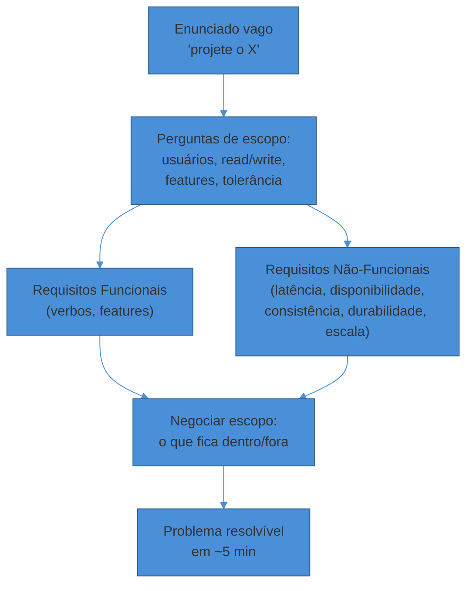

# Clarificar requisitos

> [!abstract] TL;DR
> "Projete o Twitter" não é um problema — é um convite para você *construir* um problema. Os primeiros ~5 minutos da entrevista servem para transformar esse enunciado vago num escopo resolvível, através de um banco de perguntas sobre usuários, escala e padrão de acesso. O produto desses minutos são duas listas: **requisitos funcionais** (o que o sistema faz) e **requisitos não-funcionais** (quão bem ele faz — latência, disponibilidade, consistência, durabilidade, escala). Fixar os RNFs cedo é o que dá critério a toda escolha de arquitetura que vem depois; sem eles, cada decisão de design vira um chute.

Um candidato ouve: "projete um encurtador de URL, tipo bit.ly." Ele agradece a clareza aparente e começa a desenhar: serviço web, banco, cache, load balancer.

Cinco minutos depois o entrevistador pergunta: "e quantas URLs por segundo você espera?" Silêncio. "É read-heavy ou write-heavy?" Mais silêncio. "As URLs precisam expirar?" O candidato começa a redesenhar do zero, porque cada resposta muda o problema que ele estava resolvendo.

Esse candidato não errou de arquitetura. Errou de **ordem**: desenhou antes de saber o que estava desenhando.

"Projete um encurtador de URL" não é uma especificação — é um convite. O enunciado real da entrevista nunca aparece na pergunta; ele é *construído* nos primeiros minutos, por você, através de perguntas. Quem pula essa etapa está resolvendo um problema que ninguém pediu.

## Por que negociar o escopo é o primeiro trabalho

Pense no enunciado de system design como uma versão comprimida de um brief de produto real. Quando um PM pede "constrói um sistema de notificações", ele não escreveu um documento de requisitos — ele descreveu uma dor. Cabe ao engenheiro extrair o problema de verdade.

A entrevista simula exatamente essa dinâmica. O entrevistador interpreta o papel do cliente vago; você interpreta o engenheiro que precisa de especificação antes de comprometer trabalho. Uma forma útil de pensar nisso: você está conversando com um PM, não com um professor que já sabe a resposta e espera que você adivinhe.

Um jeito prático de estruturar essa conversa é pensar nos **objetos de negócio principais** do sistema e nas relações entre eles. Num encurtador de URL, os objetos são `URL longa` e `URL curta`; a relação é o mapeamento entre os dois. Num Twitter, os objetos são `Conta` e `Tweet`; as relações são conta-tweet (postar), conta-conta (seguir) e tweet-tweet (retweet, resposta). Cada relação sugere um caso de uso — e cada caso de uso é candidato a entrar ou não no escopo.

> [!question]- Por que não aceitar o enunciado como veio e ganhar tempo de desenho?
> Porque "ganhar tempo" desenhando sem escopo é gastar tempo desenhando o sistema errado. Se você não sabe se o sistema precisa suportar anexos de vídeo ou só texto, qualquer decisão de storage que você tomar agora tem 50% de chance de estar resolvendo o problema errado — e vai precisar ser refeita na frente do entrevistador, o que parece pior do que ter perguntado. A pergunta de escopo não atrasa a entrevista: ela evita retrabalho visível, que é o que realmente consome os 45 minutos.

## O banco de perguntas de escopo

Não existe uma lista universal — o que existe é um roteiro de categorias que cobre a maioria dos enunciados. Pense nele como um checklist mental, não um script decorado.

**Quem usa o sistema, e quantos?** "Quantos usuários ativos por dia?" "É B2C de massa ou B2B com poucos clientes grandes?" A resposta muda ordens de grandeza — 10 mil usuários e 200 milhões pedem arquiteturas diferentes para a *mesma* feature.

**Read-heavy ou write-heavy?** Um encurtador de URL é lido muito mais do que é escrito (tipicamente 100:1). Um sistema de logging é o oposto — escreve-se o tempo todo, lê-se raramente. Essa proporção decide se você otimiza para cache agressivo ou para ingestão de escrita.

**Quais features entram no escopo, quais ficam de fora?** "Projete o Twitter" pode significar postar+ler feed, ou pode incluir DMs, trending topics, anúncios, analytics. Você não adivinha — você propõe um corte e confirma.

**Qual a tolerância a atraso e a erro?** Um usuário vê o próprio post na hora, ou tolera alguns segundos? Perder um post é aceitável, ou cada escrita precisa ser durável? Essas respostas alimentam diretamente os RNFs de consistência e durabilidade.

**Existe algum caso extremo que muda tudo?** Contas de celebridade com 100M seguidores quebram um design de fan-out ingênuo. Um vídeo viral quebra um CDN mal dimensionado. Perguntar sobre outliers cedo evita descobrir o problema difícil só no deep dive.

**Multi-região importa agora?** Para a maioria das entrevistas de 45 minutos, a resposta é "não, foque em uma região" — e isso é uma resposta válida que simplifica seu design. Perguntar e receber essa simplificação é tão valioso quanto perguntar e receber uma restrição.

> [!warning] Perguntar demais e nunca começar a desenhar
> **O que acontece:** o candidato interroga o entrevistador por 15 minutos, cobrindo cada detalhe possível, e chega ao diagrama com metade do tempo já gasto. **Por quê:** confunde "fazer perguntas de escopo" com "eliminar toda incerteza antes de agir" — mas a entrevista não recompensa isso, recompensa progresso visível. **Como evitar:** limite-se a 4-6 perguntas de alto impacto (escala, read/write, escopo de features, consistência) e trate o resto como suposição documentada em voz alta: "vou assumir que não precisamos de multi-região agora — me avisa se estiver errado."

## Separando RF de RNF na prática

A separação entre requisito funcional e não-funcional já apareceu na nota anterior como a lente-mestra do framework. Aqui é onde ela vira exercício prático — como você preenche as duas colunas em tempo real, durante a conversa.

**Requisito funcional (RF)** é sempre uma frase no formato "o usuário consegue [verbo]". "O usuário encurta uma URL longa." "O usuário posta uma mensagem num grupo." "O sistema redireciona um código curto para a URL original." Se a frase não tem um verbo de ação observável, provavelmente é um RNF disfarçado.

**Requisito não-funcional (RNF)** nunca é uma feature — é uma *qualidade* que a feature precisa ter. As cinco categorias que cobrem a maioria dos casos:

- **Latência** — quão rápido a operação responde. "Redirect em <100ms p99." "Feed carrega em <2s."
- **Disponibilidade** — a fração do tempo em que o sistema responde. "99,9%" (~8h/ano fora do ar) versus "99,99%" (~52min/ano) já é uma decisão de arquitetura, não um número decorativo.
- **Consistência** — o quão sincronizados os dados precisam estar entre réplicas. "Vejo meu próprio post na hora" (consistência de leitura-própria) é diferente de "todo mundo vê o mesmo feed instantaneamente" (consistência forte global) — a segunda é ordens de magnitude mais cara.
- **Durabilidade** — a garantia de que um dado escrito não se perde. Um tweet publicado não pode sumir; um rascunho não salvo pode.
- **Escala** — o volume que o sistema precisa suportar, normalmente expresso como usuários ativos, requisições por segundo ou volume de dados. Vira número concreto na próxima nota deste sub-galho — aqui ela só entra como categoria a fixar.

> [!question]- "Alta disponibilidade" não é óbvio que todo sistema quer? Por que perguntar?
> Porque "alta disponibilidade" sem número é uma frase de marketing, não um requisito. Todo sistema *quer* estar sempre no ar — a pergunta que importa é *quanto* isso vale comparado a outras qualidades, porque disponibilidade custa dinheiro e complexidade (réplicas, multi-AZ, failover automático). Dizer "99,9% de disponibilidade, priorizando disponibilidade sobre consistência sob partição de rede" é um requisito acionável — dá pra escolher arquitetura a partir dele. Dizer "precisa ser confiável" não dá pra escolher nada. A regra prática: se o RNF não tem um número ou uma prioridade explícita frente a outro RNF, ele ainda não está pronto para guiar design.

Um exercício útil para não confundir as duas colunas: pergunte-se "isso aparece no diagrama como uma caixa, ou como uma característica de várias caixas ao mesmo tempo?" "Postar um tweet" vira uma caixa (o serviço de escrita). "Latência <2s" não vira caixa nenhuma — ela pressiona *todas* as caixas do caminho de leitura a serem rápidas.

## Negociando o escopo para caber no tempo

Levantar requisitos sem cortar nada produz uma lista longa demais para 45 minutos. O passo que falta — e que candidatos juniores costumam pular — é **negociar** ativamente o que fica de fora.

Negociar não é perguntar "o que você quer?" e esperar passivamente. É **propor** um corte e pedir confirmação. A diferença é sutil, mas é exatamente o que separa navegação passiva de navegação ativa — o primeiro eixo da rubrica descrito na nota anterior.

Frase fraca: "quais features eu devo incluir?" — devolve o trabalho de escopo para o entrevistador.

Frase forte: "vou focar em postar um tweet e ler o feed de quem eu sigo; vou deixar notificações, DMs e busca fora do escopo, porque com 45 minutos não dá pra fazer os quatro bem. Faz sentido?"

A segunda frase faz três coisas ao mesmo tempo: mostra que você entende o tamanho real do problema, prioriza pelo que é central (o núcleo de um feed social é postar+ler), e dá ao entrevistador um gancho fácil para corrigir se sua leitura de prioridade estiver errada.

> [!warning] Aceitar escopo infinito para parecer ambicioso
> **O que acontece:** o candidato lista todas as features possíveis do sistema ("vou incluir posts, DMs, stories, live, ads, analytics...") para parecer completo. **Por quê:** confunde "cobrir tudo" com "mostrar competência" — mas cobrir tudo em superfície é o oposto do que a rubrica de profundidade técnica premia. **Como evitar:** proponha um núcleo pequeno e deixe explícito que o resto ficou de fora por decisão consciente, não por esquecimento. "Fora do escopo: X, Y, Z — posso voltar neles se sobrar tempo" é uma frase que sinaliza controle, não lacuna.

## Fixar RNFs cedo é o que dá critério depois

Aqui está o motivo pelo qual esses 5 minutos valem os 40 seguintes: **um RNF fixado é um critério de decisão reutilizável**. Sem ele, toda escolha de arquitetura vira debate de gosto pessoal — "eu prefiro NoSQL", "eu gosto de filas" — e debate de gosto não é o que a rubrica mede.

Compare as duas justificativas para a mesma escolha de banco:

Sem RNF fixado: "vou usar Cassandra porque é escalável." — Escalável comparado a quê? Escalável para qual carga? A frase não é falsa, mas também não decide nada; qualquer banco moderno "é escalável" em algum sentido.

Com RNF fixado: "definimos leitura 100:1 sobre escrita, acesso sempre por chave única, sem necessidade de joins, e consistência eventual é aceitável. Isso aponta para um key-value store como Cassandra ou DynamoDB, não para um relacional." — A escolha decorre logicamente do requisito. Se o entrevistador discordar de um RNF, ele discute o RNF — não vira uma discussão de preferência de tecnologia.

Esse é o mecanismo concreto por trás da frase "requisitos são o contrato contra o qual toda decisão futura se justifica", que a nota anterior introduziu. Aqui ela vira prática: cada vez que você escolher um componente no deep dive, a primeira frase deveria remeter a um RNF que você mesmo fixou nos primeiros 5 minutos.

Os RNFs também evitam o erro oposto — otimização prematura. Se ninguém pediu 99,99% de disponibilidade, você não precisa de multi-região com failover automático. Fixar o RNF em "99,9% basta" é uma decisão tão válida quanto fixá-lo em "99,99%" — e às vezes é a decisão mais sênior, porque reconhece quando *não* complicar.

> [!question]- E se o entrevistador não responder as perguntas com números — só disser "assuma o que for razoável"?
> Isso é comum e não é armadilha — é um convite para você exercitar julgamento e documentá-lo em voz alta. "Ok, vou assumir 50 milhões de usuários ativos diários, leitura dominante, disponibilidade acima de consistência forte, já que é uma rede social — me avisa se algum desses números estiver muito fora." Você continua tendo RNFs fixados; só que você mesmo os declarou, em vez de extraí-los por pergunta. O que a rubrica não perdoa é seguir sem fixar nada — nem perguntado, nem assumido.

## Exemplo trabalhado: aplicando o banco de perguntas a um encurtador de URL

Veja o banco de perguntas rodando numa transcrição plausível para "projete um encurtador de URL, tipo bit.ly".

> **Candidato:** "Antes de desenhar, deixa eu alinhar escopo. Primeiro, funcional: o sistema precisa gerar uma URL curta a partir de uma longa, e redirecionar quem acessa a URL curta de volta pra original. Preciso suportar URLs customizadas (tipo `bit.ly/meu-nome`) ou só geradas automaticamente?"
>
> **Entrevistador:** "Vamos manter só as geradas automaticamente por enquanto."
>
> **Candidato:** "Combinado — corto customização do escopo. Preciso de analytics de clique (quantas vezes cada link foi acessado)?"
>
> **Entrevistador:** "Sim, isso importa, mas pode ser aproximado — não precisa ser em tempo real."
>
> **Candidato:** "Ótimo, isso me dá liberdade pra processar analytics de forma assíncrona, sem impacto na latência do redirect. Agora escala: quantos usuários, quantos links por dia?"
>
> **Entrevistador:** "Assuma 100 milhões de links novos por mês."
>
> **Candidato:** "Isso é bem read-heavy — encurtadores tipicamente têm proporção de leitura pra escrita de 100:1, então vou assumir isso também, a menos que você tenha um número diferente."
>
> **Entrevistador:** "100:1 está bom."
>
> **Candidato:** "Então meus requisitos funcionais são: encurtar URL, redirecionar, registrar clique de forma assíncrona. Meus não-funcionais: alto volume de leitura (na casa de milhares de req/s, vou calcular exato na próxima etapa), redirect rápido — vou fixar <100ms p99 —, consistência eventual é aceitável tanto pro link recém-criado quanto pro contador de clique, e durabilidade alta pro mapeamento código→URL, porque perder um link quebra todo link já compartilhado publicamente. Escopo fechado: sem customização, sem analytics em tempo real, single-region. Posso seguir pras estimativas de escala?"

Repare no padrão: cada resposta do entrevistador vira, na mesma frase, ou um RF, ou um RNF, ou um corte de escopo — nunca fica solta. E a fala termina resumindo as duas listas em voz alta antes de avançar, o que dá ao entrevistador uma última chance de corrigir antes que qualquer caixa seja desenhada.

Esse resumo final também é o artefato que você vai carregar para a próxima etapa: as estimativas de escala (nota seguinte) traduzem exatamente esses RNFs — "read-heavy 100:1", "100M links/mês" — em números de QPS e armazenamento.

## Armadilhas comuns

> [!warning] Tratar RNF como frase solta, sem número
> **O que acontece:** o candidato diz "precisa ser rápido e escalável" e segue direto pro diagrama, sem nunca quantificar. **Por quê:** soa como requisito, mas não é acionável — "rápido" e "escalável" não decidem nenhuma escolha de arquitetura sozinhos. **Como evitar:** todo RNF citado precisa virar número (mesmo que aproximado) antes de você desenhar a primeira caixa. Se não tem número ainda, isso é trabalho pra próxima etapa — mas a *categoria* do RNF (latência, disponibilidade, consistência, durabilidade, escala) já deve estar nomeada aqui.

> [!warning] Levantar requisitos e nunca mais voltar a eles
> **O que acontece:** o candidato faz as perguntas certas nos primeiros minutos, mas no deep dive escolhe componentes sem citar o requisito que motivou a escolha. **Por quê:** trata "clarificar requisitos" como um ritual de abertura, não como uma ferramenta viva que deveria ser referenciada o tempo todo. **Como evitar:** cada escolha de arquitetura na frente do quadro deveria começar com "porque definimos X..." — retomando literalmente algo que você mesmo levantou nos primeiros 5 minutos. Se você não consegue amarrar uma escolha a um requisito, isso é sinal de que a escolha ainda não tem critério.

## Como explicar em inglês

The first five minutes of a system design interview aren't small talk — they're where you turn a vague prompt into a solvable problem. You do that by asking scoping questions and sorting the answers into two buckets: functional requirements (what the system does) and non-functional requirements (how well it needs to do it).

A good non-functional requirement always has a number attached — "low latency" is marketing language; "under 200ms p99 for the read path" is something you can design against. The scope negotiation matters just as much: propose a cut ("I'll focus on posting and reading the feed, and leave notifications out of scope") instead of asking the interviewer to define the whole problem for you.

> "Before I start designing, let me clarify scope. Functionally, users need to shorten a URL and get redirected when they access it — do we need custom aliases, or is auto-generated fine? For scale, are we read-heavy or write-heavy, and roughly how many requests per day? And for non-functionals — what's our latency target for the redirect, and is eventual consistency acceptable for a newly created link?"

| PT | EN |
|----|----|
| Requisito funcional | Functional requirement |
| Requisito não-funcional | Non-functional requirement |
| Escopo | Scope |
| Negociar o escopo | Negotiate / narrow the scope |
| Fora do escopo | Out of scope |
| Read-heavy / write-heavy | Read-heavy / write-heavy |
| Disponibilidade | Availability |
| Consistência eventual / forte | Eventual / strong consistency |
| Durabilidade | Durability |
| Latência | Latency |
| Caso extremo / outlier | Edge case |
| Suposição documentada | Documented assumption |

## O que vem a seguir

Ao final desta etapa você tem duas listas — RFs e RNFs — e um escopo negociado. Mas "read-heavy, alta disponibilidade, latência baixa" ainda são qualidades, não números. A próxima nota traduz cada RNF numa estimativa de ordem de grandeza: quantas requisições por segundo, quantos bytes de armazenamento, qual banda de rede — os números que efetivamente vão guiar cada escolha de componente no diagrama.

- [[03 - Estimativas de escala (back-of-envelope)]] — transformar "read-heavy" e "100M usuários" em QPS, storage e banda defensáveis

## Veja também

- [[01 - O que é System Design e o que a entrevista avalia]] — a rubrica completa e por que requisitos são a lente-mestra do framework
- [[System Design/index|System Design]] — o galho-pai e o mapa da trilha

## Fontes

- **Alex Xu** — *System Design Interview – An Insider's Guide, Vol. 1* — o passo "understand the problem and establish design scope" do framework de 4 etapas; ponto de partida canônico para separar funcional de não-funcional.
- **Hello Interview** — [*System Design Requirements Gathering*](https://www.hellointerview.com/blog/system-design-requirements) — o método de mapear objetos de negócio e suas relações para gerar perguntas de escopo; ênfase em RNFs sempre quantificados.
- **Hello Interview** — [*Delivery Framework — System Design in a Hurry*](https://www.hellointerview.com/learn/system-design/in-a-hurry/delivery) — como a negociação de escopo é avaliada dentro da rubrica de condução (delivery).
- **Donne Martin** — [*System Design Primer*](https://github.com/donnemartin/system-design-primer) — seção "Step 1: Outline use cases, constraints, and assumptions", vocabulário de referência aberta.
- **DEV Community (Fahim Ul Haq)** — [*Guide to nonfunctional requirements for System Design Interviews*](https://dev.to/fahimulhaq/guide-to-nonfunctional-requirements-for-system-design-interviews-4eje) — checklist de categorias de RNF (latência, disponibilidade, consistência, durabilidade, escala) e o erro comum de negligenciá-las.
