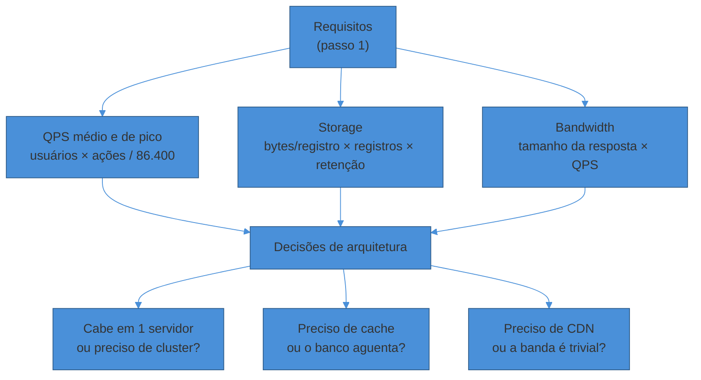
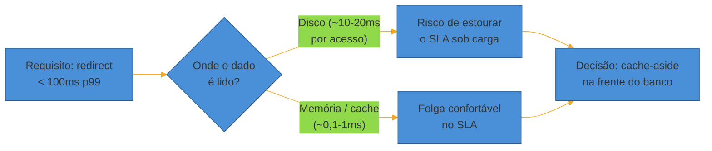

# Estimativas de escala (back-of-envelope)

> [!abstract] TL;DR
> Estimativas de escala traduzem requisitos em **números defensáveis** — QPS, storage, banda — em cerca de 5 minutos, sem calculadora e sem precisão de contador. O objetivo não é acertar o dígito exato; é acertar a **ordem de grandeza** que muda a decisão arquitetural: "isso cabe na memória de um único servidor ou preciso de um cluster distribuído?" A fórmula-mestra é QPS = usuários × ações por dia / 86.400, multiplicado por um fator de pico de 3-5x. Storage é bytes por registro × registros por dia × retenção. E a tabela de **latency numbers** (L1 cache a rede cross-region) é o que justifica, com números, decisões como "cache em memória" versus "ler do disco a cada request". Quem pula essa etapa acaba desenhando arquiteturas que ninguém pediu — ou, pior, que não aguentam a carga real.

Uma candidata está desenhando um encurtador de URL. Ela já clarificou os requisitos: leitura domina, latência de redirect tem que ser baixa, consistência pode ser eventual. Agora o entrevistador pergunta: "e qual a carga esperada?"

Ela hesita. "Bastante, eu acho. Bilhões de usuários, talvez."

O entrevistador insiste: "quantos requests por segundo, aproximadamente?"

Silêncio. Ela não tem um número — e sem número, a próxima pergunta ("você usaria um único banco ou sharding?") também não tem resposta defensável. Ela vai *chutar* a resposta em vez de *calculá-la*.

Compare com outra candidata, no mesmo ponto: "vamos assumir 500M usuários, 1% ativo por dia gerando um encurtamento — isso dá 5M escritas por dia, ou seja, ~58 QPS de escrita em média. Leitura é tipicamente 100:1 num encurtador, então ~5.800 QPS de leitura em média. No pico, multiplico por uns 3x: ~17.000 QPS de leitura. Isso já me diz que preciso de cache — um único Postgres não segura 17k reads/s sem ajuda."

A segunda candidata gastou 90 segundos. E esses 90 segundos **decidiram a arquitetura inteira** que vem a seguir: sem o número, "preciso de cache" é uma opinião; com o número, é uma conclusão.

## Por que estimar não é sobre precisão

A primeira coisa a desarmar é a ideia de que estimativa é matemática de verdade. Não é. É aritmética de cabeça, com arredondamentos generosos, feita para responder uma pergunta binária: **isso é pequeno, médio ou gigante?**

Ninguém, em uma entrevista, vai te cobrar o QPS exato com duas casas decimais. O que é cobrado é se você sabe *transformar* um requisito vago ("bastante usuários") em um número que **muda uma decisão concreta**.

Um exemplo simples: se o dataset inteiro do seu sistema cabe em 4 GB, ele cabe **inteiro na RAM** de uma instância comum de cloud. Se são 4 TB, não cabe — e a conversa vira sobre particionamento, cache parcial, ou um banco especializado. A diferença entre essas duas conversas não é "matemática precisa"; é **a ordem de grandeza**.

> [!question]- Se é só ordem de grandeza, por que arredondar errado (pra cima ou pra baixo) importa?
> Porque um erro de ordem de grandeza — confundir mil com um milhão — te leva pra decisão *errada*, não só pra um número impreciso. Se você estima 1.000 QPS quando a carga real é 100.000 QPS, você desenha um sistema que desmorona no primeiro pico de tráfego real. Erros dentro da mesma ordem de grandeza (17.000 vs 20.000) são inofensivos — a decisão arquitetural é a mesma. Errar a ordem de grandeza é o único erro que realmente custa caro aqui.

Em uma frase: **você não está calculando uma resposta — está calibrando qual pergunta arquitetural fazer a seguir.**

## QPS: da população de usuários ao número de requests

QPS (*queries per second*) é o primeiro número que quase toda entrevista pede, porque ele guia decisões de load balancing, número de instâncias e se um banco único aguenta a carga.

A fórmula parte do requisito de escala que você já arrancou no passo 1 ([[02 - Clarificar requisitos]]):

```
QPS médio = (usuários ativos por dia × ações por usuário por dia) / 86.400
```

O `86.400` é o número de segundos em um dia (24 × 60 × 60) — vale decorar, porque ele aparece em toda estimativa de tráfego diário.

**Exemplo mínimo:** 10 milhões de usuários ativos por dia (DAU), cada um faz 2 ações relevantes (ex.: 2 posts). São 20 milhões de ações/dia.

```
QPS médio = 20.000.000 / 86.400 ≈ 231 QPS
```

Só que tráfego real **não é uniforme ao longo do dia**. Ninguém posta às 4h da manhã na mesma taxa que às 20h. Por isso, o número que importa para dimensionar capacidade não é a média — é o **pico**.

### O fator de pico (peak factor)

A prática comum é multiplicar o QPS médio por um **fator de pico entre 3x e 5x**, dependendo do quão "bursty" (irregular) é o padrão de uso do produto.

```
QPS de pico = QPS médio × fator de pico (3-5)
```

No exemplo acima: `231 × 4 ≈ 924 QPS de pico`. É esse número — não o médio — que você usa para decidir quantas instâncias, se precisa de cache, se um único banco aguenta.

> [!question]- De onde vem o 3-5x? É um número mágico?
> É uma heurística, não uma lei física — mas não é arbitrária. Ela vem da observação empírica de que tráfego web segue um padrão diurno (mais uso de dia, menos de madrugada) somado a eventos de pico (lançamentos, breaking news, horário de almoço). Produtos com uso muito concentrado num evento específico (ex.: venda de ingressos, Black Friday) podem ter fatores de pico de 10x ou mais — nesse caso, diga isso em voz alta: "esse é um sistema com pico extremo tipo Black Friday, vou usar um fator de 10x, não o 3-5x padrão". O importante é *nomear* a heurística e ajustá-la ao domínio, não aplicá-la cegamente.

Repare que o *raciocínio* importa mais que o número exato de fator. Dizer "vou usar 4x porque não é um produto com picos extremos tipo ticketing" já é sinal de senioridade — porque mostra que você está calibrando a heurística ao contexto, não recitando ela.

## Storage: do registro individual ao volume total

Depois do QPS, o segundo número mais pedido é **quanto espaço em disco** o sistema vai consumir — porque ele decide se um banco relacional simples resolve ou se você precisa de object storage / particionamento desde o início.

A fórmula segue a mesma lógica de decompor em fatores pequenos:

```
Storage = tamanho médio por registro × registros novos por dia × dias de retenção
```

**Exemplo:** um sistema de encurtamento de URL grava, por registro, um código curto (~8 bytes), a URL original (~500 bytes em média) e metadados (timestamp, user_id, contadores — ~50 bytes). Total: ~560 bytes/registro. Arredonde para **~600 bytes/registro** — arredondar para cima é seguro em estimativas.

Se são 5 milhões de novas URLs por dia e você precisa reter os dados por 5 anos (~1.825 dias):

```
Storage total = 600 bytes × 5.000.000 × 1.825 ≈ 5,48 × 10^12 bytes ≈ 5,5 TB
```

5,5 TB é um número que **cabe tranquilamente** num único banco moderno com replicação — não precisa de sharding motivado por volume (pode precisar por QPS, que é uma decisão diferente). Esse é exatamente o tipo de conclusão que a estimativa existe para produzir.

### Bandwidth: o custo de mover os dados

Bandwidth (banda) estima quantos bytes por segundo trafegam pela rede — relevante para decidir se você precisa de CDN, compressão, ou paginação agressiva.

```
Bandwidth = tamanho médio da resposta × QPS
```

No mesmo exemplo, se cada leitura de redirect devolve ~600 bytes e o QPS de pico de leitura é 17.000:

```
Bandwidth de leitura ≈ 600 bytes × 17.000 ≈ 10,2 MB/s
```

10 MB/s é trivial para qualquer infraestrutura moderna — não motiva CDN por si só. Mas se a resposta fosse uma imagem de 2 MB em vez de 600 bytes, o mesmo QPS geraria **34 GB/s** — aí sim CDN e otimização de payload entram na conversa. O número, de novo, é o que decide, não a intuição.

> [!warning] Chutar o tamanho do registro sem justificar
> **O que acontece:** o candidato diz "vou assumir 1 KB por registro" sem explicar de onde tirou o número. **Por quê:** parece arbitrário — e é, se não for decomposto. O entrevistador não está testando se você acertou o byte exato; está testando se você sabe *decompor* um registro nos seus campos. **Como evitar:** sempre decomponha: "o registro tem um ID (8 bytes), a URL (~500 bytes), timestamp (8 bytes) e um contador de cliques (4 bytes) — total ~520 bytes, arredondo para 600". Isso transforma um chute em uma estimativa auditável.

## Powers of two: a tabela para fazer conta de cabeça

Estimativas de storage e bandwidth exigem trocar entre KB, MB, GB e TB rapidamente, sem calculadora. Ter as potências de 2 na ponta da língua evita travar no meio de uma conta simples.

| Unidade | Potência de 2 | Valor aproximado | Regra de bolso |
|---------|----------------|-------------------|-----------------|
| 1 KB | 2^10 | 1.024 bytes | ~10^3 |
| 1 MB | 2^20 | 1.048.576 bytes | ~10^6 (1 milhão) |
| 1 GB | 2^30 | ~1,07 × 10^9 bytes | ~10^9 (1 bilhão) |
| 1 TB | 2^40 | ~1,1 × 10^12 bytes | ~10^12 (1 trilhão) |
| 1 PB | 2^50 | ~1,13 × 10^15 bytes | ~10^15 (1 quatrilhão) |

A regra prática: para estimativas de entrevista, **aproxime cada potência de 2^10 por 10^3** (mil). O erro acumulado é de ~7% por salto de unidade — irrelevante quando o que importa é a ordem de grandeza, não o dígito exato.

Isso é o que permite fazer a conta "5,48 × 10^12 bytes" virar "5,5 TB" de cabeça, sem parar para converter formalmente.



## A tabela que todo engenheiro deveria conhecer: latency numbers

O terceiro pilar da estimativa não é sobre volume — é sobre **tempo**. Diferentes formas de acessar dado têm ordens de grandeza de latência completamente diferentes, e essa diferença é o que justifica decisões como "cache em memória" versus "ler do banco a cada request".

A tabela abaixo — popularizada como *"Latency Numbers Every Programmer Should Know"*, originada por Jeff Dean (Google) e compilada publicamente por Brendan Gregg / Peter Norvig — é o "cheat sheet" mais citado do gênero.

| Operação | Latência | Ordem de grandeza |
|----------|----------|---------------------|
| Referência a L1 cache | 0,5 ns | — |
| Branch mispredict | 5 ns | 10x o L1 |
| Referência a L2 cache | 7 ns | ~14x o L1 |
| Lock/unlock de mutex | 25 ns | ~50x o L1 |
| Referência à memória RAM | 100 ns | ~200x o L1 |
| Comprimir 1 KB (Zippy/Snappy) | 3 μs | ~30x a RAM |
| Enviar 1 KB numa rede de 1 Gbps | 10 μs | ~100x a RAM |
| Leitura aleatória de 4 KB em SSD | 150 μs | ~1.500x a RAM |
| Ler 1 MB sequencial da RAM | 250 μs | ~2.500x a RAM |
| Round trip dentro do mesmo datacenter | 500 μs | ~5.000x a RAM |
| Ler 1 MB sequencial de SSD | 1 ms | ~10.000x a RAM |
| Busca (seek) em disco rígido | 10 ms | ~100.000x a RAM |
| Ler 1 MB sequencial de disco rígido | 20 ms | ~200.000x a RAM |
| Pacote de rede CA → Holanda → CA | 150 ms | ~1.500.000x a RAM |

A tabela original é de ~2012; hardware evoluiu (SSDs ficaram mais rápidos, redes mais largas), mas as **proporções relativas entre as linhas** continuam válidas — e é a proporção, não o valor absoluto, que importa para decisão arquitetural. Fontes mais recentes (ver [[#Fontes]]) confirmam a mesma hierarquia com números atualizados: round trip dentro de uma AZ hoje é sub-1ms, entre AZs na mesma região ~1-2ms, e cross-region tipicamente 50-150ms.

### Como essa tabela decide arquitetura

O ponto prático: **memória é ~100.000x mais rápida que disco rígido, e ~10x mais rápida que SSD**. Cada vez que você evita um acesso a disco trocando por um acesso em memória, você ganha ordens de grandeza de latência — não uma melhoria incremental.

É essa proporção que justifica, com número, a frase que aparece em quase toda entrevista de system design: **"eu colocaria um cache aqui"**. Sem a tabela, é uma opinião. Com ela, é uma consequência aritmética: "o SLA pede <100ms; ler do disco a cada request me custa ~20ms só na leitura sequencial, mais latência de rede — está no limite; cache em memória resolve com folga porque memória é ordens de grandeza mais rápida".



> [!question]- Preciso decorar a tabela inteira, número por número?
> Não os valores exatos — a *estrutura* dela. O que importa memorizar é a hierarquia: L1/L2 cache (nanosegundos) → RAM (dezenas a centenas de nanosegundos) → SSD (microssegundos a poucos milissegundos) → disco rígido (dezenas de milissegundos) → rede cross-region (centenas de milissegundos). Cada salto na hierarquia é aproximadamente **1000x mais lento** que o anterior. Se você souber essa progressão de "ordens de 1000x", consegue reconstruir qualquer argumento de latência na hora, mesmo sem lembrar se SSD é 150μs ou 200μs exatos.

> [!warning] Ignorar a latência de rede e focar só no disco
> **O que acontece:** o candidato justifica cache citando só "disco é lento", mas esquece que num sistema distribuído a maior parte da latência de ponta a ponta costuma vir de **rede** (chamadas entre serviços, round trips cross-region), não do disco local. **Por quê:** a tabela de latência é fácil de lembrar pela metade (cache vs disco) e esquecer a outra metade (rede local vs rede cross-region, que também varia em ordens de grandeza). **Como evitar:** ao estimar latência de ponta a ponta, some os componentes: latência de rede entre serviços + latência de acesso a dado + processamento. Se o sistema atravessa regiões, a rede sozinha pode consumir a maior parte do orçamento de latência (~50-150ms cross-region) — cache local não resolve isso, replicação geográfica ou CDN sim.

## Exemplo trabalhado: estimando um encurtador de URL do zero

Juntando tudo, aqui está uma passagem completa de estimativa para "projete um encurtador de URL tipo bit.ly", como você conduziria em voz alta nos 5 minutos do passo 2.

**Requisitos já clarificados no passo 1:** 500M usuários registrados, 100M usuários ativos por mês, cada usuário ativo cria em média 1 URL por mês. Leitura (redirect) é ~100x mais frequente que escrita. Retenção de 5 anos. Latência de redirect <100ms p99.

**Passo 1 — QPS de escrita:**

```
Escritas por mês = 100.000.000 usuários ativos × 1 URL = 100.000.000 URLs/mês
Escritas por dia ≈ 100.000.000 / 30 ≈ 3.333.333 URLs/dia
QPS médio de escrita = 3.333.333 / 86.400 ≈ 38,6 QPS
QPS de pico de escrita (fator 4x) ≈ 154 QPS
```

**Passo 2 — QPS de leitura** (100x a escrita, pela relação read-heavy declarada):

```
QPS médio de leitura ≈ 38,6 × 100 ≈ 3.860 QPS
QPS de pico de leitura (fator 4x) ≈ 15.440 QPS
```

Conclusão parcial, dita em voz alta: "~15.000 leituras/s de pico é carga real — um único Postgres sem cache provavelmente sofre nesse volume. Isso já me diz que preciso de cache agressivo na frente do banco."

**Passo 3 — Storage:**

```
Tamanho por registro ≈ 600 bytes (código + URL + metadados, ver seção acima)
Registros novos por dia ≈ 3.333.333
Storage por dia ≈ 600 × 3.333.333 ≈ 2 GB/dia
Storage em 5 anos (1.825 dias) ≈ 2 GB × 1.825 ≈ 3,65 TB
```

Conclusão parcial: "3,65 TB em 5 anos é um volume que um único banco moderno com réplicas aguenta sem sharding motivado por espaço. Sharding, se vier, vai ser motivado pela carga de QPS, não pelo volume de dados."

**Passo 4 — Bandwidth de leitura:**

```
Bandwidth ≈ tamanho médio da resposta × QPS de pico de leitura
          ≈ 600 bytes × 15.440 ≈ 9,3 MB/s
```

Conclusão parcial: "9,3 MB/s é trivial — não justifica CDN por volume de banda. Mas eu ainda usaria cache, porque o motivo aqui não é banda, é latência: preciso ficar bem abaixo dos 100ms, e ler do banco a cada request arrisca isso sob os ~15k QPS de pico."

**Fechamento da estimativa, amarrando com a tabela de latência:** "Com esses números — 15k QPS de leitura, 3,65TB de dados, latência-alvo de 100ms — a decisão que eles sustentam é: cache-aside em memória para o mapeamento código→URL (porque memória é ordens de grandeza mais rápida que disco, e o volume de dados quentes provavelmente cabe em cache), um banco de dados chave-valor ou relacional simples como fonte de verdade (porque 3,65TB não exige nada exótico), e nenhuma necessidade de CDN motivada por banda nesse ponto — embora CDN possa entrar depois por outros motivos, como servir de borda geográfica."

Note a estrutura da fala: cada número leva a uma frase de decisão. É esse encadeamento — número → decisão — que a rubrica de "profundidade técnica" e "design da solução" está observando.

> [!warning] Fazer a estimativa e não usá-la
> **O que acontece:** o candidato calcula QPS e storage corretamente, anuncia os números... e depois desenha a arquitetura sem nunca mais mencioná-los. **Por quê:** tratar a estimativa como um "ritual obrigatório" a cumprir, em vez de uma ferramenta de decisão. Isso é quase pior que pular a estimativa — mostra que você sabe calcular, mas não sabe *usar*. **Como evitar:** toda vez que estimar um número, feche o raciocínio com uma frase de decisão explícita: "e por isso eu vou fazer X". Se um número não muda nenhuma decisão, ele não precisava ser calculado.

## Como explicar em inglês

Back-of-the-envelope estimation is a quick, rough calculation — not a precise one — that turns vague requirements into numbers you can act on. The two workhorse formulas are QPS = daily active users × actions per user per day / 86,400, with a peak factor of 3-5x applied on top, and storage = bytes per record × new records per day × retention period.

The other pillar is the latency numbers table — L1 cache, RAM, SSD, disk, network round trips — because it's what justifies decisions like "put a cache in front of the database" with an actual number instead of an opinion. Memory access is roughly 100,000 times faster than a disk seek; that gap is the whole argument for caching.

> "Let me estimate the scale before I design anything. Assuming 100M monthly active users creating one URL each, that's about 39 average writes per second, or roughly 150 at peak with a 4x factor. Reads are 100:1 over writes in a URL shortener, so that's around 15,000 reads per second at peak — that number alone tells me I need aggressive caching in front of the database, because a single Postgres instance without a cache layer would struggle at that read volume."

| PT | EN |
|----|----|
| Estimativa de ordem de grandeza | Back-of-the-envelope estimate |
| QPS (consultas por segundo) | QPS (queries per second) |
| Fator de pico | Peak factor / peak multiplier |
| Carga média vs. carga de pico | Average load vs. peak load |
| Armazenamento (storage) | Storage |
| Retenção de dados | Data retention |
| Largura de banda | Bandwidth |
| Números de latência | Latency numbers |
| Referência de memória | Memory reference |
| Busca em disco (seek) | Disk seek |
| Round trip (ida e volta) | Round trip |
| Cabe em memória | Fits in memory |
| Ordem de grandeza | Order of magnitude |

## O que vem a seguir

Com QPS, storage, bandwidth e a tabela de latência na mão, o próximo passo do framework é desenhar os **contratos** do sistema: os endpoints da API e o esboço do modelo de dados. É aqui que os números que você acabou de calcular começam a aparecer nas decisões de schema — por exemplo, se o volume de leitura justifica desnormalizar um campo para evitar um join.

- [[04 - API design e data model na entrevista]] — como esboçar endpoints e modelo de dados de forma enxuta, e quando SQL vs NoSQL entra na conversa

## Veja também

- [[01 - O que é System Design e o que a entrevista avalia]] — a rubrica que a estimativa alimenta (navegação do problema, profundidade técnica)
- [[02 - Clarificar requisitos]] — os requisitos não-funcionais que viram os inputs desta estimativa (usuários, retenção, latência-alvo)
- [[System Design/index|System Design]] — o galho-pai e o mapa da trilha

## Fontes

- **Jeff Dean / Peter Norvig** — [*Latency Numbers Every Programmer Should Know*](https://gist.github.com/jboner/2841832) (gist mantido por Jonas Bonér) — a tabela canônica de latência, origem ~2012, ainda a referência mais citada em entrevistas de system design.
- **Hello Interview** — [*Numbers to Know*](https://www.hellointerview.com/learn/system-design/core-concepts/numbers-to-know) — atualização 2026 dos números de hardware e rede (latência sub-1ms intra-AZ, 1-2ms cross-AZ, 50-150ms cross-region), com aviso de que hardware moderno é mais capaz do que sugerem livros mais antigos.
- **ByteByteGo** — [*Back-of-the-envelope Estimation*](https://bytebytego.com/courses/system-design-interview/back-of-the-envelope-estimation) — curso com as fórmulas de QPS/storage/bandwidth usadas nesta nota.
- **Alex Xu** — *System Design Interview – An Insider's Guide, Vol. 1* (cap. 2) — a referência padrão para o passo de estimativa dentro do framework de 4 passos.
- **System Design Primer** (Donne Martin) — [github.com/donnemartin/system-design-primer](https://github.com/donnemartin/system-design-primer) — seção "Powers of two" e "Latency numbers", vocabulário compartilhado da comunidade.
