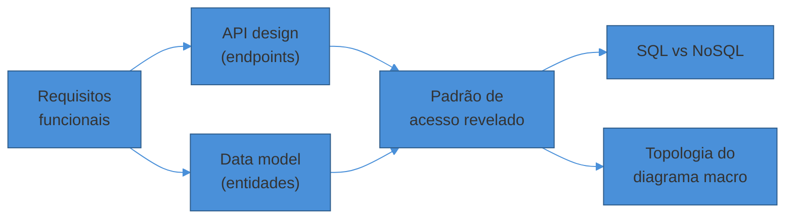
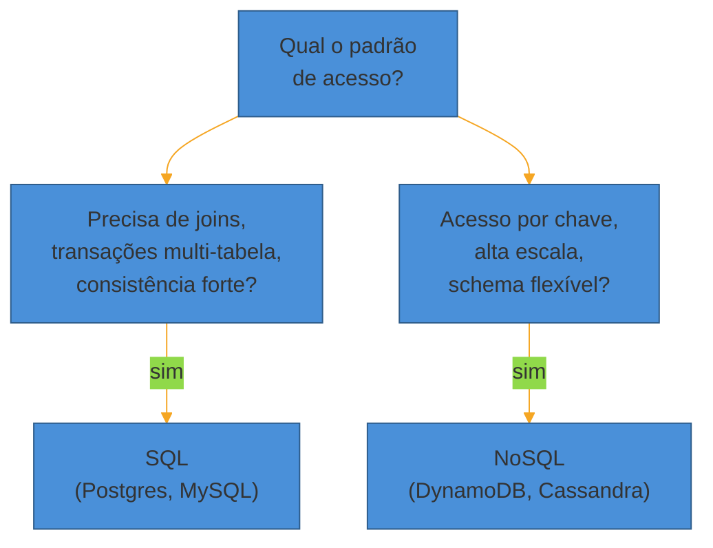

# API design e data model na entrevista

> [!abstract] TL;DR
> Passo 3 do framework: em **~5 minutos**, você esboça os **endpoints principais** e o **modelo de dados** — nem mais, nem menos. Endpoints nascem direto dos requisitos funcionais (um verbo REST por ação, request/response enxutos, idempotência e paginação resolvidas em uma frase). O data model exige a decisão que mais pesa: **SQL ou NoSQL**, cedo, guiada pelo padrão de acesso — não por preferência. Essa dupla é a **ponte**: ela transforma requisitos abstratos em restrições concretas que vão *literalmente desenhar* as caixas do diagrama macro. O erro clássico é detalhar campo a campo e queimar o tempo que devia ir para o deep dive.

Você acabou de fechar os requisitos e as estimativas de um encurtador de URL: 100M URLs/mês, leitura 100:1, latência de redirect <100ms, consistência eventual aceitável. O entrevistador espera o próximo movimento.

Um candidato nervoso pula direto para o diagrama: caixas, setas, "aqui tem um banco". Outro para no meio do caminho: "o endpoint de criar URL recebe... um POST, acho, com... a URL longa, e retorna... o código, e talvez um campo de expiração, e o usuário pode ser anônimo ou logado, e aí eu preciso pensar em rate limit por IP, e content-type, e..." — cinco minutos se foram e nenhuma caixa foi desenhada.

Nenhum dos dois fez o passo 3 direito. O primeiro pulou. O segundo afundou.

O passo 3 tem um propósito estreito: produzir um **contrato mínimo** — os 2-4 endpoints que materializam os requisitos funcionais — e uma **decisão de modelo de dados** que já resolve a pergunta mais cara (SQL ou NoSQL) antes de desenhar qualquer topologia. Isso, e nada mais.

## Por que API e data model vêm ANTES do diagrama

Parece estranho: por que parar para escrever `POST /api/urls` antes de desenhar a arquitetura que vai *implementar* esse endpoint?

Porque a API e o modelo de dados **restringem** o diagrama que vem a seguir — eles não são um subproduto dele, são a causa.

Pense assim: se o endpoint de leitura de um encurtador é `GET /{code}` e o acesso é sempre "me dê a URL para este código exato", você acabou de eliminar a necessidade de joins, de queries complexas, de um banco relacional rico em relacionamentos. Você já sabe, antes de desenhar qualquer caixa, que está lidando com um acesso **chave-valor puro**.

Essa é a ponte: **requisitos** dizem o que o sistema faz; **API + data model** traduzem isso em uma forma concreta de acesso a dados; e é essa forma de acesso — não o requisito em si — que dita se você precisa de um Postgres com índices normais ou de um DynamoDB particionado.



Pular esse passo tem um custo concreto: você chega no diagrama macro sem saber se precisa de um serviço de query relacional ou de um serviço de leitura por chave — e aí desenha no escuro, ou pior, muda de ideia no meio do desenho, na frente do entrevistador.

> [!question]- Isso não é over-engineering para 5 minutos de entrevista?
> Não é sobre produzir uma spec OpenAPI completa — é sobre *decidir o essencial em voz alta*. "O endpoint de criação recebe a URL longa, retorna o código encurtado; é POST porque cria um recurso novo. A leitura é `GET /{code}`, redirect 302." Isso cabe em 30 segundos de fala. O que consome tempo demais é detalhar campos opcionais, headers de autenticação, ou formatos de erro — que são decisões reais, mas que pertencem a uma segunda passada, se sobrar tempo, não ao esboço inicial.

## Esboçando os endpoints: um verbo por ação

A regra prática: **para cada requisito funcional, um endpoint**. Não mais que isso na primeira passada.

REST usa o método HTTP para expressar a ação e o path para expressar o recurso — não o contrário. "Endpoint URL deve representar um recurso (substantivo), não uma ação (verbo), já que o método HTTP já indica a ação" ([Designgurus](https://www.designgurus.io/blog/what-is-restful-api), 2026). Isso significa: `POST /urls`, não `POST /createUrl`.

Para o encurtador de URL, os requisitos funcionais eram "encurtar uma URL" e "acessar a URL encurtada". Isso vira:

```http
POST /api/v1/urls
Content-Type: application/json

{
  "long_url": "https://exemplo.com/artigo/muito/longo?utm=x"
}

→ 201 Created
{
  "short_code": "aZ3fK9",
  "short_url": "https://sho.rt/aZ3fK9",
  "expires_at": "2027-07-06T00:00:00Z"
}
```

```http
GET /{short_code}

→ 302 Found
Location: https://exemplo.com/artigo/muito/longo?utm=x
```

Repare no que **não** está aqui: sem campos de metadata de analytics, sem autenticação, sem versionamento de URL customizado. Esses ficam para depois — se o entrevistador perguntar, ou se sobrar tempo no final. O esboço cobre só o caminho principal dos dois requisitos funcionais centrais.

Um framework popular para essa passada chama a sequência de **R-CRUD**: *Requirements → Core resources → URIs & methods → Data schemas* ([Prachub, "API Design Interview Framework"](https://prachub.com/resources/api-design-interview-framework-step-by-step-guide-2026), 2026) — o nome muda entre guias, mas a lógica é a mesma que já vimos nas notas 02 e 03: requisitos primeiro, forma depois.

> [!warning] Gastar os 5 minutos detalhando campos opcionais
> **O que acontece:** o candidato passa minutos decidindo se o campo se chama `long_url` ou `original_url`, se `expires_at` é obrigatório, se existe um campo `created_by`. **Por quê:** o cérebro trata "escrever JSON" como uma tarefa de programação normal — onde esses detalhes importam de verdade — e esquece que aqui é sinalização de raciocínio, não implementação. **Como evitar:** decida os campos *essenciais para o requisito* (entrada e saída mínimas) e siga. Se o entrevistador quiser mais detalhe, ele pergunta.

### Idempotência: uma frase, não uma discussão

GET, PUT e DELETE são idempotentes — chamar múltiplas vezes não muda o resultado final; POST e PATCH não são, por padrão ([Hello Interview, "API Design"](https://www.hellointerview.com/learn/system-design/core-concepts/api-design), 2026).

Isso importa na prática quando o cliente pode reenviar uma requisição (timeout, retry de rede) e você precisa garantir que ela não execute duas vezes — por exemplo, "criar um pedido" não pode virar dois pedidos porque o app do usuário reenviou o POST.

A solução padrão de entrevista: um **idempotency key** gerado pelo cliente, enviado como header, que o servidor usa para deduplicar retries.

```http
POST /api/v1/orders
Idempotency-Key: 7f3e9a2b-...

→ Se a chave já foi vista: retorna a resposta original (sem reprocessar)
→ Se é nova: processa e guarda a chave
```

Você não precisa implementar isso no quadro. Precisa **mencionar** que o endpoint não-idempotente que importa para o requisito ("criar pedido", "processar pagamento") tem esse risco e essa mitigação. Uma frase, e o eixo "profundidade técnica" já registrou o ponto.

### Paginação: cursor vs offset, decidida pelo padrão de dados

Qualquer endpoint de listagem — "listar meus pedidos", "ver o feed" — precisa de paginação. E aqui há uma escolha real, não decorativa.

**Offset** (`?offset=20&limit=10`) é simples: pule N registros, retorne os próximos M. É a abordagem que "qualquer desenvolvedor júnior implementa em 15 minutos" ([dev.to, "Page Numbers Lie"](https://dev.to/mandy8055/page-numbers-lie-offset-vs-cursor-pagination-39f4), 2026) e permite pular direto para a página 50 — útil em painéis administrativos.

O problema aparece em escala: numa tabela de 50 milhões de linhas, pedir a página 5000 gera `LIMIT 20 OFFSET 99980` — o banco varre e descarta quase 100 mil linhas antes de te entregar 20 (mesma fonte). E se novos registros chegam entre uma página e outra, você vê duplicatas ou perde itens.

**Cursor** usa um ponteiro para um registro específico ("me dê os itens depois deste ID/timestamp") em vez de contar do início. É mais estável sob dados que mudam — por isso é a escolha padrão para feeds em tempo real (Twitter, notificações, chat), onde itens novos empurram tudo para baixo constantemente (mesma fonte).

| | Offset | Cursor |
|---|--------|--------|
| Simplicidade | Alta | Média (precisa encodar/decodar cursor) |
| Pula para página N | Sim | Não |
| Performance em tabelas grandes | Degrada (scan + descarte) | Constante |
| Estável sob escrita concorrente | Não (duplica/perde itens) | Sim |
| Uso típico | Admin, dataset pequeno/estável | Feed, timeline, dados voláteis |

A maioria dos entrevistadores "se importa mais com você lembrar de incluir paginação do que com qual abordagem específica você escolhe" ([mfaani.com, "Systems Design - Pagination"](https://mfaani.com/posts/interviewing/system-design/pagination/), 2026) — mas escolher cursor para um feed e justificar com "os dados mudam o tempo todo, offset ia duplicar ou pular itens" é o tipo de frase que separa quem decorou de quem entendeu.

### Versionamento: mencionar, não desenvolver

Uma linha basta: `/api/v1/urls` no path, ou um header `Accept: application/vnd.api+json;version=1`. O ponto não é qual estratégia — é sinalizar que a API vai evoluir e que breaking changes precisam de um caminho de migração. Detalhamento maior de versionamento e de estilos de API (REST vs GraphQL vs gRPC, negociação de conteúdo, HATEOAS) mora em [[Comunicação entre Sistemas/API Design|API Design]] — aqui é só o suficiente para não deixar a lacuna aberta.

## O data model: entidades, relações, e a decisão que pesa

Com os endpoints esboçados, a pergunta seguinte é: **que dado cada um lê e escreve?** Isso revela as entidades.

Para o encurtador: uma entidade `URL` (código, URL longa, data de criação, expiração, talvez dono). Simples — uma entidade, sem relacionamento.

Para um feed de rede social, já são pelo menos três: `User`, `Post`, `Follow` (relação N:N entre usuários) — e o padrão de acesso já é outra categoria: "me dê os posts dos últimos 500 usuários que eu sigo, ordenados por tempo" é uma query relacional por natureza, ou exige um índice secundário caro num modelo NoSQL puro.

É exatamente aqui, olhando para o **padrão de acesso** revelado pelas entidades e pelos endpoints, que a decisão SQL vs NoSQL deve ser tomada — e ela precisa ser tomada **cedo**, porque muda a forma do diagrama macro inteiro.



**Escolha SQL quando:** o acesso envolve relacionamentos entre entidades (joins) e/ou operações que precisam de garantias ACID — "para sistemas onde transações são cruciais (bancário, pagamentos), SQL é a melhor opção pelo suporte forte a transações ACID" ([Designgurus, "When to use SQL vs NoSQL"](https://www.designgurus.io/answers/detail/when-to-use-sql-vs-nosql-system-design-interview), 2026).

**Escolha NoSQL quando:** o acesso é majoritariamente chave-valor ou documento, a escala é alta, e você aceita consistência eventual — "bancos NoSQL geralmente priorizam escalabilidade e disponibilidade sobre consistência forte... seguindo princípios BASE, o que os torna melhores para sistemas que lidam com grandes volumes de dados com alta disponibilidade" (mesma fonte). SQL escala verticalmente (caro e limitado); NoSQL foi desenhado para escalar horizontalmente ([GeeksforGeeks, "SQL Vs NoSQL Databases in System Design"](https://www.geeksforgeeks.org/system-design/which-database-to-choose-while-designing-a-system-sql-or-nosql/), 2026).

O erro mais citado por quem prepara candidatos: "escolher o banco pela sua experiência pessoal ou viés, quando a entrevista não é sobre qual banco você prefere, mas sobre qual é mais adequado ao problema" (mesma fonte, Designgurus).

Para o encurtador: acesso puro por chave (`código → URL`), alta proporção de leitura, sem necessidade de joins. Isso "grita chave-valor + cache agressivo" — a mesma conclusão que já apareceu na nota 01 deste sub-galho, chegando agora por um caminho mais formal: não é intuição, é o padrão de acesso revelado pelo endpoint `GET /{code}` e pela entidade única `URL`.

> [!question]- E se o padrão de acesso for misto — alguns endpoints relacionais, outros chave-valor?
> Isso é comum e é sinal de maturidade reconhecer: nem todo sistema é 100% SQL ou 100% NoSQL. Um feed pode guardar o grafo social (`User`, `Follow`) num banco relacional, porque followers/following têm integridade referencial clara, e guardar o **cache do feed já montado** (a timeline pronta de cada usuário) num key-value de alta escala, porque isso é puro acesso por chave (`user_id → lista de post_ids`). Nomear essa divisão em voz alta — "vou usar SQL para o grafo social e um key-value para a timeline materializada" — é mais forte do que forçar tudo num único paradigma. O detalhe de *como* replicar/indexar cada um fica para o sub-galho 2 (Building blocks); aqui a entrevista só pede a decisão.

Para o data model do exemplo, a tabela mínima:

| Entidade | Campos essenciais | Acesso dominante |
|----------|--------------------|--------------------|
| `URL` | `short_code` (PK), `long_url`, `created_at`, `expires_at` | leitura por `short_code` (100:1) |

Uma linha. É tudo que o exemplo exige — e é exatamente por isso que ele é o arquétipo de entrevista mais comum: força a decisão SQL vs NoSQL sem exigir um diagrama de entidade-relacionamento inteiro.

## O erro de over-engineering: detalhar demais

O sintoma mais comum do passo 3 mal conduzido não é fazer pouco — é fazer *demais* no lugar errado. Índices secundários, constraints de unicidade, campos de auditoria, normalização até a terceira forma normal: tudo isso é trabalho real de banco de dados, e nada disso pertence aos 5 minutos deste passo.

> [!warning] Desenhar o schema como se fosse para produção
> **O que acontece:** o candidato lista 12 colunas por tabela, discute tipos de dado exatos (`VARCHAR(255)` vs `TEXT`), propõe índices compostos — antes mesmo de ter desenhado uma única caixa do sistema. **Por quê:** confunde "mostrar profundidade técnica" com "mostrar todo o conhecimento que tenho sobre bancos de dados", numa fase da entrevista que pede o oposto: um esboço rápido que **habilite** a próxima etapa. **Como evitar:** liste só os campos que um endpoint lê ou escreve. Se o entrevistador quiser mais — índices, replicação, sharding — isso é matéria do deep dive (passo 5), não do esboço inicial. Sinalize a intenção: "vou manter o schema mínimo aqui e aprofundar índices se formos falar de performance de leitura."

> [!warning] Escolher o banco antes de saber o padrão de acesso
> **O que acontece:** o candidato diz "vou usar MongoDB" ou "vou usar Postgres" logo de cara, como reflexo, sem ter examinado os endpoints. **Por quê:** tratamento de "banco de dados" como uma escolha de estilo pessoal, não como uma consequência lógica dos requisitos e da API. **Como evitar:** primeiro os endpoints, depois as entidades, só então a decisão SQL/NoSQL — sempre amarrada a uma frase do tipo "porque o acesso é X, então Y". Se você não consegue completar essa frase, ainda não é hora de escolher o banco.

## Fechando o passo em uma frase por peça

Uma passada de 5 minutos bem conduzida soa assim, para o encurtador de URL:

> "Dois endpoints: `POST /urls` para criar — recebe a URL longa, retorna o código; e `GET /{code}`, que faz o redirect. O de criação não é idempotente puro, mas dado o volume não vou complicar com idempotency key agora, a menos que você queira. Paginação não se aplica aqui, é acesso direto por chave. Para o dado: uma entidade só, `URL`, chave é o código. O acesso é 100% por chave, leitura dominante — isso me leva para um key-value com cache na frente, não um relacional; não tenho joins nem transações multi-tabela para justificar SQL aqui."

Repare: cada frase amarra uma decisão a um requisito ou a um padrão de acesso — a mesma disciplina que a nota 01 chamou de "nunca porque sim". Em menos de um minuto de fala, os dois artefatos deste passo (contrato + modelo) já restringem completamente a forma do diagrama que vem a seguir.

## Como explicar em inglês

API design and data model come right after the estimates, and they exist to bridge requirements into architecture. You sketch the 2-4 endpoints that map to your functional requirements, using nouns for resources and HTTP verbs for actions — not the other way around.

For each endpoint, mention idempotency if a retry could cause a duplicate side effect, and mention pagination strategy if it's a list endpoint — cursor-based for volatile, real-time data; offset-based for stable, small datasets. Don't over-specify fields; keep it to what the requirement actually needs.

The data model step then reveals your access pattern, and that's what decides SQL versus NoSQL — not personal preference. Key-value, high-read access with no joins points to NoSQL; relational integrity and multi-table transactions point to SQL.

> "I'll sketch two endpoints: a POST to create the short URL and a GET to redirect. The access pattern is pure key lookup — code to long URL, read-heavy — so I'd reach for a key-value store with aggressive caching rather than a relational database, since there's no join or transaction requirement here."

| PT | EN |
|----|----|
| Esboçar os endpoints | Sketch the endpoints |
| Contrato de API | API contract |
| Idempotência | Idempotency |
| Paginação por cursor / por offset | Cursor-based / offset-based pagination |
| Padrão de acesso | Access pattern |
| Modelo de dados | Data model |
| Chave-valor | Key-value |
| Transação multi-tabela | Multi-table transaction |
| Consistência forte / eventual | Strong / eventual consistency |
| Detalhar demais | Over-specify / over-engineer |

## O que vem a seguir

Com os endpoints e o data model esboçados, você tem exatamente as restrições que faltavam para desenhar a arquitetura macro: sabe o padrão de acesso, sabe se o banco é relacional ou não, sabe o formato de entrada e saída de cada operação. A próxima nota mostra como transformar isso num diagrama de caixas coerente — e, mais importante, como decidir *onde* aprofundar quando o diagrama estiver pronto.

- [[05 - Do diagrama macro ao deep dive e trade-offs]] — como desenhar a arquitetura macro a partir destas restrições e escolher o deep dive certo

## Veja também

- [[01 - O que é System Design e o que a entrevista avalia]] — o framework de seis passos e os quatro eixos da rubrica
- [[03 - Estimativas de escala (back-of-envelope)]] — os números (QPS, leitura/escrita) que alimentam a decisão de padrão de acesso
- [[Comunicação entre Sistemas/API Design|API Design]] — detalhe de REST, GraphQL, gRPC, versionamento e negociação de conteúdo
- [[System Design/index|System Design]] — o galho-pai e o mapa da trilha

## Fontes

- **Alex Xu** — *System Design Interview – An Insider's Guide, Vol. 1* — o framework de passos e a lógica de decisão de banco de dados; referência padrão da trilha.
- **Hello Interview** — [*API Design for System Design Interviews*](https://www.hellointerview.com/learn/system-design/core-concepts/api-design) — REST vs alternativas, idempotência de métodos HTTP; fonte moderna (2024+) de ex-entrevistadores FAANG.
- **Designgurus** — [*When to use SQL vs NoSQL in a system design interview*](https://www.designgurus.io/answers/detail/when-to-use-sql-vs-nosql-system-design-interview) — critério de decisão pelo padrão de acesso, não preferência pessoal.
- **Designgurus** — [*A Guide to Understanding RESTful API in System Design Interviews*](https://www.designgurus.io/blog/what-is-restful-api) — convenção de recurso-como-substantivo e verbo HTTP como ação.
- **GeeksforGeeks** — [*SQL Vs NoSQL Databases in System Design*](https://www.geeksforgeeks.org/system-design/which-database-to-choose-while-designing-a-system-sql-or-nosql/) — escala vertical (SQL) vs horizontal (NoSQL).
- **dev.to (mandy8055)** — [*Page Numbers Lie: Offset vs Cursor Pagination*](https://dev.to/mandy8055/page-numbers-lie-offset-vs-cursor-pagination-39f4) — custo de `OFFSET` em tabelas grandes e estabilidade do cursor sob escrita concorrente.
- **mfaani.com** — [*Systems Design - Pagination*](https://mfaani.com/posts/interviewing/system-design/pagination/) — expectativa real do entrevistador sobre paginação.
- **Prachub** — [*API Design Interview Framework: Step-by-Step Guide (2026)*](https://prachub.com/resources/api-design-interview-framework-step-by-step-guide-2026) — framework R-CRUD (Requirements → Core resources → URIs & methods → Data schemas).
