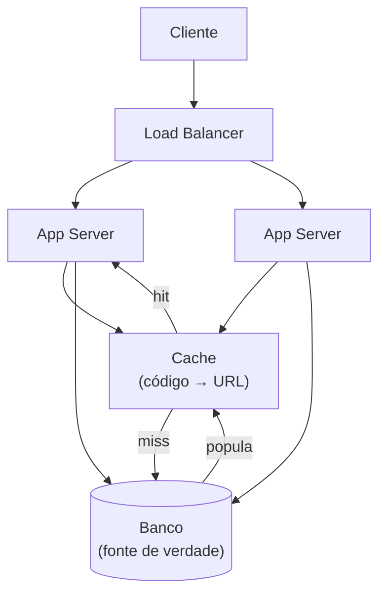
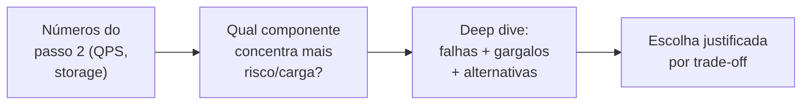

# Do diagrama macro ao deep dive e trade-offs

> [!abstract] TL;DR
> Os passos 4, 5 e 6 são onde os **30 minutos finais** da entrevista decidem o resultado. No **passo 4**, você desenha o diagrama de alto nível — as caixas e o fluxo, guiados pelos endpoints e pelo data model já definidos — e resiste à tentação de detalhar cedo. No **passo 5**, você **escolhe** o componente mais arriscado ou mais carregado e vai fundo nele: falhas, gargalos, alternativas — é onde a profundidade técnica é pontuada. No **passo 6**, você assume os pontos fracos do próprio design em voz alta e mostra como ele evolui com o crescimento. O erro fatal de gestão de tempo é gastar os 30 minutos refinando o diagrama macro e nunca chegar ao deep dive — o framework existe justamente para reservar ali o maior bloco de tempo (~15-20 min), porque é ali que a senioridade é medida.

Você já fechou os três primeiros passos do encurtador de URL: requisitos (500M usuários, leitura 100:1, latência <100ms), estimativas (~15.440 QPS de pico em leitura, 3,65TB em 5 anos), API (`POST /api/v1/urls`, `GET /{short_code}`) e data model (uma entidade `URL`, acesso puro por chave).

Restam ~30 minutos. E é aqui que a maioria dos candidatos comete o erro mais caro da entrevista inteira: acham que o trabalho pesado já passou.

Não passou. Os três primeiros passos produziram as *restrições*. Os três últimos são onde você prova que sabe *desenhar sob elas* — e é exatamente aqui que a maior parte da nota é distribuída.

## Passo 4: o diagrama de alto nível

O diagrama macro é a tradução visual de tudo que você já decidiu. Nada nele deveria ser uma surpresa — cada caixa já foi implicitamente anunciada nos passos anteriores.

Comece pelas caixas óbvias: **cliente**, **load balancer**, **app servers** (stateless, atrás do LB), o **banco de dados** (a decisão SQL/NoSQL já foi tomada no passo 3) e, se os números já apontaram para isso, um **cache**.

O critério para "o que entra no diagrama" não é "o que eu sei desenhar" — é "o que satisfaz o contrato de API que eu já defini". Hello Interview recomenda literalmente ir endpoint por endpoint: "você pode até ir um por um pelos seus endpoints de API e construir seu design sequencialmente para satisfazer cada um" ([Hello Interview, "Delivery Framework"](https://www.hellointerview.com/learn/system-design/in-a-hurry/delivery), 2026).

Para o encurtador, isso significa literalmente percorrer os dois endpoints:

- `POST /api/v1/urls` → cliente → load balancer → app server → gera o código → escreve no banco → responde com o código.
- `GET /{short_code}` → cliente → load balancer → app server → **consulta o cache primeiro** (é aqui que os 15.440 QPS de pico do passo 2 entram em cena) → se hit, responde direto; se miss, consulta o banco, preenche o cache, responde com redirect 302.

Repare no que **não** está no diagrama: fila assíncrona, CDN, réplicas geográficas, sharding. Nenhum desses foi justificado pelos números do passo 2 (3,65TB não pede sharding; 9,3 MB/s não pede CDN). Colocá-los seria exatamente o red flag apontado na nota 01 — otimização prematura para um Google imaginário, não para o sistema que os requisitos pedem.

> [!question]- Como sei quando parar de adicionar caixas?
> Quando o diagrama já satisfaz todo endpoint da sua API e todo requisito não-funcional que você declarou — e nem uma caixa a mais. Se você sente vontade de adicionar Kafka "porque sistemas grandes têm fila", pare e pergunte: qual requisito não-funcional isso resolve? Se a resposta é "nenhum, ainda", a caixa pertence ao passo 6 (evolução), não ao passo 4. O diagrama macro é o esqueleto mínimo que funciona — a complexidade extra é conquistada, não presumida.

### Narrar o fluxo, não só desenhar

O diagrama sozinho, em silêncio, vale pouco. Hello Interview é explícito sobre isso: "seja explícito sobre como o dado flui pelo sistema e o que muda de estado a cada request, começando do request de API e terminando na resposta" (mesma fonte).

Isso significa dizer em voz alta, enquanto desenha: "o cliente manda a URL longa pro load balancer, que distribui pros app servers — que são stateless, então qualquer instância serve qualquer request. O app server gera o código e escreve no banco. Na leitura, primeiro bato no cache — é aqui que os 15 mil QPS de pico do passo 2 são absorvidos — e só vou ao banco no miss".

Cada seta ganha uma frase que a amarra a uma decisão anterior. É a mesma disciplina de "nunca porque sim" que atravessa este sub-galho inteiro.

> [!warning] Diagrama macro que nunca chega ao deep dive
> **O que acontece:** o candidato passa 25-30 minutos refinando o diagrama de alto nível — adicionando mais caixas, redesenhando o layout, detalhando cada seta — e o relógio acaba antes do deep dive começar. **Por quê:** o diagrama macro é visualmente satisfatório e dá uma sensação de progresso; aprofundar em um componente é mais difícil e expõe lacunas de conhecimento, então o candidato — mesmo sem perceber — adia o momento desconfortável. **Como evitar:** trate o passo 4 como um orçamento fixo de ~10 minutos, não elástico. Assim que o diagrama satisfaz os endpoints e os requisitos declarados, pare de mexer nele e anuncie a transição em voz alta: "esse é o esqueleto; agora eu queria aprofundar em [componente] porque é onde a carga é mais séria — pode ser?"

## Passo 5: o deep dive — onde a profundidade é medida

Se o diagrama macro é o esqueleto, o deep dive é o músculo. E aqui está a virada mais importante do framework: **você escolhe** onde aprofundar — não espera ser levado até lá.

### Como escolher o componente certo

Nem todo componente merece o mesmo aprofundamento. O critério não é "qual eu conheço melhor" — é **qual concentra mais risco ou mais carga** segundo os números que você já calculou.

Para o encurtador, o candidato do passo 3 já sinalizou o candidato natural: "~15.000 leituras/s de pico é carga real — um único Postgres sem cache provavelmente sofre nesse volume". Essa frase, dita duas passos antes, *já* apontou onde o deep dive deveria ir: a camada de leitura sob carga, e — porque geração de código é o ponto mais interessante tecnicamente — a geração de código sem colisão em escala.

A heurística prática: pergunte "qual desses componentes, se eu não pensar bem, vira um ponto único de falha ou não aguenta a carga que estimei?" O componente que responde "sim" é o candidato ao deep dive.

Hello Interview descreve o objetivo do deep dive assim: usar os minutos finais para "endurecer seu design garantindo que ele satisfaz todos os seus requisitos não-funcionais, tratando casos de borda, identificando e resolvendo problemas e gargalos, e melhorando o design a partir de provocações do entrevistador" ([Hello Interview, "Delivery Framework"](https://www.hellointerview.com/learn/system-design/in-a-hurry/delivery), 2026).

E é explícito sobre a diferença de nível: "o grau em que você é proativo em conduzir os deep dives é uma função da sua senioridade. Candidatos mais júniores podem esperar que o entrevistador entre aqui e aponte lugares onde o design poderia melhorar. Candidatos mais sêniores devem conseguir identificar esses lugares por conta própria e conduzir a discussão" (mesma fonte).

### Um deep dive de verdade para o encurtador

Escolhido o componente — geração de código sem colisão, sob a carga estimada — o deep dive percorre falhas, não só o caminho feliz:

> "O código precisa ser único e curto. Duas abordagens: hash da URL longa (ex.: MD5 truncado em 6-7 caracteres base62) ou um contador distribuído convertido para base62. Hash tem risco de colisão — com 100M códigos novos por mês, ao longo de 5 anos são 6 bilhões de códigos; num espaço de base62 de 6 caracteres (~56 bilhões de combinações), a chance de colisão já não é desprezível pelo paradoxo do aniversário. Eu trataria isso verificando existência no banco antes de commitar e, em caso de colisão, adicionando um caractere extra e tentando de novo — mas isso é uma escrita extra sob concorrência, então preciso de uma constraint de unicidade no banco para não ter uma condição de corrida entre duas escritas simultâneas gerando o mesmo código.
>
> Alternativa: um contador distribuído (ex.: um serviço dedicado que reserva blocos de IDs, tipo Snowflake ou um range allocator) elimina colisão por construção, ao custo de uma dependência a mais e coordenação entre instâncias se eu tiver múltiplos geradores. Para esse volume, eu preferiria o contador com blocos pré-alocados por instância — cada app server reserva um lote de 10 mil IDs por vez, evitando round-trip a cada geração."

Repare na estrutura: **modo de falha nomeado** (colisão), **impacto quantificado** (com os números do passo 2), **duas alternativas comparadas**, **escolha justificada**. É esse encadeamento — não a arquitetura em si — que o eixo "profundidade técnica" da rubrica está observando.

Um segundo deep dive possível, sinalizado mas não expandido aqui porque pertence ao Sub-galho 2, seria o cache: qual política de eviction, como evitar *cache stampede* quando um código viraliza. O ponto do passo 5 não é esgotar um catálogo de técnicas — é escolher **um ou dois** e ir fundo de verdade, em vez de tocar em cinco superficialmente.

> [!question]- E se o entrevistador escolher o deep dive por mim?
> Ótimo — isso ainda é colaboração, não fracasso. A diferença de senioridade não é *quem* escolhe, é como você reage: um candidato sênior, mesmo guiado, aprofunda com a mesma estrutura (falha → impacto → alternativas → escolha). O sinal ruim não é "o entrevistador apontou" — é "o candidato descreveu superficialmente mesmo apontado". Se antes disso você já tinha oferecido um candidato próprio ("eu sugeriria irmos fundo na geração de código, mas se preferir outro lugar, me avisa"), você já ganhou o ponto de iniciativa antes mesmo de saber qual será o deep dive real.

> [!warning] Não assumir nenhum trade-off
> **O que acontece:** o candidato descreve o deep dive como se a solução escolhida não tivesse custo nenhum — "eu uso um contador distribuído e resolve tudo". **Por quê:** parece mais forte apresentar uma solução "perfeita" do que admitir uma fraqueza; na prática, admitir fraquezas é o comportamento premiado, não o penalizado. **Como evitar:** toda escolha técnica tem um preço — nomeie-o. "O contador distribuído elimina colisão, mas adiciona uma dependência e um ponto de coordenação a mais; se esse serviço cair, a criação de URLs para de funcionar até eu ter um fallback de geração local." Um design sem trade-off admitido não parece maduro — parece que você não pensou o suficiente para encontrar a rachadura.

## Passo 6: trade-offs e evolução

Chegando aos últimos ~5 minutos, o movimento final é dar um passo atrás e avaliar o design como um todo — não mais componente a componente.

Alex Xu descreve esse passo final como resumir o design e discutir trade-offs: nenhum design de sistema é perfeito, então reconheça em voz alta os compromissos que você fez. O framework também recomenda uma análise explícita de gargalo — imagine o sistema sob estresse: que partes têm mais chance de ceder sob pressão? Existe algum ponto único de falha que poderia derrubar tudo?

Para o encurtador, essa frase final soa assim:

> "Esse design aguenta bem os números que estimei — 15 mil QPS de leitura com cache, 3,65TB sem exigir sharding. Onde ele *não* aguentaria: se o produto virasse hit e passasse para, digamos, 1 bilhão de usuários ativos, o volume de escrita mensal explodiria e o gerador de código com bloco reservado por instância viraria gargalo de coordenação — aí eu migraria para um serviço de geração de ID totalmente dedicado, tipo Snowflake, desacoplado dos app servers. Também não tratei geograficamente: se o tráfego for global, a latência de rede entre regiões viraria o novo teto, e eu introduziria réplicas de leitura regionais com um CDN na frente para servir os redirects mais próximos do usuário."

Essa fala faz duas coisas ao mesmo tempo: **assume um limite honesto** ("isto não escala além de X") e **projeta a evolução** ("aí eu faria Y"). Nenhuma das duas sozinha é suficiente — assumir o limite sem propor o próximo passo soa como render-se; propor evolução sem admitir o limite atual soa como quem nunca testou o próprio design.

> [!question]- Preciso implementar a evolução que proponho, ou só mencionar?
> Só mencionar, com a mesma disciplina de "número → decisão" das notas anteriores: nomeie o gatilho quantificado ("se passar de X QPS" ou "se o produto for global") e a mudança concreta que ele dispara ("eu trocaria Y por Z"). Detalhar a implementação da evolução não cabe nos 5 minutos finais — e normalmente nem é pedido. O que a rubrica quer ver aqui é que você entende arquitetura como algo que **muda com a escala**, não como um artefato estático que se acerta de primeira.

> [!warning] Tratar o design como definitivo
> **O que acontece:** o candidato encerra a entrevista sem mencionar nenhum limite do próprio design, como se a arquitetura desenhada fosse válida para qualquer escala futura. **Por quê:** parece contraditório "vender" uma solução e simultaneamente apontar onde ela quebra — mas a entrevista não está comprando a solução, está avaliando se você entende suas fronteiras. **Como evitar:** reserve deliberadamente a última fala para uma frase de honestidade: "isso funciona bem para os requisitos de hoje; o próximo gargalo, se a escala for N vezes maior, seria X — e eu resolveria com Y". Isso fecha a entrevista no eixo exato — trade-offs — que mais separa sênior de pleno segundo a rubrica da nota 01.

## Gestão de tempo: por que o deep dive é o maior bloco

Olhe de novo para a tabela de orçamento da nota 01: requisitos (~5min), estimativas (~5min), API/data model (~5min), diagrama macro (~10min), **deep dive (~15-20min)**, trade-offs (~5min). O deep dive é, de longe, o maior bloco — quase um terço da entrevista inteira.

Isso não é acidente de formatação. Hello Interview reserva de 10 a 15 minutos só para o diagrama macro e depois mais ~10 minutos exclusivamente para deep dives (mesma fonte, seções "High Level Design" e "Deep Dives") — e o texto é explícito sobre o porquê: "é incrivelmente comum candidatos começarem a empilhar complexidade cedo demais, resultando em nunca chegar a uma solução completa" no diagrama macro, o que rouba tempo exatamente do bloco que mais pesa na nota.

O corolário prático: se você perceber, no meio da entrevista, que o diagrama macro está consumindo tempo demais, **corte por autoconsciência, não por acidente**. Diga em voz alta: "eu vou parar de detalhar esse diagrama aqui — ele já cobre os requisitos — e usar o tempo que sobra para ir fundo na geração de código, que é a parte que mais me preocupa em escala".

Essa frase sozinha sinaliza dois eixos da rubrica ao mesmo tempo: gestão de tempo consciente (comunicação) e identificação correta do componente de risco (profundidade técnica) — antes mesmo de você ter começado o deep dive de fato.

> [!question]- E se o entrevistador não deixar claro quando cada passo deve terminar?
> Ele raramente vai deixar. Cronometrar os passos é sua responsabilidade, não dele — é parte do que está sendo avaliado. Uma tática simples: quando sentir que o passo atual já rendeu o que precisava (o diagrama já satisfaz a API, por exemplo), anuncie a transição você mesmo: "acho que esse esqueleto já cobre os requisitos; posso avançar para o deep dive?". Isso transforma um corte arbitrário de tempo em um momento de liderança da conversa — o oposto de deixar o relógio te pegar de surpresa no minuto 40.

## Como explicar em inglês

Steps 4 through 6 are where the interview is actually won or lost. The high-level design (step 4) should map directly onto the API and data model you already defined — walk through your endpoints one by one and draw only what satisfies them, resisting the urge to add complexity that no stated requirement justifies yet.

The deep dive (step 5) is where seniority is measured. You choose the component that concentrates the most risk or load — based on the numbers from your estimation step, not on what you happen to know best — and go deep on failure modes, bottlenecks, and alternatives, not just the happy path. More senior candidates proactively propose what to deep dive into; more junior candidates wait to be pointed there.

Step 6 closes the interview by owning the design's limits out loud: "this doesn't scale past X, and here's what I'd change." Naming a weakness with a concrete trigger and a concrete fix is a stronger signal than presenting a design as if it had none.

> "I'd like to deep dive into unique code generation under load, since that's where I see the most risk given the QPS we estimated. A hash-based approach risks collisions at this volume — I'd mitigate with a uniqueness constraint and retry, but a dedicated counter service with pre-allocated ID blocks avoids collision by construction, at the cost of one more dependency."

| PT | EN |
|----|----|
| Diagrama de alto nível / macro | High-level design |
| Aprofundamento (num componente) | Deep dive |
| Ponto único de falha | Single point of failure |
| Gargalo | Bottleneck |
| Modo de falha | Failure mode |
| Assumir um trade-off | Own a trade-off |
| Evoluir o design | Evolve the design |
| Ponto de coordenação | Coordination point |
| Condição de corrida | Race condition |
| Sinalizar prioridade em voz alta | Signal prioritization out loud |

## O que vem a seguir

Este sub-galho fecha aqui. Você tem, agora, o **processo** completo dos 45-60 minutos — requisitos, estimativas, API/data model, diagrama, deep dive, trade-offs — e sabe onde cada eixo da rubrica da nota 01 é pontuado dentro dele.

O que falta é o **vocabulário**: as peças concretas que preenchem o diagrama macro e sustentam um deep dive de verdade — como um cache evita stampede, como sharding evita hot spots, o que o teorema CAP muda na prática quando uma partição de rede acontece. Esse é o conteúdo do próximo sub-galho.

- [[2 - Building blocks/index|Building blocks]] — o vocabulário de escala (caching, sharding, filas, CAP, CDN) que preenche as caixas que você aprendeu a desenhar aqui

## Veja também

- [[01 - O que é System Design e o que a entrevista avalia]] — o framework de seis passos e os quatro eixos da rubrica
- [[04 - API design e data model na entrevista]] — os endpoints e o data model que restringem o diagrama macro
- [[System Design/index|System Design]] — o galho-pai e o mapa da trilha

## Fontes

- **Alex Xu** — *System Design Interview – An Insider's Guide, Vol. 1* — o framework de 4 passos (requisitos, design de alto nível, deep dive, trade-offs/wrap-up); referência padrão da trilha.
- **Hello Interview** — [*System Design Delivery Framework*](https://www.hellointerview.com/learn/system-design/in-a-hurry/delivery) — orçamento de tempo por passo, o critério "um design simples primeiro, complexidade depois", e a diferença júnior/sênior na condução do deep dive; fonte moderna (2024+) de ex-entrevistadores FAANG.
- **Donne Martin** — [*System Design Primer*](https://github.com/donnemartin/system-design-primer) — referência aberta de building blocks usados no diagrama macro.
