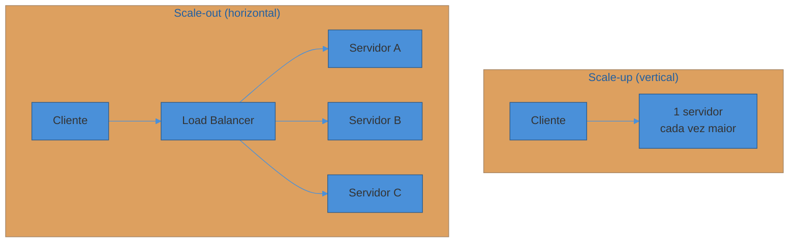
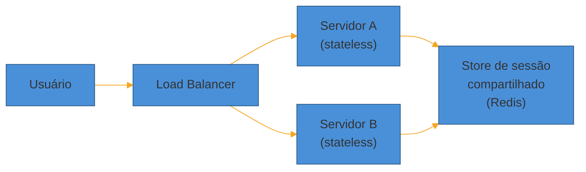
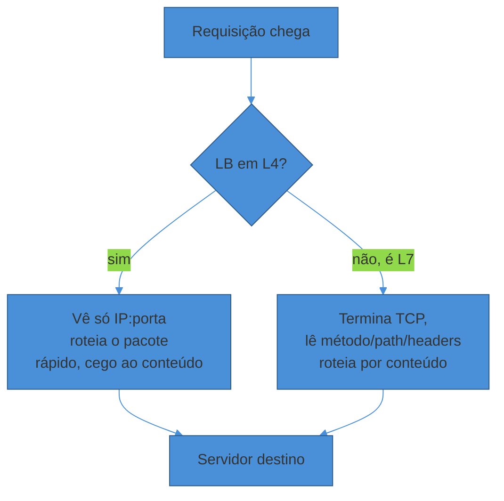

# Escalabilidade e load balancing

> [!abstract] TL;DR
> Um único servidor tem um teto — mais RAM e CPU (**scale-up**) adiam o problema, mas não o resolvem, porque hardware tem limite físico e o servidor continua sendo um **ponto único de falha**. A saída que escala de verdade é **scale-out**: muitas máquinas pequenas atrás de um **load balancer**, que precisa de dois pré-requisitos — servidores **stateless** (qualquer requisição pode ir a qualquer nó) e um algoritmo de distribuição (round-robin, least-connections, hashing) que escolha o destino. O LB opera em **L4** (roteia pacotes TCP/UDP, rápido e cego ao conteúdo) ou **L7** (lê a requisição HTTP e roteia por conteúdo, mais caro). Ele monitora a saúde dos nós via **health checks** e remove quem não responde. O próprio LB, sozinho, é um SPOF — por isso ele mesmo precisa de redundância. Dominar essa dupla — statelessness + LB — é o pré-requisito de tudo que vem depois nesta trilha: cache, sharding, filas, tudo pressupõe que você já pode rodar N cópias do seu serviço.

Uma startup lança um produto. Um servidor, um banco, tudo numa máquina só. Funciona — até a manchete do TechCrunch trazer 50 mil pessoas de uma vez.

O servidor não trava instantaneamente. Ele **degrada**: cada requisição fica um pouco mais lenta porque a CPU está sempre ocupada, a fila de conexões TCP enche, a memória começa a trocar para disco. Em poucos minutos, o tempo de resposta que era 80ms vira 8 segundos. Usuários desistem. O produto que devia estar "bombando" está, na prática, fora do ar.

O reflexo natural é comprar uma máquina maior. Dobrar a RAM, trocar por uma CPU com mais núcleos. Funciona — até a próxima manchete. E hardware topo de linha tem um teto: existe uma máquina física maior que a que você tem, mas ela não é *infinitamente* maior, e o preço cresce muito mais rápido que a capacidade a partir de um certo ponto.

Tem um segundo problema, mais silencioso que a lentidão: se aquela única máquina cair — disco, kernel panic, um deploy que deu errado — o produto inteiro cai junto. Não existe "escalar" um sistema que não sobrevive à perda do próprio hardware.

A pergunta que este building block responde é: **como ir de "uma máquina maior" para "muitas máquinas coordenadas" — e o que precisa ser verdade para isso funcionar?**

## Scale-up vs scale-out

**Scale-up** (escala vertical) é aumentar a capacidade de uma única máquina: mais CPU, mais RAM, disco mais rápido. É a resposta mais simples — não muda nada na arquitetura, só troca a instância. Por isso é sempre o primeiro movimento, e para sistemas pequenos ele é *suficiente*: não complique um serviço de 500 usuários com uma frota de servidores.

Mas scale-up bate em três paredes. A **física**: existe um limite de CPU/RAM que cabe numa placa-mãe, e mesmo os maiores servidores em nuvem (dezenas de TB de RAM, centenas de vCPUs) têm teto. O **custo**: a curva preço/capacidade não é linear — a instância duas vezes maior costuma custar bem mais que o dobro. E a **disponibilidade**: uma máquina, por maior que seja, ainda é um SPOF (*single point of failure*) — ela cai inteira, ou não cai.

**Scale-out** (escala horizontal) é adicionar mais máquinas, cada uma relativamente modesta, e distribuir a carga entre elas. Em vez de um servidor de 128 cores, dez servidores de 16 cores atrás de um distribuidor de tráfego.

Scale-out troca um problema de hardware por um problema de coordenação: agora existem N cópias do serviço, e alguém precisa decidir, requisição a requisição, para qual delas mandar o tráfego. Esse "alguém" é o load balancer — mas antes de chegar nele, existe um pré-requisito que faz ou quebra o scale-out inteiro.

Vale também notar o efeito colateral do scale-up sobre o **blast radius** de uma falha. Com uma máquina de 128 cores atendendo tudo, perder essa máquina tira 100% da capacidade do ar de uma vez. Com dez máquinas de 16 cores, perder uma tira só 10% — os outros nove nós seguem atendendo, ainda que sob carga levemente maior. Esse é um argumento de disponibilidade a favor do scale-out que vale citar em entrevista, independente da questão de teto de hardware: **granularidade menor por nó significa que uma falha individual dói menos**.

> [!question]- Por que não simplesmente escalar sempre para cima até o limite, e só then ir para fora?
> Essa é exatamente a estratégia recomendada na prática — e um bom sinal de senioridade em entrevista é dizer isso em voz alta: "eu começaria com scale-up, é mais simples e resolve para os requisitos atuais; escalaria para fora quando os números mostrarem que uma máquina não aguenta mais ou quando disponibilidade exigir redundância". O erro não é escolher scale-up primeiro — é *ficar preso* nele quando os requisitos (RNFs) já pedem redundância ou throughput que nenhuma máquina única entrega. A entrevista pune tanto complicar cedo demais quanto não reconhecer quando é hora de complicar.

## Statelessness: o pré-requisito que o scale-out esconde

Scale-out só funciona se **qualquer servidor pode atender qualquer requisição**. Isso parece óbvio até você lembrar que a maioria dos sistemas guarda *algum* estado por requisição — um carrinho de compras, um login, o progresso de um formulário de várias etapas.

Se o servidor A guarda "o usuário X está logado" só na própria memória (uma sessão em RAM local), e a próxima requisição desse usuário cai no servidor B, o B não sabe quem é X. Do ponto de vista do usuário, ele "deslogou" sem motivo.

Um servidor é **stateless** quando ele não guarda, entre requisições, nenhum dado que outra réplica precisaria para atender o próximo pedido do mesmo cliente. Toda a informação necessária vem *dentro* da própria requisição (um token JWT, por exemplo) ou é buscada de um armazenamento **compartilhado** — um Redis, um banco — que qualquer réplica pode consultar.

Onde o estado *tem* que existir — porque alguém precisa lembrar quem é o usuário — ele vai para fora do servidor de aplicação: um cookie assinado no cliente, um token que carrega os claims, ou um cache/banco compartilhado que todas as réplicas enxergam igualmente. O servidor de aplicação vira, de propósito, descartável: você pode matar qualquer réplica a qualquer momento e o sistema não perde nada, porque nada de importante morava só ali.

Essa é a razão pela qual "stateless" é quase um sinônimo de "escalável" em entrevistas: um serviço stateless escala adicionando réplicas idênticas sem coordenação nenhuma entre elas. Um serviço com estado local precisa de alguma forma de *afinidade* (mandar sempre o mesmo usuário para o mesmo servidor) ou de replicação do próprio estado — ambos complicam o design, e é exatamente o problema que **sticky sessions** tentam remendar (mais adiante nesta nota).

Em uma frase: **stateless não é um detalhe de implementação — é a condição que faz o load balancer, à frente, poder escolher qualquer servidor sem pensar duas vezes.**

## O que é o load balancer e por que ele precisa existir

Com N servidores idênticos e stateless, falta decidir: cada requisição que entra, para qual dos N vai? Essa é a função do **load balancer** (LB) — um componente que fica na frente da frota, recebe todo o tráfego e o distribui segundo um algoritmo.

Sem ele, a alternativa seria expor os IPs dos N servidores diretamente e deixar o cliente escolher (via DNS round-robin, por exemplo) — o que funciona mal: o cliente não sabe qual servidor está sobrecarregado ou fora do ar, e trocar a frota (adicionar/remover nós) exigiria propagar DNS, que é lento e cacheado de forma imprevisível pelos resolvers.

O LB centraliza essa decisão num componente que *sabe* o estado da frota em tempo real — via health checks — e pode reagir a ele imediatamente, sem esperar TTL de DNS expirar.

## L4 vs L7: em que camada o LB decide

Load balancers operam em duas camadas do modelo de rede, e a diferença não é só técnica — é o que o LB *consegue enxergar* antes de decidir.

**L4 (transporte)** opera no nível de TCP/UDP. O LB vê endereço IP e porta de origem/destino — nada do conteúdo da requisição. Ele decide para qual servidor mandar o **pacote** (ou a conexão) sem nunca olhar o que está dentro. É rápido, porque não precisa terminar a conexão nem interpretar protocolo de aplicação nenhum — ele só encaminha bytes.

**L7 (aplicação)** termina a conexão TCP, lê a requisição HTTP inteira — método, path, headers, cookies, até o corpo — e *então* decide. Isso permite roteamento por conteúdo: `/api/video` vai para um cluster otimizado para streaming, `/api/checkout` vai para outro com mais réplicas por causa do Black Friday. Também permite terminar TLS no LB (os servidores atrás não precisam lidar com certificado), fazer compressão, e reescrever headers.

O custo do L7 é que ele processa mais — abre a conexão duas vezes (cliente↔LB e LB↔servidor) e interpreta o protocolo — então tem mais latência e menos throughput bruto que um L4 puro. Na AWS, essa distinção é literal: o **Network Load Balancer** opera em L4 e o **Application Load Balancer** em L7, sendo o ALB o que roteia por conteúdo da requisição HTTP.[^1]

> [!question]- Quando eu escolheria L4 em vez de L7?
> Quando o conteúdo da requisição não importa para o roteamento e o throughput/latência bruto é a prioridade — tráfego não-HTTP (um protocolo de banco de dados, um jogo por UDP), volumes extremamente altos onde cada microssegundo de processamento no LB conta, ou quando você quer terminar TLS mais adiante (não no LB) por exigência de compliance. Na prática, a maioria das entrevistas de system design assume L7 por padrão, porque a maior parte dos sistemas discutidos é HTTP/REST e o roteamento por path (`/api/*` vs `/static/*`) é um trade-off natural de se trazer à tona.

A tabela abaixo resume a troca em termos que valem a pena dizer em voz alta na entrevista:

| Critério | L4 (transporte) | L7 (aplicação) |
|----------|------------------|-----------------|
| O que enxerga | IP:porta, nada do conteúdo | Método, path, headers, cookies, corpo |
| Unidade de decisão | Pacote / conexão TCP-UDP | Requisição HTTP individual |
| Roteamento por conteúdo | Não | Sim (`/api/*` vs `/static/*`, header, cookie) |
| Terminação de TLS | Geralmente não | Sim, comum |
| Overhead de processamento | Baixo | Mais alto (duas conexões, parsing de HTTP) |
| Exemplo AWS | Network Load Balancer | Application Load Balancer |
| Caso típico | Protocolo não-HTTP, throughput extremo | APIs REST, roteamento por rota/feature |

## Algoritmos de distribuição

Dado que o LB decide para qual servidor mandar cada requisição (ou conexão), como ele escolhe? Alguns algoritmos comuns:

**Round-robin.** Cada requisição vai para o próximo servidor da lista, em ordem circular. Simples, sem estado a manter, funciona bem quando os servidores são idênticos e as requisições têm custo parecido. É o algoritmo default do Application Load Balancer da AWS.[^2]

**Weighted round-robin.** Igual ao round-robin, mas cada servidor recebe uma fração do tráfego proporcional a um peso — útil quando a frota é heterogênea (uma instância maior recebe mais tráfego que uma pequena).

**Least connections.** O LB manda a requisição para o servidor com **menos conexões ativas** no momento. Melhor que round-robin quando as requisições têm duração muito variável — round-robin pode empilhar requisições longas no mesmo servidor por acaso, enquanto least-connections reage à carga real. A AWS chama sua variante de *least outstanding requests*, uma opção alternativa ao round-robin no ALB.[^2]

**IP hash / hashing por chave.** O LB calcula um hash de algo estável (IP do cliente, um ID de sessão, uma chave de negócio) e usa esse hash para escolher sempre o mesmo servidor para a mesma chave. Isso dá **afinidade** sem precisar de sessão explícita — útil para localidade de cache (o mesmo usuário sempre bate no servidor que já tem seu cache quente).

O problema do hash ingênuo (`hash(chave) % N`) é que adicionar ou remover um servidor muda `N`, e isso **realoca quase todas as chaves de uma vez** — um desastre para caches quentes ou conexões com estado. A correção é o **consistent hashing**, que redistribui só uma fração pequena das chaves quando `N` muda. Essa técnica é grande o suficiente para ter [[04 - Sharding e Consistent Hashing]] própria — aqui vale reter só que ela é uma opção de algoritmo de LB, não só de sharding de banco.

| Algoritmo | Quando usar | Limitação |
|-----------|-------------|-----------|
| Round-robin | Servidores homogêneos, requisições uniformes | Ignora carga real do servidor |
| Weighted round-robin | Frota heterogênea | Peso é estático, não reage a carga em tempo real |
| Least connections | Requisições de duração variável | Precisa que o LB rastreie estado (conexões ativas) |
| Hash / consistent hashing | Precisa de afinidade (cache, sessão) | Hash ingênuo realoca tudo ao mudar N; ver [[04 - Sharding e Consistent Hashing]] |

## Health checks: tirar o nó doente da rotação

Um servidor pode estar de pé (o processo roda) e ainda assim estar **inútil** — travado num deadlock, sem conexão com o banco, respondendo 500 para tudo. Um LB que ignora esse estado continua mandando tráfego para um nó morto, e uma fração dos usuários começa a receber erro sem motivo aparente.

**Health checks ativos**: o LB, periodicamente, manda ele mesmo uma requisição de sondagem (um `GET /health`, por exemplo) para cada servidor e espera uma resposta dentro de um timeout. Se o servidor falha um número configurável de vezes seguidas, o LB o remove da rotação. Quando ele volta a responder de forma saudável por algumas checagens seguidas, volta a receber tráfego.

**Health checks passivos**: em vez de sondar ativamente, o LB observa o tráfego real — se as respostas reais para um servidor começam a vir com erro ou timeout, ele é marcado como não saudável, sem esperar o próximo ciclo de checagem ativa. É mais rápido para reagir, mas depende de haver tráfego real fluindo.

Na prática, sistemas de produção combinam os dois: checagem ativa para detectar problemas mesmo em baixo tráfego, e passiva para reagir instantaneamente a falhas reais.

> [!warning] Health check que verifica só "o processo está de pé"
> **O que acontece:** o endpoint de health check retorna 200 sempre que o processo web responde, mesmo que a dependência crítica dele (o banco, um serviço downstream) esteja fora do ar.
> **Por quê:** confundir "o processo aceita conexões" com "o serviço está funcional". São coisas diferentes — o processo pode estar de pé e completamente incapaz de atender qualquer requisição real.
> **Como evitar:** o health check deve verificar as dependências que o serviço realmente precisa para responder (conexão com o banco, cache, filas críticas) — não só "o servidor HTTP subiu". Ao mesmo tempo, cuidado para não criar uma cascata: se o health check depende de *todas* as dependências, um problema numa dependência não-crítica derruba um servidor saudável desnecessariamente.

### Remover um nó vivo sem quebrar requisições em voo

Health check cuida do nó que já está doente. Mas existe um segundo cenário, mais comum ainda: você quer remover um nó *saudável* — porque um deploy vai substituí-lo, ou o autoscaler decidiu encolher a frota depois de um pico. Se o LB simplesmente parar de mandar tráfego novo e o processo for morto na sequência, qualquer requisição que já estava em andamento naquele servidor é cortada no meio, e o usuário vê um erro.

A técnica padrão é **connection draining** (a AWS chama de *deregistration delay*): quando um nó é marcado para sair da rotação, o LB para de mandar requisições **novas** para ele, mas espera um intervalo configurável (a AWS usa 300 segundos como default) antes de considerá-lo de fato removido — dando tempo para as requisições já em andamento terminarem sozinhas. Só depois desse intervalo o processo é encerrado.

O mesmo raciocínio se aplica ao lado oposto — um nó **entrando** na rotação depois de subir. Se o LB manda tráfego assim que o processo aceita conexões, mas a aplicação ainda está aquecendo caches ou terminando de inicializar, as primeiras requisições sofrem latência alta ou erro. Daí health checks com um número mínimo de sucessos consecutivos antes de considerar o nó "saudável" — o equivalente, do lado da entrada, ao connection draining na saída.

## Sticky sessions: o remendo, não a solução

Já ficou estabelecido que servidores stateless são a base do scale-out. Mas nem todo sistema legado — ou toda decisão de design — parte de zero com statelessness. Às vezes o estado de sessão já mora na memória local do servidor (um carrinho de compras guardado em RAM, por exemplo), e reescrever isso para um store compartilhado é trabalho.

**Sticky sessions** (ou *session affinity*) são a saída de curto prazo: o LB, na primeira requisição de um cliente, escolhe um servidor e passa a mandar *todas* as requisições subsequentes daquele cliente para o mesmo servidor — geralmente via um cookie que o próprio LB injeta. No Application Load Balancer da AWS, isso é feito com um cookie gerado pelo balanceador (`AWSALB`) ou um cookie da aplicação; a afinidade só entra em jogo *depois* da escolha inicial pelo algoritmo de roteamento normal.[^3]

O problema é que sticky sessions recriam, silenciosamente, o mesmo defeito que o scale-out tentava eliminar: se aquele servidor específico cair, todo mundo "grudado" nele perde a sessão. E a distribuição de carga fica desigual — se por acaso muitos usuários "pesados" grudam no mesmo servidor, ele fica sobrecarregado enquanto outros ficam ociosos, e o LB não pode redistribuir sem quebrar a afinidade.

> [!warning] Tratar sticky sessions como solução, não como remendo
> **O que acontece:** o candidato propõe sticky sessions como resposta para "como eu lido com sessão de usuário em múltiplos servidores?" e para por aí.
> **Por quê:** sticky sessions *parecem* resolver o problema porque a sessão "funciona" — mas só transferem o SPOF do "um servidor" para o "um servidor por usuário", sem eliminar a fragilidade.
> **Como evitar:** em entrevista, a resposta preferida é jogar o estado para um store compartilhado (Redis, banco) e manter os servidores de aplicação genuinamente stateless. Cite sticky sessions como uma opção conhecida — útil quando reescrever para stateless não é viável no curto prazo — mas deixe claro que é um trade-off inferior, não a solução-padrão.

## O load balancer como SPOF — e como redundá-lo

Existe uma ironia estrutural aqui: o componente que existe para eliminar o SPOF da frota de servidores é, ele mesmo, uma máquina (ou processo) único — e portanto um novo SPOF, só que agora na frente de tudo.

A solução segue o mesmo princípio de scale-out aplicado recursivamente: **redundar o próprio LB**. As formas mais comuns:

**Par ativo-passivo.** Dois LBs, um recebendo tráfego (ativo) e outro em espera (passivo), monitorando o ativo via heartbeat. Se o ativo falha, um mecanismo (IP flutuante, protocolo tipo VRRP) promove o passivo. Simples, mas o passivo fica ocioso a maior parte do tempo.

**DNS com múltiplos LBs.** O DNS resolve o mesmo nome para vários IPs de LBs distintos, e o cliente (ou o resolver) escolhe entre eles. Distribui carga entre LBs, mas herda a lentidão de propagação de DNS quando um deles cai.

**Anycast.** A mesma faixa de IP é anunciada a partir de múltiplos data centers via BGP; a rede encaminha o tráfego para o ponto de presença mais próximo (ou mais saudável) na topologia. É como serviços de CDN e DNS globais (Cloudflare, Google) atingem alta disponibilidade de borda sem depender de um único LB físico — mencionado aqui como padrão de referência; o detalhe de PoPs e roteamento de borda mora em [[07 - CDN e entrega na borda]].

Em nuvens públicas, esse trabalho de redundância costuma já vir embutido — um Application Load Balancer da AWS, por exemplo, é operado como um serviço distribuído entre múltiplas zonas de disponibilidade, não como uma instância única que você provisiona. Mas o princípio por trás — nunca ter *um* ponto de decisão sem backup — se aplica mesmo quando você não vê a implementação.

### LB e autoscaling: quem avisa quem

Redundar o LB resolve metade do problema de disponibilidade; a outra metade é manter a *lista de servidores atrás dele* correta o tempo todo, mesmo quando a frota cresce e encolhe sozinha.

Um **grupo de autoscaling** observa métricas (CPU, número de requisições em fila, uma métrica customizada) e decide adicionar ou remover instâncias sem intervenção humana. A peça que fecha o ciclo é a integração entre o autoscaler e o LB: toda instância nova precisa se **registrar** automaticamente no LB assim que sobe (e só começar a receber tráfego depois de passar no health check inicial), e toda instância que o autoscaler decide desligar precisa primeiro ser **desregistrada** — entrando no fluxo de connection draining descrito acima — antes de ser efetivamente terminada.

Se essa integração falha — por exemplo, o autoscaler mata a instância antes do LB confirmar a desregistração — o resultado é exatamente o corte de requisições em voo que o draining existe para evitar. Em entrevista, mencionar essa amarração (autoscaler ↔ LB ↔ health check ↔ draining) como um ciclo fechado, não como peças soltas, é um sinal de que você entende operação, não só desenho estático.

## Um exemplo trabalhado: a mesma pergunta, duas conduções

Para tornar concreto o efeito de cada peça, veja o mesmo pedido — "nosso serviço de checkout está saturando com um único servidor, o que você faz?" — conduzido de duas formas.

**Condução fraca (só componentes):**

> "Eu colocaria um load balancer na frente e subiria mais servidores atrás dele. Assim a carga fica distribuída e não sobrecarrega mais um servidor só."

Tecnicamente não está errado. Mas não diz *nada* sobre o que precisa ser verdade para isso funcionar, nem sobre qual algoritmo, nem sobre o que acontece quando um nó cai.

**Condução forte (mesma ideia, raciocínio visível):**

> "Primeiro eu preciso confirmar uma coisa antes de adicionar réplicas: o serviço de checkout guarda algum estado de sessão em memória local — o carrinho, por exemplo? Se guarda, adicionar réplicas sem resolver isso quebra o carrinho de quem cair num servidor diferente do que começou. Então o primeiro passo real é mover esse estado para um Redis compartilhado, deixando os servidores stateless.
>
> Com isso resolvido, ponho um Application Load Balancer em L7 na frente — preciso rotear por path de qualquer forma (`/checkout` vs `/catalog`), então L7 se paga. Round-robin resolve para começar, já que as réplicas são idênticas; se eu ver que algumas requisições de checkout são muito mais pesadas que outras — por exemplo, carrinho grande fazendo mais cálculo de frete — eu trocaria para least-connections.
>
> Health check ativo a cada alguns segundos, batendo num endpoint que testa a conexão com o banco de pagamento, não só 'o processo respondeu'. E como esse checkout é dinheiro, não posso ter o LB derrubando conexão em voo no meio de um pagamento — então habilito connection draining com um delay generoso antes de tirar um nó do ar. Quer que eu detalhe como o Redis de sessão evita virar, ele mesmo, o próximo gargalo?"

A segunda condução amarrou cada peça — statelessness, L7, algoritmo, health check, draining — a um motivo específico do domínio (checkout, pagamento em voo), e terminou oferecendo o próximo deep dive em vez de esperar ser perguntado. É a diferença entre "eu sei o que é um load balancer" e "eu sei quando e por que usar cada parte dele".

## Em entrevista

Escalabilidade e load balancing quase nunca são o *deep dive* de uma entrevista — são o **alicerce** que aparece nos primeiros minutos do diagrama macro, logo depois de decidir que o sistema precisa de mais de um servidor de aplicação.

O sinal que separa níveis aqui é rápido de captar: um candidato júnior desenha a caixa "Load Balancer" e segue em frente. Um candidato sênior diz, em uma frase, *por que* aquele LB está ali e *que trade-off* ele resolveu — "os servidores são stateless, então round-robin simples resolve; se eu precisasse de afinidade para cache eu consideraria consistent hashing, mas para esse caso a leitura é barata o suficiente para não precisar".

Prepare-se para duas perguntas quase certas: "o que acontece se um dos servidores atrás do LB cair?" (health check + remoção da rotação) e "o load balancer não é ele mesmo um ponto único de falha?" (sim — e aqui você cita par ativo-passivo/DNS/anycast, sem precisar aprofundar, a menos que peçam).

> [!question]- Vale a pena desenhar o LB explicitamente em todo diagrama, mesmo em sistemas pequenos?
> Sim, mas sem transformá-lo em ponto de discussão longo se os requisitos não pedirem. Desenhar a caixa mostra que você sabe que "mais de um servidor" implica "algo decide para qual ir" — isso é esperado mesmo em sistemas de escala moderada. O erro é o oposto: gastar cinco minutos comparando algoritmos de LB num sistema de 10 mil usuários, quando o deep dive de verdade deveria estar em outro lugar (o modelo de dados, o cache, a fila). Mencione, justifique em uma frase, e siga — a menos que o entrevistador sinalize que quer ir fundo ali.

## Como explicar em inglês

Scaling a system starts with a choice: **scale up** (a bigger machine) or **scale out** (more machines behind a load balancer). Scale-up is simpler but hits a hardware ceiling and stays a single point of failure; scale-out is what actually removes the ceiling, but it only works if your application servers are **stateless** — any instance can handle any request, because session state lives in a shared store, not in server memory.

The load balancer decides which server handles each request. At **L4** it only sees IP and port and routes packets — fast, protocol-agnostic. At **L7** it terminates the connection, reads the HTTP request, and can route by path or header — more expensive, more flexible. Common algorithms are round-robin, weighted round-robin, least connections, and hashing (which needs consistent hashing to avoid mass reshuffling when the server pool changes).

**Health checks** — active probes or passive traffic observation — let the load balancer pull an unhealthy node out of rotation before it hurts users. **Sticky sessions** are a workaround for legacy stateful servers, not the target design — they reintroduce a smaller-scale single point of failure per user. And the load balancer itself needs redundancy — active-passive pairs, multi-record DNS, or anycast — because a single load balancer is just a new SPOF.

| PT | EN |
|----|----|
| Escala vertical / horizontal | Scale up / scale out |
| Sem estado | Stateless |
| Ponto único de falha | Single point of failure (SPOF) |
| Balanceador de carga | Load balancer |
| Round-robin ponderado | Weighted round-robin |
| Menor número de conexões | Least connections |
| Verificação de saúde ativa/passiva | Active / passive health check |
| Afinidade de sessão | Session affinity (sticky sessions) |
| Hashing consistente | Consistent hashing |
| Par ativo-passivo | Active-passive pair |

## O que vem a seguir

Com servidores de aplicação escaláveis e stateless resolvidos, o próximo gargalo natural é o que eles consultam a cada requisição: se toda leitura bate no banco, o banco vira o novo teto. A próxima nota mostra como absorver essa carga com cache — e por que colocar cache na frente é quase sempre o primeiro movimento depois de resolver escala de servidores.

- [[02 - Caching]] — cache-aside, write-through/write-back, TTL, eviction e o problema do cache stampede
- [[03 - Bancos de dados em escala - SQL vs NoSQL e replicação]] — quando o banco em si precisa escalar, não só ser protegido por cache
- [[04 - Sharding e Consistent Hashing]] — o detalhe do algoritmo de hashing citado aqui como opção de LB

## Veja também

- [[System Design/index|System Design]] — o galho-pai e o mapa da trilha
- [[2 - Building blocks/index|Building blocks]] — o sub-galho e as demais peças de escala
- [[Redes e Protocolos]] — TCP/UDP e HTTP, a base sobre a qual L4/L7 operam

## Fontes

- **Alex Xu** — *System Design Interview – An Insider's Guide, Vol. 1* (cap. 2, "Load Balancer") — algoritmos de distribuição e a lógica de L4 vs L7 como vocabulário padrão de entrevista.
- **AWS Documentation** — [*Application Load Balancer*](https://aws.amazon.com/elasticloadbalancing/application-load-balancer/) — ALB opera em L7 (roteamento por conteúdo HTTP); Network Load Balancer opera em L4. Consultado em 2026-07.
- **AWS Documentation** — [*Sticky sessions for your Application Load Balancer*](https://docs.aws.amazon.com/elasticloadbalancing/latest/application/sticky-sessions.html) — cookie `AWSALB` gerado pelo LB; afinidade se aplica só após a escolha inicial pelo algoritmo de roteamento. Consultado em 2026-07.
- **AWS Documentation** — [*Load balancer target groups*](https://docs.aws.amazon.com/elasticloadbalancing/latest/application/load-balancer-target-groups.html) — round-robin é o algoritmo default do ALB; least outstanding requests e weighted random como alternativas. Consultado em 2026-07.
- **Hello Interview** — [*Networking Essentials for System Design Interviews*](https://www.hellointerview.com/learn/system-design/core-concepts/networking-essentials) — vocabulário de rede (L4/L7, DNS, TLS) aplicado à entrevista; fonte moderna (2024+) de ex-entrevistadores FAANG.
- **Donne Martin** — [*System Design Primer*](https://github.com/donnemartin/system-design-primer) — seção "Load balancer": algoritmos, health checks e o LB como potencial SPOF.

[^1]: AWS — Application Load Balancer roteia por conteúdo da requisição HTTP (L7); Network Load Balancer opera em L4 (TCP/UDP).
[^2]: AWS — round-robin é o algoritmo de roteamento default do ALB; least outstanding requests é uma alternativa disponível.
[^3]: AWS — sticky sessions usam cookie gerado pelo LB (`AWSALB`) ou cookie de aplicação; a afinidade só atua depois da escolha inicial pelo algoritmo de roteamento configurado.
