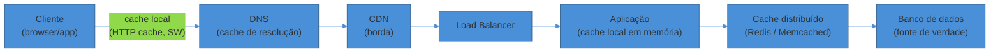
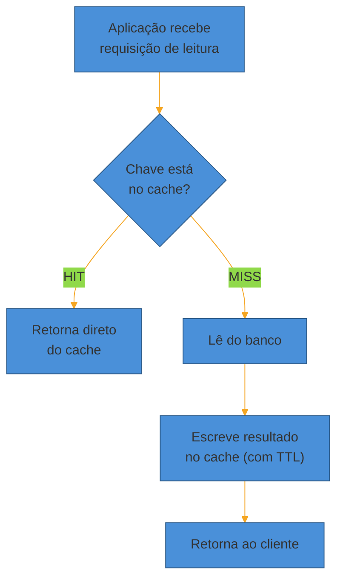
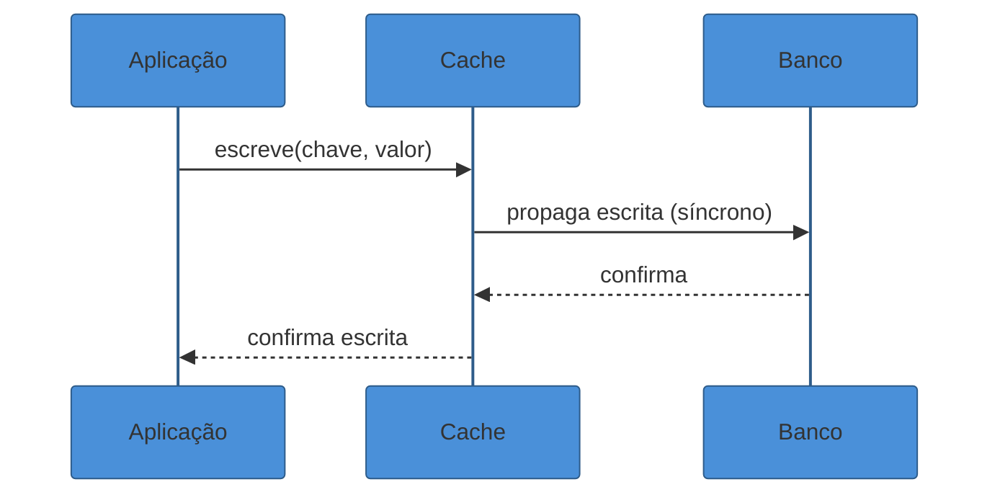
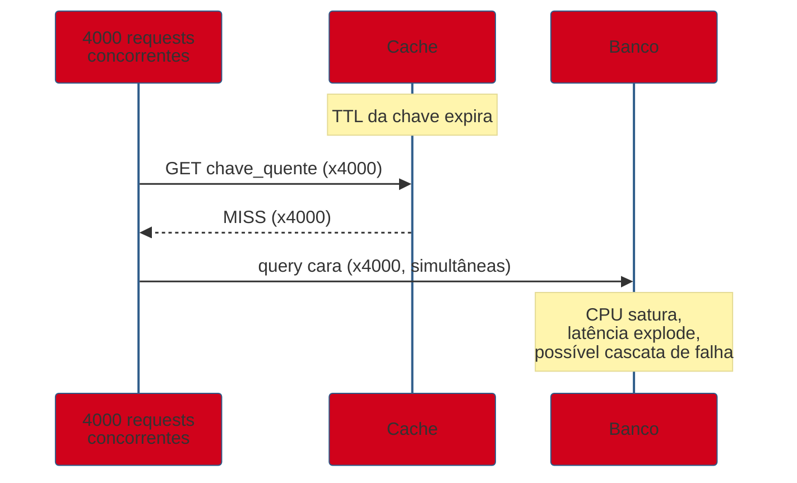
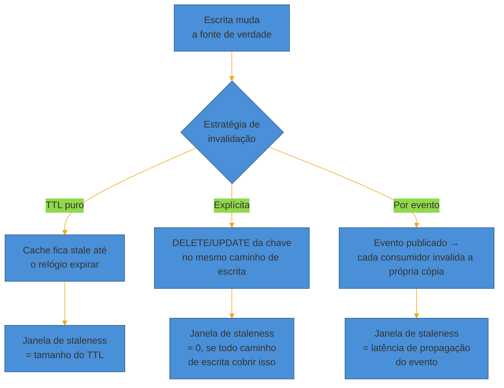
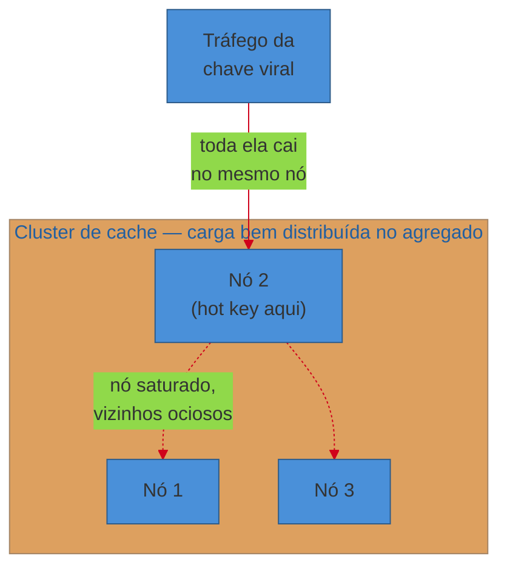

# Caching

> [!abstract] TL;DR
> Cache existe para uma coisa: **evitar refazer trabalho caro**. Na entrevista de system design, isso quase sempre significa "evitar bater no banco toda vez que a mesma chave é lida". Os quatro padrões de leitura/escrita — **cache-aside**, **read-through**, **write-through** e **write-back** — diferem em *quem* fala com o cache e *quando* a escrita chega à fonte de verdade. TTL e **eviction policies** (LRU, LFU, FIFO) decidem o que sai quando a memória enche. O perigo estrutural é o **cache stampede**: quando uma chave quente expira, um enxame de requests simultâneas ataca o banco de uma vez — mitigado com locking, expiração probabilística antecipada ou stale-while-revalidate. E por trás de tudo mora "uma das duas coisas difíceis da ciência da computação": **invalidação de cache**, o problema de manter cache e fonte de verdade consistentes.

São 2h da manhã e o time de plantão do MedEspecialista recebe um alerta: p99 de latência do endpoint de busca de especialistas subiu de 80ms para 4 segundos. O dashboard mostra o culpado — o banco Postgres está a 100% de CPU, processando a mesma query, com os mesmos parâmetros, **4000 vezes por segundo**. É a lista dos 10 cardiologistas mais bem avaliados da cidade, puxada a cada carregamento da home. Ela não muda a cada segundo. Não muda nem a cada minuto. Mas o banco a recalcula do zero, com joins e ordenação, em cada uma das 4000 requisições concorrentes.

Isso não é falha de índice, nem de query mal escrita. É a ausência de uma camada inteira: nada guarda o *resultado* de um trabalho caro para reaproveitar no próximo pedido idêntico. É exatamente o vácuo que o cache preenche.

## Por que cachear: o argumento em três frases

**Latência.** Ler de memória (RAM) é ordens de magnitude mais rápido que ler de disco ou recalcular via query com joins. A [[03 - Estimativas de escala (back-of-envelope)|nota de estimativas]] deste sub-galho cita os números de Jeff Dean/jboner: uma leitura em memória custa ~100ns; uma ida a um SSD custa ~150μs — mil vezes mais lento. Um round-trip de rede dentro do mesmo datacenter fica na casa de 0,5ms. Cache bem posicionado troca milissegundos (ou segundos, sob carga) por microssegundos.

**Alívio do backend.** Cada leitura resolvida no cache é uma leitura que *nunca chega* ao banco. Isso não é só sobre velocidade — é sobre **capacidade**. Um banco dimensionado para 500 QPS de queries pesadas pode sustentar 50.000 QPS de leitura se 99% delas forem absorvidas antes de chegar até ele.

**Padrão de acesso read-heavy.** A maioria dos sistemas do mundo real lê muito mais do que escreve — um feed social, um catálogo de produtos, um perfil de usuário. Quando a proporção leitura:escrita passa de 10:1, 100:1, o cache deixa de ser otimização e vira **requisito estrutural** da arquitetura: sem ele, o sistema simplesmente não sustenta a carga.

Voltando ao cenário de abertura: 4000 leituras/s na mesma chave, com um hit ratio de cache de 95% (número realista para uma lista que muda pouco), significam que só 5% delas — 200 QPS — de fato chegam ao banco. Um Postgres que sustenta com folga 200 QPS de uma query pesada está longe de sustentar 4000. A diferença entre "sistema no ar" e "sistema derrubado por carga" não foi um upgrade de hardware — foi uma camada de cache bem posicionada absorvendo 95% do tráfego antes que ele vire pressão real no banco.

> [!question]- Se cache é tão bom, por que não cachear tudo?
> Porque cache introduz dois custos que a entrevista espera que você nomeie. Primeiro, **memória é cara e finita** — RAM custa uma ordem de magnitude mais por GB que disco, então cachear "tudo" não escala financeiramente. Segundo, e mais sério: **cache é uma cópia**, e cópias divergem da fonte de verdade com o tempo. Cachear introduz o problema de invalidação — decidir quando essa cópia está velha demais para servir. Cache é uma ferramenta para dados que são lidos com muito mais frequência do que são escritos, e onde alguma janela de staleness é aceitável. Se a leitura precisa ser sempre 100% atual (saldo bancário no momento da transação, por exemplo), cachear é o movimento errado.

## Onde o cache vive

Cache não é uma única caixa — é uma camada que pode existir em vários pontos da jornada de uma requisição, cada um com seu papel:



**Cliente.** Cache HTTP no browser (headers `Cache-Control`, `ETag`), cache de app mobile, service workers. Mais barato de todos porque nem sai da máquina do usuário — mas fora do controle direto do backend.

**DNS.** Resolvedores cacheiam o mapeamento nome→IP por um TTL, evitando uma consulta completa a cada requisição. Detalhe de infraestrutura, raramente aprofundado na entrevista.

**CDN.** Cache geograficamente distribuído na borda da rede, mais perto do usuário. Tem peso suficiente para merecer nota própria neste sub-galho — veja [[07 - CDN e entrega na borda]]. Aqui só registramos que ela existe na cadeia.

**Aplicação (local).** Um cache em memória dentro do próprio processo do app server (um `HashMap` com TTL, ou libs como Caffeine/Guava). Extremamente rápido — sem round-trip de rede — mas **não compartilhado**: cada instância do app tem sua própria cópia, e invalidar exige avisar todas as réplicas.

**Distribuído.** Um serviço de cache separado, compartilhado por todas as instâncias da aplicação — Redis e Memcached são os exemplos canônicos. Troca um pouco de latência (agora há um round-trip de rede) por **consistência entre instâncias**: todo app server enxerga o mesmo estado do cache. É o nível que a entrevista de system design mais discute, e o que esta nota assume por padrão daqui para frente.

O padrão geral do diagrama acima é útil de internalizar: **quanto mais perto do cliente, mais barato e mais rápido o cache — mas também mais difícil de invalidar de forma centralizada.** Um cache no browser de um usuário está completamente fora do alcance do backend depois de servido; um cache distribuído é uma única fonte de verdade que qualquer serviço pode invalidar com um comando. Essa tensão entre velocidade (ficar perto do cliente) e controle (ficar perto do servidor) é o mesmo trade-off que reaparece, em escala geográfica, na nota de CDN.

> [!question]- Redis ou Memcached — qual escolher?
> Para a entrevista, a resposta raramente muda o resultado, mas o critério importa. Memcached é mais simples: multi-threaded, só chave-valor de string/bytes, sem persistência. Redis suporta estruturas de dados ricas (listas, sets, sorted sets, hashes), persistência opcional (RDB/AOF), replicação, Lua scripting, e pub/sub — o que o torna a escolha padrão quando você precisa de mais do que um dicionário burro (por exemplo, um sorted set para um leaderboard, ou operações atômicas para um rate limiter distribuído — ver [[04 - Rate Limiting|a nota de Rate Limiting]] do sub-galho seguinte). Na prática, a indústria convergiu para Redis como default; mencione Memcached só se o caso for puramente KV e você quiser justificar a simplicidade.

## Os quatro padrões de leitura e escrita

Aqui está o coração técnico da entrevista: como exatamente a aplicação, o cache e o banco trocam dados. Cada padrão resolve um trade-off diferente entre latência, consistência e complexidade operacional.

### Cache-aside (lazy loading)

O padrão mais comum, e o default de qualquer resposta de entrevista quando não há restrição especial. A **aplicação** é responsável por orquestrar tudo — o cache não sabe nada sobre o banco.



**Mecanismo:** no *hit*, a aplicação lê e devolve direto do cache — o banco nem é tocado. No *miss*, a aplicação lê do banco, escreve o resultado no cache, e então devolve. A escrita (`SET`, `UPDATE`) vai **direto ao banco**; o cache não é atualizado na escrita, só invalidado (a chave é apagada, para forçar um miss e recarregar na próxima leitura).

**Prós:** resiliente — se o cache cair, o sistema continua funcionando (mais lento, todo miss). Só popula o que é de fato lido (*lazy* — nada é cacheado sem necessidade).

**Contras:** todo cache miss paga três round-trips (checar cache, ler banco, escrever cache) em vez de um. Há uma janela entre "banco atualizado" e "cache invalidado" onde dados podem divergir.

### Read-through

Variante do cache-aside onde a **lógica de buscar no banco em caso de miss mora dentro do próprio cache** (ou numa biblioteca que o envolve), não na aplicação. A aplicação só fala com o cache; é o cache quem decide ir ao banco quando falta a chave.

**Diferença prática para cache-aside:** menos código duplicado se várias partes do sistema leem a mesma entidade (a lógica de "onde buscar no miss" fica centralizada). O trade-off é acoplamento — o cache precisa saber como consultar a fonte de dados.

Em código, a diferença é sutil mas real. Cache-aside deixa a aplicação explícita sobre os três passos:

```
valor = cache.get(chave)
se valor é nulo:
    valor = banco.buscar(chave)
    cache.set(chave, valor, ttl)
retornar valor
```

Read-through esconde esse `if` dentro de uma abstração — a aplicação só chama `cache.get(chave)`, e é a implementação do cache (ou uma lib como Spring Cache com `@Cacheable`, por exemplo) que decide ir ao banco por trás dos panos no miss. Na entrevista, ambos descrevem o *mesmo* fluxo de dados — a diferença é inteiramente sobre *onde* mora a responsabilidade de orquestrar. Vale mencionar read-through quando o entrevistador perguntar sobre organização de código ou reuso entre múltiplos serviços que leem a mesma entidade; para o desenho macro da arquitetura, cache-aside já comunica o suficiente.

### Write-through

Toda escrita passa **primeiro pelo cache**, que a propaga sincronamente para o banco antes de confirmar a operação ao cliente.



**Prós:** cache e banco **nunca divergem** — a cada escrita, ambos ficam com o mesmo valor. Leituras subsequentes são sempre um hit com dado fresco.

**Contras:** toda escrita paga a latência de escrever nos dois lugares — mais lento que escrever só no banco. E se a chave nunca for lida de volta, você gastou memória de cache à toa (mitiga-se combinando com TTL).

### Write-back (write-behind)

A aplicação escreve **só no cache**, que confirma imediatamente — e propaga a escrita para o banco de forma **assíncrona**, em lote ou depois de um intervalo.

**Prós:** escrita extremamente rápida (latência do cache, não do banco). Absorve rajadas de escrita sem sobrecarregar o banco — útil para workloads write-heavy (contadores de views, logs de eventos).

**Contras:** o maior risco do quarteto. Se o cache cair antes de propagar, **os dados em trânsito são perdidos** — não há durabilidade até a escrita chegar ao banco. Usado quando perda ocasional é tolerável (métricas, analytics) ou combinado com um log de write-ahead para reduzir a janela de risco.

Um exemplo concreto ajuda a fixar quando write-back vale o risco: o contador de visualizações de um vídeo. Se 10.000 pessoas assistem o mesmo vídeo por segundo, escrever `UPDATE views = views + 1` no banco 10.000 vezes por segundo — cada uma uma transação isolada — sobrecarrega o banco por um dado que, honestamente, ninguém nota se estiver 30 segundos desatualizado. Write-back deixa o contador incrementar em memória no Redis (`INCR views:video_id`, uma operação atômica e barata) e um processo em background persiste o valor agregado no banco a cada alguns segundos, ou a cada N incrementos. Perder alguns segundos de contagem se o Redis cair é um custo aceitável; pagar 10.000 transações de banco por segundo por um número que ninguém precisa ver em tempo real não é.

> [!warning] Confundir write-through com write-back na entrevista
> **O que acontece:** o candidato usa os termos como sinônimos, ou inverte qual é síncrono. **Por quê:** os nomes soam parecidos e ambos "escrevem através do cache". **Como evitar:** ancore na palavra que muda tudo — write-**through** é síncrono (a escrita atravessa o cache até o banco antes de responder); write-**back** é assíncrono (o cache responde e o banco é atualizado depois, "nas costas" da resposta). Se a pergunta for "o que acontece se o cache cair logo após a escrita?", a resposta certa distingue os dois: write-through não perde nada (já está no banco); write-back pode perder o que ainda não foi propagado.

| Padrão | Quem fala com o banco | Quando | Risco principal | Caso de uso típico |
|---|---|---|---|---|
| Cache-aside | Aplicação | No miss (leitura) | Staleness até o TTL expirar | Default geral; leitura de perfil, catálogo |
| Read-through | Cache (internamente) | No miss (leitura) | Acoplamento cache↔fonte | Mesma coisa, com lógica centralizada |
| Write-through | Cache, síncrono | Na escrita | Latência de escrita maior | Dados que precisam estar sempre frescos no cache |
| Write-back | Cache, depois async | Na escrita | Perda de dados se cache cair | Contadores, métricas, write-heavy tolerante |

Sistemas reais raramente usam um único padrão para tudo. É comum um serviço usar cache-aside para a maioria das leituras (perfis, catálogo), e write-back só para os poucos contadores de alta frequência (views, likes) onde o volume de escrita justifica o risco. Nomear essa mistura — "cache-aside no geral, write-back só para o contador de views" — é mais forte do que forçar um padrão único onde ele não se encaixa em todo o sistema.

> [!question]- E se eu esquecer de tratar o caso "não encontrado" no cache-aside?
> É um bug real, não hipotético — e conecta de volta ao negative caching mencionado na seção de TTL. Sem cachear o "não encontrado", uma chave inexistente nunca produz hit: toda consulta a ela recalcula do zero contra o banco, e um padrão de acesso que bate repetidamente em IDs inválidos (um scraper, um bug de cliente, ou um ataque deliberado) gera carga real de banco sem nunca passar perto de um dado de verdade — o cache, que deveria proteger o banco, simplesmente não participa desse tráfego. A correção é tratar o `null`/404 como um valor cacheável como qualquer outro, com TTL propositalmente curto (segundos, não minutos) para não atrasar demais a visibilidade de um dado recém-criado com aquele ID.

## TTL: a válvula de segurança

Toda entrada de cache deveria ter um **Time To Live (TTL)** — um relógio que expira a chave automaticamente, mesmo que ninguém a invalide manualmente. É a rede de segurança contra o pior cenário: uma chave que fica velha para sempre porque o mecanismo de invalidação falhou silenciosamente.

Escolher o TTL certo é um trade-off explícito: TTL curto reduz a janela de staleness mas aumenta a taxa de miss (e a carga no banco); TTL longo faz o oposto. No Redis, `EXPIRE chave segundos` ou `SET chave valor EX segundos` cravam esse relógio por chave.

Não existe um TTL universal — o número certo depende do quão caro é um dado desatualizado *neste* domínio específico:

| Tipo de dado | TTL típico | Por quê |
|---|---|---|
| Sessão de usuário / token de autenticação | Minutos a horas | Balanceia segurança (revogar acesso rápido) com custo de reautenticar toda hora |
| Catálogo de produtos, perfil público | Minutos | Muda com pouca frequência; staleness de alguns minutos raramente importa |
| Ranking / trending / "mais populares" | Segundos a poucos minutos | O próprio conceito já é uma foto de um momento; staleness curta é aceitável e barata |
| Cotação de preço, estoque em tempo real | Segundos, ou sem cache | Staleness aqui vira bug de negócio (vender algo que já esgotou) |
| Resultado de busca não encontrado (negative cache) | Segundos | Só precisa durar o suficiente para blindar um pico de tráfego repetido na mesma chave inválida |

Esses números não são regra fixa — são o tipo de estimativa que você deveria produzir *na hora*, amarrada ao requisito de staleness que você levantou no passo de [[02 - Clarificar requisitos]]. O padrão geral: quanto mais caro um dado desatualizado é para o negócio, mais curto (ou inexistente) deveria ser o TTL — e quando o custo de staleness é alto o bastante, a resposta pode ser não cachear aquele dado específico, mesmo que o resto do sistema seja fortemente cacheado.

Duas técnicas menores completam o repertório de TTL que vale ter na manga:

**Cache warming.** Em vez de deixar o cache popular organicamente via misses (a abordagem *lazy* do cache-aside), um processo separado pré-carrega chaves conhecidas como quentes *antes* de o tráfego chegar — tipicamente rodado logo após um deploy que limpou o cache, ou antes de um evento de tráfego previsto (uma campanha, um lançamento). Evita que os primeiros segundos pós-deploy sejam uma sequência de misses simultâneos batendo no banco — o mesmo problema do stampede, só que causado por um cache vazio em vez de uma chave expirada.

**Negative caching.** Cachear também o *resultado de uma busca que não encontrou nada* (`null`, 404), com um TTL curto. Sem isso, uma chave inexistente nunca vira hit — toda consulta a ela recalcula do zero, e um cliente malicioso (ou um bug) que bombardeia IDs inválidos consegue gerar carga real no banco sem nunca tocar um dado de verdade. Cachear o "não encontrado" por alguns segundos fecha essa brecha, ao custo de atrasar em alguns segundos a visibilidade de um dado que acabou de ser criado com aquele ID.

## Eviction policies: o que sai quando a memória enche

Cache tem memória finita. Quando ela enche, algo precisa sair para abrir espaço para o novo dado — essa decisão é a **eviction policy**. O Redis expõe isso via `maxmemory-policy`, e as opções mapeiam para conceitos gerais de qualquer sistema de cache:

- **LRU (Least Recently Used)** — remove a chave que não é acessada há mais tempo. Assume que "o que não foi usado recentemente, não será usado logo". É o default mais comum (`allkeys-lru` no Redis) porque funciona bem para a maioria dos padrões de acesso reais.
- **LFU (Least Frequently Used)** — remove a chave com menor contagem de acessos, não a mais antiga. Diferencia-se do LRU quando uma chave é acessada raramente mas em rajadas recentes — LRU a manteria (foi tocada agora), LFU a removeria (frequência baixa no total). Redis oferece `allkeys-lfu`.
- **FIFO (First In, First Out)** — remove a chave mais antiga por ordem de inserção, ignorando se foi acessada recentemente. Mais simples de implementar, mas ignora o padrão de acesso — pode remover algo popular só porque entrou primeiro.
- **Random** — remove uma chave aleatória entre as candidatas. Parece ingênuo, mas tem custo computacional mínimo e, em alguns benchmarks, desempenho surpreendentemente próximo do LRU sob certas distribuições de acesso.

O Redis também distingue **`allkeys-*`** (evict qualquer chave) de **`volatile-*`** (evict só chaves que têm TTL configurado; chaves sem expiração nunca são removidas, e se não houver nenhuma candidata, o comportamento cai para erro de escrita). Existe ainda `noeviction`, que simplesmente rejeita novas escritas quando a memória está cheia — apropriado quando perder dados é pior que degradar a escrita.

| `maxmemory-policy` (Redis) | Candidatas à remoção | Critério |
|---|---|---|
| `allkeys-lru` | Todas as chaves | Menos recentemente acessada |
| `volatile-lru` | Só chaves com TTL | Menos recentemente acessada |
| `allkeys-lfu` | Todas as chaves | Menor frequência de acesso |
| `volatile-lfu` | Só chaves com TTL | Menor frequência de acesso |
| `allkeys-random` | Todas as chaves | Aleatória |
| `volatile-random` | Só chaves com TTL | Aleatória |
| `volatile-ttl` | Só chaves com TTL | Menor TTL restante (a que vai expirar primeiro) |
| `noeviction` | Nenhuma | Rejeita a escrita e devolve erro |

O default de fábrica do Redis OSS é `noeviction` — se você não configurar explicitamente uma política de eviction, o servidor prefere recusar escrita a apagar dado silenciosamente (managed services como o Amazon ElastiCache frequentemente sobrescrevem esse default para `volatile-lru`). Para um cache puro (onde perder uma chave só custa um recálculo, não uma perda de dado real), `allkeys-lru` costuma ser a primeira mudança que se faz.

> [!question]- Como escolher entre LRU e LFU na prática?
> Pense no padrão de acesso do seu domínio. Um catálogo de produtos de e-commerce tem "hits" de sazonalidade — um produto vira popular numa Black Friday e cai depois; LRU lida bem, porque o que caiu de moda naturalmente envelhece e sai. Já um sistema de recomendação com itens "sempre populares" intercalados com picos ocasionais se beneficia de LFU, que resiste a expulsar o item historicamente quente só porque não foi tocado nos últimos segundos. Na dúvida, na entrevista, **LRU é a resposta default defensável** — é o que a maioria dos sistemas reais usa, e você só precisa justificar LFU se o padrão de acesso do problema específico pedir.

## Dimensionando o cache: quanto de memória comprar

Um deep dive que aparece com frequência na sequência do "eu colocaria um cache aqui": **quanto de RAM esse cache precisa?** É o tipo de número que a [[03 - Estimativas de escala (back-of-envelope)|nota de estimativas]] deste sub-galho ensina a produzir, aplicado ao caso específico de cache.

O raciocínio segue um padrão simples: **tamanho do cache ≈ número de chaves ativas × tamanho médio por chave**, ajustado por um fator de segurança (memória do Redis também guarda metadados de estrutura, não só o payload bruto).

Para o exemplo do MedEspecialista: se a home cacheia rankings para as ~50 maiores cidades atendidas, e cada ranking (JSON com 10 médicos, nome, nota, especialidade) pesa ~2KB, isso é 50 × 2KB = 100KB — trivial, cabe em qualquer instância pequena de Redis. Mas se o sistema evoluísse para cachear o perfil individual de cada um dos 500 mil médicos cadastrados, a 5KB por perfil, seriam 500.000 × 5KB ≈ 2,5GB só para essa família de chaves — já um número que justifica dimensionar a instância de Redis com folga, e pensar se todos os 500 mil perfis precisam mesmo estar cacheados ao mesmo tempo (ou se um TTL curto e eviction por LRU naturalmente mantêm só os acessados recentemente em memória, deixando o resto sair).

Esse último ponto é o argumento mais forte a favor de eviction policies bem escolhidas: você **não precisa** dimensionar o cache para o dataset inteiro. Um cache com `allkeys-lru` e `maxmemory` de, digamos, 4GB, naturalmente mantém em memória só o subconjunto que está sendo acessado — o resto é expulso e recalculado sob demanda no próximo miss. É a diferença entre "cache do tamanho do banco" (caro, geralmente desnecessário) e "cache do tamanho do *working set*" (a fração dos dados que realmente concentra o tráfego em qualquer janela de tempo).

## O problema estrutural: cache stampede (thundering herd)

Aqui mora o deep dive que separa sênior de júnior nesta nota. Imagine uma chave extremamente quente — a home page de um site de grande tráfego, o resultado de uma busca popular. Ela está no TTL, cacheada, servindo milhares de requests por segundo em microssegundos.

Então o TTL expira.

No instante seguinte, **milhares de requests concorrentes** dão miss na mesma chave, ao mesmo tempo. Sem proteção, todas elas caem no branch "recalcular do banco" simultaneamente — é exatamente o cenário do MedEspecialista às 2h da manhã na abertura desta nota. O banco, que estava recebendo zero dessas queries um segundo atrás, agora recebe milhares de cópias idênticas da mesma query cara, ao mesmo tempo. Esse fenômeno tem dois nomes que a literatura usa como sinônimos: **cache stampede** e **thundering herd**.



> [!warning] Cache stampede em uma chave "hot"
> **O que acontece:** uma chave muito acessada expira; centenas ou milhares de requests concorrentes dão miss ao mesmo tempo e atacam o banco simultaneamente com a mesma query cara. **Por quê:** o TTL trata todo acesso pós-expiração como independente — nada coordena as requests entre si para evitar trabalho duplicado. **Como evitar:** as quatro técnicas abaixo, isoladas ou combinadas.

**Locking / mutex (single-flight).** A primeira request que dá miss adquire um lock (por exemplo `SET lock:chave token NX PX 5000` no Redis — `NX` só seta se não existir, `PX` dá um TTL ao próprio lock para não travar para sempre se o processo cair). Só ela recalcula e repovoa o cache; as demais esperam brevemente e leem o valor já pronto, ou servem uma versão stale enquanto aguardam. Garante **exatamente uma** recomputação por chave expirada, ao custo de uma pequena espera para o restante do enxame.

**Expiração probabilística antecipada (XFetch).** Em vez de esperar o TTL bater exatamente, cada acesso próximo da expiração calcula uma probabilidade de recomputar *antes* da hora — quanto mais perto do fim do TTL, maior a chance. Na prática, isso espalha as recomputações ao longo do tempo em vez de concentrá-las no instante exato da expiração, porque cada request "decide" independentemente se vale a pena refrescar agora. O efeito é suavizar o pico num platô.

**Stale-while-revalidate.** Quando a chave expira, a primeira request (ou uma rotina em background) dispara a recomputação, mas o cache continua **servindo o valor antigo** para todo mundo enquanto isso acontece. Ninguém espera, ninguém bate no banco em paralelo — só uma trilha de recomputação em andamento, e o resto da frota lê a versão stale até ela ser trocada pela fresca. Exige aceitar uma janela de dado desatualizado, mas elimina o stampede por completo.

**Jitter no TTL.** Em vez de todas as chaves de uma família expirarem no mesmo segundo (por exemplo, todas cacheadas com `TTL=300` no mesmo deploy), adiciona-se um componente aleatório — `TTL = 300 + random(0, 30)`. Isso espalha as expirações ao longo de uma janela, evitando que um lote inteiro de chaves relacionadas caia junto.

> [!question]- Preciso implementar isso na mão, ou o Redis já resolve?
> O Redis não resolve isso automaticamente — ele só armazena e expira; a coordenação do stampede é responsabilidade da aplicação (ou de uma lib que a envolve). O padrão de lock com `SET NX PX` é a base de praticamente toda implementação de mutex distribuído sobre Redis, mas você mesmo escreve a lógica de "adquirir, recalcular, liberar, tratar timeout". Em entrevista, é suficiente **nomear** a técnica e o mecanismo Redis por trás dela (`SET chave valor NX PX ttl` para lock atômico) — não é esperado pseudo-código de produção, mas é esperado que você saiba que "cache" sozinho, sem essa camada, quebra sob uma chave suficientemente quente.

## Invalidação: a outra metade do problema

Phil Karlton cunhou a frase que todo entrevistador de system design já ouviu: "There are only two hard things in Computer Science: cache invalidation and naming things." Cache resolve performance introduzindo um problema novo — **manter a cópia em sincronia com a fonte de verdade**.

O núcleo do problema: assim que você cacheia um valor, existe uma janela entre o momento em que a fonte muda e o momento em que o cache reflete essa mudança. Três estratégias, cada uma com um trade-off diferente:

- **TTL puro** — não invalida ativamente; só deixa o tempo resolver. Simples, mas a janela de staleness é fixa e pode ser inaceitável para dados sensíveis (preço, estoque).
- **Invalidação explícita** — a escrita, ao tocar o banco, também deleta ou atualiza a chave correspondente no cache (é o que o cache-aside faz na escrita: `DELETE chave` para forçar miss na próxima leitura). Mais preciso, mas exige que todo caminho de escrita "lembre" de invalidar — um ponto de escrita esquecido é um bug de consistência silencioso.
- **Invalidação por evento** — um barramento de eventos (ver [[05 - Message queues e processamento assíncrono]]) notifica todos os consumidores de cache quando uma entidade muda, e cada um invalida sua própria cópia. Escala melhor com múltiplos caches (por exemplo, vários caches locais de aplicação), mas adiciona uma dependência de infraestrutura.

Em qualquer um dos três, a pergunta que a entrevista está testando é: **você reconhece que introduziu esse problema, e escolheu conscientemente qual grau de staleness o sistema tolera?** Não existe cache sem essa dívida; existe apenas a decisão informada de quanto dela o sistema pode carregar.



### Read-your-writes: a armadilha do cache-aside

Existe um gotcha específico do cache-aside que aparece com frequência em deep dives: o usuário **escreve** um dado e, na sequência imediata, **lê** o próprio dado — e vê a versão antiga.

O motivo é mecânico. Na escrita, o cache-aside invalida (apaga) a chave no cache, mas não a repovoa — ela só volta a ser escrita no *próximo* miss. Se, entre a escrita e a leitura seguinte, uma réplica de leitura do banco ainda não recebeu a atualização (replicação assíncrona — ver [[03 - Bancos de dados em escala - SQL vs NoSQL e replicação]]), a leitura que repovoa o cache pode capturar justamente a versão desatualizada, e essa versão errada fica presa no cache até o TTL seguinte.

Esse é o tipo de detalhe que só um candidato que já *operou* um sistema real levanta sem ser perguntado — e é exatamente o cenário clássico de "usuário edita o perfil e a tela de confirmação mostra o dado antigo". Duas saídas comuns: ler a própria escrita direto da fonte primária (bypassando cache e réplicas) por uma janela curta, logo após a escrita; ou escrever no cache na hora da escrita, em vez de só invalidar (aproximando-se de um write-through pontual para esse caminho específico).

### Cache multi-camada: quando existe cache local *e* distribuído

A [[#Onde o cache vive|seção anterior]] mostrou que o cache pode existir em vários pontos ao mesmo tempo — e é comum, em sistemas de alta escala, ter um cache local em cada instância de aplicação **na frente** do cache distribuído (Redis), como uma segunda camada mais rápida ainda. Isso resolve latência (nem o round-trip de rede até o Redis é pago no hit local), mas multiplica o problema de invalidação: agora existem *N* cópias locais (uma por instância de app) além da cópia central no Redis, e uma escrita precisa, em teoria, avisar todas elas.

Na prática, a maioria dos sistemas aceita uma janela de staleness maior para o cache local (TTLs curtos, de segundos, não minutos) exatamente porque coordenar invalidação entre N instâncias em tempo real é caro — publicar um evento de invalidação via pub/sub do próprio Redis (`PUBLISH`/`SUBSCRIBE`) é a forma mais comum de propagar "essa chave mudou" para todas as instâncias, mas ainda assim há uma janela entre a escrita e a invalidação de cada cópia local. Reconhecer essa camada extra — e o trade-off que ela reintroduz — é o tipo de detalhe que só aparece quando o sistema já tem escala suficiente para justificá-la; não é o ponto de partida de um design.

## Hit ratio: a métrica que resume tudo

**Hit ratio** = hits / (hits + misses). Se de 1000 leituras, 950 acham a chave no cache, o hit ratio é 95%. É a métrica-síntese de saúde de um cache: um hit ratio baixo (por exemplo 40%) para uma carga que deveria ser majoritariamente repetitiva é sinal de TTL curto demais, chaves granulares demais (baixa reutilização), ou cache subdimensionado (evictions prematuras por falta de memória).

Na entrevista, mencionar hit ratio como métrica de observabilidade do cache — "eu monitoraria o hit ratio; se cair abaixo de X%, é sinal de que o TTL ou o tamanho do cache precisam de ajuste" — é o tipo de detalhe operacional que sinaliza profundidade além do desenho estático.

O Redis expõe essa métrica de graça: o comando `INFO stats` retorna `keyspace_hits` e `keyspace_misses` acumulados, e hit ratio é simplesmente `hits / (hits + misses)` calculado sobre esses contadores. Não é preciso instrumentar nada customizado para começar a monitorar — a métrica já está lá, esperando um dashboard ou um alerta em cima dela.

## Hot keys: quando uma chave sozinha vira o gargalo

Um cache distribuído normalmente espalha a carga entre vários nós (ver [[04 - Sharding e Consistent Hashing]]). Mas se uma única chave concentra uma fração desproporcional do tráfego — um post viral, um produto em oferta relâmpago — todo esse tráfego cai no **mesmo nó físico**, não importa quão bem distribuído seja o resto do cache. Esse nó vira o gargalo mesmo com o cluster inteiro tendo capacidade sobrando.

Mitigações incluem replicar a chave quente em múltiplos nós (lendo de uma réplica escolhida por round-robin) e adicionar uma camada de cache local (em memória, na própria aplicação) na frente do cache distribuído, para as chaves mais acessadas — uma segunda camada que absorve o pico antes mesmo de chegar à rede.



Vale notar a diferença de escopo com o [[04 - Sharding e Consistent Hashing|sharding]] deste sub-galho: sharding resolve *como distribuir chaves diferentes* entre nós; hot key é o caso em que **uma única chave**, mesmo bem distribuída no esquema de particionamento, gera tráfego suficiente para saturar sozinha o nó que a hospeda — nenhuma estratégia de particionamento resolve isso, porque o problema não é a distribuição das chaves, é o volume desproporcional numa chave só.

Uma terceira mitigação, além de replicar a chave e adicionar cache local: **fragmentar a própria chave** em sub-chaves quando isso faz sentido semântico. Um contador global (`views:video_id`) pode virar N contadores fatiados (`views:video_id:shard_0` até `views:video_id:shard_N`), cada um hospedado potencialmente em um nó diferente, e a leitura soma os N valores na hora de exibir o total. Isso troca uma escrita concentrada por N escritas distribuídas, ao custo de uma leitura ligeiramente mais cara (soma) — um trade-off que só vale a pena quando a chave é comprovadamente quente o suficiente para justificar a complexidade extra.

## Um exemplo trabalhado: a mesma caixa, duas justificativas

Para tornar concreta a diferença entre "desenhar cache" e "justificar cache", veja a mesma pergunta — "como você cachearia a busca de especialistas do MedEspecialista?" — respondida de duas formas.

**Condução fraca (só a caixa):**

> "Eu colocaria um Redis na frente do banco. Quando alguém busca especialistas, primeiro checo o Redis; se não tiver, busco no Postgres e salvo no Redis. Isso deixa mais rápido."

Tecnicamente correto — é cache-aside, de fato. Mas não amarra nenhuma escolha a um número ou a um requisito. Não diz por que cache-aside e não write-through. Não diz o TTL. Não antecipa o que acontece quando a chave "cardiologistas mais bem avaliados" — obviamente popular — expira sob carga.

**Condução forte (mesma caixa, raciocínio visível):**

> "A busca é lida com muito mais frequência do que os dados mudam — uma avaliação de médico não muda a cada segundo. Isso pede cache-aside: a aplicação já orquestra a leitura, então não preciso de read-through, e a escrita (uma nova avaliação) é rara o bastante para eu simplesmente invalidar a chave agregada em vez de manter o cache sincronizado em tempo real com write-through.
>
> TTL de 5 minutos — tolero até 5 minutos de defasagem no ranking de 'mais bem avaliados', que é um requisito razoável para esse tipo de lista. Uso `allkeys-lru` como eviction policy, porque quero que o Redis expulse o que não é acessado, não que rejeite escritas.
>
> O ponto que eu aprofundaria: essa chave de ranking é claramente quente — é a home de todo mundo. Se ela expirar sob os 4000 QPS que estimamos, o Postgres toma o hit inteiro de uma vez. Eu adicionaria um lock (`SET NX PX`) para garantir que só uma request recalcule por vez, e as outras leem a versão que já está sendo recomputada — ou, mais simples ainda, aceito servir a versão stale por alguns segundos extras enquanto recalculo em background. Prefiro essa segunda opção aqui, porque staleness já é tolerada pelo requisito."

A segunda resposta usa exatamente os mesmos componentes — Redis, cache-aside, TTL — mas amarra cada um a um número ou requisito, e antecipa o deep dive antes de ser perguntada. É a diferença entre descrever um cache e desenhar *este* cache, para *este* problema.

## Armadilhas comuns

> [!warning] Cachear sem TTL
> **O que acontece:** o candidato configura o cache-aside, mas esquece de mencionar expiração — a chave fica válida "para sempre" até ser invalidada manualmente. **Por quê:** parece mais simples não pensar em expiração, e no caminho feliz (invalidação sempre disparada corretamente) funciona. **Como evitar:** todo cache merece um TTL como rede de segurança, mesmo que a invalidação explícita seja o mecanismo primário. Se a invalidação falhar silenciosamente — um bug, uma mensagem perdida — o TTL é o que evita que o dado fique errado indefinidamente.

> [!warning] Tratar hit ratio como só uma métrica de dashboard
> **O que acontece:** o candidato menciona "eu monitoraria o hit ratio" sem conectar isso a uma ação concreta. **Por quê:** cita a métrica porque sabe que ela existe, sem mostrar que entende o que ela informa. **Como evitar:** amarre a métrica a uma decisão: "se o hit ratio cair abaixo de 80%, é sinal de TTL curto demais ou de o cache estar sofrendo evictions prematuras por falta de memória — nesse caso eu aumentaria o `maxmemory` ou revisaria a granularidade das chaves". A métrica sozinha não pontua; a ação que ela dispara, sim.

## Em entrevista

Cache é quase sempre uma das primeiras caixas desenhadas — e também uma das mais fáceis de desenhar sem justificar, o que é exatamente o red flag que a [[01 - O que é System Design e o que a entrevista avalia|nota 01]] descreve. "Eu colocaria um cache aqui" sozinho não pontua. O que pontua:

- **Nomear o padrão**, não só "cache": "cache-aside, porque a aplicação já orquestra a leitura e o padrão de acesso é majoritariamente leitura".
- **Justificar o TTL** em função do requisito de staleness aceitável: "TTL de 60s porque o requisito tolera até 1 minuto de defasagem no ranking".
- **Antecipar o stampede** em qualquer chave que você mesmo descreveu como "quente" ou "popular" — é o deep dive mais comum sobre caching nas entrevistas reais.
- **Reconhecer o custo da invalidação** em vez de tratar o cache como gratuito: "a escrita vai invalidar essa chave; aceito a janela entre a escrita e a invalidação porque o requisito não exige consistência forte aqui".

Um checklist rápido para não esquecer nenhuma dimensão quando "cache" entra na conversa:

| Pergunta que você deveria já ter respondido | Onde ela aparece nesta nota |
|---|---|
| Qual padrão — cache-aside, write-through, write-back? | Os quatro padrões |
| Qual TTL, e por quê esse número? | TTL: a válvula de segurança |
| Qual eviction policy quando a memória enche? | Eviction policies |
| Essa chave pode ficar "quente" o suficiente para stampede? | Cache stampede |
| Como a escrita invalida (ou não) o cache? | Invalidação |
| O usuário pode ler a própria escrita logo em seguida? | Read-your-writes |
| Uma chave sozinha pode saturar um nó do cluster? | Hot keys |

## Como explicar em inglês

Caching exists to avoid redoing expensive work — most commonly, hitting the database for the same read over and over. The four core patterns are **cache-aside** (the application checks the cache, falls back to the database on a miss, and populates the cache), **read-through** (the same logic, but owned by the cache layer itself), **write-through** (writes go through the cache synchronously, so cache and database never diverge), and **write-back** (writes land in the cache and are flushed to the database asynchronously — fast, but riskier if the cache crashes before flushing).

The failure mode worth calling out proactively is **cache stampede** (also called thundering herd): when a hot key expires, every concurrent request misses at once and hammers the database simultaneously. Mitigations include a mutex lock so only one request recomputes the value, probabilistic early expiration, or serving a stale value while revalidating in the background.

Two more terms worth having ready: **eviction policy** — what gets removed once the cache is full, typically LRU (least recently used) by default — and **TTL** (time to live), the expiration clock every cache entry should carry as a safety net, independent of any explicit invalidation logic. If asked what breaks without a TTL, the honest answer is: a stale entry can live forever if the invalidation path that was supposed to clear it has a bug — TTL is the fallback that bounds how wrong the cache can be.

> "I'd use cache-aside here with a TTL of a few minutes — the data is read far more than it's written, and the requirement tolerates some staleness. Since this key can get very hot, I'd add a lock so only one request recomputes it on expiry, instead of letting the whole fleet stampede the database at once."

| PT | EN |
|----|----|
| Cache-aside / lazy loading | Cache-aside / lazy loading |
| Write-through | Write-through |
| Write-back / write-behind | Write-back / write-behind |
| Política de expulsão | Eviction policy |
| Chave quente | Hot key |
| Estouro em cascata / avalanche de requests | Cache stampede / thundering herd |
| Servir dado desatualizado enquanto revalida | Stale-while-revalidate |
| Taxa de acerto | Hit ratio |
| Invalidação de cache | Cache invalidation |
| Janela de inconsistência | Staleness window |

## O que vem a seguir

Caching resolve o volume de leitura na aplicação — mas duas peças vizinhas completam o quadro. A próxima nota olha para a **fonte de verdade** por trás do cache: como bancos de dados escalam leitura e escrita quando o cache sozinho não basta. E mais à frente, quando o cache distribuído cresce além de um nó, a pergunta muda para *como distribuir as chaves entre vários nós sem reamontoar tudo a cada mudança de cluster*.

- [[03 - Bancos de dados em escala - SQL vs NoSQL e replicação]] — a fonte de verdade por trás do cache, e como ela mesma escala leitura via réplicas
- [[07 - CDN e entrega na borda]] — cache geograficamente distribuído, na borda da rede, para conteúdo estático e semi-estático
- [[04 - Sharding e Consistent Hashing]] — como particionar um cache (ou banco) grande demais para um único nó

## Veja também

- [[System Design/index|System Design]] — o galho-pai e o mapa da trilha
- [[2 - Building blocks/index|Building blocks]] — o índice deste sub-galho
- [[01 - Escalabilidade e load balancing]] — a peça anterior deste sub-galho: como distribuir carga antes mesmo de ela chegar ao cache

## Fontes

- **Redis** — [*Key eviction*](https://redis.io/docs/latest/develop/reference/eviction/) (docs oficiais) — políticas `maxmemory-policy`: `allkeys-lru`, `volatile-lru`, `allkeys-lfu`, `volatile-lfu`, `noeviction`, e a distinção `allkeys-*` vs `volatile-*` (chaves com/sem TTL).
- **Redis (antirez)** — [*Cache Stampede Prevention*](https://redis.antirez.com/fundamental/cache-stampede-prevention.html) — o padrão de lock via `SET chave valor NX PX ttl` para single-flight sobre Redis.
- **Alex Xu** — *System Design Interview – An Insider's Guide, Vol. 1* — os quatro padrões de cache (cache-aside, read-through, write-through, write-back) como vocabulário padrão de entrevista.
- **Donne Martin** — [*System Design Primer* — seção Cache](https://github.com/donnemartin/system-design-primer#cache) — visão geral de client cache, CDN, cache de aplicação e cache distribuído.
- **AWS** — [*Database Caching Strategies Using Redis* — Evictions](https://docs.aws.amazon.com/whitepapers/latest/database-caching-strategies-using-redis/evictions.html) — comportamento de eviction sob `maxmemory` em produção.

