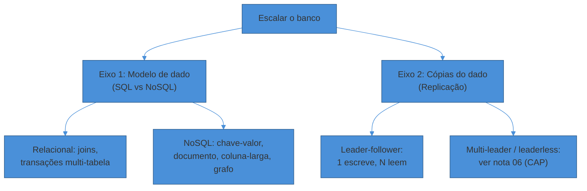
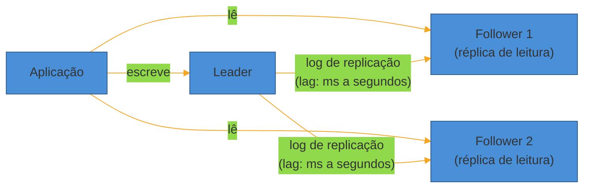
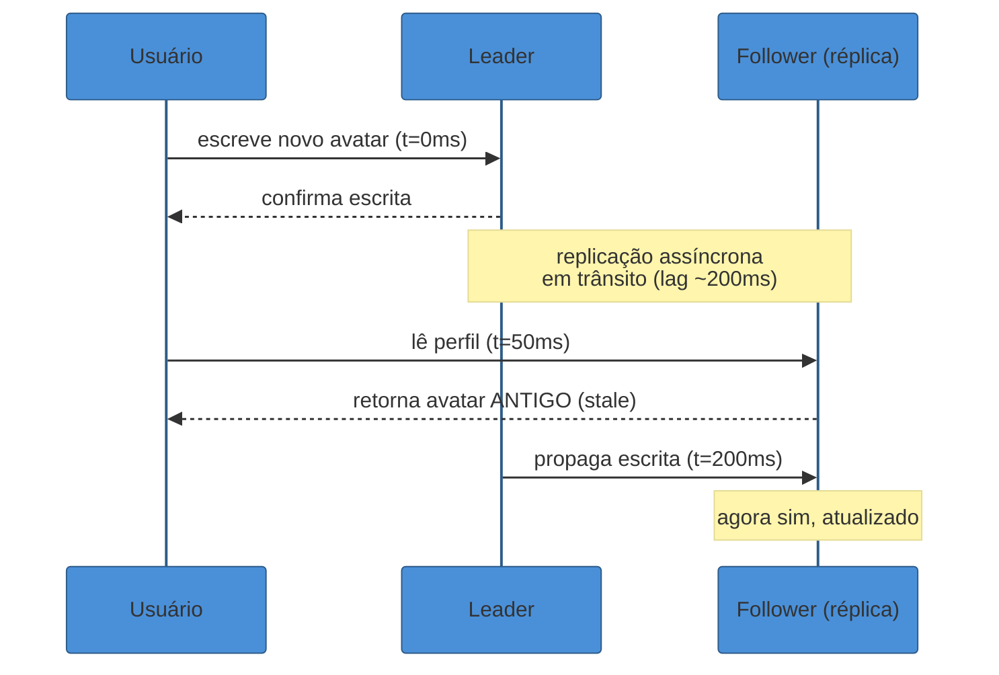
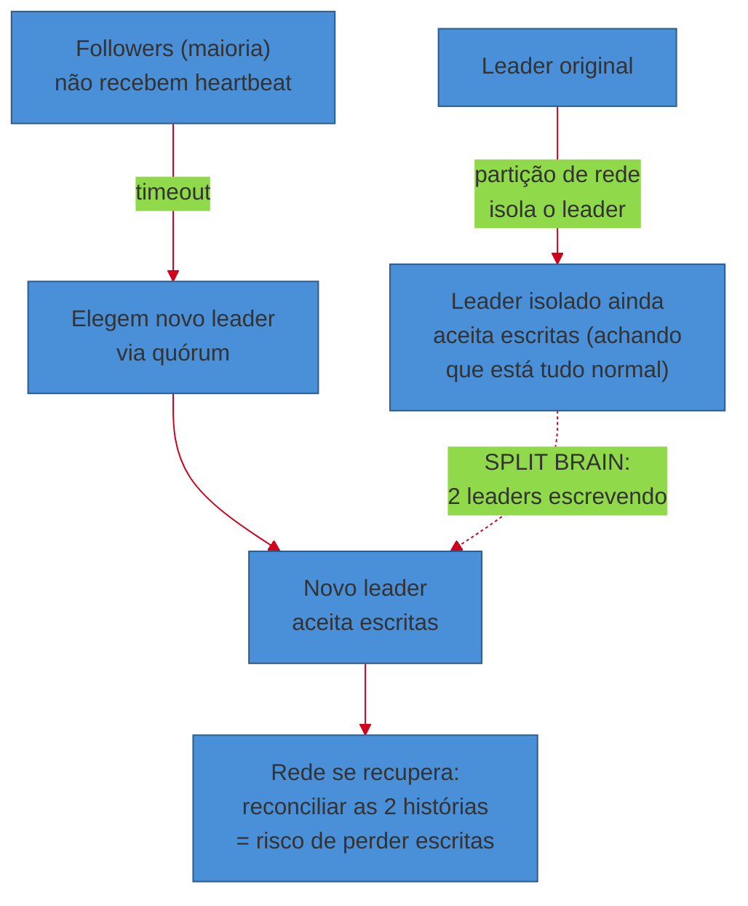

# Bancos de dados em escala — SQL vs NoSQL e replicação

> [!abstract] TL;DR
> Um único Postgres aguenta praticamente qualquer startup — até o dia em que as **leituras** dominam a carga e cada `SELECT` compete por CPU com os `INSERT`s de produção. A primeira resposta de escala quase nunca é "trocar de banco": é **replicar** o que você já tem, colocando **réplicas de leitura** ao lado do banco principal (o **leader**). Isso resolve throughput de leitura, mas introduz um problema novo — **lag de replicação**: a réplica está sempre alguns milissegundos (ou segundos) atrás do leader, e um usuário pode não ver a própria escrita. A escolha entre **SQL e NoSQL** segue a mesma lógica de "resolver um problema real": não é sobre hype, é sobre **padrão de acesso** — joins e transações multi-tabela pedem relacional; acesso massivo por chave, com consistência eventual tolerável, abre espaço para chave-valor ou documento. Replicação (cópias do mesmo dado) e sharding (fatias do dado) são eixos ortogonais e complementares — este texto cobre o primeiro; o segundo é a próxima nota do sub-galho.

Uma fintech nasceu com um Postgres. Um serviço, um banco, sem cerimônia. Funcionou por dois anos.

Aí o produto pegou tração: o app de consulta de extrato — que só lê — passou a receber 50x mais tráfego que o app de pagamentos, que escreve. O mesmo banco atendia os dois. Cada consulta de saldo brigava por I/O com a transação que estava gravando um pagamento naquele instante. Latência de escrita, que era 20ms, virou 400ms nos picos.

O instinto de muita gente nesse momento é "vamos trocar pra um NoSQL, eles escalam melhor". É o erro clássico. O banco não estava lento porque era relacional — estava lento porque **um único nó estava servindo dois padrões de carga incompatíveis** no mesmo hardware. A solução não trocou o modelo de dado: adicionou **réplicas de leitura**. O app de consulta passou a ler das réplicas; o app de pagamentos continuou escrevendo no leader. Latência de escrita voltou a 20ms sem tocar em uma linha de schema.

Esse é o fio condutor desta nota: **replicação primeiro, mudança de modelo de dado só quando o padrão de acesso realmente pede.**

## Duas perguntas, dois eixos

Bancos em escala respondem a duas perguntas independentes, e misturá-las é a fonte mais comum de confusão em entrevista:

1. **Que formato de dado eu uso?** — relacional, chave-valor, documento, coluna-larga, grafo. É a pergunta de *modelo*.
2. **Como eu tenho mais de uma cópia do dado, em mais de uma máquina?** — é a pergunta de *replicação*, e ela se aplica a **qualquer** modelo. Postgres replica. MongoDB replica. Cassandra replica.



Este texto cobre os dois eixos, mas o segundo — replicação — é o coração da nota, porque é o primeiro passo de escala que quase todo sistema atravessa, independente do modelo escolhido. **Sharding** (particionar o dado em fatias, em vez de copiá-lo inteiro) é um terceiro eixo, tratado na próxima nota — [[04 - Sharding e Consistent Hashing]].

> [!question]- Replicação e sharding não são a mesma coisa?
> Não, e confundir os dois é um erro comum em entrevista. **Replicação** faz N cópias *completas* do mesmo dado, em N máquinas diferentes — resolve disponibilidade e throughput de leitura. **Sharding** divide o dado em *fatias* e cada máquina guarda só a sua fatia — resolve volume de dado e throughput de escrita, quando um único nó não cabe mais o dataset inteiro. Sistemas grandes fazem os dois ao mesmo tempo: cada shard, por sua vez, é replicado. Pense em uma biblioteca: replicação é ter cópias do mesmo livro em várias filiais; sharding é dividir o acervo entre filiais (ficção numa, técnico noutra). São ortogonais — e é exatamente por isso que cada um vira nota própria neste sub-galho.

## Modelos de dado: para que cada um serve

Esta seção não reabre ACID nem índices — isso mora em [[03-Dominios/Ciência/Banco de Dados/index|Banco de Dados]]. Aqui, a pergunta é de entrevista: **dado este padrão de acesso, que modelo eu escolho?**

**Relacional (SQL)** — Postgres, MySQL. O dado é organizado em tabelas com schema fixo, e o motor garante **joins** eficientes e **transações multi-tabela** com garantias ACID. É a escolha certa quando a integridade referencial importa de verdade: um sistema de pagamentos onde um débito e um crédito precisam acontecer atomicamente, ou um relatório que cruza pedidos, clientes e produtos numa query só.

**Chave-valor** — Redis, DynamoDB, Riak. O acesso é sempre por uma chave: `GET user:123`. Não há joins; se você precisa relacionar dados, faz isso na aplicação. Em compensação, escala horizontalmente com uma previsibilidade que um relacional não tem — a operação é O(1) por definição. Serve para sessões, carrinhos, contadores, cache.

**Documento** — MongoDB, Couchbase. Cada registro é um documento semi-estruturado (tipicamente JSON), sem schema rígido entre documentos. Bom quando o objeto de domínio já é naturalmente aninhado — um perfil de usuário com endereços e preferências dentro do mesmo documento — e você lê o objeto inteiro na maioria das vezes, evitando joins.

**Coluna-larga** — Cassandra, HBase, Bigtable. Otimizado para escrita em massa e leitura por chave de partição + range de clustering, distribuído nativamente por milhares de nós. É o modelo por trás de séries temporais, métricas, feeds de eventos — cargas write-heavy em escala que nenhum relacional single-node aguentaria.

**Grafo** — Neo4j, Amazon Neptune. Quando a pergunta central é sobre **relacionamentos profundos** — "amigos de amigos até 3 graus", recomendação por proximidade de rede. Um relacional consegue simular com joins recursivos, mas degrada rápido; um grafo trata a travessia como operação nativa.

> [!warning] Escolher NoSQL por moda, não por padrão de acesso
> **O que acontece:** o time migra de Postgres para MongoDB "porque escala melhor", e três meses depois precisa emular joins na aplicação para gerar um relatório financeiro que cruza cinco coleções. **Por quê:** a decisão foi tomada pela reputação do banco ("NoSQL = escala"), não pelo padrão de acesso real da carga de trabalho. **Como evitar:** pergunte primeiro "eu preciso de transações multi-registro e joins ad-hoc?". Se sim, é relacional — ponto. Só considere NoSQL quando o acesso é predominantemente por chave, em volume que um único nó relacional não sustenta, e você já validou que pode tolerar consistência eventual.

A tabela abaixo resume a decisão em cinco perguntas que valem mais do que qualquer benchmark de performance:

| Pergunta | Relacional (SQL) | NoSQL (KV / Documento / Coluna-larga / Grafo) |
|---|---|---|
| Preciso de `JOIN`s frequentes entre entidades? | Sim — motor otimizado para isso | Não — join fica por conta da aplicação |
| Preciso de transação atômica cruzando várias tabelas/registros? | Sim — ACID nativo | Raramente (algumas oferecem transações limitadas, ex.: MongoDB multi-document desde 4.0) |
| O schema muda com frequência entre registros? | Não — schema fixo, migração custa | Sim — documento aceita campos variáveis sem migração |
| O acesso é majoritariamente leitura/escrita por uma chave conhecida? | Funciona, mas não é o forte | É exatamente o forte — O(1) por design |
| Preciso escalar escrita horizontalmente além de um nó? | Difícil sem sharding manual | Muitos já nascem particionados (Cassandra, DynamoDB) |

Nenhuma linha dessa tabela, sozinha, decide — é o **conjunto** de respostas para a carga real do sistema que aponta o caminho. Um sistema grande frequentemente usa os dois lados da tabela em serviços diferentes, como no catálogo-vs-carrinho do exemplo de entrevista mais adiante.

### Coluna-larga e grafo, em um exemplo rápido de cada

Os dois últimos modelos da lista merecem um exemplo curto, porque são menos intuitivos que relacional/documento/chave-valor.

**Coluna-larga**, na prática de um sistema de métricas: a chave de partição é algo como `sensor_id`, e a chave de clustering é o timestamp. Uma query típica é "me dê todas as leituras do sensor 4471 entre 14h e 15h de ontem" — uma leitura sequencial dentro de uma única partição, extremamente barata, porque o motor já armazena os dados daquele sensor ordenados por tempo, lado a lado em disco. É a razão pela qual Cassandra e afins dominam telemetria e séries temporais: o padrão de acesso é "escreva rápido, leia por partição+range", exatamente o que o modelo otimiza.

**Grafo**, num sistema de recomendação social: a pergunta "quais produtos meus amigos compraram que eu ainda não vi" é, num relacional, um `JOIN` recursivo entre `usuarios`, `amizades` e `compras` que fica caro e difícil de ler à medida que a profundidade da rede cresce. Num banco de grafo, a mesma pergunta é uma travessia nativa: partir do nó "eu", seguir arestas `AMIGO_DE`, depois arestas `COMPROU`, filtrar o que já apareceu no meu histórico. O motor foi desenhado para que "seguir uma aresta" seja uma operação de ponteiro, não uma busca em índice — é por isso que a diferença de performance entre os dois cresce rápido conforme a profundidade da travessia aumenta.

### Um pedido de e-commerce, dois modelos

Para tornar a diferença palpável, veja o mesmo domínio — um pedido — modelado nos dois estilos.

Em **relacional**, o pedido normalizado vira três tabelas: `orders` (id, user_id, status, total), `order_items` (order_id, product_id, quantity, price) e `products` (id, name, price). Para exibir um pedido completo com nome de produto, você faz `orders JOIN order_items JOIN products`.

Em **documento**, o mesmo pedido vira um único registro auto-contido:

```json
{
  "order_id": "ord_9182",
  "user_id": "usr_442",
  "status": "paid",
  "items": [
    { "product_id": "prd_11", "name": "Teclado mecânico", "qty": 1, "price": 349.90 },
    { "product_id": "prd_92", "name": "Mousepad XL", "qty": 2, "price": 39.90 }
  ],
  "total": 429.70
}
```

A leitura do pedido completo é uma busca única, sem join — ótimo para o app mobile que só precisa exibir o pedido. O preço aparece na escrita: se o preço do "Teclado mecânico" mudar no catálogo amanhã, o pedido antigo continua com o preço congelado no momento da compra — o que, aliás, é o comportamento *correto* para um pedido histórico (você não quer que o valor pago retroaja). Mas se o que mudasse fosse o *nome* do produto por correção de cadastro, cada pedido antigo ficaria com o nome desatualizado, e não há um `UPDATE` único que conserte todos de uma vez, como haveria no relacional.

Isso ilustra o trade-off da seção anterior de forma concreta: o documento comprou uma leitura mais barata (sem join) pagando com a dificuldade de propagar uma correção retroativa.

Vale notar que mesmo dentro do modelo documento a escolha não é binária. Bancos de documento aceitam tanto **embutir** (o exemplo acima, itens dentro do próprio pedido) quanto **referenciar** (o pedido guarda só `product_id`, e uma segunda busca traz os detalhes do produto). A regra prática — usada inclusive na própria documentação de modelagem do MongoDB — é embutir quando o dado embutido é lido junto na maioria das vezes e não cresce sem limite (itens de um pedido: sim); referenciar quando o dado é grande, muda com frequência independente do "pai", ou é compartilhado por muitos documentos (o catálogo de produtos completo: não embutir em cada pedido). É a mesma decisão de normalizar-ou-não, só que dentro de um único documento em vez de entre tabelas.

### Persistência poliglota: usar mais de um modelo no mesmo sistema

O exemplo do e-commerce sugere a conclusão natural: por que escolher **um** modelo para o sistema inteiro? A maioria dos sistemas grandes não escolhe — pratica **polyglot persistence**: cada serviço usa o modelo que seu padrão de acesso pede, e os serviços conversam entre si por API, não compartilhando o banco.

Um exemplo comum: catálogo de produtos em Postgres (relacional, por causa de relatórios e integridade), carrinho de compras em Redis (chave-valor, por volume e efemeridade), busca de produto em Elasticsearch (índice invertido, otimizado para full-text), e um feed de eventos de pedido em Kafka alimentando um data warehouse em coluna-larga para analytics. Quatro tecnologias, quatro padrões de acesso, uma arquitetura coerente.

> [!question]- Isso não aumenta demais a complexidade operacional?
> Aumenta, e é um trade-off real — cada banco a mais é mais um sistema para operar, monitorar e fazer backup. Por isso a resposta de entrevista madura não é "eu uso 5 bancos diferentes porque cada um é ótimo no seu nicho" sem qualificação — é reconhecer o custo e justificar cada escolha por uma dor real que um único banco não resolveria bem. Um sistema pequeno com baixa escala frequentemente está melhor servido por **um único Postgres bem indexado** do que por polyglot persistence prematura — a mesma lição de "não otimizar prematuramente" que abre a nota-mãe deste galho.

## Normalização vs desnormalização

Um relacional bem projetado é **normalizado**: cada fato mora em um lugar só, e você junta tabelas com `JOIN` para reconstituir a visão completa. Isso evita anomalias de atualização — mudar o nome de um produto em um lugar só, não em mil linhas de pedido.

O problema: em alta escala de leitura, cada `JOIN` custa CPU e I/O que se multiplicam por milhares de requisições por segundo. A saída é **desnormalizar** — duplicar dado de propósito, para que uma leitura comum não precise juntar tabelas.

Um feed de notícias é o exemplo canônico: em vez de guardar só o `author_id` no post e fazer join com a tabela de usuários toda vez que alguém rola o feed, você **copia** o nome e o avatar do autor para dentro do próprio registro do post no momento da escrita. A leitura fica O(1); o preço é pagar a complexidade de manter as cópias consistentes quando o autor troca de avatar.

> [!question]- Desnormalizar não quebra a integridade dos dados?
> Quebra a garantia *automática* — agora é responsabilidade sua manter as cópias sincronizadas (via evento assíncrono, job de reconciliação, ou aceitando que o avatar antigo aparece em posts velhos por um tempo). Em troca, você ganha leituras muito mais baratas. É um trade-off clássico de system design: você está trocando *correção automática garantida pelo banco* por *velocidade de leitura*, e assumindo a manutenção da consistência como responsabilidade explícita da aplicação. Em entrevista, o sinal bom é dizer isso em voz alta — "vou desnormalizar aqui, aceitando que author.name pode ficar temporariamente desatualizado" — não fingir que não há custo.

Em uma frase: **desnormalizar é pagar em complexidade de escrita para comprar velocidade de leitura — só faça isso depois de confirmar que leitura é, de fato, o gargalo.**

## Replicação: o primeiro degrau de escala

Voltando ao fio condutor da nota. Antes de sharding, antes de trocar de modelo de dado, o degrau mais comum de escala é **replicação leader-follower** (também chamada single-leader ou master-slave, terminologia em desuso).

A ideia: um nó — o **leader** — recebe todas as escritas. Ele registra cada mudança num log de replicação e transmite esse log para um ou mais **followers** (réplicas), que aplicam as mesmas mudanças, na mesma ordem. Leituras podem ir para o leader ou para qualquer follower.



É exatamente o padrão que resolveu o problema da fintech na abertura: o app de pagamentos escreve no leader; o app de extrato lê das réplicas. Cada papel de tráfego ganha o hardware que precisa, sem competir pelo mesmo nó.

Esse padrão é tão fundamental que os três grandes bancos relacionais o implementam de formas quase idênticas: PostgreSQL via *streaming replication* (WAL sendo transmitido para standbys), MySQL via replicação baseada em binlog, MongoDB via *replica sets* com um nó primary e vários secondary. NoSQL não muda a lógica — muda só o vocabulário (leigo → leader/primary, follower/secondary/replica).

### Como o log de replicação viaja, por baixo dos panos

Vale abrir essa caixa-preta uma vez, porque "log de replicação" some por trás do termo sem explicar como o follower efetivamente reconstrói o estado do leader. Existem, na prática, três formas — e cada motor de banco escolheu a sua:

**Baseada em statement (SQL replication).** O leader envia cada comando de escrita (`INSERT`, `UPDATE`, `DELETE`) textualmente, e o follower re-executa o mesmo statement. Parece o caminho mais óbvio, mas quebra com qualquer coisa não-determinística: `NOW()`, `RAND()`, um `UPDATE ... LIMIT 1` sem `ORDER BY` explícito podem produzir resultados diferentes em cada execução. MySQL usava esse modo por padrão até a versão 5.1 e migrou para outra estratégia justamente por causa desses casos-limite.

**Baseada em write-ahead log — WAL (physical replication).** O leader transmite os bytes brutos do log que ele já escreve internamente para durabilidade em disco (o WAL do Postgres, por exemplo). O follower aplica exatamente essas mudanças de página em disco. É determinístico por construção — mas acoplado ao formato interno de armazenamento do motor, então normalmente não atravessa versões muito diferentes do banco. É o modo *streaming replication* do PostgreSQL.

**Baseada em log lógico / row-based (logical replication).** Um formato intermediário — não é o SQL original, nem o byte cru de disco, mas uma descrição das linhas que mudaram ("a linha com id=42 da tabela `orders` agora tem `status=paid`"). É mais portável entre versões e permite replicar só um subconjunto de tabelas, ou até para um banco de tipo diferente (ex.: Postgres → um data warehouse). PostgreSQL oferece isso desde a versão 10, ao lado da replicação física.

Para a entrevista, o essencial não é decorar os três nomes — é entender **por que "log de replicação" não é um detalhe de implementação irrelevante**: statement-based pode divergir silenciosamente entre leader e follower, o que é exatamente o tipo de bug sutil que aparece quando alguém pergunta "e se a réplica ficar diferente do leader, mesmo sem cair?".

### O que acontece quando um follower volta depois de cair

Vale fechar o mecanismo de replicação com o caso que costuma aparecer como pergunta de acompanhamento: "e se uma réplica ficar offline por um tempo — um deploy, uma manutenção, uma falha de rede de 10 minutos — o que acontece quando ela volta?"

A resposta depende de quanto ela perdeu:

- **Catch-up recovery**: se o follower manteve seu próprio log local de "até onde eu apliquei", ele simplesmente pede ao leader tudo que aconteceu depois desse ponto e reaplica em sequência — igual você voltando de férias e lendo só os e-mails que chegaram enquanto esteve fora. É rápido, porque o volume é proporcional ao tempo offline.
- **Full resync**: se o follower ficou offline tempo demais e o leader já descartou a parte antiga do log de replicação (todo log tem retenção limitada, por espaço em disco), não há como fazer catch-up incremental. O follower precisa ser **re-clonado do zero** — uma cópia completa e atual do dataset do leader, o que pode levar de minutos a horas dependendo do tamanho, e consome banda e I/O relevantes tanto no leader quanto no novo follower.

Esse segundo caso é o motivo pelo qual "réplica caiu por um dia inteiro" costuma ser tratado como incidente, não como detalhe operacional — o tempo de re-sincronização de um dataset grande pode ser a diferença entre minutos e horas de capacidade de leitura reduzida.

### Síncrona vs assíncrona: durabilidade contra latência

Quando o leader recebe uma escrita, ele tem duas formas de confirmá-la ao cliente:

**Assíncrona** — o leader confirma a escrita ao cliente **antes** de saber se algum follower já a recebeu. É o padrão default no PostgreSQL: rápido, mas se o leader cair no instante seguinte, aquela escrita pode nunca chegar aos followers — dado confirmado ao cliente, e perdido.

**Síncrona** — o leader espera a confirmação de que pelo menos um follower já persistiu a escrita antes de responder ao cliente. Mais seguro (nenhum dado confirmado se perde se o leader cair), mas mais lento — e se aquele follower síncrono ficar indisponível, a escrita trava.

Na prática, poucos sistemas rodam 100% síncrono com todos os followers — isso mataria a disponibilidade de escrita a cada follower lento. A configuração comum é **semi-síncrona**: um follower é síncrono (garante ao menos uma cópia durável) e os demais são assíncronos. Se o síncrono cair, outro assume o papel — é exatamente assim que Kleppmann descreve o comportamento adotado por MySQL, PostgreSQL e MongoDB.

> [!warning] Assumir que "replicado" significa "sem risco de perda"
> **O que acontece:** o time configura replicação assíncrona (o default) e assume que os dados estão seguros porque "tem réplica". **Por quê:** replicação assíncrona só copia o dado *depois* de confirmar a escrita ao cliente — existe uma janela real onde o dado só existe no leader. **Como evitar:** para dados onde perda é inaceitável (transação financeira, por exemplo), configure ao menos um follower síncrono. Para o resto, aceite a janela de risco conscientemente — e diga isso em voz alta na entrevista: "escolho assíncrono aqui porque o custo de latência da síncrona não se paga para este dado".

### Lag de replicação: o preço de escalar leitura

Como o log de replicação viaja pela rede e o follower precisa processá-lo, existe sempre uma diferença de tempo entre "o leader gravou" e "o follower aplicou" — o **replication lag**. Em condições normais é da ordem de milissegundos; sob carga pesada ou rede congestionada, pode chegar a segundos, ocasionalmente minutos.

Esse lag produz um sintoma clássico: **read-your-own-writes** quebrado. Um usuário atualiza a própria foto de perfil (escrita vai para o leader), a página recarrega e lê de uma réplica que ainda não recebeu a atualização — a foto antiga reaparece por um instante. Não é bug de aplicação; é a física da replicação assíncrona se manifestando na UI.



Formas comuns de mitigar:

- **Read-your-own-writes por rota**: depois de uma escrita, forçar as próximas leituras *daquele usuário* a irem para o leader por uma janela curta (ex.: 1s), ou até que o follower confirme ter alcançado aquele ponto do log.
- **Monotonic reads**: garantir que um mesmo usuário sempre leia da mesma réplica dentro de uma sessão, evitando o efeito bizarro de "ver o dado, depois ver uma versão mais antiga" ao trocar de réplica entre requisições.
- **Sticky session no roteamento de leitura**: rotear pelo hash da sessão/usuário para a mesma réplica, reduzindo a chance de inconsistência percebida.

> [!question]- Se lag é inevitável, por que não usar sempre síncrona para as leituras também baterem no dado mais fresco?
> Porque isso derrubaria justamente o ganho que motivou a replicação: throughput. Read replicas existem para *distribuir* carga de leitura entre vários nós — se toda leitura tivesse que esperar confirmação síncrona do leader, você voltaria a ter um único ponto de contenção. A resposta correta não é eliminar o lag, é **decidir, por tipo de leitura, o quanto de staleness é tolerável** — extrato bancário pode tolerar 1 segundo de atraso; o próprio usuário vendo a própria alteração de senha, não. É outro RNF a ser arrancado do entrevistador, igual latência e disponibilidade.

### Réplica não é backup

Um mal-entendido recorrente, inclusive em entrevista: "eu tenho 3 réplicas, então estou protegido contra perda de dados." Não necessariamente.

Uma réplica copia **fielmente** tudo o que acontece no leader — inclusive os erros. Se alguém rodar um `DELETE` sem `WHERE` no leader por engano, a exclusão em massa se propaga para todas as réplicas em questão de milissegundos a segundos. As réplicas protegem contra **falha de hardware de um nó**; não protegem contra **erro lógico ou malicioso** que já foi replicado como se fosse uma escrita legítima.

Backup é outra coisa: uma cópia **ponto-no-tempo**, guardada separadamente (geralmente com retenção de dias a semanas), que permite voltar a um estado anterior ao erro. É por isso que sistemas sérios rodam os dois em paralelo — réplicas para disponibilidade e throughput, backups (snapshots + WAL archiving, no caso do Postgres) para recuperação de desastre lógico. Mencionar essa distinção em entrevista, quando o assunto é durabilidade dos dados, é um sinal fino de quem já viu um incidente de produção de verdade.

### Quantas réplicas, e por quê

Não existe um número mágico — a conta é a mesma lógica de estimativa de escala que a nota 03 do sub-galho de framework ensina: você dimensiona pela **razão leitura/escrita** e pela **capacidade de throughput de um único nó**.

Um exemplo de raciocínio, adaptado do caso da fintech: se o leader sozinho aguenta 5.000 leituras/s antes de degradar, e a carga esperada é 40.000 leituras/s, você precisa de throughput equivalente a **8 nós de leitura** — o que vira, por exemplo, 1 leader (que também serve algumas leituras) e 7 followers, distribuídos atrás de um load balancer que faz round-robin ou hashing entre eles.

Dois followers já eliminam o ponto único de falha (se um cair, o outro segue servindo). A partir daí, cada follower adicional é uma decisão de custo × margem de segurança, não uma regra fixa. Mais réplicas também significam mais réplicas para o leader manter sincronizadas — em replicação síncrona, isso pressiona a latência de escrita a cada nó adicional que precisa confirmar.

> [!question]- Ler sempre do leader "pra garantir consistência" não seria mais simples?
> Seria mais simples e anularia o motivo de ter replicado. Ler sempre do leader devolve todo o tráfego de leitura para o mesmo nó que está tentando processar as escritas — exatamente o gargalo que a réplica existia para resolver. A pergunta certa não é "leader ou réplica?", é "**para este endpoint específico, qual staleness eu tolero?**". Um endpoint de "confirmação de pagamento processado com sucesso" pode exigir leader; um endpoint de "histórico de transações do mês passado" não tem motivo nenhum para não ir numa réplica.

### Como a aplicação decide "leader ou follower" na prática

Tudo isso soa bem em teoria, mas alguém precisa decidir, a cada query, se ela vai para o leader ou para uma réplica. Três padrões cobrem a maioria dos casos reais:

**Split explícito na camada de acesso a dados.** O ORM ou a camada de repositório expõe dois "handles" de conexão — um para escrita (sempre o leader) e um para leitura (round-robin entre réplicas) — e o desenvolvedor escolhe qual usar por chamada. É explícito e previsível, mas exige disciplina: é fácil esquecer e mandar uma leitura crítica para a réplica errada.

**Proxy de banco de dados.** Uma camada intermediária (PgBouncer com regras de roteamento, ProxySQL para MySQL, ou o *query router* nativo de alguns serviços gerenciados) inspeciona cada query — `SELECT` vs `INSERT`/`UPDATE`/`DELETE` — e decide automaticamente para onde mandar. Reduz o erro humano, mas adiciona um componente a mais na cadeia (e mais um ponto a monitorar).

**Serviços gerenciados com endpoint dedicado.** Muitos provedores de nuvem (RDS, Aurora, Cloud SQL) já expõem um endpoint separado só para leitura, que resolve automaticamente para uma réplica saudável — o app só aponta writes para um DNS e reads para outro, sem precisar saber quantas réplicas existem por trás.

Em qualquer um dos três, a decisão que realmente importa continua sendo a que a nota já cobriu: **qual staleness cada rota de leitura tolera** — o mecanismo de roteamento é só o encanamento que aplica essa decisão.

## Failover do leader: o que dá errado

Se o leader cai, alguém precisa assumir. Duas métricas resumem "quão bem" um sistema tolera essa falha, e vale trazê-las na resposta — elas conectam diretamente com a escolha síncrona/assíncrona feita mais cedo:

- **RTO (Recovery Time Objective)**: quanto tempo o sistema fica indisponível para escrita até o failover terminar. Depende de quão rápido a detecção e a eleição acontecem — ferramentas de orquestração bem configuradas conseguem isso na casa de segundos; configurações manuais, minutos.
- **RPO (Recovery Point Objective)**: quantos dados, na pior hipótese, podem ser perdidos no failover. Com replicação assíncrona, o RPO é "o que estava em trânsito no momento da queda" — potencialmente as últimas escritas confirmadas. Com pelo menos um follower síncrono, o RPO tende a zero para as escritas que aguardaram aquela confirmação.

Dizer "essa arquitetura aceita um RPO de alguns segundos porque a replicação é assíncrona" é, novamente, o mesmo movimento da nota inteira: nomear o trade-off em vez de deixar implícito.

O processo de failover em si tem três passos, e cada um é uma fonte de bug em produção:

1. **Detectar** que o leader realmente caiu (não é só uma rede lenta) — geralmente via timeout de heartbeat.
2. **Eleger** um novo leader — normalmente o follower com o log de replicação mais atualizado.
3. **Reconfigurar** o sistema para que clientes e followers passem a escrever/seguir o novo leader.

O risco central é o **split brain**: dois nós acreditando, ao mesmo tempo, que são o leader — geralmente porque o "antigo" leader não caiu de verdade, só ficou isolado por uma partição de rede, e continua aceitando escritas enquanto um novo leader já foi eleito do outro lado. As duas metades divergem, e reconciliar depois pode significar perder escritas de um dos lados.



Esse é o motivo pelo qual eleição de leader raramente é "o primeiro follower que perceber que o leader sumiu vira leader" — sistemas sérios usam protocolo de consenso (quórum, tipicamente Raft ou Paxos) para garantir que só uma eleição vence, exigindo maioria dos nós concordando antes de declarar um novo leader legítimo. Ferramentas de orquestração como Patroni (para PostgreSQL) implementam exatamente esse papel: monitoram os nós, coordenam a eleição via um serviço de consenso externo (etcd/Consul/ZooKeeper) e fecham o acesso de escrita do leader antigo (fencing) para reduzir a janela de split brain. O mecanismo de quórum em si fica detalhado em [[06 - CAP, consistência e consenso]]; aqui basta reconhecer o sintoma, nomeá-lo, e saber que a defesa é "maioria decide, não o primeiro a notar".

> [!warning] Promover um follower atrasado a novo leader
> **O que acontece:** o follower eleito como novo leader não tinha recebido as últimas escritas do leader antigo — aquelas transações somem, mesmo que o cliente tenha recebido confirmação de sucesso. **Por quê:** a eleição escolheu por disponibilidade (o primeiro follower que respondeu), não pelo follower com o log de replicação mais completo. **Como evitar:** o algoritmo de eleição precisa comparar a posição no log de replicação entre os candidatos e escolher o mais atualizado — é parte do que Raft e Paxos formalizam, e é parte do que você sinaliza em entrevista ao dizer "a eleição não pode ser só 'quem respondeu primeiro', tem que ser 'quem tem o log mais avançado'".

### Testar o failover antes que ele aconteça sem avisar

Um detalhe que separa quem projetou isso no papel de quem operou de verdade: failover automático **precisa ser testado deliberadamente**, e não só confiado à teoria. É comum uma equipe configurar eleição automática, nunca simular uma queda de leader em ambiente controlado, e descobrir só no incidente real que o processo de reconfiguração de DNS/connection string demora minutos — minutos em que a aplicação inteira está sem conseguir escrever, mesmo com um novo leader já eleito e pronto.

Times maduros de banco fazem *game days*: derrubam o leader de propósito, em horário de baixo tráfego, e cronometram cada etapa — detecção, eleição, propagação da nova config para os clientes. É o mesmo espírito de um simulado de incêndio: o protocolo só é confiável depois de testado sob condição real, não só desenhado no papel.

## Além de single-leader: uma frase sobre multi-leader e leaderless

Tudo até aqui assumiu **um único leader**. Existem duas variações, que esta nota só nomeia — o detalhe de quórum e conflito mora na nota 06:

- **Multi-leader**: mais de um nó aceita escritas (comum em replicação multi-região, onde cada região tem seu próprio leader local para reduzir latência de escrita — um usuário em São Paulo escreve num leader em São Paulo, não em Virgínia). O preço é ter que resolver **conflitos de escrita** quando o mesmo dado muda em dois leaders ao mesmo tempo: duas estratégias comuns são "o último a escrever vence" (*last-write-wins*, simples mas descarta silenciosamente uma das escritas) ou mesclar as duas versões com lógica de aplicação (ex.: dois itens adicionados ao mesmo carrinho em leaders diferentes viram uma união dos dois, não uma sobrescrita).
- **Leaderless**: nenhum nó é leader; qualquer réplica aceita leitura e escrita, e a consistência é garantida por **quórum** (`R + W > N`, onde N é o número de réplicas, W quantas precisam confirmar a escrita e R quantas precisam responder a leitura) no momento da leitura, não na escrita. É o modelo de Dynamo, Cassandra, Riak.

Ambos trocam a simplicidade do single-leader por mais disponibilidade de escrita sob partição — o trade-off exato que o teorema CAP formaliza, e que [[06 - CAP, consistência e consenso]] aprofunda com o detalhe de quórum e os algoritmos de consenso por trás da eleição.

Vale uma palavra sobre *por que* alguém aceitaria essa complexidade extra: **latência geográfica**. Se o seu único leader mora numa região da AWS na Virgínia, todo usuário no Brasil ou na Ásia escrevendo nesse leader paga o custo de ida-e-volta transoceânica — dezenas a centenas de milissegundos, só de rede, antes mesmo do banco processar a escrita. Multi-leader resolve isso dando a cada região seu próprio leader local; leaderless resolve de outra forma, deixando qualquer réplica próxima aceitar a escrita. A pergunta que guia a escolha, de novo, não é "qual é mais moderno" — é "meus usuários estão espalhados globalmente e a latência de escrita cross-region é um requisito que apareceu na conversa?". Se o sistema é regional, single-leader resolve com muito menos complexidade operacional.

## Um exemplo trabalhado: a mesma pergunta, duas conduções

Para tornar concreto o que separa uma resposta fraca de uma forte, veja "como você lidaria com o banco de um e-commerce que começou a saturar?" conduzida de duas formas.

**Condução fraca (só componentes):**

> "Eu adicionaria réplicas de leitura pro banco escalar melhor. E talvez trocasse pra um NoSQL também, porque NoSQL escala mais que SQL."

Tecnicamente não está errado — réplicas ajudam, NoSQL escala. Mas não diz *por quê*, não diz *qual carga* está saturando, e mistura os dois eixos (modelo de dado e replicação) como se fossem a mesma decisão.

**Condução forte (mesma direção, raciocínio visível):**

> "Antes de mexer no banco, eu preciso saber: o que está saturando, leitura ou escrita? Vamos supor que o catálogo de produtos é 95% leitura — cada visita à loja dispara múltiplas queries de produto, mas atualização de catálogo é rara. Isso me diz duas coisas separadas.
>
> Primeiro, o modelo: o catálogo tem relacionamentos (categoria, fornecedor, avaliações) que eu quero consultar com joins — mantenho relacional. Mas o carrinho de compras é acesso puro por `user_id`, altíssima frequência, e uma leitura com 1 segundo de atraso não quebra nada — esse eu tiraria do relacional e colocaria num chave-valor tipo Redis ou DynamoDB.
>
> Segundo, independente do modelo: para o catálogo especificamente, como é 95% leitura, eu adicionaria réplicas de leitura no Postgres — 3 ou 4, atrás de um load balancer — e mandaria toda leitura de catálogo para elas, mantendo o leader livre para as escritas raras de atualização de produto. Isso introduz lag de replicação, mas para 'ver o preço de um produto' um atraso de algumas centenas de milissegundos é aceitável — o que eu não posso deixar stale é o carrinho e o checkout, então esses continuam batendo direto na fonte da verdade."

A segunda condução separou os dois eixos explicitamente, amarrou cada decisão a um padrão de acesso real, e antecipou o trade-off de staleness antes de ser perguntado. É a mesma direção arquitetural da primeira resposta — só que agora dá para o entrevistador enxergar o raciocínio por trás.

## Em entrevista

A pergunta "SQL ou NoSQL?" aparece em praticamente todo design from-scratch, e a resposta fraca é uma opinião ("eu prefiro NoSQL, escala melhor"). A resposta forte decide pelo **padrão de acesso** que você já levantou nos requisitos — como no exemplo acima.

Sobre replicação, o sinal de sênior é antecipar o lag antes de ser perguntado: "vou adicionar read replicas para escalar leitura — mas isso introduz lag de replicação, então para o fluxo de 'ver meu próprio post recém-criado' eu preciso ler do leader ou aceitar uma janela de staleness." Isso mostra que você sabe que replicação não é grátis — ela troca consistência imediata por throughput, e você está escolhendo essa troca conscientemente, não ignorando-a.

Se o entrevistador perguntar "e se o leader cair?", a resposta em camadas — detectar, eleger por quórum (não pelo primeiro a responder), reconfigurar, cuidado com split brain — mostra profundidade sem precisar recitar Raft de memória.

## Armadilhas comuns

> [!warning] Tratar "SQL vs NoSQL" e "replicação" como a mesma decisão
> **O que acontece:** o candidato responde "eu usaria NoSQL com replicação" como se replicação fosse exclusividade de um dos dois mundos. **Por quê:** confunde os dois eixos ortogonais da nota — modelo de dado e número de cópias. Todo banco sério replica, relacional ou não. **Como evitar:** trate as perguntas separadamente em voz alta: "o modelo eu escolho pelo padrão de acesso; a replicação eu aplico de qualquer forma, para throughput de leitura e tolerância a falha."

> [!warning] Ignorar o custo operacional de monitorar lag
> **O que acontece:** o design assume réplicas de leitura "de graça", sem mencionar que alguém precisa monitorar o lag e alertar quando ele ultrapassa um limite tolerável. **Por quê:** lag de replicação é invisível até o dia em que uma réplica atrasa minutos (rede lenta, follower sobrecarregado) e passa a servir dado perigosamente stale sem que ninguém perceba. **Como evitar:** mencionar, mesmo brevemente, que a operação inclui métricas de lag por réplica e um circuito de alerta — é o tipo de detalhe que sinaliza que você já operou isso em produção, não só leu a respeito.

> [!warning] Contar com réplica como se fosse plano de recuperação de desastre
> **O que acontece:** o candidato responde "e se eu perder o banco?" com "eu tenho réplicas, então está tudo coberto". **Por quê:** como visto acima, réplica protege contra falha de hardware de um nó — não contra erro lógico já replicado, nem contra a perda simultânea de leader e réplicas na mesma região (um incêndio de datacenter, por exemplo). **Como evitar:** separar as duas respostas: "réplicas me dão alta disponibilidade contra falha de nó; para recuperação de desastre eu preciso de backups ponto-no-tempo, e idealmente réplicas numa região geográfica diferente."

## Checklist rápido para levar pra entrevista

Uma síntese de bolso dos dois eixos, para consultar mentalmente sob pressão:

1. **Modelo de dado**: preciso de joins/transações multi-tabela → relacional. Acesso por chave em alta escala, staleness tolerável → chave-valor/documento. Escrita em massa + leitura por partição+range → coluna-larga. Travessia de relacionamento profundo → grafo.
2. **Replicação**: quase todo sistema em escala precisa, independente do modelo escolhido. Justifique síncrona vs assíncrona pelo custo de perder uma escrita confirmada.
3. **Lag**: nomeie-o antes de ser perguntado. Diga qual rota de leitura precisa do leader e qual tolera a réplica.
4. **Failover**: detectar → eleger por quórum (não por quem responde primeiro) → reconfigurar. Cuidado com split brain.
5. **Réplica ≠ backup**: se a pergunta for sobre durabilidade/recuperação de desastre, mencione os dois separadamente.
6. **Desnormalização**: só depois de confirmar que leitura é o gargalo real, não por reflexo.

## Como explicar em inglês

The "SQL or NoSQL?" question almost always shows up, and the strong answer picks based on the **access pattern**, not preference: "if I need multi-table transactions and ad-hoc joins, that's relational; if the access is pure key lookups at high scale and I can tolerate eventual consistency, that opens the door to key-value or document stores."

On replication: "I'd add read replicas to scale reads off the primary — but that introduces replication lag, so any read-your-own-writes flow needs to either hit the primary or accept a staleness window."

On failover, naming the metrics signals maturity beyond just knowing the vocabulary: "with asynchronous replication, our RPO is whatever was in flight when the primary died — a few seconds at most. If that's not acceptable for this data, I'd add a synchronous standby and accept the extra write latency." And on the classic follow-up "what if two nodes both think they're primary": "that's split brain — the fix is quorum-based election, so a new primary is only confirmed when a majority of nodes agree, not just whoever responds first."

| PT | EN |
|----|----|
| Leader / líder | Leader / primary |
| Follower / réplica | Follower / replica / secondary |
| Réplica de leitura | Read replica |
| Lag de replicação | Replication lag |
| Replicação síncrona / assíncrona | Synchronous / asynchronous replication |
| Ler a própria escrita | Read-your-own-writes |
| Leituras monotônicas | Monotonic reads |
| Falha do leader / promoção | Leader failover / promotion |
| Cérebro dividido | Split brain |
| Desnormalizar | Denormalize |
| Padrão de acesso | Access pattern |
| Chave-valor / documento / coluna-larga / grafo | Key-value / document / wide-column / graph |
| Tempo de recuperação (objetivo) | RTO — Recovery Time Objective |
| Ponto de recuperação (objetivo) | RPO — Recovery Point Objective |
| Persistência poliglota | Polyglot persistence |
| Reconstrução completa da réplica | Full resync |

## Variações do mesmo padrão, em sistemas diferentes

Vale reconhecer que "leader-follower com read replicas" reaparece disfarçado em vários walkthroughs deste galho, sob nomes ligeiramente diferentes:

- **Analytics/relatório separado do operacional**: em vez de rodar queries pesadas de BI direto no banco transacional, uma réplica dedicada (às vezes alimentando um data warehouse) absorve essas queries — o mesmo princípio da fintech da abertura, aplicado a analytics em vez de extrato.
- **Feed social read-heavy**: a proporção de leitura para escrita num feed pode passar de 1000:1 — o número de réplicas necessárias cresce proporcionalmente, e cache (nota 02) normalmente entra *na frente* das réplicas para absorver ainda mais leitura antes de tocar o banco.
- **Livro-razão financeiro**: aqui a prioridade se inverte — durabilidade da escrita pesa mais que latência, então replicação síncrona (ou até múltiplos followers síncronos) é mais defensável, mesmo custando alguns milissegundos a mais por transação.

Reconhecer qual variação está na sua frente — antes de desenhar — é o que separa "eu sei o padrão leader-follower" de "eu sei *quando e como ajustar* o padrão leader-follower", que é o nível que a entrevista sênior está medindo.

## O que vem a seguir

Replicação resolveu "muitas cópias do mesmo dado, para escalar leitura e sobreviver a falha de um nó". Mas quando o **dataset inteiro** não cabe mais numa máquina — nem replicado, nem otimizado — o próximo movimento é fatiar o dado entre máquinas diferentes.

- [[04 - Sharding e Consistent Hashing]] — como particionar o dado (range, hash, geo), o problema de hot spots, e o anel de consistent hashing que permite adicionar/remover nós sem reparticionar tudo.
- [[06 - CAP, consistência e consenso]] — o detalhe de quórum, multi-leader e o teorema que formaliza o trade-off entre consistência e disponibilidade sob partição de rede.

## Veja também

- [[System Design/index|System Design]] — o galho-pai e o mapa da trilha
- [[2 - Building blocks/index|Building blocks]] — o sub-galho e as outras peças de escala
- [[03-Dominios/Ciência/Banco de Dados/index|Banco de Dados]] — ACID, índices e o detalhe relacional que esta nota não reabre
- [[02 - Caching]] — a outra ferramenta de absorver leitura, geralmente combinada com read replicas

## Fontes

- **Martin Kleppmann** — *Designing Data-Intensive Applications*, cap. 5 "Replication" — leader-based replication, síncrona vs assíncrona, semi-síncrona (MySQL/PostgreSQL/MongoDB), read-your-own-writes, monotonic reads. [O'Reilly](https://www.oreilly.com/library/view/designing-data-intensive-applications/9781491903063/ch05.html).
- **PostgreSQL Documentation** — [*Log-Shipping Standby Servers / Streaming Replication*](https://www.postgresql.org/docs/current/warm-standby.html) — confirma: replicação assíncrona é o default; `synchronous_standby_names` configura a síncrona (doc. da versão 18, consultada em 2026-07).
- **MongoDB Docs** — [*Read Preference*](https://www.mongodb.com/docs/manual/core/read-preference/) — modos `primary`/`secondary`/`secondaryPreferred`/`nearest`; confirma que leituras fora do primary podem retornar dado stale (consultado em 2026-07).
- **Alex Xu** — *System Design Interview – An Insider's Guide, Vol. 1* — seção de banco de dados: SQL vs NoSQL por padrão de acesso, replicação master-slave como primeiro degrau de escala.
- **Donne Martin** — [*System Design Primer* — Replication](https://github.com/donnemartin/system-design-primer#relational-database-management-system-rdbms) — vocabulário padrão de master-slave/master-master e trade-offs de disponibilidade.
