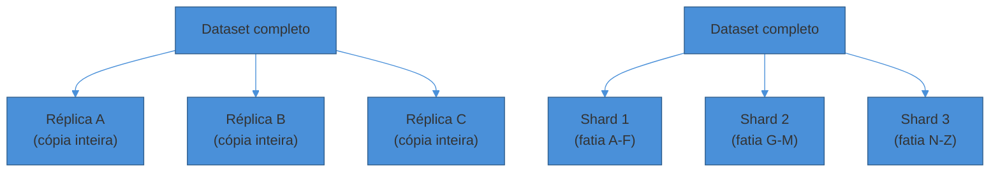
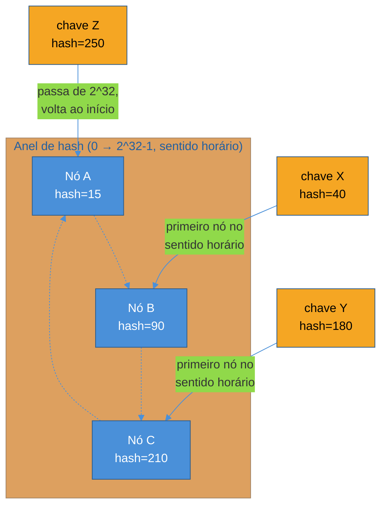
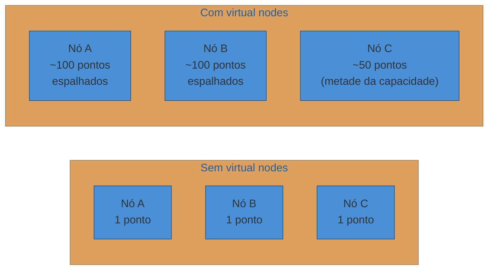
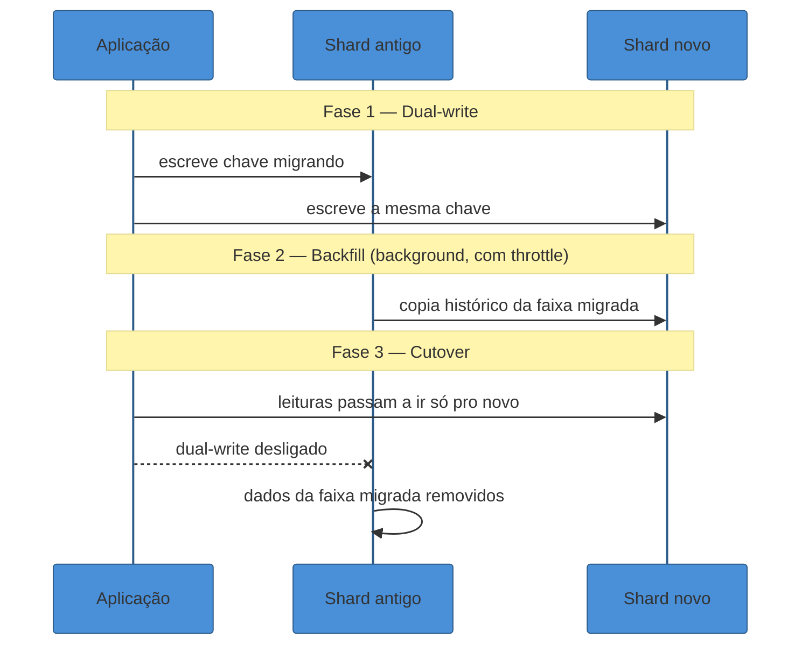

# Sharding e Consistent Hashing

> [!abstract] TL;DR
> Replicação copia o dado inteiro em várias máquinas; **sharding fatía** o dado, e cada máquina guarda só a sua fatia — é a resposta para quando um único nó não cabe mais o dataset ou não aguenta mais o volume de escrita. A estratégia mais simples de particionamento, **hash da chave `% N`**, tem um defeito fatal: toda vez que `N` muda — um nó entra ou sai — quase **todas** as chaves são reembaralhadas para shards diferentes, disparando uma migração de dados descomunal. **Consistent hashing** resolve isso posicionando nós e chaves no mesmo anel de hash (0 a 2³²-1): uma chave pertence ao primeiro nó encontrado andando no sentido horário a partir da sua posição. Quando um nó entra ou sai, só as chaves entre ele e seu vizinho anterior se movem — em média **K/N** chaves, não quase todas. **Virtual nodes** — cada nó físico ocupa dezenas ou centenas de pontos no anel, não um só — resolvem o problema seguinte: distribuição desigual e incapacidade de refletir capacidades heterogêneas entre nós. Junto com a escolha certa da **shard key** (evitando hot spots — chaves de baixa cardinalidade ou "chaves celebridade" que concentram tráfego), sharding é o building block que aparece por trás de quase todo banco distribuído: DynamoDB, Cassandra, MongoDB, e é o mesmo mecanismo usado em load balancers e CDNs para rotear consistentemente.

Uma equipe de e-commerce shardeou o catálogo de produtos por `category_id % 4` — quatro shards, um por categoria numérica. Fazia sentido no papel: distribuir a carga de forma previsível, sem tabela de lookup.

Chegou a Black Friday. O shard 2 — que por acaso concentrava "Eletrônicos" — recebeu 80% do tráfego de leitura do dia inteiro. Os outros três shards ficaram praticamente ociosos, enquanto o shard 2 saturava CPU e I/O, derrubando latência para toda a categoria mais vendida do evento.

O particionamento estava matematicamente correto — cada chave caía sempre no mesmo shard, sem ambiguidade. E ainda assim o sistema caiu, porque a distribuição *lógica* das chaves não tinha nada a ver com a distribuição *real* do tráfego. Isso é um **hot spot**: uma fatia do sistema recebendo carga desproporcional, enquanto o resto do cluster observa de camarote.

Esse é o primeiro problema que sharding introduz. O segundo aparece um mês depois, quando a equipe decide adicionar um quinto shard para aliviar o shard 2: com `% N` mudando de 4 para 5, o resultado de `hash(chave) % N` muda para praticamente **toda** chave do sistema — não só as que deveriam migrar para o novo nó. A "correção" de um shard sobrecarregado virou uma migração de 100% do dataset.

Esta nota é sobre os dois problemas — hot spots e rebalanceamento caótico — e a técnica que resolve o segundo: **consistent hashing**.

## Sharding não é replicação

A nota anterior deste sub-galho tratou de [[03 - Bancos de dados em escala - SQL vs NoSQL e replicação|replicação]]: N cópias *completas* do mesmo dado, para escalar leitura e disponibilidade. Sharding ataca um problema diferente — **volume**. Quando o dataset inteiro não cabe (ou não é servido com throughput suficiente) num único nó, ele é dividido em fatias, e cada nó guarda só a sua.

Na prática, sistemas grandes fazem os dois ao mesmo tempo: o dataset é **sharded** em fatias, e **cada shard é replicado** — Cassandra, MongoDB e DynamoDB funcionam exatamente assim. Os eixos são ortogonais: replicação resolve "quantas cópias de cada pedaço", sharding resolve "em quantos pedaços eu corto".

> [!question]- Se sharding e replicação resolvem coisas diferentes, quando eu preciso de sharding e não só de mais réplicas?
> Réplicas de leitura resolvem *throughput de leitura* — mais cópias, mais capacidade de servir `SELECT`s em paralelo. Elas não resolvem dois problemas: (1) o dataset é grande demais para caber no disco de uma máquina, mesmo que só uma escreva; (2) o volume de *escrita* excede o que um único leader aguenta, porque toda escrita ainda passa por ele independente de quantas réplicas de leitura existam. Sharding ataca os dois: cada shard recebe só uma fatia dos dados (resolve capacidade) e cada shard tem seu próprio caminho de escrita (resolve throughput de escrita, porque agora há N leaders escrevendo em paralelo, um por shard). Em entrevista, o sinal de senioridade é dizer isso explicitamente: "réplicas resolvem leitura; se a escrita ou o volume também estourarem, aí eu shardeio."

### Quando ainda não vale shardear

Vale nomear o lado oposto do trade-off, porque é onde muita gente erra em entrevista por excesso de zelo: sharding não é grátis. Ele complica transações (uma transação que precisa tocar dados em dois shards deixa de ser um `BEGIN`/`COMMIT` local e vira um problema de transação distribuída), complica índices secundários (um índice por "email do usuário" quando a chave de shard é `user_id` normalmente exige um índice global replicado, com sua própria complexidade de consistência), e — como visto na seção de fan-out mais adiante — complica qualquer query que não seja um lookup exato pela chave.

O sinal de maturidade não é saber shardear; é saber **quando ainda não precisa**. Um Postgres bem indexado, com réplicas de leitura, aguenta a esmagadora maioria dos sistemas que aparecem em entrevista — dezenas de milhões de linhas, milhares de QPS. Sharding entra em cena quando os números do passo de estimativas (ver [[03 - Estimativas de escala (back-of-envelope)|Estimativas de escala]] no sub-galho 1) mostram, com dados concretos, que um único nó não sustenta o volume — não porque "sistemas grandes de verdade têm sharding".

## Estratégias de particionamento

Existem quatro formas recorrentes de decidir em qual shard uma linha de dado vai parar. Cada uma troca uma vantagem por uma fraqueza específica.

**Range-based (particionamento por intervalo).** As chaves são ordenadas, e cada shard guarda um intervalo contíguo — por exemplo, usuários com sobrenome A-F no shard 1, G-M no shard 2. A vantagem é que **range scans são baratos**: "todos os pedidos entre 1º e 15 de julho" caem, na maioria dos casos, num único shard ou em poucos vizinhos.

A fraqueza é justamente o cenário de abertura: se o tráfego se concentra num intervalo — uma faixa de datas recente, um intervalo de IDs sequenciais crescendo agora — esse shard vira hot spot enquanto os outros ficam ociosos. Bigtable e HBase usam range-based; é por isso que ambos recomendam **salting** de chave (prefixar com um valor pseudo-aleatório) quando as escritas são sequenciais no tempo.

**Hash-based.** A chave passa por uma função de hash antes de decidir o shard: `shard = hash(key) % N`. Isso **distribui as chaves uniformemente** — não importa se os IDs são sequenciais ou concentrados, o hash os espalha. O preço é que a ordem se perde: um range scan em hash-based precisa consultar *todos* os shards e agregar o resultado na aplicação, porque chaves vizinhas na ordem original acabam em shards arbitrários.

**Geo-based (particionamento geográfico).** O shard é escolhido pela localização do usuário ou do recurso — dados de usuários da América do Norte num cluster, da Europa noutro. Reduz latência (dado fica perto de quem acessa) e ajuda com requisitos de residência de dados (GDPR e leis similares exigem que dado de cidadão europeu fique fisicamente na UE). A fraqueza é desbalanceamento: se 10x mais usuários estão na América do Norte que na Oceania, os shards nunca terão carga equivalente por construção.

**Directory-based (baseado em diretório).** Um serviço de lookup central mantém um mapa explícito `chave → shard`, em vez de calcular a posição por uma fórmula. Dá flexibilidade máxima — você pode mover qualquer chave para qualquer shard a qualquer momento, ideal para rebalancear "manualmente" hot spots específicos. A fraqueza é que o serviço de diretório vira, ele mesmo, um ponto único de falha e de gargalo: toda operação passa por uma consulta extra antes de chegar ao shard certo.

Na prática, geo-based e directory-based raramente aparecem sozinhos — o padrão mais comum combina os dois: geo-based decide a *região* (América do Norte, Europa, Ásia), e dentro de cada região um esquema hash-based ou range-based decide o shard específico. O serviço de diretório, quando existe, costuma cobrir só a camada mais alta dessa hierarquia — "qual região serve este usuário" — não cada chave individual, o que reduz a pressão sobre ele a algo cacheável e raramente atualizado, em vez de um lookup por request.

| Estratégia | Bom para | Risco principal |
|---|---|---|
| Range-based | Range scans, ordenação | Hot spot em chaves sequenciais/recentes |
| Hash-based | Distribuição uniforme | Perde ordem; range scan vira fan-out |
| Geo-based | Latência, residência de dado | Desbalanceamento entre regiões |
| Directory-based | Flexibilidade, rebalanceamento fino | Serviço de diretório é gargalo/SPOF |

> [!warning] Escolher a shard key errada é o erro mais caro do sharding
> **O que acontece:** a equipe escolhe uma chave de baixa cardinalidade (poucos valores distintos, como `status` ou `country`) ou uma chave "celebridade" (um valor concentra volume desproporcional — um usuário com 50M seguidores, um produto viral). **Por quê:** o particionamento é matematicamente correto — a mesma chave sempre cai no mesmo shard — mas a distribuição *real* de tráfego não é uniforme sobre o espaço de chaves. Um shard vira hot spot; os outros ficam ociosos. **Como evitar:** escolha uma shard key de **alta cardinalidade** e cujo padrão de acesso seja o mais uniforme possível — `user_id`, não `country`. Para casos celebridade que não têm solução por chave (um usuário genuinamente recebe 1000x mais tráfego), a saída costuma ser híbrida: tratar esse registro fora do esquema padrão de sharding, com cache dedicado ou réplicas extras só para ele. Isso é o mesmo problema do fan-out de celebridade em feeds — reaparece em qualquer sistema com distribuição de popularidade em cauda longa.

### Mitigando hot spots na prática

Mesmo com uma shard key de alta cardinalidade bem escolhida, hot spots reaparecem sob condições específicas — vale conhecer as três táticas mais usadas para tratá-los, porque "escolher uma boa chave" nem sempre é suficiente sozinho.

**Salting de chave.** Quando a chave natural é sequencial no tempo (um `order_id` autoincremental, um timestamp de evento), prefixe-a com um valor pseudo-aleatório antes de hashear — `salt:order_id` em vez de `order_id` puro. Isso espalha escritas que naturalmente aconteceriam "todas agora" (o intervalo de tempo mais recente) por vários shards em vez de concentrá-las num só. O custo é que uma leitura por intervalo de tempo agora precisa consultar todos os valores de salt possíveis, reintroduzindo fan-out — outro exemplo do trade-off leitura-vs-escrita que atravessa toda esta nota.

**Cache na frente do shard quente.** Se o hot spot é read-heavy — muitos leitores batendo na mesma chave celebridade — colocar uma camada de [[02 - Caching|cache]] (ver nota 02 deste sub-galho) na frente do shard absorve a maior parte da carga antes que ela chegue ao banco. É a solução mais barata quando o problema é leitura concentrada, não escrita.

**Split dedicado para outliers.** Quando um único valor de chave (um usuário, um produto) é estruturalmente grande demais para conviver no shard compartilhado — não é questão de má escolha de chave, é que aquele registro específico é uma exceção genuína — a saída é tirá-lo do esquema de sharding padrão e dar a ele um shard, ou um conjunto de réplicas, só seu. Sistemas de rede social fazem isso com contas de milhões de seguidores; e-commerces fazem isso com o produto viral do dia. É uma exceção operacional, não uma regra geral — tratar todo shard como candidato a split dedicado tira o benefício de uniformidade que o sharding buscava resolver em primeiro lugar.

## O problema do `hash % N`

Mesmo tendo escolhido hash-based para fugir de hot spots de range, resta um problema estrutural: a fórmula mais óbvia, `shard = hash(key) % N`, é péssima para *mudar* de tamanho.

Considere `N = 4` shards. A chave `"user:42"` tem `hash("user:42") = 1000`, então `1000 % 4 = 0` — vai para o shard 0. Isso funciona perfeitamente até o dia em que você adiciona um quinto shard, e `N` vira 5. Agora `1000 % 5 = 0`... coincidência, essa ficou no lugar. Mas a maioria não fica: uma chave com hash 1001 ia para `1001 % 4 = 1` e passa a ir para `1001 % 5 = 1` — ok, essa também não mudou. Só que uma com hash 1004 ia para `1004 % 4 = 0` e agora vai para `1004 % 5 = 4` — mudou.

O motivo de fundo é que `%` não tem **nenhuma garantia estrutural** de que o resultado para `N` e para `N+1` vão coincidir — o resto da divisão depende do padrão de bits do hash de um jeito que não preserva continuidade quando o divisor muda. Não existe uma fórmula fechada elegante para "quantas chaves ficam no lugar" nesse esquema — na prática, medições empíricas (como a do exemplo trabalhado mais adiante nesta nota, com 8 chaves e uma mudança de 4 para 5 shards) mostram tipicamente **70-90% de churn** numa mudança de tamanho pequena, e o número só piora conforme o cluster cresce.

O efeito prático, independente da fração exata: **quase todo o dataset precisa ser copiado do shard antigo para o novo mapeamento**, de uma vez. Para um cluster de terabytes, isso significa horas ou dias de migração, com o sistema competindo entre servir tráfego de produção e mover dados — exatamente o tipo de operação arriscada que ninguém quer rodar às pressas quando o motivo original foi "um shard está saturando".

Compare isso com o comportamento de consistent hashing, detalhado na próxima seção: lá sim existe uma garantia estrutural — mover de N para N+1 nós move, em expectativa, exatamente `1/(N+1)` da fração de chaves, porque a mudança é local ao anel, não global ao espaço inteiro de restos.

> [!question]- Por que não simplesmente reservar `N` grande desde o início e nunca mudar?
> Você pode adiar o problema, mas não eliminá-lo. Super-provisionar shards desde o dia 1 desperdiça capacidade (cada shard tem overhead fixo — conexões, memória, processos), e mesmo assim, cedo ou tarde, um shard cresce mais que os outros, ou uma máquina falha e precisa ser substituída, o que também é uma mudança de `N` na prática. O problema de fundo não é "quantos shards eu tenho hoje" — é que **qualquer sistema que precisa crescer vai, em algum momento, mudar de tamanho**, e `hash % N` trata essa mudança como um evento catastrófico em vez de incremental. É esse desenho ruim, não a falta de planejamento, que consistent hashing resolve.

## Consistent hashing: o anel

A ideia central, publicada por Karger et al. em 1997 no paper *"Consistent Hashing and Random Trees"* (motivada originalmente por cache distribuído na Web, não por bancos de dados), é simples de descrever e poderosa na prática: em vez de mapear uma chave diretamente a um índice de shard via `%`, mapeie **tanto os nós quanto as chaves para pontos no mesmo espaço** — um anel circular de hash, tipicamente de 0 a 2³²-1 (ou 2¹⁶⁰-1, dependendo da função de hash usada).

O algoritmo de atribuição é mecânico:

1. Cada **nó** (servidor, shard) é posicionado no anel calculando `hash(node_id)`.
2. Cada **chave** também é posicionada, calculando `hash(key)`.
3. A chave pertence ao **primeiro nó encontrado andando no sentido horário** a partir da posição da chave.

Repare no comportamento de `K3`: como o anel é circular, uma chave posicionada depois do último nó "dá a volta" e cai no primeiro nó, fechando o círculo. É por isso que se chama anel, não linha.

Agora o ponto que resolve o problema da seção anterior: **o que acontece quando o Nó B sai do anel (falha ou é removido)?**

Só as chaves que estavam entre o Nó A e o Nó B — as que apontavam para B como "primeiro nó no sentido horário" — precisam se mover, e elas se movem para o **próximo** nó no sentido horário, que é o Nó C. Todas as outras chaves, atribuídas a A e a C, **não são afetadas**. Nenhum recálculo global, nenhuma realocação em cascata.

O mesmo vale para adicionar um nó: um novo Nó D entra em algum ponto do anel, e só as chaves entre o nó anterior a D e o próprio D migram — do nó que as servia antes para D. Formalmente: com N nós e K chaves, adicionar ou remover um nó move em média **K/N chaves**, não uma fração fixa e alta do dataset inteiro. Essa é a propriedade central que faz consistent hashing valer a complexidade adicional: rebalanceamento **local**, proporcional ao tamanho de um shard, não ao dataset inteiro.

> [!question]- "Sentido horário" parece arbitrário — por que não simplesmente o nó mais próximo?
> É uma convenção, não uma escolha com peso matemático — poderia ser sentido anti-horário, o importante é que **todos os clientes usem a mesma regra**, senão cada um roteia a mesma chave para um nó diferente. A vantagem de "primeiro encontrado numa direção fixa" sobre "mais próximo" é que ela é barata de calcular (basta uma busca binária ordenada pelos hashes dos nós) e determinística sem ambiguidade — "mais próximo" teria empates e exigiria desempate arbitrário de qualquer forma. Na prática, a implementação mantém os hashes dos nós numa estrutura ordenada (árvore balanceada, ou array ordenado com busca binária) e a consulta é `O(log N)`.

## Virtual nodes: por que um nó não basta ser um ponto só

O desenho descrito até aqui — cada nó físico ocupa **um único ponto** no anel — tem dois problemas na prática, e é por isso que nenhuma implementação real (Dynamo, Cassandra, DynamoDB) usa a versão ingênua.

**Problema 1 — distribuição desigual.** Com poucos nós, os pontos caem no anel de forma essencialmente aleatória, e hashes aleatórios não se distribuem uniformemente em poucas amostras — da mesma forma que jogar 4 dados não te dá exatamente uma ocorrência de cada face. Um nó pode acabar "dono" de um arco muito maior do anel que os outros, simplesmente pela aleatoriedade da função de hash, recriando o próprio hot spot que consistent hashing deveria evitar.

**Problema 2 — capacidade heterogênea.** Nem todo nó físico tem a mesma capacidade. Se você tem uma máquina com o dobro de RAM e CPU das outras, ela deveria servir o dobro de tráfego — mas "um nó, um ponto no anel" trata todos os nós como iguais por construção.

A solução, descrita no paper da Amazon *"Dynamo: Amazon's Highly Available Key-value Store"* (SOSP 2007), é dar a **cada nó físico múltiplos pontos no anel** — dezenas a centenas de "nós virtuais" (`node-A-1`, `node-A-2`, ..., `node-A-100`, cada um hasheado separadamente). Cada nó virtual se comporta como um nó independente para efeito do algoritmo de atribuição; o nó físico é apenas dono de vários pontos espalhados pelo anel, não um só.

Isso resolve os dois problemas de uma vez: **distribuição** melhora porque, com centenas de pontos por nó espalhados aleatoriamente, a lei dos grandes números garante que a soma dos arcos de cada nó converge para proporções aproximadamente iguais — mesmo que cada ponto individual seja pequeno e desigual. E **heterogeneidade** é resolvida atribuindo mais pontos virtuais a nós mais capazes: um nó com o dobro de capacidade recebe o dobro de nós virtuais, e por construção recebe aproximadamente o dobro de chaves.

Virtual nodes também melhoram a recuperação de falhas: quando um nó físico cai, sua carga — antes concentrada num único vizinho no sentido horário — agora está espalhada entre **muitos** vizinhos diferentes (um por nó virtual), porque cada nó virtual tinha um vizinho potencialmente diferente. Isso evita que a queda de um nó sobrecarregue um único sobrevivente.

O número de virtual nodes por nó físico é, em si, um trade-off — não existe "quanto mais, melhor" sem limite. Mais pontos por nó melhoram a uniformidade da distribuição (mais amostras, menos variância), mas custam memória (cada ponto precisa de uma entrada na estrutura de lookup) e tornam operações como reparo e substituição de nó mais caras, porque um nó com mais pontos tem mais vizinhos diferentes no anel, e cada vizinho é uma transferência de dados potencial numa falha. É exatamente essa tensão que levou o Cassandra a reduzir seu padrão de 256 para 16 pontos por nó — ver a seção de sistemas reais mais adiante nesta nota.

> [!question]- Como escolher quantos virtual nodes usar, na prática?
> Não existe um número universal — depende do tamanho do cluster e da tolerância a custo operacional de reparo. Clusters pequenos (dezenas de nós) toleram mais pontos por nó, porque o custo de coordenação entre poucos vizinhos é baixo; clusters grandes (centenas de nós, como no caso que motivou a mudança do Cassandra) sofrem com muitos pontos, porque cada nó acaba compartilhando faixas de dados com uma fração grande demais dos outros nós, tornando qualquer falha ou manutenção uma operação que toca o cluster inteiro. A resposta pragmática de entrevista é: "eu começaria com uma centena de pontos por nó, e reduziria se o cluster crescesse a ponto de reparo/substituição de nó virarem um gargalo operacional visível" — não é preciso saber o número exato de cor, é preciso saber que o número é uma variável de ajuste, não uma constante mágica.

> [!warning] Rebalanceamento mínimo não é rebalanceamento gratuito
> **O que acontece:** a equipe assume que, por consistent hashing só mover K/N chaves, adicionar ou remover nós é uma operação "de graça" que pode ser feita a qualquer hora sem planejamento. **Por quê:** K/N ainda pode ser um volume de dados enorme em termos absolutos — se um shard guarda 500GB, mover a fatia dele para um vizinho ainda é uma transferência de rede e I/O significativa, mesmo sendo "só" uma fração do cluster total. Além disso, durante a migração, o sistema típico ainda precisa servir tráfego de leitura/escrita consultando os dois locais (o antigo e o novo), o que adiciona complexidade operacional real. **Como evitar:** trate resharding como uma operação com custo — throttle da taxa de migração para não competir com tráfego de produção, monitore o lag entre origem e destino, e prefira adicionar capacidade em lotes planejados em vez de reagir nó a nó a cada pico. Consistent hashing torna o *volume* do rebalanceamento tratável; não o torna instantâneo nem gratuito.

## O custo que sharding sempre cobra: fan-out de query

Mesmo com a shard key certa e consistent hashing bem implementado, sharding introduz um custo estrutural que não tem solução completa: **qualquer query que não seja um lookup exato pela shard key precisa consultar múltiplos shards e agregar o resultado na aplicação**.

"Buscar o pedido #4471" é barato — o `order_id` é a shard key, então um único shard responde. Mas "listar todos os pedidos acima de R$500 feitos essa semana" não tem shard key nenhuma que resolva isso num nó só, a menos que os dados tenham sido explicitamente organizados para esse padrão de query. A query vira **fan-out**: o coordenador dispara a mesma pergunta para todos os shards, espera todas as respostas, e agrega (soma, ordena, pagina) no nível da aplicação ou de uma camada de agregação dedicada.

Isso tem duas consequências que valem a pena antecipar em entrevista: a **latência da query passa a ser a do shard mais lento** (cauda longa — se um shard está sob pressão, toda a query fica lenta, mesmo que os outros N-1 tenham respondido rápido), e a **complexidade de agregação sobe** de "o banco faz" para "a aplicação faz" — paginação distribuída, ordenação global e contagens agregadas deixam de ser triviais.

Em uma frase: **sharding troca "um nó lento serve tudo" por "N nós rápidos servem cada fatia, mas queries cross-shard pagam o preço de juntar tudo de volta".**

## Um exemplo trabalhado: `hash % N` vs anel, lado a lado

Para tornar concreta a diferença de rebalanceamento, veja os dois esquemas operando sobre o mesmo conjunto de 8 chaves, primeiro com 4 shards e depois com 5.

**Com `hash % N`.** Suponha os hashes das chaves: 3, 11, 18, 24, 31, 37, 44, 52. Com `N = 4`:

| Chave (hash) | `hash % 4` | Shard |
|---|---|---|
| 3 | 3 | 3 |
| 11 | 3 | 3 |
| 18 | 2 | 2 |
| 24 | 0 | 0 |
| 31 | 3 | 3 |
| 37 | 1 | 1 |
| 44 | 0 | 0 |
| 52 | 0 | 0 |

Agora adicione um quinto shard, `N = 5`:

| Chave (hash) | `hash % 5` | Shard | Mudou? |
|---|---|---|---|
| 3 | 3 | 3 | não |
| 11 | 1 | 1 | **sim** (era 3) |
| 18 | 3 | 3 | **sim** (era 2) |
| 24 | 4 | 4 | **sim** (era 0) |
| 31 | 1 | 1 | **sim** (era 3) |
| 37 | 2 | 2 | **sim** (era 1) |
| 44 | 4 | 4 | **sim** (era 0) |
| 52 | 2 | 2 | **sim** (era 0) |

Sete de oito chaves — **87%** — trocaram de shard, para adicionar um único nó novo. Em produção, isso significa copiar quase o dataset inteiro entre máquinas antes que o novo shard sirva uma única leitura útil.

**Com consistent hashing.** As mesmas 8 chaves e os mesmos 4 nós, agora posicionados no anel (nós em posições fixas: A=5, B=20, C=35, D=50, andando no sentido horário, voltando ao início após o maior valor de hash):

Antes de adicionar o quinto nó, cada chave pertence ao primeiro nó à sua frente no sentido horário: 3→A(5), 11→B(20), 18→B(20), 24→C(35), 31→C(35), 37→D(50), 44→D(50), 52→A(5, dando a volta).

Adicione um novo nó E na posição 40 (entre C=35 e D=50). Pela regra do anel, só as chaves que estavam entre C(35) e D(50) — que antes apontavam para D — agora podem apontar para E, se estiverem antes de 40. Checando: 37 está entre 35 e 40, então migra de D para E. As chaves 44 e 52 continuam com D e A, sem mudança. Nenhuma outra chave é afetada.

**Resultado: 1 de 8 chaves migrou (12,5%), contra 7 de 8 (87%) do `hash % N`.** É essa diferença de ordem de grandeza — não uma otimização marginal — que faz consistent hashing ser o desenho padrão de qualquer sistema particionado que precisa crescer sem downtime.

## Resharding: o custo operacional que a matemática não mostra

Consistent hashing resolve *quantas* chaves precisam se mover. Não resolve *como* movê-las com segurança — essa parte é puramente operacional, e é onde projetos de sharding real gastam a maior parte do esforço de engenharia.

O padrão mais comum em produção é a **migração online em três fases**, evitando parar o sistema:

1. **Dual-write.** No momento em que um novo shard (ou nó virtual) entra no anel, o sistema passa a escrever tanto no shard antigo quanto no novo, para as chaves que estão migrando. Isso garante que nenhuma escrita se perca durante a transição.
2. **Backfill.** Um processo em background copia o histórico de dados do shard antigo para o novo, para as chaves na faixa migrada — tipicamente em lotes, com *throttling* explícito para não competir por I/O com tráfego de produção.
3. **Cutover e limpeza.** Depois que o backfill termina e os dois lados estão consistentes, as leituras passam a ser servidas só pelo novo shard, e o dual-write é desligado. Os dados antigos, agora redundantes, são removidos do shard de origem.

Esse padrão é essencialmente o mesmo usado para migrar de schema em bancos relacionais sem downtime (expand-contract), aplicado ao nível de topologia de shard em vez de coluna. A diferença é a escala: aqui está em jogo um volume de dados que pode levar horas para copiar, não milissegundos.

> [!warning] Resharding manual, ad-hoc, é a forma mais comum de incidente de sharding
> **O que acontece:** um shard começa a saturar, e alguém dispara manualmente a adição de um nó, sem throttling de migração nem monitoramento de lag entre origem e destino. **Por quê:** a migração de dados compete diretamente por I/O e banda com o tráfego de produção que já estava sob pressão — a "solução" piora o sintoma antes de resolvê-lo, e sem visibilidade do progresso, ninguém sabe se está a 10% ou 90% do caminho. **Como evitar:** trate resharding como uma operação com runbook: throttle configurável de taxa de cópia, dashboard de progresso e lag, e um critério objetivo de "pronto para cutover" (ex: lag de backfill abaixo de X segundos por Y minutos seguidos). Sistemas maduros (Cassandra, Vitess, MongoDB com balancer) automatizam essas três fases; construir isso à mão só se justifica em sistemas proprietários sem essa automação pronta.

## Consistent hashing em sistemas reais

Vale ancorar a teoria em números concretos de implementações que você provavelmente vai citar em entrevista.

**Cassandra** usa consistent hashing com virtual nodes desde a versão 1.2. Até a versão 3.x, o padrão era **256 nós virtuais por nó físico** (`num_tokens = 256`) — escolhido para garantir distribuição uniforme via aleatoriedade estatística, mesmo em clusters pequenos. Na prática, esse número se mostrou alto demais: com 256 tokens por nó, cada nó acaba com faixas de dados sobrepostas com praticamente *todos* os outros nós do cluster, o que torna operações de reparo (`repair`) e substituição de nó lentas e caras — quanto mais vizinhos um nó tem no anel, mais transferências de dados uma falha dispara. A partir da Cassandra 4.0, o padrão caiu para **16 tokens**, combinado com um algoritmo de alocação mais inteligente que distribui os tokens deliberadamente (não mais puramente aleatório) para manter uniformidade com muito menos pontos por nó.

**DynamoDB / Dynamo** (o paper de 2007) populariza o padrão que este texto descreveu: virtual nodes proporcionais à capacidade declarada de cada nó físico, permitindo que uma máquina mais forte assuma mais fatias do anel sem mudar o algoritmo de atribuição.

**Memcached** (client-side sharding) foi um dos primeiros usos práticos de consistent hashing fora de caches web acadêmicos — bibliotecas cliente (ex: `libketama`) implementam o anel no lado do aplicativo, permitindo adicionar/remover servidores de cache sem invalidar o cache inteiro, que é exatamente o cenário que motivou o paper original de Karger em 1997.

**Load balancers**, tratados na [[01 - Escalabilidade e load balancing|nota 01 deste sub-galho]], usam o mesmo mecanismo para *afinidade de sessão* — garantir que requisições de um mesmo usuário caiam sempre no mesmo backend, sem manter uma tabela de sessão centralizada. O problema resolvido é idêntico ao de particionar dados: rotear uma chave (aqui, o identificador do usuário ou da sessão) de forma estável, mesmo quando o número de backends muda. É a mesma matemática, aplicada a "qual servidor atende esse request" em vez de "qual shard guarda esse dado".

| Sistema | Uso de consistent hashing | Detalhe notável |
|---|---|---|
| Cassandra | Particionamento de dados entre nós | 256 vnodes/nó até a 3.x; 16 a partir da 4.0, com alocação determinística |
| DynamoDB / Dynamo | Particionamento + replicação | Vnodes proporcionais à capacidade declarada do nó |
| Memcached (`libketama`) | Roteamento client-side de chaves de cache | Anel calculado no cliente, sem coordenação central |

> [!question]- Existem alternativas ao anel de consistent hashing?
> Sim, e vale conhecer os nomes porque aparecem em entrevistas mais avançadas. **Rendezvous hashing** (também chamado *Highest Random Weight*, HRW), publicado em 1996 — um ano *antes* do paper de Karger — não usa anel: para cada chave, calcula um "peso" combinando a chave com o identificador de cada nó, e a chave vai para o nó de maior peso. Tem a mesma propriedade de rebalanceamento mínimo, mas custa `O(N)` por lookup (precisa calcular o peso contra todos os N nós), o que fica caro em clusters muito grandes. **Jump Consistent Hash**, publicado pelo Google em 2014, troca flexibilidade por velocidade: não guarda estado nenhum (o algoritmo cabe em ~5 linhas), é mais rápido e distribui melhor que o anel clássico, mas exige que os nós sejam numerados sequencialmente (0, 1, 2, ...) — o que o torna ótimo para sistemas de armazenamento com um coordenador central, mas inadequado para cache distribuído sem coordenação, o caso de uso original de Karger. Em entrevista, mencionar que essas alternativas existem — sem precisar detalhar a matemática — já é sinal de profundidade além do "decorei o nome consistent hashing".

## Em entrevista

Sharding costuma entrar de duas formas: como parte do diagrama macro ("como você distribui esse dataset de 50TB?") ou como o deep dive inteiro de um walkthrough de banco de dados distribuído — a nota 08 do sub-galho de walkthroughs (Distributed Key-Value Store) é literalmente construída em cima deste tópico.

O roteiro que sinaliza senioridade:

1. **Justifique por que precisa de sharding**, não só de mais réplicas — volume de dados ou throughput de escrita excedendo um nó, com números.
2. **Escolha a shard key em voz alta**, comentando cardinalidade e risco de hot spot: "vou usar `user_id`, alta cardinalidade, evita concentração — se fosse `country` eu teria um shard de Brasil gigante e um de Islândia vazio."
3. Se a pergunta tocar em rebalanceamento — "e se você precisar adicionar mais um shard?" — é o gancho para **consistent hashing**. Não é preciso desenhar o anel inteiro no quadro; basta nomear o mecanismo e explicar o resultado: "eu uso consistent hashing em vez de `hash % N` puro, porque adicionar um nó só move `K/N` chaves, não o dataset inteiro — e uso virtual nodes para não ter distribuição desigual entre poucos nós."
4. **Antecipe o custo de fan-out**: se o sistema precisa de queries analíticas ou cross-shard, mencione que isso vira agregação na aplicação ou exige uma camada separada (data warehouse, índice secundário replicado) — mostra que você enxergou o trade-off, não só o benefício.

> [!question]- O entrevistador vai pedir pra eu "desenhar o anel"?
> Raramente pede o desenho geométrico completo — o sinal que ele busca é se você sabe **por que** `hash % N` falha e **o que** consistent hashing resolve, não uma prova matemática no quadro. Uma boa resposta verbal, com um esboço simples de 3-4 nós e 2-3 chaves no anel, já demonstra o entendimento. Onde as entrevistas realmente aprofundam é em virtual nodes — "por que não bastam nós físicos direto no anel?" é uma pergunta clássica de follow-up, e a resposta (distribuição desigual + heterogeneidade de capacidade) é o que separa quem decorou o nome "consistent hashing" de quem entende o mecanismo.

### A mesma pergunta, duas conduções

Para tornar concreto o que separa um candidato mediano de um forte, veja "como você distribui um dataset de pedidos de e-commerce que já não cabe num único banco?" respondida de duas formas.

**Condução fraca (só nomes):**

> "Eu shardearia por `order_id` usando hash. E usaria consistent hashing para não ter que remapear tudo quando adicionar um shard novo."

Tecnicamente correto, e vazio. Não diz *por que* `order_id` é uma boa chave, não menciona o custo de queries cross-shard que a própria escolha de `order_id` implica (um relatório "todos os pedidos do cliente X" agora precisa varrer todos os shards, porque a chave é o pedido, não o cliente), e não antecipa nenhum modo de falha.

**Condução forte (mesma arquitetura, raciocínio visível):**

> "Antes de escolher a chave, preciso saber o padrão de acesso dominante: é 'buscar um pedido pelo ID' ou 'listar os pedidos de um cliente'? Se for majoritariamente o segundo, eu shardeio por `customer_id`, não por `order_id` — assim, o histórico de um cliente inteiro fica num shard só, e evito fan-out na query mais comum. O trade-off é que um cliente com volume de pedidos anormal — uma conta corporativa gigante — vira hot spot; eu trataria isso como exceção, com um shard dedicado se acontecer.
>
> Para o mecanismo de distribuição, eu uso consistent hashing com virtual nodes em vez de `hash % customer_id % N` puro — isso importa porque esse é um sistema que vai crescer, e eu não quero que adicionar um shard implique remapear 80% do dataset. Se o volume de escrita justificar, eu também considero salting para os pedidos mais recentes, já que pedidos novos tendem a ser lidos com mais frequência logo após a criação — isso evita que o shard 'de hoje' vire hot spot."

A segunda condução amarrou a shard key ao **padrão de acesso real** (não um exemplo genérico), nomeou o trade-off que a escolha introduz, e conectou consistent hashing a um motivo concreto ("esse sistema vai crescer") em vez de citá-lo como buzzword. É essa amarração — chave, trade-off, mecanismo, motivo — que a rubrica de profundidade técnica está de fato medindo.

## Como explicar em inglês

Sharding splits a dataset across multiple nodes, where each node owns a slice of the data — as opposed to replication, which copies the *entire* dataset onto multiple nodes. You shard when a single node can't hold the full dataset or can't handle the write throughput; you replicate when you need more read capacity or availability. Large systems typically do both: shard first, then replicate each shard.

The naive partitioning formula, `hash(key) % N`, breaks badly when `N` changes — adding or removing a node reshuffles nearly every key, because the modulo result is sensitive to the divisor. **Consistent hashing** fixes this by mapping both nodes and keys onto the same hash ring; a key belongs to the first node found walking clockwise from its position. Removing or adding a node only moves the keys between it and its neighbor — on average `K/N` keys, not the whole dataset.

**Virtual nodes** — giving each physical node many points on the ring instead of one — solve two follow-up problems: uneven distribution with few nodes, and the inability to reflect heterogeneous node capacity. This is exactly what Amazon's Dynamo paper (2007) does, building on Karger et al.'s original 1997 consistent hashing paper.

> "I'd shard by `user_id` — high cardinality, avoids hot spots. For rebalancing, I'd use consistent hashing with virtual nodes instead of plain `hash % N`, so adding a node only moves a fraction of the keys instead of remapping the entire dataset."

| PT | EN |
|----|----|
| Particionamento / sharding | Sharding / partitioning |
| Fatia de dado | Shard |
| Chave de partição | Shard key / partition key |
| Ponto quente / concentração de carga | Hot spot |
| Anel de hash | Hash ring |
| Nó virtual | Virtual node |
| Rebalanceamento | Rebalancing |
| Resharding | Resharding |
| Consulta em leque / cruzando shards | Fan-out / cross-shard query |
| Cardinalidade | Cardinality |
| Sentido horário | Clockwise |

## O que vem a seguir

Sharding resolveu "onde o dado mora", mas deixou um custo pendurado: sistemas de escala real não conseguem fazer tudo de forma síncrona, request-response — o fan-out de query desta nota é um exemplo pequeno de um problema maior, que é **desacoplar quem produz trabalho de quem consome**. A próxima nota trata disso com filas e processamento assíncrono. Depois, fechamos o sub-galho revisitando a pergunta que ficou pairando desde a nota 03: o que exatamente significa "consistência" quando o dado está espalhado em N shards e replicado em M cópias cada.

- [[05 - Message queues e processamento assíncrono]] — desacoplar produtor e consumidor, backpressure, garantias de entrega
- [[06 - CAP, consistência e consenso]] — CAP/PACELC, quorum, o que "consistente" quer dizer num sistema particionado

## Veja também

- [[System Design/index|System Design]] — o galho-pai e o mapa da trilha
- [[2 - Building blocks/index|Building blocks]] — o vocabulário de escala completo deste sub-galho
- [[01 - Escalabilidade e load balancing]] — consistent hashing também aparece em load balancers, para rotear a mesma chave sempre ao mesmo backend
- [[03 - Bancos de dados em escala - SQL vs NoSQL e replicação]] — o eixo complementar (cópias vs fatias) e por que sistemas grandes fazem os dois

## Fontes

- **Karger, D. et al.** — [*Consistent Hashing and Random Trees: Distributed Caching Protocols for Relieving Hot Spots on the World Wide Web*](https://dblp.org/rec/conf/stoc/KargerLLPLL97.html), STOC 1997 — o paper original que cunhou "consistent hashing", motivado por cache distribuído na Web.
- **DeCandia, G. et al. (Amazon)** — [*Dynamo: Amazon's Highly Available Key-value Store*](https://www.allthingsdistributed.com/files/amazon-dynamo-sosp2007.pdf), SOSP 2007 — a aplicação de consistent hashing com virtual nodes em um key-value store de produção; base do design do DynamoDB.
- **Kleppmann, M.** — *Designing Data-Intensive Applications*, cap. 6 (Partitioning) — estratégias de particionamento (range/hash), hot spots e rebalanceamento em profundidade.
- **Alex Xu** — *System Design Interview – An Insider's Guide, Vol. 1* — consistent hashing como tópico recorrente de entrevista, com o exemplo canônico de cache distribuído.
- **Hello Interview** — [*Consistent Hashing*](https://www.hellointerview.com/learn/system-design/deep-dives/consistent-hashing) — walkthrough moderno (2024+) do anel, virtual nodes e trade-offs, focado em entrevista.
