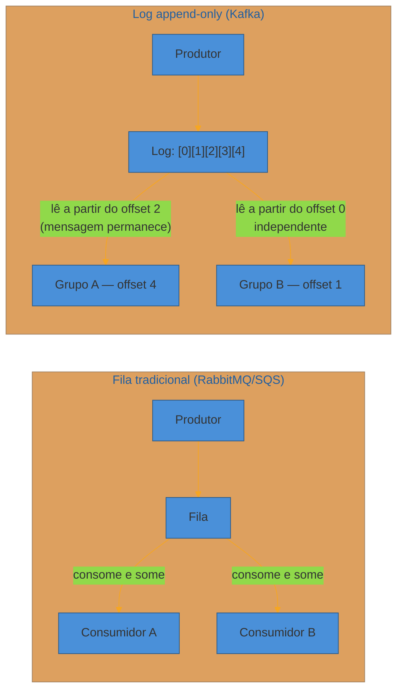
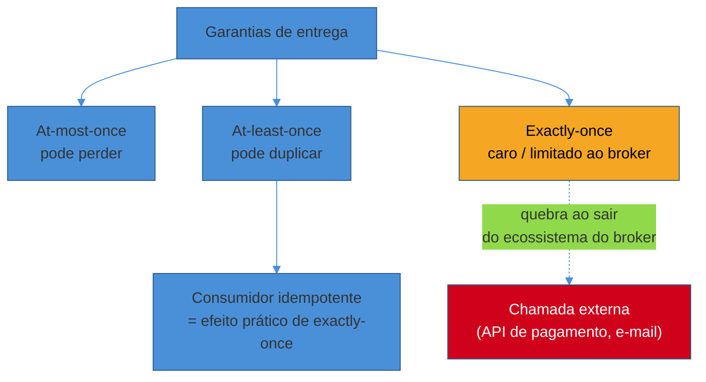

# Message queues e processamento assíncrono

> [!abstract] TL;DR
> Processamento **síncrono** amarra o sucesso de uma requisição a *todas* as etapas que ela dispara — se uma trava, a requisição inteira trava. Uma **fila** quebra essa corrente: o produtor publica uma mensagem e segue em frente; um consumidor processa quando puder. Isso desacopla serviços, absorve picos de tráfego (a fila vira buffer) e dá resiliência (o consumidor pode cair sem perder trabalho, porque a mensagem continua na fila). A escolha de design real não é "usar fila ou não" — é **fila tradicional** (mensagem some ao ser consumida, competing consumers — RabbitMQ, SQS) vs **log append-only** (mensagem persiste, replay por offset — Kafka), mais o trade-off entre garantias de entrega (*at-most-once*, *at-least-once*, *exactly-once* — este último caro e quase sempre ilusório) e o preço operacional de rodar um broker distribuído.

Um checkout de e-commerce recebe o clique em "finalizar compra". O handler, tudo síncrono, faz quatro coisas em sequência: cobra o cartão, atualiza o estoque, grava o pedido no banco e dispara um e-mail de confirmação.

Num dia normal, isso responde em 400ms. Mas hoje o provedor de e-mail está lento — a chamada SMTP leva 8 segundos para retornar (ou nunca retorna). O usuário fica olhando para uma tela de "processando..." por 8 segundos, sem saber se a compra passou. Pior: se o serviço de e-mail cair de vez, o checkout inteiro cai junto — mesmo que o cartão já tenha sido cobrado e o estoque já tenha sido baixado.

O problema não é o e-mail. É que uma etapa **irrelevante para a resposta ao usuário** (ele não precisa esperar o e-mail chegar para saber que a compra deu certo) está bloqueando uma etapa **crítica** (dizer "comprado!" na tela). O acoplamento síncrono transformou a disponibilidade do serviço de e-mail em disponibilidade do checkout inteiro.

A correção: depois de cobrar, baixar estoque e gravar o pedido — as três coisas que *precisam* estar certas antes de responder — o handler publica uma mensagem `pedido.criado` numa fila e responde "comprado!" na hora. Um consumidor separado, lendo dessa fila, dispara o e-mail quando conseguir. Se o serviço de e-mail cair, a mensagem espera na fila. Ninguém no checkout percebe.

Essa é a ideia central deste bloco: **assincronismo é uma ferramenta de desacoplamento**, e a fila é o mecanismo que a viabiliza.

```mermaid
%%{init: {"theme": "base", "themeVariables": {"primaryColor": "#4A90D9", "primaryBorderColor": "#2E5C8A", "lineColor": "#4A90D9"}}}%%
graph TD
    subgraph SYNC["Síncrono — acoplado"]
        C1["Checkout"] -->|"chama e espera"| P1["Cobrar cartão"]
        P1 -->|"chama e espera"| P2["Baixar estoque"]
        P2 -->|"chama e espera"| P3["Enviar e-mail<br/>(lento/instável)"]
        P3 -.->|"trava 8s ou derruba tudo"| C1
    end
    subgraph ASYNC["Assíncrono — desacoplado"]
        C2["Checkout"] -->|"chama e espera"| Q1["Cobrar cartão"]
        Q1 -->|"chama e espera"| Q2["Baixar estoque"]
        Q2 -->|"publica e segue"| MQ["Fila"]
        C2 -->|"responde na hora"| U["Usuário"]
        MQ -->|"consome quando puder"| Q3["Enviar e-mail"]
    end
    style P3 fill:#D0021B,color:#fff
    style MQ fill:#F5A623,color:#000
```

## Por que ir assíncrono

Três motivos concretos justificam trocar uma chamada direta (RPC, HTTP síncrono) por uma fila no meio.

**Desacoplar produtor e consumidor.** O checkout não precisa saber que existe um serviço de e-mail, nem sua URL, nem se ele está no ar agora. Ele só sabe publicar em uma fila. Trocar o serviço de e-mail por outro, escalá-lo independentemente, ou até desligá-lo temporariamente para manutenção — nada disso afeta o checkout. Esse é o mesmo princípio de baixo acoplamento que aparece em [[Arquitetura de Software]], aplicado à comunicação entre serviços.

**Absorver picos (buffer e throttle).** Um serviço que processa 100 req/s em média pode ter picos de 2000 req/s numa Black Friday. Se o consumidor downstream só aguenta 300 req/s, uma chamada síncrona derruba ele — ou o produtor começa a receber timeouts em cascata. Com uma fila no meio, o pico vira uma fila mais longa, não um consumidor sobrecarregado. O consumidor processa no seu próprio ritmo, e a fila absorve a diferença entre chegada e processamento.

**Resiliência a falhas do consumidor.** Se o serviço de e-mail cai por 10 minutos, numa chamada síncrona essas 10 minutos de pedidos simplesmente falham (ou, pior, travam o checkout). Numa fila, as mensagens acumulam e esperam. Quando o consumidor volta, ele drena o acumulado. Nenhum trabalho foi perdido — só atrasado.

Repare que os três motivos têm o mesmo formato: **a fila absorve a diferença de disponibilidade, velocidade ou capacidade entre dois serviços**, para que a falha ou lentidão de um não vire falha do outro.

> [!question]- Toda chamada entre serviços deveria ser assíncrona, então?
> Não. Assincronismo tem custo: você troca uma resposta imediata ("comprado! aqui está seu número de pedido") por uma resposta eventual, e precisa desenhar como o cliente vai saber quando terminou (polling, webhook, WebSocket). Cobrar o cartão *precisa* ser síncrono — o checkout não pode responder "comprado" antes de saber se o pagamento passou. A regra prática: assíncrono para o que é **desacoplável da resposta imediata ao usuário** (notificação, indexação para busca, geração de relatório, recálculo de recomendação). Síncrono para o que define a resposta que o usuário está esperando agora.

Vale nomear também o padrão de troca em si, porque a literatura usa dois termos que aparecem em entrevista: **point-to-point** é uma mensagem indo de um produtor para exatamente um consumidor lógico (mesmo que várias instâncias competam por ela) — o caso do e-mail de confirmação. **Pub/sub** é uma mensagem indo para múltiplos assinantes independentes, cada um reagindo à sua maneira — o caso de um evento `pedido.criado` que notificação, analytics e recomendação consomem cada um do seu jeito. Point-to-point é o padrão natural de uma fila tradicional; pub/sub é o padrão natural de um log com múltiplos grupos de consumidores. O aprofundamento de pub/sub e arquitetura orientada a evento em escala é assunto do próximo sub-galho da trilha — aqui ele só ajuda a decidir qual dos dois modelos de mensageria você quer.

## Fila vs log: dois modelos de mensageria

Aqui mora a decisão de design mais consequente deste bloco, e é onde candidatos costumam falar "fila" como se fosse uma coisa só. Não é. Há dois modelos com garantias e casos de uso bem diferentes.

**Fila tradicional (queue).** Uma mensagem é publicada, um consumidor a pega, processa e **confirma** (ack) — nesse momento ela desaparece da fila. Se dois consumidores leem da mesma fila (padrão **competing consumers**), cada mensagem vai para só um deles: é assim que você paraleliza processamento e escala horizontalmente o lado consumidor. RabbitMQ e Amazon SQS são os exemplos canônicos.

O modelo mental é o de uma fila de banco: uma pessoa é atendida, sai da fila, não volta. Ótimo para *filas de trabalho* (task queues) — processar um pedido, redimensionar uma imagem, enviar um e-mail. Uma vez feito, não há motivo para reprocessar.

**Log append-only (streaming log).** Mensagens são escritas em sequência num log imutável, cada uma com um **offset**. Consumidores não "pegam e removem" — eles leem a partir de uma posição e **avançam o próprio cursor**. A mensagem continua no log, disponível para outros consumidores lerem, até a política de retenção descartá-la. Apache Kafka é o exemplo canônico.

O modelo mental é o de uma fita gravada: você pode rebobinar e tocar de novo, e várias pessoas podem assistir independentemente, cada uma na sua própria posição. Isso viabiliza **replay** — reprocessar os últimos 3 dias de eventos porque você achou um bug no consumidor, sem pedir para o produtor reenviar nada — e múltiplos **grupos de consumidores independentes** lendo o mesmo stream para propósitos diferentes (um grupo grava em um data warehouse, outro atualiza um cache, outro dispara alertas).

| | Fila tradicional (RabbitMQ, SQS) | Log (Kafka) |
|---|---|---|
| Mensagem após consumo | Removida (ack) | Permanece até expirar retenção |
| Replay | Não (a menos que reenfileirada) | Sim — rebobina por offset |
| Múltiplos consumidores independentes do mesmo dado | Precisa de fan-out explícito (exchange/tópico) | Nativo — cada grupo tem seu offset |
| Ordering | Por fila, sem partição interna forte | Garantido só *dentro* de uma partição |
| Caso de uso típico | Task queue: processar um trabalho uma vez | Event stream: múltiplos consumidores, auditoria, replay |
| Throughput em escala massiva | Bom | Excelente (motivo de existir) |

**Quando usar cada um.** Se a semântica é "processe este trabalho uma vez e esqueça" — envio de e-mail, geração de PDF, cobrança — uma fila tradicional é mais simples e resolve. Se a semântica é "isto é um evento de negócio que múltiplos sistemas vão querer consumir, possivelmente de novo no futuro" — `pedido.criado`, `usuário.cadastrado` — um log como Kafka é o modelo certo, porque o replay e o fan-out para múltiplos consumidores independentes são exatamente o que ele foi desenhado para fazer.

O detalhe interno de cada broker — como o Kafka particiona e replica, como o RabbitMQ roteia por exchange e binding — não é o foco desta nota; veja [[03-Dominios/Engenharia/Comunicação entre Sistemas/Mensageria/Kafka|Kafka]] e [[03-Dominios/Engenharia/Comunicação entre Sistemas/Mensageria/RabbitMQ|RabbitMQ]] para isso. O padrão *pub/sub* — múltiplos assinantes por tópico em arquiteturas orientadas a evento — ganha nota própria mais à frente na trilha; aqui ele é só citado como consequência natural do modelo de log.

Em termos de nomes que aparecem em entrevista, os três blocos mais citados se encaixam assim:

| Broker | Modelo | Onde brilha |
|---|---|---|
| **RabbitMQ** | Fila tradicional, roteamento rico (exchange: direct/topic/fanout) | Task queues, roteamento condicional de mensagem, filas de prioridade |
| **Amazon SQS** | Fila tradicional gerenciada (standard ou FIFO) | Mesmo caso de uso do RabbitMQ, sem operar o broker você mesmo |
| **Apache Kafka** | Log append-only, particionado, replicado | Event streaming, múltiplos consumidores independentes, replay, alto throughput |

Citar o nome certo por si só não pontua — o que pontua é a frase seguinte, o "porque": *"escolheria Kafka aqui porque esperamos múltiplos serviços consumindo o mesmo evento de forma independente"* é o tipo de justificativa que a rubrica de [[01 - O que é System Design e o que a entrevista avalia]] recompensa.

> [!question]- Dá para simular replay numa fila tradicional?
> Só de forma limitada. Você pode reenfileirar uma mensagem manualmente, ou manter uma cópia em outro lugar (um data lake, um banco de auditoria) e reprocessar a partir de lá — mas isso é você reconstruindo, por fora, o que o log já oferece nativamente. Se sua arquitetura depende de replay com frequência (reprocessar eventos históricos é parte normal da operação, não um resgate de emergência), isso é sinal forte de que você quer um log, não uma fila tradicional.

## Backpressure: o consumidor mais lento que o produtor

Filas resolvem picos de curto prazo. Mas e quando o desequilíbrio é **estrutural** — o produtor gera 5000 msg/s de forma sustentada e o consumidor só processa 1000 msg/s, indefinidamente? A fila cresce sem parar, a latência de ponta a ponta sobe sem limite, e eventualmente o broker fica sem memória ou disco. Isso é **backpressure** não tratado.

Quatro respostas de design, cada uma com um trade-off diferente:

**Buffer com limite.** Deixe a fila crescer, mas até um teto. Passado o teto, decida explicitamente o que fazer (as próximas três opções). Um buffer sem limite não é resiliência — é adiar um crash para quando a memória acabar.

**Throttle no produtor.** O produtor reduz a taxa de publicação quando percebe a fila crescendo (rate limiting adaptativo, ou simplesmente um sinal do broker). Correto quando o produtor pode se dar ao luxo de desacelerar — por exemplo, um pipeline de ingestão em lote.

**Drop com critério.** Descartar mensagens de baixa prioridade (um evento de "usuário visualizou produto" para analytics) para preservar as de alta prioridade (um evento de pagamento). Só é aceitável quando a mensagem descartável é, de fato, descartável — perder um evento de pagamento nunca é aceitável.

**Scale-out de consumidores.** Adicionar mais instâncias de consumidor para paralelizar o processamento — a resposta preferida quando o gargalo é capacidade, não uma dependência externa lenta. Funciona bem em filas com competing consumers e em logs particionados (mais consumidores até o limite do número de partições).

Um back-of-envelope rápido ajuda a decidir entre as quatro. Suponha um pico sustentado de 5000 msg/s contra um consumidor que processa 1000 msg/s por instância. Sem intervenção, a fila cresce a 4000 msg/s líquidos — em 10 minutos já são 2,4 milhões de mensagens acumuladas, e a mensagem mais antiga da fila está esperando cada vez mais tempo para ser processada (a *latência de fila*, não só a profundidade, é o que o usuário sente). Rodar 5 instâncias do consumidor (scale-out) fecha a conta em regime permanente — mas leva tempo para provisionar, então, durante o pico inicial, um buffer com teto (e um alerta de idade da mensagem mais antiga) segura a diferença até o scale-out entrar em produção. As quatro respostas não são mutuamente exclusivas: buffer absorve o transiente, scale-out resolve o estrutural, e throttle/drop são a rede de segurança se as duas primeiras não derem conta a tempo.

> [!warning] Fila sem limite de tamanho é um crash adiado
> **O que acontece:** o time configura a fila sem TTL, sem limite de profundidade, sem alerta de crescimento. Em produção, um consumidor trava silenciosamente (deploy quebrado, dependência externa fora do ar) e a fila cresce por horas sem ninguém notar.
> **Por quê:** "a fila absorve o pico" vira, na cabeça do time, "a fila absorve *qualquer coisa*" — mas ela roda em disco e memória finitos, e o problema estrutural (consumidor mais lento que o produtor, ou parado) não se resolve sozinho.
> **Como evitar:** monitore profundidade da fila e *idade da mensagem mais antiga* (não só contagem) como métrica de alerta. Defina TTL e uma política de dead-letter para o que não pode ser processado a tempo. Trate crescimento sustentado de fila como incidente, não como sinal de robustez.

## Garantias de entrega: o que "exactly-once" realmente significa

Toda entrevista de system design que toca filas, mais cedo ou mais tarde, chega em: "e se a mensagem for perdida? E se for processada duas vezes?" A resposta estrutura-se em três garantias.

**At-most-once.** A mensagem é entregue zero ou uma vez — nunca duas. Se o consumidor cai no meio do processamento, a mensagem simplesmente se perde. É a garantia mais barata (não precisa de confirmação nem de reenvio) e a mais perigosa: aceitável só quando perder uma mensagem ocasional é tolerável (um evento de telemetria não-crítico, por exemplo).

**At-least-once.** A mensagem é entregue uma ou mais vezes — nunca zero. O consumidor processa e só depois confirma (ack); se cair antes do ack, o broker reentrega. É a garantia default na maioria dos sistemas reais, porque é a mais barata de implementar com correção *do lado do broker* — mas empurra um problema para o consumidor: **duplicatas vão acontecer**.

**Exactly-once.** A mensagem é processada exatamente uma vez, nem mais nem menos — a garantia que todo mundo quer e que é genuinamente difícil de entregar de ponta a ponta. Kafka oferece exactly-once *dentro do seu próprio ecossistema* via produtor idempotente (cada mensagem carrega um ID de produtor e um número de sequência; o broker deduplica reenvios) somado a transações que tornam atômica a escrita em múltiplas partições ([Confluent, "Exactly-once Semantics is Possible"](https://www.confluent.io/blog/exactly-once-semantics-are-possible-heres-how-apache-kafka-does-it/); [Confluent, delivery semantics](https://docs.confluent.io/kafka/design/delivery-semantics.html)). O problema é que essa garantia **para de valer no instante em que o efeito ultrapassa o Kafka** — se o consumidor, ao processar a mensagem, chama uma API de pagamento externa, o Kafka não tem como garantir que essa chamada HTTP não seja duplicada.

Por isso, na prática de design de sistemas, a resposta madura não é "implementar exactly-once" — é: **assuma at-least-once do broker e torne o consumidor idempotente**. Se processar a mesma mensagem duas vezes produz o mesmo resultado final que processá-la uma vez (debitar um saldo condicionado a um `id_transacao` que só é aplicado uma vez, `UPSERT` em vez de `INSERT`, uma chave de idempotência armazenada), duplicatas deixam de importar. Você conseguiu o efeito prático de exactly-once sem pagar o preço de coordenação distribuída para garanti-lo de verdade — que, aliás, esbarra nos mesmos limites que [[06 - CAP, consistência e consenso]] discute para consenso distribuído em geral.

> [!question]- Por que não simplesmente sempre pagar o preço do exactly-once?
> Porque o preço é real e sobe rápido: transações no Kafka adicionam coordenação (registrar o `transactional.id`, marcador de commit por partição, leituras `read_committed`), o que aumenta latência e reduz throughput — mais caro quanto mais granular a transação ([Confluent, Transactions in Apache Kafka](https://www.confluent.io/blog/transactions-apache-kafka/)). E, como visto acima, mesmo pagando esse preço você só protege a fronteira *dentro* do Kafka — qualquer efeito colateral fora dele (uma chamada de API, um e-mail enviado) volta a estar sujeito a duplicação. Na maioria dos designs, idempotência no consumidor entrega a mesma correção prática por uma fração do custo, e cobre a fronteira externa que o exactly-once do broker não alcança.

## Ordering: garantido só por partição

Um erro comum é assumir que uma fila entrega mensagens na ordem em que foram publicadas. Em filas tradicionais com competing consumers, isso já não vale: se o consumidor A pega a mensagem 1 e demora, e o consumidor B pega a mensagem 2 e é rápido, a mensagem 2 pode ser processada primeiro.

Em um log como Kafka, ordering **é** garantido — mas só **dentro de uma partição**. Mensagens de partições diferentes não têm ordem relativa garantida entre si. Isso significa que, se ordering importa (por exemplo, eventos de um mesmo `pedido_id` precisam ser processados na sequência em que aconteceram — criado, pago, enviado), a chave de particionamento precisa garantir que todos os eventos daquele pedido caiam na mesma partição — o mesmo princípio de particionamento por chave que aparece em [[04 - Sharding e Consistent Hashing]], agora aplicado a um log de eventos em vez de um banco de dados.

O trade-off: mais partições dão mais paralelismo (mais consumidores simultâneos), mas cada chave de particionamento só pode ser processada por um consumidor por vez dentro do grupo — então a granularidade da chave de partição define o teto de paralelismo *por entidade*.

Um exemplo concreto: um tópico `pedidos` com 8 partições, particionado por `pedido_id`. Todo evento do pedido `#4471` — criado, pago, separado, enviado — cai sempre na mesma partição (o hash de `pedido_id` é determinístico), então chegam ao consumidor **na ordem em que aconteceram**. Já os eventos do pedido `#4472` podem cair numa partição diferente e ser processados em paralelo, sem relação de ordem com o `#4471` — o que está certo, porque não há dependência de ordem *entre* pedidos diferentes. Se, por engano, você particionasse por `região` em vez de `pedido_id`, dois eventos do mesmo pedido processados por instâncias diferentes da região poderiam chegar fora de ordem — um bug sutil que só aparece sob concorrência real, não em teste local com uma partição só.

> [!question]- E se eu precisar de ordering global, não só por chave?
> Isso significa uma única partição para o tópico inteiro — o que elimina o paralelismo de consumo (só um consumidor ativo por vez dentro do grupo) e vira gargalo de throughput. Na prática, ordering global raramente é um requisito real; o que parece "preciso de ordem global" quase sempre se decompõe em "preciso de ordem *por entidade*" (por pedido, por usuário, por conta) — e aí particionar pela chave certa resolve sem sacrificar paralelismo. Vale sempre questionar o requisito antes de pagar o preço da partição única.

## Dead-letter queue e retry com backoff

Nem toda mensagem consegue ser processada. Um payload corrompido, uma regra de negócio que rejeita aquele pedido específico, uma dependência externa fora do ar por horas — se o consumidor simplesmente reenfileirar (nack) indefinidamente, essa mensagem trava o processamento das que vêm atrás dela (numa fila FIFO) ou fica em loop infinito consumindo recursos.

A resposta padrão é a **dead-letter queue (DLQ)**: depois de N tentativas de reprocessamento sem sucesso, a mensagem é movida para uma fila separada, fora do fluxo principal, para investigação manual ou reprocessamento assistido depois. RabbitMQ implementa isso via **dead-letter exchange (DLX)** — um exchange normal para onde mensagens são roteadas quando um consumidor as rejeita com `nack`/`reject` sem reenfileirar, ou quando expira o TTL da mensagem ([RabbitMQ docs, Dead Letter Exchanges](https://www.rabbitmq.com/docs/dlx)).

Entre as tentativas, **retry com backoff exponencial** evita martelar uma dependência já sobrecarregada: tentativa 1 após 1s, tentativa 2 após 2s, tentativa 3 após 4s, e assim por diante, em vez de retentar imediatamente em loop apertado. Uma técnica comum no RabbitMQ é encadear filas de retry com TTL crescente, cada uma configurada para, ao expirar, redirecionar (via DLX) de volta para a fila principal — o próprio mecanismo de TTL do broker vira o temporizador do backoff, sem precisar de um scheduler externo ([RabbitMQ blog, At-Least-Once Dead Lettering](https://www.rabbitmq.com/blog/2022/03/29/at-least-once-dead-lettering)).

> [!warning] Retry sem backoff pode derrubar quem você está tentando salvar
> **O que acontece:** o consumidor detecta falha, reenfileira a mensagem imediatamente, tenta de novo em milissegundos, falha de novo, repete — um loop apertado de tentativas.
> **Por quê:** se a causa da falha é uma dependência externa sobrecarregada (um banco lento, uma API no limite), retentar sem espera *aumenta* a carga sobre ela exatamente quando ela mais precisa de alívio — um efeito manada que pode transformar uma lentidão temporária numa queda completa.
> **Como evitar:** backoff exponencial com jitter (uma variação aleatória para não sincronizar retries de múltiplos consumidores) e um teto de tentativas antes de mandar para a DLQ. Depois de N falhas, pare de insistir sozinho e sinalize para intervenção.

## Um exemplo trabalhado: a mesma pergunta, duas conduções

Para tornar concreto o que separa uma condução fraca de uma forte, veja "projete o fluxo de checkout de um e-commerce" conduzido de duas formas — a mesma pergunta usada na abertura desta nota.

**Condução fraca (só nomeia o componente):**

> "Depois de cobrar o cartão e atualizar o estoque, eu uso uma fila para enviar o e-mail de confirmação. Assim fica assíncrono e não trava o checkout."

Está correto. E é insuficiente — porque poderia ter sido dito sobre qualquer fila, de qualquer fornecedor, sem nenhuma decisão real sendo tomada. Zero trade-off, zero garantia de entrega discutida, zero menção a falha.

**Condução forte (mesma arquitetura, raciocínio visível):**

> "Depois de cobrar o cartão e baixar o estoque — as duas etapas que precisam estar corretas antes de eu responder 'comprado' — eu publico um evento `pedido.criado` em vez de chamar o serviço de notificação direto. Isso desacopla a resposta do checkout da disponibilidade do serviço de e-mail.
>
> Para esse evento, eu escolheria um log tipo Kafka em vez de uma fila tradicional, porque prevejo mais de um consumidor querendo esse dado — notificação por e-mail agora, mas depois provavelmente um serviço de analytics e um de recomendação vão querer o mesmo evento, e um log me dá isso de graça, com replay se algum desses consumidores tiver bug e precisar reprocessar.
>
> Sobre garantias: eu assumo at-least-once — o broker pode reentregar em caso de falha do consumidor antes do commit do offset — e faço o consumidor de e-mail idempotente, guardando o `pedido_id` já notificado, para não mandar dois e-mails se a mensagem chegar duplicada. Exactly-once de ponta a ponta eu não tentaria — o efeito colateral (enviar e-mail) sai do Kafka, então a garantia do broker não alcança essa parte mesmo que eu pagasse o custo de transações."

A arquitetura final é praticamente a mesma — uma fila entre o checkout e a notificação. Mas a segunda condução justificou a escolha do modelo de mensageria pelo padrão de consumo esperado, nomeou a garantia de entrega assumida e explicou por que idempotência resolve o problema real em vez de perseguir uma garantia mais forte e mais cara. É a diferença entre citar "fila" como vocabulário e usá-la como decisão de design.

## Quando não usar fila

Mensageria assíncrona não é grátis. Ela troca simplicidade operacional por desacoplamento e resiliência — e às vezes essa troca não vale a pena.

**Complexidade operacional.** Um broker é mais um componente distribuído para provisionar, monitorar, atualizar e ter alta disponibilidade. Se o sistema inteiro tem baixo volume e nenhum dos motivos da seção "por que ir assíncrono" se aplica, adicionar uma fila é complexidade sem retorno.

**Debugging distribuído mais difícil.** Numa chamada síncrona, um stack trace mostra o caminho inteiro da falha. Numa cadeia assíncrona, rastrear "por que esse pedido nunca gerou e-mail" exige correlacionar logs entre produtor, broker e consumidor, possivelmente com atraso de minutos entre a causa e o efeito visível. Tracing distribuído (correlation IDs propagados pela mensagem) vira pré-requisito, não opcional.

**Quando a resposta síncrona é o produto.** Se o cliente *precisa* do resultado antes de prosseguir — validar um CPF antes de deixar o usuário avançar num formulário — introduzir uma fila só adiciona latência e complexidade sem ganho, porque você vai ter que fazer o cliente esperar de qualquer forma (polling ou WebSocket), só que reinventando, por cima da fila, a mesma espera que uma chamada síncrona já resolvia de graça.

A pergunta de design correta nunca é "fila é uma boa prática?" — é "existe aqui um desacoplamento, um pico ou uma dependência instável que uma chamada síncrona expõe demais ao resto do sistema?". Sem isso, a fila é complexidade que a arquitetura não pediu.

## Armadilhas comuns

> [!warning] Assumir ordem garantida numa fila com competing consumers
> **O que acontece:** o time publica eventos numa fila tradicional (RabbitMQ, SQS) esperando que cheguem na ordem publicada, e um bug aparece só sob carga — quando dois consumidores concorrentes processam mensagens fora de ordem.
> **Por quê:** em desenvolvimento, com um único consumidor e baixo volume, a ordem "parece" preservada, então o pressuposto nunca é testado até chegar em produção com múltiplas instâncias.
> **Como evitar:** trate ordering como algo que só um log particionado por chave garante (e mesmo assim, só dentro da partição). Se a fila tradicional é a escolha certa por outros motivos, desenhe o consumidor para ser correto independentemente da ordem de chegada — ou agrupe por chave antes de despachar para workers.

> [!warning] Tratar a fila como banco de dados
> **O que acontece:** o time começa a usar a fila para *armazenar* estado — consultar mensagens antigas, filtrar por atributo, manter histórico de longo prazo — em vez de só transportar eventos entre um produtor e um consumidor.
> **Por quê:** a fila (mesmo um log como Kafka) é otimizada para escrita sequencial e leitura por offset, não para consulta arbitrária; forçar esse uso empurra o broker para um papel que ele não foi desenhado a cumprir bem, e cada consulta ad-hoc vira um script de leitura do log inteiro.
> **Como evitar:** a fila é trânsito, não armazenamento de consulta. Se você precisa consultar o histórico, um consumidor grava esse histórico num banco (ou data warehouse) feito para consulta — a fila entrega o evento, o banco guarda o estado.

## Em entrevista

Quando o entrevistador introduz uma etapa "lenta" ou "não-crítica" no fluxo (enviar notificação, gerar relatório, indexar para busca), é o sinal para propor uma fila — mas proponha *justificando*, não só nomeando o componente. "Vou publicar um evento aqui em vez de chamar o serviço de notificação direto, porque notificação não deveria travar o checkout se estiver lenta, e isso também me dá replay se eu precisar reprocessar".

Ao escolher entre fila tradicional e log, amarre a escolha ao padrão de consumo: "preciso que múltiplos sistemas consumam este evento de forma independente, então prefiro Kafka a SQS aqui" é uma frase de trade-off real. "Vou usar uma fila" sem dizer qual modelo e por quê é o mesmo erro genérico que a nota [[01 - O que é System Design e o que a entrevista avalia]] descreve como red flag.

Se o entrevistador perguntar sobre duplicatas ("e se a mensagem chegar duas vezes?"), a resposta que sinaliza senioridade é reconhecer que **exactly-once de ponta a ponta não é realista** e ir direto para idempotência no consumidor — isso mostra que você entende o limite real da garantia, não só o nome dela.

## Como explicar em inglês

A synchronous checkout that calls payment, inventory, and email in sequence is only as available as its weakest link — if the email service degrades, the whole checkout does too. Putting a queue between the critical path and the non-critical side effects decouples them: the checkout responds as soon as the critical steps succeed, and a consumer processes the rest independently.

The design decision that matters isn't "queue or no queue" — it's **traditional queue** (message disappears once acknowledged, competing consumers — RabbitMQ, SQS) versus **append-only log** (message persists with an offset, consumers can replay — Kafka). Queues suit one-off work items; logs suit event streams that multiple independent consumers need to read, possibly more than once.

> "I'd decouple the notification step with a queue, since it shouldn't block the checkout response. Given that I might want replay and multiple independent consumers of this event later, I'd lean toward a log-based broker like Kafka rather than a traditional task queue."

On delivery guarantees: "True exactly-once across a distributed system is expensive and often illusory once a side effect crosses outside the broker. I'd assume at-least-once delivery and make the consumer idempotent — that gets you the same practical guarantee without paying for end-to-end coordination."

| PT | EN |
|----|----|
| Fila | Queue |
| Log (append-only) | Log / append-only log |
| Desacoplar | Decouple |
| Consumidores concorrentes | Competing consumers |
| Contrapressão | Backpressure |
| Entrega no máximo uma vez | At-most-once delivery |
| Entrega pelo menos uma vez | At-least-once delivery |
| Entrega exatamente uma vez | Exactly-once delivery |
| Idempotência (do consumidor) | Idempotency / idempotent consumer |
| Fila de mensagens mortas | Dead-letter queue (DLQ) |
| Retentativa com espera exponencial | Exponential backoff retry |
| Reprocessamento / rebobinar | Replay |

## O que vem a seguir

Assíncrono e filas resolvem desacoplamento e absorção de carga — mas não respondem uma pergunta que aparece assim que o sistema precisa de múltiplas réplicas concordando sobre o estado: o que acontece quando a rede particiona e nós discordam? Essa é a próxima peça do vocabulário de escala.

- [[06 - CAP, consistência e consenso]] — o teorema CAP, PACELC, e como réplicas chegam a acordo (ou não) sob falha de rede
- [[07 - CDN e entrega na borda]] — desacoplamento espacial em vez de temporal: aproximar o conteúdo do usuário

## Veja também

- [[System Design/index|System Design]] — o galho-pai e o mapa da trilha
- [[2 - Building blocks/index|Building blocks]] — o vocabulário de escala completo deste sub-galho
- [[03-Dominios/Engenharia/Comunicação entre Sistemas/Mensageria/Kafka|Kafka]] — o detalhe interno do log distribuído usado como bloco aqui
- [[03-Dominios/Engenharia/Comunicação entre Sistemas/Mensageria/RabbitMQ|RabbitMQ]] — o detalhe interno da fila tradicional usada como bloco aqui
- [[04 - Sharding e Consistent Hashing]] — o mesmo princípio de particionamento por chave, aplicado a bancos de dados

## Fontes

- **Kleppmann, Martin** — *Designing Data-Intensive Applications*, cap. 11 "Stream Processing" — a distinção fila vs log, mensageria como stream, e as garantias de entrega sob a ótica de sistemas distribuídos; referência canônica.
- **Alex Xu** — *System Design Interview – An Insider's Guide, Vol. 2* — message queue como building block de entrevista (desacoplamento, buffer, resiliência).
- **Confluent** — [*Exactly-once Semantics is Possible: Here's How Apache Kafka Does It*](https://www.confluent.io/blog/exactly-once-semantics-are-possible-heres-how-apache-kafka-does-it/) — produtor idempotente + transações, e os limites da garantia.
- **Confluent Docs** — [*Message Delivery Guarantees for Apache Kafka*](https://docs.confluent.io/kafka/design/delivery-semantics.html) — at-most-once / at-least-once / exactly-once formalizados pela documentação oficial.
- **Confluent** — [*Transactions in Apache Kafka*](https://www.confluent.io/blog/transactions-apache-kafka/) — custo de coordenação das transações (2024, atualizado).
- **RabbitMQ Docs** — [*Dead Letter Exchanges*](https://www.rabbitmq.com/docs/dlx) — mecanismo oficial de DLX, quando uma mensagem é dead-lettered.
- **RabbitMQ Blog** — [*At-Least-Once Dead Lettering*](https://www.rabbitmq.com/blog/2022/03/29/at-least-once-dead-lettering) (2022) — encadeamento de filas de retry com TTL para backoff.
