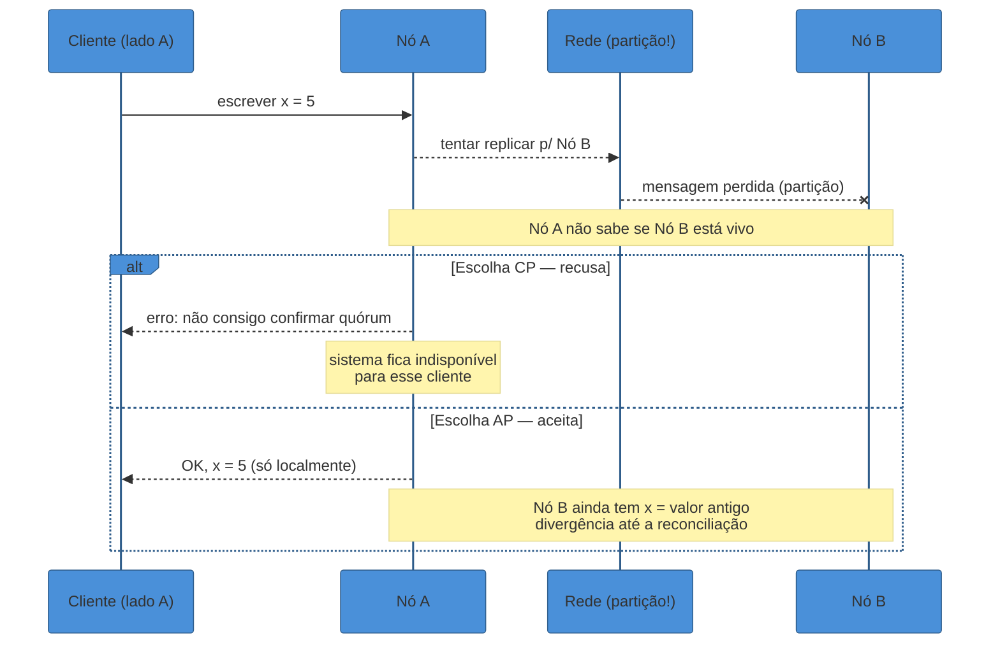
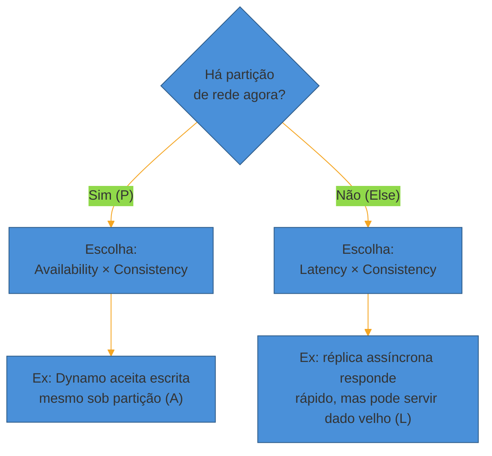
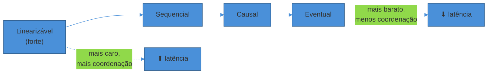
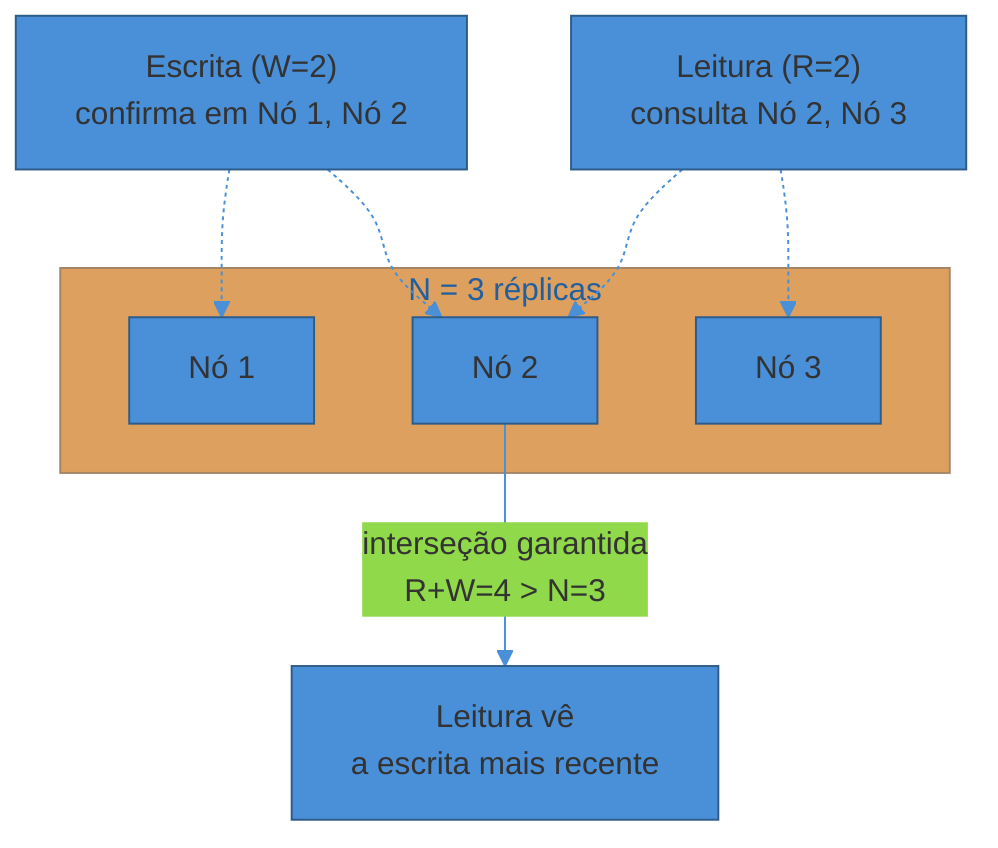
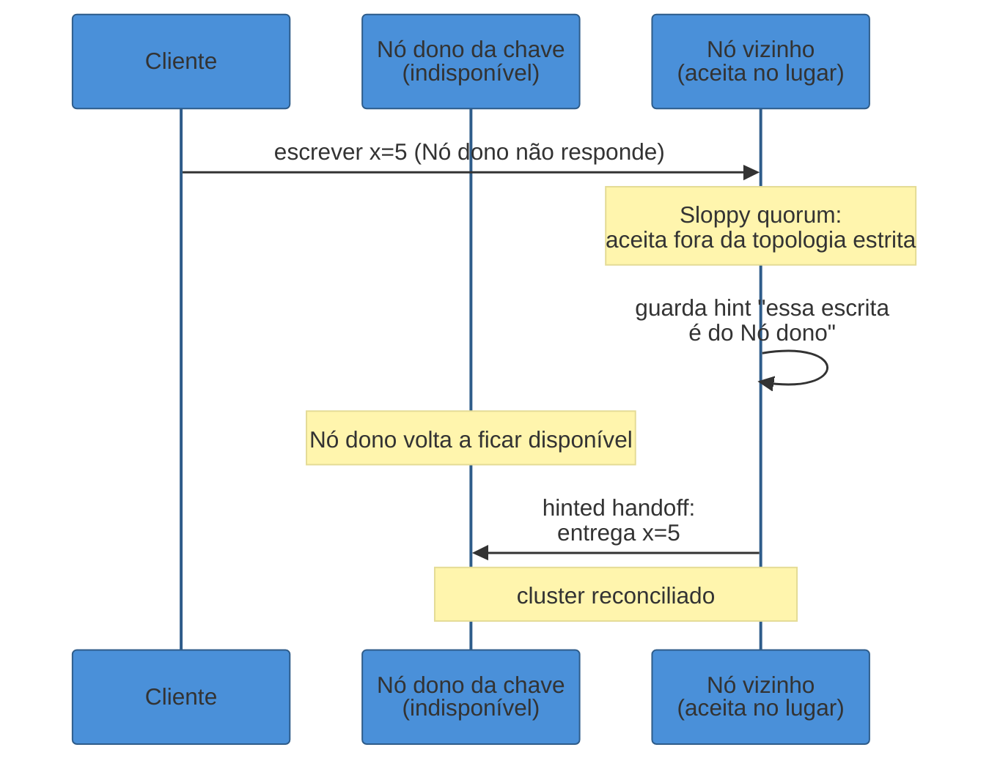
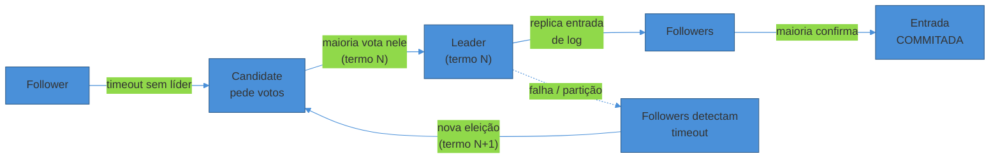

# CAP, consistência e consenso

> [!abstract] TL;DR
> Uma partição de rede corta seu cluster em dois pedaços que não se enxergam. Uma escrita chega no lado errado. O sistema tem **meio segundo** para decidir: recusa a escrita e preserva a garantia de que todo mundo lê o mesmo valor (**consistência**), ou aceita a escrita e deixa os dois lados divergirem por um tempo (**disponibilidade**). Não existe terceira opção — a rede vai particionar de vez em quando, e a partição *já tirou* a escolha de tolerá-la ou não; o que sobra é escolher entre C e A. Esse é o teorema **CAP**, e a frase "escolha 2 de 3" que todo mundo repete é imprecisa: P não é uma escolha, é um fato da vida distribuída. O **PACELC** completa o quadro dizendo o que acontece quando *não* há partição: aí o trade-off vira latência vs. consistência. Consistência, por sua vez, não é binária — é um espectro (linearizável → sequencial → causal → eventual), e sistemas reais escolhem um ponto nesse espectro por componente, não um só para o sistema inteiro. E quando várias réplicas precisam concordar sob falhas — quem é o líder, o que foi de fato commitado — entra o problema do **consenso**, resolvido na prática por algoritmos como Raft e Paxos, a um custo real de latência que ninguém paga sem necessidade.

São 3h da manhã. Um cabo de fibra entre dois data centers é cortado por uma escavadeira. O cluster de banco de dados, que tinha nós dos dois lados, agora é na prática **dois clusters** que não conseguem mais se falar.

Um cliente conectado ao lado A manda uma escrita. O nó que recebe essa escrita tem, literalmente, dois caminhos:

1. **Recusar a escrita** ("não consigo confirmar com o outro lado, não vou arriscar inconsistência") — o sistema fica **indisponível** para esse cliente, mas todo mundo que consegue ler continua vendo dados corretos e sincronizados.
2. **Aceitar a escrita localmente** e torcer para reconciliar depois — o sistema continua **disponível**, mas agora os dois lados do cluster podem ter versões diferentes do mesmo dado. Um cliente no lado B, lendo o mesmo registro, pode ver um valor antigo.

Não existe uma terceira opção que preserve as duas coisas ao mesmo tempo. É essa escolha, forçada pela partição, que o teorema CAP descreve — e ela não é acadêmica: é a decisão de design mais citada (e mais mal citada) em entrevista de system design.

## O teorema CAP, com precisão

Formulado por Eric Brewer em 2000 e provado formalmente por Seth Gilbert e Nancy Lynch em 2002, o teorema CAP diz que um sistema distribuído não pode garantir simultaneamente três propriedades:

- **Consistência (C):** toda leitura recebe o valor da escrita mais recente, ou um erro — equivalente a **linearizabilidade**: o sistema se comporta como se houvesse uma única cópia dos dados, com operações ocorrendo em alguma ordem sequencial consistente com o tempo real.
- **Disponibilidade (A):** toda requisição a um nó não-falho recebe uma resposta — não uma resposta *correta*, apenas uma resposta, em tempo finito.
- **Tolerância a Partição (P):** o sistema continua operando mesmo quando mensagens entre nós são perdidas ou atrasadas arbitrariamente.

A leitura popular — "escolha 2 de 3" — sugere que P é uma opção como as outras duas, algo que você pode desligar se quiser CA. Isso é impreciso o suficiente para atrapalhar mais do que ajudar.

> [!warning] "Escolha 2 de 3" é a frase que mais engana em system design
> **O que acontece:** o candidato diz "eu escolheria CA aqui, quero consistência e disponibilidade" como se fosse uma opção válida de design. **Por quê:** numa rede real — a internet, um data center, até processos na mesma máquina sob GC pause — mensagens **vão** se perder ou atrasar eventualmente. Partição não é uma condição rara que você desliga; é uma propriedade física da rede que você não controla. Um sistema "CA" só existe se você aceitar que, sob partição, ele simplesmente **para de funcionar** por completo (nem responde, nem garante consistência) — o que na prática ninguém quer. **Como evitar:** trate P como dado, não como escolha. A frase certa em entrevista é "**quando** a rede particionar — e ela vai —, esse sistema escolhe C ou A". A pergunta interessante nunca é "você quer P?"; é "sob partição, você recusa a escrita ou aceita e reconcilia depois?".

Em outras palavras: CAP não é sobre o funcionamento normal do sistema. É sobre o que ele faz **no exato momento em que a rede quebra**. No dia a dia, sem partição, C e A convivem sem drama — é aí que entra o PACELC, adiante.

## CP vs AP: a mesma escolha, dois sistemas reais

A escolha CAP não é teórica — ela está entalhada na configuração dos bancos que você já usa.

**Sistemas CP (consistência sobre disponibilidade):** um banco relacional configurado com replicação síncrona e quórum de escrita recusa a escrita se não conseguir confirmar com a maioria dos nós. Um **etcd** ou **ZooKeeper**, usados como fonte de verdade para configuração e coordenação, se comportam assim por design — preferem ficar indisponíveis a servir um dado potencialmente desatualizado, porque servem para decisões (quem é o líder, qual configuração vale) onde inconsistência é pior que uma pausa.

**Sistemas AP (disponibilidade sobre consistência):** **Cassandra** e **DynamoDB**, na configuração default, aceitam a escrita no nó disponível e propagam para os outros de forma assíncrona. Se a rede particionar, ambos os lados continuam aceitando leituras e escritas — e divergem. A reconciliação acontece depois, com mecanismos como *last-write-wins*, vetores de versão, ou resolução no nível da aplicação. Isso é aceitável porque o caso de uso — carrinho de compras, contadores de curtidas, catálogo de produtos — tolera uma janela de inconsistência em troca de nunca recusar uma requisição do usuário.

> [!question]- Um sistema pode ser CP em uma operação e AP em outra?
> Pode, e os sistemas maduros fazem exatamente isso. O MongoDB, por exemplo, deixa você escolher o *write concern* e o *read concern* por operação: uma escrita pode pedir confirmação da maioria das réplicas (mais CP, mais lenta) ou só do primário (mais rápida, mais arriscada sob falha). A escolha CAP não é uma propriedade fixa do banco — é uma configuração que você ajusta por tipo de dado. O saldo bancário do usuário pode pedir CP; o log de "usuários que visualizaram este produto" pode ser AP. Isso é maturidade de design: perguntar "CP ou AP *para este dado, especificamente*", não "qual é o banco CP e qual é o AP".

Vale citar um terceiro caso que costuma render um bom deep dive: o **Google Spanner** afirma entregar consistência forte *globalmente*, multi-região, sem parecer pagar o preço de disponibilidade que a teoria prevê para um sistema CP. O truque não quebra o CAP — Spanner ainda escolhe C sobre A durante uma partição real. O que ele faz é reduzir drasticamente a *frequência e o custo* das coordenações usando **TrueTime**, um serviço de relógio com intervalo de incerteza limitado por hardware (GPS + relógios atômicos), que permite ao sistema saber, com alta confiança, quando é seguro considerar uma transação "definitivamente no passado" de outra sem uma rodada extra de comunicação. É um lembrete útil em entrevista: investir em infraestrutura melhor (relógios precisos, redes privadas de baixa latência entre regiões) não revoga o CAP, mas pode empurrar o ponto de operação do sistema para bem mais perto do ideal teórico.

## PACELC: o resto do tempo, quando não há partição

CAP descreve só o instante da partição. Mas partições são raras — a maior parte do tempo, a rede está saudável, e mesmo assim os sistemas distribuídos fazem trade-offs de consistência. CAP, sozinho, não explica por quê.

Daniel Abadi resolveu essa lacuna em 2012 com o **PACELC**: se há **P**artição, escolha entre **A**vailability e **C**onsistency (isso é o CAP de sempre); **E**lse (sem partição), escolha entre **L**atency e **C**onsistency.

A intuição do "Else": mesmo com a rede 100% saudável, exigir consistência forte significa esperar a confirmação de réplicas remotas antes de responder ao cliente — e essa espera custa latência, principalmente se as réplicas estão em outra região geográfica. Um sistema pode abrir mão dessa espera (responder rápido, com o valor da réplica mais próxima, potencialmente stale) ou pagar o custo (esperar o quórum, garantir que a leitura reflita a escrita mais recente).

| Sistema | Sob partição (PA/PC) | Sem partição (EL/EC) | Classificação PACELC |
|---------|----------------------|-----------------------|-----------------------|
| Dynamo / Cassandra | Prioriza disponibilidade (PA) | Prioriza latência (EL) | **PA/EL** |
| MongoDB (majority) | Prioriza consistência (PC) | Prioriza consistência (EC) | **PC/EC** |
| PostgreSQL (síncrono) | Prioriza consistência (PC) | Prioriza consistência (EC) | **PC/EC** |
| BigTable / HBase | Prioriza consistência (PC) | Prioriza latência (EL) | **PC/EL** |

Repare que a coluna "sem partição" é onde a maioria das decisões de arquitetura realmente acontece — porque partições, ainda que inevitáveis no longo prazo, são o caso raro. É por isso que Abadi argumenta que **PACELC explica mais decisões de design do que CAP sozinho**.

> [!question]- Por que eu preciso do PACELC se já entendi o CAP?
> Porque CAP, sozinho, faz parecer que consistência forte é "grátis" fora de uma partição — e não é. Réplicas síncronas multi-região custam dezenas ou centenas de milissegundos de latência mesmo com a rede saudável, só pela velocidade da luz e pelo protocolo de confirmação. Se você disser em entrevista "esse sistema é CP" e parar por aí, você não explicou o custo do dia a dia. Dizer "é PC/EC — sob partição escolhe consistência, e no cotidiano paga latência para manter essa consistência" mostra que você entende o trade-off *o tempo todo*, não só no momento dramático da falha de rede.

## O espectro de consistência: nem tudo é forte ou eventual

"Consistência forte" e "eventual" são só as duas pontas de um espectro. Entrevistas tratam consistência como binária, mas sistemas reais escolhem pontos intermediários porque cada nível seguinte custa mais coordenação.

- **Linearizável (forte):** toda leitura vê a escrita mais recente, como se houvesse uma única cópia dos dados no mundo. É a garantia mais cara — exige coordenação em cada operação.
- **Sequencial:** todas as réplicas concordam na *mesma ordem* de operações, mas essa ordem pode não corresponder exatamente ao tempo real. Mais barata que linearizável, ainda assim forte o suficiente para muitos propósitos.
- **Causal:** operações que têm relação de causa e efeito (uma resposta a um comentário) são vistas na ordem certa por todo mundo; operações não relacionadas podem aparecer em ordens diferentes para observadores diferentes. É o ponto que a maioria dos sistemas sociais/colaborativos realmente precisa — e custa bem menos que linearizabilidade.
- **Eventual:** a única garantia é que, se as escritas pararem, todas as réplicas eventualmente convergem para o mesmo valor. Não diz nada sobre *quando*, nem sobre a ordem que um cliente individual observa no meio do caminho.

Dentro de "eventual", duas garantias mais finas evitam a experiência mais confusa para o usuário:

- **Read-your-writes:** depois que você escreve, *você* sempre vê sua própria escrita nas leituras seguintes — mesmo que outros usuários ainda vejam o valor antigo por um tempo. Sem isso, um usuário que atualiza a própria foto de perfil e não a vê aparecer imediatamente assume que o sistema está quebrado.
- **Monotonic reads:** uma vez que você viu um valor mais novo, você nunca volta a ver um valor mais antigo numa leitura subsequente — mesmo em sistemas eventualmente consistentes, onde diferentes réplicas podem estar em pontos diferentes de propagação.

> [!warning] Tratar "eventual" como sinônimo de "qualquer coisa vale"
> **O que acontece:** o candidato diz "consistência eventual" e trata isso como uma licença para ignorar qualquer garantia de ordem. **Por quê:** "eventual" sozinho é uma garantia fraca demais para a maioria dos produtos — um usuário que publica um post e não o vê no próprio feed por alguns segundos vai reportar isso como bug, não como trade-off aceitável. **Como evitar:** quando disser "eventual", complemente com a garantia mais fina que o produto realmente precisa: "eventual, mas com read-your-writes" é uma frase de sênior. Ela mostra que você pensou na experiência do usuário durante a janela de propagação, não só na convergência final.

Onde cada nível costuma aparecer na prática, para ancorar o espectro em exemplos concretos em vez de ficar só na teoria:

| Nível | Custo de coordenação | Onde aparece |
|-------|----------------------|--------------|
| Linearizável | Alto — cada operação coordena com o cluster | Saldo bancário, estoque com pouca margem, lock distribuído |
| Sequencial | Médio — ordem global, sem exigir tempo real exato | Log de auditoria, fila de processamento ordenada |
| Causal | Médio-baixo — só ordena o que é causalmente relacionado | Comentários/respostas em thread, edição colaborativa de documento |
| Eventual (+ read-your-writes) | Baixo — propagação assíncrona, com uma garantia extra por sessão | Perfil de usuário, configuração de conta, catálogo de produto |
| Eventual (pura) | Mínimo — só convergência, sem garantia de ordem por observador | Contador de visualizações, cache de recomendação, métrica agregada |

## Quorum: a aritmética que decide leitura e escrita

Sistemas distribuídos com múltiplas réplicas (Dynamo, Cassandra, Riak, e o próprio conceito por trás de etcd/Raft) usam uma regra simples para equilibrar consistência e disponibilidade sem exigir que *todas* as réplicas confirmem toda operação: **quorum**.

Com **N** réplicas totais, uma escrita precisa da confirmação de **W** réplicas, e uma leitura precisa consultar **R** réplicas. A garantia central é:

$$R + W > N$$

Se essa desigualdade vale, todo conjunto de R réplicas lidas necessariamente sobrepõe pelo menos uma réplica do conjunto de W réplicas escritas — ou seja, toda leitura vê pelo menos uma cópia da escrita mais recente. Não há como ler um conjunto de réplicas completamente "atrasado" em relação à última escrita confirmada.

Exemplo clássico: N=3, W=2, R=2. R+W=4 > N=3. Uma escrita confirma em 2 dos 3 nós; uma leitura consulta 2 dos 3 nós. Não importa quais 2 nós cada operação escolher — pelo menos um nó aparece nos dois conjuntos.

Ajustar W e R é literalmente ajustar o ponto no espectro CAP/PACELC para aquele dado específico:

- **W baixo, R alto** (ex: W=1, R=N): escritas rápidas e sempre disponíveis, leituras mais lentas mas garantidamente atualizadas.
- **W alto, R baixo** (ex: W=N, R=1): leituras rapidíssimas, escritas mais lentas e menos tolerantes a falha de nó.
- **W + R ≤ N**: quorum "fraco" — mais rápido dos dois lados, mas *sem* garantia de interseção; é consistência eventual explícita, escolhida deliberadamente para casos que toleram staleness.

Dois mecanismos completam o quadro quando um nó está temporariamente fora do quorum:

- **Sloppy quorum:** se um dos nós "donos" de uma chave está inacessível, a escrita é aceita por outro nó disponível *fora* do conjunto original — prioriza disponibilidade sobre a topologia estrita.
- **Hinted handoff:** o nó que aceitou a escrita "no lugar" do nó ausente guarda uma dica (*hint*) e entrega o dado ao nó correto assim que ele volta a ficar disponível, reconciliando o cluster.

Esses dois mecanismos, juntos, são o motivo pelo qual sistemas como Dynamo conseguem prometer "sempre aceito uma escrita" mesmo com nós caindo — na prática, é AP levado ao extremo, com a reconciliação empurrada para depois.

> [!question]- R+W>N garante que eu nunca vejo dado desatualizado?
> Garante que a leitura sempre inclui pelo menos uma réplica com a escrita mais recente — mas não garante que o cliente saiba *qual* das réplicas retornadas é a mais nova. Isso ainda exige um mecanismo de versionamento (timestamp, vetor de versão, número de sequência) para o cliente — ou o próprio coordenador do quorum — decidir qual valor é o "vencedor" entre os R retornados. Quorum resolve a *interseção*; resolver o *desempate* entre versões conflitantes é um problema separado, normalmente tratado com *last-write-wins* (simples, mas pode perder escritas concorrentes) ou vetores de versão (mais correto, mais complexo).

O desempate por versão vale uma menção rápida porque aparece em quase toda entrevista que chega a este nível de profundidade: **vetores de versão** (ou *vector clocks*) anexam a cada escrita um contador por nó — "este valor foi escrito depois de ver a versão [A:2, B:1] de outros nós". Quando duas escritas concorrentes não têm uma relação de "antes/depois" clara entre si (nenhum vetor domina o outro), o sistema não pode decidir sozinho qual "venceu" — ele expõe as duas versões conflitantes e deixa a aplicação (ou o usuário, no caso clássico do carrinho de compras da Amazon) resolver o conflito. Esse mecanismo é o coração de como um key-value store distribuído (estilo DynamoDB/Cassandra) lida com escrita concorrente — tema do walkthrough dedicado no sub-galho 4 deste galho, ainda por vir. Aqui basta reconhecer que ele existe e por que quorum sozinho não o substitui.

## Consenso: fazer nós concordarem apesar de falhas

Quorum resolve leitura/escrita ponto a ponto. Mas alguns problemas exigem algo mais forte: que um **grupo de nós concorde, de forma duradoura, sobre um único valor** — mesmo que alguns nós falhem ou a rede tropece no meio do processo. Isso é o problema do **consenso**, e ele aparece em todo canto de um sistema distribuído sério:

- Quem é o **líder** de um cluster de réplicas agora?
- Qual foi a **última entrada confirmada** num log replicado (o commit que realmente "aconteceu")?
- Qual é a **configuração atual** de quais nós pertencem ao cluster?

Resolver isso de forma ingênua — "o nó com o IP menor vira líder" — quebra na primeira partição de rede, porque os dois lados podem eleger líderes diferentes ao mesmo tempo (*split-brain*). Consenso é o protocolo formal que evita isso, com a garantia de que **no máximo um** valor é decidido, mesmo sob falhas.

Vale distinguir consenso de um mecanismo vizinho com o qual ele é confundido: o **two-phase commit (2PC)**, usado para coordenar uma transação que toca múltiplos bancos/serviços diferentes. 2PC garante atomicidade ("todos confirmam ou todos abortam"), mas não tolera bem a falha do coordenador — se ele cai depois de pedir os votos e antes de anunciar o resultado, os participantes ficam **bloqueados**, esperando indefinidamente. Consenso via Raft/Paxos, por comparação, tolera a falha do próprio líder, porque outro nó assume via eleição. É por isso que sistemas modernos preferem construir coordenação distribuída *sobre* um log replicado por consenso, em vez de 2PC puro, sempre que a disponibilidade sob falha do coordenador importa.

O algoritmo clássico é o **Paxos**, de Leslie Lamport (1998) — correto, mas notoriamente difícil de entender e implementar corretamente. Em 2014, Diego Ongaro e John Ousterhout publicaram o **Raft**, desenhado explicitamente para ser tão correto quanto Paxos, mas compreensível — e hoje é o algoritmo de consenso mais usado em sistemas novos (etcd, Consul, CockroachDB, TiKV).

A intuição do Raft, sem entrar no detalhe formal do paper:

1. **Eleição de líder:** os nós começam como *followers*. Se um follower não ouve o líder por um tempo (timeout), ele vira *candidate* e pede votos. Quem consegue maioria dos votos vira *leader* para aquele **termo** (um número que só cresce, usado para desempatar líderes antigos).
2. **Replicação de log:** todo comando (ex: "x = 5") passa pelo líder primeiro. O líder replica a entrada para os followers e só a considera **commitada** quando a *maioria* confirma — a mesma lógica de quorum vista acima.
3. **Segurança:** um novo líder eleito nunca sobrescreve entradas já commitadas por um líder anterior — a eleição verifica que o candidato tem o log pelo menos tão atualizado quanto a maioria antes de dar o voto.

O custo do consenso é real e é por isso que ele não é usado em todo lugar: cada decisão exige uma rodada de comunicação com a maioria do cluster (uma forma de quorum), então a latência escala com o número de nós e a distância entre eles. Um cluster Raft de 5 nós espalhados entre continentes paga esse preço a cada commit — por isso consenso costuma proteger *metadado* (quem é líder, qual configuração vale) e não o caminho de dados de alto volume, que usa replicação mais barata (leader-follower assíncrono, visto na nota 03) sempre que a aplicação tolera.

> [!warning] Usar consenso para tudo "porque é mais correto"
> **O que acontece:** o candidato propõe rodar consenso (Raft/Paxos) para cada escrita de um sistema de alto volume — "assim garanto que tudo está sempre correto". **Por quê:** confunde correção teórica com custo de engenharia zero. Consenso exige uma rodada de quorum por decisão — isso é latência garantida e um teto de throughput baixo comparado a replicação assíncrona simples. **Como evitar:** reserve consenso para **decisões de controle** — eleição de líder de shard, confirmação de configuração, commit de transação distribuída rara — e deixe o caminho de dados de alto volume usar replicação leader-follower comum (nota 03) ou quorum leve (Dynamo-style), que são ordens de magnitude mais baratos. Em entrevista, a frase que sinaliza isso é: "eu não rodaria consenso por escrita aqui — o volume é alto demais; eu uso consenso só para decidir quem é o líder do shard, e deixo a replicação de dados ser assíncrona."

### Paxos vs. Raft, em uma tabela

Nenhuma entrevista pede a prova de correção de nenhum dos dois, mas vale saber posicionar os dois nomes que aparecem o tempo todo em discussões de sistemas distribuídos:

| | Paxos | Raft |
|---|-------|------|
| Ano / autor | 1998, Leslie Lamport | 2014, Ongaro & Ousterhout |
| Objetivo declarado | Correção formal, mínima | Correção + **compreensibilidade** |
| Estrutura | Papéis simétricos (proposer/acceptor/learner), difícil de mapear para implementação | Papéis explícitos (leader/follower/candidate), log replicado central |
| Uso comum | Google Chubby, Spanner (variante Multi-Paxos) | etcd, Consul, CockroachDB, TiKV |
| Fama | "Notoriamente difícil de entender corretamente" (citação recorrente na literatura) | Desenhado para ser ensinável — validado com estudo de usuários no próprio paper |

Na prática, a maioria dos sistemas novos (2015 em diante) escolhe Raft não porque ele resolva um problema diferente de Paxos — resolve o mesmo — mas porque times conseguem *implementar e depurar* Raft com mais confiança. Isso, por si, é uma lição de engenharia que vale citar em entrevista: às vezes o algoritmo "vencedor" não é o mais antigo ou o mais citado, é o que reduz erro humano de implementação.

## Um exemplo trabalhado: checkout sob partição

Para tornar a escolha CAP concreta, veja um checkout de e-commerce dividido em dois componentes, cada um recebendo uma decisão diferente sob a mesma partição de rede.

**Estoque do produto (quantidade disponível):** a partição isola o data center A do B. Um cliente no lado A tenta comprar a última unidade de um produto. Se o sistema escolher AP aqui, os dois lados podem vender a "última unidade" simultaneamente — um dos dois pedidos vai precisar ser cancelado depois, com o custo de reputação de dizer "seu pedido foi cancelado" para um cliente que já recebeu confirmação. Por isso, contagem de estoque com pouca margem tende para **CP** ou para um ponto de serialização único (fila, ou quorum com compare-and-swap): melhor recusar a venda por alguns segundos do que prometer duas vezes o mesmo item.

**Carrinho de compras (itens ainda não comprados):** o mesmo cliente, no mesmo momento de partição, adiciona um item ao carrinho. Se o sistema recusar essa escrita porque não conseguiu confirmar com o outro lado, o cliente simplesmente desiste da compra — o custo de indisponibilidade aqui é maior que o custo de uma divergência temporária. Por isso o carrinho tende para **AP**: aceita a escrita local, reconcilia (ou simplesmente faz merge dos dois carrinhos) quando a partição se resolve.

Repare que os dois componentes rodam, plausivelmente, na *mesma* infraestrutura de e-commerce, sob a *mesma* partição de rede, no *mesmo instante* — e ainda assim tomam decisões CAP opostas. Isso é o argumento central desta nota, aplicado: CAP não descreve o sistema, descreve a **decisão por dado**, justificada pelo custo de errar para aquele dado específico.

> [!question]- Isso não complica demais o design — não seria mais simples escolher um lado só para o sistema inteiro?
> Seria mais simples de *explicar*, mas errado na prática — e é exatamente esse simplismo que a entrevista está testando se você evita. Um sistema 100% CP recusa até a adição de item ao carrinho durante qualquer soluço de rede, o que é um custo de negócio desnecessário para um dado que tolera divergência. Um sistema 100% AP venderia a última unidade de estoque duas vezes, o que também é um custo de negócio, só que num dado que *não* tolera. Escolher por dado dá mais trabalho de design, mas cada escolha vira defensável — "eu escolhi X para este dado porque Y" — em vez de uma política única que otimiza mal para pelo menos metade dos casos.

## Variações do mesmo padrão, em sistemas diferentes

A dupla CAP/consenso não é um capítulo isolado de teoria — ela reaparece, disfarçada, em quase todo sistema deste galho:

- **Configuração e descoberta de serviço** (etcd, Consul, ZooKeeper): são deliberadamente **CP**. Um serviço de configuração que responde "não sei, mas te garanto que o que eu disser é correto" é mais seguro do que um que responde rápido com um valor potencialmente errado — porque a configuração errada (ex: "quem é o líder do shard 7") se propaga para o cluster inteiro. É por isso que esses sistemas usam Raft (etcd, Consul) ou ZAB, o algoritmo de consenso do ZooKeeper, internamente.
- **Carrinho de compras e catálogo de e-commerce**: classicamente **AP**. A DynamoDB paper (2007), que popularizou boa parte do vocabulário desta nota (vetores de versão, sloppy quorum, hinted handoff), nasceu exatamente do carrinho de compras da Amazon — perder uma venda por um erro 503 é pior para o negócio do que mostrar um carrinho levemente desatualizado por alguns segundos.
- **Sistema de reserva de assento/estoque limitado** (poucos assentos, alta contenção): aqui nem CP nem AP simples bastam — é comum usar quorum com desempate explícito (compare-and-swap, ou o próprio Raft) porque duas reservas concorrentes do *último* assento não podem ambas "vencer". A escolha aqui não é só C ou A; é onde colocar o ponto de serialização.
- **Feed social / contadores de engajamento** (curtidas, visualizações): AP quase sempre, com CRDTs (*Conflict-free Replicated Data Types*) ou simplesmente contadores aproximados quando a exatidão não importa — o mesmo espírito de "aceite a escrita, resolva depois" levado ao extremo de nem tentar reconciliar com precisão.

Reconhecer qual dessas famílias está na sua frente — antes de escolher CP ou AP — é o que transforma "eu sei o que é CAP" em "eu sei *quando* aplicar cada lado do CAP", que é o nível que a entrevista sênior está medindo.

## Armadilhas comuns

> [!warning] Confundir "eleger um líder" com "resolver consenso"
> **O que acontece:** o candidato descreve uma eleição de líder simplista — "o nó que perceber a falha primeiro assume" — e trata isso como equivalente a rodar Raft ou Paxos. **Por quê:** essa abordagem ingênua não impede que dois nós, cada um isolado do outro por uma partição, se elejam líder ao mesmo tempo — o clássico *split-brain*. Sem quorum (maioria estrita) e sem número de termo para desempatar líderes de gerações diferentes, "eleição" vira uma corrida sem árbitro. **Como evitar:** amarre a palavra "eleição" a "maioria" sempre que usar as duas: "o novo líder só é confirmado se conseguir votos da maioria dos nós — isso garante que não existam dois líderes válidos ao mesmo tempo, porque duas maiorias de um mesmo conjunto sempre se sobrepõem."

> [!warning] Achar que "consistente" é uma propriedade do banco, não do dado
> **O que acontece:** o candidato declara "esse banco é consistente" como afirmação absoluta sobre a tecnologia escolhida. **Por quê:** a mesma tecnologia (MongoDB, Cassandra, até um Postgres com réplicas) pode ser configurada para consistência forte numa operação e eventual em outra, dado o mesmo cluster rodando ao mesmo tempo — como visto na seção de CP vs AP acima. **Como evitar:** fale sempre em relação ao dado ou à operação: "para o saldo, eu configuro esse cluster para leitura majoritária (forte); para o log de eventos de auditoria, mesma tecnologia, leitura de qualquer réplica (eventual) — porque o custo de errar é diferente nos dois casos."

## Checklist rápido para levar pra entrevista

Uma síntese de bolso das ideias desta nota, para consultar mentalmente sob pressão:

1. **P não é opcional.** A pergunta nunca é "você quer tolerar partição?" — é "sob partição, você recusa (C) ou aceita e diverge (A)?".
2. **Sem partição, o trade-off é latência vs. consistência (o "Else" do PACELC)** — não finja que consistência forte é grátis no dia a dia.
3. **Nomeie o ponto no espectro**, não só "forte" ou "eventual": causal e read-your-writes resolvem boa parte da experiência de usuário sem pagar o preço da linearizabilidade total.
4. **Quorum é aritmética, não magia:** R + W > N garante interseção; ajustar R e W move o sistema no espectro CAP/PACELC por tipo de dado.
5. **Consenso é caro — reserve para controle**, não para o caminho de dados de alto volume: líder de shard, configuração, não cada escrita do usuário.
6. **A escolha muda por dado**, não é uma propriedade fixa do sistema inteiro: saldo pode ser CP, contador de curtidas pode ser AP, no mesmo produto.

## Em entrevista

CAP não é um teorema para *recitar* — é uma lente para *justificar* uma escolha já feita por outros motivos. A rubrica de system design (ver [[1 - Framework de entrevista/01 - O que é System Design e o que a entrevista avalia|nota 01 do SG1]]) é explícita: ninguém pontua por "citou CAP"; pontua por "usou CAP para explicar uma decisão sob uma restrição concreta".

O padrão de frase que funciona: **"dado que [requisito de negócio], sob partição eu escolho [C ou A], porque [consequência concreta de escolher o outro lado]."**

- "Esse é o serviço de saldo bancário — sob partição eu escolho consistência (CP): prefiro recusar uma transferência a arriscar mostrar um saldo errado que o usuário gasta duas vezes."
- "Esse é o contador de curtidas do post — sob partição eu escolho disponibilidade (AP): um contador levemente errado por alguns segundos não quebra nada, mas o post sumir da tela quebra a experiência."

Isso também é onde entra o PACELC como reforço de profundidade: depois de estabelecer CP ou AP, complete com o custo do dia a dia — "e mesmo sem partição, esse serviço CP paga latência de replicação síncrona; é o preço que eu aceito para o saldo, mas eu não pagaria esse preço no contador de curtidas."

Quorum e consenso entram no **deep dive**, não no diagrama macro. Se o entrevistador perguntar "como vocês garantem que a leitura não fica desatualizada" ou "como o cluster decide quem é o líder depois que ele cai", é o momento de trazer R+W>N ou a intuição de eleição do Raft — sempre amarrando ao custo (latência, quórum vivo), nunca como conhecimento solto.

> [!question]- Preciso saber implementar Raft do zero para a entrevista?
> Não. Nenhuma entrevista de system design pede a máquina de estados completa do Raft. O que é avaliado é a **intuição operacional**: você sabe que consenso existe para resolver "quem decide, quando os nós discordam", sabe que ele custa uma rodada de quorum por decisão, e sabe *onde* ele normalmente aparece num sistema real (eleição de líder de shard, coordenação de configuração — não no caminho de dados de alto volume). Se o entrevistador quiser ir fundo no algoritmo em si, isso já é uma entrevista de sistemas distribuídos, não a system design interview padrão — e aí vale mencionar que você conhece o paper, sem fingir que decorou a máquina de estados.

O fio que amarra a nota inteira, para fechar: toda vez que um deep dive tocar consistência, a pergunta que sinaliza senioridade não é "esse sistema é forte ou eventual" — é **"o que precisa ser verdade para este dado específico, e quanto eu estou disposto a pagar por isso"**. CAP, PACELC, o espectro de consistência, quorum e consenso são, todos, formas diferentes de responder essa mesma pergunta em contextos diferentes. Dominar a nota não é decorar as siglas — é internalizar que cada uma delas existe para nomear um trade-off que, de outra forma, ficaria implícito e não-examinado no seu design.

## Como explicar em inglês

CAP is often summarized as "pick two of three," but that phrasing is misleading. Partition tolerance isn't optional on a real network — partitions will happen. The actual choice only exists **during** a partition: does the system refuse the write to stay consistent, or accept it and risk divergence to stay available?

PACELC extends this: **P**artition forces **A**vailability vs **C**onsistency; **E**lse (no partition), you're trading **L**atency vs **C**onsistency. Most day-to-day design decisions actually live in the "Else" branch, since partitions are the rare case.

Consistency itself is a spectrum, not a binary — linearizable, sequential, causal, eventual — and mature systems pick different points per data type. Quorum (R + W > N) is the arithmetic that lets a system stay available across multiple replicas while still guaranteeing read/write overlap. Consensus (Raft, Paxos) solves a stronger problem — getting a cluster to agree on one value despite failures — and it's expensive enough that it's reserved for control-plane decisions, not high-volume data paths.

> "For the balance service, I'd choose CP — under a partition, I'd rather reject a transfer than risk showing a stale balance. For the like counter, I'd choose AP — a slightly stale count for a few seconds is fine, but the post disappearing isn't. And even without a partition, the CP path pays replication latency — that's a cost I accept for money, not for a counter."

If the interviewer pushes into a deep dive on leader failure, the layered answer works the same way in English as in Portuguese: "detect the failure via missed heartbeats, elect a new leader through majority vote — not just whoever responds first — and only then let it start accepting writes for its new term. That majority requirement is exactly what prevents split-brain: two disjoint majorities of the same cluster can't both exist at once."

| PT | EN |
|----|----|
| Teorema CAP | CAP theorem |
| Tolerância a partição | Partition tolerance |
| Consistência forte / linearizável | Strong / linearizable consistency |
| Consistência eventual | Eventual consistency |
| Leitura da própria escrita | Read-your-writes |
| Leituras monotônicas | Monotonic reads |
| Quórum | Quorum |
| Divisão cerebral (líderes duplicados) | Split-brain |
| Consenso | Consensus |
| Eleição de líder | Leader election |
| Termo (Raft) | Term |
| Réplica / réplica de log | Replica / log replication |
| Entrada commitada | Committed entry |

## O que vem a seguir

CAP e consenso fecham o vocabulário de *consistência sob falha* deste sub-galho. A última peça de Building Blocks muda de eixo: como entregar conteúdo **rápido**, na borda da rede, perto do usuário — onde a maior parte da latência sentida por um usuário real nunca chega a tocar CAP, porque nem passa pelo seu datacenter.

- [[07 - CDN e entrega na borda]] — PoPs, cache hit ratio na borda, invalidação, TLS na borda: a última milha antes do usuário

## Veja também

- [[System Design/index|System Design]] — o galho-pai e o mapa da trilha
- [[2 - Building blocks/index|Building blocks]] — o sub-galho e as outras peças de escala
- [[03 - Bancos de dados em escala - SQL vs NoSQL e replicação]] — onde o trade-off C×A aparece na prática: replicação síncrona vs assíncrona, lag e leituras stale
- [[05 - Message queues e processamento assíncrono]] — desacoplamento produtor/consumidor sob a mesma lógica de garantias (at-least-once, ordering)
- [[03-Dominios/Ciência/Banco de Dados/12 - Replicação, sharding e CAP|Replicação, sharding e CAP]] — o tratamento teórico mais profundo do teorema, incluindo a prova formal de Gilbert & Lynch

## Fontes

- **Eric Brewer** — [*CAP Twelve Years Later: How the "Rules" Have Changed*](https://sites.cs.ucsb.edu/~rich/class/cs293b-cloud/papers/brewer-cap.pdf), IEEE Computer, v.45 n.2, 2012, pp. 23-29 — o retrospecto do próprio autor do CAP, desfazendo a leitura "escolha 2 de 3" e enquadrando a escolha como algo que só existe durante a partição.
- **Daniel J. Abadi** — [*Consistency Tradeoffs in Modern Distributed Database System Design: CAP is Only Part of the Story*](http://www.cs.umd.edu/~abadi/papers/abadi-pacelc.pdf), IEEE Computer, v.45 n.2, 2012, pp. 37-42 — o paper original do PACELC.
- **Martin Kleppmann** — *Designing Data-Intensive Applications*, cap. 9 ("Consistency and Consensus") — o tratamento mais completo de linearizabilidade, ordering causal e o problema formal do consenso; referência-âncora deste galho.
- **Diego Ongaro & John Ousterhout** — [*In Search of an Understandable Consensus Algorithm (Extended Version)*](https://raft.github.io/raft.pdf), USENIX ATC 2014 (Best Paper Award) — o paper do Raft; site oficial [raft.github.io](https://raft.github.io/).
- **Seth Gilbert & Nancy Lynch** — *Brewer's Conjecture and the Feasibility of Consistent, Available, Partition-Tolerant Web Services*, ACM SIGACT News, 2002 — a prova formal do CAP que deu origem ao nome "teorema".
