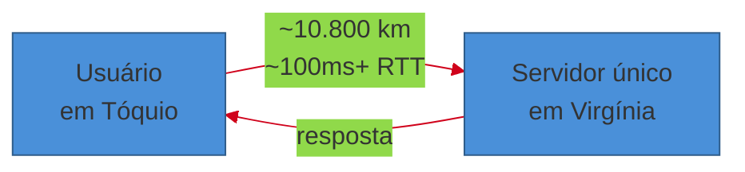
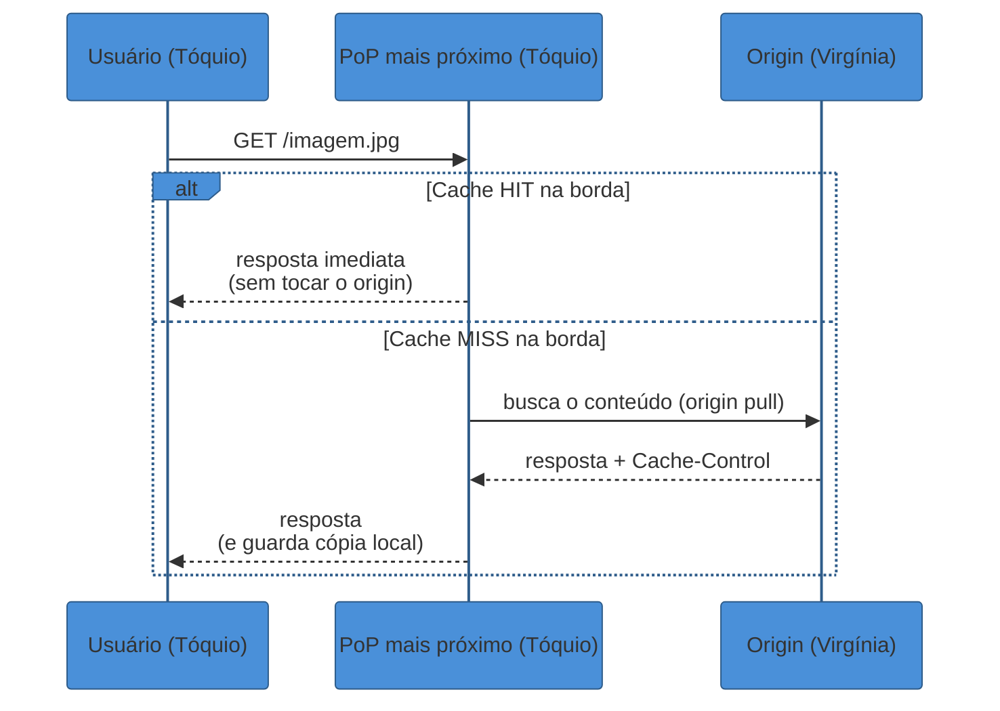
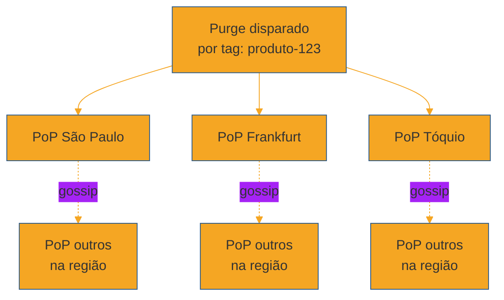
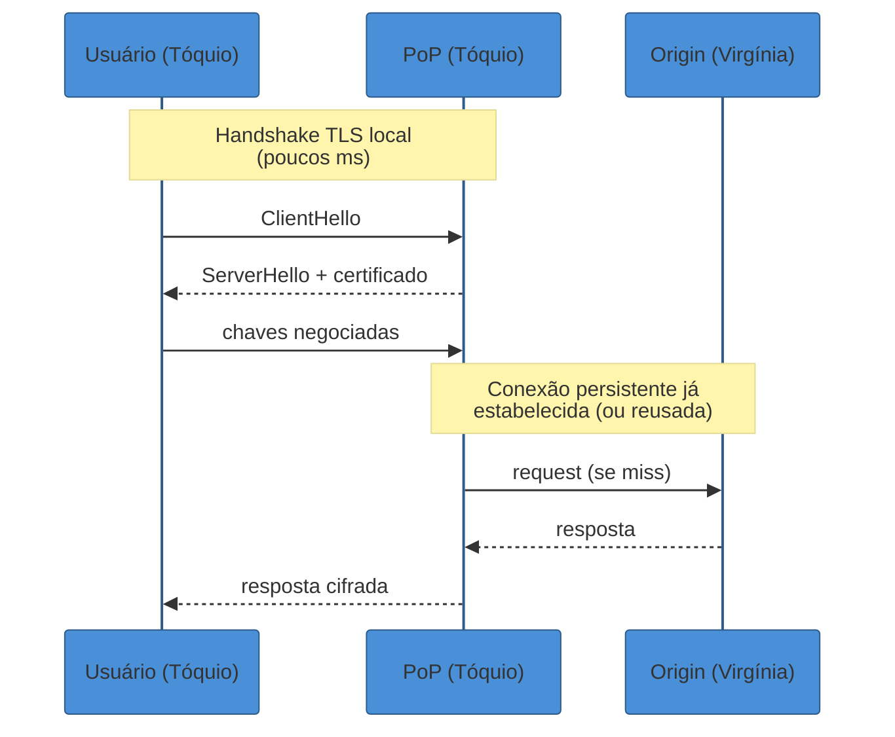

# CDN e entrega na borda

> [!abstract] TL;DR
> Um usuário em Tóquio pede uma imagem hospedada num servidor único na Virgínia. Mesmo com rede perfeita, zero congestionamento, zero fila — a luz leva cerca de **35ms só para ir**, e outros 35ms para voltar. Isso não é limitação de engenharia; é física, a velocidade da luz numa fibra óptica. Nenhum otimização de código, nenhum índice de banco, nenhum cache local resolve isso: o problema é a **distância**. A CDN (Content Delivery Network) resolve replicando o conteúdo para dezenas ou centenas de **PoPs (Points of Presence)** espalhados pelo mundo, de modo que o usuário em Tóquio busca a imagem num servidor em Tóquio, não na Virgínia. A métrica central é o **cache hit ratio na borda**: a fração de pedidos que a CDN resolve sozinha, sem nunca acordar o origin. O resto da nota é sobre como manter esse cache correto — **push vs pull**, **TTL e purge**, **TLS na borda** — sem perder a vantagem de latência que motivou tudo.

Uma equipe lança um site de e-commerce hospedado inteiramente num datacenter em Virgínia, EUA. Os testes internos, feitos por desenvolvedores logados na mesma costa leste americana, mostram páginas carregando em 80ms. Ótimo — até o lançamento global.

Os usuários no Japão reportam páginas travando por 400-600ms antes mesmo de começar a renderizar. Os da Austrália, pior ainda. O time de engenharia audita o código: nenhuma query lenta, nenhum N+1, nenhum bug óbvio. O servidor está saudável, respondendo em poucos milissegundos assim que recebe a requisição.

O problema não está no servidor. Está entre o servidor e o usuário — **19.000 km de fibra óptica, satélites e roteadores intermediários**, cada um adicionando alguns milissegundos de propagação e processamento. Um round-trip de Tóquio a Virgínia e volta, na melhor das hipóteses físicas, já consome bem mais que os 80ms medidos localmente — e isso antes de qualquer processamento no servidor.

Não existe query mais rápida, nem índice mais esperto, que encurte 19.000 km. A única solução real é geográfica: **levar uma cópia do conteúdo para perto do usuário**, para que a viagem que ele precisa fazer seja de alguns quilômetros, não de um continente inteiro. É exatamente esse o trabalho de uma CDN.

## A física que nenhum código resolve

A velocidade da luz numa fibra óptica é cerca de 200.000 km/s — dois terços da velocidade no vácuo, por causa do índice de refração do vidro. Isso é um limite físico, não uma configuração de rede que se ajusta.

Fazendo a conta para o par Tóquio↔Virgínia: a distância em linha reta é de aproximadamente 10.800 km. Dividindo pela velocidade da luz na fibra, a propagação de ida leva cerca de 54ms — mas cabos submarinos não seguem linha reta, então na prática esse número costuma passar de 100ms de ida e volta (RTT) só de propagação, antes de contar roteamento, congestionamento e o processamento do próprio servidor.

Compare com a [[03 - Estimativas de escala (back-of-envelope)|nota de estimativas]] deste sub-galho: um round-trip de rede dentro do mesmo datacenter custa ~0,5ms. Um round-trip intercontinental custa **200x mais**, e essa diferença é inteiramente geográfica — nenhuma otimização de software a reduz.

A única forma de encurtar essa distância sem mover fisicamente o usuário é replicar o conteúdo para perto dele. É a mesma lógica do cache-aside descrita na [[02 - Caching|nota de Caching]] — evitar refazer um trabalho caro — mas aplicada a uma dimensão diferente do problema: em vez de evitar recomputar contra o banco, a CDN evita **atravessar o planeta** a cada requisição.

> [!question]- Por que não simplesmente hospedar servidores em mais regiões, em vez de usar uma CDN?
> Isso é exatamente o que uma CDN *é*, sob o capô — uma rede de servidores geograficamente distribuídos que sabem, entre si, como manter uma cópia do conteúdo sincronizada. A diferença é que construir e operar essa rede você mesmo (comprar/alugar racks em dezenas de cidades, gerenciar roteamento entre eles, lidar com DDoS na borda) é um projeto de infraestrutura próprio, caro e fora do core business da maioria dos times. CDNs como Cloudflare, Fastly e CloudFront vendem exatamente essa capacidade como serviço: você aponta seu DNS para eles, e a rede de PoPs já existe, operada, monitorada e paga por uso. A pergunta que sobra não é "CDN ou multi-região", é "quanto do meu tráfego devo servir a partir da borda gerenciada versus da minha própria infraestrutura de origin".

## PoPs e o roteamento até o mais próximo

Uma CDN é uma rede de **PoPs (Points of Presence)** — data centers menores, espalhados estrategicamente perto de grandes concentrações de usuários (São Paulo, Tóquio, Frankfurt, Mumbai), cada um capaz de servir o conteúdo cacheado diretamente, sem consultar o origin a cada pedido.

A escala dessas redes já não é pequena: a AWS CloudFront reportou, em 2025, mais de 750 PoPs globais e mais de 1.140 PoPs embutidos diretamente dentro de redes de ISPs (ainda mais perto do usuário final que um PoP tradicional)[^1]. Cloudflare e Fastly operam redes de tamanho comparável, com presença em centenas de cidades.

O passo que decide *qual* PoP atende cada usuário é o roteamento — e esse mecanismo já foi coberto na [[01 - Escalabilidade e load balancing|nota de Escalabilidade e load balancing]] deste sub-galho: **anycast** (o mesmo IP anunciado de vários PoPs, e o roteador de borda da internet decide qual é topologicamente mais perto) ou **geo-DNS** (o resolver DNS devolve o IP do PoP mais próximo com base na localização geográfica do cliente). Esta nota assume que esse roteamento já resolveu "qual PoP" — o foco aqui é o que acontece *dentro* daquele PoP quando o pedido chega.

Esse diagrama é o coração da nota inteira. Todo o resto — TTL, purge, push vs pull — existe para maximizar quantos pedidos terminam no ramo HIT em vez do ramo MISS.

## A métrica central: cache hit ratio na borda

Assim como na [[02 - Caching#Hit ratio: a métrica que resume tudo|nota de Caching]], o **hit ratio** é a métrica-síntese: a fração de requisições que a CDN resolve sozinha, sem nunca consultar o origin.

A diferença de escala importa. Um cache de aplicação errando 20% das vezes bate no banco 20% do tráfego — ruim, mas o banco ainda está no mesmo datacenter, a latência do miss é de milissegundos. Um miss na borda de uma CDN significa o pedido inteiro atravessando o planeta até o origin **e voltando** — a mesma penalidade de centenas de milissegundos que a CDN inteira existe para evitar.

Isso muda o cálculo de prioridade: numa CDN, um hit ratio de 85% não é "razoavelmente bom" — pode ser o gargalo inteiro da experiência internacional do produto, porque os 15% de miss pagam o pior caso (round-trip intercontinental) exatamente nos usuários mais distantes do origin, que já são os mais penalizados pela física.

> [!warning] Origin sobrecarregado por hit ratio baixo na borda
> **O que acontece:** o hit ratio da CDN cai (conteúdo pouco cacheável, TTLs curtos demais, muitas variações de URL/headers fragmentando o cache), e uma fração grande do tráfego global passa a bater direto no origin — inclusive vindo de PoPs distantes, cada miss custando o RTT completo até lá.
> **Por quê:** o origin foi dimensionado assumindo que a CDN absorveria a maior parte da carga; quando o hit ratio despenca, ele recebe tráfego muito acima do planejado, geograficamente concentrado nos horários de pico de cada fuso.
> **Como evitar:** monitorar hit ratio por PoP (não só o agregado global — um PoP específico pode estar sofrendo evictions ou servindo conteúdo pouco cacheável), normalizar as chaves de cache (ignorar query strings irrelevantes, normalizar headers `Vary`), e usar **origin shield** — uma camada intermediária entre os PoPs e o origin que consolida múltiplos misses concorrentes numa única requisição ao origin, evitando que N PoPs, cada um com sua própria chave de cache, multipliquem a carga no pior momento.

## Conteúdo estático vs dinâmico

A distinção mais simples que orienta tudo o que vem a seguir: **o que é seguro cachear por muito tempo, e o que não é.**

**Estático** — imagens, CSS, JavaScript compilado, vídeos, PDFs. Não muda a cada request; o mesmo byte servido ontem é válido hoje. É o caso ideal de CDN: TTL longo (horas, dias, às vezes anos com cache busting — ver adiante), hit ratio potencialmente próximo de 100%.

**Dinâmico** — respostas de API personalizadas, HTML gerado por usuário, resultados de busca. Historicamente considerado "não cacheável", porque cada resposta pode ser diferente. Mas isso é uma meia-verdade: **partes** de conteúdo dinâmico frequentemente têm um componente estável (o feed de notícias mais lido de uma categoria, uma lista de produtos em oferta) que muda a cada poucos segundos, não a cada request.

**Edge caching de conteúdo dinâmico** aplica TTL curto — segundos, às vezes um único dígito — a respostas que tecnicamente são "dinâmicas", mas onde uma janela pequena de staleness é aceitável. Um endpoint de "produtos em destaque" que recalcula a cada 5 segundos, servido de um TTL de 5 segundos na CDN, ainda absorve a esmagadora maioria do tráfego de um pico, mesmo sem cachear "para sempre". A diferença para o cache de aplicação da [[02 - Caching|nota 02]] é de grau, não de mecanismo: os mesmos princípios de TTL como trade-off staleness-vs-frescor se aplicam, só que operando na borda geográfica em vez de dentro do datacenter.

> [!question]- Dá pra cachear uma resposta personalizada por usuário na borda?
> Tecnicamente sim, mas com cuidado — a chave de cache precisa incluir o identificador do usuário (ou algo equivalente, como um token de sessão em um header `Vary`), o que efetivamente cria uma entrada de cache por usuário. Isso funciona bem quando o número de usuários é pequeno relativo ao tráfego repetido de cada um (um dashboard que o mesmo usuário recarrega várias vezes por minuto), mas degrada rápido quando cada usuário é praticamente único (hit ratio despenca para perto de zero, porque cada chave só tem uma "cópia" de si mesma). Na prática, conteúdo verdadeiramente 1:1 — um extrato bancário, um carrinho de compras — raramente vale a pena cachear na borda; o ganho de latência não compensa a complexidade de gerenciar milhões de chaves de cache efêmeras. Esse é justamente um dos casos onde CDN não vale, discutido mais adiante nesta nota.

## Push vs pull: como o conteúdo chega ao PoP

Existem dois modelos fundamentalmente diferentes de como um PoP obtém o conteúdo que vai servir.

**Pull CDN (origin pull)** é o modelo dominante hoje, e o que o diagrama da seção anterior já mostrou: o PoP **não tem o conteúdo até que alguém peça**. No primeiro pedido de um recurso, dá miss, busca no origin (uma vez), guarda a cópia, e serve dali em diante até o TTL expirar. É *lazy* — o mesmo espírito do cache-aside da nota de Caching, aplicado à borda.

**Prós:** simples de operar — você só aponta a CDN para o origin, sem precisar fazer upload manual de nada. Naturalmente eficiente em espaço: PoPs só guardam o que de fato é pedido na sua região (um PoP em São Paulo não desperdiça espaço com conteúdo popular só no Japão).

**Contras:** o primeiro usuário a pedir um recurso em cada PoP paga o miss — a viagem completa até o origin. Para conteúdo muito grande (um vídeo de alta resolução) ou muito sensível a esse primeiro atraso, isso pode ser inaceitável.

**Push CDN** inverte o fluxo: **você** envia (faz upload) o conteúdo para os PoPs proativamente, antes de qualquer usuário pedir. O PoP já tem a cópia pronta desde o primeiro request — zero misses no caminho feliz.

**Prós:** garante que o conteúdo já está lá quando o tráfego chegar — sem a penalidade do primeiro miss. Bom para lançamentos com pico previsível (um jogo com data de lançamento marcada, um evento ao vivo agendado).

**Contras:** exige gerenciar ativamente o que sobe para onde — mais operação, mais responsabilidade de manter sincronizado. Desperdiça espaço em PoPs que nunca recebem tráfego para aquele conteúdo específico (por que ter a trilha sonora de um jogo lançado no Brasil pré-carregada num PoP no Japão, se ninguém lá vai jogá-lo?).

| | Pull (origin pull) | Push |
|---|---|---|
| Quem inicia a cópia | O PoP, sob demanda (no primeiro miss) | Você, proativamente, antes do tráfego |
| Primeiro request | Paga o miss (busca no origin) | Já é hit |
| Operação | Baixa — aponta e esquece | Alta — gerenciar o que sobe e para onde |
| Uso de espaço | Eficiente (só o que é pedido) | Pode desperdiçar (conteúdo não pedido naquele PoP) |
| Caso de uso típico | Web geral — sites, APIs, assets | Lançamentos com pico previsível, streaming ao vivo |

Na prática, a maioria das CDNs modernas (Cloudflare, CloudFront, Fastly) opera majoritariamente em modo pull por padrão — é o modelo que a entrevista espera como resposta default, salvo um requisito explícito de "zero miss desde o segundo zero" que justifique push.

## TTL e Cache-Control: quem manda no relógio

O TTL na borda é controlado quase inteiramente pelos headers HTTP que o origin devolve — o mesmo `Cache-Control` que qualquer navegador respeita, só que agora lido também pelo PoP intermediário:

- `Cache-Control: max-age=86400` — o PoP pode servir esse conteúdo por 24h sem revalidar com o origin.
- `Cache-Control: no-cache` — o PoP pode guardar a resposta, mas precisa revalidar com o origin a cada uso (tipicamente via `ETag`/`If-None-Match`, recebendo um `304 Not Modified` barato se nada mudou).
- `Cache-Control: private` — instrui a não cachear em caches compartilhados (como uma CDN), reservando o cache só para o cliente final; usado para respostas específicas de um usuário.
- `s-maxage` — uma variante de `max-age` que se aplica especificamente a caches compartilhados (CDNs, proxies), permitindo um TTL diferente na borda do que no navegador do usuário.

O mesmo trade-off da [[02 - Caching#TTL: a válvula de segurança|nota de Caching]] se aplica aqui, só que com a penalidade de miss multiplicada pela distância geográfica: TTL curto reduz staleness mas aumenta a fração de tráfego que paga o RTT intercontinental; TTL longo maximiza hit ratio mas arrisca servir conteúdo velho por mais tempo.

Uma tabela de referência rápida, no mesmo espírito da que a nota de Caching usa para TTL de aplicação — só que calibrada para a penalidade específica de um miss na borda:

| Tipo de conteúdo | TTL típico na borda | Por quê |
|---|---|---|
| Assets versionados por hash (`app.a3f9.js`) | Anos (`max-age` efetivamente infinito) | A URL nunca aponta pra conteúdo diferente — ver cache busting adiante |
| Imagens, vídeos, PDFs não versionados | Horas a dias | Muda raramente; staleness de horas é imperceptível |
| HTML de página com conteúdo semi-estático | Minutos | Equilíbrio entre hit ratio e frescor de um blog/catálogo |
| API "dinâmica" com componente cacheável (destaques, trending) | Segundos | Ainda absorve picos de tráfego repetido, mesmo sob TTL agressivo |
| HTML personalizado por usuário | `private` / sem cache na CDN | Cache compartilhado nunca deveria guardar isso — ver seção de conteúdo dinâmico |

### Normalização da chave de cache

Um detalhe que passa despercebido até derrubar o hit ratio na prática: a **chave de cache** de uma CDN normalmente não é só o path da URL — por padrão, muitas CDNs incluem query strings inteiras e certos headers (via `Vary`) na chave. Isso significa que `/produto?id=42&utm_source=twitter` e `/produto?id=42&utm_source=email` podem virar **duas entradas de cache diferentes**, mesmo servindo exatamente o mesmo conteúdo — cada parâmetro de tracking irrelevante fragmenta o cache e derruba o hit ratio artificialmente.

A correção é configurar a CDN para ignorar parâmetros que não afetam a resposta (normalizar `?utm_source=*` fora da chave) e ser deliberado sobre quais headers entram no `Vary` — cada header adicional em `Vary` multiplica o número de cópias cacheadas da mesma URL. É um ajuste de configuração barato que costuma valer mais hit ratio do que qualquer mudança de TTL.

## Invalidação e purge: a versão da borda do problema mais difícil

A [[02 - Caching#Invalidação: a outra metade do problema|nota de Caching]] já citou a frase de Phil Karlton sobre invalidação de cache ser um dos problemas mais difíceis da computação. Na borda, esse problema ganha uma dimensão extra: a invalidação precisa se propagar para **centenas de PoPs distribuídos pelo mundo**, não para um único cluster de Redis.

Três granularidades de purge, da mais grosseira à mais fina:

**Purge everything.** Limpa o cache inteiro de todos os PoPs. Simples e brutal — útil logo após um deploy que mudou tudo, mas caro: derruba o hit ratio para perto de zero até o cache se repovoar, e todo esse repovoamento bate no origin de uma vez (o mesmo risco de stampede da nota de Caching, só que em escala global).

**Purge por URL (single-file purge).** Invalida uma URL específica em todos os PoPs. Preciso, mas não escala quando muitas URLs relacionadas mudam junto (por exemplo, um catálogo inteiro de produtos após reindexação).

**Purge por tag / surrogate key.** A técnica que resolve o meio-termo. Cada resposta cacheada carrega uma ou mais "tags" (Fastly usa o header `Surrogate-Key`; Cloudflare usa `Cache-Tag`) — identificadores que agrupam conteúdo relacionado. Um purge por tag ("invalide tudo marcado com `produto-123`") limpa todas as URLs associadas àquela tag em todos os PoPs, sem precisar listar cada URL individualmente.

A velocidade desses purges é um número que vale ter na manga em entrevista: a Fastly documenta que seus purges começam a se propagar em ~5ms e completam globalmente em torno de 150ms na maioria dos PoPs, quase todos abaixo de 250ms[^2] — usando um protocolo do tipo *gossip* (cada PoP que recebe o purge o retransmite para outros dois, propagação exponencial em vez de um comando central falando com cada PoP individualmente). A Cloudflare reporta números semelhantes para seu "Instant Purge", abaixo de 150ms[^3].

> [!question]- Por que não simplesmente usar TTL curto em tudo e evitar purge manual?
> Porque TTL curto tem um custo direto: hit ratio mais baixo, e uma fração maior do tráfego pagando o RTT intercontinental completo até o origin — exatamente o problema que a CDN existe para evitar. Purge dá o melhor dos dois mundos: TTL longo (hit ratio alto, na maior parte do tempo) combinado com a capacidade de invalidar imediatamente quando um evento específico exige (um produto saiu de estoque, um artigo foi corrigido). A pergunta certa não é "TTL curto ou purge" — é "que TTL eu posso me dar ao luxo de ter, dado que tenho purge como rede de segurança para as exceções que não podem esperar?".

### Cache busting: a alternativa que evita purge inteiramente

Existe uma terceira estratégia, mais simples que ambas: em vez de invalidar, **nunca reutilize o mesmo nome para um conteúdo diferente**. Um asset estático (JS, CSS, imagem) é publicado com um hash do seu conteúdo no nome do arquivo — `app.a3f9c2.js` em vez de `app.js`. Quando o conteúdo muda, o hash muda, e o novo arquivo tem uma URL nova.

Isso permite um TTL **efetivamente infinito** (`max-age` de anos) para esses assets — porque a URL nunca vai apontar para um conteúdo diferente do que apontava ontem. O HTML que referencia esses assets (`<script src="app.a3f9c2.js">`) é que muda a cada deploy, e esse HTML sim tem um TTL curto ou nenhum cache. É a estratégia padrão de qualquer pipeline de build moderno (Webpack, Vite) e evita o problema de purge inteiramente para a fração do tráfego que mais se beneficia de TTL longo.

## TLS termination na borda

Toda conexão HTTPS começa com um handshake TLS — várias idas e vindas entre cliente e servidor para negociar chaves de criptografia antes de qualquer byte de dado real trafegar. Esse handshake sofre exatamente da mesma penalidade de distância descrita na abertura desta nota: se o handshake precisa ir até o origin na Virgínia, o usuário em Tóquio paga o RTT completo **antes mesmo** de a requisição real começar.

A solução é a mesma lógica de tudo o resto nesta nota: fazer o handshake **na borda**. O PoP mais próximo do usuário termina a conexão TLS localmente — o handshake acontece a poucos milissegundos de distância, não a um continente. A conexão entre o PoP e o origin (se necessária, no caso de miss) pode ser reaproveitada como uma conexão persistente já estabelecida, ou renegociada separadamente, mas o usuário não sente essa segunda etapa como parte do seu tempo de resposta percebido.

A AWS documenta essa arquitetura explicitamente: CloudFront termina TLS nos PoPs, próximos ao usuário, e mantém conexões persistentes e seguras até o origin, incluindo TLS 1.3 nessa perna desde 2025 — reduzindo ainda mais o número de round-trips necessários para estabelecer cada conexão[^4].

> [!warning] Certificado errado ou mal configurado na borda
> **O que acontece:** o time configura a CDN com um certificado que não cobre o domínio exato sendo servido (falta um SAN, ou o wildcard não cobre um subdomínio específico), e usuários passam a ver avisos de certificado inválido — mesmo que o origin esteja perfeitamente configurado.
> **Por quê:** como o TLS termina na borda, é o certificado *da CDN* que o navegador valida, não o do origin. Um mismatch entre os dois é invisível em testes que batem direto no origin (bypassando a CDN) e só aparece em produção.
> **Como evitar:** gerenciar o certificado como parte da configuração da CDN, não do origin — a maioria dos provedores (Cloudflare, CloudFront com ACM) automatiza a emissão e renovação, mas exige que todo domínio e subdomínio servido esteja explicitamente coberto.

## Absorção de picos e DDoS na borda

Um efeito colateral, mas frequentemente citado como motivo primário de adoção: uma CDN com centenas de PoPs distribui a superfície de ataque. Um ataque de DDoS volumétrico direcionado ao IP do origin, quando o tráfego passa por uma CDN, precisa primeiro saturar a capacidade agregada de todos os PoPs — uma barra muito mais alta que saturar um único origin.

Provedores de CDN operam capacidade de mitigação de DDoS dedicada na borda (rate limiting, fingerprinting de tráfego malicioso, desafios como CAPTCHA ou prova-de-trabalho) antes que o tráfego suspeito sequer chegue perto do origin. Isso não é o foco central desta nota — o tema pertence mais a [[3 - Padrões recorrentes/index|Padrões recorrentes]] (rate limiting) — mas vale registrar como um benefício estrutural de já ter uma CDN: ela funciona como um escudo geograficamente distribuído, não só como acelerador de latência.

Há também um efeito colateral prático que vale nomear: como o origin nunca expõe seu IP real diretamente ao público (todo tráfego passa pela CDN), um atacante nem consegue mirar o origin diretamente — precisa primeiro descobrir o IP real, o que a maioria das CDNs ativamente dificulta (o origin só aceita conexões vindas dos IPs conhecidos da CDN, um firewall de aplicação simples mas eficaz). Esse "esconder o origin atrás da borda" é, sozinho, uma camada de defesa que nada tem a ver com cache — mas que sistemas com CDN ganham de graça.

## Edge compute: quando a borda vira mais que cache

Um desenvolvimento das CDNs mais recentes: em vez de só servir conteúdo estático, alguns PoPs agora executam **código** — Cloudflare Workers, AWS Lambda@Edge / CloudFront Functions. Isso permite lógica leve (redirecionamentos, A/B testing, personalização de headers, autenticação simples) rodando na borda, sem round-trip até o origin nem para decisões que não envolvem dados pesados.

Esta nota não aprofunda edge compute — é um tópico com peso suficiente para merecer tratamento próprio em outro momento da trilha. Vale registrar aqui só como o horizonte natural para onde a ideia de "borda" está se expandindo: de "cópia estática de conteúdo" para "ponto de computação geograficamente distribuído".

## Como o custo é cobrado

Vale entender o modelo de cobrança para justificar "quando vale a pena" com números, não só intuição. As três dimensões que a maioria dos provedores cobra, isoladas ou combinadas:

- **Transferência de dados (egress)** — por GB servido a partir da borda, geralmente com preço variando por região (servir da borda no Brasil ou na Índia costuma custar mais por GB que nos EUA ou Europa, refletindo o custo de operar aquela infraestrutura).
- **Requisições** — por milhão de requests, independente do tamanho de cada uma; relevante para APIs de muitas requisições pequenas, menos para vídeo de alto volume por byte.
- **Armazenamento na borda / operações de purge** — alguns provedores cobram por operações de purge acima de uma cota, ou por armazenamento em camadas de cache mais persistentes (como o "Cache Reserve" da Cloudflare, que estende o TTL efetivo guardando uma cópia de longa duração além do cache normal de borda).

O cálculo que importa numa entrevista não é o preço exato — é a proporção: **transferência evitada do origin vs. custo da CDN**. Se um origin caro (banda de datacenter próprio, ou uma instância de cloud dimensionada para picos que a CDN elimina) é substituído por uma fração pequena de tráfego residual, a CDN geralmente se paga sozinha, mesmo sem contar o ganho de latência. Se o tráfego é pequeno e concentrado, o cálculo pode virar ao contrário — outro motivo concreto por trás da seção anterior sobre baixo tráfego.

## Quando CDN não vale a pena

CDN não é gratuita — cobra por armazenamento na borda, por transferência de dados, e por requisições, e adiciona uma camada de complexidade operacional (gerenciar TTLs, purge, certificados). Vale nomear, na entrevista, os casos onde o custo não se justifica:

**Conteúdo 100% personalizado e dinâmico.** Se cada resposta é verdadeiramente única por usuário/sessão (um extrato financeiro, um resultado de busca hiperpersonalizado sem componente reutilizável), o hit ratio na borda tende a zero — você paga a infraestrutura de uma CDN sem colher o benefício de cache que a justifica.

**Baixo tráfego, público concentrado geograficamente.** Um sistema interno usado só por funcionários de um único escritório, ou um produto B2B com toda a base de usuários numa única região, não sofre a penalidade de distância que motiva a CDN — o origin já está perto de todo mundo que importa. Adicionar uma CDN aqui é complexidade sem retorno mensurável.

**Dados extremamente sensíveis a consistência forte.** Se o requisito não-funcional é "o usuário nunca pode ver um dado desatualizado, nem por um segundo" (ver [[06 - CAP, consistência e consenso]]), qualquer camada de cache — incluindo CDN — introduz exatamente o risco que o requisito proíbe. Nesses casos raros, servir sempre do origin, apesar da latência, pode ser a escolha correta.

> [!question]- Uma CDN pequena, de tráfego moderado, ainda vale a pena só pela latência?
> Depende de onde está o público. Se todo o tráfego é de uma única região próxima ao origin, o ganho de latência é marginal e provavelmente não justifica o custo e a complexidade operacional. Mas se há qualquer fração relevante de usuários internacionais — mesmo que pequena em volume absoluto — a CDN ainda vale, porque o ganho por usuário afetado é enorme (a diferença entre 400ms e 40ms é perceptível, ainda que só para 10% do tráfego). A decisão certa em entrevista é amarrar isso a um requisito: "se o RNF diz usuários globais com latência <200ms, CDN não é opcional; se diz usuários regionais, é opcional e depende do orçamento".

## Um exemplo trabalhado: a mesma resposta, duas justificativas

Para fixar a diferença entre "mencionar CDN" e "justificar CDN", veja a mesma pergunta — "como você serviria as imagens de perfil de usuários de um app global?" — respondida de duas formas.

**Condução fraca (só a caixa):**

> "Eu colocaria uma CDN na frente das imagens. CloudFront ou Cloudflare resolvem isso."

Correto, mas vazio — não diz por quê, não diz push ou pull, não diz o que acontece quando uma imagem de perfil é trocada.

**Condução forte (mesma caixa, raciocínio visível):**

> "As imagens de perfil são lidas ordens de magnitude mais do que são escritas — cada visualização de perfil, feed, comentário, reexibe a mesma imagem. E como os usuários estão espalhados globalmente, servir tudo do origin significa pagar RTT intercontinental repetidamente para o mesmo byte.
>
> Eu usaria uma CDN em modo pull: a primeira vez que uma imagem é pedida num PoP, ele busca no origin e guarda. TTL longo — dias — porque imagens de perfil raramente mudam, e quando mudam, eu não preciso que a mudança seja instantânea globalmente.
>
> Para o caso de troca de foto, em vez de invalidar (purge) e esperar a propagação, eu versionaria a URL pelo hash do conteúdo — `avatar_a3f9.jpg` em vez de `avatar.jpg` — assim a URL antiga simplesmente para de ser referenciada, sem precisar de nenhum purge ativo. O app troca a URL referenciada no perfil, e o cache antigo expira naturalmente sem nunca servir a versão errada por engano.
>
> O deep dive que eu aprofundaria: se o app tiver um recurso de 'story' com TTL curtíssimo (24h e depois some), o comportamento de cache muda — aí eu preciso de um TTL curto e talvez nem valha CDN para esse caso específico, dependendo do volume."

A segunda resposta amarra push/pull, TTL, e a estratégia de invalidação a requisitos concretos — e antecipa o próximo deep dive antes de ser perguntada, o mesmo padrão que a [[01 - O que é System Design e o que a entrevista avalia|nota 01]] descreve como o sinal que separa sênior de júnior.

## Armadilhas comuns

> [!warning] Tratar CDN como resolvendo consistência
> **O que acontece:** o candidato propõe CDN para um dado que precisa de consistência forte, sem reconhecer que está introduzindo staleness.
> **Por quê:** CDN é ensinada como "sempre bom para performance", e o candidato esquece que ela é, no fundo, mais uma camada de cache — com o mesmo trade-off staleness-vs-frescor de qualquer cache.
> **Como evitar:** aplique a mesma pergunta da [[02 - Caching|nota de Caching]]: "esse dado tolera alguma janela de desatualização?" Se a resposta é não, CDN — como qualquer cache — é a ferramenta errada para *esse* dado específico, mesmo que sirva bem o resto do sistema.

> [!warning] Esquecer o custo do primeiro miss em pull CDN
> **O que acontece:** o candidato descreve pull CDN como "sempre rápido", ignorando que o primeiro pedido em cada PoP paga o RTT completo até o origin.
> **Por quê:** o caminho feliz (cache já quente) é o que vem à mente primeiro; o cold start por PoP é menos intuitivo.
> **Como evitar:** para conteúdo com pico previsível (lançamento agendado, evento ao vivo), mencione push CDN ou pré-aquecimento (uma requisição sintética disparada antes do tráfego real, para forçar o hit desde o primeiro usuário real) como mitigação — o mesmo espírito do cache warming da nota de Caching, aplicado à borda.

## Em entrevista

CDN aparece cedo em quase todo design que envolve conteúdo estático ou usuários globais — e é fácil de propor sem detalhar. O que separa uma menção de um sinal real:

- **Nomear o mecanismo de roteamento**: "anycast ou geo-DNS leva o usuário ao PoP mais próximo" — não deixe implícito.
- **Justificar TTL e purge em função de com que frequência o conteúdo muda** e quão tolerável é a staleness — o mesmo raciocínio de TTL da nota de Caching, aplicado à borda.
- **Distinguir estático de dinâmico** explicitamente: "as imagens vão direto na CDN com TTL longo; o feed personalizado eu não cacheio na borda, ou cacheio com TTL de segundos".
- **Mencionar cache hit ratio na borda** como a métrica de saúde, e o que fazer se ela cair (revisar granularidade de chaves, considerar origin shield).
- **Reconhecer quando CDN não vale** — mostra que você entende o trade-off, não só o benefício.

Um checklist rápido para não esquecer nenhuma dimensão quando "CDN" entra na conversa:

| Pergunta que você deveria já ter respondido | Onde ela aparece nesta nota |
|---|---|
| O conteúdo é estático, semi-estático ou verdadeiramente dinâmico? | Conteúdo estático vs dinâmico |
| Push ou pull — o tráfego tem pico previsível? | Push vs pull |
| Qual TTL, e por quê esse número? | TTL e Cache-Control |
| Como uma mudança de conteúdo se propaga — purge, ou versionamento por hash? | Invalidação e purge / Cache busting |
| A chave de cache está fragmentada por query strings ou headers irrelevantes? | Normalização da chave de cache |
| O handshake TLS acontece na borda ou no origin? | TLS termination na borda |
| Esse caso justifica CDN, ou o público/volume não compensa o custo? | Quando CDN não vale a pena |

## Como explicar em inglês

A CDN exists to solve one problem physics won't let you optimize away: the speed of light in fiber makes intercontinental round-trips expensive no matter how fast your server is. The fix is geographic — replicate content to PoPs (points of presence) near users, so requests resolve locally instead of crossing an ocean.

The core metric is **cache hit ratio at the edge**: the fraction of requests a PoP resolves without ever waking up the origin. A miss at the edge is expensive precisely because it pays the full intercontinental round-trip the CDN exists to avoid.

Two delivery models: **pull CDNs** fetch content from the origin lazily, on the first request per PoP (the dominant model today); **push CDNs** have you upload content proactively, avoiding any cold-start miss, at the cost of operational overhead. Purging is the edge-scale version of cache invalidation — purge by tag (or surrogate key) lets you invalidate a group of related URLs across every PoP at once, propagating in well under a second on modern networks.

> "I'd put a CDN in front of the static assets — pull mode, long TTL, since profile images rarely change. For invalidation I'd version the URL by content hash rather than purge, so an old URL just stops being referenced instead of needing active invalidation. TLS terminates at the edge too, so the handshake itself doesn't pay the round-trip to the origin."

| PT | EN |
|----|----|
| Ponto de presença | Point of Presence (PoP) |
| Borda (da rede) | Edge |
| Taxa de acerto na borda | Edge cache hit ratio |
| CDN de pull / sob demanda | Pull CDN / origin pull |
| CDN de push / pré-carregada | Push CDN |
| Purga / invalidação | Purge / invalidation |
| Chave substituta / tag de cache | Surrogate key / cache tag |
| Quebra de cache por versionamento | Cache busting |
| Terminação de TLS na borda | Edge TLS termination |
| Escudo de origin | Origin shield |
| Computação na borda | Edge compute |

## O que vem a seguir

Esta nota fecha o sub-galho **Building blocks**. As sete notas cobriram o vocabulário de escala — load balancing, caching, bancos de dados, sharding, filas, CAP e, agora, entrega na borda. Cada peça reaparece nos walkthroughs completos mais à frente na trilha.

O próximo sub-galho muda de lente: em vez de "que peça resolve que problema técnico", passa a ser "que **padrão recorrente** combina essas peças para resolver uma classe inteira de problemas de design" — pub/sub, CQRS, event sourcing, rate limiting, circuit breaker, API gateway.

- [[3 - Padrões recorrentes/index|Padrões recorrentes]] — como combinar os blocos deste sub-galho em padrões de design reconhecíveis

## Veja também

- [[System Design/index|System Design]] — o galho-pai e o mapa da trilha
- [[2 - Building blocks/index|Building blocks]] — o índice deste sub-galho
- [[02 - Caching]] — CDN é caching aplicado à geografia; os padrões de TTL, invalidação e hit ratio se repetem, com a distância como variável nova
- [[01 - Escalabilidade e load balancing]] — anycast e geo-DNS, o mecanismo de roteamento até o PoP mais próximo

## Fontes

- **Cloudflare** — [*Purge cache by cache-tags*](https://developers.cloudflare.com/cache/how-to/purge-cache/purge-by-tags/) (docs oficiais, 2025) — mecanismo de purge por `Cache-Tag`, incluindo o rollout de todos os métodos de purge para todos os planos em 2025.
- **Cloudflare** — [*Instant Purge: invalidating cached content in under 150ms*](https://blog.cloudflare.com/instant-purge/) — arquitetura e latência do purge instantâneo.
- **Fastly** — [*Working with surrogate keys*](https://www.fastly.com/documentation/guides/full-site-delivery/purging/working-with-surrogate-keys/) e [*Is purging still the hardest problem in computer science?*](https://www.fastly.com/blog/is-purging-still-the-hardest-problem-in-computer-science) — surrogate keys e o protocolo de propagação bimodal (gossip), purge completo em ~150-250ms na maioria dos PoPs.
- **AWS** — [*Amazon CloudFront now supports TLS 1.3 for origin connections*](https://aws.amazon.com/about-aws/whats-new/2025/11/amazon-cloudfront-tls13-origin/) (novembro 2025) — TLS 1.3 na perna PoP↔origin, até 30% de melhoria na performance de conexão.
- **AWS** — [*Amazon CloudFront: Delivering millisecond performance to global audiences*](https://aws.amazon.com/blogs/networking-and-content-delivery/amazon-cloudfront-delivering-millisecond-performance-to-global-audiences/) — 750+ PoPs globais e 1.140+ PoPs embutidos em redes de ISPs (dado de 2025); TLS termination na borda e conexões persistentes até o origin.
- **MDN Web Docs** — [*Content delivery network (CDN)*](https://developer.mozilla.org/en-US/docs/Glossary/CDN) — definição de referência e vocabulário compartilhado do ecossistema web.
- **Donne Martin** — [*System Design Primer* — seção CDN](https://github.com/donnemartin/system-design-primer#content-delivery-network) — push vs pull CDN como vocabulário padrão de entrevista.

[^1]: AWS, *Amazon CloudFront: Delivering millisecond performance to global audiences*, 2025 — 750+ PoPs e 1.140+ embedded PoPs em ISPs.
[^2]: Fastly, *Is purging still the hardest problem in computer science?* — propagação via bimodal multicast, ~5ms de início, a maioria dos PoPs completando em ~150ms, quase todos abaixo de 250ms.
[^3]: Cloudflare, *Instant Purge: invalidating cached content in under 150ms*.
[^4]: AWS, *Amazon CloudFront now supports TLS 1.3 for origin connections*, novembro de 2025.
