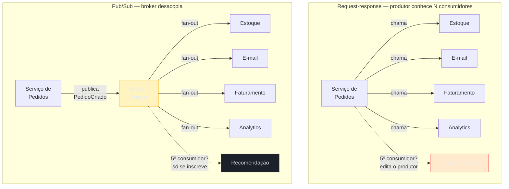
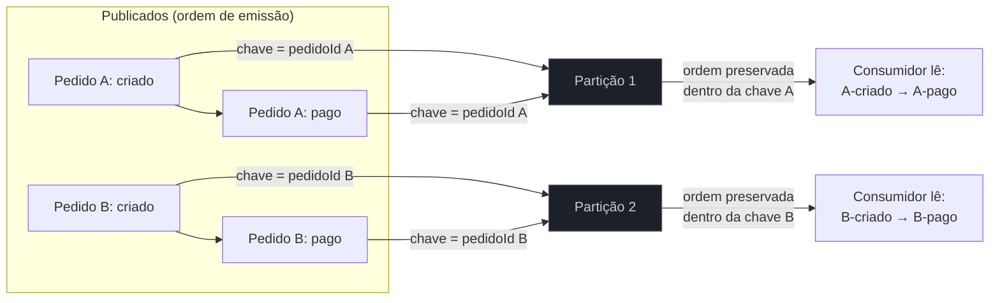
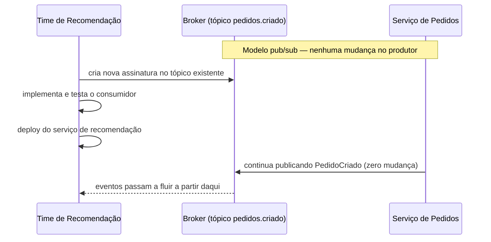

# Pub-Sub e event-driven em escala

> [!abstract] TL;DR
> Um serviço de pedidos que precisa notificar estoque, e-mail, faturamento e analytics acaba com uma chamada síncrona para cada um — e cada novo consumidor exige mexer no código do produtor. O padrão **publish/subscribe** quebra esse acoplamento: o produtor publica um evento (`PedidoCriado`) num **broker**, sem saber quem — nem quantos — vão consumi-lo; qualquer serviço interessado se **inscreve** num tópico e recebe uma cópia. Isso dá **fan-out** (um evento, N consumidores) e permite adicionar consumidores novos sem tocar no produtor. O preço: consistência eventual, entrega *at-least-once* (exige idempotência), ordering só garantido dentro de uma partição/chave — nunca global —, e um broker que vira peça crítica de infraestrutura (particionamento, replicação, backpressure). Event-driven vence quando o valor está em **desacoplamento e extensibilidade**; request-response vence quando o cliente precisa de uma **resposta imediata e sabe exatamente quem responde**.

Volte ao serviço de pedidos. No dia 1, ele só precisa gravar o pedido e chamar o serviço de estoque para reservar os itens. Uma chamada HTTP síncrona resolve — dois serviços, um contrato, pronto.

No dia 90, o produto cresceu. Marketing quer disparar um e-mail de confirmação. Financeiro quer registrar a operação para faturamento. Um novo time de dados quer alimentar o pipeline de analytics em tempo real. Cada um desses pedidos vira uma chamada nova dentro do handler de "criar pedido":

```
criarPedido():
    salvar(pedido)
    chamar(estoqueService.reservar)
    chamar(emailService.enviarConfirmacao)
    chamar(faturamentoService.registrar)
    chamar(analyticsService.registrarEvento)
```

Cada chamada nova é uma dependência nova. O serviço de pedidos agora *conhece* quatro outros serviços — seus endereços, seus contratos, seus modos de falha. Se o serviço de analytics ficar fora do ar, o pedido trava (ou o time de pedidos precisa lembrar de tratar aquele erro especificamente). Se marketing quiser adicionar um quinto consumidor — um serviço de recomendação que reage a compras — alguém precisa **abrir e editar o código do time de pedidos** para adicionar mais uma chamada. O produtor virou um hub que sabe de tudo que acontece a jusante dele, e cada consumidor novo é uma mudança no produtor.

Essa é a dor que o pub/sub resolve. Em vez de o produtor chamar cada consumidor um por um, ele publica **um único evento** — `PedidoCriado` — num broker. Estoque, e-mail, faturamento e analytics se inscrevem nesse evento de forma independente. O serviço de pedidos nunca precisa saber que analytics existe. Quando o time de recomendação quiser entrar, ele simplesmente se inscreve — zero linha de código alterada no produtor.



Repare no diagrama: à esquerda, cada seta é uma dependência que o produtor carrega. À direita, o produtor tem **uma** dependência — o broker — e o broker é quem carrega o conhecimento de quantos e quais consumidores existem. O acoplamento não desaparece; ele **migra do código para a infraestrutura**, que é desenhada para esse tipo de fan-out.

## Os três papéis: produtor, broker, assinante

O vocabulário do padrão é pequeno, mas vale fixar porque a entrevista usa esses termos com precisão.

**Publisher (produtor).** Publica eventos num **tópico** — um canal nomeado, tipicamente por tipo de evento ou por entidade (`pedidos.criado`, `usuarios.atualizado`). O publisher não sabe, nem precisa saber, quantos assinantes existem, se algum está fora do ar, ou o que cada um faz com o evento.

**Broker.** O intermediário que recebe eventos publicados e os entrega a todos os assinantes do tópico correspondente. É a peça que faz o **fan-out** acontecer — replicar uma mensagem para N filas ou streams de saída, um por assinante (ou por grupo de assinantes). Exemplos: Google Cloud Pub/Sub, AWS SNS (com fan-out para SQS), Apache Kafka (com múltiplos consumer groups), RabbitMQ (com exchanges do tipo *fanout* ou *topic*).

**Subscriber (assinante/consumidor).** Se inscreve num tópico — às vezes com um filtro (só eventos de um certo tipo, ou que casem um padrão) — e recebe uma cópia de cada evento publicado. Processa de forma independente dos outros assinantes: se o consumidor de e-mail está lento, isso não afeta o consumidor de analytics.

> [!question]- Pub/sub é a mesma coisa que uma fila de mensagens?
> Não — são parentes, não sinônimos. Uma **fila tradicional** (a que a nota [[05 - Message queues e processamento assíncrono]] detalha) tipicamente entrega cada mensagem a **um** consumidor lógico, mesmo que várias instâncias competam por ela (*competing consumers* — é assim que você paraleliza). **Pub/sub** entrega a mesma mensagem a **múltiplos assinantes independentes**, cada um com sua própria cópia e seu próprio ritmo de leitura. Na prática, muitos brokers modernos suportam os dois padrões ao mesmo tempo: um tópico Kafka pode ter vários *consumer groups* — dentro de cada grupo, as partições são distribuídas entre instâncias (competing consumers); entre grupos, cada um recebe o stream inteiro (pub/sub). SNS+SQS no AWS é o exemplo mais didático: SNS faz o fan-out pub/sub para N filas SQS, e dentro de cada fila SQS o padrão vira competing consumers.

### Granularidade do tópico: fino ou grosso?

Uma decisão de design que a entrevista raramente pergunta diretamente, mas que aparece se você for fundo no deep dive: quantos tópicos criar, e com que granularidade?

**Tópico grosso** (`pedidos`): todos os eventos do ciclo de vida de um pedido — criado, pago, enviado, cancelado — no mesmo tópico, diferenciados por um campo `tipo` no payload. Vantagem: um assinante que quer *todo* o histórico de um pedido se inscreve em um lugar só, e a ordem entre esses eventos (que têm relação causal forte) é mais fácil de preservar, porque tendem a compartilhar a mesma chave de particionamento. Desvantagem: um consumidor que só quer `pedido.cancelado` recebe tudo e filtra do lado dele, gastando banda e CPU com eventos que descarta.

**Tópico fino** (`pedidos.criado`, `pedidos.pago`, `pedidos.cancelado`): um tópico por tipo de evento. Vantagem: cada assinante se inscreve só no que precisa, sem filtro do lado do cliente. Desvantagem: se um consumidor precisa da sequência completa de eventos de um pedido, ele tem que juntar streams de tópicos diferentes — e a ordem relativa *entre tópicos* não é garantida por partição alguma.

Alguns brokers (Google Pub/Sub, EventBridge) oferecem uma terceira via: **um tópico com filtros de assinatura** — o produtor publica tudo num tópico só, com atributos no metadata (`tipo=cancelado`), e cada assinatura declara um filtro sobre esses atributos. O broker resolve o roteamento; o consumidor recebe só o que casa o filtro, sem o produtor precisar conhecer a granularidade que cada consumidor quer. É geralmente a opção mais flexível quando o conjunto de consumidores é heterogêneo e muda com frequência — só custa um pouco de complexidade extra no produtor (anexar os atributos certos).

## Event notification vs event-carried state transfer

Nem todo evento carrega a mesma coisa, e a escolha muda o acoplamento entre produtor e consumidor de um jeito sutil que passa despercebido até dar problema em produção.

**Event notification.** O evento é magro — carrega só o essencial para dizer "algo aconteceu", tipicamente um ID e o tipo do evento: `{ "evento": "PedidoCriado", "pedidoId": "abc123" }`. Se o consumidor precisa de mais dados (o valor do pedido, os itens), ele faz uma chamada de volta ao produtor — ou a outro serviço — para buscá-los.

Vantagem: o evento é pequeno e simples, o contrato muda pouco. Desvantagem: reintroduz uma dependência síncrona escondida — se o serviço de pedidos está fora do ar, os consumidores não conseguem buscar os detalhes, mesmo tendo recebido a notificação.

**Event-carried state transfer.** O evento carrega o estado relevante inteiro: `{ "evento": "PedidoCriado", "pedidoId": "abc123", "valor": 259.90, "itens": [...], "clienteId": "xyz" }`. O consumidor tem tudo que precisa sem chamar ninguém de volta.

Vantagem: desacoplamento real, mesmo em runtime — o consumidor processa o evento mesmo se o produtor estiver fora do ar naquele instante. Desvantagem: o payload cresce, o contrato do evento fica mais rígido (mudar o formato do pedido quebra todo mundo que consome), e cada consumidor pode acabar guardando sua própria cópia (desnormalizada) do estado do pedido — o que é exatamente o material com que **Event Sourcing** trabalha, quando esse histórico de estados vira a fonte de verdade em si.

> [!question]- Quando vale a pena pagar o payload maior do state transfer?
> Quando a alternativa — o consumidor chamar de volta o produtor a cada evento — cria uma dependência síncrona que anula o próprio motivo de usar eventos. Se o serviço de analytics recebe 10 mil eventos `PedidoCriado` por segundo e chama de volta o serviço de pedidos para cada um buscar o valor, você recriou o acoplamento que tentou eliminar, só que escondido dentro do consumidor. A regra prática: eventos de alto volume ou que alimentam múltiplos consumidores heterogêneos tendem para state transfer; eventos raros, onde o consumidor já tem contexto suficiente e só precisa de um gatilho, toleram notification magra. O aprofundamento de "o log de eventos como fonte da verdade" — quando o estado *é* a sequência de eventos, não um resumo dela — é assunto da próxima nota, [[03 - Event Sourcing sob a ótica de system design]].

## Event-driven vs request-response: quando cada um vence

A pergunta que mais aparece em entrevista não é "você conhece pub/sub?" — é "por que pub/sub *aqui* e não uma chamada direta?". A resposta certa amarra a escolha a três eixos.

| Eixo | Request-response vence | Event-driven vence |
|------|------------------------|---------------------|
| Resposta ao cliente | Cliente precisa de um resultado *agora* (autorizar pagamento, validar login) | Cliente não precisa saber o resultado imediatamente (enviar e-mail, atualizar índice de busca) |
| Acoplamento | Poucos consumidores, estáveis, conhecidos de antemão | Consumidores variam com o tempo; novos times/serviços vão querer reagir ao mesmo fato |
| Transação | Operação precisa de garantia atômica entre as partes (tudo ou nada) | Cada consumidor pode processar de forma independente, com sua própria consistência |
| Pico de carga | Cliente tolera (ou já implementa) backpressure explícito | O broker absorve o pico como buffer — quem processa lento não derruba quem processa rápido |
| Debugging | Uma stack trace, um fluxo linear, fácil de seguir | Fluxo distribuído entre N consumidores — exige tracing distribuído para reconstruir "o que aconteceu" |

O erro mais comum não é escolher o modelo errado — é aplicar **um dos dois em tudo**. Times que só usam request-response acabam com um grafo de chamadas síncronas frágil, onde a disponibilidade do sistema é o produto das disponibilidades de cada dependência. Times que convertem tudo em eventos acabam com o que a comunidade chama de "**event spaghetti**": ninguém consegue responder "o que acontece quando um pedido é criado?" porque a resposta está espalhada em dez consumidores desconectados, sem um lugar central que documente o fluxo. Martin Fowler nomeia esse ponto de tensão diretamente em seu ensaio sobre arquitetura orientada a eventos: o mesmo mecanismo que dá desacoplamento também dificulta responder "quem depende de quê" — o preço da flexibilidade é a perda de visibilidade do fluxo ponta a ponta.

> [!warning] Usar eventos onde a operação precisa ser transacional
> **O que acontece:** o candidato desenha "cobrar cartão" como um evento publicado, assumindo que um consumidor vai processar o pagamento em algum momento — e responde "compra confirmada" ao usuário antes de saber se o pagamento passou. **Por quê:** eventos são processados de forma assíncrona e eventualmente consistente; não há garantia de que o consumidor rodou *antes* da resposta ser dada ao cliente. **Como evitar:** operações onde o cliente precisa saber o resultado para decidir o próximo passo (pagamento aprovado? posso liberar o produto?) ficam síncronas. Eventos entram *depois* que o resultado crítico já está garantido — como na nota [[05 - Message queues e processamento assíncrono]], que separa exatamente essas três etapas (cobrar, baixar estoque, gravar pedido) do que pode virar evento (notificar, indexar, agregar).

## Ordering: garantido só dentro de uma chave

Um erro recorrente em entrevista é assumir que "publiquei A antes de B" significa "os consumidores processam A antes de B". Em um tópico com múltiplos consumidores e (tipicamente) múltiplas partições, isso **não é verdade em geral**.

A maioria dos brokers modernos particiona um tópico para escalar — cada partição pode ser lida e processada em paralelo. Mas paralelismo e ordem são forças opostas: se duas mensagens vão para partições diferentes, não há garantia sobre qual chega primeiro no consumidor, porque estão sendo processadas por caminhos independentes.

A saída é **ordering por chave**: você associa cada evento a uma chave de particionamento (`pedidoId`, `clienteId`) e o broker garante que **todas as mensagens com a mesma chave** vão para a mesma partição, na ordem em que foram publicadas. Eventos com chaves diferentes podem chegar fora de ordem *entre si* — e isso é aceitável, porque geralmente eventos de entidades diferentes não têm relação de causa-efeito entre si.

O Google Cloud Pub/Sub formaliza exatamente essa garantia com **ordering keys**: mensagens publicadas com a mesma chave, na mesma região, são entregues na ordem em que chegaram ao serviço — mas mensagens com chaves diferentes não têm ordem garantida entre elas, e mensagens com chave vazia não são ordenadas de forma alguma. Kafka resolve o mesmo problema pela chave de partição do produtor: mensagens com a mesma chave sempre vão para a mesma partição, e dentro de uma partição a ordem de escrita é preservada.



> [!question]- Por que não garantir ordem global — não seria mais simples?
> Seria mais simples de raciocinar, mas custaria o próprio motivo de usar um broker distribuído: para garantir ordem global, todas as mensagens de todos os produtores teriam que passar por um único ponto de serialização — o que vira um gargalo e elimina o paralelismo entre partições. A engenharia por trás de ordering por chave é justamente reconhecer que, na prática, você só precisa de ordem *entre eventos relacionados causalmente* (o mesmo pedido, o mesmo usuário, a mesma sessão) — eventos de entidades diferentes são, por definição, independentes, então ordenar entre eles não tem significado de negócio. Trocar "ordem global" por "ordem por chave" é o mesmo tipo de trade-off que sharding faz entre consistência e escala, visto na nota [[04 - Sharding e Consistent Hashing]] do bloco anterior.

## Entrega: at-least-once exige idempotência

A garantia de entrega mais comum em sistemas pub/sub de produção é **at-least-once**: o broker garante que toda mensagem publicada será entregue a cada assinante *pelo menos uma vez* — mas pode entregá-la mais de uma vez. Isso acontece, por exemplo, quando um consumidor processa a mensagem mas falha (ou demora demais) para confirmar o ack antes do broker decidir reenviá-la — o próprio Google Cloud documenta esse comportamento: o Pub/Sub pode reentregar mensagens, e num tópico com ordering, a reentrega de uma mensagem dispara a reentrega de todas as mensagens subsequentes daquela chave, mesmo as já confirmadas.

A consequência prática: **todo consumidor de eventos deve ser idempotente** — processar a mesma mensagem duas vezes precisa produzir o mesmo resultado que processá-la uma vez. Isso normalmente significa verificar, antes de aplicar o efeito (debitar saldo, enviar e-mail, gravar registro), se aquele `eventoId` já foi processado — uma checagem contra uma tabela de IDs vistos, ou uma operação naturalmente idempotente (`SET status = 'pago'` é idempotente; `saldo += valor` não é, a menos que você verifique o ID antes).

O detalhe fino das garantias de entrega — *at-most-once*, *at-least-once*, o porquê de *exactly-once* ser cara e quase sempre ilusória em sistemas distribuídos — é o assunto central da nota [[05 - Message queues e processamento assíncrono]]; aqui vale reter só a consequência de design: **um consumidor pub/sub que não é idempotente vai, cedo ou tarde, processar um evento duas vezes e corromper estado**.

## O que o desacoplamento custa

Pub/sub não é grátis. Trocar chamadas síncronas por eventos resolve o acoplamento de código, mas introduz três custos que uma entrevista sênior espera que você nomeie sem ser cutucado.

**Consistência eventual.** Quando o serviço de pedidos publica `PedidoCriado`, o consumidor de faturamento pode processar o evento um segundo depois — ou, sob backpressure, minutos depois. Entre a publicação e o processamento, o sistema está num estado onde "o pedido existe" mas "o faturamento não sabe disso ainda". Se algum fluxo de negócio depende de ambos estarem sincronizados (ex: emitir nota fiscal só depois que o faturamento registrou), esse fluxo precisa lidar explicitamente com essa janela, não assumir que ela não existe.

**Debugging distribuído.** Numa chamada síncrona, um erro produz uma stack trace contínua: você vê a cadeia inteira de chamadas que levou à falha. Num fluxo orientado a eventos, o produtor não sabe (nem deveria saber) o que aconteceu depois que publicou. Reconstruir "por que o e-mail de confirmação não chegou" exige correlacionar logs de serviços diferentes por um ID de evento comum, tipicamente com tracing distribuído (propagar um `trace_id` do produtor até cada consumidor). Sem essa disciplina, debugar produção vira arqueologia.

**Acoplamento temporal quebrado, de propósito — mas com consequência.** Um consumidor pode estar fora do ar, com deploy em andamento, ou simplesmente mais lento que a taxa de publicação. Isso é exatamente o ponto do padrão — mas significa que a fila de mensagens não entregues (ou o lag do consumer group) cresce, e alguém precisa monitorar isso. Um consumidor permanentemente mais lento que o produtor não é um bug pontual — é uma fila crescendo sem limite até estourar disco ou até você adicionar mais capacidade ao consumidor.

> [!warning] Event spaghetti — eventos sem governança
> **O que acontece:** o número de tópicos e consumidores cresce organicamente até que nenhum engenheiro consegue mais responder "o que dispara quando um pedido é criado?" sem grepar o código de dez serviços diferentes. **Por quê:** cada novo consumidor é fácil de adicionar (é a vantagem do padrão) — mas essa facilidade não vem com documentação automática do grafo de dependências que se forma. **Como evitar:** manter um catálogo de eventos (schema registry, esquema versionado por tópico) e nomear eventos por fato de negócio já ocorrido (`PedidoCriado`, não `CriarPedido` — evento é passado, comando é futuro). Isso não elimina a complexidade, mas a torna rastreável.

**Evolução de esquema.** O quarto custo, menos discutido, é contratual: o formato do evento é um contrato compartilhado por todos os assinantes, presentes e futuros — e ninguém sabe, de antemão, quantos assinantes existem. Numa chamada síncrona, mudar um contrato de API quebra imediatamente quem chama, e o erro aparece na hora (é ruim, mas é visível). Num evento, se você remover um campo que um assinante lia, esse assinante começa a falhar silenciosamente — o produtor nunca fica sabendo, porque nunca soube quem estava ouvindo. A prática que mitiga isso é tratar o schema do evento como uma API pública: aditivo por padrão (só adicionar campos opcionais), versionado quando uma mudança é realmente incompatível (`pedido.criado.v2`), e — quando a escala justifica — registrado num *schema registry* que valida compatibilidade antes de aceitar uma publicação.

> [!warning] Broker como "banco de dados compartilhado" disfarçado
> **O que acontece:** múltiplos times passam a depender do formato exato do payload de um evento — inclusive de campos que deveriam ser detalhe de implementação do produtor — e qualquer refatoração interna do time produtor vira uma reunião de coordenação com todos os consumidores. **Por quê:** o evento virou, na prática, um contrato rígido tão acoplado quanto uma tabela de banco compartilhada entre serviços — só que sem o controle de schema que um banco relacional daria. É o mesmo anti-padrão do "banco de dados compartilhado" entre microserviços, discutido em [[Arquitetura de Software]], só que reencarnado na camada de eventos. **Como evitar:** tratar o payload do evento como uma API versionada e deliberadamente desenhada — não como um dump interno da estrutura de dados do produtor. Campos que são detalhe de implementação (chaves internas, flags de controle) não deveriam vazar para o evento público.

## O broker como gargalo e ponto único de falha

O broker é a peça que absorve todo o acoplamento que os serviços deixaram de ter entre si — o que o torna, ao mesmo tempo, indispensável e um risco concentrado. Se o broker cai, produtores não conseguem publicar (ou publicam para um buffer que eventualmente estoura) e consumidores não recebem nada.

Brokers de produção resolvem isso do mesmo jeito que qualquer armazenamento distribuído resolve disponibilidade: **replicação** (cada partição tem réplicas em nós/zonas diferentes; se um nó cai, uma réplica assume) e **particionamento** (o tópico é dividido em partições, cada uma podendo ser servida por um broker diferente, distribuindo tanto a carga de escrita quanto o risco de falha). Esse é o mesmo raciocínio de sharding e consistent hashing que aparece no bloco anterior da trilha — aqui aplicado à camada de mensageria em vez de à camada de dados.

Na prática de entrevista, isso significa que "coloquei um broker no meio" não é o fim do deep dive — é o começo. As perguntas de aprofundamento naturais são: quantas partições o tópico tem, e por qual chave? O que acontece se uma partição ficar sobrecarregada (hot partition)? O broker está replicado entre zonas de disponibilidade? Existe uma *dead-letter queue* para mensagens que falham repetidamente, para não travar a partição inteira?

## Exemplo trabalhado: adicionando um consumidor em produção

Para fechar o raciocínio com números, volte ao serviço de pedidos e compare o custo de adicionar o consumidor de recomendação nos dois modelos — não em abstrato, mas como uma mudança real de deploy.

**No modelo request-response:** adicionar recomendação exige (1) o time de pedidos abrir um PR adicionando a chamada, (2) revisar e testar essa mudança no serviço de pedidos — que já é crítico, já tem SLA apertado, e agora carrega uma dependência nova em produção —, (3) coordenar o deploy para não quebrar o checkout se o serviço de recomendação ainda não estiver pronto, e (4) se o serviço de recomendação for lento ou cair, decidir explicitamente se isso deve derrubar o checkout (chamada síncrona bloqueante) ou ser isolado com timeout curto e fallback. Cada consumidor novo repete esse mesmo processo, e o serviço de pedidos acumula complexidade condicional para lidar com a falha de cada um.

**No modelo pub/sub:** o time de recomendação escreve seu próprio serviço, inscreve-se no tópico `pedidos.criado` (ou no evento com o filtro certo), testa contra o mesmo tópico em um ambiente de staging, e faz deploy — **sem tocar em uma linha do serviço de pedidos**. Se o serviço de recomendação cair no primeiro dia em produção, o pior caso é que ele fica com lag de mensagens não processadas (que ele drena quando volta); o checkout nunca soube que ele existiu.



A diferença entre os dois não é só velocidade de entrega — é **quem carrega o risco** de um consumidor novo dar errado. No pub/sub, o risco fica isolado no próprio consumidor. No request-response, o risco vaza para trás, para o produtor, que agora depende da saúde de todo mundo que ele chama.

## Em entrevista

Pub/sub aparece o tempo todo em walkthroughs de sistemas de notificação, feeds de atividade, pipelines de analytics e qualquer arquitetura de microserviços com mais de três ou quatro serviços interagindo. O sinal que separa uma resposta júnior de uma sênior não é "eu usaria um message broker aqui" — é justificar *por que* esse ponto do design pede desacoplamento assíncrono, e nomear o trade-off que você está aceitando em troca.

Uma resposta forte costuma ter esta forma: "esse fan-out para notificação, analytics e faturamento não precisa bloquear a resposta ao usuário, e o conjunto de consumidores vai crescer com o tempo — então eu publico um evento `PedidoCriado` em vez de chamar cada serviço diretamente. Isso significa que preciso que cada consumidor seja idempotente, porque o broker entrega pelo menos uma vez; e que, se algum fluxo de negócio depender de dois consumidores estarem sincronizados, eu preciso desenhar isso explicitamente, porque a consistência entre eles é eventual, não imediata."

Note a estrutura: nomeia o padrão, justifica pelo requisito (desacoplamento, extensibilidade), e assume o custo (idempotência, consistência eventual) sem que o entrevistador precise perguntar.

> [!question]- Preciso saber a diferença entre Kafka, RabbitMQ, SNS e Google Pub/Sub para essa pergunta?
> Não em detalhe de implementação — isso é o assunto de [[05 - Message queues e processamento assíncrono]] e do vocabulário de mensageria, não desta nota. O que importa aqui é o **padrão**: broker desacoplando publisher de subscribers, fan-out, ordering por chave, entrega at-least-once. Se o entrevistador perguntar "qual tecnologia você usaria", uma resposta razoável é escolher com base no requisito dominante — precisa de replay e múltiplos consumer groups independentes de longo prazo? Kafka. Precisa de fan-out simples gerenciado, sem operar infraestrutura própria? SNS/SQS ou Google Pub/Sub. O nome da tecnologia importa menos que você saber *por que* aquele requisito aponta para ela.

## Como explicar em inglês

Publish/subscribe decouples a producer from its consumers: the producer publishes an event to a broker without knowing who — or how many — services will react to it. Any interested service subscribes to the topic and gets its own copy. That's what makes fan-out possible: one event, N independent consumers, with zero code changes to the producer when a new consumer joins.

The trade-off you should name unprompted: at-least-once delivery means every consumer has to be idempotent, ordering is only guaranteed within a partition key (never globally), and the whole system trades immediate consistency for eventual consistency. The broker itself becomes critical infrastructure — it needs partitioning and replication, or it's a single point of failure for everything that depends on it.

> "I'd publish an `OrderCreated` event here instead of calling each downstream service directly, because the set of consumers is going to grow and none of them need to block the user's response. The cost is that every consumer needs to be idempotent — since delivery is at-least-once — and if any business flow depends on two consumers being in sync, I need to design for that explicitly, because consistency between them is eventual."

| PT | EN |
|----|----|
| Publicador / produtor | Publisher / producer |
| Assinante / consumidor | Subscriber / consumer |
| Corretor de mensagens | Message broker |
| Tópico | Topic |
| Espalhamento (um evento, N consumidores) | Fan-out |
| Notificação de evento | Event notification |
| Transferência de estado via evento | Event-carried state transfer |
| Entrega pelo menos uma vez | At-least-once delivery |
| Idempotência | Idempotency |
| Chave de ordenação | Ordering key |
| Consistência eventual | Eventual consistency |
| Acoplamento temporal | Temporal coupling |
| Fila de mensagens mortas | Dead-letter queue |

## O que vem a seguir

Pub/sub resolve *como* um fato se propaga para quem se interessa por ele. As duas próximas notas deste sub-galho pegam esse mesmo evento e mostram para que mais ele serve, além de notificar: separar o modelo de leitura do de escrita (CQRS), e usar o próprio fluxo de eventos como fonte da verdade (Event Sourcing).

- [[02 - CQRS sob a ótica de system design]] — quando vale separar o caminho de escrita do de leitura por razão de escala e latência
- [[03 - Event Sourcing sob a ótica de system design]] — o log de eventos como fonte da verdade, replay e o custo operacional de manter isso

## Veja também

- [[System Design/index|System Design]] — o galho-pai e o mapa da trilha
- [[3 - Padrões recorrentes/index|Padrões recorrentes]] — os demais padrões deste sub-galho
- [[Arquitetura de Software]] — arquitetura orientada a eventos (EDA) como estilo arquitetural, para além da lente de escala desta nota
- [[05 - Message queues e processamento assíncrono]] — o substrato: fila vs log, garantias de entrega, backpressure

## Fontes

- **Martin Kleppmann** — *Designing Data-Intensive Applications*, cap. 11 ("Stream Processing") — a formalização de publishers/subscribers, tópicos, particionamento e o paralelo entre logs de eventos e bancos de dados.
- **Martin Fowler** — [*What do you mean by "Event-Driven"*](https://martinfowler.com/articles/201701-event-driven.html) (2017, ainda referência canônica) — a distinção entre event notification, event-carried state transfer, event sourcing e CQRS como quatro padrões distintos que usam a palavra "evento".
- **Google Cloud** — [*Ordering messages*](https://docs.cloud.google.com/pubsub/docs/ordering) — garantias de ordering key, comportamento de reentrega em tópicos ordenados; consultado em julho de 2026.
- **Google Cloud** — [*Publish with ordering keys*](https://docs.cloud.google.com/pubsub/docs/samples/pubsub-publish-with-ordering-keys) — limites práticos (1 KB por chave, 1 MBps de throughput por chave, mesma região).
- **AWS** — [*Fanout to Amazon SQS queues*](https://docs.aws.amazon.com/sns/latest/dg/sns-common-scenarios.html) — o padrão SNS+SQS como exemplo canônico de pub/sub compondo com competing consumers.
