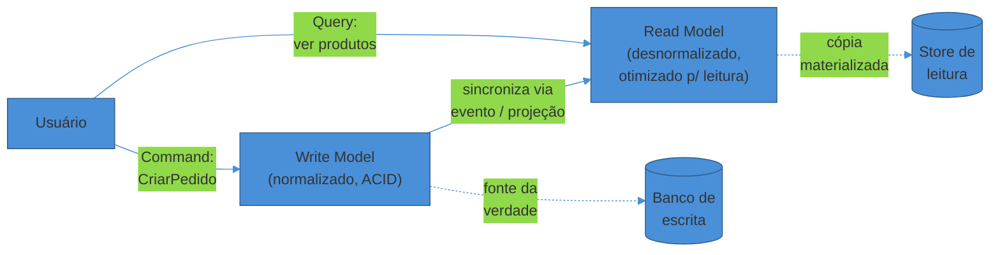
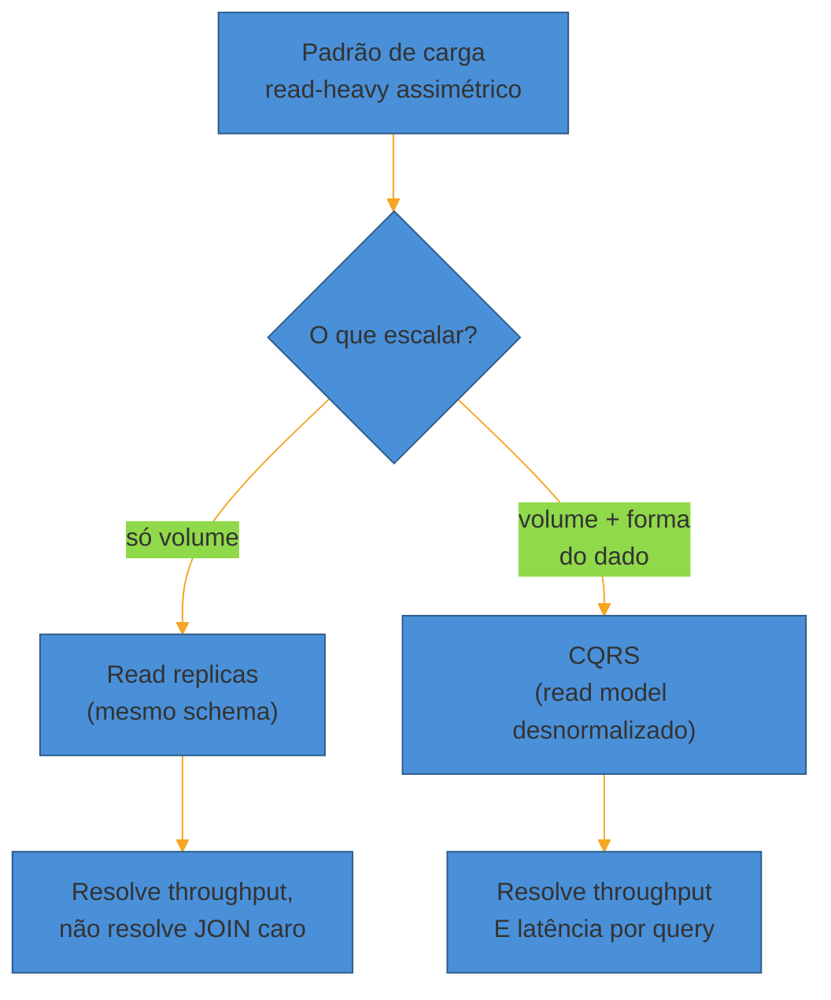
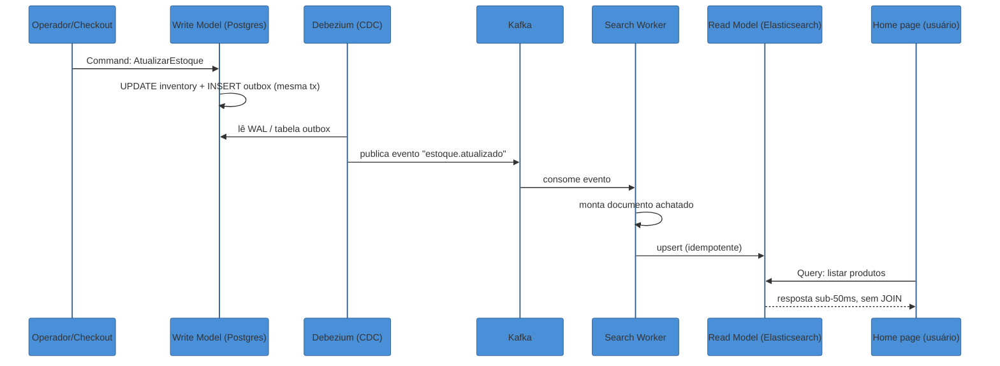
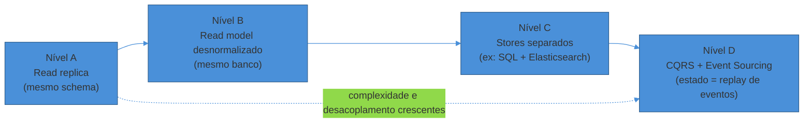
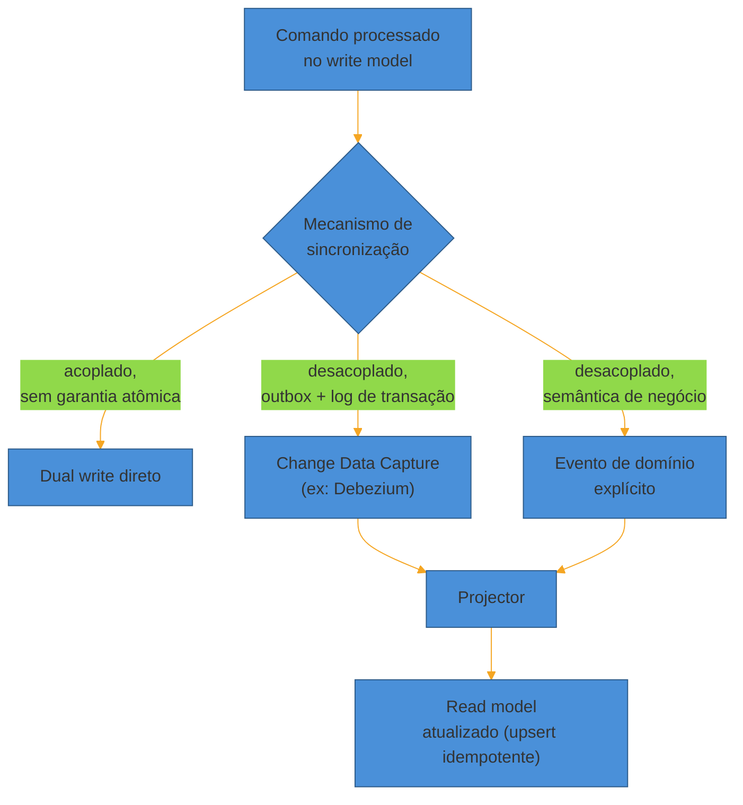

# CQRS sob a ótica de system design

> [!abstract] TL;DR
> **CQRS** (Command Query Responsibility Segregation) separa o modelo que **escreve** dados do modelo que **lê** dados — em vez de um único modelo servindo os dois. A razão de existir, sob a ótica de escala, não é elegância de código: é que **leitura e escrita têm perfis de carga opostos**. Leitura tende a ser massiva, tolerante a dado um pouco velho, e se beneficia de desnormalização agressiva. Escrita precisa de poucas transações, mas com integridade estrita. Forçar os dois modelos a compartilhar um único schema normalizado significa otimizar para nenhum dos dois. CQRS quebra esse impasse — ao custo de introduzir **consistência eventual** entre os lados e um mecanismo de sincronização (eventos, CDC ou outbox) que vira, ele mesmo, uma peça de infraestrutura a operar. Vai de "leve" (uma read replica) a "pesado" (stores fisicamente diferentes acoplados a Event Sourcing). Na maioria dos CRUDs — e Udi Dahan, um dos nomes fundadores do padrão, é categórico sobre isso — o custo não compensa. Saber reconhecer isso é tão sinal de senioridade quanto propor o padrão na hora certa.

Um e-commerce de médio porte roda num monólito com um Postgres normalizado. `orders`, `order_items`, `products`, `inventory`, `reviews`, `categories` — o catálogo clássico de tabelas com foreign keys por toda parte.

O checkout usa esse modelo direto: criar um pedido é um `INSERT` em `orders`, decrementar `inventory`, tudo dentro de uma transação. Rápido, correto, ACID. Ninguém reclama.

O problema mora na home page. Ela renderiza uma grade de "produtos mais vendidos na sua região, com preço, estoque, nota média e badge de frete grátis" — uma query que faz `JOIN` entre seis tabelas, agrega avaliações, calcula frete por CEP. Em baixo tráfego, essa query roda em 40ms. Sob a Black Friday, com 50 mil requisições por segundo batendo na home, o mesmo `JOIN` degrada para 2 segundos — e pior: ele compete pelas mesmas conexões e pelo mesmo I/O do banco que está processando o checkout.

O resultado é perverso: **a leitura pesada da home derruba a escrita do checkout**. O sistema começa a perder vendas não porque falta capacidade de processar pedidos, mas porque a query de exibição de produtos satura o banco que os pedidos também usam.

A causa raiz não é "o banco é lento". É que **um único modelo de dados está tentando servir dois padrões de acesso incompatíveis**. O modelo de escrita quer normalização (uma verdade, um lugar, sem redundância — para nunca ficar inconsistente). O modelo de leitura quer o oposto: dados já achatados, pré-agregados, prontos para render — porque cada `JOIN` a mais é latência que o usuário sente.

CQRS nomeia a solução: **pare de fingir que é um modelo só**. Separe explicitamente o lado que escreve do lado que lê, e deixe cada um evoluir e escalar de forma independente. Esta nota volta a esse e-commerce mais adiante, com um fluxo completo de comando até query.

## O nome, tomado ao pé da letra

CQRS significa **Command Query Responsibility Segregation** — segregação de responsabilidade entre comando e consulta. O termo vem de uma ideia mais antiga e mais simples, o **Command-Query Separation** (CQS) de Bertrand Meyer: todo método de um objeto deveria ser um *comando* (muda estado, não retorna nada) ou uma *query* (retorna dado, não muda estado) — nunca os dois.

Greg Young pegou esse princípio de nível de método e o levou para o nível de **arquitetura de sistema inteiro**: em vez de um objeto separar seus próprios métodos em comando/query, o *sistema* separa seus próprios **modelos** em comando/query. Segundo Martin Fowler, que documentou o padrão em seu bliki, "at its heart is the notion that you can use a different model to update information than the model you use to read information" — e ele já embute o aviso: "for most systems CQRS adds risky complexity".

> [!question]- Command aqui é o mesmo "command" de mensageria (fila de comandos)?
> É relacionado, mas não é a mesma coisa. Um **comando**, em CQRS, é a intenção de mudança de estado — "CriarPedido", "AtualizarEstoque" — que passa pelo modelo de escrita, com validação e regras de negócio. Ele pode chegar via HTTP síncrono, via fila, ou via qualquer transporte; CQRS não exige fila. O que CQRS exige é que esse comando seja processado por um caminho de código *diferente* do caminho que responde queries. A confusão comum é achar que CQRS = mensageria assíncrona obrigatória. Não é — dá para ter CQRS com command e query ambos síncronos, só que em modelos de dados separados. Mensageria (nota anterior deste sub-galho, [[01 - Pub-Sub e event-driven em escala]]) é uma *técnica* frequentemente usada para sincronizar os dois lados, não uma exigência do padrão.

Na prática, isso significa dois caminhos de código (e frequentemente dois esquemas de dados) para a mesma entidade de negócio:

- **Command side (write model):** recebe intenções de mudança, valida regras de negócio, garante integridade. Normalizado, otimizado para consistência e transações corretas — não para velocidade de leitura.
- **Query side (read model):** recebe apenas leituras, serve dados já formatados para exibição. Desnormalizado, replicado, cacheado — otimizado para latência e throughput de leitura, não para integridade transacional (porque ele não *decide* nada, só reflete uma decisão já tomada).



Repare no detalhe crítico do diagrama: a seta de sincronização vai **de** write model **para** read model, nunca o contrário. O read model nunca é a fonte da verdade — ele é uma **projeção** derivada, reconstruível a qualquer momento a partir do write model. Se o read model corromper ou sumir, você pode recriá-lo do zero, reprocessando o histórico de eventos ou reexportando o write model. Se o write model corromper, você perdeu dado de verdade.

## Por que isso é uma decisão de escala, não de modelagem

É tentador ler CQRS como uma técnica de Domain-Driven Design — e ela de fato nasceu nesse contexto, junto com agregados e bounded contexts (ver [[Event Storming]] e [[Arquitetura de Software]] para o tratamento tático completo). Mas em entrevista de system design, a lente que importa é outra: **CQRS é, acima de tudo, uma resposta a padrões de carga assimétricos**.

A maioria dos sistemas do mundo real não tem leitura e escrita balanceadas 50/50. Elas são **read-heavy** por larga margem — um encurtador de URL é 100:1 leitura/escrita; uma rede social é ainda mais assimétrica; até um sistema transacional como e-commerce costuma ter 10-20x mais visualizações de produto do que checkouts efetivados.

Essa assimetria já é resolvida, em parte, por **read replicas** (ver [[03 - Bancos de dados em escala - SQL vs NoSQL e replicação]]): copiar o mesmo schema para réplicas e distribuir a leitura entre elas. Isso resolve o *volume* de leitura, mas não resolve a *forma* dos dados — a réplica ainda tem o schema normalizado, então a query cara com seis `JOIN`s continua cara, só que em mais máquinas.

CQRS vai um passo além: além de replicar, ele **transforma a forma do dado**. O read model não é uma cópia idêntica do write model — é uma versão já achatada, pré-agregada, moldada exatamente para as queries que a aplicação faz. É a diferença entre "ter mais cópias do mesmo mapa complicado" e "desenhar um mapa mais simples para quem só precisa de uma rota".



Em uma frase: **read replica escala a mesma pergunta cara; CQRS troca a pergunta cara por uma pergunta barata, feita antecipadamente.**

## Exemplo trabalhado: do comando à query, com números

Volte ao e-commerce da abertura. Suponha que o time decide resolver o gargalo da home com CQRS de stores separados (Nível C, detalhado na próxima seção): Postgres continua sendo o write model; um índice Elasticsearch vira o read model do catálogo.

**1. O comando chega.** Um operador de estoque marca um produto como esgotado, ou o serviço de checkout decrementa a quantidade após uma venda. Isso vira um comando `AtualizarEstoque(produto_id, nova_quantidade)`, processado pelo write model. A transação faz duas coisas atomicamente, dentro do mesmo `COMMIT` do Postgres: atualiza a linha em `inventory` **e** insere um registro numa tabela `outbox` (`evento: "estoque.atualizado", payload: {...}, criado_em: now()`). Esse é o **padrão Outbox** — garantir que a mudança de estado e o registro do evento aconteçam na mesma transação local, para nunca existir um mundo em que o estoque mudou mas o evento não foi gerado (ou vice-versa).

**2. O evento se propaga.** Um processo assíncrono — tipicamente o Debezium, lendo o *write-ahead log* do Postgres via *change data capture* — detecta a nova linha na tabela outbox e publica o evento no Kafka, no tópico `catalog.inventory.updated`. O write model nunca fala diretamente com o Kafka; o CDC observa por fora, o que significa que uma falha no pipeline de eventos nunca pode derrubar o checkout.

**3. O projetor consome e reconstrói.** Um *Search Worker* (um serviço consumidor dedicado) está inscrito nesse tópico. Ao receber o evento, ele não aplica um "patch" ingênuo — ele busca o estado atual completo do produto (juntando preço do serviço de precificação, estoque do evento recém-chegado, nota média pré-calculada) e monta um único documento JSON achatado, sem nenhum `JOIN`:

```json
{
  "produto_id": "sku-88231",
  "nome": "Tênis Runner Pro",
  "preco_centavos": 29900,
  "estoque": 0,
  "nota_media": 4.6,
  "frete_gratis": true,
  "categoria": "calçados > tênis"
}
```

**4. O read model é atualizado.** O worker faz um `upsert` desse documento no índice Elasticsearch, usando `produto_id` como chave — a mesma operação de escrita, seja a primeira vez ou a centésima, o que garante **idempotência**: se o mesmo evento chegar duplicado (comum em sistemas distribuídos com entrega *at-least-once*), reaplicar o upsert não corrompe nada.

**5. A leitura acontece.** A home page consulta só o Elasticsearch: um `GET` por facetas (categoria, faixa de preço, frete grátis), sem tocar o Postgres, sem `JOIN`, respondendo em poucos milissegundos mesmo sob 50 mil req/s — porque o índice foi desenhado exatamente para essa pergunta.



O ganho concreto: a query da home saiu de um `JOIN` de seis tabelas competindo com o checkout, para uma busca facetada num índice dedicado, isolado fisicamente do banco transacional. O preço: entre o `COMMIT` no Postgres e o documento aparecer atualizado no Elasticsearch, existe uma janela de propagação — normalmente dezenas a poucas centenas de milissegundos sob operação normal, mas que pode crescer sob pico se o Kafka ou o worker engargalarem. Esse é exatamente o trade-off que a próxima seção nomeia.

## Os níveis de CQRS: do mais leve ao mais pesado

CQRS não é binário — é um espectro de quanto você separa. Vale reconhecer os níveis, porque a entrevista frequentemente pergunta "até onde você levaria isso aqui?", e a resposta certa quase nunca é o nível mais extremo.

**Nível A — Read replica simples.** O nível mais leve. Mesmo banco, mesmo schema, réplicas de leitura via replicação assíncrona nativa (streaming replication do Postgres, por exemplo). Tecnicamente já é uma segregação de responsabilidade — commands vão para o primary, queries vão para as réplicas — mas ainda não há transformação de forma. Alguns autores nem chamam isso de CQRS "de verdade"; é o degrau de entrada. Trade-off: resolve volume de leitura quase de graça (é um flag de configuração no SGBD), mas não resolve o custo do `JOIN` em si.

**Nível B — Read model desnormalizado, mesmo banco.** O write model normalizado continua existindo, mas você adiciona uma ou mais tabelas (ou *materialized views*, no sentido literal do SQL) desnormalizadas, pré-agregadas, atualizadas por trigger, job periódico, ou `REFRESH MATERIALIZED VIEW`. Ainda dentro do mesmo SGBD, então operacionalmente barato — um time só, um backup só, uma tecnologia só. Trade-off: resolve o `JOIN` caro sem trocar de tecnologia, mas o read model ainda compete pelo mesmo I/O físico do write model sob carga extrema, e o refresh costuma ser mais em lote do que em tempo real.

**Nível C — Stores fisicamente separados.** O write model vive num banco relacional (integridade forte); o read model vive numa tecnologia diferente, escolhida pela forma da query: Elasticsearch para busca textual e facetada (o exemplo trabalhado acima), Redis para lookups por chave em memória, um data warehouse colunar para analytics. A sincronização passa a ser assíncrona por natureza — via eventos publicados pelo write model (outbox) e consumidos por um *projector*. Trade-off: isolamento físico real — pico de leitura nunca mais derruba o write model — mas agora há duas tecnologias, dois esquemas, um pipeline de eventos para operar e monitorar, e consistência eventual explícita.

**Nível D — CQRS + Event Sourcing.** O write model deixa de guardar apenas o estado atual e passa a guardar a **sequência de eventos** que o produziu — o read model deixa de ser um "extra" e passa a ser a *única* forma prática de consultar o sistema, já que o event store bruto não é feito para servir queries. Greg Young resume a relação de forma direta: **"you can use CQRS without Event Sourcing, but with Event Sourcing you must use CQRS"** — porque, uma vez que o estado só existe como replay de eventos, alguma camada precisa materializar esse replay em algo consultável, e essa camada é, por definição, um read model CQRS. Trade-off: máxima flexibilidade (você pode gerar quantos read models quiser, reconstruir o passado, auditar cada mudança) ao custo operacional mais alto do espectro — é o assunto da próxima nota.



| Nível | Isolamento físico | Latência de propagação | Custo operacional | Quando escolher |
|-------|--------------------|-------------------------|--------------------|------------------|
| A — Read replica | Nenhum (mesmo schema) | Baixo (replicação nativa) | Mínimo | Só volume de leitura é o problema |
| B — View no mesmo banco | Parcial | Baixo a médio (refresh) | Baixo | `JOIN` caro, mas 1 tecnologia já basta |
| C — Stores separados | Total | Médio (pipeline de eventos) | Alto (2 tecnologias, pipeline) | Forma do dado muito diferente (busca, agregação) |
| D — CQRS + Event Sourcing | Total | Médio a alto | Muito alto | Auditoria/replay são requisito de negócio, não só performance |

O e-commerce da abertura, na prática, provavelmente resolveria seu problema já no **Nível B**: uma tabela `product_listing_view`, atualizada de forma assíncrona sempre que preço, estoque ou avaliação mudam, servindo a home direto — sem `JOIN`, sem tocar no banco transacional do checkout. O Nível C (o exemplo com Elasticsearch) só se justifica quando a home precisa de busca *full-text* com facetas complexas ("tênis azul, tamanho 42, entre R$200-400, frete grátis") — uma forma de consulta que um SGBD relacional não faz bem.

## Consistência eventual entre os lados: o lag que o usuário sente

Nada disso é de graça. No momento em que você separa os modelos, o read model deixa de refletir o write model **instantaneamente** — porque a sincronização entre eles não é mais a mesma transação. É **consistência eventual** (ver [[06 - CAP, consistência e consenso]] para o enquadramento formal em CAP/PACELC): o read model *vai* convergir para o estado correto, mas existe uma janela de tempo — segundos, às vezes menos, às vezes mais — em que ele está desatualizado.

Isso não é um detalhe técnico escondido; é uma experiência de usuário concreta. É o "acabei de postar e não vejo minha própria publicação no feed" ou, no exemplo do e-commerce, "acabei de vender a última unidade e a home ainda mostra 'em estoque' por mais três segundos".

O caso extremo não é cosmético — é dinheiro. Um incidente real documentado no contexto de sistemas de pagamento mostra o padrão: um lag de projeção de ~300ms entre write e read model já é suficiente para causar pagamentos duplicados e chargebacks, porque o usuário, vendo o saldo "antigo" no read model, tenta pagar de novo. Sob pico, uma única partição de Kafka congestionada fez esse lag saltar de 300ms para mais de 2 segundos — tempo suficiente para uma fila de usuários repetir a ação.

> [!warning] Subestimar o lag de propagação
> **O que acontece:** o time projeta CQRS pensando só no ganho de performance de leitura e esquece de decidir, explicitamente, quanto lag é aceitável — e o que fazer quando ele aparece na cara do usuário. **Por quê:** a sincronização write→read passa por uma fila ou um pipeline de eventos; sob pico de carga, esse pipeline pode atrasar (backpressure), e o lag que era de 200ms vira segundos sem ninguém perceber até o suporte começar a receber reclamações — ou, em domínios financeiros, até o time de fraude notar duplicatas. **Como evitar:** decida o SLA de propagação como requisito não-funcional explícito ("read model converge em até 2s, p99"), monitore o lag do pipeline como métrica de primeira classe (alertando bem antes do p99 estourar), particione o stream de eventos por chave de entidade (ex: `customer_id`) para que uma partição lenta não trave todo o resto, e garanta idempotência dos dois lados: no comando (deduplicar por ID de comando) e na projeção (upsert por chave, nunca "aplicar delta").

Três técnicas mitigam o lag de forma pragmática, sem abandonar CQRS:

**Read-your-writes para os poucos caminhos críticos.** Nem toda leitura precisa passar pelo read model assíncrono. Para o punhado de fluxos em que o próprio autor da escrita precisa ver o resultado imediatamente — "meu pedido foi criado?", "meu pagamento confirmou?" — sirva essa leitura específica direto do write model (ou de uma réplica síncrona), contornando o read model para essa consulta pontual. É uma exceção cirúrgica, não a regra geral: o resto do tráfego de leitura continua no read model rápido.

**Concorrência otimista no write model.** Quando dois comandos competem pela mesma entidade — dois operadores editando o mesmo produto ao mesmo tempo — o write model detecta o conflito por versionamento: cada agregado carrega um número de versão monotonicamente crescente; todo comando declara a versão que leu; se a versão mudou entre a leitura e a escrita, o comando é rejeitado e reenviado. Isso é ortogonal à sincronização com o read model, mas protege a integridade do lado que *de fato* precisa dela.

**UI otimista no cliente.** No frontend, a técnica espelha o mesmo trade-off em outra camada: atualizar a interface *antes* de receber a confirmação do servidor, assumindo que a operação vai ter sucesso (o que é verdade na esmagadora maioria das vezes — sistemas de logística relatam ~99,7% de sucesso nesse tipo de atualização) e revertendo silenciosamente se falhar. Isso não resolve o lag do read model — ele continua existindo no backend — mas resolve a *percepção* do usuário, que não fica olhando para um spinner enquanto o evento se propaga.

> [!question]- Se o read model pode ficar defasado, como evitar mostrar dado errado numa tela crítica (ex: saldo bancário)?
> A resposta correta quase sempre é: **não deixe essa tela específica depender do read model assíncrono**. CQRS não obriga que *toda* leitura do sistema passe pelo lado de query eventualmente consistente — você escolhe, caminho por caminho, onde a latência de leitura importa mais que a frescura (home page, catálogo, dashboards) e onde a frescura importa mais que a latência (saldo antes de uma transferência, confirmação de pagamento). Para os segundos, use read-your-writes ou simplesmente leia do write model — que é, afinal, a fonte da verdade e está sempre atualizado. Misturar as duas políticas na mesma arquitetura é normal e esperado; tratar CQRS como tudo-ou-nada é que costuma sair caro.

> [!question]- CQRS obriga a usar Event Sourcing?
> Não, mas os dois combinam tão bem que muita gente os confunde como um pacote único. CQRS só diz "separe leitura de escrita"; ele não diz *como* o write model guarda seu próprio estado. Você pode ter CQRS com um write model relacional convencional (linha por entidade, `UPDATE` normal) e sincronizar o read model via *change data capture* ou eventos de domínio publicados manualmente após cada commit — como no exemplo trabalhado acima. **Event Sourcing** é uma escolha diferente e mais radical para o *write model*: em vez de guardar o estado atual, guardar a sequência de eventos que levou até ele, e derivar o estado (inclusive os read models) por replay. A relação não é simétrica: dá para ter CQRS sem Event Sourcing, mas Event Sourcing exige CQRS, porque o event store bruto não é consultável — alguém precisa materializar um read model a partir dele. A próxima nota deste sub-galho, [[03 - Event Sourcing sob a ótica de system design]], trata disso em detalhe.

## O mecanismo de sincronização

Como o write model efetivamente atualiza o read model? Três abordagens dominam, em ordem crescente de desacoplamento — o exemplo trabalhado acima já usou a segunda.

**Dual write direto.** O código que processa o comando escreve no write model e, na mesma requisição, também escreve (ou atualiza) o read model. Simples de entender, mas frágil: se a segunda escrita falhar depois que a primeira já commitou, os modelos divergem silenciosamente — não há garantia atômica entre dois stores diferentes.

**Change Data Capture (CDC) com Outbox.** Uma ferramenta (Debezium é a referência open-source mais citada, construída sobre Kafka Connect) lê o *log de transação* do banco de escrita — o mesmo mecanismo interno usado para replicação — e transforma cada mudança de linha em um evento, publicado num broker. Combinado com o **padrão Outbox** (escrever o evento numa tabela dentro da mesma transação do comando), isso garante que "o estado mudou" e "o evento foi gerado" nunca divirjam — a consistência forte fica dentro do banco de escrita; a consistência eventual só aparece na propagação para fora. Um *projector* consome esses eventos e atualiza o read model. Vantagem: o write model nem precisa saber que CQRS existe além de escrever na tabela outbox; ele não fala diretamente com o broker.

**Eventos de domínio explícitos.** O código de negócio, ao processar um comando, publica deliberadamente um evento ("PedidoCriado", "EstoqueAtualizado") — não é um efeito colateral observado por fora, é uma decisão do próprio domínio. Isso dá controle fino sobre a semântica do evento (nomes de negócio, não deltas de linha de banco), ao custo de o write model precisar saber que precisa publicar. É a ponte natural para Event Sourcing (Nível D).



Qualquer uma das três precisa lidar com **idempotência**. Se o evento for entregue duas vezes (comum em sistemas distribuídos, ver [[06 - CAP, consistência e consenso]]), o projector precisa aplicar a mudança de forma que reprocessar o mesmo evento não corrompa o read model — geralmente guardando um número de versão ou timestamp por entidade e usando `upsert` em vez de aplicar um delta relativo.

## Quando NÃO usar — o over-engineering mais comum do padrão

CQRS é um dos padrões mais citados *fora de contexto* em entrevistas, porque soa sofisticado. O red flag clássico é o candidato propor CQRS para um CRUD simples só para "mostrar que conhece o termo" — e é revelador que uma das vozes mais associadas ao nascimento do padrão seja também a mais explícita sobre seus limites.

Udi Dahan, que ajudou a popularizar CQRS a partir de 2009, chegou a se desculpar publicamente por sua parcela de responsabilidade em sistemas excessivamente complexos construídos "porque CQRS virou best practice". No texto *When to Avoid CQRS*, ele dá um teste concreto: **o domínio é colaborativo?** Isto é, existem múltiplos atores escrevendo, de forma concorrente, sobre o *mesmo* conjunto lógico de dados — como um leilão, um sistema de reservas, ou um documento editado em grupo? Se a resposta é não — um carrinho de compras individual, um perfil de usuário editado só pelo próprio dono — não há conflito de escrita concorrente para resolver, e boa parte da justificativa de negócio para CQRS desaparece.

Dahan também nomeia dois sinais adicionais de mau uso:

- **Escalabilidade não é, de fato, o problema.** Em domínios não-colaborativos, escalar horizontalmente os servidores de aplicação e o banco (via read replica simples, Nível A) já resolve — sem precisar de dois modelos.
- **Buscar Event Sourcing como "prova de correção" ou trilha de auditoria "de graça".** Dahan chama isso de *architectural gold-plating*: se o que você quer é só um log de auditoria, um log de aplicação estruturado ou uma tabela de histórico resolve, sem reformular a arquitetura inteira em torno de replay de eventos.

O sintoma mais comum no dia a dia de times reais — não só em entrevista — é aplicar CQRS "porque já estamos usando em outro lugar do sistema", em entidades simples com "algumas strings, alguns IDs, talvez uma data". Tecnicamente funciona; na prática, cada CRUD trivial convertido em CQRS soma complexidade sem soma de benefício, e o custo composto ao longo do tempo é maior do que parece módulo a módulo.

> [!warning] CQRS como reflexo condicionado
> **O que acontece:** o candidato, ao ouvir "projete um sistema de gerenciamento de tarefas" (ou qualquer CRUD de baixo tráfego), propõe CQRS com stores separados e eventos, sem que a carga ou a forma do dado justifiquem. **Por quê:** CQRS aparece em muito material de estudo como padrão "avançado", e há a tentação de usá-lo como prova de conhecimento — o oposto do que a rubrica de entrevista premia (ver [[1 - Framework de entrevista/01 - O que é System Design e o que a entrevista avalia|nota 01 do SG1]]). **Como evitar:** pergunte-se em voz alta, antes de propor: "a leitura e a escrita competem de fato pelo mesmo recurso, sob a carga estimada? A forma do dado lido é tão diferente da forma escrita a ponto de justificar dois modelos? E — o teste de Dahan — existe concorrência real de escrita sobre o mesmo dado?" Se as respostas forem "não, é um CRUD com tráfego moderado, schema simples, e cada usuário só mexe no próprio dado", a resposta correta é dizer isso — "aqui eu manteria um modelo único; CQRS adicionaria consistência eventual sem ganho real" é, ela mesma, um sinal de senioridade forte.

> [!warning] Escalar a equipe, não só o sistema
> **O que acontece:** o time adota CQRS de Nível C ou D achando que está comprando escala, mas na prática precisa agora operar duas tecnologias de dados, um pipeline de eventos, monitoramento de lag, e treinar todo mundo a raciocinar sobre consistência eventual — com um time de 4 engenheiros. **Por quê:** o custo de CQRS não é só técnico, é organizacional: mais superfícies para debugar, mais lugares onde um bug de sincronização pode se esconder, mais tempo de onboarding para quem entra no time e precisa entender por que existem dois "estados" do mesmo produto. **Como evitar:** trate o Nível C/D como uma escolha que precisa de massa crítica de engenharia para sustentar — não só de volume de tráfego para justificar. Em entrevista, isso vira uma frase como "eu escalaria isso em etapas: começaria no Nível B, que um time pequeno consegue operar, e só migraria para stores separados se a forma da query realmente não couber num SGBD relacional".

A maioria dos sistemas — o CRUD interno de uma empresa, um painel administrativo, um serviço com tráfego de centenas de req/s, qualquer domínio não-colaborativo — não precisa de CQRS. O padrão existe para o extremo em que a assimetria de carga, a incompatibilidade de forma, ou a concorrência de escrita real são mensuráveis, não para todo sistema com "leitura" e "escrita" (ou seja, todo sistema).

## Em entrevista

**Quando propor CQRS.** O sinal correto para trazer o padrão é a **assimetria de carga combinada com forma de dado incompatível** — não só "tem muita leitura". Frases que sinalizam isso bem numa entrevista:

> "O padrão de acesso aqui é claramente read-heavy — 50k leituras/s contra poucas centenas de escritas — e a query de leitura precisa agregar dados de várias entidades que, do lado da escrita, fazem sentido normalizados. Eu separaria um read model materializado, sincronizado de forma assíncrona via outbox + CDC, para não deixar a query cara competir com o banco transacional. Começaria com uma view no mesmo banco; só migraria para um store dedicado como Elasticsearch se a busca facetada justificar."

Note a estrutura: **estimativa numérica → padrão de acesso → trade-off assumido (consistência eventual) → nível de implementação escolhido de forma incremental**. É a mesma disciplina de qualquer decisão de design defendida por dado, não por moda — e propor o nível *mínimo* que resolve o problema, em vez do mais sofisticado, é o que separa quem entendeu o trade-off de quem só decorou o nome do padrão.

**Quando não propor.** Ver a seção anterior — o teste prático em voz alta é sempre: carga assimétrica real? forma do dado realmente incompatível? concorrência de escrita real? Se as três respostas forem "não", dizer isso é o sinal certo.

## Como explicar em inglês

CQRS stands for Command Query Responsibility Segregation — using a different model to handle writes (commands) than the one used to serve reads (queries), instead of one shared model doing both.

The interview-relevant reason to reach for it is load asymmetry combined with shape mismatch: heavy, read-dominant traffic that needs denormalized, pre-aggregated data, competing against a write path that needs strict normalization for transactional integrity. Read replicas alone scale the *volume* of reads; CQRS also reshapes the *data* itself into something cheap to query — typically via an outbox table plus change data capture, feeding a projector that maintains the materialized read model.

The cost is eventual consistency: the read model lags behind the write model by some propagation window, and that lag is a real user-facing behavior, not an implementation detail — it has to be an explicit non-functional requirement, with a measured SLO, not an afterthought. For the few flows where the actor needs to see their own write immediately, read-your-writes (reading straight from the write model) is the standard escape hatch.

It's also a pattern that's frequently over-applied. Udi Dahan's rule of thumb — is this actually a collaborative domain, with multiple writers contending over the same data? — is a good gut check before reaching for it on a simple CRUD.

> "Given the read-to-write ratio here — roughly 100 to 1 — and the fact that the read query needs data shaped very differently from how the write side stores it, I'd introduce a materialized read model, synced asynchronously via CDC. That buys us read latency at the cost of eventual consistency — I'd want a defined propagation SLA, idempotent projections, and a read-your-writes path for the couple of flows where staleness isn't acceptable. I'd start with a materialized view inside the same database, and only split into a separate store like Elasticsearch if the query shape genuinely needs it."

| PT | EN |
|----|----|
| Modelo de escrita | Write model |
| Modelo de leitura | Read model |
| Comando | Command |
| Consulta / query | Query |
| Consistência eventual | Eventual consistency |
| Read model materializado / view materializada | Materialized read model / materialized view |
| Captura de mudança de dados | Change Data Capture (CDC) |
| Padrão Outbox | Outbox pattern |
| Evento de domínio | Domain event |
| Projeção / projetor | Projection / projector |
| Ler a própria escrita | Read-your-writes |
| Concorrência otimista | Optimistic concurrency |
| Atualização otimista de UI | Optimistic UI update |
| Idempotência | Idempotency |
| Domínio colaborativo | Collaborative domain |
| Assimetria de carga (leitura vs escrita) | Read/write load asymmetry |
| Gold-plating arquitetural | Architectural gold-plating |

## O que vem a seguir

CQRS separou os modelos, mas deixou uma pergunta em aberto: *como* o write model guarda seu próprio estado, de forma a alimentar naturalmente esses eventos de sincronização? A próxima nota explora uma resposta radical — guardar não o estado, mas a sequência completa de eventos que o produziu.

- [[03 - Event Sourcing sob a ótica de system design]] — o log de eventos como fonte da verdade, replay, snapshots e o custo operacional de levar isso a sério
- [[04 - Rate Limiting]] — outro padrão recorrente da entrevista, agora sobre proteger o sistema de excesso de carga

## Veja também

- [[System Design/index|System Design]] — o galho-pai e o mapa da trilha
- [[3 - Padrões recorrentes/index|Padrões recorrentes]] — os demais padrões deste sub-galho
- [[Event Storming]] — modelagem de domínio tática; CQRS como técnica de DDD mora aqui, com o detalhe de agregados e bounded contexts
- [[Arquitetura de Software]] — os estilos e padrões arquiteturais que dão o pano de fundo estrutural para CQRS
- [[03 - Bancos de dados em escala - SQL vs NoSQL e replicação]] — read replicas materializadas, o Nível A do espectro CQRS

## Fontes

- **Martin Fowler** — [*CQRS*](https://martinfowler.com/bliki/CQRS.html) (bliki) — definição canônica, origem em Greg Young, e o aviso explícito de que "para a maioria dos sistemas, CQRS adiciona complexidade arriscada".
- **Microsoft — Azure Architecture Center** — [*CQRS Pattern*](https://learn.microsoft.com/en-us/azure/architecture/patterns/cqrs) — os níveis de implementação (write/read model compartilhando um store vs. stores separados) e a definição de write model/read model usadas nesta nota.
- **Greg Young** — criador do termo CQRS (2010); a citação "you can use CQRS without Event Sourcing, but with Event Sourcing you must use CQRS" e a explicação de snapshot como "memorização do left fold" vêm da [transcrição da palestra CQRS and Event Sourcing, Code on the Beach 2014](https://www.kurrent.io/blog/transcript-of-greg-youngs-talk-at-code-on-the-beach-2014-cqrs-and-event-sourcing).
- **Udi Dahan** — [*When to Avoid CQRS*](https://udidahan.com/2011/04/22/when-to-avoid-cqrs/) (2011) — o teste do "domínio colaborativo" e os sinais de over-engineering usados na seção "Quando NÃO usar"; e [*Clarified CQRS*](https://udidahan.com/2009/12/09/clarified-cqrs/) (2009) — a leitura mais orientada a processo de negócio ponta-a-ponta do padrão.
- **Debezium** — [*CQRS Design Pattern*](https://debezium.io/blog/2025/11/28/cqrs/) e [*Reliable Microservices Data Exchange With the Outbox Pattern*](https://debezium.io/blog/2019/02/19/reliable-microservices-data-exchange-with-the-outbox-pattern/) — a combinação outbox + CDC usada no exemplo trabalhado desta nota.
- **TheCodeForge** — [*CQRS Pattern — Projection Lag and Stale Read Pitfalls*](https://thecodeforge.io/system-design/cqrs-pattern/) — o incidente de lag de projeção (~300ms causando pagamentos duplicados; partição de Kafka congestionada elevando o lag a 2s+) e as técnicas de mitigação (SLO de lag, idempotência dos dois lados, particionamento por chave, read-your-writes para caminhos críticos).
- **Streamkap** — [*PostgreSQL to Elasticsearch: Real-Time Search Index Sync*](https://streamkap.com/resources-and-guides/postgresql-to-elasticsearch-cdc) — o padrão de catálogo de e-commerce (Catalog Service → Postgres → evento → Search Worker → documento achatado no Elasticsearch) usado como base do exemplo trabalhado.
- **LogRocket** — [*Solving Eventual Consistency in Frontend*](https://blog.logrocket.com/solving-eventual-consistency-frontend/) — atualizações otimistas de UI como mitigação de percepção de lag no cliente.
