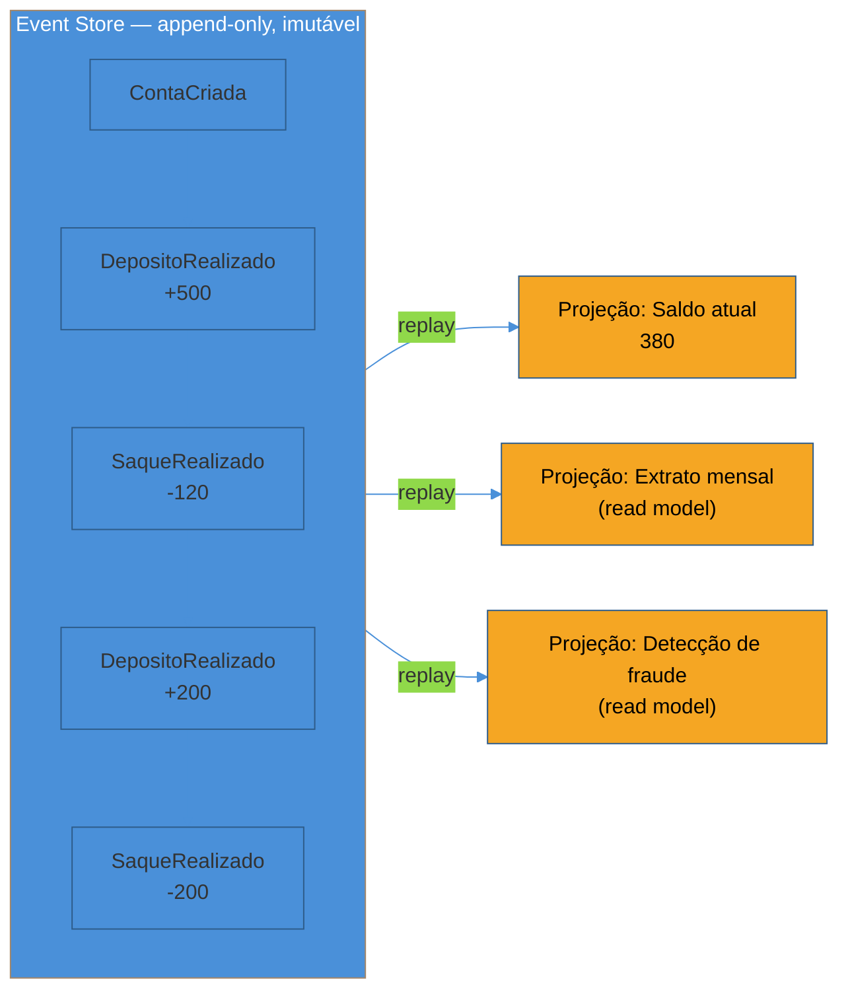
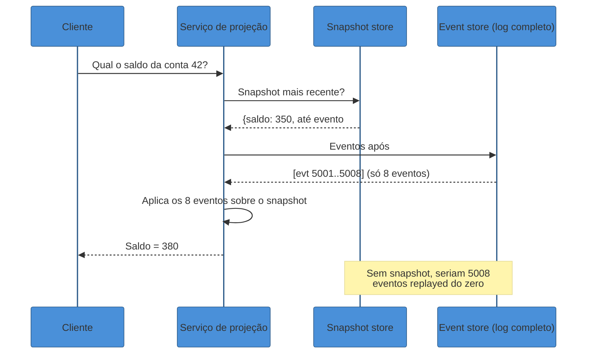
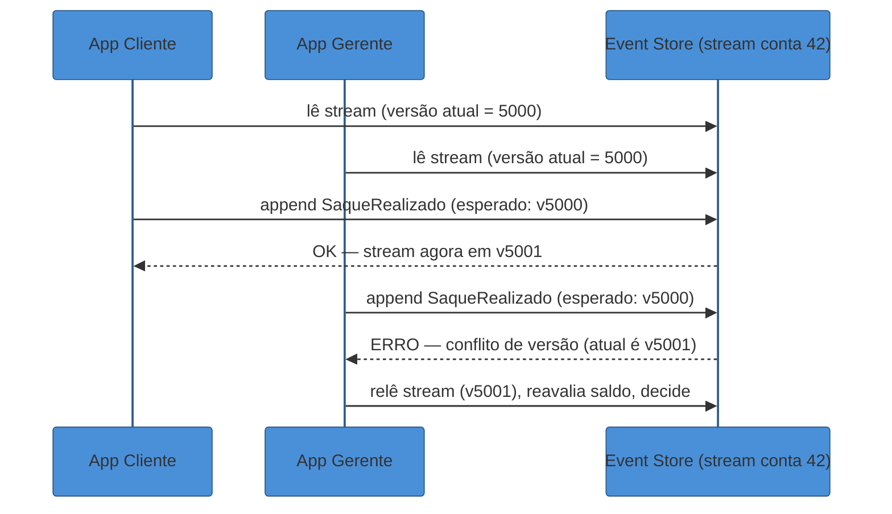
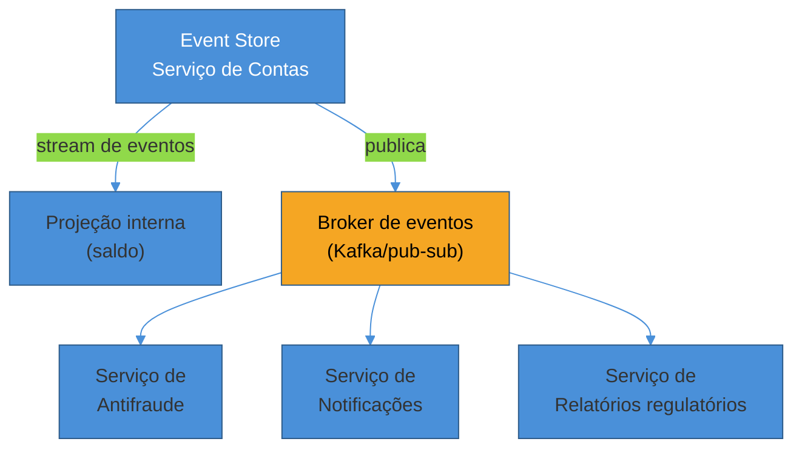

# Event Sourcing sob a ótica de system design

> [!abstract] TL;DR
> Num banco convencional, o saldo de uma conta é **uma coluna que se sobrescreve**: cada depósito ou saque apaga o valor anterior e escreve o novo. Quando o cliente contesta uma transação, não há como reconstruir *por que* o saldo é este — a história foi destruída a cada `UPDATE`. **Event Sourcing** inverte a fonte da verdade: em vez de guardar o estado atual, você guarda **cada evento que já aconteceu**, como fatos imutáveis e append-only (`DepositoRealizado`, `SaqueRealizado`). O saldo deixa de ser dado — vira **projeção**, calculada fazendo replay dos eventos. Isso resolve auditoria de graça, habilita consultas temporais ("qual era o saldo em 15/03?") e permite reconstruir/corrigir estado derivado sem tocar na verdade histórica. O custo: schema de eventos que evolui mas nunca pode ser reescrito, replay caro em escala, consistência eventual entre o log e as projeções, e uma tensão real com "direito ao esquecimento" (LGPD/GDPR). Por isso não é default — é escolha para domínios que **exigem** histórico auditável: financeiro, saúde, logística, compliance.

Um banco digital lança um recurso novo: histórico de transações com "explicação" — o cliente pode contestar qualquer lançamento e pedir para o sistema mostrar exatamente como aquele saldo foi calculado.

O time descobre um problema incômodo. A tabela `contas` tem uma coluna `saldo`. Cada depósito roda `UPDATE contas SET saldo = saldo + 100 WHERE id = 42`. Cada saque, o inverso. O valor atual está lá, correto — mas o **caminho** que levou até ele já não existe. Foi sobrescrito, `UPDATE` após `UPDATE`, centenas de vezes.

Existe uma tabela de auditoria paralela, claro — um log de "todas as operações", mantido por triggers e boa vontade. Mas ela é um efeito colateral, não a fonte da verdade. Se ela dessincronizar do saldo real (um bug num trigger, uma migração malfeita), ninguém percebe até o cliente contestar e a reconciliação não bater.

O time percebe que está resolvendo o problema errado com a ferramenta errada: eles têm um sistema que **esquece deliberadamente** o passado a cada escrita, e estão tentando reconstruir auditoria por cima disso com band-aids.

A virada de chave é inverter a pergunta. Em vez de "qual é o saldo agora, e como eu registro que ele mudou", perguntar: "o que **realmente aconteceu**, em ordem, e o saldo é só uma pergunta que eu faço sobre esses fatos?"

## O log como fonte da verdade

Essa é a ideia central de **Event Sourcing**: o estado atual de uma entidade não é armazenado diretamente. O que é armazenado — a única fonte da verdade — é a **sequência completa, imutável e ordenada de eventos** que já aconteceram com ela. O estado atual é *derivado*, computado a partir do zero ao rodar (fazer *replay* de) todos os eventos em ordem.

Para a conta 42, em vez de uma linha `{id: 42, saldo: 380}`, o event store guarda um **stream** de fatos:

```
ContaCriada        { conta: 42 }
DepositoRealizado  { conta: 42, valor: 500 }
SaqueRealizado     { conta: 42, valor: 120 }
DepositoRealizado  { conta: 42, valor: 200 }
SaqueRealizado     { conta: 42, valor: 200 }
```

O saldo, 380, não está guardado em lugar nenhum. Ele é o resultado de dobrar essa lista: `0 + 500 - 120 + 200 - 200 = 380`. Se o cliente contesta o saque de 200, a resposta não é "confie no número" — é "aqui está a sequência exata de fatos, na ordem exata, que produz este número". Auditoria deixa de ser um recurso construído por cima; ela é **inerente** ao modelo de dados.

Martin Fowler descreve o princípio de forma direta: a ideia fundamental é garantir que toda mudança de estado da aplicação seja capturada num objeto de evento, e que esses eventos sejam armazenados na sequência em que foram aplicados, pelo mesmo tempo de vida que o próprio estado da aplicação ([Fowler, *Event Sourcing*](https://martinfowler.com/eaaDev/EventSourcing.html)). Ele nota, não por acaso, que sistemas de contabilidade foram um dos primeiros lugares onde esse padrão apareceu naturalmente — porque auditoria *é* o requisito, não um extra.

> [!question]- Isso não é só "guardar um log de auditoria a mais"?
> A diferença é radical, não cosmética. Um log de auditoria tradicional é um **efeito colateral** de uma escrita — a tabela real (com o `UPDATE`) é a fonte da verdade, e o log é uma cópia, sujeita a dessincronizar. Em Event Sourcing, é o **inverso**: o log É a fonte da verdade, e a tabela com o "estado atual" (se existir) é a cópia — uma projeção derivada, descartável e reconstruível a qualquer momento. Se a projeção corromper, você a deleta e reconstrói do zero fazendo replay do log. Se o log corromper... você perdeu a história de verdade, porque não existe mais nada por trás dele. Essa inversão de qual lado é "fonte" e qual é "derivado" é o padrão inteiro.

## Eventos são fatos, não comandos — e nunca mudam

Um detalhe que separa quem entende o padrão de quem só decorou o nome: eventos são nomeados e modelados como **fatos consumados**, no passado — `DepositoRealizado`, não `RealizarDeposito`. Um comando (`RealizarDeposito`) pode falhar (saldo insuficiente, conta bloqueada). Um evento, não: ele descreve algo que **já aconteceu** e é, por definição, verdadeiro para sempre.

Essa imutabilidade é o contrato inteiro. Um evento gravado no stream nunca é editado, nunca é apagado. Se um saque foi registrado por engano, você não corrige o evento antigo — você acrescenta um **novo** evento, `SaqueEstornado`, que descreve a correção como um fato novo. O passado nunca muda; só cresce.

Fowler chama atenção para um detalhe de design que aparece aqui: eventos que carregam a **diferença** ("some $10 à conta de Martin") são mais fáceis de reverter do que eventos que carregam o **valor absoluto** ("a conta de Martin agora é $110") — no primeiro caso, reverter é só subtrair; no segundo, você já perdeu a informação de qual era o valor antes ([Fowler, *Event Sourcing*](https://martinfowler.com/eaaDev/EventSourcing.html)). É um lembrete de que "guardar eventos" não é automaticamente "guardar os eventos certos" — o design do evento importa.



Repare que o mesmo log alimenta **múltiplas** projeções, cada uma respondendo a uma pergunta diferente sobre os mesmos fatos. Isso não é coincidência de diagrama — é o motivo pelo qual Event Sourcing quase sempre aparece ao lado de [[02 - CQRS sob a ótica de system design|CQRS]]: o event store é a escrita (o lado *command*), e cada projeção é um read model materializado (o lado *query*). Se você já leu a nota de CQRS, isto é a peça que faltava: de onde vêm os eventos que alimentam as projeções lá descritas.

## Replay, snapshots e o custo de reconstruir o mundo

Fazer replay de cinco eventos para calcular um saldo é trivial. Fazer replay de **dez milhões** de eventos toda vez que alguém abre a tela da conta — porque a conta existe há oito anos e teve um evento por dia — não é.

Esse é o primeiro custo operacional real do padrão, e a resposta padrão são **snapshots**: periodicamente (a cada N eventos, ou a cada intervalo de tempo), o sistema salva um "resumo" do estado derivado até aquele ponto — `{ conta: 42, saldo: 380, até_evento: 5000 }`. Na próxima leitura, em vez de fazer replay desde o evento 1, o sistema carrega o snapshot mais recente e faz replay só dos eventos **posteriores** a ele.



O snapshot é uma **otimização de leitura**, nunca a fonte da verdade — ele é descartável e reconstruível a qualquer momento fazendo replay puro do log, desde o início. Se um snapshot corromper ou o formato dele mudar, você simplesmente o deleta e recalcula. É essa reconstruibilidade, aliás, que dá ao padrão um superpoder pouco discutido fora de auditoria: se você descobrir um **bug** na lógica que deriva projeções — um cálculo de saldo com uma regra errada aplicada por dois anos —, você corrige a lógica e faz replay de **todo o histórico** para gerar projeções corretas retroativamente. Isso é impossível num sistema que só guarda o estado atual: o dado errado já sobrescreveu o certo, para sempre.

> [!question]- Snapshot muda a resposta? Existe risco de inconsistência entre snapshot e replay puro?
> Não, desde que o snapshot seja gerado corretamente: ele é matematicamente equivalente a "replay de todos os eventos até aquele ponto", só que pré-computado. A garantia que você precisa proteger é que a lógica de projeção usada para *gerar* o snapshot seja a mesma usada para aplicar os eventos subsequentes sobre ele. Se você mudar a lógica de derivação (corrigir um bug, por exemplo) sem invalidar snapshots antigos, aí sim você tem um risco real: o snapshot carrega a lógica antiga "congelada", e só os eventos novos usam a lógica corrigida — um saldo hoje pode misturar duas versões de regra. A prática segura é versionar snapshots junto com a lógica de projeção e invalidar/regenerar quando ela muda.

## Eventual consistency: o preço de separar escrita e leitura

Como o log é escrito de forma síncrona (um evento é aceito, ponto final) mas as projeções são atualizadas de forma assíncrona (um worker lê o log e recalcula o read model), existe uma janela — geralmente de milissegundos, às vezes maior sob carga — em que o evento já está gravado, mas a projeção ainda não reflete ele.

Isso é o mesmo trade-off de [[02 - CQRS sob a ótica de system design|CQRS]], herdado diretamente: se você grava um `SaqueRealizado` e imediatamente relê o "saldo atual" pela projeção, existe uma chance real de ver o valor antigo. Sistemas bem desenhados lidam com isso de duas formas: (1) o comando devolve o novo estado calculado in-line, sem depender da projeção assíncrona ter terminado, ou (2) o cliente é informado explicitamente de que a leitura pode ter um atraso de propagação — e o produto é desenhado em torno disso (ex.: "sua transação está sendo processada").

## Operando o padrão: o que você monitora

Um sistema com Event Sourcing em produção introduz métricas que um CRUD comum não precisa observar — e não monitorá-las é como dirigir sem o painel do carro, porque os sintomas de degradação são silenciosos até virarem incidente.

- **Lag de projeção**: a distância (em eventos, ou em tempo) entre o evento mais recente gravado no log e o evento mais recente já refletido numa projeção. Um lag crescente é o primeiro sinal de que o worker de projeção não está acompanhando o volume de escrita — e, sem alerta, o sintoma só aparece quando um usuário reclama que "meu saldo está errado".
- **Tempo de replay por stream**: quanto tempo leva para reconstruir o estado de uma entidade do zero (ou a partir do último snapshot). Se essa curva cresce mais rápido que a cadência dos snapshots, o sistema está silenciosamente ficando mais lento a cada mês.
- **Taxa de conflito de concorrência otimista**: quantos `append` estão sendo rejeitados por versão desatualizada. Uma taxa alta sinaliza contenção — possivelmente porque a fronteira do agregado ficou grande demais (a discussão da seção anterior).
- **Tamanho do stream (nº de eventos por entidade)**: entidades com crescimento descontrolado de eventos (um "chat" que nunca é arquivado, por exemplo) são candidatas a estourar o orçamento de replay antes de qualquer outra coisa.

Nenhuma dessas métricas existe no vocabulário operacional de um CRUD tradicional — é outro lembrete concreto de que Event Sourcing não é "a mesma coisa com um nome chique": ele desloca trabalho operacional real do momento da escrita (que fica simples, é só um `append`) para a vida útil do sistema (que fica mais cara de observar e manter saudável).

## Consultas temporais: viajar no tempo sem inventar nada

Um efeito colateral direto de guardar o log inteiro, e não só o estado atual, é que você ganha uma capacidade que um banco convencional simplesmente não tem: responder "qual era o estado **em qualquer ponto do passado**?" sem estimativa, sem interpolação — com o mesmo rigor que responde "qual é o estado agora".

Num banco com `UPDATE`, a pergunta "qual era o saldo da conta 42 em 15 de março?" não tem resposta, a menos que exista um backup exato daquele dia. Em Event Sourcing, a resposta é mecânica: faça replay do stream **até o último evento anterior ou igual a 15 de março**, e pare. O resultado é o estado exato daquele instante — não uma aproximação.

```
replay(stream_conta_42, até_timestamp = "2026-03-15T23:59:59")
  → aplica ContaCriada, DepositoRealizado(+500), SaqueRealizado(-120)
  → para antes de DepositoRealizado(+200), que aconteceu em 20/03
  → saldo em 15/03 = 380
```

Essa capacidade — chamada de *time travel* ou *bitemporal query* em alguns event stores — é o que torna Event Sourcing atraente além da auditoria pura: ela habilita **debugging retroativo** ("o bug começou a aparecer quando o estado ficou assim — em que evento isso aconteceu?"), reconstrução de relatórios regulatórios para uma data específica, e simulação ("e se eu tivesse aplicado esta regra desde o início?" — rode o replay com a lógica nova sobre o log antigo).

> [!question]- Isso é a mesma coisa que "point-in-time recovery" de um banco relacional?
> Não — é mais fino. Point-in-time recovery de um banco (via WAL replay, por exemplo) reconstrói o **banco inteiro** num timestamp, geralmente para fins de disaster recovery, e normalmente exige restaurar um snapshot completo do sistema. A consulta temporal de Event Sourcing é uma operação de **leitura normal**, disponível a qualquer momento, para **uma entidade específica**, sem downtime nem restauração — você simplesmente pede ao serviço de projeção para parar o replay num ponto diferente. É uma feature do modelo de dados, não um procedimento de emergência.

## Concorrência: dois escritores, um stream

Um problema que aparece assim que dois usuários tentam alterar a mesma entidade ao mesmo tempo: o app do cliente e o app do gerente da agência, ambos processando um saque na conta 42 no mesmo segundo. Sem cuidado, os dois leem o stream com 5000 eventos, calculam um saldo de 380, e ambos anexam um novo evento assumindo que o próximo é o #5001 — só que só um pode vencer.

A técnica padrão é **controle de concorrência otimista no nível do stream**: cada `append` de evento é feito informando a versão esperada do stream (ex.: "anexe este evento, mas só se o último evento do stream ainda for o #5000"). Se outro escritor já anexou o #5001 entre a leitura e a escrita, o event store rejeita a operação com um conflito de versão, e o cliente precisa reler o estado atualizado e decidir se ainda faz sentido reaplicar o comando.



Essa checagem de versão é o que garante que o log continue sendo uma sequência **totalmente ordenada e sem furos** por entidade, mesmo sob concorrência — sem ela, dois eventos poderiam se basear no mesmo estado presumido e produzir um resultado inconsistente (ex.: dois saques que juntos deixam o saldo negativo, quando cada um isoladamente parecia válido).

## CRUD tradicional vs. Event Sourcing, lado a lado

Nenhuma dessas capacidades vem de graça. Vale colocar as duas abordagens lado a lado para deixar claro o que se ganha e o que se paga:

| Dimensão | CRUD tradicional (estado mutável) | Event Sourcing (log imutável) |
|----------|-----------------------------------|-------------------------------|
| Fonte da verdade | A linha atual na tabela | A sequência de eventos no stream |
| Histórico | Não existe (ou é um log secundário, best-effort) | Completo e garantido, por construção |
| Consulta temporal | Impossível sem backups pontuais | Nativa: replay até o ponto desejado |
| Correção de bug retroativo | Reescreve o dado errado; a história do erro se perde | Corrige a lógica e reprocessa o histórico real |
| Leitura do estado atual | Direta (`SELECT`) | Indireta (replay ou projeção pré-computada) |
| Consistência de leitura | Forte, imediata | Eventual entre o log e as projeções |
| Evolução de schema | `ALTER TABLE`, migração única | Eventos antigos ficam congelados; upcasting permanente |
| Exclusão de dado pessoal | `DELETE`/`UPDATE` direto | Requer desenho específico (crypto-shredding) |
| Curva de aprendizado do time | Baixa — modelo universal | Alta — streams, projeções, replay, versionamento |
| Onde compensa | A maioria dos domínios de negócio | Domínios que **exigem** auditoria/histórico completo |

A leitura certa dessa tabela não é "ES é sempre melhor porque faz mais coisas" — é "ES troca simplicidade operacional por capacidades que só um subconjunto de domínios realmente precisa". A régua de decisão é sempre o requisito, nunca a elegância técnica do padrão.

## O log também é um barramento de integração

Até aqui, tratamos o event store como algo interno a um serviço: ele guarda os eventos, deriva projeções, ponto final. Mas em sistemas maiores, o mesmo log costuma ter uma segunda função — **integração entre serviços**.

Um serviço de Antifraude, um serviço de Notificações e um serviço de Relatórios Regulatórios podem todos **assinar** o mesmo stream de eventos de contas, cada um construindo sua própria projeção independente, sem que o serviço de Contas saiba que eles existem. Isso é o ponto de contato direto com [[01 - Pub-Sub e event-driven em escala|Pub/Sub e event-driven em escala]]: o event store, além de fonte da verdade, funciona como o **tópico** que outros serviços consomem — muitas vezes literalmente publicando cada evento gravado também num broker (Kafka, por exemplo) para consumo externo.



Esse desacoplamento tem um efeito colateral valioso para **debugging distribuído**: quando um comportamento estranho aparece três serviços adiante da origem, o log de eventos imutável é o ponto de partida da investigação — ele mostra, na ordem exata, os fatos que dispararam a cadeia, sem depender de logs de aplicação dispersos e sem timestamp confiável entre serviços.

O preço dessa integração é o mesmo de qualquer sistema pub/sub: cada consumidor precisa lidar com entrega **at-least-once** (o mesmo evento pode chegar duas vezes) construindo lógica de projeção **idempotente** — reaplicar o mesmo evento duas vezes não pode duplicar o efeito. Isso não é exclusivo de Event Sourcing, mas fica mais visível aqui porque o *replay* é uma operação de primeira classe do padrão, não uma exceção: se o serviço de projeção reiniciar e refazer replay de uma janela já processada, a idempotência é o que evita corromper o read model.

## Um exemplo trabalhado: a mesma entrevista, duas conduções

**Condução fraca (nomeia o padrão, não o custo):**

> "Para o sistema de contas eu usaria Event Sourcing, porque assim eu tenho um histórico de tudo que aconteceu e posso fazer auditoria."

Tecnicamente correto, mas raso — poderia ter sido dito sem entender uma linha do mecanismo. Não há requisito nomeado, não há trade-off, não há menção ao par com CQRS nem ao custo operacional.

**Condução forte (requisito → mecanismo → custo → escopo):**

> "Você mencionou que o compliance financeiro exige que a gente prove como cada saldo foi calculado, e que às vezes precisamos recalcular relatórios de meses anteriores com uma regra corrigida. Isso é o caso de uso clássico de **Event Sourcing**: em vez de guardar o saldo como uma coluna mutável, eu guardo cada movimentação como um evento imutável — `DepositoRealizado`, `SaqueRealizado` — e derivo o saldo por replay. Isso me dá a prova de auditoria de graça e a capacidade de reprocessar o passado quando a regra muda.
>
> O custo real: eu preciso de snapshots para não fazer replay de milhões de eventos toda leitura, preciso versionar o schema dos eventos porque não posso editar os antigos, e as projeções — os read models que respondem 'qual o saldo agora' — vão ser eventualmente consistentes com o log, então isso praticamente exige rodar junto com CQRS.
>
> Eu não aplicaria isso no módulo de catálogo de produtos do mesmo sistema — lá um CRUD simples com uma tabela de auditoria resolve com muito menos complexidade. É uma escolha por agregado, não por sistema inteiro."

A segunda condução amarra o padrão ao requisito que o motivou, nomeia o mecanismo (snapshot, versionamento, projeção), admite o custo em voz alta, e demonstra que a escolha é **local** (por agregado), não uma decisão de arquitetura global — exatamente o tipo de nuance que separa quem aplicou o padrão de quem só ouviu falar dele.

## Event store não é só "um Kafka com outro nome"

Uma confusão comum: já que ambos guardam sequências ordenadas e append-only de eventos, um broker de mensageria genérico (Kafka, por exemplo) e um **event store dedicado** (Kurrent/EventStoreDB, Axon Server, EventStoreDB) parecem intercambiáveis. Na prática, resolvem problemas distintos.

Um broker como Kafka é otimizado para **throughput de streaming** — mover grandes volumes de eventos entre produtores e consumidores, com retenção configurável (que pode até ser "para sempre", mas raramente é o padrão). Ele não tem, nativamente, o conceito de "stream por entidade com controle de concorrência otimista por versão" — você pode simular isso por cima, mas não é a primitiva central.

Um event store dedicado é desenhado ao redor exatamente dessa primitiva: cada agregado (a conta 42, o pedido 917) tem seu **próprio stream**, com versão monotônica, escrita condicional por versão esperada (a técnica de concorrência vista acima) e leitura eficiente do stream inteiro de uma entidade. A KurrentDB (o produto antigo EventStoreDB, rebatizado) descreve sua proposta de valor exatamente nesse ponto: um banco desenhado nativamente para Event Sourcing, não um message bus adaptado para o papel ([Kurrent — *Guide to Event Stores*](https://www.kurrent.io/guide-to-event-stores)). A versão mais recente, KurrentDB 26.1 (maio de 2026), reforça isso com um novo motor de projeções (Projections V2) que processa partições em paralelo e acesso via SQL às projeções derivadas ([KurrentDB 26.1 release notes](https://www.kurrent.io/releases/kurrentdb/26-1/)).

Na prática, muitos sistemas de produção usam os dois juntos: o event store dedicado como fonte da verdade por agregado, e um broker como Kafka para **distribuir** esses eventos a consumidores externos — a arquitetura de integração descrita na seção anterior. São ferramentas complementares, não concorrentes.

## Quando a projeção quebra: reprocessamento como rede de segurança

Vale nomear explicitamente uma consequência prática, quase folclórica entre quem já operou Event Sourcing em produção: **projeções quebram, e tudo bem — porque elas são descartáveis por definição**.

Um bug num worker de projeção pode gerar um read model corrompido — um saldo errado, um extrato com uma linha duplicada. Num CRUD tradicional, esse tipo de corrupção costuma exigir uma correção manual, cuidadosa, dado por dado, torcendo para não piorar as coisas. Em Event Sourcing, a resposta é mecânica: **derrube a projeção e reconstrua do zero, fazendo replay do log inteiro (ou do snapshot mais próximo em diante)**. A fonte da verdade nunca foi tocada — só o cache derivado dela estava errado.

Isso muda a postura operacional do time diante de incidentes: em vez de "como eu conserto esse dado sem quebrar mais nada", a pergunta vira "quanto tempo leva para reconstruir essa projeção do zero, e dá para fazer isso sem downtime?" (normalmente sim — reconstrua a projeção nova em paralelo, "atrás" da antiga, e só troque o tráfego de leitura quando ela alcançar o log em tempo real, uma técnica às vezes chamada de *rebuild lado a lado* ou *blue-green de projeção*).

O reverso dessa moeda é que times acostumados com CRUD subestimam esse custo até a primeira vez que precisam reprocessar bilhões de eventos e descobrem que "reconstruir do zero" tem, sim, um preço em tempo e capacidade computacional — daí a métrica de tempo de replay por stream mencionada acima não ser um detalhe cosmético, mas um número que decide se um incidente dura minutos ou horas.

## A fronteira do stream é a fronteira do agregado

Uma decisão de design que aparece cedo e tem consequências grandes: **onde termina um stream e começa outro?** No exemplo da conta bancária, a resposta parece óbvia — um stream por conta. Mas em domínios mais ricos, a fronteira não é sempre trivial.

Considere um sistema de pedidos: o stream é por pedido inteiro, ou por item de pedido? Se for por pedido, um evento como `ItemAdicionado` carrega qual item; toda a garantia de ordenação e concorrência otimista vista acima se aplica ao **pedido como um todo**. Isso é, na prática, a mesma pergunta que [[Event Storming]] resolve na fase de modelagem de domínio: identificar os **agregados** — os limites de consistência transacional dentro dos quais uma regra de negócio precisa ser garantida atomicamente.

Este é o ponto exato onde este sub-galho conscientemente para e devolve a pergunta para o galho de Event Storming: **decidir onde fica a fronteira do agregado é modelagem de domínio**, não uma questão de escala. O que a ótica de system design acrescenta é a consequência *operacional* dessa fronteira — o stream ID escolhido é literalmente a unidade de concorrência otimista, de replay e de leitura eficiente. Um agregado modelado grande demais (um stream "Empresa inteira" em vez de "Conta") vira gargalo de concorrência: toda escrita concorrente na mesma empresa disputa a mesma versão de stream, mesmo que sejam operações logicamente independentes.

> [!question]- Dá pra ter um stream por "tudo" e filtrar depois?
> Tecnicamente sim — alguns sistemas usam um único stream global e taggeiam cada evento com o ID da entidade, filtrando na leitura. Mas isso joga fora a garantia de concorrência otimista por entidade (não dá mais para dizer "grave esse evento só se a versão da conta 42 ainda for a 5000", porque a versão que você está checando é a do stream inteiro, compartilhada por todas as contas) e torna replay de uma única entidade artificialmente caro (você percorre eventos de entidades irrelevantes para filtrar os que importam). Na prática, quase todo event store de produção é desenhado ao redor de **streams por entidade** — é a primitiva que faz o controle de concorrência e o replay eficiente funcionarem juntos.

## Checklist de decisão

Antes de comprometer um sistema com Event Sourcing, vale passar por um checklist curto — nenhuma pergunta sozinha decide, mas o padrão de respostas sim.

- **O domínio tem um requisito explícito de auditoria completa**, não apenas "seria legal ter logs"? (financeiro, saúde, compliance regulatório)
- **Alguém vai perguntar "por que este estado é este?"** com frequência suficiente para justificar o custo de manter a resposta sempre disponível?
- **O negócio precisa recalcular o passado** quando uma regra muda (reprocessamento retroativo), ou o estado atual sempre basta?
- **O time tem — ou pode desenvolver — a disciplina** de versionar eventos e nunca editar o passado, mesmo sob pressão de prazo?
- **Existe dado pessoal no evento**, e se sim, o desenho já contempla como cumprir um pedido de exclusão (crypto-shredding ou equivalente)?
- **A escala de replay é administrável** com snapshots, ou o volume de eventos por entidade cresce rápido demais mesmo com essa mitigação?

Se a resposta às duas primeiras perguntas é "não", o padrão provavelmente não se paga — um CRUD com uma tabela de auditoria simples resolve com uma fração da complexidade. Se é "sim" para a maioria, o custo operacional passa a ser um investimento, não um desperdício.

## O preço que ninguém mostra no diagrama de exemplo

Os diagramas de Event Sourcing são sedutores: log limpo, projeções derivadas, auditoria de graça. O que eles escondem é a lista de custos que faz esse padrão **não ser default** em nenhum sistema, mesmo entre times experientes.

> [!warning] Versionamento de eventos — o passado é imutável, mas o schema evolui
> **O que acontece:** dois anos depois de lançar `DepositoRealizado { valor }`, o produto precisa registrar a moeda também: `DepositoRealizado { valor, moeda }`. Mas existem milhões de eventos antigos gravados sem o campo `moeda` — e você **não pode editá-los**, isso quebraria o princípio central do padrão. **Por quê:** o event store trata cada evento como um fato histórico gravado em pedra. Mudar o formato de um evento já persistido apagaria a verdade do que realmente foi registrado naquele momento (e, em produção, pode nem ser tecnicamente possível dependendo do event store). **Como evitar:** toda lógica de projeção precisa saber ler **múltiplas versões** do mesmo tipo de evento — upcasting (transformar o formato antigo no novo em memória, na leitura) é a técnica padrão. Isso significa que o código de projeção nunca fica "limpo" para sempre: ele carrega compatibilidade com cada versão de schema que já existiu.

> [!warning] Replay em escala é caro — e cresce sem limite
> **O que acontece:** um stream com anos de histórico e milhões de eventos leva segundos (ou minutos) para ser replayed do zero, mesmo com paralelização. **Por quê:** o custo de derivar estado cresce linearmente (ou pior) com o número de eventos, e o número de eventos só aumenta — o log nunca encolhe. **Como evitar:** snapshots mitigam, mas não eliminam — você ainda paga o custo de gerar e armazenar os snapshots, e de decidir a cadência certa. Em domínios de altíssimo volume, times combinam Event Sourcing só nos agregados que realmente precisam de auditoria completa, e usam CRUD tradicional no resto — não é tudo ou nada.

> [!warning] "Não dá pra deletar" colide com LGPD/GDPR
> **O que acontece:** um usuário exerce o direito ao esquecimento e pede a remoção de seus dados pessoais — mas esses dados estão espalhados em milhares de eventos imutáveis no log, cuja imutabilidade é a razão de existir do padrão. **Por quê:** o valor central de Event Sourcing (nunca apagar, nunca reescrever o passado) é diretamente tensionado pelo direito de apagamento de dados pessoais previsto em LGPD (art. 18, Lei 13.709/2018) e GDPR (art. 17). **Como evitar:** a técnica comum é **criptografia por sujeito de dados** (crypto-shredding): dados pessoais dentro do evento são criptografados com uma chave específica por usuário; "esquecer" o usuário significa destruir a chave, tornando o conteúdo permanentemente ilegível — sem violar a imutabilidade do log em si (o evento continua lá, mas seu conteúdo pessoal vira ruído). É uma solução de compromisso, não uma isenção mágica, e precisa ser desenhada desde o início do modelo de eventos.

> [!warning] Ordenação global entre streams não é garantida por padrão
> **O que acontece:** o time assume que, se o evento da conta 42 foi gravado antes do evento da conta 43 (por relógio de parede), qualquer consumidor vai vê-los nessa mesma ordem — e um relatório que cruza várias contas sai com a ordem "errada" às vezes. **Por quê:** a garantia forte de ordenação de um event store é **por stream** (por entidade), não global. Entre streams diferentes, a ordem de gravação física pode não corresponder à ordem de leitura por consumidores distribuídos, especialmente sob paralelização (lembre do Projections V2 da KurrentDB processando partições em paralelo justamente para ganhar performance). **Como evitar:** para relatórios ou lógica que dependem de ordem **entre** entidades, use timestamps explícitos no próprio evento (não a ordem de chegada) e trate a comparação como aproximada, ou desenhe um processo específico de agregação que tolere essa reordenação — nunca assuma que "gravei primeiro" implica "todo mundo vê primeiro" fora do escopo de uma única entidade.

> [!warning] Curva de aprendizado e sobre-engenharia
> **O que acontece:** um time adota Event Sourcing para um CRUD simples de catálogo de produtos "porque é o padrão mais moderno" — e agora todo desenvolvedor novo precisa entender streams, projeções, upcasting e eventual consistency para editar o nome de um produto. **Por quê:** o padrão adiciona uma camada real de indireção conceitual (estado deixa de ser "o que está no banco" e passa a ser "o que se deriva do log") que só se paga quando o requisito de auditoria/histórico justifica o custo. **Como evitar:** a pergunta de qualificação é sempre "este domínio *exige* reconstruir o passado, ou eu só acho elegante guardar tudo?". Se a resposta é a segunda, um CRUD com uma tabela de auditoria simples resolve com uma fração do custo operacional.

## Em entrevista

Event Sourcing é um padrão que **brilha** quando surge um domínio com requisito explícito de auditoria, compliance ou histórico — e é um dos sinais de senioridade mais claros trazer ele à tona *voluntariamente* nesse contexto, em vez de esperar ser perguntado.

Cenários onde a resposta correta costuma incluir Event Sourcing:

- **Sistemas financeiros** (contas, pagamentos, ledgers): auditoria não é opcional, é requisito regulatório. "Como você prova que este saldo está correto?" é uma pergunta que Event Sourcing responde estruturalmente.
- **Saúde** (prontuário eletrônico): cada alteração no histórico do paciente precisa ser rastreável — quem mudou o quê, quando, e o estado anterior não pode desaparecer.
- **Logística/supply chain**: rastrear o estado de um pacote/pedido ao longo de uma jornada longa, com a necessidade de reconstruir "onde ele estava em cada etapa".
- **Sistemas com correção retroativa frequente**: se o negócio precisa recalcular o passado com uma regra nova (ex.: reprocessar comissões de vendas com uma fórmula corrigida), Event Sourcing já tem o mecanismo — replay com a lógica nova.

O sinal fraco é propor Event Sourcing para *qualquer* sistema com "muitos dados" ou "precisa de log" — isso mostra que você decorou o nome do padrão sem entender o custo. O sinal forte é reconhecer o requisito ("preciso de auditoria completa e replay temporal") *e* nomear o preço em voz alta: "isso significa versionamento de eventos, replay caro em escala e eventual consistency nas projeções — vale a pena aqui porque é um ledger financeiro, mas eu não faria isso no catálogo de produtos do mesmo sistema."

Vale também mencionar, se o entrevistador aprofundar, que Event Sourcing **quase sempre** vem acompanhado de CQRS — o log é o lado de escrita, as projeções são o lado de leitura — e que a combinação dos dois é o que aparece na literatura como o par padrão para sistemas com esse perfil de requisito.

| Sinal | Green flag | Red flag |
|-------|------------|----------|
| Motivação | Amarra o padrão a um requisito explícito (auditoria, compliance, replay) | Propõe "porque é moderno" ou "porque guarda tudo" |
| Escopo | Aplica por agregado (só nas entidades que exigem histórico) | Aplica ao sistema inteiro por padrão |
| Custo | Nomeia versionamento, replay caro e eventual consistency sem ser perguntado | Só menciona os benefícios; nunca o preço |
| Par com CQRS | Reconhece que as projeções são o lado de leitura natural | Trata Event Sourcing como algo isolado de CQRS |
| LGPD/GDPR | Levanta a tensão com direito ao esquecimento se o domínio tem dado pessoal | Ignora completamente compliance de dados |

Perceba que, de novo, **nenhuma linha do "green flag" é sobre conhecer o nome do padrão** — é sobre aplicá-lo com julgamento sob um requisito real, exatamente o eixo que toda a rubrica de system design está medindo (veja [[1 - Framework de entrevista/01 - O que é System Design e o que a entrevista avalia|a nota-mãe sobre os quatro eixos avaliados]]).

## Como explicar em inglês

> "For this domain, I'd reach for **event sourcing**: instead of storing current state as a mutable row, I store every state change as an immutable, append-only event — `DepositMade`, `WithdrawalMade`. Current state becomes a **projection**, derived by replaying the event log, which gets me full audit history and temporal queries essentially for free. I'd pair it with **snapshots** so I'm not replaying millions of events on every read, and I'd expect it to run alongside CQRS, since the projections are naturally the read side. The trade-off is real, though: event schemas need versioning since past events are immutable, replay at scale isn't free, and reads from projections are eventually consistent with the log. I'd only reach for this where the domain genuinely requires an audit trail — a ledger, a patient record — not as a default."

| PT | EN |
|----|----|
| Fonte da verdade | Source of truth |
| Log de eventos / event store | Event log / event store |
| Evento imutável | Immutable event |
| Append-only | Append-only |
| Projeção / read model | Projection / read model |
| Replay (reprocessar eventos) | Replay |
| Snapshot | Snapshot |
| Versionamento de evento / upcasting | Event versioning / upcasting |
| Consistência eventual | Eventual consistency |
| Direito ao esquecimento | Right to erasure / right to be forgotten |
| Crypto-shredding | Crypto-shredding |
| Trilha de auditoria | Audit trail |

## O que vem a seguir

Event Sourcing fecha o par com CQRS: um guarda os fatos, o outro organiza como eles viram leitura rápida. Os próximos dois padrões do sub-galho saem desse território de dados e vão para **proteção do sistema sob carga** — como impedir que um cliente (ou um bug) derrube o serviço abusando dele, e como impedir que uma falha em um componente vire uma falha em cascata pelo sistema inteiro.

- [[04 - Rate Limiting]] — como limitar a taxa de requisições por cliente sem virar gargalo você mesmo
- [[05 - Circuit Breaker e resiliência]] — como parar de bater numa dependência que já está falhando, antes que a falha se espalhe

## Veja também

- [[System Design/index|System Design]] — o galho-pai e o mapa da trilha
- [[3 - Padrões recorrentes/index|Padrões recorrentes]] — os demais padrões deste sub-galho
- [[Event Storming]] — onde o detalhe de modelagem de domínio (agregados, bounded contexts) por trás dos eventos mora de fato
- [[01 - Pub-Sub e event-driven em escala]] — o mecanismo de entrega que muitas vezes carrega esses eventos entre serviços
- [[02 - CQRS sob a ótica de system design]] — o par natural: escrita no log, leitura pelas projeções

## Fontes

- **Martin Fowler** — [*Event Sourcing*](https://martinfowler.com/eaaDev/EventSourcing.html) — a definição canônica do padrão, o exemplo de contabilidade, e a discussão sobre eventos como diferenças vs. valores absolutos.
- **Greg Young** — [*CQRS and Event Sourcing*](https://www.youtube.com/watch?v=JHGkaShoyNs) (talk canônico) e a documentação histórica do padrão em [cqrs.nu](http://cqrs.nu/) — origem prática do par CQRS+ES em sistemas de produção.
- **Kurrent (ex-EventStoreDB)** — [Docs — Guide to Event Stores](https://www.kurrent.io/guide-to-event-stores) e [KurrentDB 26.1 release notes](https://www.kurrent.io/releases/kurrentdb/26-1/) (maio de 2026) — mecânica de projeções (Projections V2) e persistent subscriptions num event store de produção.
- **Martin Kleppmann** — *Designing Data-Intensive Applications* (cap. 11, "Stream Processing") — event sourcing e log-centric architectures no contexto mais amplo de sistemas distribuídos.
- **Microsoft — Azure Architecture Center** — [*Event Sourcing pattern*](https://learn.microsoft.com/en-us/azure/architecture/patterns/event-sourcing) — checklist de quando usar e armadilhas de produção (inclui versionamento e concorrência).
- **Lei 13.709/2018 (LGPD)**, art. 18 e **GDPR** art. 17 — base legal do direito ao esquecimento citado na tensão com imutabilidade.
