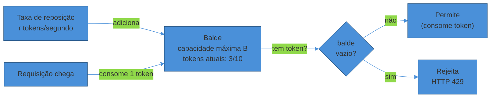
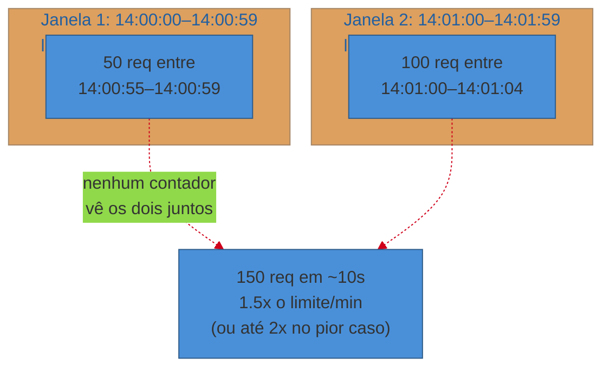
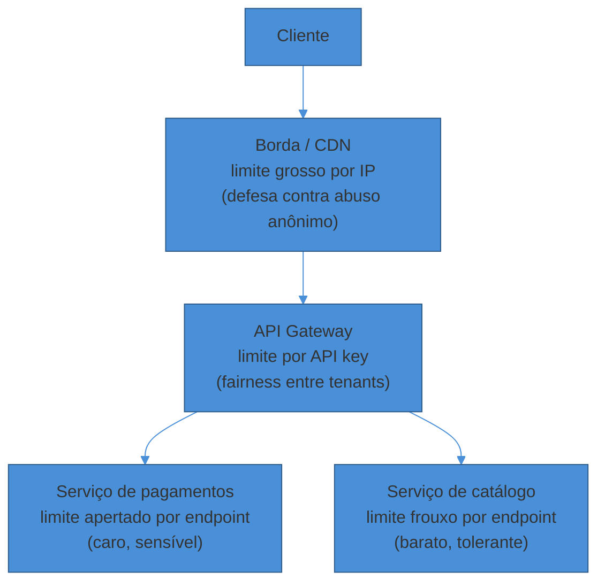
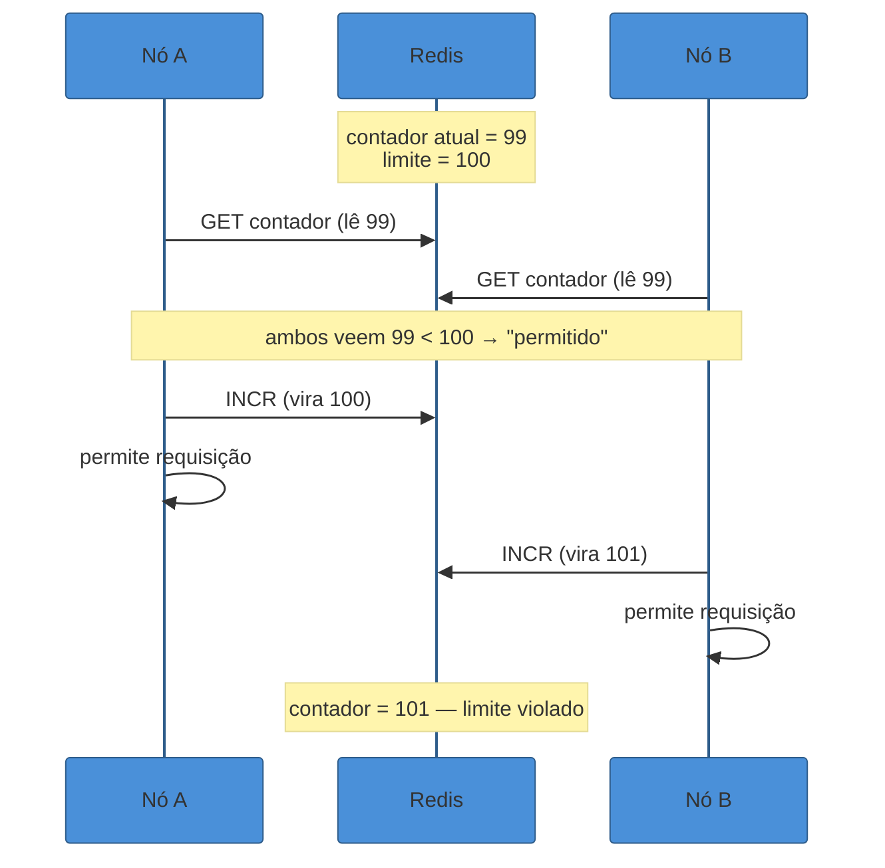

# Rate Limiting

> [!abstract] TL;DR
> **Rate limiting** é a válvula que impede que um único cliente — mal-comportado ou malicioso — derrube o backend para todo mundo. A entrevista testa se você sabe escolher entre cinco algoritmos com trade-offs distintos de memória, precisão e tolerância a burst: **token bucket** (permite rajada controlada), **leaky bucket** (taxa de saída constante), **fixed window counter** (simples, mas estoura até 2x no limite na borda da janela), **sliding window log** (preciso, caro em memória) e **sliding window counter** (aproximação barata que domina em produção — é o que Cloudflare e Figma usam). Em sistemas distribuídos, o desafio real não é o algoritmo — é **contar de forma consistente entre N nós**, resolvido com um contador central em Redis cuja operação read-modify-write precisa ser **atômica via Lua**, sob pena de dois nós lerem o mesmo valor e ambos liberarem a requisição que deveria ter sido bloqueada. Quando o limite estoura, a resposta correta é **HTTP 429** com o header **Retry-After** — e do lado do cliente, um bom SDK reage com backoff exponencial, não com retry imediato.

Uma API pública fica de pé, servindo milhares de clientes, quando um deles — um script mal escrito, ou um ataque deliberado — passa a disparar 50 mil requisições por segundo. Não é uma falha de infraestrutura: o banco está saudável, os servidores têm CPU sobrando. O problema é que **um cliente sozinho está consumindo a capacidade que deveria ser compartilhada entre todos**.

Sem alguma forma de conter esse cliente, os outros 4.999 usuários bem-comportados sentem a degradação: filas de conexão enchem, threads ficam presas esperando I/O, latência sobe para todo mundo. Um comportamento isolado vira uma indisponibilidade global.

É esse cenário — não uma definição de dicionário — que justifica a existência do rate limiter: um componente cujo único trabalho é dizer "não" a requisições em excesso, *antes* que elas cheguem perto de fazer dano ao resto do sistema.

## Por que existe: três motivações, não uma

Rate limiting frequentemente é tratado como sinônimo de "segurança contra DDoS", mas essa é só uma das três razões pelas quais ele existe — e numa entrevista, nomear as três mostra que você entende o espectro do problema, não decorou uma resposta.

**Proteger o backend.** Todo sistema tem uma capacidade finita — conexões de banco, threads de worker, memória. Rate limiting garante que a carga fique dentro dessa capacidade, independentemente de quem está gerando o tráfego.

**Fairness entre clientes.** Numa API multi-tenant, um cliente não pode consumir a capacidade que pertence a outro. É o mesmo princípio de *noisy neighbor* em sistemas compartilhados — um tenant não pode monopolizar o recurso.

**Controle de custo e mitigação de abuso.** Chamadas a um LLM, a um provedor de pagamento ou a qualquer API paga por requisição custam dinheiro real. Rate limiting também é uma trava de orçamento. E contra abuso deliberado — scraping agressivo, brute-force de senha, DDoS na camada de aplicação (L7) — é a primeira linha de defesa, porque atua *antes* que a requisição maliciosa chegue à lógica de negócio.

> [!question]- Rate limiting não é a mesma coisa que um firewall ou um WAF?
> São camadas complementares, não a mesma coisa. Um firewall de rede filtra por IP/porta na camada 3-4 — não sabe nada sobre "quantas vezes esse usuário chamou `POST /login` no último minuto". Um WAF inspeciona payloads de aplicação buscando padrões maliciosos (SQL injection, XSS). Rate limiting opera num eixo ortogonal: **volume por identidade, no tempo**. Os três costumam coexistir: WAF e firewall filtram o *tipo* de tráfego malicioso; rate limiting contém o *volume*, mesmo de tráfego legítimo em excesso.

## Os cinco algoritmos: a família canônica

A referência que qualquer entrevistador espera — codificada por Alex Xu em *System Design Interview Vol. 1* — trata cinco algoritmos como a família canônica. Eles diferem em três eixos: **memória** (quanto estado por cliente), **precisão** (quão perto do limite exato eles ficam) e **tolerância a burst** (permitem rajada ou forçam taxa constante).

### Token bucket: o padrão de fato

Cada cliente tem um "balde" com capacidade máxima de `B` tokens. O balde começa cheio (ou com algum valor inicial). Tokens são adicionados a uma taxa constante `r` por segundo, até o limite `B`. Cada requisição consome 1 token; se o balde está vazio, a requisição é rejeitada (ou enfileirada, dependendo do design).



A propriedade que torna o token bucket dominante em produção — é o que a Stripe usa para toda a API pública — é que ele **permite burst controlado**. Um cliente que ficou inativo por um minuto acumula tokens até o teto `B`, e pode gastar todos de uma vez numa rajada legítima (ex: sincronizar um lote de dados). Depois disso, ele só consegue sustentar a taxa média `r`.

Isso captura um padrão de uso real: tráfego de API não chega uniformemente distribuído — chega em rajadas seguidas de silêncio. Um algoritmo que só permitisse taxa constante penalizaria esse padrão saudável.

O custo de estado é mínimo: por cliente, você guarda só `(tokens_atuais, timestamp_da_última_reposição)` — dois números. A reposição é calculada sob demanda (`tokens_atuais = min(B, tokens_atuais + r * (agora - timestamp))`), sem precisar de um processo de background rodando um "tick" a cada segundo.

### Leaky bucket: taxa de saída constante

Onde o token bucket controla a *entrada*, o leaky bucket controla a *saída*. Requisições entram numa fila (o "balde"); um processo as retira e processa numa taxa fixa `r`, como um vazamento constante. Se a fila está cheia quando uma nova requisição chega, ela é descartada.

A diferença prática: leaky bucket **suaviza** o tráfego — a saída é sempre uniforme, mesmo que a entrada seja em rajada. É a escolha certa quando o sistema downstream (ex: uma fila de processamento, um serviço legado frágil) não tolera picos, só uma taxa constante. O custo é uma fila com estado (memória proporcional ao tamanho da fila) e latência adicional para requisições que esperam na fila.

> [!question]- Token bucket e leaky bucket não são só a mesma coisa ao contrário?
> Conceitualmente são primos próximos, mas o comportamento observável é diferente. Token bucket permite que uma rajada de N requisições saia **imediatamente**, desde que haja tokens acumulados — o cliente vê baixa latência mesmo em burst. Leaky bucket força que a saída seja sempre espaçada pela taxa `r`, então uma rajada de entrada vira uma fila que "escorre" devagar — o cliente vê latência crescente durante o burst. Escolha token bucket quando o objetivo é **decidir admitir ou rejeitar rápido**; escolha leaky bucket quando o objetivo é **proteger um consumidor downstream sensível a picos**, aceitando enfileirar.

### Fixed window counter: simples, mas com o problema da borda

Divida o tempo em janelas fixas (ex: minuto 14:00:00–14:00:59) e mantenha um contador por janela. Cada requisição incrementa o contador; se ultrapassar o limite, é rejeitada. No início de cada nova janela, o contador zera.

É trivialmente simples de implementar — um `INCR` com `EXPIRE` no Redis resolve — mas tem um defeito estrutural conhecido como **o problema da borda** (*boundary problem*): um cliente pode disparar o limite inteiro nos últimos instantes de uma janela e o limite inteiro de novo nos primeiros instantes da próxima, efetivamente enviando **até 2x o limite nominal** num intervalo curto de tempo.



Se `100 req/min` é o limite, um cliente que envia 100 requisições nos últimos 5 segundos da janela 1 e mais 100 nos primeiros 5 segundos da janela 2 manda **200 requisições em 10 segundos** sem que nenhum contador individual jamais tenha excedido o limite. Para um sistema que dimensionou sua capacidade em cima da premissa "nunca mais que 100/min por cliente", isso é um estouro real, não teórico.

### Sliding window log: preciso, caro em memória

A correção mais direta para o problema da borda é guardar o **timestamp de cada requisição** num log ordenado por cliente. Ao chegar uma nova requisição, descarte do log tudo que é mais antigo que `agora - janela`, conte o que sobrou, e decida.

É exato — não existe aproximação, o limite é respeitado em qualquer janela deslizante de tamanho fixo, não só nas janelas alinhadas ao relógio. O custo é memória: o Figma Engineering ilustrou isso com um número concreto — um limite de 500 req/dia por usuário, com 10 mil usuários ativos por dia, significaria armazenar até 5 milhões de timestamps no Redis; mesmo compactados em inteiros de 4 bytes, isso é ~20 MB só para esse um rate limit. Em produção com dezenas de limites diferentes, o custo escala rápido.

### Sliding window counter: a aproximação que vence em produção

O meio-termo que domina implementações reais combina o baixo custo do fixed window com uma correção que elimina a maior parte do erro da borda. A ideia: mantenha o contador da janela atual **e** o contador da janela anterior, e estime o total via uma média ponderada pelo tempo decorrido na janela atual.

A fórmula típica: `estimativa = contador_janela_atual + contador_janela_anterior * (1 - fração_decorrida_da_janela_atual)`. Se você está 30% dentro da janela atual, pesa 70% do contador anterior — assumindo que o tráfego da janela anterior estava distribuído uniformemente (uma aproximação razoável na prática).

A Cloudflare, operando rate limiting em mais de 330 data centers, relatou que essa abordagem produz **99,997% de acurácia** sobre tráfego real (0,003% de decisões erradas em 400 milhões de requisições de 270 mil origens) — com o custo de memória de dois inteiros por cliente, igual ao fixed window. É essencialmente o mesmo resultado que o Figma Engineering chegou de forma independente com contadores em sub-janelas de 1/60 do tamanho: precisão "boa o suficiente" ao custo de `O(1)` em memória, sem o log completo.

| Algoritmo | Memória | Precisão | Burst | Onde brilha |
|---|---|---|---|---|
| Token bucket | `O(1)` por cliente | Exata dentro do modelo | Permite, controlado por `B` | Padrão geral (Stripe) |
| Leaky bucket | `O(fila)` | Exata (taxa de saída) | Não — suaviza | Proteger consumidor downstream frágil |
| Fixed window | `O(1)` por cliente | Ruim (até 2x na borda) | Sim, não intencional | Protótipos, limites grosseiros |
| Sliding window log | `O(N)` requisições | Exata | Controlado | Limites críticos, poucos clientes |
| Sliding window counter | `O(1)` por cliente | ~99,99%+ aproximada | Controlado | Produção em escala (Cloudflare, Figma) |

> [!warning] Escolher fixed window "porque é mais simples de implementar"
> **O que acontece:** o candidato propõe fixed window counter sem mencionar o problema da borda, ou o time implementa em produção e só descobre o estouro quando um cliente já causou incidente.
> **Por quê:** fixed window *parece* correto em qualquer teste isolado — o contador nunca excede o limite *dentro de uma janela*. O bug só aparece quando você olha o intervalo que atravessa duas janelas.
> **Como evitar:** se o limite existe para proteger capacidade real (não é só um sinal informativo), use sliding window counter ou token bucket. Reserve fixed window para casos onde um estouro ocasional de até 2x é tolerável — ex: um limite "soft" de fair use, não uma trava de segurança.

## Um exemplo trabalhado: token bucket com números

Para tornar o algoritmo concreto, veja o token bucket com números reais, do tipo que você defenderia numa entrevista.

Suponha uma API que quer garantir a um cliente autenticado uma taxa sustentável de **10 requisições/segundo**, mas tolerar rajadas de até **50 requisições** de uma vez (ex: um cliente que sincroniza um lote após ficar offline).

Isso mapeia direto nos dois parâmetros do algoritmo: `r = 10` tokens/s (taxa de reposição) e `B = 50` (capacidade do balde). O estado por cliente, guardado no Redis como um hash, é `{tokens: 50, last_refill: <timestamp>}` — começa cheio.

Trace o comportamento: o cliente fica quieto por 10 segundos (acumularia 100 tokens de reposição, mas o balde satura em 50 — ele não "guarda dívida" além do teto). Então dispara uma rajada de 45 requisições em 200ms: o balde tinha 50, cada requisição consome 1, sobra 5 — todas as 45 são aceitas, sem nenhuma rejeitada, porque o burst cabe dentro de `B`. Se a rajada fosse de 60, as primeiras 50 passam e as 10 excedentes tomam 429.

Depois da rajada, o cliente volta a ganhar tokens a 10/s. Se ele tentar mandar 10 req/s constante, o balde nunca esvazia de fato (repõe na mesma taxa que consome) — é exatamente a taxa sustentável desejada. Se tentar 15 req/s, o balde drena a 5/s e, em 10 segundos, começa a rejeitar.

O cálculo de reposição sob demanda evita precisar de um processo de background "tickando" a cada cliente:

```
tokens_atuais = min(B, tokens_salvos + r * (agora - last_refill))
se tokens_atuais >= 1:
    tokens_atuais -= 1
    salvar(tokens_atuais, agora)
    permitir
senão:
    rejeitar com 429
```

Esse cálculo — ler, decidir, escrever — é exatamente a sequência que precisa ser atômica quando múltiplos nós competem pelo mesmo cliente, discutido adiante.

## Onde aplicar: granularidade e camada

Duas decisões ortogonais precisam ser tomadas antes de escolher o algoritmo: **por quem** você limita, e **em que camada**.

**Chave de identidade.** Limitar por IP é a opção mais simples, mas quebra atrás de NAT (um escritório inteiro compartilha um IP) e é trivialmente contornável com IPs rotativos. Limitar por API key ou por `user_id` autenticado é mais justo e mais difícil de burlar — é o padrão para APIs autenticadas. Um design maduro combina camadas: um limite grosseiro por IP como rede de proteção contra abuso anônimo, e um limite fino por API key para fairness entre clientes autenticados.

**Camada de aplicação.** Aplicar o limite na borda (edge/gateway/CDN) barra tráfego malicioso o mais cedo possível, antes de consumir qualquer recurso do backend — é onde Cloudflare e um [[06 - API Gateway e BFF|API Gateway]] atuam. Aplicar no próprio serviço dá granularidade fina por endpoint (o limite de `POST /pagamentos` não precisa ser igual ao de `GET /produtos`) mas cada requisição já consumiu recursos de rede e roteamento antes de ser rejeitada. Sistemas maduros fazem os dois: um limite grosso na borda, limites finos por endpoint dentro do serviço.



**Limites em camadas por plano.** Numa API com tiers de assinatura (free/pro/enterprise), o rate limit costuma ser um parâmetro do plano, não uma constante global — o cliente `free` recebe `B=10`, o `enterprise` recebe `B=10000`. Isso empurra a chave de identidade para além do simples `user_id`: o rate limiter precisa consultar (ou ter em cache) qual plano aquele cliente contratou, o que é outro motivo para não implementar isso "à mão" em cada serviço — centralizar no gateway evita duplicar essa lógica de plano em N microserviços.

**Hard limit vs soft limit.** Nem todo rate limit precisa rejeitar com 429. Um **soft limit** pode disparar um alerta interno ou degradar a qualidade da resposta (ex: parar de retornar campos caros de calcular) sem bloquear o cliente — útil para fair use policies onde a intenção é sinalizar, não punir. Um **hard limit** sempre rejeita. Declarar qual dos dois você está desenhando, numa entrevista, evita a armadilha de tratar todo rate limit como binário permitir/bloquear.

## O problema distribuído: contar entre N nós

Um único processo com um dicionário em memória resolve rate limiting trivialmente. O problema de verdade aparece quando você tem **N réplicas do serviço atrás de um load balancer** — porque cada réplica, contando só o que ela mesma viu, deixa um cliente enviar `N vezes` o limite nominal (uma fração para cada nó).

A solução padrão é um **store central compartilhado** — normalmente Redis — onde todas as réplicas leem e escrevem o mesmo contador por cliente. O comando natural é `INCR chave` seguido de `EXPIRE chave janela` na primeira vez que a chave é criada.

O problema é que "verificar se está sob o limite" e "incrementar o contador" são, ingenuamente, duas operações — e entre elas existe uma **corrida** (race condition). Dois nós podem ler o contador simultaneamente, ambos ver "abaixo do limite", ambos incrementar, e o limite acaba sendo violado mesmo que cada leitura individual estivesse correta no instante em que foi feita.



A correção é fazer o **read-modify-write inteiro como uma única operação atômica**. Redis resolve isso nativamente com **scripts Lua** executados via `EVAL`/`EVALSHA`: o script inteiro roda de forma atômica dentro do Redis, porque o Redis processa comandos (e scripts) em single-thread — nenhuma outra operação intercala no meio da execução do script. Um script Lua típico faz `GET` (ou lê o estado do token bucket), decide, `INCR`/atualiza, e `EXPIRE`, tudo numa chamada só, eliminando a janela de corrida inteira.

Esse é exatamente o mecanismo que Kong usa na sua policy `redis` para rate limiting entre nós de um data plane distribuído, e é o padrão citado por implementações de referência de rate limiter distribuído com Redis+Lua.

> [!warning] Bater no Redis a cada requisição sem medir o custo de latência
> **O que acontece:** toda requisição da API precisa esperar uma ida e volta ao Redis antes de prosseguir, adicionando latência de rede síncrona ao caminho crítico.
> **Por quê:** um design ingênuo trata o rate limiter como um gate bloqueante em série com o resto do processamento, sem considerar que Redis é uma dependência de rede adicional — se ele degradar, toda a API degrada junto.
> **Como evitar:** três mitigações comuns, combináveis: (1) manter um contador **local aproximado** em cada nó e sincronizar com Redis periodicamente em lote (é o que a policy `batch-redis` do Kong faz, reduzindo chamadas por um fator de tamanho de lote); (2) usar pipelining/scripts Lua para manter a operação em uma única viagem de rede; (3) decidir explicitamente o comportamento em caso de falha do Redis — **fail-open** (deixa passar, prioriza disponibilidade) vs **fail-closed** (bloqueia, prioriza proteção) é uma escolha de trade-off que você deve declarar em voz alta na entrevista.

Duas complicações adicionais valem menção rápida em entrevista, mesmo sem entrar no detalhe de implementação:

**Hot keys.** Se um único cliente (ou, pior, um ataque distribuído mirando um único endpoint público) concentra volume insano de tráfego, a chave desse cliente no Redis vira um *hot key* — todas as réplicas batem na mesma partição/nó do cluster Redis, criando um gargalo localizado mesmo que o cluster inteiro tenha capacidade sobrando. Mitigações incluem contadores locais aproximados por nó (aceitando alguma imprecisão) e, em casos extremos, um circuit breaker específico para a própria chamada ao rate limiter.

**Multi-região.** Um contador central único funciona bem numa região; entre regiões geograficamente distantes, replicar o contador em tempo real introduz a mesma latência que você está tentando evitar. A solução prática mais comum é **particionar o limite por região** (cada região recebe uma fração do limite total do cliente, ex: 1/3 do limite global se há 3 regiões) e aceitar que a soma real pode, no pior caso, exceder levemente o nominal — um trade-off deliberado de disponibilidade sobre precisão exata, na linha do que o CAP (ver [[06 - CAP, consistência e consenso]]) preveria.

O walkthrough [[4 - Walkthroughs/04 - Distributed Rate Limiter|Distributed Rate Limiter]] (SG4-04) aprofunda esse sistema completo — incluindo consistência entre regiões, o design do script Lua em detalhe e como lidar com hot keys quando um único cliente concentra tráfego insano. Aqui o ponto é só reconhecer *que* o problema existe e *qual* mecanismo o resolve.

## A resposta ao cliente: 429 e os headers

Quando uma requisição é rejeitada por rate limiting, o código de status correto é **HTTP 429 Too Many Requests**, formalizado pela [RFC 6585](https://datatracker.ietf.org/doc/html/rfc6585) em 2012. O corpo da resposta deve, idealmente, explicar a condição, e a resposta pode incluir um header **`Retry-After`**, indicando em segundos (ou uma data HTTP) quando o cliente deve tentar de novo.

Além do `Retry-After`, é comum — embora não padronizado historicamente — expor headers `X-RateLimit-Limit`, `X-RateLimit-Remaining` e `X-RateLimit-Reset`, permitindo que o cliente monitore proativamente sua cota sem precisar tomar um 429 primeiro. A fragmentação desses headers de fato (cada provedor usava um prefixo diferente) motivou um esforço de padronização: o IETF está finalizando o draft **`draft-ietf-httpapi-ratelimit-headers`** (na versão 11 em 2026), que define os campos `RateLimit` e `RateLimit-Policy` de forma unificada — utilizáveis tanto em respostas de sucesso (sinalizando cota restante) quanto em respostas 429.

Do lado do cliente, a prática recomendada — inclusive pela própria documentação da Stripe — é reagir a um 429 com **backoff exponencial com jitter**: esperar um intervalo que cresce a cada tentativa (evitando martelar o servidor de novo imediatamente) com uma variação aleatória (evitando que múltiplos clientes sincronizem suas retentativas e criem uma nova rajada coordenada). Esse mecanismo de retry com backoff é aprofundado sob a ótica de resiliência na próxima nota deste sub-galho.

> [!question]- Por que não simplesmente fechar a conexão ou dar timeout, sem responder nada?
> Porque isso é indistinguível, do ponto de vista do cliente, de uma falha real do servidor — e um cliente bem-comportado reagiria com retry agressivo, exatamente o oposto do que você quer. Um 429 explícito com `Retry-After` é uma *comunicação*: diz ao cliente "seu request foi entendido, mas rejeitado por política, e aqui está quando tentar de novo". Isso permite que SDKs bem escritos se auto-regulem sem que o operador humano precise intervir. Silêncio ou uma conexão resetada tira essa possibilidade de coordenação.

## Observabilidade: como saber que o limite está calibrado

Um rate limiter mal calibrado falha de duas formas opostas, e ambas são silenciosas até virarem incidente: **limite frouxo demais** não protege nada (o backend cai do mesmo jeito, só que "com rate limiting instalado"), e **limite apertado demais** rejeita tráfego legítimo, tratando clientes saudáveis como abusivos.

A forma de descobrir qual dos dois está acontecendo — sem esperar o incidente — é instrumentar o próprio rate limiter como qualquer outro componente crítico: emitir métricas de **taxa de 429 por endpoint e por cliente**, e observar a **distribuição de "proximidade do limite"** entre clientes bem-comportados (quantos estão rotineiramente a 90%+ da cota, mesmo sem estourar — sinal de que o limite está apertado demais para o uso real).

Um padrão maduro é rodar o rate limiter em modo **shadow/dry-run** antes de ativar o bloqueio: calcular e logar as decisões (permitiria/rejeitaria) sem de fato rejeitar nada, por alguns dias, e revisar quantos clientes reais teriam sido afetados antes de virar a chave que passa a rejeitar de verdade. É o mesmo princípio de rollout gradual usado para qualquer mudança de comportamento de produção com blast radius largo — validar contra tráfego real antes de aplicar a consequência.

> [!question]- Como escolher o número do limite em si — não o algoritmo, mas o valor?
> Não existe fórmula fechada; é medição, não adivinhação. O ponto de partida é olhar a distribuição real de uso dos clientes bem-comportados (p95, p99 de requisições por minuto) e fixar o limite acima disso, com margem — não no valor médio, que puniria metade dos clientes legítimos em dias de pico normal. Depois, o número é revisado com dados reais do modo shadow: se ninguém legítimo jamais chega perto do limite proposto, ele está alto demais para conter abuso; se muitos clientes saudáveis o tocam rotineiramente, está baixo demais para o uso real. Em entrevista, é aceitável dizer "eu chutaria um valor inicial conservador e instrumentaria para recalibrar com dados" — isso é mais honesto (e mais sênior) do que inventar um número preciso do nada.

## Em entrevista

Rate limiting aparece de duas formas na entrevista: como **building block** dentro de um sistema maior (você propõe "vou colocar rate limiting no gateway" ao desenhar qualquer API pública) e como **pergunta dedicada** ("desenhe um rate limiter"), que é o arquétipo do walkthrough SG4-04.

Como building block, o sinal esperado é rápido e cirúrgico: mencionar o algoritmo (token bucket, "porque tolero burst"), a camada (borda vs serviço) e a chave (por API key). Não é o momento de desenhar o script Lua — é o momento de mostrar que você sabe que o componente existe e por quê.

Como pergunta dedicada, a progressão natural segue o framework do sub-galho 1: requisitos (qual taxa? por quem? hard ou soft limit?) → algoritmo (comparar 2-3 com trade-off explícito, não só nomear) → arquitetura distribuída (onde mora o contador? como fica atômico?) → resposta ao cliente (429, headers) → deep dive no que o entrevistador cutucar (hot keys, fail-open vs fail-closed, multi-região).

> [!warning] Propor sliding window log "porque é o mais preciso" sem qualificar a escala
> **O que acontece:** o candidato escolhe o algoritmo mais preciso tecnicamente, ignorando o custo.
> **Por quê:** parece a escolha "correta" numa leitura superficial — mais preciso soa melhor. Mas precisão perfeita raramente é o requisito real, e o custo de memória escala com o volume de requisições, não com o número de clientes.
> **Como evitar:** amarre a escolha ao requisito. "Preciso de exatidão perfeita porque isso é um limite de segurança crítico com poucos clientes premium → sliding window log serve. Isso é um limite de fair use com milhões de usuários → sliding window counter, a aproximação de 99,99% é mais que suficiente e custa 1000x menos memória."

## Como explicar em inglês

> "For rate limiting I'd default to a token bucket — it allows controlled bursts, which matches real API traffic patterns, and it's O(1) memory per client. A naive fixed window counter is tempting because it's simple, but it has a boundary problem: a client can send up to 2x the limit across a window edge. Sliding window counter fixes that at roughly the same memory cost — it's what Cloudflare and Figma run in production. The harder problem isn't the algorithm, it's making the counter consistent across N replicas — you need a shared store like Redis, and the read-check-increment has to be atomic, typically via a Lua script, or you get a race where two nodes both admit a request that should've been rejected."

| PT | EN |
|----|----|
| Balde de tokens | Token bucket |
| Balde furado | Leaky bucket |
| Janela fixa | Fixed window |
| Janela deslizante | Sliding window |
| Problema da borda | Boundary problem / edge problem |
| Rajada / burst | Burst |
| Contador distribuído | Distributed counter |
| Corrida (condição de corrida) | Race condition |
| Atômico | Atomic |
| Script Lua | Lua script |
| Falhar aberto / falhar fechado | Fail-open / fail-closed |
| Repetição com espera exponencial | Exponential backoff |
| Variação aleatória (no backoff) | Jitter |

## O que vem a seguir

Rate limiting rejeita requisições educadamente — mas o que acontece quando o próprio *downstream* está degradado, não apenas sobrecarregado por excesso de tráfego? Essa é a pergunta da próxima nota: como parar de bater numa dependência que já está falhando, em vez de piorar a situação com retries cegos.

- [[05 - Circuit Breaker e resiliência]] — timeout, retry com backoff, bulkhead e os estados closed/open/half-open
- [[06 - API Gateway e BFF]] — onde o rate limiter costuma morar na prática, ao lado de auth e roteamento

## Veja também

- [[System Design/index|System Design]] — o galho-pai e o mapa da trilha
- [[3 - Padrões recorrentes/index|Padrões recorrentes]] — os demais padrões deste sub-galho
- [[02 - Caching]] — Redis como store do contador distribuído; TTL e eviction que também se aplicam aqui
- [[06 - API Gateway e BFF]] — a camada onde rate limiting, auth e roteamento costumam coexistir

## Fontes

- **Alex Xu** — *System Design Interview – An Insider's Guide, Vol. 1* (cap. "Design a Rate Limiter") — a família canônica dos cinco algoritmos e seus trade-offs; referência padrão de entrevista.
- **Cloudflare** — [How we built rate limiting capable of scaling to millions of domains](https://blog.cloudflare.com/counting-things-a-lot-of-different-things/) — sliding window counter em produção, 99,997% de acurácia sobre 400M requisições, arquitetura multi-datacenter.
- **Figma Engineering** — [An alternative approach to rate limiting](https://www.figma.com/blog/an-alternative-approach-to-rate-limiting/) — o custo de memória do sliding window log (~20MB para 5M timestamps) e a alternativa de contadores em sub-janelas.
- **Stripe** — [Rate limits](https://docs.stripe.com/rate-limits) e [Scaling your API with rate limiters](https://stripe.com/blog/rate-limiters) — token bucket em produção, 429 e recomendação de backoff exponencial.
- **Kong** — [Rate Limiting Plugin docs](https://developer.konghq.com/plugins/rate-limiting/) — policies `local`/`cluster`/`redis`, atomicidade via Lua entre nós de um data plane distribuído.
- **IETF** — [RFC 6585 — Additional HTTP Status Codes](https://datatracker.ietf.org/doc/html/rfc6585) (2012, define o 429) e [draft-ietf-httpapi-ratelimit-headers](https://datatracker.ietf.org/doc/html/draft-ietf-httpapi-ratelimit-headers) (v11, 2026 — padronização dos headers `RateLimit`/`RateLimit-Policy`).
- **freeCodeCamp** — [How to Build a Distributed Rate Limiting System Using Redis and Lua Scripts](https://www.freecodecamp.org/news/build-rate-limiting-system-using-redis-and-lua/) — implementação de referência do padrão Redis+Lua atômico.
